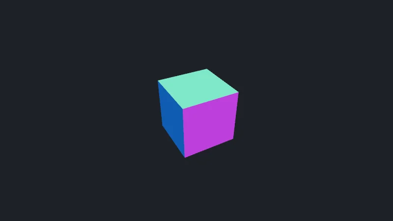

import { Tabs, TabItem } from '@astrojs/starlight/components';

Code : la page de la leçon [`src/01-scene/main.ts`](https://github.com/spareilleux/learn/blob/8e8f303/code/threejs/src/01-scene/main.ts), le même cube avec l'ancien renderer dans [`src/01-scene-webgl/main.ts`](https://github.com/spareilleux/learn/blob/8e8f303/code/threejs/src/01-scene-webgl/main.ts), le graphe de scène sans renderer dans [`scripts/l01-scene-graph.ts`](https://github.com/spareilleux/learn/blob/8e8f303/code/threejs/scripts/l01-scene-graph.ts), et la sonde qui ouvre une page dans Chromium headless et affiche ce qu'elle rapporte, [`scripts/probe.mjs`](https://github.com/spareilleux/learn/blob/8e8f303/code/threejs/scripts/probe.mjs).

## Ce qu'est three.js, pour un développeur WPF, MonoGame ou JavaFX

[three.js](https://threejs.org/) est une bibliothèque JavaScript qui dessine des scènes 3D dans un élément `<canvas>`. Elle occupe la place de la couche 3D en mode retenu de WPF, au-dessus de l'API GPU : tu décris des objets, une caméra et des lumières, et la bibliothèque les transforme en tampons GPU, en shaders et en appels de dessin. En dessous, le navigateur propose deux API GPU : [WebGL 2](https://registry.khronos.org/webgl/specs/latest/2.0/), fondée sur OpenGL ES 3.0, et [WebGPU](https://gpuweb.github.io/gpuweb/), une API plus récente conçue pour s'exécuter au-dessus de Direct3D 12, Metal et Vulkan.

| | WPF 3D | MonoGame | JavaFX 3D | three.js |
|---|---|---|---|---|
| La surface | [`Viewport3D`](https://learn.microsoft.com/dotnet/api/system.windows.controls.viewport3d) dans l'arbre visuel | la fenêtre d'un [`Game`](https://docs.monogame.net/api/Microsoft.Xna.Framework.Game.html) | [`SubScene`](https://openjfx.io/javadoc/25/javafx.graphics/javafx/scene/SubScene.html) dans le graphe de scène | un `<canvas>` que crée le renderer |
| Ce qui dessine | le moteur de composition de WPF | ta méthode `Draw`, via `GraphicsDevice` | Prism, le pipeline graphique de JavaFX | un objet renderer : `WebGPURenderer` ou `WebGLRenderer` |
| La caméra | [`PerspectiveCamera`](https://learn.microsoft.com/dotnet/api/system.windows.media.media3d.perspectivecamera), champ de vision horizontal | une matrice de projection que tu construis | [`PerspectiveCamera`](https://openjfx.io/javadoc/25/javafx.graphics/javafx/scene/PerspectiveCamera.html), champ de vision vertical par défaut | `PerspectiveCamera`, champ de vision vertical |
| Quand il dessine | quand quelque chose change | à chaque image, depuis la boucle de jeu | à chaque pulse | à chaque image que ta boucle rend |
| Axes | main droite, Y vers le haut | main droite, Y vers le haut | Y vers le bas | main droite, Y vers le haut |

La dernière ligne compte quand tu portes du code. La [documentation de WPF](https://learn.microsoft.com/dotnet/desktop/wpf/graphics-multimedia/3-d-graphics-overview#3d-coordinate-space) décrit les mêmes axes que three.js : X vers la droite, Y vers le haut, et Z vers l'observateur. La [`Matrix`](https://docs.monogame.net/api/Microsoft.Xna.Framework.Matrix.html) de MonoGame est aussi en main droite. JavaFX 3D garde sa convention 2D, avec [l'axe Y orienté vers le bas](https://openjfx.io/javadoc/25/javafx.graphics/javafx/scene/PerspectiveCamera.html).

Les versions sont les versions actuelles au 16 septembre 2026 : three.js **r186**, publié sur npm sous le nom `three` 0.186.0, avec les déclarations de types de [`@types/three`](https://www.npmjs.com/package/@types/three) 0.186.0, servi et empaqueté par [Vite](https://vite.dev/) 8.3.0 et vérifié avec TypeScript 7.0.2. three.js numérote ses versions : r186 est la 186e, et en 2026 une nouvelle est sortie tous les deux ou trois mois. L'API change de l'une à l'autre, et le [guide de migration](https://github.com/mrdoob/three.js/wiki/Migration-Guide) liste ce qui casse.

## Exécuter les scènes du cours

Le projet du cours, dans `code/threejs`, a une page HTML par scène. Vite les sert pendant le développement et les empaquette pour la production, comme dans le [cours React (Vite)](../../react-vite/01-vite-project/). [Playwright](https://playwright.dev/) les ouvre dans Chromium headless pour `check.sh`, qui a besoin de sa propre version de Chromium.

<Tabs syncKey="os">
<TabItem label="Windows">

```powershell
Set-Location code\threejs
npm ci
npx playwright install chromium chromium-headless-shell
npm run dev
# check.sh est un script Bash : lance-le depuis Git Bash
bash check.sh
```

</TabItem>
<TabItem label="Linux / WSL">

```bash
cd code/threejs
npm ci
# --with-deps installe aussi les bibliothèques système dont Chromium a besoin (sudo)
npx playwright install --with-deps chromium chromium-headless-shell
npm run dev
bash check.sh
```

</TabItem>
<TabItem label="macOS">

```bash
cd code/threejs
npm ci
npx playwright install chromium chromium-headless-shell
npm run dev
bash check.sh
```

</TabItem>
</Tabs>

`npm run dev` sert les pages sur le port 5188 : ouvre `http://localhost:5188/01-scene.html`. Pour démarrer ton propre projet, `three` est un paquet npm ordinaire, et `@types/three` donne ses types à TypeScript :

```bash
npm install three@0.186.0
npm install --save-dev @types/three@0.186.0
```

## Trois objets : un renderer, une scène et une caméra

Toute page three.js crée les trois mêmes objets. Voici le début de la page de la leçon ([`src/01-scene/main.ts`, lignes 1-21](https://github.com/spareilleux/learn/blob/8e8f303/code/threejs/src/01-scene/main.ts#L1-L21)) ; le module `probe.ts` qu'elle importe est le point d'accroche des tests du cours, décrit plus bas :

```ts
// Leçon 1 : une scène, une caméra, un renderer, une boucle d'animation, et un canvas qui suit la fenêtre
import * as THREE from 'three/webgpu';
import { backendName, forceWebGL, probing, report } from '../probe.ts';

const renderer = new THREE.WebGPURenderer({ antialias: true, forceWebGL });
renderer.setPixelRatio(Math.min(window.devicePixelRatio, 2));
renderer.setSize(window.innerWidth, window.innerHeight);
document.body.append(renderer.domElement);
// ?linear : écrire des valeurs linéaires dans le canvas, ce qui supprime la passe de sortie (la leçon 3 explique pourquoi elle existe)
if (new URLSearchParams(location.search).has('linear')) renderer.outputColorSpace = THREE.LinearSRGBColorSpace;

const scene = new THREE.Scene();
scene.background = new THREE.Color(0x1e2127);

// Champ de vision vertical de 50°, le rapport d'aspect de la fenêtre, et tout ce qui est entre 0.1 et 100 unités est dessiné
const camera = new THREE.PerspectiveCamera(50, window.innerWidth / window.innerHeight, 0.1, 100);
camera.position.set(0, 1.5, 4);
camera.lookAt(0, 0, 0);

const cube = new THREE.Mesh(new THREE.BoxGeometry(1, 1, 1), new THREE.MeshNormalMaterial());
scene.add(cube);
```

- Le **renderer** possède le `<canvas>`, dans `renderer.domElement`, et le périphérique GPU. `setSize` fixe la taille du canvas en pixels CSS, et `setPixelRatio` la multiplie pour le tampon de dessin : sur un écran à 200 %, un canvas de 800 par 450 dessine 1600 par 900 pixels. Le cours plafonne ce rapport à 2, parce que chaque cran supplémentaire multiplie les pixels à ombrer.
- La **scène** est la racine d'un arbre d'objets, comme les `Viewport3D.Children` de WPF. [`Scene`](https://threejs.org/docs/pages/Scene.html), [`Mesh`](https://threejs.org/docs/pages/Mesh.html), [`Group`](https://threejs.org/docs/pages/Group.html), les lumières et les caméras étendent toutes [`Object3D`](https://threejs.org/docs/pages/Object3D.html), qui porte une position, une rotation, une échelle et une liste d'enfants.
- La **caméra** est elle aussi un `Object3D`, mais elle n'a pas besoin d'être dans la scène : `renderer.render(scene, camera)` prend les deux. [`PerspectiveCamera`](https://threejs.org/docs/pages/PerspectiveCamera.html) prend un champ de vision vertical en degrés, un rapport d'aspect, et les distances proche et lointaine entre lesquelles les objets sont dessinés.
- Un **maillage** (mesh) est une géométrie et un matériau. [`MeshNormalMaterial`](https://threejs.org/docs/pages/MeshNormalMaterial.html) colore chaque face selon la direction vers laquelle elle est tournée et n'a besoin d'aucune lumière, ce qui en fait le matériau « hello world ». La leçon 2 en construit de vrais.



La capture d'écran est la troisième image de la page, prise par `node scripts/probe.mjs 01-scene --shot out/cube.png`, avec WebGPU sur la machine de l'auteur.

## WebGPURenderer et son repli

three.js a deux renderers. [`WebGLRenderer`](https://threejs.org/docs/pages/WebGLRenderer.html), importé depuis `'three'`, est le renderer depuis plus de dix ans. [`WebGPURenderer`](https://threejs.org/docs/pages/WebGPURenderer.html), importé depuis `'three/webgpu'`, est le nouveau : il s'adresse à WebGPU quand le navigateur le propose, et à WebGL 2 sinon. La [page du manuel consacrée à WebGPURenderer](https://threejs.org/manual/pages/webgpurenderer.html) l'appelle le « next-generation renderer », encore à l'état expérimental, et indique que `WebGLRenderer` reste maintenu sans nouvelles fonctionnalités majeures, puisque le projet se concentre sur `WebGPURenderer`. Le cours utilise `WebGPURenderer` dès la première leçon : les matériaux à nœuds de la leçon 6 et le post-traitement de la leçon 7 n'existent que là.

Le choix se fait dans le constructeur ([`WebGPURenderer.js` en r186, lignes 57-73](https://github.com/mrdoob/three.js/blob/r186/src/renderers/webgpu/WebGPURenderer.js#L57-L73)) :

```js
if ( parameters.forceWebGL ) {

	BackendClass = WebGLBackend;

} else {

	BackendClass = WebGPUBackend;

	parameters.getFallback = () => {

		warn( 'WebGPURenderer: WebGPU is not available, running under WebGL2 backend.' );

		return new WebGLBackend( parameters );

	};

}
```

Le périphérique WebGPU est demandé de façon asynchrone, donc un renderer n'est pas prêt quand son constructeur rend la main. `renderer.init()` renvoie une promesse qui se résout dès qu'un backend fonctionne, et `setAnimationLoop` appelle lui-même `init()` avant de démarrer la boucle ([`Renderer.js`, lignes 2067-2073](https://github.com/mrdoob/three.js/blob/r186/src/renderers/common/Renderer.js#L2067-L2073)). Le `await renderer.init()` à la fin de la page ne sert qu'à attendre pour afficher le backend dans le titre de l'onglet.

Le backend utilisé dépend du navigateur et de la machine, pas du code. `scripts/probe.mjs` ouvre la page avec `?probe` ; après trois images, la page rapporte le backend, le GPU qui a répondu, et les compteurs du renderer. Sur la machine de l'auteur (Windows 11, une NVIDIA GeForce RTX 5080), dans le mode headless de Chromium 153 :

```text
$ node scripts/probe.mjs 01-scene
{
  "backend": "WebGPU",
  "gpu": "nvidia, blackwell",
  "frame": 4,
  "render": {
    "calls": 6,
    "drawCalls": 2,
    "triangles": 13
  },
  "memory": {
    "geometries": 2,
    "textures": 2,
    "programs": 4
  },
  "canvas": [800, 450],
  "pixelRatio": 1,
  "coordinateSystem": "WebGPU"
}
```

Avec `?webgl`, la page passe `forceWebGL: true`. Les compteurs sont les mêmes ; le GPU est désormais atteint via [ANGLE](https://chromium.googlesource.com/angle/angle), que Chromium sous Windows utilise pour exécuter WebGL sur Direct3D 11 :

```text
$ node scripts/probe.mjs 01-scene --webgl
{
  "backend": "WebGL 2",
  "gpu": "ANGLE (NVIDIA, NVIDIA GeForce RTX 5080 (0x00002C02) Direct3D11 vs_5_0 ps_5_0, D3D11)",
  ...
  "coordinateSystem": "WebGL"
}
```

Playwright fournit deux navigateurs headless. `chromium` exécute le nouveau mode headless de Chromium, celui utilisé plus haut. `chromium-headless-shell` est une version plus légère, et sur la même machine, il n'a aucun adaptateur WebGPU : le navigateur affiche un avertissement, three.js affiche le sien, et la page tourne sur WebGL 2 via [SwiftShader](https://github.com/google/swiftshader), un GPU émulé sur le CPU :

```text
$ PROBE_CHANNEL=chromium-headless-shell node scripts/probe.mjs 01-scene
console.warning: No available adapters.
console.warning: THREE.WebGPURenderer: WebGPU is not available, running under WebGL2 backend.
{
  "backend": "WebGL 2",
  "gpu": "ANGLE (Google, Vulkan 1.3.0 (SwiftShader Device (Subzero) (0x0000C0DE)), SwiftShader driver)",
  ...
}
```

Les runners GitHub n'ont pas de GPU. Sur chacun d'eux, `check.sh` a affiché :

| Image du runner | Mode headless de Chromium | Headless shell de Chromium |
|---|---|---|
| `ubuntu-24.04` | WebGL 2 après l'avertissement de repli, sur `SwiftShader Device (Subzero)` | la même chose |
| `windows-2025-vs2026` | WebGL 2 après l'avertissement de repli, sur `SwiftShader Device (Subzero)` | la même chose |
| `macos-26-arm64` | **WebGPU**, adaptateur `apple` ; avec `?webgl`, `ANGLE Metal Renderer: Apple Paravirtual device` | WebGL 2 après l'avertissement de repli, sur `SwiftShader Device (LLVM 10.0.0)` |

Le runner macOS est une machine virtuelle avec un GPU Apple paravirtualisé, et Chromium y propose WebGPU ; les runners Linux et Windows n'ont pas de GPU, et même le mode headless complet de Chromium se replie sur SwiftShader (exécution [35115118564](https://github.com/spareilleux/learn/actions/runs/35115118564)).

Le code n'a pas changé, et chaque compteur était identique sur tous ; seules quelques couleurs de pixels de la leçon 3 différaient, d'une unité. C'est la promesse du repli, et aussi son piège : une page peut tourner sur WebGL 2 pendant des mois sans que personne ne s'en aperçoive. Journalise le backend, comme le fait le cours dans le titre de la page.

`coordinateSystem` est le seul champ qui suit le backend. L'espace de découpage de WebGL va de −1 à 1 en profondeur, celui de WebGPU de 0 à 1, et le renderer construit la matrice de projection de la caméra pour le backend sur lequel il tourne. Ton code ne le voit pas, sauf s'il construit lui-même des matrices de projection.

## La boucle d'animation

```ts
const timer = new THREE.Timer();
timer.connect(document);
let frames = 0;

renderer.setAnimationLoop((time) => {
  timer.update(time);
  // Sonde : les mêmes angles sur toutes les machines, quelle que soit la cadence d'images
  cube.rotation.y = probing ? frames * 0.25 : timer.getElapsed();
  cube.rotation.x = cube.rotation.y / 2;
  renderer.render(scene, camera);
  frames++;
```

[`setAnimationLoop`](https://threejs.org/docs/pages/Renderer.html#setAnimationLoop) appelle la fonction de rappel avant chaque image que peint le navigateur, avec `time` en millisecondes, comme `requestAnimationFrame`, qu'il utilise en dessous. Trois raisons de le préférer : il attend `init()`, il se met en pause quand l'onglet est masqué puisque le navigateur cesse de peindre, et en WebXR (leçon 11), c'est le casque, et non la page, qui cadence les images, ce que `setAnimationLoop` gère et que `requestAnimationFrame` ne gère pas. `setAnimationLoop(null)` l'arrête.

Il n'y a pas de séparation entre `Update` et `Draw` comme dans MonoGame : la fonction de rappel modifie la scène, puis fait le rendu. Rien n'est dessiné tant que la fonction de rappel n'appelle pas `render()` ; contrairement à WPF, three.js ne garde aucune image de la scène, et ne redessine pas de lui-même quand un objet change.

[`Timer`](https://threejs.org/docs/pages/Timer.html) mesure le temps entre les images. Il a remplacé [`Clock`](https://threejs.org/docs/pages/Clock.html), déprécié depuis r183, dont le constructeur avertit désormais : `Clock: This module has been deprecated. Please use THREE.Timer instead.` Un `Timer` est mis à jour une fois par image avec l'horodatage de la boucle, de sorte que chaque appel à `getDelta()` dans la même image renvoie la même valeur, et `connect(document)` lui fait ignorer le temps passé dans un onglet masqué.

La sonde n'utilise pas l'horloge : elle fixe l'angle à partir du numéro de l'image, si bien que le cube est dans la même position sur toutes les machines, quelle que soit la cadence d'images.

## Ce que compte renderer.info

`renderer.info` est le seul profileur intégré à three.js, et les compteurs ci-dessus racontent déjà une histoire. Il y a un seul cube, 12 triangles, et pourtant le renderer rapporte **2 appels de dessin et 13 triangles** par image :

- `render.drawCalls` et `render.triangles` comptent la dernière image. Le renderer les remet à zéro au début de chaque image d'animation ([`Animation.js`](https://github.com/mrdoob/three.js/blob/r186/src/renderers/common/Animation.js)), donc la page les lit juste après `render()`, à l'intérieur de la boucle.
- `render.calls` compte les appels à `render()` depuis le début : 6 pour 3 images, 2 par image.
- `frame` vaut 4 après 3 images rendues, parce que la boucle fait un tour pendant `init()`, avant que la fonction de rappel ne soit définie.

Le second appel de dessin, avec son unique triangle, est la **passe de sortie**. `WebGPURenderer` dessine la scène dans une render target interne en couleur linéaire, puis dessine cette cible sur le canvas avec un triangle qui couvre l'écran, en convertissant en sRGB et en appliquant le tone mapping au passage. Le code source du renderer le dit : « Unlike in `WebGLRenderer`, this is done in a separate render pass and not inline to achieve more correct results » ([`Renderer.js`, lignes 1553-1561](https://github.com/mrdoob/three.js/blob/r186/src/renderers/common/Renderer.js#L1553-L1561)). La géométrie supplémentaire, les deux textures supplémentaires (la couleur et la profondeur de la render target) et les programmes de shaders supplémentaires viennent de là. Avec `?linear`, la page règle `renderer.outputColorSpace` sur linéaire, aucune conversion n'est nécessaire, et la passe disparaît :

```text
$ node scripts/probe.mjs 01-scene --query linear
{
  "backend": "WebGPU",
  "gpu": "nvidia, blackwell",
  "frame": 4,
  "render": {
    "calls": 3,
    "drawCalls": 1,
    "triangles": 12
  },
  "memory": {
    "geometries": 1,
    "textures": 0,
    "programs": 2
  },
  ...
}
```

Les couleurs sont alors fausses, ce qu'explique la leçon 3. Le même cube avec `WebGLRenderer`, depuis `'three'`, convertit plutôt les couleurs dans le shader de chaque matériau : un seul appel de dessin, pas de render target. Son objet `info` a une autre forme, sans `drawCalls`, et `calls` compte les appels de dessin de la dernière image :

```text
$ node scripts/probe.mjs 01-scene-webgl
{
  "backend": "WebGLRenderer",
  "render": {
    "frame": 3,
    "calls": 1,
    "triangles": 12
  },
  "memory": {
    "geometries": 1,
    "textures": 0,
    "programs": 1
  }
}
```

## Le graphe de scène, sans renderer

Le cœur de three.js tourne dans Node.js : les objets, les mathématiques et la sérialisation n'ont pas besoin de GPU. [`scripts/l01-scene-graph.ts`](https://github.com/spareilleux/learn/blob/8e8f303/code/threejs/scripts/l01-scene-graph.ts) place une mécanique d'accord dans une guitare déplacée de 2 unités le long de X et tournée d'un quart de tour autour de Y, puis projette quelques points avec une caméra placée à 5 unités :

```text
$ node scripts/l01-scene-graph.ts
local position of the peg: [ 1, 0, 0 ]
matrixWorld before any update: [ 0, 0, 0 ]
getWorldPosition(): [ 2, 0, -1 ]
[0,0,0] -> NDC [0,0,0.962]
[1,0,0] -> NDC [0.241,0,0.962]
[0,1,0] -> NDC [0,0.429,0.962]
[0,0,-95] -> NDC [0,0,1]
toJSON: {
  metadata: { version: 4.7, type: 'Object', generator: 'Object3D.toJSON' },
  geometries: 1,
  materials: 1,
  children: [ 'Group guitar' ]
}
```

- `position`, `rotation` et `scale` sont locales au parent, comme une `Transform3D` de WPF est locale à son modèle. Un quart de tour autour de Y amène l'axe X local sur −Z dans le monde, donc la mécanique se retrouve en (2, 0, −1).
- **`matrixWorld` est un cache.** Modifier une position ne change rien d'autre tant que quelque chose ne recalcule pas les matrices : `renderer.render()` le fait pour toute la scène, `getWorldPosition()` pour un objet. Du code qui lit `matrixWorld` avant le premier rendu lit l'identité.
- `project(camera)` donne des coordonnées normalisées de périphérique : X et Y de −1 à 1 d'un bord à l'autre de l'écran, et une profondeur qui n'est pas linéaire. L'origine, à 5 unités, est déjà à 0.962, et le plan lointain, à 100 unités, à 1. L'essentiel de la plage de profondeur va aux objets proches du plan proche, c'est pourquoi `near` ne devrait pas être plus petit que ce dont la scène a besoin. Dans Node.js, la caméra utilise l'espace de découpage de WebGL.
- `toJSON()` écrit la scène dans le [format JSON de three.js](https://github.com/mrdoob/three.js/wiki/JSON-Object-Scene-format-4), avec les géométries et les matériaux listés une seule fois et référencés par UUID. C'est ainsi que l'éditeur de [threejs.org/editor](https://threejs.org/editor/) enregistre les scènes ; ce n'est pas un format d'échange : la leçon 4 utilise glTF pour cela.

Les types de ce JSON sont faux dans `@types/three` 0.186.0. Ils déclarent `children` comme un tableau de chaînes et aucun `geometries` ni `materials` à la racine, alors que [`Object3D.toJSON()`](https://github.com/mrdoob/three.js/blob/r186/src/core/Object3D.js#L1518-L1552) écrit les enfants sous forme d'objets et ajoute les deux tableaux. Le script convertit le résultat vers sa propre interface ; sans cette conversion, `tsc` rejette du code qui fonctionne ([`errors/l01_tojson_types.ts`](https://github.com/spareilleux/learn/blob/8e8f303/code/threejs/errors/l01_tojson_types.ts)) :

```text
errors/l01_tojson_types.ts(7,18): error TS2339: Property 'geometries' does not exist on type 'SceneJSON'.
errors/l01_tojson_types.ts(8,56): error TS2339: Property 'type' does not exist on type 'string'.
```

`@types/three` n'est pas écrit par l'équipe de three.js : il est développé dans [three-types/three-ts-types](https://github.com/three-types/three-ts-types) et publié via [DefinitelyTyped](https://github.com/DefinitelyTyped/DefinitelyTyped/tree/master/types/three). Sa version suit celle de three.js, mais c'est une description distincte de la bibliothèque, et elle peut être fausse.

## Le redimensionnement

```ts
window.addEventListener('resize', () => {
  camera.aspect = window.innerWidth / window.innerHeight;
  camera.updateProjectionMatrix();
  renderer.setSize(window.innerWidth, window.innerHeight);
});
```

Deux choses doivent suivre la fenêtre. Le rapport d'aspect de la caméra, sinon le cube s'étire ; et la caméra met sa matrice de projection en cache, donc `updateProjectionMatrix()` doit suivre toute modification de `fov`, `aspect`, `near` ou `far`. Ensuite, le canvas et son tampon de dessin, via `setSize`. Un canvas placé dans une mise en page plutôt que sur toute la fenêtre devrait surveiller sa propre taille avec un [`ResizeObserver`](https://developer.mozilla.org/docs/Web/API/ResizeObserver) au lieu de l'événement `resize` de la fenêtre.

## Ce que pèse le renderer

`vite build` empaquette les pages pour la production. La configuration Vite du cours place chacun des fichiers de build de three.js dans son propre chunk, pour qu'on puisse lire les tailles directement :

```text
dist/assets/three.core-p_ik4R10.js           249.85 kB │ gzip:  64.99 kB
dist/assets/three.module-CFLRzNqX.js         352.34 kB │ gzip:  84.70 kB
dist/assets/three.webgpu-DyXHSfxk.js         581.15 kB │ gzip: 162.14 kB
```

La page avec `WebGLRenderer` charge `three.core` et `three.module` : 602 kB, 150 kB compressés. La page avec `WebGPURenderer` charge `three.core` et `three.webgpu` : 831 kB, 227 kB compressés, pour un cube qui tourne. Le système de nœuds et les deux backends y sont, que la scène s'en serve ou non. Vite avertit pour tout chunk de plus de 500 kB : `(!) Some chunks are larger than 500 kB after minification.`

## Dans GuitarAlchemist/ga

Le [`ThreeFretboard.tsx`](https://github.com/GuitarAlchemist/ga/blob/05c8eda013f2a4d11efaa52c4ca94674521ee684/ReactComponents/ga-react-components/src/components/ThreeFretboard.tsx#L152-L211) de GA crée un `WebGPURenderer` avec `samples: 8`, attend `init()`, et intercepte une erreur pour se replier sur `WebGLRenderer`, au commit `05c8eda` :

```tsx
            await renderer.init();

            // Check again after async init
            if (!isMounted) {
              renderer.dispose();
              return;
            }

            console.log('✅ ThreeFretboard: Using WebGPU renderer with 8x MSAA');
            setIsWebGPU(true);
          } catch (error) {
            console.warn('ThreeFretboard: WebGPU initialization failed, falling back to WebGL:', error);
            renderer = null;
          }
```

Les mesures de cette leçon disent ce qui se passe sur une machine sans adaptateur WebGPU : `init()` ne lève pas d'exception, parce que `WebGPURenderer` est déjà passé à son backend WebGL 2. Le `catch` ne s'exécute pas, la console affiche « Using WebGPU renderer », et deux lignes plus loin (ligne 201), le composant appelle `setIsWebGPU(true)` pour tous les renderers. Les ombres ne sont activées que pour un `WebGLRenderer` (ligne 208), donc un `WebGPURenderer` qui tourne sur WebGL 2 n'en a aucune. Interroger le renderer, avec `renderer.backend.isWebGPUBackend`, donnerait la vraie réponse. Que 8 échantillons soient acceptés sur chaque backend est *à vérifier* : la [spécification WebGPU](https://gpuweb.github.io/gpuweb/#dom-gputexturedescriptor-samplecount) autorise 1 ou 4 comme nombre d'échantillons d'une texture.

Deux autres points, tirés du même fichier et du reste des composants React de GA :

- Le rapport de pixels est `Math.min(window.devicePixelRatio * 3, 6)` (ligne 204) : sur un écran ordinaire, trois fois plus de pixels dans chaque direction que ce qu'affiche le canvas, soit neuf fois le travail d'ombrage.
- Il n'y a pas d'écouteur de redimensionnement : la largeur et la hauteur sont des dépendances de l'effet React, donc une nouvelle taille reconstruit toute la scène.
- Sur les 139 fichiers sous `src` qui importent three.js, 33 utilisent `requestAnimationFrame` et 3 utilisent `setAnimationLoop` ; 29 créent un `WebGLRenderer` et 8 un `WebGPURenderer` ; 15 créent une `Clock`, dépréciée depuis r183. GA demande three.js 0.180, où `Clock` n'était pas encore dépréciée.

Ces constats sont dans le [journal](../journal/).

## À retenir

- Une page three.js, c'est un renderer, une scène et une caméra ; rien n'est dessiné tant que la boucle n'appelle pas `render()`.
- `WebGPURenderer`, depuis `three/webgpu`, choisit WebGPU ou WebGL 2 à l'exécution. Le code ne change pas, alors journalise le backend : les navigateurs headless et les machines sans GPU se replient en silence, à part un avertissement dans la console.
- Utilise `setAnimationLoop` et `Timer`, pas `requestAnimationFrame` et `Clock`.
- `renderer.info` compte par image et se remet à zéro à chaque image : avec `WebGPURenderer`, un appel de dessin et un triangle vont à la passe de sortie.
- Les positions sont locales au parent ; `matrixWorld` est un cache que `render()` met à jour.
- `@types/three` est un projet distinct et peut contredire la bibliothèque.

## Exercices

1. Prédis `render.drawCalls`, `render.triangles` et `memory.geometries` quand la page affiche trois cubes qui partagent une géométrie et un matériau (`?cubes=3`). Vérifie avec `node scripts/probe.mjs 01-scene --query cubes=3`.
2. Dans `scripts/l01-scene-graph.ts`, la guitare est aussi mise à l'échelle d'un facteur 2. Où se trouve la mécanique dans l'espace du monde ? Et quelle position locale placerait la mécanique à l'origine du monde, sans changer son parent ? Vérifie avec [`scripts/l01-exercises.ts`](https://github.com/spareilleux/learn/blob/8e8f303/code/threejs/scripts/l01-exercises.ts).
3. Ouvre la page dans ton propre navigateur avec `npm run dev`, puis, dans ses outils de développement, exécute `navigator.gpu` et `await navigator.gpu?.requestAdapter()`. Quel backend la page devrait-elle choisir ? Compare avec le titre de l'onglet.

<details>
<summary>Solution 1</summary>

```text
$ node scripts/probe.mjs 01-scene --query cubes=3
{
  "backend": "WebGPU",
  "gpu": "nvidia, blackwell",
  "frame": 4,
  "render": {
    "calls": 6,
    "drawCalls": 4,
    "triangles": 37
  },
  "memory": {
    "geometries": 2,
    "textures": 2,
    "programs": 4
  },
  ...
}
```

Chaque maillage est un appel de dessin, quoi qu'il partage : 3 pour les cubes et 1 pour la passe de sortie, 36 triangles plus 1. Le GPU garde une seule copie de la géométrie partagée, donc `geometries` vaut toujours 2, et le matériau n'est compilé qu'une fois. Le partage économise de la mémoire et de la compilation, pas des appels de dessin ; la leçon 8 utilise l'instanciation pour dessiner de nombreuses copies en un seul appel.

</details>

<details>
<summary>Solution 2</summary>

```text
$ node scripts/l01-exercises.ts
peg in world space, guitar scaled by 2: [ 2, 0, -2 ]
world (0, 0, 0) in the guitar's local space: [ 0, 0, -1 ]
```

La mise à l'échelle s'applique avant la rotation et la translation : (1, 0, 0) devient (2, 0, 0), puis (0, 0, −2) après le quart de tour, puis (2, 0, −2). [`worldToLocal`](https://threejs.org/docs/pages/Object3D.html#worldToLocal) applique l'inverse de la `matrixWorld` du parent : donner à `peg.position` la valeur (0, 0, −1) place la mécanique à l'origine.

</details>

<details>
<summary>Solution 3</summary>

La réponse dépend de ta machine. Si `navigator.gpu` vaut `undefined`, le navigateur n'a pas du tout WebGPU ; si `requestAdapter()` se résout en `null`, il a l'API mais aucun adaptateur, comme le headless shell plus haut. Dans les deux cas, le titre indique `Lesson 1 — WebGL 2`. L'[état des implémentations de WebGPU](https://github.com/gpuweb/gpuweb/wiki/Implementation-Status) liste les navigateurs et les systèmes qui l'activent par défaut ; je n'ai vérifié que Chromium 153 sur les machines ci-dessus (*à vérifier* ailleurs).

</details>

## Sources

- Manuel de three.js : [Creating a scene](https://threejs.org/manual/pages/creating-a-scene.html), [Fundamentals](https://threejs.org/manual/pages/fundamentals.html), [Responsive design](https://threejs.org/manual/pages/responsive.html), [WebGPURenderer](https://threejs.org/manual/pages/webgpurenderer.html)
- Documentation de three.js : [`WebGPURenderer`](https://threejs.org/docs/pages/WebGPURenderer.html), [`Renderer`](https://threejs.org/docs/pages/Renderer.html), [`Object3D`](https://threejs.org/docs/pages/Object3D.html), [`PerspectiveCamera`](https://threejs.org/docs/pages/PerspectiveCamera.html), [`Timer`](https://threejs.org/docs/pages/Timer.html), et le [guide de migration](https://github.com/mrdoob/three.js/wiki/Migration-Guide)
- Code source de three.js en r186 : [`WebGPURenderer.js`](https://github.com/mrdoob/three.js/blob/r186/src/renderers/webgpu/WebGPURenderer.js), [`Renderer.js`](https://github.com/mrdoob/three.js/blob/r186/src/renderers/common/Renderer.js), [`Info.js`](https://github.com/mrdoob/three.js/blob/r186/src/renderers/common/Info.js)
- [WebGPU](https://gpuweb.github.io/gpuweb/), W3C, et l'[API WebGPU](https://developer.mozilla.org/docs/Web/API/WebGPU_API) sur MDN
- Microsoft : [vue d'ensemble des graphiques 3D](https://learn.microsoft.com/dotnet/desktop/wpf/graphics-multimedia/3-d-graphics-overview) ; MonoGame : [`Matrix`](https://docs.monogame.net/api/Microsoft.Xna.Framework.Matrix.html) ; JavaFX : [`PerspectiveCamera`](https://openjfx.io/javadoc/25/javafx.graphics/javafx/scene/PerspectiveCamera.html)
- Playwright : [Browsers](https://playwright.dev/docs/browsers)
