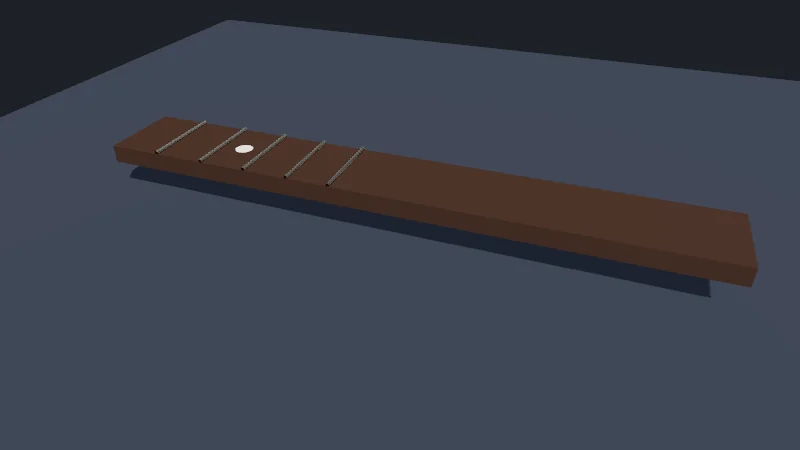
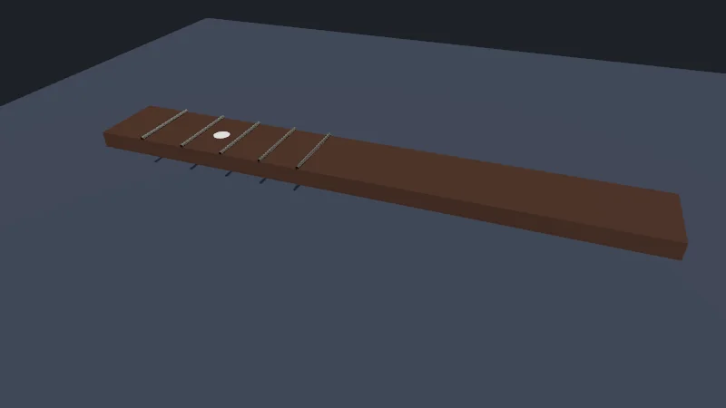

Code : la page de la leçon [`src/02-materials-lights/main.ts`](https://github.com/spareilleux/learn/blob/8e8f303/code/threejs/src/02-materials-lights/main.ts), le décompte des géométries et les valeurs par défaut des matériaux dans [`scripts/l02-geometries.ts`](https://github.com/spareilleux/learn/blob/8e8f303/code/threejs/scripts/l02-geometries.ts), et les exercices dans [`scripts/l02-exercises.ts`](https://github.com/spareilleux/learn/blob/8e8f303/code/threejs/scripts/l02-exercises.ts).

## La scène

La leçon 1 a dessiné un cube avec un matériau qui n'a besoin d'aucune lumière. Cette leçon construit un morceau de manche de guitare posé sur une table : une touche en palissandre, cinq frettes en maillechort, un repère en nacre, une lumière de ciel et un soleil qui projette des ombres. Chaque pièce est une primitive three.js.



La capture d'écran provient de `node scripts/probe.mjs 02-materials-lights --shot out/neck.png`, dans Chromium headless sur la machine de l'auteur, avec WebGPU.

| | WPF 3D | MonoGame | three.js |
|---|---|---|---|
| Géométrie | [`MeshGeometry3D`](https://learn.microsoft.com/dotnet/api/system.windows.media.media3d.meshgeometry3d) : `Positions`, `Normals`, `TextureCoordinates`, `TriangleIndices` | `VertexBuffer` et `IndexBuffer` | [`BufferGeometry`](https://threejs.org/docs/pages/BufferGeometry.html) : des attributs nommés et un index |
| Formes intégrées | aucune | aucune | boîte, plan, sphère, cylindre, tore et d'autres |
| Matériau | [`DiffuseMaterial`](https://learn.microsoft.com/dotnet/api/system.windows.media.media3d.diffusematerial), `SpecularMaterial`, `EmissiveMaterial` | [`BasicEffect`](https://docs.monogame.net/api/Microsoft.Xna.Framework.Graphics.BasicEffect.html) : diffus, spéculaire, trois lumières directionnelles | `MeshStandardMaterial`, `MeshPhysicalMaterial` : metalness et roughness |
| Lumières | `AmbientLight`, `DirectionalLight`, `PointLight`, `SpotLight` | ce que calcule l'effet | les quatre mêmes, plus `HemisphereLight`, en unités physiques |
| Ombres | aucune | ta propre shadow map | des shadow maps, activées par renderer, par lumière et par objet |

## Ce que contient une géométrie

Une [`BufferGeometry`](https://threejs.org/docs/pages/BufferGeometry.html) est un ensemble de tableaux typés que le renderer envoie tels quels au GPU : un attribut par propriété de sommet, `position`, `normal` et `uv`, et un index facultatif qui liste les triangles par numéro de sommet. Les primitives ne font que remplir ces tableaux. [`scripts/l02-geometries.ts`](https://github.com/spareilleux/learn/blob/8e8f303/code/threejs/scripts/l02-geometries.ts) affiche ce que contiennent les géométries de la scène, sans renderer :

```text
$ node scripts/l02-geometries.ts
BoxGeometry(1, 1, 1)                       position 24×3, normal 24×3, uv 24×2; index 36; triangles 12; groups 6
PlaneGeometry(8, 8)                        position 4×3, normal 4×3, uv 4×2; index 6; triangles 2; groups 0
CircleGeometry(0.06, 32)                   position 34×3, normal 34×3, uv 34×2; index 96; triangles 32; groups 0
CylinderGeometry(0.012, 0.012, 0.55, 12)   position 76×3, normal 76×3, uv 76×2; index 144; triangles 48; groups 3
SphereGeometry(1, 32, 16)                  position 561×3, normal 561×3, uv 561×2; index 2880; triangles 960; groups 0
normals at the corner (0.5, 0.5, 0.5): (1, 0, 0) (0, 1, 0) (0, 0, 1)
MeshStandardMaterial: { color: 'ffffff', roughness: 1, metalness: 0 }
MeshPhysicalMaterial: { ior: 1.5, reflectivity: 0.5, clearcoat: 0, transmission: 0 }
PointLight with power 800 lm: { intensity: 63.66, decay: 2, distance: 0 }
```

- **Un cube a 24 sommets, pas 8.** Un sommet, c'est une position *et* une normale et un UV. Chaque coin appartient à trois faces orientées dans trois directions, donc la boîte le stocke trois fois, comme le montrent les dernières lignes pour le coin (0.5, 0.5, 0.5). Le `MeshGeometry3D` de WPF fonctionne de la même façon : partager une position entre des faces partage sa normale, et les arêtes paraissent arrondies.
- Les **groupes** divisent une géométrie en parties qui peuvent recevoir des matériaux différents : une boîte en a un par face, un cylindre un pour son côté et un pour chaque extrémité. Passer un tableau de matériaux à un `Mesh` les utilise.
- Les paramètres qui suivent la taille sont les **segments**. `CylinderGeometry(…, 12)` a 12 côtés, ce qui suffit pour une frette aussi fine vue de loin ; les 32 segments du repère servent à son bord arrondi. Les segments coûtent des triangles, et ce sont les triangles que compte `renderer.info`.
- `SphereGeometry(1, 32, 16)` a 32 × 16 quadrilatères, ce qui ferait 1 024 triangles, mais en rapporte 960 : à chaque pôle, une rangée de quadrilatères se réduit à des triangles, et les moitiés dégénérées sont omises (exercice 1).
- Un `PlaneGeometry` est dans le plan XY, tourné vers +Z. La table est tournée de −90° autour de X pour faire face vers le haut ; une face avant vue de derrière n'est pas dessinée, sauf si le matériau définit `side: THREE.DoubleSide`.

## Les matériaux à base physique

Le manche, les frettes et le repère utilisent deux matériaux ([`main.ts`, lignes 31-63](https://github.com/spareilleux/learn/blob/8e8f303/code/threejs/src/02-materials-lights/main.ts#L31-L63)) :

```ts
// Le manche : le palissandre est un diélectrique (metalness 0) à la surface rugueuse
const neck = new THREE.Mesh(
  new THREE.BoxGeometry(4, 0.12, 0.55),
  new THREE.MeshStandardMaterial({ color: 0x4a2c1d, metalness: 0, roughness: 0.75 }),
);
neck.position.y = 0.3;
// ?neckshadow=off : le manche reçoit des ombres mais n'en projette aucune (exercice 3)
neck.castShadow = params.get('neckshadow') !== 'off';
neck.receiveShadow = true;
scene.add(neck);

// Frettes : du maillechort, un métal, donc metalness 1 et la couleur teinte les reflets
const fretMaterial = new THREE.MeshStandardMaterial({ color: 0xc9c5bd, metalness: 1, roughness: 0.3 });
const fretGeometry = new THREE.CylinderGeometry(0.012, 0.012, 0.55, 12);
for (let fret = 1; fret <= 5; fret++) {
  // Chaque frette est à diapason × (1 − 2^(−n/12)) du sillet, ici avec un diapason de 6.5 unités
  const x = -2 + 6.5 * (1 - 2 ** (-fret / 12));
  const mesh = new THREE.Mesh(fretGeometry, fretMaterial);
  mesh.rotation.x = Math.PI / 2;
  mesh.position.set(x, 0.37, 0);
  mesh.castShadow = true;
  scene.add(mesh);
}

// Un repère : de la nacre, avec un vernis que MeshPhysicalMaterial ajoute par-dessus le modèle standard
const inlay = new THREE.Mesh(
  new THREE.CircleGeometry(0.06, 32),
  new THREE.MeshPhysicalMaterial({ color: 0xf2efe6, roughness: 0.4, clearcoat: 1, clearcoatRoughness: 0.05, iridescence: 0.6 }),
);
inlay.rotation.x = -Math.PI / 2;
// Entre la deuxième et la troisième frette, là où une guitare a son premier repère
inlay.position.set(-1.13, 0.361, 0);
scene.add(inlay);
```

Le `DiffuseMaterial` de WPF et le `BasicEffect` de MonoGame utilisent le modèle d'éclairage classique : une couleur diffuse, et une couleur spéculaire avec une puissance qui règle la taille du reflet. Les valeurs ont l'air justes sous une lumière et fausses sous une autre. [`MeshStandardMaterial`](https://threejs.org/docs/pages/MeshStandardMaterial.html) est **à base physique** : il décrit la surface, et le renderer en déduit comment la lumière s'y réfléchit. Le modèle est le modèle metallic-roughness de glTF 2.0 (leçon 4), donc un matériau exporté depuis Blender arrive avec les mêmes valeurs.

- **`metalness`** vaut 0 pour un diélectrique, comme le bois, le plastique, la peau ou la pierre, et 1 pour un métal. Un diélectrique montre sa couleur en lumière diffuse et réfléchit un peu de lumière blanche aux angles rasants ; un métal n'a pas de composante diffuse, et sa couleur teinte le reflet. Les valeurs intermédiaires servent aux transitions, comme la rouille sur du métal, pas aux matériaux « légèrement métalliques ».
- **`roughness`** va de 0, un miroir, à 1, une surface mate. Il floute le reflet et élargit la tache spéculaire en même temps, au lieu de la puissance spéculaire séparée du modèle classique.
- **`color`** est l'albédo, la couleur de la surface sans éclairage : les valeurs hexadécimales sont en sRGB, et le renderer les convertit en valeurs linéaires, comme le mesure la leçon 3.
- Les valeurs par défaut affichées plus haut correspondent à un diélectrique blanc et entièrement rugueux : `color: 'ffffff', roughness: 1, metalness: 0`.

[`MeshPhysicalMaterial`](https://threejs.org/docs/pages/MeshPhysicalMaterial.html) étend le matériau standard avec des couches pour les surfaces que le standard ne sait pas décrire : `clearcoat` pour le vernis ou la peinture de carrosserie, `iridescence` pour les reflets irisés de la nacre ou des bulles de savon, `sheen` pour les tissus, `transmission` pour le verre. Chaque couche coûte du travail au shader, alors ne l'utilise que là où elle se voit.

Avec `WebGPURenderer`, les deux matériaux sont convertis en coulisses en matériaux à nœuds, `MeshStandardNodeMaterial` et `MeshPhysicalNodeMaterial`, que la leçon 6 étend avec TSL.

## Des lumières en unités physiques

```ts
// Une lumière de ciel et de sol éclaire les ombres ; une lumière directionnelle, comme le soleil, les projette
scene.add(new THREE.HemisphereLight(0xdde6ff, 0x302820, 1.2));
const sun = new THREE.DirectionalLight(0xffffff, 3);
sun.position.set(2, 4, 3);
```

- Une [`DirectionalLight`](https://threejs.org/docs/pages/DirectionalLight.html) envoie des rayons parallèles depuis sa position vers sa cible, l'origine par défaut, comme le soleil. Seule la direction compte, pas la distance.
- Une [`HemisphereLight`](https://threejs.org/docs/pages/HemisphereLight.html) mélange une couleur de ciel venant d'en haut et une couleur de sol venant d'en bas, selon l'orientation de chaque surface. C'est un substitut bon marché de la lumière que renvoie une vraie pièce ; la leçon 3 la remplace par une carte d'environnement.
- Une [`PointLight`](https://threejs.org/docs/pages/PointLight.html) éclaire dans toutes les directions à partir d'un point, et une [`SpotLight`](https://threejs.org/docs/pages/SpotLight.html) dans un cône. Leur lumière décroît avec le carré de la distance (`decay: 2`), et `distance: 0` signifie aucune coupure.

Depuis r155, three.js utilise par défaut des unités physiques ([guide de migration](https://github.com/mrdoob/three.js/wiki/Migration-Guide#154--155)), et le code source de r186 n'a plus l'option `useLegacyLights` qui rétablissait l'ancien comportement. L'intensité d'une lumière ponctuelle ou d'un spot est en candelas, et sa propriété `power` convertit depuis les lumens : 800 lm, une ampoule domestique courante, font 800 / 4π ≈ 63.66 cd, comme l'a affiché le script. Les lumières directionnelles et hémisphériques n'ont pas de position à partir de laquelle décroître ; leur intensité s'applique partout de la même façon. Les unités de la scène comptent alors : la décroissance en carré inverse traite une unité comme un mètre, donc une scène modélisée en centimètres a besoin de lumières 10 000 fois plus fortes pour avoir le même aspect (*à vérifier* sur une scène à toi).

## Les ombres

Les ombres s'activent explicitement à trois niveaux, et les trois sont nécessaires :

```ts
renderer.shadowMap.enabled = shadows;
renderer.shadowMap.type = THREE.PCFShadowMap;
```

```ts
sun.castShadow = true;
sun.shadow.mapSize.set(1024, 1024);
// La caméra d'ombre est orthographique : la boîte qu'elle couvre est le seul endroit où des ombres peuvent tomber
Object.assign(sun.shadow.camera, { left: -3, right: 3, top: 3, bottom: -3, near: 0.5, far: 12 });
sun.shadow.camera.updateProjectionMatrix();
```

et chaque maillage indique s'il projette des ombres, s'il en reçoit, ou les deux (`castShadow`, `receiveShadow`).

Une **shadow map** est une image de profondeur rendue depuis la lumière : avant de dessiner la scène, le renderer dessine les objets qui projettent des ombres dans une texture, ici de 1024 par 1024 pixels, du point de vue du soleil, en ne gardant que leur distance. Puis, pour chaque pixel d'une surface qui reçoit des ombres, le matériau compare sa propre distance à la lumière avec celle stockée dans la carte : si quelque chose était plus proche, le pixel est dans l'ombre. Pour une lumière directionnelle, la « caméra » de ce rendu est orthographique, et la boîte `left`, `right`, `top`, `bottom`, `near`, `far` est tout ce qu'elle voit : une ombre hors de la boîte n'est pas dessinée, et une boîte plus grande que la scène étale les 1024 pixels sur du vide et rend l'ombre pixelisée. La boîte par défaut fait 10 unités de large, `(-5, 5, 5, -5, 0.5, 500)` dans [`DirectionalLightShadow.js`](https://github.com/mrdoob/three.js/blob/r186/src/lights/DirectionalLightShadow.js).

`WebGPURenderer` met à jour la projection de la caméra d'ombre une seule fois, quand il construit l'ombre ([`ShadowNode.js`, ligne 379](https://github.com/mrdoob/three.js/blob/r186/src/nodes/lighting/ShadowNode.js#L379)) ; une modification faite après la première image a besoin de `updateProjectionMatrix()`, et le cours l'appelle à chaque fois.

### Ce que coûtent les ombres

La page rapporte ses compteurs avec et sans ombres (`?noshadows`) :

```text
$ node scripts/probe.mjs 02-materials-lights
{
  "backend": "WebGPU",
  "gpu": "nvidia, blackwell",
  "frame": 4,
  "render": {
    "calls": 9,
    "drawCalls": 15,
    "triangles": 539
  },
  "memory": {
    "geometries": 5,
    "textures": 5,
    "programs": 10
  },
  "shadows": true,
  "objects": {
    "Scene": 1,
    "Mesh": 8,
    "HemisphereLight": 1,
    "DirectionalLight": 1
  }
}
$ node scripts/probe.mjs 02-materials-lights --query noshadows
{
  ...
  "render": {
    "calls": 6,
    "drawCalls": 9,
    "triangles": 287
  },
  "memory": {
    "geometries": 5,
    "textures": 3,
    "programs": 6
  },
  "shadows": false,
  ...
}
```

Sans ombres : 8 maillages et la passe de sortie, 9 appels de dessin, et 2 + 12 + 5 × 48 + 32 + 1 = 287 triangles. Avec les ombres, les six objets qui projettent une ombre sont dessinés une seconde fois dans la shadow map : 6 appels de dessin de plus et 12 + 240 = 252 triangles de plus. `calls`, qui compte les rendus depuis le début (leçon 1), passe de 2 à 3 par image : la shadow map est un rendu à part entière. La shadow map ajoute aussi des textures et ses propres programmes de shaders. La table et le repère ne projettent pas d'ombre et ne sont pas dessinés dans la carte. Chaque lumière qui projette des ombres ajoute une passe comme celle-ci, et une lumière ponctuelle en ajoute six, une par face d'un cube, c'est pourquoi les scènes temps réel se limitent à une ou deux lumières qui projettent des ombres.

`PCFShadowMap` filtre le bord de l'ombre en comparant plusieurs échantillons de la carte. r186 a retiré `PCFSoftShadowMap` de `WebGPURenderer` : la constante existe toujours, marquée comme dépréciée dans [`constants.js`](https://github.com/mrdoob/three.js/blob/r186/src/constants.js#L66-L75), et un renderer qui la reçoit avertit `WebGPURenderer: PCFSoftShadowMap has been removed. Using PCFShadowMap instead.` ([`Renderer.js`, lignes 902-906](https://github.com/mrdoob/three.js/blob/r186/src/renderers/common/Renderer.js#L902-L906)). `VSMShadowMap` reste disponible pour des ombres plus douces.

## Dans GuitarAlchemist/ga

La touche de GA au commit [`05c8eda`](https://github.com/GuitarAlchemist/ga/blob/05c8eda013f2a4d11efaa52c4ca94674521ee684/ReactComponents/ga-react-components/src/components/ThreeFretboard.tsx#L271-L316) éclaire le manche avec une lumière ambiante, cinq lumières directionnelles et une lumière ponctuelle. La lumière principale projette des ombres, avec une boîte d'ombre de 60 par 60 unités, où une unité vaut 10 mm (`scaleLength / 10`, un diapason de 65 unités), une carte de 1024 par 1024, et un biais contre l'acné d'ombre, les rayures qui apparaissent sur une surface qui s'ombre elle-même :

```tsx
      const directionalLight = new THREE.DirectionalLight(0xffffff, 1.3);
      directionalLight.position.set(15, 30, 15);
      directionalLight.castShadow = true;
      directionalLight.shadow.camera.near = 0.1;
      directionalLight.shadow.camera.far = 100;
      directionalLight.shadow.camera.left = -30;
      directionalLight.shadow.camera.right = 30;
      directionalLight.shadow.camera.top = 30;
      directionalLight.shadow.camera.bottom = -30;
      directionalLight.shadow.mapSize.width = 1024;
      directionalLight.shadow.mapSize.height = 1024;
      directionalLight.shadow.radius = 4;
      directionalLight.shadow.bias = -0.0005;
```

Ce que cette leçon ajoute à ce code :

- **Les ombres ne concernent que `WebGLRenderer`.** La leçon 1 a montré que la touche ne les active, en `VSMShadowMap`, que si le renderer est un `WebGLRenderer` ([lignes 207-211](https://github.com/GuitarAlchemist/ga/blob/05c8eda013f2a4d11efaa52c4ca94674521ee684/ReactComponents/ga-react-components/src/components/ThreeFretboard.tsx#L207-L211)). Avec `WebGPURenderer`, `renderer.shadowMap.enabled` reste à false, et les réglages d'ombre ci-dessus n'ont aucun effet.
- **La lumière ponctuelle compte à peine.** `new THREE.PointLight(0xffffff, 0.6, 20)` en (0, 3, 0) fait 0.6 cd : 3 unités en dessous, sur le manche, 0.6 / 3² ≈ 0.07, contre 1.3 pour la lumière principale, soit environ 5 %. Avec `distance: 20`, les parties du manche à plus de 20 unités n'en reçoivent pas. Les valeurs ressemblent à celles qu'on écrivait avant r155, quand les intensités n'étaient pas physiques.
- **Une seule texture joue quatre rôles.** Le `MeshStandardMaterial` de la touche ([lignes 805-819](https://github.com/GuitarAlchemist/ga/blob/05c8eda013f2a4d11efaa52c4ca94674521ee684/ReactComponents/ga-react-components/src/components/ThreeFretboard.tsx#L805-L819)) utilise la même `woodTexture` comme `map`, `roughnessMap`, `normalMap` et `bumpMap`. Une roughness map lit son canal vert comme rugosité, et une normal map lit ses canaux rouge, vert et bleu comme une direction : une image couleur de bois ne donne ni l'une ni l'autre. La leçon 3 explique pourquoi une image de couleur et une image de données doivent aussi différer par leur espace colorimétrique.
- Les cordes filées utilisent `MeshPhysicalMaterial` avec `metalness: 1`, `clearcoat`, `sheen`, une normal map et une normal map de vernis ([lignes 761-774](https://github.com/GuitarAlchemist/ga/blob/05c8eda013f2a4d11efaa52c4ca94674521ee684/ReactComponents/ga-react-components/src/components/ThreeFretboard.tsx#L761-L774)) : trois couches d'ombrage sur chaque corde, chacune payée sur chaque pixel que couvrent les cordes.

## À retenir

- Une `BufferGeometry`, ce sont des tableaux typés : un sommet est une position, une normale et un UV ensemble, donc les arêtes vives dupliquent les sommets.
- `MeshStandardMaterial` décrit la surface avec `metalness` (0 ou 1) et `roughness` ; `MeshPhysicalMaterial` ajoute le vernis, le sheen, l'iridescence et la transmission.
- Les intensités lumineuses sont physiques depuis r155 : des candelas pour les lumières ponctuelles et les spots, avec `power` en lumens, et la décroissance traite une unité comme un mètre.
- Les ombres ont besoin du renderer, de la lumière et de chaque maillage ; chaque lumière qui projette des ombres redessine les objets concernés, et la boîte de la caméra d'ombre décide où des ombres peuvent apparaître.
- `PCFSoftShadowMap` a disparu de `WebGPURenderer` en r186.

## Exercices

1. Sans rien exécuter, combien de sommets et de triangles a `SphereGeometry(1, 8, 4)` ? Vérifie ensuite avec [`scripts/l02-exercises.ts`](https://github.com/spareilleux/learn/blob/8e8f303/code/threejs/scripts/l02-exercises.ts).
2. Une `SpotLight` reçoit `power = 800`. Quelle est son intensité en candelas, et change-t-elle quand tu resserres le cône avec `angle = Math.PI / 12` ? Lis [`SpotLight.js`](https://github.com/mrdoob/three.js/blob/r186/src/lights/SpotLight.js#L133-L149) avant de vérifier avec le script.
3. Avec `?neckshadow=off`, le manche reçoit des ombres mais n'en projette aucune. Prédis `drawCalls` et `triangles`, et ce qui apparaît sur la table, puis vérifie avec `node scripts/probe.mjs 02-materials-lights --query neckshadow=off --shot out/neck.png`.

<details>
<summary>Solution 1</summary>

```text
$ node scripts/l02-exercises.ts
SphereGeometry(1, 8, 4): { vertices: 45, triangles: 48 }
```

Les sommets forment une grille de (8 + 1) × (4 + 1) = 45 : la couture de la sphère est stockée deux fois, pour que les coordonnées de texture puissent aller de 0 à 1 tout autour. Il y a 8 × 4 = 32 quadrilatères, 64 triangles, moins un triangle par quadrilatère dans les rangées du haut et du bas, où le quadrilatère s'est réduit à un triangle au pôle : 64 − 8 − 8 = 48. Pour `SphereGeometry(1, 32, 16)` : 33 × 17 = 561 sommets et 2 × 32 × 16 − 2 × 32 = 960 triangles, comme affiché plus haut.

</details>

<details>
<summary>Solution 2</summary>

```text
SpotLight with power 800 lm: { intensity: 254.65, angle: 1.0472 }
after angle = π/12: { intensity: 254.65, power: 800 }
```

La puissance d'une `SpotLight` vaut l'intensité × π, « by convention for a spotlight », dit son code source, donc 800 lm donnent 800 / π ≈ 254.65 cd, quatre fois les 63.66 de la lumière ponctuelle. Resserrer le cône ne change ni l'intensité ni la puissance : three.js ne concentre pas les lumens dans un cône plus étroit, comme le ferait un vrai réflecteur. L'angle par défaut est π/3 (1.0472 radian).

</details>

<details>
<summary>Solution 3</summary>

```text
$ node scripts/probe.mjs 02-materials-lights --query neckshadow=off
{
  ...
  "render": {
    "calls": 9,
    "drawCalls": 14,
    "triangles": 527
  },
  ...
}
```

Un appel de dessin et 12 triangles de moins : le manche n'est plus dessiné dans la shadow map. Les frettes le sont toujours, donc leurs fines ombres atteignent maintenant la table à travers le manche, qui ne les masque plus :



Le manche reçoit toujours les ombres des frettes sur sa face supérieure. Un maillage qui ne projette pas d'ombre mais devrait en masquer une autre est une cause fréquente de lumière qui passe là où elle ne devrait pas.

</details>

## Sources

- Manuel de three.js : [Primitives](https://threejs.org/manual/pages/primitives.html), [Materials](https://threejs.org/manual/pages/materials.html), [Lights](https://threejs.org/manual/pages/lights.html), [Shadows](https://threejs.org/manual/pages/shadows.html)
- Documentation de three.js : [`BufferGeometry`](https://threejs.org/docs/pages/BufferGeometry.html), [`MeshStandardMaterial`](https://threejs.org/docs/pages/MeshStandardMaterial.html), [`MeshPhysicalMaterial`](https://threejs.org/docs/pages/MeshPhysicalMaterial.html), [`DirectionalLight`](https://threejs.org/docs/pages/DirectionalLight.html), [`LightShadow`](https://threejs.org/docs/pages/LightShadow.html)
- Code source de three.js en r186 : [`PointLight.js`](https://github.com/mrdoob/three.js/blob/r186/src/lights/PointLight.js), [`SpotLight.js`](https://github.com/mrdoob/three.js/blob/r186/src/lights/SpotLight.js), [`DirectionalLightShadow.js`](https://github.com/mrdoob/three.js/blob/r186/src/lights/DirectionalLightShadow.js), [`ShadowNode.js`](https://github.com/mrdoob/three.js/blob/r186/src/nodes/lighting/ShadowNode.js)
- Le [guide de migration](https://github.com/mrdoob/three.js/wiki/Migration-Guide) pour les lumières physiques de r155 et les types d'ombres de r186
- Khronos : [glTF 2.0, matériaux](https://registry.khronos.org/glTF/specs/2.0/glTF-2.0.html#materials)
- Microsoft : [vue d'ensemble des graphiques 3D, matériaux et lumières](https://learn.microsoft.com/dotnet/desktop/wpf/graphics-multimedia/3-d-graphics-overview#materials)
