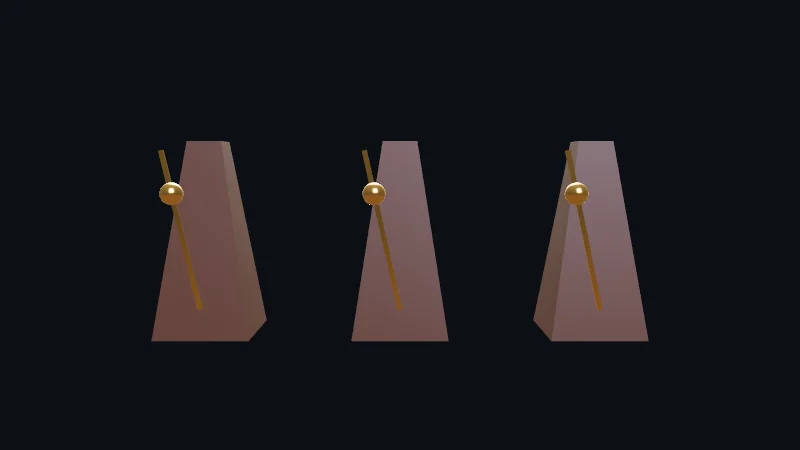

Code : la page dans [`src/04-gltf/main.ts`](https://github.com/spareilleux/learn/blob/8e8f303/code/threejs/src/04-gltf/main.ts), le script qui écrit les modèles, [`scripts/make-models.ts`](https://github.com/spareilleux/learn/blob/8e8f303/code/threejs/scripts/make-models.ts), ce que construit le loader dans [`scripts/l04-gltf.ts`](https://github.com/spareilleux/learn/blob/8e8f303/code/threejs/scripts/l04-gltf.ts), et les exercices dans [`scripts/l04-exercises.ts`](https://github.com/spareilleux/learn/blob/8e8f303/code/threejs/scripts/l04-exercises.ts).

## glTF, le format qu'attend three.js

[glTF 2.0](https://registry.khronos.org/glTF/specs/2.0/glTF-2.0.html) est un standard de Khronos, comme OpenGL et Vulkan, pour transmettre des scènes 3D à une application qui les affiche. Khronos l'appelle « le JPEG de la 3D » : un format de livraison, pas un format d'édition comme un fichier Blender. Un asset glTF contient un graphe de scène fait de nœuds, des maillages dont les buffers correspondent directement aux buffers du GPU, des matériaux metallic-roughness (le modèle de la leçon 2), des textures, des caméras, des skins et des animations.

Il existe sous deux formes : un fichier JSON `.gltf` accompagné de fichiers `.bin` et d'images séparés, ou un unique `.glb` binaire qui les regroupe. Blender l'exporte, comme la plupart des outils 3D et des boutiques d'assets.

| | MonoGame | WPF 3D | three.js |
|---|---|---|---|
| Fichiers de modèle | FBX ou X, compilés au build par le content pipeline en `.xnb` | pas de loader : XAML ou code, ou une bibliothèque tierce | glTF 2.0, chargé à l'exécution par [`GLTFLoader`](https://threejs.org/docs/pages/GLTFLoader.html) |
| Ce que donne un chargement | un `Model` avec ses maillages et ses os | | un `Group` avec des enfants `Mesh`, `Object3D`, `Bone`, plus des clips d'animation |
| Animations | votre code, ou une bibliothèque | `Storyboard` et `AnimationClock` | `AnimationClip` joué par `AnimationMixer` |
| Compression | les formats du pipeline | | Draco ou meshopt pour la géométrie, KTX2 pour les textures, chacun avec son propre décodeur |

## Un modèle écrit par un script

Pour que chaque octet soit reproductible, le cours ne télécharge pas de modèle : [`scripts/make-models.ts`](https://github.com/spareilleux/learn/blob/8e8f303/code/threejs/scripts/make-models.ts) construit un métronome à partir de primitives three.js et l'écrit avec [glTF Transform](https://gltf-transform.dev/), une bibliothèque pour lire, modifier et écrire du glTF dans Node.js. Un corps effilé, et un bras fait d'une tige et d'un poids qui oscille de +25° à −25° et revient en une seconde.

Deux détails du script comptent pour n'importe quel modèle :

- **Le pivot du bras est l'origine de son nœud.** La géométrie de la tige est remontée de la moitié de sa longueur, et le nœud du bras se trouve au bas de la tige, devant le corps, si bien que faire tourner le nœud fait osciller le bras autour de sa base ([lignes 54-57](https://github.com/spareilleux/learn/blob/8e8f303/code/threejs/scripts/make-models.ts#L54-L57)). Un modèle dont les pièces tournent autour du mauvais point a été exporté avec les mauvaises origines.
- **Les couleurs des matériaux glTF sont linéaires.** `baseColorFactor` contient des valeurs linéaires, donc le script convertit d'abord ses couleurs hexadécimales sRGB avec `THREE.Color` ([ligne 21](https://github.com/spareilleux/learn/blob/8e8f303/code/threejs/scripts/make-models.ts#L21)) ; `GLTFLoader` lit le facteur en `LinearSRGBColorSpace` et une texture de couleur de base en `SRGBColorSpace` ([`GLTFLoader.js`, lignes 829-836](https://github.com/mrdoob/three.js/blob/r186/examples/jsm/loaders/GLTFLoader.js#L829-L836)), les règles de la leçon 3.

L'animation est un canal glTF qui cible la `rotation` du bras avec cinq quaternions, un par quart de seconde, interpolés linéairement ([lignes 62-72](https://github.com/spareilleux/learn/blob/8e8f303/code/threejs/scripts/make-models.ts#L62-L72)) :

```ts
// Une animation, "swing" : rotation du bras autour de Z, en quaternions (x, y, z, w), interpolés linéairement
const angles = [0, 25, 0, -25, 0];
const times = document.createAccessor('swing_times').setType(Accessor.Type.SCALAR).setArray(new Float32Array([0, 0.25, 0.5, 0.75, 1])).setBuffer(buffer);
const rotations = document
  .createAccessor('swing_rotations')
  .setType(Accessor.Type.VEC4)
  .setArray(new Float32Array(angles.flatMap((deg) => new THREE.Quaternion().setFromAxisAngle(new THREE.Vector3(0, 0, 1), THREE.MathUtils.degToRad(deg)).toArray())))
  .setBuffer(buffer);
const sampler = document.createAnimationSampler().setInput(times).setOutput(rotations).setInterpolation('LINEAR');
const channel = document.createAnimationChannel().setTargetNode(arm).setTargetPath('rotation').setSampler(sampler);
document.createAnimation('swing').addSampler(sampler).addChannel(channel);
```

Le script écrit le modèle trois fois, tel quel et avec chacune des compressions de géométrie :

```text
$ node scripts/make-models.ts
metronome.glb 58540 bytes, 24239 gzipped
metronome-draco.glb 10424 bytes, 7438 gzipped
prune: Removed types... Accessor (12)
prune: Removed types... Accessor (9)
metronome-meshopt.glb 24616 bytes, 7526 gzipped
```

## Ce que construit GLTFLoader

`GLTFLoader` fonctionne aussi dans Node.js, tant que le fichier n'a ni images à décoder ni géométrie Draco, que `DRACOLoader` décode dans des Web Workers. [`scripts/l04-gltf.ts`](https://github.com/spareilleux/learn/blob/8e8f303/code/threejs/scripts/l04-gltf.ts) analyse le fichier non compressé et affiche l'arbre :

```text
$ node scripts/l04-gltf.ts
Group "metronome"
  Object3D "metronome_1"
    Mesh "body" — 48 vertices, MeshStandardMaterial "walnut"
    Object3D "arm"
      Mesh "rod" — 24 vertices, MeshStandardMaterial "brass"
      Mesh "weight" — 1225 vertices, MeshStandardMaterial "brass"
asset: { generator: 'glTF-Transform v4.5.0', version: '2.0' }
clip "swing": 1 s, tracks arm.quaternion (5 keys, QuaternionKeyframeTrack)
...
```

- **`gltf.scene` est un `Group`** qui porte le nom de la scène glTF, et chaque nœud glTF devient un `Object3D`, ou un `Mesh` quand il en a un. Le nœud racine du script s'appelait aussi « metronome » ; `GLTFLoader` rend les noms uniques, et le renomme « metronome_1 » ([`createUniqueName`](https://github.com/mrdoob/three.js/blob/r186/examples/jsm/loaders/GLTFLoader.js#L3757)). Le code qui cherche des objets avec `getObjectByName` dépend de ces noms : mettez-vous d'accord sur eux avec la personne qui exporte le modèle.
- **Les matériaux sont des `MeshStandardMaterial`**, avec le nom du matériau glTF. Des extensions comme `KHR_materials_clearcoat` les transforment en `MeshPhysicalMaterial`.
- **L'animation devient un [`AnimationClip`](https://threejs.org/docs/pages/AnimationClip.html)** dans `gltf.animations`, avec une piste par propriété animée, nommée `node.property` : `arm.quaternion`. Un clip est une donnée, il n'est lié à aucun objet : ce sont les noms de nœuds dans les noms de pistes qui le relient à une scène.

## Jouer l'animation

[`AnimationMixer`](https://threejs.org/docs/pages/AnimationMixer.html) joue des clips sur les objets situés sous une racine. `clipAction(clip)` renvoie une [`AnimationAction`](https://threejs.org/docs/pages/AnimationAction.html), l'équivalent d'une `AnimationClock` de WPF : elle a son propre temps, sa vitesse (`timeScale`), son poids et son mode de boucle, et plusieurs actions peuvent se mélanger sur les mêmes objets. Rien ne bouge tant que vous n'appelez pas `mixer.update(delta)` avec les secondes écoulées depuis la dernière image, en général depuis la boucle d'animation et un `Timer`.

Le même script fait avancer le mixer à la main et lit l'angle du bras :

```text
t = 0.000 s: arm at 0°
t = 0.125 s: arm at 12.5°
t = 0.250 s: arm at 25°
t = 0.500 s: arm at 0°
t = 0.750 s: arm at -25°
t = 1.250 s: arm at 25°
timeScale 2, then 0.125 s more: t = 0.500 s in the clip, arm at 0°
meshopt weight position: Int16Array normalized true scale [ 0.09, 0.09, 0.09 ]
```

- Entre deux clés, l'angle est interpolé : 12.5° à 0.125 s, à mi-chemin entre 0° et 25°. Les pistes de quaternions sont interpolées de façon sphérique, ce qui donne le même angle à mi-chemin pour une rotation autour d'un seul axe.
- Le clip boucle par défaut (`LoopRepeat`) : à 1.25 s, le bras est là où il était à 0.25 s. `mixer.time` continue de compter, et chaque action ramène son propre temps au début de la boucle.
- Avec `timeScale = 2`, 0.125 s de temps réel fait avancer l'action de 0.25 s dans le clip, de 0.25 à 0.5.

## Géométrie compressée : Draco et meshopt

Le fichier non compressé fait 58 540 octets, surtout des données de sommets en flottants. Deux extensions glTF le compressent, et toutes deux ont besoin d'un décodeur dans le navigateur :

- **[Draco](https://google.github.io/draco/)** (`KHR_draco_mesh_compression`), de Google, encode la connectivité d'un maillage et ses attributs quantifiés dans un flux de bits compact. Il donne les fichiers les plus petits, et a besoin d'un décodeur WebAssembly de quelques centaines de kilo-octets, exécuté dans des Web Workers.
- **[meshopt](https://meshoptimizer.org/)** (`EXT_meshopt_compression`), issu de meshoptimizer, réordonne et encode les buffers pour que gzip ou Brotli les compressent bien, et vise un décodage rapide. Ici, il s'accompagne de `KHR_mesh_quantization`, qui stocke les positions et les normales sous forme de petits entiers au lieu de flottants. Son décodeur est un module JavaScript avec du WebAssembly intégré.

| Fichier | Octets | Avec gzip |
|---|---|---|
| `metronome.glb` | 58 540 | 24 239 |
| `metronome-draco.glb` | 10 424 | 7 438 |
| `metronome-meshopt.glb` | 24 616 | 7 526 |

Sur disque, Draco est 2.4 fois plus petit que meshopt ; sur une connexion HTTP qui compresse, ils sont à 1 % l'un de l'autre. C'est le principe de meshopt : il laisse la dernière étape au serveur web. La dernière ligne de la sortie du script montre la quantification : les positions du poids reviennent sous la forme d'un `Int16Array` normalisé, avec une échelle de 0.09 sur le nœud pour retrouver le rayon de la sphère.

La page charge les trois fichiers avec un seul loader ([`main.ts`, lignes 25-44](https://github.com/spareilleux/learn/blob/8e8f303/code/threejs/src/04-gltf/main.ts#L25-L44)) :

```ts
// Un seul loader pour les trois fichiers : il choisit le décodeur que demande l'extensionsRequired de chaque fichier
const loader = new GLTFLoader().setDRACOLoader(new DRACOLoader()).setMeshoptDecoder(MeshoptDecoder);

const files = ['metronome.glb', 'metronome-draco.glb', 'metronome-meshopt.glb'];
const mixers: THREE.AnimationMixer[] = [];
const loaded: Record<string, unknown> = {};
const models = await Promise.all(files.map((file) => loader.loadAsync(`generated/${file}`)));

models.forEach((gltf, i) => {
  gltf.scene.position.x = (i - 1) * 1.6;
  scene.add(gltf.scene);
  const mixer = new THREE.AnimationMixer(gltf.scene);
  mixer.clipAction(gltf.animations[0]).play();
  mixers.push(mixer);
  let vertices = 0;
  gltf.scene.traverse((object) => {
    if ((object as THREE.Mesh).isMesh) vertices += (object as THREE.Mesh).geometry.getAttribute('position').count;
  });
  loaded[files[i]] = { extensionsUsed: gltf.parser.json.extensionsUsed ?? [], vertices, clip: gltf.animations[0].name };
});
```

Sans le décodeur correspondant, un fichier qui liste l'extension dans `extensionsRequired` ne se charge pas, avec `THREE.GLTFLoader: setMeshoptDecoder must be called before loading compressed files` ([`GLTFLoader.js`, ligne 1622](https://github.com/mrdoob/three.js/blob/r186/examples/jsm/loaders/GLTFLoader.js#L1618-L1624)) ou `THREE.GLTFLoader: No DRACOLoader instance provided.` pour Draco ([ligne 1951](https://github.com/mrdoob/three.js/blob/r186/examples/jsm/loaders/GLTFLoader.js#L1951)).



```text
$ node scripts/probe.mjs 04-gltf
{
  "backend": "WebGPU",
  "gpu": "nvidia, blackwell",
  "frame": 4,
  "render": {
    "calls": 23,
    "drawCalls": 10,
    "triangles": 6709
  },
  ...
  "loaded": {
    "metronome.glb": {
      "extensionsUsed": [],
      "vertices": 1297,
      "clip": "swing"
    },
    "metronome-draco.glb": {
      "extensionsUsed": [
        "KHR_draco_mesh_compression"
      ],
      "vertices": 1287,
      "clip": "swing"
    },
    "metronome-meshopt.glb": {
      "extensionsUsed": [
        "EXT_meshopt_compression",
        "KHR_mesh_quantization"
      ],
      "vertices": 1295,
      "clip": "swing"
    }
  },
  "dracoArmAngle": 12.5
}
```

- Les trois métronomes se ressemblent, et le bras de la copie Draco est à 12.5° après trois images de 0.125 s : 0.375 s dans le clip, sur le retour de 25° vers 0°.
- 10 draw calls : 3 maillages par modèle et la passe de sortie. Chaque modèle a 16 + 12 + 2 208 = 2 236 triangles, et 3 × 2 236 + 1 = 6 709. Les 23 appels sont ceux de la leçon 3 : 17 pour la PMREM de l'environnement, et 2 par image.
- Les nombres de sommets diffèrent, et l'exercice 1 trouve où sont passés les sommets.

### Ce que pèsent les décodeurs

Le build de production montre l'autre face du compromis :

```text
$ npx vite build
...
dist/assets/draco_wasm_wrapper-fZCQGLGb.js    58.45 kB
dist/assets/draco_wasm_wrapper-DxJM36Ib.js    58.76 kB
dist/assets/draco_decoder-Z1_iN-Ht.wasm      192.42 kB │ gzip:  64.11 kB
dist/assets/draco_decoder-C32yEggz.wasm      285.74 kB │ gzip:  89.66 kB
dist/assets/draco_decoder-fzg4nYZr.js        719.41 kB
...
dist/assets/04-gltf-CCDSPzCq.js               80.55 kB │ gzip:  24.11 kB
...
```

Depuis r185, `DRACOLoader` n'a plus besoin de `setDecoderPath` : il trouve les décodeurs livrés dans le paquet `three` avec `new URL(…, import.meta.url)` ([`DRACOLoader.js`, lignes 16-24](https://github.com/mrdoob/three.js/blob/r186/examples/jsm/loaders/DRACOLoader.js#L16-L24)) ; le `DRACOLoader` de r184 n'a pas cette URL, et celui de r180 démarre avec un `decoderPath` vide. Vite voit les cinq URL dans le module et copie les cinq fichiers dans le build, 1.31 MB, alors qu'un navigateur doté de WebAssembly n'en charge que deux : le wrapper et le décodeur de 286 kB ([lignes 381-402](https://github.com/mrdoob/three.js/blob/r186/examples/jsm/loaders/DRACOLoader.js#L381-L402)). Le décodeur plus petit, réservé au glTF, 192 kB, sert quand vous passez le `DRACO_GLTF_CONFIG` exporté à `setDecoderPath`, et le `draco_decoder.js` de 719 kB est un repli pour les navigateurs sans WebAssembly. Le décodeur meshopt n'a pas de fichier séparé : il se trouve dans le chunk de 80.55 kB de la page, avec `GLTFLoader` et `DRACOLoader`.

Pour ce modèle, Draco économise 88 octets sur meshopt une fois transmis, et coûte environ 90 kB de WebAssembly compressé par gzip au premier chargement. Draco est rentable sur de gros maillages, comme des objets numérisés ou du terrain ; pour la plupart des scènes, meshopt avec gzip est le meilleur choix par défaut, et il compresse aussi les animations et les données d'instances, ce que Draco ne fait pas.

### Les textures : KTX2

La géométrie est souvent la plus petite partie d'un modèle : une texture de 2048 par 2048 occupe environ 16 MB de mémoire GPU une fois décodée, davantage avec les mipmaps, quelle que soit la taille de son PNG. Les fichiers **KTX2** compressés avec Basis Universal (`KHR_texture_basisu`) restent compressés sur le GPU : [`KTX2Loader`](https://threejs.org/docs/pages/KTX2Loader.html) les transcode dans un format que le GPU prend en charge, comme BC7 sur les GPU de bureau ou ASTC sur les téléphones. Le loader a besoin de ses fichiers de transcodage, et du moteur de rendu pour détecter les formats : `new KTX2Loader().setTranscoderPath(…).detectSupport(renderer)`, puis `gltfLoader.setKTX2Loader(ktx2Loader)`. Le métronome du cours n'a pas de textures, donc cette partie n'est pas mesurée ici (*à vérifier*).

## Dans GuitarAlchemist/ga

GA charge des modèles glTF dans plusieurs composants, et chacun illustre un point de cette leçon au commit [`05c8eda`](https://github.com/GuitarAlchemist/ga/tree/05c8eda013f2a4d11efaa52c4ca94674521ee684) :

- **Une promesse que le loader ne tient pas.** `Guitar3D.tsx` annonce dans son en-tête « GLTF/GLB model loading with KTX2 texture compression support » et un « Meshopt decoder for optimized geometry » ([lignes 1-12](https://github.com/GuitarAlchemist/ga/blob/05c8eda013f2a4d11efaa52c4ca94674521ee684/ReactComponents/ga-react-components/src/components/Guitar3D/Guitar3D.tsx#L1-L12)), mais crée un simple `new GLTFLoader()` ([ligne 189](https://github.com/GuitarAlchemist/ga/blob/05c8eda013f2a4d11efaa52c4ca94674521ee684/ReactComponents/ga-react-components/src/components/Guitar3D/Guitar3D.tsx#L188-L245)), sans `setKTX2Loader` ni `setMeshoptDecoder`. Une guitare exportée avec meshopt ou KTX2 échouerait avec les erreurs citées plus haut.
- **Des décodeurs depuis un CDN.** `Ocean.tsx` charge les décodeurs de Draco depuis les serveurs de Google, `setDecoderPath('https://www.gstatic.com/draco/v1/decoders/')` ([ligne 339](https://github.com/GuitarAlchemist/ga/blob/05c8eda013f2a4d11efaa52c4ca94674521ee684/ReactComponents/ga-react-components/src/components/Ocean/Ocean.tsx#L337-L341)). Avec r180, un chemin est obligatoire. Cela rend la page dépendante d'un tiers à l'exécution, et d'une version du décodeur que three.js n'a pas choisie. Après une mise à jour vers r185 ou plus, supprimer cette ligne laisse Vite embarquer le décodeur qui correspond au loader.
- **Des erreurs réduites au silence.** `DemerzelFaceOverlay.tsx` remplace `console.error` pendant le chargement de son modèle de visage, pour masquer les erreurs KTX2 ([lignes 173-180](https://github.com/GuitarAlchemist/ga/blob/05c8eda013f2a4d11efaa52c4ca94674521ee684/ReactComponents/ga-react-components/src/components/PrimeRadiant/DemerzelFaceOverlay.tsx#L173-L180)), puis le restaure. Les textures KTX2 du modèle sont ignorées, ce que le commentaire accepte puisque le composant remplace les matériaux ; tout autre composant qui journalise pendant ce temps une erreur mentionnant KTX2 est lui aussi réduit au silence. `setKTX2Loader` supprimerait les erreurs au lieu de les cacher.
- **Un mixer qui n'a rien à jouer.** `HandAnimationTest.tsx` crée un `AnimationMixer` pour le modèle de main ([ligne 231](https://github.com/GuitarAlchemist/ga/blob/05c8eda013f2a4d11efaa52c4ca94674521ee684/ReactComponents/ga-react-components/src/pages/HandAnimationTest.tsx#L229-L232)) et le met à jour à chaque image ([ligne 157](https://github.com/GuitarAlchemist/ga/blob/05c8eda013f2a4d11efaa52c4ca94674521ee684/ReactComponents/ga-react-components/src/pages/HandAnimationTest.tsx#L155-L158)), mais n'appelle jamais `clipAction` : un mixer sans action ne fait rien bouger. La page déplace elle-même les os de la main, en réglant leurs rotations ([ligne 389](https://github.com/GuitarAlchemist/ga/blob/05c8eda013f2a4d11efaa52c4ca94674521ee684/ReactComponents/ga-react-components/src/pages/HandAnimationTest.tsx#L389)).

## À retenir

- glTF 2.0 est le format de livraison autour duquel three.js est construit : un arbre de nœuds, des matériaux metallic-roughness aux facteurs de couleur linéaires, et des animations sous forme de pistes d'images clés.
- `GLTFLoader` renvoie `gltf.scene`, un `Group`, et `gltf.animations` ; les noms peuvent être rendus uniques, et le code qui trouve des objets par leur nom en dépend.
- `AnimationMixer.update(delta)` fait avancer l'horloge ; `clipAction` renvoie l'action qui porte le temps, la vitesse, le mode de boucle et le poids.
- Draco donne les fichiers les plus petits et un gros décodeur ; meshopt donne des fichiers qui se compressent bien avec gzip et un petit décodeur. Mesurez les deux, une fois transmis sur le réseau.
- Depuis r185, `DRACOLoader` trouve ses décodeurs tout seul, et un bundler les copie tous dans le build.

## Exercices

1. Le modèle non compressé a 1 297 sommets, la copie Draco 1 287 et la copie meshopt 1 295, et pourtant les trois métronomes se ressemblent et ont le même nombre de triangles. Où sont passés les sommets ? Vérifiez avec [`scripts/l04-exercises.ts`](https://github.com/spareilleux/learn/blob/8e8f303/code/threejs/scripts/l04-exercises.ts), qui décode les deux copies dans Node.js avec glTF Transform.
2. Où est le bras à 0.875 s ? Jouez ensuite le clip une seule fois, avec `LoopOnce` et `clampWhenFinished = true`, pendant 1.5 s : où est le bras, que vaut `action.time`, et l'action est-elle toujours en cours ?
3. Une page affiche un seul modèle numérisé de 3 MB, et une autre affiche 40 petits modèles de 50 kB chacun. Quelle compression choisiriez-vous pour chacune, et que mesureriez-vous avant de décider ?

<details>
<summary>Solution 1</summary>

```text
$ node scripts/l04-exercises.ts
metronome.glb          body 48 vertices, 16 triangles | rod 24 vertices, 12 triangles | weight 1225 vertices, 2208 triangles
metronome-draco.glb    body 40 vertices, 16 triangles | rod 24 vertices, 12 triangles | weight 1223 vertices, 2208 triangles
metronome-meshopt.glb  body 48 vertices, 16 triangles | rod 24 vertices, 12 triangles | weight 1223 vertices, 2208 triangles
...
```

Deux causes. Le poids, une `SphereGeometry` à 48 segments, a 49 sommets dans ses rangées du haut et du bas, mais les triangles de chaque pôle n'en utilisent que 48 : les sommets 48 et 1176 n'appartiennent à aucun triangle. Les deux encodeurs éliminent les sommets qu'aucun triangle n'utilise, puisqu'ils reconstruisent les buffers à partir de l'index. Le corps en perd 8 de plus, dans la copie Draco seulement : le `draco()` de glTF Transform soude d'abord les sommets qui ont les mêmes attributs ([`draco.ts`, ligne 71](https://github.com/donmccurdy/glTF-Transform/blob/v4.5.0/packages/functions/src/draco.ts#L71)), et le corps avait été rendu non indexé, avec une copie de chaque coin par triangle. `meshopt()` réordonne les sommets mais ne les soude pas.

</details>

<details>
<summary>Solution 2</summary>

```text
t = 0.875 s: arm at -12.5°
LoopOnce, clampWhenFinished, after 1.5 s: arm at 0°, action.time 1, running false, finished events 1
```

À 0.875 s, le bras est à mi-chemin entre −25° à 0.75 s et 0° à 1 s. Jouée une seule fois, l'action s'arrête à la fin du clip : son temps reste à 1, `isRunning()` vaut false, et le mixer émet un événement `finished`, c'est là qu'une page lancerait l'animation suivante. `clampWhenFinished` garde la dernière pose ; sans lui, la [documentation](https://threejs.org/docs/pages/AnimationAction.html#clampWhenFinished) indique que l'action est désactivée quand elle se termine et n'affecte plus l'objet. Ce clip se termine à 0°, là où il a commencé, donc la différence ne se voit pas ici : essayez avec un clip qui se termine ailleurs.

</details>

<details>
<summary>Solution 3</summary>

Pour le modèle numérisé de 3 MB, Draco : une géométrie dense et irrégulière est là où son encodage gagne le plus, et un seul téléchargement de décodeur d'environ 90 kB compressé est peu de chose à côté des mégaoctets économisés. Pour les 40 petits modèles, meshopt : les fichiers se compressent avec gzip presque aussi bien que ceux de Draco, le décodeur est déjà dans le bundle JavaScript, et il vise un décodage rapide, ce qui compte quand 40 fichiers arrivent en même temps. Mesurez la taille transférée avec la vraie compression du serveur, le temps entre la requête et la première image, et le temps de décodage sur un téléphone lent, pas la taille sur disque. Cette réponse est un raisonnement tiré des mesures de cette leçon sur un petit modèle, pas une mesure faite sur ces deux pages (*à vérifier*).

</details>

## Sources

- Khronos : [spécification glTF 2.0](https://registry.khronos.org/glTF/specs/2.0/glTF-2.0.html), [`KHR_draco_mesh_compression`](https://github.com/KhronosGroup/glTF/tree/main/extensions/2.0/Khronos/KHR_draco_mesh_compression), [`EXT_meshopt_compression`](https://github.com/KhronosGroup/glTF/tree/main/extensions/2.0/Vendor/EXT_meshopt_compression), [`KHR_mesh_quantization`](https://github.com/KhronosGroup/glTF/tree/main/extensions/2.0/Khronos/KHR_mesh_quantization), [`KHR_texture_basisu`](https://github.com/KhronosGroup/glTF/tree/main/extensions/2.0/Khronos/KHR_texture_basisu)
- Manuel de three.js : [Loading 3D models](https://threejs.org/manual/pages/loading-3d-models.html) ; documentation : [`GLTFLoader`](https://threejs.org/docs/pages/GLTFLoader.html), [`DRACOLoader`](https://threejs.org/docs/pages/DRACOLoader.html), [`KTX2Loader`](https://threejs.org/docs/pages/KTX2Loader.html), [`AnimationMixer`](https://threejs.org/docs/pages/AnimationMixer.html), [`AnimationAction`](https://threejs.org/docs/pages/AnimationAction.html)
- Code source de three.js à r186 : [`GLTFLoader.js`](https://github.com/mrdoob/three.js/blob/r186/examples/jsm/loaders/GLTFLoader.js), [`DRACOLoader.js`](https://github.com/mrdoob/three.js/blob/r186/examples/jsm/loaders/DRACOLoader.js)
- [glTF Transform](https://gltf-transform.dev/) 4.5.0 : [`draco`](https://gltf-transform.dev/modules/functions/functions/draco) et [`meshopt`](https://gltf-transform.dev/modules/functions/functions/meshopt)
- [Draco](https://google.github.io/draco/), Google ; [meshoptimizer](https://meshoptimizer.org/)
