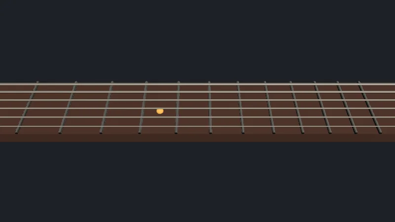

Code : la page dans [`src/05-picking/main.ts`](https://github.com/spareilleux/learn/blob/8bf126b/code/threejs/src/05-picking/main.ts), la touche qu'elle partage avec les scripts dans [`src/05-picking/fretboard.ts`](https://github.com/spareilleux/learn/blob/8bf126b/code/threejs/src/05-picking/fretboard.ts), les tests de rayons sans navigateur dans [`scripts/l05-raycaster.ts`](https://github.com/spareilleux/learn/blob/8bf126b/code/threejs/scripts/l05-raycaster.ts), et les exercices dans [`scripts/l05-exercises.ts`](https://github.com/spareilleux/learn/blob/8bf126b/code/threejs/scripts/l05-exercises.ts).

## Le hit testing, dans trois toolkits

Une scène 3D ne sait pas où se trouve le pointeur. WPF fait le travail pour vous : [`VisualTreeHelper.HitTest`](https://learn.microsoft.com/dotnet/api/system.windows.media.visualtreehelper.hittest) sur un `Viewport3D` renvoie un [`RayMeshGeometry3DHitTestResult`](https://learn.microsoft.com/dotnet/api/system.windows.media.media3d.raymeshgeometry3dhittestresult) avec le maillage, le point et le triangle. JavaFX place un [`PickResult`](https://openjfx.io/javadoc/25/javafx.graphics/javafx/scene/input/PickResult.html) dans chaque événement de souris. MonoGame vous donne les pièces : [`Viewport.Unproject`](https://docs.monogame.net/api/Microsoft.Xna.Framework.Graphics.Viewport.html) pour transformer un point de l'écran en deux points du monde, un [`Ray`](https://docs.monogame.net/api/Microsoft.Xna.Framework.Ray.html) entre les deux, et `Ray.Intersects` contre des boîtes et des sphères englobantes, jamais contre des triangles.

three.js se situe entre les deux. [`Raycaster`](https://threejs.org/docs/pages/Raycaster.html) transforme une position du pointeur en un rayon partant de la caméra, et le teste contre les triangles des maillages ; brancher les événements de pointeur reste votre travail.

| | WPF 3D | MonoGame | JavaFX 3D | three.js |
|---|---|---|---|---|
| Entrée | un point dans le `Viewport3D` | un point dans la fenêtre | un événement de souris | coordonnées normalisées, de −1 à 1 |
| Testé contre | les triangles des `ModelVisual3D` | `BoundingBox`, `BoundingSphere`, `Plane` | les triangles des `Node` | les triangles des `Mesh`, les `Points` et `Line` à un seuil près, les sprites |
| Résultat | l'impact le plus proche, ou un callback par impact | une distance | le nœud, le point, la face et la coordonnée de texture les plus proches | tous les impacts, triés par distance : objet, point, face, UV, instance |
| Ignorer des objets | `IsHitTestVisible` | votre code | `mouseTransparent` | les calques, ou la liste d'objets que vous passez |

## La scène : une touche à viser

[`fretboard.ts`](https://github.com/spareilleux/learn/blob/8bf126b/code/threejs/src/05-picking/fretboard.ts) reconstruit le manche de la leçon 2, en plus long : une boîte, 12 frettes et 6 cordes, le tout dans un seul `Group`. Les frettes suivent la règle d'une vraie guitare, chacune plus proche du chevalet d'un facteur racine douzième de deux ([ligne 16](https://github.com/spareilleux/learn/blob/8bf126b/code/threejs/src/05-picking/fretboard.ts#L16)), si bien que le X d'un point redonne la case avec un logarithme, et que son Z donne la corde la plus proche ([lignes 20-36](https://github.com/spareilleux/learn/blob/8bf126b/code/threejs/src/05-picking/fretboard.ts#L20-L36)) :

```ts
// Où appuie un doigt placé en x : 0 avant la frette 1, côté sillet, n entre la frette n − 1 et la frette n
export function fretAt(x: number): number | null {
  if (x < NUT_X || x > fretX(FRETS)) return null;
  return Math.ceil(-12 * Math.log2(1 - (x - NUT_X) / SCALE));
}
```

Le fichier n'importe rien du DOM, donc la page et un script Node.js le partagent.

## D'un événement de pointeur à un rayon

Un `Raycaster` attend le pointeur en **coordonnées normalisées de l'appareil** (NDC) : −1 au bord gauche du canvas, +1 au bord droit, +1 en haut et −1 en bas, quelle que soit sa taille en pixels. La page les calcule à partir du rectangle du canvas lui-même ([`main.ts`, lignes 35-44](https://github.com/spareilleux/learn/blob/8bf126b/code/threejs/src/05-picking/main.ts#L35-L44)) :

```ts
// Le pointeur en coordonnées normalisées (−1 à 1), à partir du rectangle du canvas lui-même
const pointer = new THREE.Vector2();
let pointerInside = false;
let pointerMoved = false;
renderer.domElement.addEventListener('pointermove', (event) => {
  const rect = renderer.domElement.getBoundingClientRect();
  pointer.set(((event.clientX - rect.left) / rect.width) * 2 - 1, -((event.clientY - rect.top) / rect.height) * 2 + 1);
  pointerInside = true;
  pointerMoved = true;
});
```

Y est inversé : le DOM compte vers le bas depuis le haut, les NDC comptent vers le haut. [`setFromCamera`](https://github.com/mrdoob/three.js/blob/r186/src/core/Raycaster.js#L119-L139) fait ensuite partir le rayon de la position de la caméra et le dirige à travers le pointeur, en déprojetant le point `(x, y, 0.5)` avec les matrices de la caméra. Pour une caméra orthographique, tous les rayons sont parallèles et partent du plan de la caméra.

Puis `intersectObject` teste le rayon, et le premier impact donne la case, la corde et la note ([lignes 59-73](https://github.com/spareilleux/learn/blob/8bf126b/code/threejs/src/05-picking/main.ts#L59-L73)) :

```ts
function pick(ndc: THREE.Vector2): Pick {
  raycaster.setFromCamera(ndc, camera);
  // Récursif : les enfants du groupe de la touche sont le manche, les frettes et les cordes
  const [hit] = raycaster.intersectObject(board, true);
  if (!hit) return null;
  const fret = fretAt(hit.point.x);
  const string = stringAt(hit.point.z);
  return {
    object: hit.object.name,
    point: hit.point.toArray().map((n) => Number(n.toFixed(3))),
    fret,
    string,
    note: fret === null ? null : noteName(string, fret),
  };
}
```

## Ce que trouve un rayon, sans navigateur

`Raycaster`, ce sont de simples calculs sur le CPU : ni renderer, ni GPU, ni DOM. [`scripts/l05-raycaster.ts`](https://github.com/spareilleux/learn/blob/8bf126b/code/threejs/scripts/l05-raycaster.ts) construit la même touche et la même caméra dans Node.js, et y tire des rayons :

```text
$ node scripts/l05-raycaster.ts
pointer (NDC): [ -0.1894, 0.0006 ]
ray origin [ -0.2, 2.4, 1.6 ] direction [ -0.122, -0.789, -0.602 ]
intersectObject(board, true): neck at 2.584
first hit: { point: [ -0.514, 0.36, 0.045 ], faceIndex: 4, uv: [ 0.413, 0.418 ] }
fret 5, string 3: C4
intersectObject(board, false): (none)
over string 1: string 1 at 2.598 | neck at 2.648
strings on layer 1: neck at 2.648
raycaster.layers.enable(1): string 1 at 2.598 | neck at 2.648
far = 2: (none)
ray.intersectPlane: [ -0.514, 0.36, 0.045 ]
over fret 4, InstancedMesh: frets (instanced) at 2.531, instance 3
10,000 × intersectObject(board, true): N µs per ray
10,000 × ray.intersectPlane: N µs per ray
```

Ligne par ligne :

- Le point où un doigt appuie sur la corde 3 à la case 5 se projette en NDC à (−0.19, 0.0006) : à gauche du centre, à mi-hauteur. Le rayon quitte la caméra en (−0.2, 2.4, 1.6), et rencontre le dessus du manche à 2.584 unités, en (−0.514, 0.36, 0.045) : case 5, corde 3, C4.
- Chaque impact porte le point, la distance, l'indice du triangle (`faceIndex`) et la coordonnée de texture en ce point (`uv`), interpolée à partir des sommets du triangle.
- `intersectObject(board, false)` ne trouve rien : le `Group` lui-même n'a pas de géométrie, et sans `recursive` ses enfants ne sont pas testés.
- Au-dessus de la corde 1, le rayon rencontre d'abord la corde, puis le manche derrière elle : le tableau contient **tous** les impacts le long du rayon, triés par distance, pas seulement le plus proche.
- Un objet sur le calque 1 est ignoré : `Raycaster` ne teste un objet que si ses [calques](https://threejs.org/docs/pages/Layers.html) en ont un en commun avec ceux du raycaster ([`Raycaster.js`, lignes 240-250](https://github.com/mrdoob/three.js/blob/r186/src/core/Raycaster.js#L240-L250)). Il ne teste pas `visible` : un maillage invisible est quand même touché, ce dont l'exercice 1 fait une fonctionnalité.
- `far = 2` ignore tout ce qui se trouve à plus de 2 unités, et le manche est à 2.584.
- Contre un plan mathématique à la hauteur du manche, `ray.intersectPlane` donne le même point, sans aucun maillage.
- Avec les frettes dans un seul [`InstancedMesh`](https://threejs.org/docs/pages/InstancedMesh.html), l'impact indique quelle instance : l'`instanceId` 3 est la frette 4.
- Le coût, sur la machine de l'auteur : quelques microsecondes par rayon contre les 19 maillages, quelques centièmes de microseconde contre le plan. Chaque maillage est d'abord testé contre sa sphère englobante, puis triangle par triangle. `check.sh` remplace les nombres par N, puisqu'ils changent à chaque exécution.

Deux détails du script comptent dans tout code qui lance des rayons hors d'une boucle de rendu. Une page fait un rendu avant de lancer ses rayons, et le rendu met à jour les matrices monde des objets ; un script, un test ou un gestionnaire d'événement qui s'exécute avant la première image doit appeler `updateMatrixWorld()` lui-même. Et la caméra, qui n'est pas dans la scène, en a besoin aussi : sans `camera.updateMatrixWorld()`, la première version de ce script projetait le point d'appui en NDC à −3.6, loin hors du canvas.

## De vrais événements de pointeur dans un navigateur headless

La sonde de la page demande à [`scripts/probe.mjs`](https://github.com/spareilleux/learn/blob/8bf126b/code/threejs/scripts/probe.mjs) de déplacer la souris de Playwright au-dessus du canvas, en 5 étapes, jusqu'à la position à l'écran de la corde 3 case 5, puis de la corde 6 case 8, puis à côté du manche, et de faire un glisser de 120 pixels vers la droite. Chromium en fait de vrais événements `pointermove`, `pointerdown` et `pointerup`. Après chaque action, la page rend deux images et indique ce qu'elle a sélectionné :

```text
$ node scripts/probe.mjs 05-picking
{
  "frame": 4,
  "render": {
    "calls": 6,
    "drawCalls": 20,
    "triangles": 781
  },
  "memory": {
    "geometries": 9,
    "textures": 3,
    "programs": 4
  },
  "canvas": [0, 0, 800, 450],
  "after": {
    "string 3, fret 5": {
      "pick": {
        "object": "neck",
        "point": [-0.515, 0.36, 0.046],
        "fret": 5,
        "string": 3,
        "note": "C4"
      }
    },
    "string 6, fret 8": {
      "pick": {
        "object": "neck",
        "point": [0.286, 0.36, -0.226],
        "fret": 8,
        "string": 6,
        "note": "C3"
      }
    },
    "beside the neck": {
      "pick": null
    },
    "orbit 120 px right": {
      "camera": [-1.791, 2.4, -0.167],
      "target": [-0.2, 0.3, 0]
    }
  }
}
```



<details>
<summary>Page en direct : la lancer ici</summary>

<iframe src="../../../threejs-demos/05-picking.html" title="Leçon 5, en direct" loading="lazy" width="100%" height="420" allow="fullscreen; autoplay; xr-spatial-tracking" style={{ border: 0, display: "block" }}></iframe>

</details>

[Ouvrir en plein écran](../../../threejs-demos/05-picking.html). **À essayer** : cochez *240 px sidebar* pour la mise en page de l'exercice 3, et passez le pointeur sur les cordes ; cochez *damping* et faites glisser pour sentir ce que change `enableDamping`.

La capture est prise après le premier déplacement : le marqueur orange se trouve sous le pointeur. Le point sélectionné diffère de celui du script à la troisième décimale, (−0.515, 0.36, 0.046) au lieu de (−0.514, 0.36, 0.045), car la page arrondit la cible à des pixels CSS entiers avant que la souris s'y rende. Trois choses méritent d'être lues :

- **20 draw calls** pour le manche, 12 frettes, 6 cordes et la passe de sortie. La sélection ne coûte rien sur le GPU.
- **Un raycast par image.** La page lance au plus un rayon par image, et seulement quand le pointeur a bougé ([lignes 75-92](https://github.com/spareilleux/learn/blob/8bf126b/code/threejs/src/05-picking/main.ts#L75-L92)). Une souris peut envoyer plus d'événements `pointermove` que l'écran n'affiche d'images, et un raycast dans le gestionnaire d'événement testerait la scène pour des positions que personne ne voit.
- **L'orbite.** Un glisser de 120 pixels a fait tourner la caméra de 96° autour de la cible : [`OrbitControls`](https://threejs.org/docs/pages/OrbitControls.html) tourne de 2π × pixels ÷ la hauteur de l'élément, « yes, height », précise le code source ([`OrbitControls.js`, ligne 1118](https://github.com/mrdoob/three.js/blob/r186/examples/jsm/controls/OrbitControls.js#L1118)), soit 120 ÷ 450 d'un tour complet. La caméra reste à 1.6 unité de l'axe et à la même hauteur.

### Les contrôles

```ts
const controls = new OrbitControls(camera, renderer.domElement);
controls.target.set(-0.2, 0.3, 0);
controls.enableDamping = params.has('damping');
controls.update();
```

`OrbitControls` se trouve dans `three/addons/controls/OrbitControls.js`, pas dans le cœur. Il écoute `pointerdown` sur le canvas, puis capture le pointeur (`setPointerCapture`) et écoute `pointermove` et `pointerup` sur le document, si bien qu'un glisser qui sort du canvas continue de faire tourner la caméra ([lignes 1553-1564](https://github.com/mrdoob/three.js/blob/r186/examples/jsm/controls/OrbitControls.js#L1553-L1564)). Il applique `touch-action: none` au canvas, pour qu'un doigt fasse tourner la caméra au lieu de faire défiler la page. Avec `enableDamping`, la caméra continue de bouger un moment après le glisser : `controls.update()` doit alors s'exécuter à chaque image, ce que fait la boucle. `controls.dispose()` retire les listeners ([lignes 512-538](https://github.com/mrdoob/three.js/blob/r186/examples/jsm/controls/OrbitControls.js#L512-L538)) ; un composant qui crée des contrôles sans jamais les libérer laisse ces listeners derrière lui.

Les addons proposent d'autres contrôles, avec le même constructeur : `MapControls` (le déplacement d'abord, comme sur une carte), `TrackballControls` (pas de direction « haut » fixe), `PointerLockControls` (vue à la première personne), `TransformControls` (un gizmo pour déplacer un objet) et `DragControls`.

## Quand le canvas ne commence pas en (0, 0)

Beaucoup d'exemples sur le web calculent les NDC à partir de la fenêtre : `event.clientX / window.innerWidth * 2 - 1`. Ce n'est juste que si le canvas remplit la fenêtre. Avec `?sidebar`, la page place un panneau de 240 pixels à gauche du canvas, et calcule les deux versions pour le même événement de pointeur ([lignes 50-54](https://github.com/spareilleux/learn/blob/8bf126b/code/threejs/src/05-picking/main.ts#L50-L54)) :

```text
$ node scripts/probe.mjs 05-picking --query sidebar
{
  "frame": 4,
  "render": {
    "calls": 6,
    "drawCalls": 20,
    "triangles": 781
  },
  "memory": {
    "geometries": 9,
    "textures": 3,
    "programs": 4
  },
  "canvas": [240, 0, 560, 450],
  "after": {
    "string 3, fret 5": {
      "pick": {
        "object": "neck",
        "point": [-0.515, 0.36, 0.046],
        "fret": 5,
        "string": 3,
        "note": "C4"
      },
      "pickFromWindow": {
        "object": "neck",
        "point": [-0.072, 0.36, 0.046],
        "fret": 7,
        "string": 3,
        "note": "D4"
      }
    },
    "string 6, fret 8": {
      "pick": {
        "object": "neck",
        "point": [0.286, 0.36, -0.226],
        "fret": 8,
        "string": 6,
        "note": "C3"
      },
      "pickFromWindow": {
        "object": "neck",
        "point": [0.511, 0.36, -0.226],
        "fret": 9,
        "string": 6,
        "note": "C#3"
      }
    },
    "beside the neck": {
      "pick": null,
      "pickFromWindow": null
    },
    "orbit 120 px right": {
      "camera": [-1.791, 2.4, -0.167],
      "target": [-0.2, 0.3, 0]
    }
  }
}
```

Le canvas fait maintenant 560 pixels sur 450, en x = 240. À partir de son propre rectangle, la page trouve toujours la corde 3 case 5. À partir de la fenêtre, le même pointeur tombe deux cases plus loin, sur une note plus haute d'un ton entier, sans la moindre erreur nulle part. Le listener `resize` de la page cache le même piège : il dimensionne le renderer d'après son conteneur, pas d'après la fenêtre ([lignes 94-103](https://github.com/spareilleux/learn/blob/8bf126b/code/threejs/src/05-picking/main.ts#L94-L103)).

## Dans GuitarAlchemist/ga

GA utilise `Raycaster` dans 14 fichiers. Tous calculent les NDC à partir du rectangle du canvas, donc le bug de la sidebar ci-dessus n'y est pas. Les différences tiennent au moment où ils lancent leurs rayons, et à ce qu'ils nettoient.

- **Un listener par exécution de l'effet.** `ThreeHeadstock.tsx` ajoute son gestionnaire de clic avec `canvas.addEventListener('click', handleClick)` dans `setupMouseInteraction` ([lignes 698-744](https://github.com/GuitarAlchemist/ga/blob/05c8eda013f2a4d11efaa52c4ca94674521ee684/ReactComponents/ga-react-components/src/components/ThreeHeadstock.tsx#L698-L744)), appelé depuis un `useEffect` dont les dépendances incluent le modèle de guitare, le style, l'accordage, la largeur et la hauteur ([ligne 178](https://github.com/GuitarAlchemist/ga/blob/05c8eda013f2a4d11efaa52c4ca94674521ee684/ReactComponents/ga-react-components/src/components/ThreeHeadstock.tsx#L178)). Le nettoyage libère les contrôles et le renderer, mais ne retire jamais le listener, et le canvas reste le même élément d'une exécution à l'autre (`canvasRef`). Après chaque changement d'accordage, un gestionnaire de plus s'exécute à chaque clic, chacun avec la scène de sa propre exécution. Reste *à vérifier* dans le navigateur si les anciennes scènes appellent encore `onTuningPegClick`. Le gestionnaire teste aussi `scene.children` récursivement ([ligne 713](https://github.com/GuitarAlchemist/ga/blob/05c8eda013f2a4d11efaa52c4ca94674521ee684/ReactComponents/ga-react-components/src/components/ThreeHeadstock.tsx#L713)) : tous les maillages de la tête, alors que seules les mécaniques sont cliquables.
- **Un raycast par événement de souris.** `TonalOrbit.tsx` fait sa sélection à chaque `pointermove` ([lignes 835-850](https://github.com/GuitarAlchemist/ga/blob/05c8eda013f2a4d11efaa52c4ca94674521ee684/ReactComponents/ga-react-components/src/components/TonalOrbit/TonalOrbit.tsx#L835-L850)), et construit à chaque fois un nouveau `Vector2` et un nouveau tableau de maillages ([lignes 799-813](https://github.com/GuitarAlchemist/ga/blob/05c8eda013f2a4d11efaa52c4ca94674521ee684/ReactComponents/ga-react-components/src/components/TonalOrbit/TonalOrbit.tsx#L799-L813)). `MinimalThreeInstrument.tsx` crée un nouveau `Raycaster` dans son gestionnaire React `onMouseMove` ([lignes 664-675](https://github.com/GuitarAlchemist/ga/blob/05c8eda013f2a4d11efaa52c4ca94674521ee684/ReactComponents/ga-react-components/src/components/MinimalThree/MinimalThreeInstrument.tsx#L664-L675)). Les objets laissés au garbage collector pèsent peu ; les raycasts pour des positions qu'aucune image n'affiche coûtent davantage.
- **Le modèle de cette leçon, déjà dans GA.** L'`InteractionHandler.ts` de Prime Radiant enregistre les NDC dans `mousemove` ([lignes 64-68](https://github.com/GuitarAlchemist/ga/blob/05c8eda013f2a4d11efaa52c4ca94674521ee684/ReactComponents/ga-react-components/src/components/PrimeRadiant/InteractionHandler.ts#L64-L68)), lance ses rayons depuis la boucle de rendu, et retire ses trois listeners dans `dispose` ([lignes 58-62](https://github.com/GuitarAlchemist/ga/blob/05c8eda013f2a4d11efaa52c4ca94674521ee684/ReactComponents/ga-react-components/src/components/PrimeRadiant/InteractionHandler.ts#L58-L62)). Ses nœuds portent une sphère invisible, plus grande, que le rayon peut toucher ([`NodeRenderer.ts`, lignes 86-95](https://github.com/GuitarAlchemist/ga/blob/05c8eda013f2a4d11efaa52c4ca94674521ee684/ReactComponents/ga-react-components/src/components/PrimeRadiant/NodeRenderer.ts#L86-L95)), la technique de l'exercice 1. Il vérifie le survol à chaque image, même quand le pointeur n'a pas bougé ; l'indicateur `pointerMoved` de la page de cette leçon éviterait ces tests.
- **Des contrôles sans `dispose`.** Sur les 25 fichiers qui créent des `OrbitControls`, quatre ne les libèrent jamais, dont `BSP/HarmonicNavigator3D.tsx` ([ligne 189](https://github.com/GuitarAlchemist/ga/blob/05c8eda013f2a4d11efaa52c4ca94674521ee684/ReactComponents/ga-react-components/src/components/BSP/HarmonicNavigator3D.tsx#L189)), dont le nettoyage ne libère que le renderer ([lignes 250-260](https://github.com/GuitarAlchemist/ga/blob/05c8eda013f2a4d11efaa52c4ca94674521ee684/ReactComponents/ga-react-components/src/components/BSP/HarmonicNavigator3D.tsx#L250-L260)). Le canvas disparaît avec le composant, et ses listeners avec lui, mais le listener `keydown` que les contrôles ajoutent au document ([ligne 505](https://github.com/mrdoob/three.js/blob/r186/examples/jsm/controls/OrbitControls.js#L505)) reste.

## Démo en direct : une guitare entière

Les deux mêmes étapes sur une guitare entière, modélisée en code plutôt que chargée : le corps et la tête sont des contours extrudés, et les frettes, les repères, les plots des micros, les pontets et les mécaniques sont des meshes instanciés. Un rayon contre une boîte invisible posée sur la touche, puis son intersection avec le plan des cordes, donnent une case à partir de la coordonnée x et une corde à partir de la coordonnée z, avec `fretAtX` et `noteAt` de la leçon 13. Un clic pince la corde, qui vibre dans son vertex shader, et joue la note avec un petit synthétiseur Karplus-Strong sur la Web Audio API. Sa sonde clique la corde 3 à la case 5 avec la souris de Playwright et lit `string 3, fret 5: C4`, avec 32 draw calls et 47 405 triangles. Le [source](https://github.com/spareilleux/learn/tree/f68e710/code/threejs/demos/guitar) est dans `code/threejs/demos/guitar`.


<details>
<summary>Page en direct : la lancer ici</summary>

<iframe src="../../../threejs-demos/demos/guitar.html" title="Une guitare entière à jouer" loading="lazy" width="100%" height="420" allow="fullscreen; autoplay; xr-spatial-tracking" style={{ border: 0, display: "block" }}></iframe>

</details>

[Ouvrir en plein écran](../../../threejs-demos/demos/guitar.html). **À essayer** : cliquez sur une corde entre deux frettes ; le panneau gratte des accords, et `?view=body` ou `?view=headstock` démarre plus près. Le pointage ne touche pas les meshes des cordes, donc le problème de l'exercice 1 ne se pose pas ici : comparez les deux approches.

## À retenir

- `Raycaster.setFromCamera` prend des coordonnées normalisées de l'appareil : calculez-les à partir du `getBoundingClientRect()` du canvas, pas de la fenêtre.
- `intersectObject(object, true)` renvoie tous les impacts le long du rayon, le plus proche en premier, avec le point, la distance, la face, les UV et, pour les maillages instanciés, `instanceId`.
- Le raycaster teste les calques, pas `visible` ; `far`, `near` et la liste d'objets que vous passez limitent le travail.
- Le raycasting, ce sont des calculs sur le CPU : testez-le dans Node.js, mais mettez à jour les matrices monde vous-même, y compris celle de la caméra.
- Lancez les rayons depuis la boucle d'images, une fois, quand le pointeur a bougé ; retirez vos listeners et libérez les contrôles quand le composant disparaît.

## Exercices

1. Les cordes sont fines : un pointeur à 0.012 unité à côté de la corde 1 tombe sur le manche. Rendez chaque corde plus facile à toucher sans la faire paraître plus épaisse. Vérifiez avec [`scripts/l05-exercises.ts`](https://github.com/spareilleux/learn/blob/8bf126b/code/threejs/scripts/l05-exercises.ts).
2. Des repères de notes dessinés comme des [`Points`](https://threejs.org/docs/pages/Points.html) n'ont pas de surface. Comment `Raycaster` décide-t-il qu'un point est touché ? Visez 0.04 unité à droite du repère de la case 5, et essayez des seuils de 1, 0.1, 0.05 et 0.02.
3. Avec la mise en page `?sidebar`, la sélection calculée depuis la fenêtre indiquait la case 7. Sans lancer la page, quelle case indiquerait-elle pour une sidebar de 480 pixels, et pourquoi ne pouvez-vous pas le dire à partir des seules NDC ?

<details>
<summary>Solution 1</summary>

Ajoutez un cylindre invisible plus épais à la position de chaque corde, dans le même groupe. `Raycaster` teste les calques, pas `visible`, et le renderer ignore les objets invisibles ([lignes 13-31](https://github.com/spareilleux/learn/blob/8bf126b/code/threejs/scripts/l05-exercises.ts#L13-L31)) :

```ts
const proxyMaterial = new THREE.MeshBasicMaterial();
for (const string of strings) {
  const proxy = new THREE.Mesh(new THREE.CylinderGeometry(0.02, 0.02, 1, 8).rotateZ(Math.PI / 2), proxyMaterial);
  proxy.name = `${string.name} (hit area)`;
  proxy.visible = false;
  proxy.scale.x = (string.geometry as THREE.CylinderGeometry).parameters.height;
  proxy.position.copy(string.position);
  board.add(proxy);
}
```

```text
$ node scripts/l05-exercises.ts
0.012 beside string 1: neck at 2.654
with invisible hit areas: string 1 (hit area) at 2.584 | neck at 2.654
...
```

Le nom de la zone de clic indique la corde qu'elle représente. Le `NodeRenderer.ts` de GA fait la même chose avec `visible: false` sur le matériau au lieu du maillage ; `Mesh.raycast` ne s'arrête plus tôt que lorsqu'il n'y a aucun matériau ([`Mesh.js`, ligne 244](https://github.com/mrdoob/three.js/blob/r186/src/objects/Mesh.js#L244)), donc les deux fonctionnent.

</details>

<details>
<summary>Solution 2</summary>

```text
threshold 1: 3 hit(s), nearest to the ray: index 2, first: index 3
threshold 0.1: 1 hit(s), nearest to the ray: index 2, first: index 2
threshold 0.05: 1 hit(s), nearest to the ray: index 2, first: index 2
threshold 0.02: 0 hit(s)
```

Pour des `Points`, un impact est un point dont la distance au rayon est inférieure à `raycaster.params.Points.threshold`, en unités du monde ; la valeur par défaut est 1, plus que la largeur de toute cette touche. Avec 1, trois des quatre repères comptent, et `hits[0]` est celui qui est **le plus proche de la caméra** le long du rayon, l'indice 3 (case 7), pas le plus proche du rayon : chaque impact a une `distanceToRay` pour les trier. De 0.1 à 0.05, il ne reste que le repère de la case 5 ; à 0.02, le rayon passe à 0.04 et rien n'est touché. `Line` a le même paramètre, `params.Line.threshold`. Avec `PointsMaterial.sizeAttenuation`, la taille d'un repère à l'écran change avec la distance mais pas le seuil : un seuil en pixels demande votre propre conversion.

</details>

<details>
<summary>Solution 3</summary>

Cela dépend de la position du pointeur, pas seulement de la sidebar. Les NDC calculées depuis la fenêtre valent `clientX / innerWidth`, les bonnes `(clientX − left) / width` : l'erreur grandit avec le panneau et diminue vers le bord droit de la fenêtre, où les deux atteignent 1. Avec un panneau de 480 pixels, le canvas ferait 320 pixels de large, et le pointeur sur la corde 3 case 5 serait lui aussi à un autre `clientX`, donc la mauvaise case ne se déduit pas du premier résultat. Raisonné, pas mesuré : lancez la page avec une `.sidebar` plus large pour le vérifier (*à vérifier*).

</details>

## Sources

- Documentation de three.js : [`Raycaster`](https://threejs.org/docs/pages/Raycaster.html), [`Layers`](https://threejs.org/docs/pages/Layers.html), [`OrbitControls`](https://threejs.org/docs/pages/OrbitControls.html), [`InstancedMesh`](https://threejs.org/docs/pages/InstancedMesh.html), [`Points`](https://threejs.org/docs/pages/Points.html)
- Code source de three.js à r186 : [`Raycaster.js`](https://github.com/mrdoob/three.js/blob/r186/src/core/Raycaster.js), [`Mesh.js`](https://github.com/mrdoob/three.js/blob/r186/src/objects/Mesh.js), [`OrbitControls.js`](https://github.com/mrdoob/three.js/blob/r186/examples/jsm/controls/OrbitControls.js)
- MDN : [Pointer events](https://developer.mozilla.org/docs/Web/API/Pointer_events), [`Element.getBoundingClientRect()`](https://developer.mozilla.org/docs/Web/API/Element/getBoundingClientRect), [`Element.setPointerCapture()`](https://developer.mozilla.org/docs/Web/API/Element/setPointerCapture)
- Playwright : [`Mouse`](https://playwright.dev/docs/api/class-mouse)
