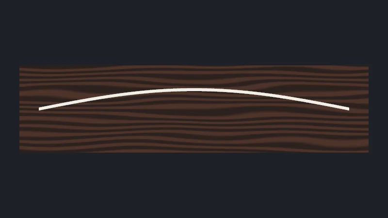

Code : la page dans [`src/06-tsl/main.ts`](https://github.com/spareilleux/learn/blob/8bf126b/code/threejs/src/06-tsl/main.ts), et les shaders générés que `check.sh` écrit dans `out/l06_shader_webgpu.txt` et `out/l06_shader_webgl.txt`.

## Les shaders, dans trois toolkits

Un shader est un petit programme qui s'exécute sur le GPU pour chaque sommet ou chaque pixel. Avec MonoGame, vous l'écrivez en HLSL, dans un fichier `.fx` que le content pipeline compile en un [`Effect`](https://docs.monogame.net/api/Microsoft.Xna.Framework.Graphics.Effect.html), et vous réglez ses paramètres depuis C#. La 3D de WPF n'a pas de shaders personnalisés ; son [`ShaderEffect`](https://learn.microsoft.com/dotnet/api/system.windows.media.effects.shadereffect) exécute un pixel shader HLSL sur un élément rendu, en 2D. JavaFX n'en a pas.

three.js a connu deux façons de faire. Avec `WebGLRenderer`, un [`ShaderMaterial`](https://threejs.org/docs/pages/ShaderMaterial.html) prend du source GLSL sous forme de chaînes. Avec `WebGPURenderer`, une chaîne de GLSL ne peut pas tourner sur WebGPU, qui parle WGSL, et une chaîne de WGSL ne peut pas tourner sur le repli WebGL 2. Les matériaux de `WebGPURenderer` sont donc construits à partir de **nœuds**, écrits en [TSL](https://threejs.org/docs/pages/TSL.html), le Three Shading Language : des fonctions TypeScript qui construisent un graphe, que le renderer traduit en WGSL ou en GLSL pour le backend sur lequel il tourne.

| | MonoGame | WPF | three.js, `WebGLRenderer` | three.js, `WebGPURenderer` |
|---|---|---|---|---|
| Langage | HLSL | HLSL (pixel shaders seulement) | chaînes GLSL | TSL, en TypeScript |
| Compilation | au build, par le content pipeline | au build, par `fxc` | par le navigateur, au premier rendu | en WGSL ou GLSL par three.js, puis par le navigateur, au premier rendu |
| Paramètres | `Effect.Parameters["name"].SetValue` | dependency properties liées à des registres | `uniforms: { name: { value } }` | nœuds `uniform(value)`, réglés avec `.value` |
| Éclairage | à écrire vous-même | aucun | le vôtre, ou des patchs `onBeforeCompile` | celui du matériau : vous remplacez une entrée, comme la couleur |

C'est sur la dernière ligne que TSL change le plus le travail. Un `ShaderMaterial` remplace le shader entier : pour avoir les lumières, les ombres et le brouillard, vous les réécrivez ou vous patchez les chunks GLSL de three.js. Un matériau à nœuds garde son modèle d'éclairage et vous laisse brancher un nœud sur l'une de ses entrées.

## Un matériau à nœuds dont une entrée est remplacée

Le manche de la page de cette leçon reçoit un veinage de palissandre calculé par pixel, sans texture ([`main.ts`, lignes 26-37](https://github.com/spareilleux/learn/blob/8bf126b/code/threejs/src/06-tsl/main.ts#L26-L37)) :

```ts
// Palissandre : bandes sombres et claires le long du manche, courbées par du bruit, calculées par pixel sur le GPU
const grain = Fn(() => {
  const p = positionWorld;
  const bend = mx_noise_float(vec3(p.x.mul(0.8), p.y.mul(6), 0)).mul(0.6);
  const bands = sin(p.y.mul(90).add(bend.mul(12))).mul(0.5).add(0.5);
  return mix(color(0x2a160d), color(0x5a3422), smoothstep(0.2, 0.9, bands));
});
const neckMaterial = new THREE.MeshStandardNodeMaterial({ roughness: 0.75 });
neckMaterial.colorNode = grain();
const neck = new THREE.Mesh(new THREE.PlaneGeometry(3.6, 0.9), neckMaterial);
```

Le lire comme du TypeScript est trompeur au début : rien ici ne calcule une couleur. `positionWorld` est un nœud qui représente « la position dans le monde du pixel en cours d'ombrage » ; `p.y.mul(90)` renvoie un nouveau nœud, une multiplication ; `sin`, `mix` et `smoothstep` sont les fonctions GLSL et WGSL du même nom, sous forme de nœuds. Il n'y a pas d'opérateurs : JavaScript n'a pas de surcharge d'opérateurs, donc `a * b` s'écrit `a.mul(b)`. `Fn` enveloppe la fonction de construction, et `grain()` l'appelle une fois, pour construire le graphe.

[`MeshStandardNodeMaterial`](https://threejs.org/docs/pages/MeshStandardNodeMaterial.html) est le `MeshStandardMaterial` de la leçon 2 en version matériau à nœuds. Son `colorNode` remplace la couleur de base, et tout le reste demeure : la rugosité, les lumières, le tone mapping. Les autres entrées suivent le même nommage : `normalNode`, `roughnessNode`, `metalnessNode`, `emissiveNode`, `opacityNode`, et `positionNode` pour les sommets ([`NodeMaterial.js`, lignes 153-372](https://github.com/mrdoob/three.js/blob/r186/src/materials/nodes/NodeMaterial.js#L153-L372)). `mx_noise_float` est un bruit de Perlin tiré du portage par three.js de la bibliothèque de nœuds de [MaterialX](https://materialx.org/).

## Les uniforms : des valeurs qui changent sans nouveau shader

La corde est une boîte fine, longue de 64 segments, dont les sommets bougent dans le vertex shader selon une onde stationnaire. Son amplitude, sa phase et son harmonique sont des **uniforms** : des valeurs que le shader lit, et que JavaScript peut modifier entre deux images ([lignes 39-57](https://github.com/spareilleux/learn/blob/8bf126b/code/threejs/src/06-tsl/main.ts#L39-L57)) :

```ts
// La corde : une boîte fine le long de X, de −1.6 à 1.6, fixée aux deux bouts
const LENGTH = 3.2;
const amplitude = uniform(0.2);
const phase = uniform(0); // 2π × fréquence × temps, réglé depuis JavaScript
const startHarmonic = Number(params.get('harmonic') ?? 1);
const harmonic = uniform(startHarmonic); // 1 = fondamentale, 2 = octave : un nœud au milieu
const vibrate = Fn(() => {
  const u = positionLocal.x.div(LENGTH).add(0.5); // 0 à un bout, 1 à l'autre
  const shape = sin(u.mul(PI).mul(harmonic)); // la forme de l'onde stationnaire, 0 aux deux bouts
  const offset = amplitude.mul(shape).mul(sin(phase));
  return positionLocal.add(vec3(0, offset, 0));
});
const stringMaterial = new THREE.MeshBasicNodeMaterial();
stringMaterial.colorNode = color(0xf2efe6);
stringMaterial.positionNode = vibrate();
```

La boucle règle `phase.value` à chaque image. Sous la sonde, la page fixe le temps à un quart de période, où `sin(phase)` vaut 1 et où le milieu de la corde est 0.2 unité au-dessus de sa position de repos :

```text
$ node scripts/probe.mjs 06-tsl --extract shader out/l06_shader_webgpu.txt
{
  "frame": 4,
  "render": {
    "calls": 6,
    "drawCalls": 3,
    "triangles": 519
  },
  "memory": {
    "geometries": 3,
    "textures": 3,
    "programs": 6
  },
  "t": 0.25,
  "harmonic": 1,
  "offsetAtMiddle": 0.2,
  "nodeBuilds": {
    "firstFrames": 3,
    "afterUniformChange": 3,
    "afterNewNodeGraph": 4
  },
  "pixels": {
    "string middle, displaced": "rgb(242, 239, 230)",
    "string middle, at rest": "rgb(56, 39, 34)",
    "quarter length, displaced": "rgb(242, 239, 230)"
  }
}
```



<details>
<summary>Page en direct : la lancer ici</summary>

<iframe src="../../../threejs-demos/06-tsl.html" title="Leçon 6, en direct" loading="lazy" width="100%" height="420" allow="fullscreen; autoplay; xr-spatial-tracking" style={{ border: 0, display: "block", height: "min(420px, 70vh)" }}></iframe>

</details>

[Ouvrir en plein écran](../../../threejs-demos/06-tsl.html). **À essayer** : mettez *harmonic* à 2, l'octave de l'exercice 1, et comparez la corde avec votre prédiction. Les cordes de la [guitare entière](../../../threejs-demos/demos/guitar.html) de la leçon 5 vibrent de la même façon : un `positionNode` dont l'amplitude, le point de départ et le temps sont des uniforms qu'un clic règle.

Les pixels confirment la forme : crème au milieu déplacé et au quart déplacé, et bois à la position de repos du milieu, où la corde n'est plus. Trois draw calls : le manche, la corde et la passe de sortie. L'exécution `--webgl` donne les mêmes nombres et les trois mêmes couleurs.

### Quand le shader est reconstruit

`renderer.debug.onNodeBuilderCreated` est appelé chaque fois que le renderer traduit le graphe de nœuds d'un matériau en code de shader ([`Renderer.js`, lignes 736-760](https://github.com/mrdoob/three.js/blob/r186/src/renderers/common/Renderer.js#L736-L760)). La page compte les appels ([lignes 72-91](https://github.com/spareilleux/learn/blob/8bf126b/code/threejs/src/06-tsl/main.ts#L72-L91)) :

- **3 constructions pour les premières images** : le manche, la corde, et la passe de sortie du renderer, qui est elle aussi un matériau à nœuds.
- **Toujours 3 après `harmonic.value = 2`** : changer un uniform, c'est écrire dans un buffer du GPU. Le shader reste.
- **4 après le remplacement de `colorNode`** par un nouveau graphe et le réglage de `needsUpdate` : un nouveau graphe est du nouveau code, reconstruit et recompilé. Sur un gros matériau, c'est un à-coup visible.

Tout ce qui change pendant que la page tourne a donc sa place dans un `uniform`, pas dans un nombre JavaScript figé dans le graphe. `color(0xffb454)` et `float(1)` sont des constantes : elles sont écrites dans le source du shader.

## Ce que devient le graphe

`renderer.debug.getShaderAsync(scene, camera, object)` renvoie le code généré pour un objet, pour le backend sur lequel tourne le renderer. La page l'extrait, une fois depuis l'exécution par défaut et une fois depuis l'exécution `--webgl`. Sur la machine de l'auteur, les deux fichiers contiennent la même ligne, en WGSL et en GLSL :

```text
$ grep -h 'positionLocal = ' out/l06_shader_webgpu.txt out/l06_shader_webgl.txt
	positionLocal = position;
	positionLocal = ( positionLocal + vec3<f32>( 0.0, ( ( object.nodeUniform0 * sin( ( ( ( ( positionLocal.x / 3.2 ) + 0.5 ) * 3.141592653589793 ) * object.nodeUniform1 ) ) ) * sin( object.nodeUniform2 ) ), 0.0 ) );
	positionLocal = position;
	positionLocal = ( positionLocal + vec3( 0.0, ( ( nodeUniform0 * sin( ( ( ( ( positionLocal.x / 3.2 ) + 0.5 ) * 3.141592653589793 ) * nodeUniform1 ) ) ) * sin( nodeUniform2 ) ), 0.0 ) );
```

La même expression, issue du même TSL, dans les deux langages : `object.nodeUniform0` est l'amplitude, `nodeUniform1` l'harmonique et `nodeUniform2` la phase, et `LENGTH`, une constante JavaScript, est le littéral `3.2`. En WGSL, les uniforms se trouvent dans une struct nommée `object` : un `uniform()` appartient par défaut au groupe de l'objet, envoyé pour chaque objet qui l'utilise ([`UniformNode.js`, ligne 55](https://github.com/mrdoob/three.js/blob/r186/src/nodes/core/UniformNode.js#L55)). Une valeur partagée par toute une image, comme un temps, peut rejoindre le groupe de l'image avec `.setGroup(frameGroup)`, envoyé une fois par image ([`UniformGroupNode.js`, lignes 152-168](https://github.com/mrdoob/three.js/blob/r186/src/nodes/core/UniformGroupNode.js#L152-L168)).

Le reste du fichier, environ 250 lignes par backend, appartient à three.js : le modèle d'éclairage, le tone mapping, les structs. Il change d'une version à l'autre, c'est pourquoi `check.sh` ne compare que la ligne GLSL. Il affiche l'autre sans la comparer : sur les runners CI Linux et Windows, qui n'ont pas de GPU, l'exécution par défaut se replie sur WebGL 2, et son fichier contient lui aussi du GLSL.

## Du GLSL au TSL

Un `ShaderMaterial` GLSL a trois parties, et chacune a son équivalent en TSL :

| `ShaderMaterial` GLSL | TSL |
|---|---|
| `uniforms: { exponent: { value: 0.6 } }` | `const exponent = uniform(0.6)` |
| `varying vec3 vWorldPosition;` et le vertex shader qui le remplit | `positionWorld`, calculé là où il est utilisé ; `varying(node)` quand il vous en faut un |
| `gl_FragColor = vec4(…)` dans `main()` | un nœud affecté à `colorNode`, ou `fragmentNode` pour remplacer toute la sortie |
| `pow(max(h, 0.0), exponent)` | `pow(max(h, 0), exponent)`, ou `h.max(0).pow(exponent)` |
| variables intégrées : `modelMatrix`, `cameraPosition` | nœuds : `modelWorldMatrix`, `cameraPosition` |

TSL a aussi des structures de contrôle, `If`, `Loop` et `select`, des variables avec `.toVar()`, et des fonctions aux paramètres typés, toutes décrites dans la [spécification de TSL](https://github.com/mrdoob/three.js/wiki/Three.js-Shading-Language) sur le wiki du projet.

## Dans GuitarAlchemist/ga

GA est en pleine migration : `ShaderMaterial` apparaît dans 15 fichiers et `three/tsl` dans 33.

- **Un ciel GLSL, en double.** `BSP/Sunburst3D.tsx` dessine son ciel comme une grande sphère avec un `ShaderMaterial` : un vertex shader qui transmet la position dans le monde, et un fragment shader qui mélange deux couleurs selon la hauteur ([lignes 450-481](https://github.com/GuitarAlchemist/ga/blob/05c8eda013f2a4d11efaa52c4ca94674521ee684/ReactComponents/ga-react-components/src/components/BSP/Sunburst3D.tsx#L450-L481)). `BSP/ImmersiveMusicalWorld.tsx` en a une copie ([lignes 144-171](https://github.com/GuitarAlchemist/ga/blob/05c8eda013f2a4d11efaa52c4ca94674521ee684/ReactComponents/ga-react-components/src/components/BSP/ImmersiveMusicalWorld.tsx#L144-L171)). Aucun des deux ne peut s'afficher avec `WebGPURenderer`, même sur son backend WebGL 2, puisque celui-ci n'exécute pas de chaînes GLSL. L'exercice 3 le porte.
- **Un portage TSL qui marche, aux paramètres figés.** `PrimeRadiant/shaders/FresnelGlowTSL.ts` remplace la couronne GLSL du système solaire par un `colorNode` ([lignes 25-44](https://github.com/GuitarAlchemist/ga/blob/05c8eda013f2a4d11efaa52c4ca94674521ee684/ReactComponents/ga-react-components/src/components/PrimeRadiant/shaders/FresnelGlowTSL.ts#L25-L44)) :

  ```ts
  material.colorNode = Fn(() => {
    const viewDir = cameraPosition.sub(positionWorld).normalize();
    const f = float(1.0).sub(abs(normalWorld.dot(viewDir)));
    const corona = pow(f, float(power)).mul(intensity);
    return vec3(corona.mul(color[0]), corona.mul(color[1]), corona.mul(color[2]));
  })();
  ```

  `power`, `intensity` et la couleur sont des nombres JavaScript, ils deviennent donc des constantes dans le shader : changer l'intensité de la couronne demande un nouveau matériau, et une nouvelle construction, comme mesuré plus haut. La fabrique d'atmosphère du même fichier utilise `uniform` pour ses paramètres ([lignes 58-81](https://github.com/GuitarAlchemist/ga/blob/05c8eda013f2a4d11efaa52c4ca94674521ee684/ReactComponents/ga-react-components/src/components/PrimeRadiant/shaders/FresnelGlowTSL.ts#L58-L81)), et c'est le modèle à suivre quand une valeur doit changer.
- **Pas du TSL, malgré le nom.** `PrimeRadiant/shaders/MoebiusPassTSL.ts` indique dans son en-tête qu'il est « Implemented as a Three.js ShaderPass » ([ligne 16](https://github.com/GuitarAlchemist/ga/blob/05c8eda013f2a4d11efaa52c4ca94674521ee684/ReactComponents/ga-react-components/src/components/PrimeRadiant/shaders/MoebiusPassTSL.ts#L16)), et crée un `THREE.ShaderMaterial` ([ligne 174](https://github.com/GuitarAlchemist/ga/blob/05c8eda013f2a4d11efaa52c4ca94674521ee684/ReactComponents/ga-react-components/src/components/PrimeRadiant/shaders/MoebiusPassTSL.ts#L174)) : du GLSL, pour `WebGLRenderer` seulement.
- **Chercher le matériau à chaque image.** `BSP/PortalDoor.tsx` met à jour l'uniform `time` de son portail en cherchant un `ShaderMaterial` parmi les enfants à chaque image ([lignes 218-228](https://github.com/GuitarAlchemist/ga/blob/05c8eda013f2a4d11efaa52c4ca94674521ee684/ReactComponents/ga-react-components/src/components/BSP/PortalDoor.tsx#L218-L228)). Avec TSL, le nœud intégré `time` n'a besoin d'aucune mise à jour, et un `uniform` gardé dans une variable n'a besoin d'aucune recherche.

## À retenir

- `WebGPURenderer` n'exécute pas de chaînes GLSL : ses matériaux sont des graphes de nœuds, écrits en TSL et compilés en WGSL ou en GLSL pour le backend qu'il choisit.
- Le code TSL construit un graphe ; il ne calcule rien. Des méthodes remplacent les opérateurs : `a.mul(b)`, `a.add(b)`.
- Un matériau à nœuds garde son éclairage : remplacez une entrée, `colorNode`, `positionNode`, `normalNode`, au lieu du shader entier.
- Un `uniform` change sans reconstruction ; un nombre JavaScript dans le graphe est une constante, et un nouveau graphe est un nouveau shader. `renderer.debug.onNodeBuilderCreated` compte les constructions.
- `renderer.debug.getShaderAsync` montre le code généré, pour un objet et un backend.

## Exercices

1. Sondez la page avec `?harmonic=2`, l'octave. Avant de la lancer, prédisez les couleurs aux trois points d'échantillonnage, et la valeur de `offsetAtMiddle`.
2. Dans `out/l06_shader_webgl.txt`, trouvez les déclarations GLSL de `nodeUniform0` à `nodeUniform2`. Où sont-elles, et en quoi est-ce différent du fichier WGSL ?
3. Portez le dégradé de ciel GLSL de GA en un `colorNode` TSL pour un `MeshBasicNodeMaterial`, avec les deux couleurs et l'exposant en uniforms. Vous n'avez pas besoin de l'exécuter, mais comparez votre graphe au GLSL ligne par ligne.

<details>
<summary>Solution 1</summary>

```text
$ node scripts/probe.mjs 06-tsl --query harmonic=2 --extract shader out/l06_shader_harmonic_2.txt
{
  "frame": 4,
  "render": {
    "calls": 6,
    "drawCalls": 3,
    "triangles": 519
  },
  "memory": {
    "geometries": 3,
    "textures": 3,
    "programs": 6
  },
  "t": 0.25,
  "harmonic": 2,
  "offsetAtMiddle": 0,
  "nodeBuilds": {
    "firstFrames": 3,
    "afterUniformChange": 3,
    "afterNewNodeGraph": 4
  },
  "pixels": {
    "string middle, displaced": "rgb(242, 239, 230)",
    "string middle, at rest": "rgb(242, 239, 230)",
    "quarter length, displaced": "rgb(242, 239, 230)"
  }
}
```

La deuxième harmonique est `sin(2πu)` : nulle au milieu, où `u = 0.5`, et maximale au quart de la longueur. Le milieu de la corde reste donc au repos, et les deux échantillons du milieu, qui sont désormais le même point, lisent la couleur de la corde ; le point au quart est déplacé des 0.2 entiers et lit lui aussi la couleur de la corde. Les constructions sont les mêmes que pour la fondamentale : l'harmonique est un uniform.

</details>

<details>
<summary>Solution 2</summary>

Sur le backend WebGL 2, les uniforms sont les membres d'un uniform block, déclaré vers le haut de chaque shader, et utilisés sans préfixe : `nodeUniform0 * sin(…)`. En WGSL, ce sont les membres d'une struct liée comme `var<uniform> object : objectStruct` dans le bind group 1, et utilisés sous la forme `object.nodeUniform0`. Les deux regroupent les uniforms par objet dans un seul buffer, pour qu'une seule écriture les mette tous à jour. La numérotation, et les noms, appartiennent au node builder de three.js : n'en dépendez pas en dehors du débogage.

</details>

<details>
<summary>Solution 3</summary>

```ts
import { color, float, Fn, max, mix, normalize, positionWorld, pow, uniform } from 'three/tsl';

const topColor = uniform(color(0x0077ff));
const bottomColor = uniform(color(0x000033));
const offset = uniform(33);
const exponent = uniform(0.6);

const sky = new THREE.MeshBasicNodeMaterial({ side: THREE.BackSide });
sky.colorNode = Fn(() => {
  // float h = normalize(vWorldPosition + offset).y;
  const h = normalize(positionWorld.add(offset)).y;
  // mix(bottomColor, topColor, max(pow(max(h, 0.0), exponent), 0.0))
  return mix(bottomColor, topColor, max(pow(max(h, float(0)), exponent), 0));
})();
```

Le varying disparaît : `positionWorld` dans un nœud de fragment est la position dans le monde interpolée, que le vertex shader de la version GLSL transmettait à la main. L'alpha de 1 de `gl_FragColor` est l'opacité par défaut du matériau. Une différence à vérifier : le GLSL écrit la couleur mélangée telle quelle dans la sortie, alors que la sortie d'un matériau à nœuds passe par le tone mapping et la conversion d'espace colorimétrique du renderer, si bien que le ciel peut paraître différent (*à vérifier* sur une page). Pour un ciel, `scene.backgroundNode` accepte le même genre de nœud sans sphère. Ce fragment n'a pas été compilé dans `check.sh` (*à vérifier*).

</details>

## Sources

- Documentation de three.js : [TSL](https://threejs.org/docs/pages/TSL.html), [`MeshStandardNodeMaterial`](https://threejs.org/docs/pages/MeshStandardNodeMaterial.html), [`MeshBasicNodeMaterial`](https://threejs.org/docs/pages/MeshBasicNodeMaterial.html), [`ShaderMaterial`](https://threejs.org/docs/pages/ShaderMaterial.html) ; la spécification [Three.js Shading Language](https://github.com/mrdoob/three.js/wiki/Three.js-Shading-Language) du wiki
- Code source de three.js à r186 : [`NodeMaterial.js`](https://github.com/mrdoob/three.js/blob/r186/src/materials/nodes/NodeMaterial.js), [`UniformNode.js`](https://github.com/mrdoob/three.js/blob/r186/src/nodes/core/UniformNode.js), [`UniformGroupNode.js`](https://github.com/mrdoob/three.js/blob/r186/src/nodes/core/UniformGroupNode.js), [`Renderer.js`](https://github.com/mrdoob/three.js/blob/r186/src/renderers/common/Renderer.js)
- W3C : [WGSL](https://gpuweb.github.io/gpuweb/wgsl/) ; Khronos : [GLSL ES 3.00](https://registry.khronos.org/OpenGL/specs/es/3.0/GLSL_ES_Specification_3.00.pdf)
- MonoGame : [`Effect`](https://docs.monogame.net/api/Microsoft.Xna.Framework.Graphics.Effect.html) ; WPF : [`ShaderEffect`](https://learn.microsoft.com/dotnet/api/system.windows.media.effects.shadereffect)
