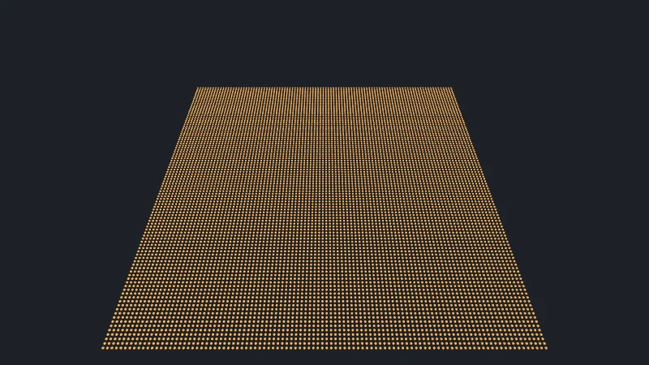
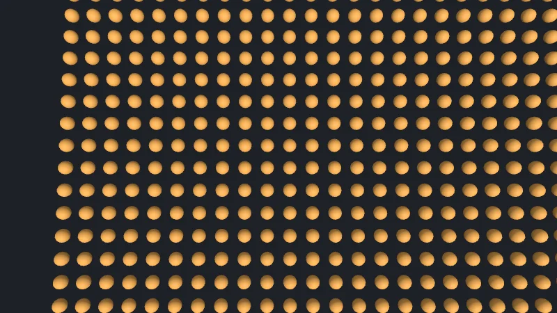

Code : la page dans [`src/08-performance/main.ts`](https://github.com/spareilleux/learn/blob/8bf126b/code/threejs/src/08-performance/main.ts).

## Ce que coûte chaque chose

Une image a deux coûts. Côté CPU, three.js parcourt le graphe de scène, met à jour les matrices, écarte ce que la caméra ne voit pas, trie, et envoie une commande de dessin par objet. Côté GPU, chaque commande exécute les shaders sur ses triangles et ses pixels. Une scène faite de nombreux petits objets est limitée par le CPU : le GPU attend pendant que JavaScript prépare des milliers de commandes. Une scène de quelques maillages énormes, ou une lourde chaîne de post-traitement, est limitée par le GPU. Les remèdes diffèrent, donc la première étape est de compter.

| | WPF 3D | MonoGame | three.js |
|---|---|---|---|
| Beaucoup de copies d'un même maillage | un `ModelVisual3D` chacune, ou un seul `MeshGeometry3D` fusionné | [`DrawInstancedPrimitives`](https://docs.monogame.net/api/Microsoft.Xna.Framework.Graphics.GraphicsDevice.html) avec un vertex buffer de données d'instance | [`InstancedMesh`](https://threejs.org/docs/pages/InstancedMesh.html) |
| Des maillages différents, un seul matériau | à fusionner vous-même | à fusionner vous-même | [`BatchedMesh`](https://threejs.org/docs/pages/BatchedMesh.html) |
| Moins de triangles au loin | rien d'intégré | votre code | [`LOD`](https://threejs.org/docs/pages/LOD.html) |
| Ignorer ce qui est hors écran | fait par WPF | votre code, avec `BoundingFrustum` | automatique, par objet, d'après sa sphère englobante |
| Compter | WPF Performance Suite | vos compteurs, ou un profileur GPU | [`renderer.info`](https://threejs.org/docs/pages/Info.html), le panneau Performance du navigateur |

## Le test : 10 000 marqueurs

La page dessine 10 000 petits icosaèdres orange de 80 triangles sur une grille de 100 × 100, espacés de 0.1 unité, comme une application de manche pourrait dessiner chaque note d'une gamme sur chaque corde de nombreux manches. `?mode=` choisit comment ils sont construits, et `?view=close` place la caméra 1.5 unité au-dessus d'un coin, tournée vers le bas, pour que la plupart des marqueurs soient hors écran.



Après trois images, la page lit `renderer.info`, puis rend 20 images de plus dans une boucle et divise le temps : le temps CPU d'un appel à `renderer.render()`, qui enregistre et soumet les commandes ; le GPU travaille ensuite, et n'est pas compté dans ce nombre. Elle mesure aussi le temps de construction des marqueurs (`setupMs`) et celui de la première image, qui comprend la compilation des shaders (`firstFrameMs`). `check.sh` compare les comptes, et affiche les temps sans les comparer.

```text
$ node scripts/probe.mjs 08-performance --query mode=meshes
{
  "frame": 4,
  "render": {
    "calls": 6,
    "drawCalls": 10001,
    "triangles": 800001
  },
  "memory": {
    "geometries": 2,
    "textures": 3,
    "programs": 4
  },
  "mode": "meshes",
  "count": 10000,
  "view": "all",
  "sceneChildren": 10002,
}
```

Chaque mode, d'après les sorties de `check.sh`, avec les temps d'une exécution sur la machine de l'auteur (WebGPU, une NVIDIA RTX 5080). Les temps varient d'une exécution à l'autre : des exécutions précédentes, en moyenne sur 60 images, donnaient 11.7 et 13.8 ms pour `meshes`, et 0.11 ms pour `instanced`.

| `?mode=` | enfants de la scène | draw calls | triangles | géométries | construction | première image | une image, CPU |
|---|---|---|---|---|---|---|---|
| `meshes` : un `Mesh` chacun, géométrie et matériau partagés | 10 002 | 10 001 | 800 001 | 2 | 18 ms | 229 ms | 10.3 ms |
| `unshared` : une nouvelle géométrie et un nouveau matériau par `Mesh` | 10 002 | 10 001 | 800 001 | 10 001 | 309 ms | 446 ms | 32.9 ms |
| `instanced` : un seul `InstancedMesh` | 3 | 2 | 800 001 | 2 | 4.6 ms | 21.4 ms | 0.16 ms |
| `batched` : un seul `BatchedMesh` | 3 | 10 001 | 800 001 | 2 | 2.9 ms | 30.3 ms | 1.24 ms |
| `lod` : un `LOD` de trois niveaux `Mesh` chacun | 10 002 | 10 001 | 200 001 | 2 | 62 ms | 252 ms | 21.8 ms |

Les enfants de la scène comprennent les deux lumières ; les draw calls et les triangles comprennent le triangle unique de la passe de sortie.

### Maillages : un draw call chacun

10 000 maillages font 10 000 draw calls, et 10.3 ms de CPU par image : à 60 images par seconde, 62 % du budget de 16.7 ms est consommé avant tout autre travail. Le GPU ne dessine que 800 000 triangles, ce qu'il gère sans peine.

Des géométries et des matériaux **non partagés** ne changent rien à l'écran, et font plus que tripler le temps CPU. `memory.geometries` compte 10 001 buffers sur le GPU. `memory.programs` reste à 4 : three.js reconnaît que 10 000 matériaux identiques ont besoin du même shader, mais chaque matériau a toujours ses propres uniforms et bindings à mettre à jour et à vérifier à chaque image. Les construire coûte 309 ms, et les libérer, 20 000 appels.

### InstancedMesh : un seul draw call

Un [`InstancedMesh`](https://threejs.org/docs/pages/InstancedMesh.html) contient une géométrie, un matériau, et une matrice par instance dans un buffer du GPU ([lignes 60-65](https://github.com/spareilleux/learn/blob/8bf126b/code/threejs/src/08-performance/main.ts#L60-L65)) :

```ts
} else if (mode === 'instanced') {
  // Un seul objet, une seule géométrie, une matrice par instance dans un buffer du GPU
  const markers = new THREE.InstancedMesh(geometry, material, count);
  for (let i = 0; i < count; i++) markers.setMatrixAt(i, matrix.makeTranslation(positionOf(i, position)));
  markers.computeBoundingSphere();
  scene.add(markers);
```

Les mêmes 800 000 triangles, en un seul draw call, pour 0.16 ms de CPU : soixante fois moins que les maillages. `setColorAt` donne à chaque instance sa propre couleur, et après avoir modifié des matrices ou des couleurs, `instanceMatrix.needsUpdate = true` renvoie le buffer au GPU. Les instances partagent tout le reste : une géométrie, un matériau. `computeBoundingSphere()` compte : la sphère doit couvrir toutes les instances, pas la géométrie à l'origine, sinon tout le maillage est écarté dès que l'origine sort de l'écran.

### BatchedMesh : un objet, plusieurs dessins

Un [`BatchedMesh`](https://threejs.org/docs/pages/BatchedMesh.html) contient plusieurs géométries dans des buffers partagés, avec un seul matériau, et dessine des instances de n'importe laquelle d'entre elles ([lignes 81-86](https://github.com/spareilleux/learn/blob/8bf126b/code/threejs/src/08-performance/main.ts#L81-L86)). Il sert aux scènes dont les objets partagent un matériau mais pas une forme : les frettes, les incrustations et les marqueurs d'un même manche, par exemple.

Il compte 10 001 draw calls sur WebGPU, et ne prend pourtant que 1.24 ms. Le backend WebGPU émet un `drawIndexed` par instance, dans une seule passe de rendu et avec le même pipeline et les mêmes bindings ([`WebGPUBackend.js`, lignes 2124-2145](https://github.com/mrdoob/three.js/blob/r186/src/renderers/webgpu/WebGPUBackend.js#L2124-L2145)). C'est la partie bon marché d'un draw call ; la partie coûteuse pour `meshes`, c'est tout ce que three.js fait par objet avant. L'exercice 2 montre ce que compte le même `BatchedMesh` sur WebGL.

### LOD : moins de triangles, plus de travail

Un [`LOD`](https://threejs.org/docs/pages/LOD.html) contient plusieurs versions d'un objet, et affiche celle qui correspond à la distance ([lignes 87-96](https://github.com/spareilleux/learn/blob/8bf126b/code/threejs/src/08-performance/main.ts#L87-L96)) : 320 triangles à moins de 3 unités, 80 à partir de 3 unités, 20 à partir de 8. Depuis la caméra de la vue d'ensemble, chaque marqueur est à plus de 8 unités : 200 000 triangles au lieu de 800 000. Mais 10 000 objets `LOD`, ce sont 10 000 tests de distance par image en plus des 10 000 maillages : 21.8 ms de CPU, deux fois plus que les maillages simples. `LOD` économise du travail GPU sur de gros maillages ; pour de nombreux petits objets, il coûte plus qu'il n'économise. `BatchedMesh` peut changer la géométrie d'une instance avec `setGeometryIdAt`, ce qui donne des niveaux de détail sans les objets.

## Le frustum culling, vu de près

Avec `?view=close`, la caméra regarde un coin de la grille :



| `?mode=`, `?view=close` | draw calls | triangles | une image, CPU |
|---|---|---|---|
| `meshes` | 345 | 27 521 | 1.46 ms |
| `instanced` | 2 | 800 001 | 0.11 ms |
| `batched` | 345 | 27 521 | 0.60 ms |
| `lod` | 345 | 61 921 | 11.5 ms |

(Les temps de la vue rapprochée viennent d'une exécution précédente de la même page, en moyenne sur 60 images ; `check.sh` n'affiche que ceux de la vue d'ensemble.)

- **Maillages** : 344 marqueurs sont dans le frustum de la caméra, et three.js ignore les 9 656 autres, chacun testé contre sa sphère englobante ([`Renderer.js`, lignes 3290-3294](https://github.com/mrdoob/three.js/blob/r186/src/renderers/common/Renderer.js#L3290-L3294)). Le temps CPU tombe à 1.46 ms, mais le test lui-même parcourt toujours 10 000 objets.
- **InstancedMesh** : tout ou rien. Sa sphère englobante couvre toute la grille, qui est à l'écran, donc le GPU reçoit les 800 000 triangles et en élimine la plupart après le vertex shader. L'exercice 1 le découpe en tuiles.
- **BatchedMesh** : `perObjectFrustumCulled` vaut `true` par défaut, donc il teste chaque instance avant de la dessiner ([`BatchedMesh.js`, lignes 1590-1606](https://github.com/mrdoob/three.js/blob/r186/src/objects/BatchedMesh.js#L1590-L1606)) : les mêmes 344 marqueurs qu'avec les maillages, en deux fois moins de temps.
- **LOD** : de près, les marqueurs visibles passent à leurs niveaux détaillés, et les triangles font plus que doubler, tandis que les 10 000 mises à jour de distance restent.

`frustumCulled = false` sur un objet désactive le test : il est toujours dessiné. C'est le bon choix pour un objet dont les sommets bougent dans le shader au-delà de sa sphère englobante, comme la corde de la leçon 6, et du gaspillage sinon.

## Lire les nombres

- `info.render` est remis à zéro au début de chaque image d'animation, pas à chaque appel à `render()` ([`Animation.js`, ligne 81](https://github.com/mrdoob/three.js/blob/r186/src/renderers/common/Animation.js#L81), et [`Info.js`, lignes 184-198](https://github.com/mrdoob/three.js/blob/r186/src/renderers/common/Info.js#L184-L198)) : une page qui rend plusieurs fois par image, ou en dehors de `setAnimationLoop`, voit des comptes qui s'additionnent. C'est pour cette raison que la page les lit avant sa boucle de chronométrage.
- `drawCalls` compte ce que three.js a demandé, pas ce que le GPU a fait : l'exercice 2 montre un `BatchedMesh` compté une seule fois sur WebGL.
- Le temps CPU dans un navigateur est grossier : `performance.now()` est arrondi, à 100 µs ou moins selon l'isolation de la page. La moyenne sur 20 images le masque. Le temps GPU n'est pas dans ce nombre ; avec WebGPU, une timestamp query le mesure, quand l'adaptateur offre la fonctionnalité `timestamp-query` (*à vérifier* sur le GPU de l'auteur).
- Les runners de CI Linux et Windows n'ont pas de GPU, et rendent avec SwiftShader sur le CPU : leurs temps ne disent rien d'une vraie machine. Le runner macOS a WebGPU sur le GPU paravirtualisé d'Apple ; dans [l'exécution 35123228046](https://github.com/spareilleux/learn/actions/runs/35123228046), en moyenne sur 60 images, il a pris 22.8 ms pour `meshes`, 60.4 ms pour `unshared`, 0.23 ms pour `instanced`, 1.95 ms pour `batched` et 29.1 ms pour `lod` : plus lent que la machine de l'auteur, dans le même ordre. Les comptes sont les mêmes partout, sauf ceux de l'exercice 2.

## Dans GuitarAlchemist/ga

GA utilise `InstancedMesh` dans 9 fichiers, `BatchedMesh` et `THREE.LOD` dans aucun.

- **Un manche fait de maillages séparés.** `ThreeFretboard.tsx` construit, avec ses 22 frettes et 6 cordes par défaut et sans marqueurs, environ 49 maillages et 29 sprites. Chaque frette reçoit sa propre `CapsuleGeometry` et son propre `MeshPhysicalMaterial` avec clearcoat ([lignes 960-1016](https://github.com/GuitarAlchemist/ga/blob/05c8eda013f2a4d11efaa52c4ca94674521ee684/ReactComponents/ga-react-components/src/components/ThreeFretboard.tsx#L960-L1016)), alors que la boucle donne aux 22 la même forme, puisque chaque frette couvre toute la largeur du manche, et les mêmes réglages de matériau : la ligne `unshared`, à petite échelle. Chaque marqueur de position reçoit une nouvelle `SphereGeometry(markerRadius, 32, 32)`, 1 984 triangles, et un nouveau matériau ([lignes 1311-1335](https://github.com/GuitarAlchemist/ga/blob/05c8eda013f2a4d11efaa52c4ca94674521ee684/ReactComponents/ga-react-components/src/components/ThreeFretboard.tsx#L1311-L1335)). Une gamme de sept notes affichée sur six cordes, de la corde à vide à la frette 22, fait environ 80 marqueurs, quelque 160 000 triangles pour de petits points ; un seul `InstancedMesh` avec `setColorAt` les dessinerait en un seul appel.
- **Une scène reconstruite alors que les props ne changent pas.** L'effet qui construit le manche liste `positions` parmi ses dépendances ([ligne 424](https://github.com/GuitarAlchemist/ga/blob/05c8eda013f2a4d11efaa52c4ca94674521ee684/ReactComponents/ga-react-components/src/components/ThreeFretboard.tsx#L424)), et `positions` vaut `[]` par défaut dans la liste des paramètres ([ligne 58](https://github.com/GuitarAlchemist/ga/blob/05c8eda013f2a4d11efaa52c4ca94674521ee684/ReactComponents/ga-react-components/src/components/ThreeFretboard.tsx#L58)) : un nouveau tableau à chaque rendu d'un parent qui ne le passe pas, donc toute la scène est libérée et reconstruite chaque fois que le parent se rend. Que cela arrive dans les pages de GA est *à vérifier* avec le profileur de React ; le [cours React (Vite)](../../react-vite/) traite des dépendances stables. Le nettoyage ne libère que les maillages ([lignes 388-414](https://github.com/GuitarAlchemist/ga/blob/05c8eda013f2a4d11efaa52c4ca94674521ee684/ReactComponents/ga-react-components/src/components/ThreeFretboard.tsx#L388-L414)) : les 29 sprites, chacun avec sa propre texture canvas, restent en mémoire.
- **Un instancing bien fait, un culling désactivé.** Le `NodeInstancer.ts` de Prime Radiant dessine les nœuds de son graphe avec un `InstancedMesh` par type de nœud, avec des couleurs par instance et un matériau partagé ([lignes 160-180](https://github.com/GuitarAlchemist/ga/blob/05c8eda013f2a4d11efaa52c4ca94674521ee684/ReactComponents/ga-react-components/src/components/PrimeRadiant/NodeInstancer.ts#L160-L180)), et règle `frustumCulled = false` parce que « force-graph moves nodes ». L'alternative est `computeBoundingSphere()` après le changement des positions ; avec un graphe qui est en général entièrement à l'écran, la différence est faible. `frustumCulled = false` apparaît dans 15 fichiers de GA.
- **Le pixel ratio.** 11 fichiers appellent `setPixelRatio(window.devicePixelRatio)` sans plafond, et `ThreeFretboard.tsx` demande jusqu'à 6 ([ligne 204](https://github.com/GuitarAlchemist/ga/blob/05c8eda013f2a4d11efaa52c4ca94674521ee684/ReactComponents/ga-react-components/src/components/ThreeFretboard.tsx#L204)). Le nombre de pixels croît avec le carré du ratio, et chaque passe plein écran de la leçon 7 avec lui.

## À retenir

- Comptez avant d'optimiser : `renderer.info.render.drawCalls` et `triangles`, lus une fois par image d'animation, et le temps CPU de `renderer.render()`.
- Beaucoup d'objets coûtent du CPU par objet : 10 000 maillages ont pris ici 10.3 ms par image, un seul `InstancedMesh` des mêmes marqueurs 0.16 ms.
- Partagez les géométries et les matériaux : des copies non partagées ont plus que triplé le temps CPU sans changer un pixel.
- `InstancedMesh` pour de nombreuses copies d'une même forme ; `BatchedMesh` pour de nombreuses formes avec un seul matériau, écartées instance par instance.
- `LOD` économise des triangles, pas du CPU : pour de nombreux petits objets, il peut coûter plus qu'il n'économise.
- Le frustum culling agit par objet : découpez un gros `InstancedMesh` en tuiles, et gardez des sphères englobantes justes plutôt que de désactiver le culling.

## Exercices

1. De près, l'`InstancedMesh` envoie toujours 800 000 triangles. Découpez la grille en 4 × 4 tuiles, un `InstancedMesh` par tuile, et mesurez la vue rapprochée.
2. Passez le `BatchedMesh` à la sonde sur le backend WebGL 2, avec `--webgl`. Pourquoi les draw calls diffèrent-ils des 10 001 de WebGPU, et le GPU en fait-il vraiment moins ?
3. Le manche de GA pourrait afficher une gamme sous forme de marqueurs. Planifiez le passage d'un `Mesh` par marqueur à l'instancing : ce qui reste propre à chaque marqueur, ce qui devient partagé, et ce que le composant doit faire quand la gamme change.

<details>
<summary>Solution 1</summary>

Le mode `tiles` regroupe les marqueurs par tuile, et donne à chaque tuile son propre `InstancedMesh` et sa propre sphère englobante ([lignes 66-80](https://github.com/spareilleux/learn/blob/8bf126b/code/threejs/src/08-performance/main.ts#L66-L80)) :

```text
$ node scripts/probe.mjs 08-performance --query "mode=tiles&view=close"
{
  "frame": 4,
  "render": {
    "calls": 6,
    "drawCalls": 3,
    "triangles": 100001
  },
  "memory": {
    "geometries": 2,
    "textures": 3,
    "programs": 5
  },
  "mode": "tiles",
  "count": 10000,
  "view": "close",
  "sceneChildren": 18,
}
```

Deux des 16 tuiles touchent le frustum : 3 draw calls avec la passe de sortie, et 100 000 triangles, un huitième de la grille, au lieu de la grille entière. La taille des tuiles est un compromis : des tuiles plus petites sont mieux écartées, et coûtent plus de draw calls quand tout est à l'écran, 17 pour la vue d'ensemble au lieu de 2 (calculé : 16 tuiles et la passe de sortie, puisque la vue d'ensemble montre tous les marqueurs). `memory.programs` vaut 5, un de plus qu'avec un seul `InstancedMesh` : une différence dans le nombre d'instances ou dans les buffers des tuiles donne à l'une d'elles son propre pipeline (*à vérifier* dans le code source). Pour une caméra qui bouge, le culling par instance de `BatchedMesh` fait la même chose sans avoir à choisir une taille de tuile.

</details>

<details>
<summary>Solution 2</summary>

```text
$ node scripts/probe.mjs 08-performance --webgl --query mode=batched
{
  "frame": 4,
  "render": {
    "calls": 6,
    "drawCalls": 2,
    "triangles": 800001
  },
  "memory": {
    "geometries": 2,
    "textures": 5,
    "programs": 4
  },
  "mode": "batched",
  "count": 10000,
  "view": "all",
  "sceneChildren": 3,
}
```

2 draw calls : le batch et la passe de sortie. Quand le navigateur offre l'extension [`WEBGL_multi_draw`](https://registry.khronos.org/webgl/extensions/WEBGL_multi_draw/), le backend WebGL dessine les 10 000 plages avec un seul appel à `multiDrawElementsWEBGL`, et le compte une fois ([`WebGLBufferRenderer.js`, lignes 53-90](https://github.com/mrdoob/three.js/blob/r186/src/renderers/webgl-fallback/WebGLBufferRenderer.js#L53-L90)). Le GPU dessine toujours 10 000 plages et 800 000 triangles ; ce qui change, c'est un seul appel de JavaScript vers le pilote au lieu de 10 000. WebGPU n'a pas d'appel multi-draw dans sa première spécification, donc son backend boucle sur `drawIndexed`, qui y est bon marché. Sans l'extension, le backend WebGL boucle aussi, avec un uniform `drawId` par dessin ([`WebGLBackend.js`, lignes 1055-1077](https://github.com/mrdoob/three.js/blob/r186/src/renderers/webgl-fallback/WebGLBackend.js#L1055-L1077)), et le compte revient à 10 001. `drawCalls` seul ne permet donc pas de comparer deux backends : comparez aussi le temps CPU. Les runners de CI Linux et Windows, qui se replient sur WebGL 2 avec SwiftShader, ont l'extension, et comptent 2 pour l'exécution par défaut aussi : `check.sh` garde cette sortie dans `expected/l08_probe_batched.webgl.txt`.

</details>

<details>
<summary>Solution 3</summary>

Par marqueur : une matrice, calculée à partir de la corde et de la frette, avec le rayon dans son échelle (les marqueurs `emphasized` font 0.25, les autres 0.2), et une couleur avec `setColorAt`. Partagés : une seule `SphereGeometry` avec bien moins de segments, 16 × 12 suffit largement pour un point, et un seul `MeshStandardMaterial` ; la couleur `emissive` propre à chaque marqueur ne peut pas varier par instance avec un matériau simple, donc soit vous l'abandonnez, soit vous utilisez un node material dont l'`emissiveNode` lit la couleur de l'instance. Quand la gamme change : allouez une fois l'`InstancedMesh` pour le plus grand nombre de marqueurs, réglez `count` sur le nombre de marqueurs, écrivez les matrices et les couleurs, et mettez `instanceMatrix.needsUpdate` et `instanceColor.needsUpdate` à true, sans reconstruire le reste du manche. Les étiquettes, qui sont des sprites ayant chacun sa texture, sont un problème à part : un seul atlas de textures, ou des étiquettes HTML par-dessus le canvas. C'est un plan, pas du code exécuté sur GA (*à vérifier*).

</details>

## Sources

- Documentation de three.js : [`InstancedMesh`](https://threejs.org/docs/pages/InstancedMesh.html), [`BatchedMesh`](https://threejs.org/docs/pages/BatchedMesh.html), [`LOD`](https://threejs.org/docs/pages/LOD.html), [`Info`](https://threejs.org/docs/pages/Info.html) ; manuel : [optimize lots of objects](https://threejs.org/manual/pages/optimize-lots-of-objects.html)
- Code source de three.js à r186 : [`Renderer.js`](https://github.com/mrdoob/three.js/blob/r186/src/renderers/common/Renderer.js), [`Info.js`](https://github.com/mrdoob/three.js/blob/r186/src/renderers/common/Info.js), [`BatchedMesh.js`](https://github.com/mrdoob/three.js/blob/r186/src/objects/BatchedMesh.js), [`InstancedMesh.js`](https://github.com/mrdoob/three.js/blob/r186/src/objects/InstancedMesh.js), [`WebGPUBackend.js`](https://github.com/mrdoob/three.js/blob/r186/src/renderers/webgpu/WebGPUBackend.js), [`WebGLBufferRenderer.js`](https://github.com/mrdoob/three.js/blob/r186/src/renderers/webgl-fallback/WebGLBufferRenderer.js)
- Khronos : [`WEBGL_multi_draw`](https://registry.khronos.org/webgl/extensions/WEBGL_multi_draw/) ; W3C : [WebGPU](https://gpuweb.github.io/gpuweb/) ; MDN : [`performance.now()`](https://developer.mozilla.org/docs/Web/API/Performance/now)
- MonoGame : [`GraphicsDevice`](https://docs.monogame.net/api/Microsoft.Xna.Framework.Graphics.GraphicsDevice.html)
