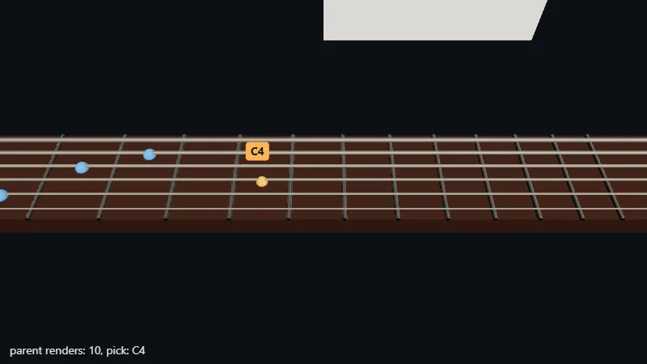

Code : le composant dans [`src/09-r3f/Fretboard.tsx`](https://github.com/spareilleux/learn/blob/eeca669/code/threejs/src/09-r3f/Fretboard.tsx), et la page qui le monte dans [`src/09-r3f/main.tsx`](https://github.com/spareilleux/learn/blob/eeca669/code/threejs/src/09-r3f/main.tsx).

## Un renderer pour React

[React Three Fiber](https://r3f.docs.pmnd.rs/) (R3F) est un renderer React, comme `react-dom`, dont les éléments hôtes sont des objets three.js au lieu de nœuds du DOM. `<mesh>` crée un `THREE.Mesh`, `<boxGeometry args={[1, 2, 3]} />` appelle `new THREE.BoxGeometry(1, 2, 3)` et l'attache comme `geometry` du parent, et toute autre prop est affectée comme propriété : `position={[1, 0, 0]}` appelle `position.set(1, 0, 0)`, `rotation-x={0.5}` règle `rotation.x`. Le reconciler de React décide quoi créer, mettre à jour et retirer ; R3F l'applique au graphe de scène, et rend la scène dans sa propre boucle. [drei](https://drei.docs.pmnd.rs/) est une bibliothèque de composants prêts à l'emploi construite par-dessus : contrôles, surcouches HTML, texte, loaders, helpers.

Si vous connaissez WPF, l'idée vous est familière : un arbre déclaratif, où une propriété modifiée met à jour un objet au lieu de reconstruire la scène. La différence tient à la façon dont arrivent les changements. WPF lie des propriétés à des objets observables ; React réexécute la fonction du composant et compare sa sortie.

| | WPF 3D | three.js | React Three Fiber |
|---|---|---|---|
| Description de la scène | XAML : `<ModelVisual3D>`, `<GeometryModel3D>` | du code : `new Mesh()`, `scene.add()` | JSX : `<mesh>`, `<group>` |
| Mises à jour | des bindings vers `INotifyPropertyChanged` | votre code règle les propriétés | un nouveau rendu ; R3F compare les props |
| Arguments du constructeur | aucun : des propriétés seulement | `new BoxGeometry(1, 2, 3)` | `args={[1, 2, 3]}`, et un nouvel objet quand ils changent |
| La boucle | le thread de composition de WPF | `setAnimationLoop` | la boucle de R3F ; `useFrame` y exécute un callback |
| Hit testing | `VisualTreeHelper.HitTest` | `Raycaster` | `onClick`, `onPointerMove` sur n'importe quel objet |
| Libération | le ramasse-miettes | `dispose()`, à vous de l'appeler | automatique au démontage, pour ce que R3F a créé |

## Versions

Le cours épingle [`@react-three/fiber`](https://www.npmjs.com/package/@react-three/fiber) 9.7.0 et [`@react-three/drei`](https://www.npmjs.com/package/@react-three/drei) 10.7.8. React 19.3.0 est sorti le 9 septembre 2026, mais R3F 9.7.0 déclare une peer dependency sur `react` `>=19 <19.3` : le cours épingle `react` et `react-dom` 19.2.8. R3F 10 et drei 11 sont en alpha (10.0.0-alpha.5 et 11.0.0-alpha.7), et ne sont pas utilisés ici. R3F 8, qu'utilise GuitarAlchemist, ne prend en charge que React 18.

Le [`tsconfig.json`](https://github.com/spareilleux/learn/blob/eeca669/code/threejs/tsconfig.json) du cours ajoute `"jsx": "react-jsx"`, que la transformation propre à Vite suit aussi. Les types des éléments de R3F viennent de son paquet : `<mesh>` est vérifié par rapport aux propriétés de `THREE.Mesh`.

## La touche en composant

[`Fretboard.tsx`](https://github.com/spareilleux/learn/blob/eeca669/code/threejs/src/09-r3f/Fretboard.tsx) reconstruit le manche de la leçon 5, en réutilisant son [`fretboard.ts`](https://github.com/spareilleux/learn/blob/eeca669/code/threejs/src/05-picking/fretboard.ts) pour les positions des frettes et les notes. Le manche est un maillage qui a sa géométrie et son matériau pour enfants ([lignes 58-61](https://github.com/spareilleux/learn/blob/eeca669/code/threejs/src/09-r3f/Fretboard.tsx#L58-L61)) :

```tsx
<mesh name="neck" position={[NUT_X + NECK_LENGTH / 2, NECK_TOP - 0.06, 0]}>
  <boxGeometry args={[NECK_LENGTH, 0.12, NECK_WIDTH]} />
  <meshStandardMaterial color={0x4a2c1d} roughness={0.75} />
</mesh>
```

Les frettes peuvent s'écrire de deux façons, au choix de la prop `frets` ([lignes 62-71](https://github.com/spareilleux/learn/blob/eeca669/code/threejs/src/09-r3f/Fretboard.tsx#L62-L71)) : `'inline'` place une `<cylinderGeometry>` et un `<meshStandardMaterial>` dans chacun des 12 maillages de frette, comme le fait naturellement une boucle qui écrit du JSX ; `'shared'` leur passe à tous une seule géométrie et un seul matériau, créés avec `useMemo` ([lignes 30-39](https://github.com/spareilleux/learn/blob/eeca669/code/threejs/src/09-r3f/Fretboard.tsx#L30-L39)) :

```tsx
// Créés une fois par composant, pas une fois par rendu ; R3F ne libère pas ce qu'il n'a pas créé, donc c'est l'effet qui le fait
const fretGeometry = useMemo(() => new THREE.CylinderGeometry(0.012, 0.012, NECK_WIDTH, 12).rotateX(Math.PI / 2), []);
const fretMaterial = useMemo(() => new THREE.MeshStandardMaterial({ color: 0xc9c5bd, metalness: 1, roughness: 0.3 }), []);
useEffect(
  () => () => {
    fretGeometry.dispose();
    fretMaterial.dispose();
  },
  [fretGeometry, fretMaterial],
);
```

Les marqueurs d'un accord de do majeur sont calculés à partir de la prop `markers` avec `useMemo`, et un compteur enregistre chaque fois que cela se produit ([lignes 41-45](https://github.com/spareilleux/learn/blob/eeca669/code/threejs/src/09-r3f/Fretboard.tsx#L41-L45)). La page passe soit une constante de module, soit, avec `?markers=literal`, un nouveau tableau de même contenu à chaque rendu, comme le ferait `<Fretboard markers={[...]} />`.

## WebGPURenderer dans un Canvas

`<Canvas>` crée un `WebGLRenderer` par défaut. R3F 9 accepte, comme prop `gl`, une fonction qui renvoie un renderer ou une promesse de renderer ; `WebGPURenderer` doit être initialisé avant sa première image, donc la fonction est `async` ([`main.tsx`, lignes 40-52](https://github.com/spareilleux/learn/blob/eeca669/code/threejs/src/09-r3f/main.tsx#L40-L52)) :

```tsx
<Canvas
  // R3F 9 accepte une fonction qui renvoie un renderer, ou une promesse de renderer : WebGPURenderer doit être initialisé
  gl={async (props) => {
    const renderer = new THREE.WebGPURenderer({ ...(props as object), antialias: true, forceWebGL });
    await renderer.init();
    return renderer;
  }}
  camera={{ position: [-0.2, 2.4, 1.6], fov: 40 }}
  onCreated={(state) => {
    state.camera.lookAt(-0.2, 0.3, 0);
    control.state = state;
  }}
>
```

Les `props` contiennent le canvas créé par R3F. La page importe `three/webgpu`, tandis que R3F et drei importent `three`. Les deux points d'entrée partagent leurs classes de base, issues de `three.core.js`, donc un `Mesh` de l'un est un `Mesh` pour l'autre, et `WebGPURenderer` convertit `MeshStandardMaterial` en sa version node. Mais `three` apporte aussi dans la page `WebGLRenderer` et ses shader chunks, qu'elle n'utilise jamais (le build de la leçon 13 liste les chunks).

Deux avertissements apparaissent dans la console du navigateur à chaque exécution, tous deux venant de R3F 9.7.0 et non de la page :

- `THREE.Clock: This module has been deprecated. Please use THREE.Timer instead.` Le store de R3F crée une `Clock` pour le `delta` de `useFrame` ([`events-156d8d12.esm.js`, ligne 1016](https://unpkg.com/@react-three/fiber@9.7.0/dist/events-156d8d12.esm.js)).
- `THREE.WebGPURenderer: PCFSoftShadowMap has been removed. Using PCFShadowMap instead.`, 14 fois lors d'une exécution de la sonde sur la machine de l'auteur, 13 dans `chromium-headless-shell`. La prop `shadows` de `<Canvas>` vaut `false` par défaut, un booléen, et R3F règle `shadowMap.type = PCFSoftShadowMap` pour tout booléen, puis `WebGPURenderer` le remet à `PCFShadowMap` avec un avertissement ([`Renderer.js`, lignes 1658-1664](https://github.com/mrdoob/three.js/blob/r186/src/renderers/common/Renderer.js#L1658-L1664)). R3F configure à nouveau le renderer chaque fois que `<Canvas>` se rend, donc chaque nouveau rendu de l'`App` de la page avertit une fois de plus, et le compte dépend du nombre d'événements de pointeur arrivés. `check.sh` retire la ligne de la sortie comparée, et affiche le compte.

## Mesurer un nouveau rendu

La page rapporte `renderer.info` et les deux compteurs après trois images, puis rend à nouveau son `App` 10 fois, à une image d'intervalle, puis déplace le pointeur au-dessus de la corde 3, case 5, puis démonte la touche ([`main.tsx`, lignes 117-155](https://github.com/spareilleux/learn/blob/eeca669/code/threejs/src/09-r3f/main.tsx#L117-L155)). Chaque nouveau rendu passe par [`flushSync`](https://react.dev/reference/react-dom/flushSync), qui rend et valide (commit) avant de rendre la main. Sans lui, React regroupe les mises à jour d'état qui arrivent avant qu'il ait pu rendre : dans `chromium-headless-shell`, dont le rendu logiciel est lent, les 10 mises à jour ont donné 6 rendus de `Fretboard` au lieu de 11.

```text
$ node scripts/probe.mjs 09-r3f
{
  "frets": "shared",
  "markers": "stable",
  "first": {
    "drawCalls": 23,
    "triangles": 1453,
    "geometries": 12,
    "programs": 4,
    "meshes": 22,
    "fretboardRenders": 1,
    "markerBuilds": 1
  },
  "afterTenParentRenders": {
    "drawCalls": 23,
    "triangles": 1453,
    "geometries": 12,
    "programs": 4,
    "meshes": 22,
    "fretboardRenders": 11,
    "markerBuilds": 1
  },
```

22 maillages : le manche, 12 frettes, 6 cordes et 3 marqueurs ; 23 draw calls avec la passe de sortie. 12 géométries : celle du manche, celle que partagent les frettes, 6 cordes, 3 marqueurs, et le triangle de la passe de sortie. Les 10 rendus du parent ont réexécuté `Fretboard` 10 fois, puisqu'un composant React se rend à nouveau avec son parent sauf s'il est enveloppé dans `memo`, et R3F a comparé les nouvelles props aux anciennes : rien n'a changé dans la scène.

Avec `?frets=inline&markers=literal` :

```text
$ node scripts/probe.mjs 09-r3f --query "frets=inline&markers=literal"
{
  "frets": "inline",
  "markers": "literal",
  "first": {
    "drawCalls": 23,
    "triangles": 1453,
    "geometries": 23,
    "programs": 4,
    "meshes": 22,
    "fretboardRenders": 1,
    "markerBuilds": 1
  },
  "afterTenParentRenders": {
    "drawCalls": 23,
    "triangles": 1453,
    "geometries": 23,
    "programs": 4,
    "meshes": 22,
    "fretboardRenders": 11,
    "markerBuilds": 11
  },
```

La même image, avec 23 géométries sur le GPU au lieu de 12 : une par frette. Les draw calls ne changent pas, puisque chaque frette était déjà son propre maillage. `programs` reste à 4 : des matériaux identiques partagent un shader. Et le `useMemo` des marqueurs s'est réexécuté à chaque rendu, puisque sa dépendance était chaque fois un nouveau tableau. Ici, cela recalcule trois positions ; R3F compare ensuite les tableaux `position` élément par élément et ne change rien. Le coût grandit quand un nouveau tableau reconstruit quelque chose de coûteux : une géométrie, une texture ou, comme la leçon 13 le montre dans GuitarAlchemist, une scène entière.

R3F compare les props, mais il compare `args` par référence, élément par élément ([`events-156d8d12.esm.js`, `commitUpdate`](https://unpkg.com/@react-three/fiber@9.7.0/dist/events-156d8d12.esm.js)) : `<extrudeGeometry args={[shape, { depth: 0.3 }]} />` construit une nouvelle géométrie à chaque rendu, parce que `{ depth: 0.3 }` est chaque fois un nouvel objet. R3F 8.18.0 fait la même comparaison.

## Des événements de pointeur sans Raycaster

R3F lance pour vous les rayons depuis le pointeur, et appelle `onPointerMove`, `onClick` et les autres sur les objets touchés, du plus proche au plus lointain, avec l'intersection dans l'événement : `event.point`, `event.object`, `event.distance`. Le groupe gère l'événement pour tous ses enfants ([lignes 47-54](https://github.com/spareilleux/learn/blob/eeca669/code/threejs/src/09-r3f/Fretboard.tsx#L47-L54)) :

```tsx
function handlePointer(event: ThreeEvent<PointerEvent>) {
  // R3F lance les rayons pour nous : event.point est le point touché par le rayon, en coordonnées monde
  event.stopPropagation();
  setHover(event.point.clone());
  const fret = fretAt(event.point.x);
  const string = stringAt(event.point.z);
  onPick?.({ fret, string, note: fret === null ? null : noteName(string, fret) });
}
```

`stopPropagation()` arrête l'événement à l'objet le plus proche, comme la leçon 5 prenait la première intersection. La sphère de survol a `raycast={() => null}`, donc le rayon la traverse, comme avec les `layers` de la leçon 5. `event.point` est un vecteur que R3F réutilise, d'où le `clone()` avant de le garder dans l'état.

Après que Playwright a déplacé la vraie souris au-dessus de la corde 3, case 5 :

```text
  "after": {
    "string 3, fret 5": {
      "status": "parent renders: 10, pick: C4",
      "label": "C4",
      "drawCalls": 24,
      "triangles": 1677,
      "geometries": 13,
      "programs": 4,
      "meshes": 23
    },
```

Les compteurs ne sont plus rapportés après le déplacement du pointeur : le navigateur fusionne les événements `pointermove` quand les images sont lentes, donc le nombre de rendus qu'ils provoquent diffère d'une machine à l'autre. L'étiquette est le [`<Html>`](https://drei.docs.pmnd.rs/misc/html) de drei : un `div` positionné au-dessus du canvas en un point 3D, et déplacé à chaque image. Elle n'est pas dans les draw calls ; la sphère de survol est le 24e draw call.


<details>
<summary>Page en direct : la lancer ici</summary>

<iframe src="../../../threejs-demos/09-r3f.html" title="Leçon 9, en direct" loading="lazy" width="100%" height="420" allow="fullscreen; autoplay; xr-spatial-tracking" style={{ border: 0, display: "block", height: "min(420px, 70vh)" }}></iframe>

</details>

[Ouvrir en plein écran](../../../threejs-demos/09-r3f.html). **À essayer** : choisissez *literal* dans *markers*, le cas de l'exercice 3, ou *inline* dans *frets* ; cochez *drei's Text* pour la capture suivante. La [scène des voicings](../../../threejs-demos/demos/voicing.html) est aussi une page R3F : le portage de la leçon 13 dans un `Canvas` avec un `WebGPURenderer`, et un panneau lil-gui, hors de React, qui choisit l'accord.

## Ce que libère le démontage

```text
    "unmount the fretboard": {
      "status": "parent renders: 10, pick: C4",
      "label": "C4",
      "drawCalls": 1,
      "triangles": 1,
      "geometries": 1,
      "programs": 2,
      "meshes": 0
    }
  }
}
```

L'étiquette reste : elle appartient à `App`, qui garde la dernière sélection. Il reste une géométrie, celle de la passe de sortie. R3F a libéré les géométries et les matériaux qu'il avait créés à partir du JSX : quand un élément est retiré, il appelle `dispose()` sur son objet et sur ceux de ses enfants, en priorité idle dans un navigateur et immédiatement dans un test (la page attend 250 ms) ([`removeChild`](https://unpkg.com/@react-three/fiber@9.7.0/dist/events-156d8d12.esm.js)). Il ne libère pas les objets passés en props, comme la géométrie partagée des frettes, ni `<primitive object={...} />`, qui peuvent appartenir à du code ailleurs : c'est l'effet du composant qui les libère. Sans cet effet, le compte de géométries resterait à 2, et un composant monté et démonté en boucle perdrait une géométrie à chaque fois. `dispose={null}` sur un élément l'exclut de la libération.

## drei sur WebGPU

Les composants de drei sont écrits pour `WebGLRenderer`. Ceux utilisés ici fonctionnent avec `WebGPURenderer` : [`OrbitControls`](https://drei.docs.pmnd.rs/controls/introduction) ne fait que déplacer la caméra, et `Html` relève du DOM. [`<Text>`](https://drei.docs.pmnd.rs/abstractions/text), non. Avec `?text`, il dessine un rectangle pâle uni là où devraient se trouver les mots « C major », et les programmes passent de 4 à 6 :



<details>
<summary>Page en direct : la lancer ici</summary>

<iframe src="../../../threejs-demos/09-r3f.html?text" title="Leçon 9 avec ?text, en direct" loading="lazy" width="100%" height="420" allow="fullscreen; autoplay; xr-spatial-tracking" style={{ border: 0, display: "block", height: "min(420px, 70vh)" }}></iframe>

</details>

[Ouvrir en plein écran](../../../threejs-demos/09-r3f.html?text)

`<Text>` utilise troika-three-text 0.52.5, qui dessine les glyphes avec un shader de champ de distance signée injecté par `material.onBeforeCompile` ([`troika-three-utils`](https://github.com/protectwise/troika/blob/main/packages/troika-three-utils/src/DerivedMaterial.js)). `WebGPURenderer` n'appelle jamais `onBeforeCompile` : il construit ses shaders à partir de nodes. Le quadrilatère est le matériau de base, sans le texte. Sur WebGPU, le texte demande une autre méthode : une texture canvas, `Html`, ou un matériau TSL (*à vérifier* : s'il existe une version de troika prête pour WebGPU).

## Dans GuitarAlchemist/ga

- **R3F 8, React 18, WebGL.** Les composants React de GA dépendent de `@react-three/fiber` `^8.18.0`, de drei `^9.122.0` et de React `^18.3.1` ([`package.json`, lignes 43-65](https://github.com/GuitarAlchemist/ga/blob/05c8eda013f2a4d11efaa52c4ca94674521ee684/ReactComponents/ga-react-components/package.json#L43-L65)). Six fichiers rendent un `<Canvas>`, tous avec le `WebGLRenderer` par défaut ; 9 fichiers utilisent R3F, sur environ 146 qui utilisent three.js. Les autres, dont `ThreeFretboard.tsx`, créent leur renderer dans un `useEffect` et gèrent la scène à la main. Passer à R3F 9 suppose d'abord de passer à React 19.
- **Une mise à jour d'état à chaque image.** Le `Player` de l'explorateur BSP appelle `onPositionChange(camera.position)` à la fin de son `useFrame`, que le joueur ait bougé ou non ([`Player.tsx`, lignes 121-144](https://github.com/GuitarAlchemist/ga/blob/05c8eda013f2a4d11efaa52c4ca94674521ee684/ReactComponents/ga-react-components/src/components/BSP/v2/Player.tsx#L121-L144)), et `BSPDoomExplorerV2` répond par `setPlayerPosition(pos.clone())` ([`BSPDoomExplorerV2.tsx`, lignes 77-79](https://github.com/GuitarAlchemist/ga/blob/05c8eda013f2a4d11efaa52c4ca94674521ee684/ReactComponents/ga-react-components/src/components/BSP/v2/BSPDoomExplorerV2.tsx#L77-L79)) : un nouvel objet dans l'état, donc React rend à nouveau l'explorateur et ses enfants 60 fois par seconde. R3F conseille de garder dans des refs les valeurs qui changent à chaque image, et de ne modifier l'état que quand quelque chose de visible change, ici la région, que le même callback détecte déjà. Le temps que prennent ces rendus est *à vérifier* avec le profileur de React.
- **`args` avec un nouvel objet.** `GuitarAlchemistLogo3D.tsx` déclare ses réglages d'extrusion comme un littéral d'objet dans le corps du composant et les passe dans `args` ([lignes 31-42](https://github.com/GuitarAlchemist/ga/blob/05c8eda013f2a4d11efaa52c4ca94674521ee684/Apps/ga-client/src/components/GuitarAlchemistLogo3D.tsx#L31-L42)) : chaque rendu du logo construit une nouvelle `ExtrudeGeometry`. La forme juste à côté est dans un `useMemo` ; les réglages en ont besoin aussi, ou d'une constante de module.

## Expérience GA

L'[expérience 14](../14-guitar-alchemist-lab/#14-react-three-fiber-contre-vanilla) de la leçon 14 dessine la même scène avec R3F et sans : aucun coût par image, mais 430 ms de plus pour le premier rendu sur le serveur de dev, 10 Mo de tas, et un bundle de 565 ko gzip contre 210, puisque R3F importe aussi `three`, le build WebGL.

## À retenir

- Les éléments JSX de R3F sont des objets three.js : les props deviennent des propriétés, `args` devient les arguments du constructeur, et un élément de `args` qui change construit un nouvel objet.
- `<Canvas gl>` accepte une fabrique asynchrone : c'est ainsi que `WebGPURenderer` est initialisé avant que R3F ne rende.
- Le nouveau rendu d'un parent réexécute le composant ; R3F ne change ensuite que les props qui diffèrent. Comptez les rendus et les reconstructions au lieu de deviner : ici, 10 rendus du parent n'ont rien coûté dans la scène.
- Des géométries en ligne dans une boucle multiplient les buffers du GPU ; partagez-les avec `useMemo`, et libérez-les vous-même, puisque R3F ne libère que ce qu'il a créé.
- `useMemo` avec un nouveau tableau comme dépendance s'exécute à chaque rendu : passez des valeurs stables, ou comparez les contenus.
- Le `Text` de drei ne s'affiche pas sur `WebGPURenderer` dans drei 10.7.8.

## Exercices

1. L'`App` de la page passe `onPick={setPick}`. Enveloppez `Fretboard` dans `memo` et comptez ses rendus après les 10 rendus du parent. Qu'est-ce qui empêche `memo` de fonctionner si la page passe plutôt `onPick={(pick) => setPick(pick)}` ?
2. Retirez le `useEffect` qui libère la géométrie et le matériau partagés des frettes, et prédisez les comptes après le démontage. Puis vérifiez avec la sonde.
3. Avec `?markers=literal`, faites en sorte que `markerBuilds` reste à 1 sans modifier la page : comparez le contenu des marqueurs au lieu de leur identité.

<details>
<summary>Solution 1</summary>

`const MemoFretboard = memo(Fretboard)` : `memo` saute un rendu quand chaque prop est égale à la précédente selon `Object.is`. `frets` est une chaîne, `markers` la constante de module, et `onPick` vaut `setPick`, un setter d'état, que React garde stable. Une fonction fléchée écrite dans le JSX est une nouvelle fonction à chaque rendu : `memo` voit une prop modifiée et rend à chaque fois. `useCallback` la garde stable. Avec `?markers=literal`, le tableau des marqueurs est lui aussi nouveau à chaque rendu, et `memo` n'aide pas non plus.

Vérifié avec `@react-three/test-renderer` (leçon 12), dans un test jetable qui rend à nouveau un parent 10 fois, et non avec la sonde du navigateur : `fretboardRenders` vaut 1 avec `onPick={setPick}`, et 11 avec `onPick={(pick) => setPick(pick)}`.

</details>

<details>
<summary>Solution 2</summary>

R3F libère toujours les géométries du manche et des cordes, qu'il a créées à partir du JSX. La géométrie partagée des frettes a été passée en prop, donc personne ne la libère. Le dernier test de la leçon 12 compte les appels à `BufferGeometry.dispose` après un démontage : 8 avec l'effet ; dans une copie jetable du composant sans l'effet, 7. Dans le navigateur, `geometries` devrait alors indiquer 2 après le démontage au lieu de 1 (*à vérifier* avec la sonde). Le matériau ne détient aucun buffer GPU propre, donc `renderer.info` ne le montre pas ; son pipeline reste en cache tant que le matériau existe. Montez et démontez le composant en boucle, et le compte augmente d'une unité à chaque fois : c'est la fuite que la leçon 13 trouve dans les sprites de GA.

</details>

<details>
<summary>Solution 3</summary>

Dérivez une clé du contenu, et faites-en la dépendance :

```tsx
const markersKey = markers.map(({ string, fret }) => `${string}:${fret}`).join(',');
const markerPositions = useMemo(() => {
  counters.markerBuilds++;
  return markers.map(({ string, fret }) => pressPoint(string, fret).toArray());
  // eslint-disable-next-line react-hooks/exhaustive-deps
}, [markersKey]);
```

La règle de lint proteste, puisque `markers` est utilisé sans être une dépendance ; c'est de la clé que dépend le memo. Dans un test jetable avec ce changement, six rendus avec chaque fois une nouvelle copie de l'accord ont construit les marqueurs une seule fois, et un accord différent les a construits une seconde fois. Le portage de la leçon 13 fait la même chose pour les `positions` de GA. L'alternative est un tableau stable dans le parent : une constante de module, ou un `useMemo` à cet endroit.

</details>

## Sources

- React Three Fiber : [introduction](https://r3f.docs.pmnd.rs/getting-started/introduction), [objects, properties and constructor arguments](https://r3f.docs.pmnd.rs/api/objects), [`Canvas`](https://r3f.docs.pmnd.rs/api/canvas), [events](https://r3f.docs.pmnd.rs/api/events), [performance pitfalls](https://r3f.docs.pmnd.rs/advanced/pitfalls), [v9 migration guide](https://r3f.docs.pmnd.rs/tutorials/v9-migration-guide)
- drei : [`Html`](https://drei.docs.pmnd.rs/misc/html), [`Text`](https://drei.docs.pmnd.rs/abstractions/text), [controls](https://drei.docs.pmnd.rs/controls/introduction)
- React : [`useMemo`](https://react.dev/reference/react/useMemo), [`memo`](https://react.dev/reference/react/memo), [`useCallback`](https://react.dev/reference/react/useCallback)
- Code source de three.js à r186 : [`Renderer.js`](https://github.com/mrdoob/three.js/blob/r186/src/renderers/common/Renderer.js)
- Le build de R3F 9.7.0, tel que publié sur npm : [`events-156d8d12.esm.js`](https://unpkg.com/@react-three/fiber@9.7.0/dist/events-156d8d12.esm.js)
