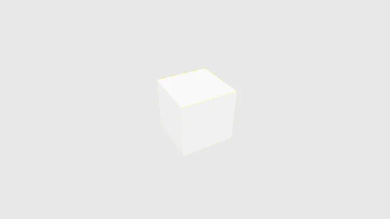

Code : les tests de composants dans [`tests/fretboard.test.tsx`](https://github.com/spareilleux/learn/blob/eeca669/code/threejs/tests/fretboard.test.tsx), la comparaison de pixels dans [`scripts/l12-pixels.ts`](https://github.com/spareilleux/learn/blob/eeca669/code/threejs/scripts/l12-pixels.ts), le lanceur de sondes dans [`scripts/probe.mjs`](https://github.com/spareilleux/learn/blob/eeca669/code/threejs/scripts/probe.mjs), et la vérification complète dans [`check.sh`](https://github.com/spareilleux/learn/blob/eeca669/code/threejs/check.sh), exécutée par [`.github/workflows/threejs-examples.yml`](https://github.com/spareilleux/learn/blob/eeca669/.github/workflows/threejs-examples.yml).

## Quatre couches

Une page 3D mêle du code que n'importe quel lanceur de tests peut vérifier et du code qui a besoin d'un GPU, et un GPU, c'est justement ce qui manque d'ordinaire aux machines de CI. Ce cours teste en quatre couches, de la moins chère à la moins fiable :

| Couche | Ce qui s'exécute | Besoins | En termes .NET | Dans ce cours |
|---|---|---|---|---|
| Logique pure | calculs, notes, physique | Node.js | xUnit sur une bibliothèque de classes | `fretAt`, `noteName`, les rayons de `l05-raycaster.ts`, Rapier dans `l10-rapier.ts` |
| Composants | le graphe de scène qu'un composant construit, ses props et ses événements | Node.js, sans GPU | un test de view model ; bUnit pour Blazor | Vitest avec `@react-three/test-renderer` |
| Pages sondées | le vrai renderer, dans un vrai navigateur | un navigateur, un GPU ou un rastériseur logiciel | automatisation d'interface avec FlaUI ou Appium | `probe.mjs` : `renderer.info`, couleurs, hashes, événements de pointeur |
| Pixels | ce qu'affiche l'écran | le même GPU et le même pilote, à chaque fois | comparaison de captures d'écran, tests de snapshot avec Verify | `l12-pixels.ts`, et les couleurs lues dans les leçons 1 à 7 |

Les couches hautes attrapent plus de problèmes et cassent plus facilement. Le cours compare les trois plus basses partout, et les pixels seulement là où il sait expliquer ce qui diffère.

## Des composants sans GPU

[`@react-three/test-renderer`](https://github.com/pmndrs/react-three-fiber/tree/master/packages/test-renderer) 9.1.1 exécute le reconciler de R3F dans Node.js : `create(<Fretboard />)` construit le graphe de scène three.js à partir du composant, avec de vrais objets `Mesh` et `BufferGeometry`, et rien n'est dessiné. [Vitest](https://vitest.dev/) 5.0.1 exécute les tests, avec la transformation de Vite, si bien que les fichiers `.tsx` n'ont pas besoin d'un build séparé.

Les cinq tests vérifient ce que la leçon 9 a mesuré dans le navigateur ([`fretboard.test.tsx`](https://github.com/spareilleux/learn/blob/eeca669/code/threejs/tests/fretboard.test.tsx)) : le manche, 12 frettes et 6 cordes ; une seule géométrie partagée par les frettes, ou 12 quand elles sont écrites en ligne ; les marqueurs calculés une fois pour le même tableau, et à chaque rendu pour un nouveau ; la note sous le pointeur ; et 8 géométries libérées au démontage. Le test du pointeur montre la limite de la couche : aucun rayon n'est lancé, le test fournit le point d'intersection que R3F aurait calculé ([lignes 60-69](https://github.com/spareilleux/learn/blob/eeca669/code/threejs/tests/fretboard.test.tsx#L60-L69)) :

```tsx
test('reports the note under the pointer', async () => {
  const picks: Pick[] = [];
  const renderer = await ReactThreeTestRenderer.create(<Fretboard onPick={(pick) => picks.push(pick)} />);
  const group = renderer.scene.find((node) => node.props.name === 'fretboard');
  // Aucun raycaster ne tourne ici : le test fournit le point d'intersection que R3F aurait calculé
  await renderer.fireEvent(group, 'onPointerMove', { point: pressPoint(3, 5), stopPropagation: () => {} });
  expect(picks).toEqual([{ fret: 5, string: 3, note: 'C4' }]);
  expect(renderer.scene.findAll((node) => node.props.name === 'hover')).toHaveLength(1);
  await renderer.unmount();
});
```

```text
$ npx vitest run tests --reporter=verbose

 RUN  v5.0.1 .

(node:PID) [THREE_CJS_DEPRECATED] DeprecationWarning: `require("three")` is deprecated and will be removed.
Replace `const THREE = require("three")` with `import * as THREE from "three"`.
(Use `node --trace-deprecation ...` to show where the warning was created)
stderr | tests/fretboard.test.tsx > Fretboard > has a neck, 12 frets and 6 strings
THREE.Clock: This module has been deprecated. Please use THREE.Timer instead.
...
 ✓ tests/fretboard.test.tsx > Fretboard > has a neck, 12 frets and 6 strings
 ✓ tests/fretboard.test.tsx > Fretboard > shares one geometry between the frets, unless they are written inline
 ✓ tests/fretboard.test.tsx > Fretboard > computes the markers once for the same array, and on every render for a new one
 ✓ tests/fretboard.test.tsx > Fretboard > reports the note under the pointer
 ✓ tests/fretboard.test.tsx > Fretboard > disposes the geometries it created on unmount, including the shared one

 Test Files  1 passed (1)
      Tests  5 passed (5)
   Start at  TIME
   Duration  N
```

Trois choses dans cette sortie :

- **`IS_REACT_ACT_ENVIRONMENT`.** La première version du fichier affichait « The current testing environment is not configured to support act(...) » 23 fois, et son test de libération devait attendre R3F, qui libère les objets retirés avec une priorité idle sauf s'il s'exécute sous `act`. React lit un drapeau global pour savoir qu'il est dans un test ; le fichier le positionne désormais ([lignes 10-15](https://github.com/spareilleux/learn/blob/eeca669/code/threejs/tests/fretboard.test.tsx#L10-L15)), les avertissements ont disparu, et R3F libère tout de suite, donc le test compte les appels sans attendre.
- **Deux copies de three.js.** L'avertissement de dépréciation vient du build CommonJS de `@react-three/test-renderer`, qui appelle `require('three')` à sa ligne 6 (trouvé avec `--trace-deprecation`) : Node.js charge `three.cjs` à côté du build en module ES qu'importent les tests et le composant. Les objets de la scène étaient des instances des classes du module ES, vérifié avec `instanceof` dans un test jetable, donc la deuxième copie coûte du temps de chargement sans séparer les classes ici.
- **`THREE.Clock` encore**, venu du store de R3F, comme dans la leçon 9.

`check.sh` exécute `vitest run tests` : sans le dossier, Vitest ramassait aussi un test jetable laissé sous `out/`, le dossier de sortie ignoré du cours, et échouait.

## Des pages sondées

Chaque page de leçon rapporte ce qu'a fait le renderer, et [`probe.mjs`](https://github.com/spareilleux/learn/blob/eeca669/code/threejs/scripts/probe.mjs) l'affiche, comme le décrit la leçon 1 : les comptes de `renderer.info`, les couleurs lues dans la capture d'écran, des hashes, et ce que la page a vu après de vrais événements de pointeur. `check.sh` normalise la sortie et la compare à `expected/`. Les comptes sont la colonne vertébrale de la CI de ce cours : la plupart sont les mêmes sur le GPU de l'auteur et sur un rastériseur logiciel, là où les couleurs et les temps ne le sont pas.

Ce avec quoi dessinent les trois runners, d'après les logs depuis la leçon 1 :

| Runner | `WebGPURenderer` | `WebGLRenderer` et `forceWebGL` | `chromium-headless-shell` |
|---|---|---|---|
| `ubuntu-24.04` | repli sur WebGL 2, SwiftShader | SwiftShader | SwiftShader |
| `windows-2025-vs2026` | repli sur WebGL 2, SwiftShader | SwiftShader | SwiftShader |
| `macos-26-arm64` | WebGPU, le GPU paravirtualisé d'Apple | ANGLE sur Metal | SwiftShader |
| La machine de l'auteur | WebGPU, NVIDIA RTX 5080 | ANGLE sur Direct3D 11 | SwiftShader |

Deux runners sur trois n'exécutent donc jamais le backend WebGPU. Quand une sortie dépend du backend, `check.sh` la compare avec `expected/<name>.webgl.txt` quand la page a tourné sur WebGL 2 dès le départ ([lignes 54-59](https://github.com/spareilleux/learn/blob/eeca669/code/threejs/check.sh#L54-L59)), un fichier généré avec `chromium-headless-shell` sur la machine de l'auteur, dont le SwiftShader a donné jusqu'ici les mêmes résultats que celui des runners. « Dès le départ » compte pour la page de repli de la leçon 11 : elle démarre sur WebGPU et finit sur WebGL 2, et sur un GPU, elle doit être comparée à la sortie WebGPU. La sortie WebGPU elle-même n'est vérifiée que sur la machine de l'auteur et sous macOS.

## Des captures d'écran, pixel par pixel

[pixelmatch](https://github.com/mapbox/pixelmatch) 7.2.0 compare deux images, compte les pixels dont la distance de couleur dépasse un seuil, dans un espace colorimétrique perceptuel (YIQ), et peut écarter les pixels qu'il détecte comme de l'anticrénelage. `l12-pixels.ts` affiche ce compte, et avant lui le plus strict : les pixels dont les octets diffèrent si peu que ce soit.

La même page, le cube de la leçon 1, sondée deux fois sur la même machine :

```text
$ node scripts/l12-pixels.ts out/shots/l01_probe.png out/shots/l12_probe_again.png
l01_probe.png and l12_probe_again.png, 800x450:
  pixels not byte-identical: 0 (0.00 %)
  pixels over pixelmatch's threshold 0.1, anti-aliasing excluded: 0 (0.00 %)
```

`check.sh` compare cette sortie sur chaque OS : une page rendue deux fois par le même GPU et le même pilote donne les mêmes pixels. D'un backend à l'autre, il affiche seulement les comptes, puisqu'ils dépendent de la machine. Sur la machine de l'auteur :

```text
     l01_probe.png and l01_probe_webgl.png, 800x450:
       pixels not byte-identical: 294 (0.08 %)
       pixels over pixelmatch's threshold 0.1, anti-aliasing excluded: 0 (0.00 %)
     l01_probe.png and l01_probe_headless_shell.png, 800x450:
       pixels not byte-identical: 10330 (2.87 %)
       pixels over pixelmatch's threshold 0.1, anti-aliasing excluded: 0 (0.00 %)
```

WebGPU face au WebGL 2 d'ANGLE sur le même GPU NVIDIA : 294 pixels diffèrent. Face à SwiftShader : 10 330, presque 3 % de l'image. Aucun ne dépasse le seuil par défaut de pixelmatch une fois l'anticrénelage écarté : les différences sont des arrondis sur les faces, d'un ou deux niveaux par canal, et des arêtes rastérisées différemment.



[Ouvrir en plein écran](../../../threejs-demos/03-color.html?tone=aces). **À essayer** : l'exercice 3 porte sur le tone mapping de la leçon 3 passé d'ACES à AgX : sur la page en direct de la leçon 3, le *tone mapping* du panneau fait ce changement. `check.sh` sonde aussi les cinq démos en direct, et les reconstruit pour les comparer à la copie que publie le site : `diff -r` ne doit rien afficher.

Une comparaison à l'octet près échoue entre deux quelconques des trois renderers ; une comparaison avec seuil passe, et laisserait aussi passer un vrai changement de quelques niveaux, comme la couleur ACES de la leçon 3, 127 sur le GPU de l'auteur et 128 en CI. Le cours lit des couleurs précises à des positions connues, avec une tolérance de 2 par canal ([`compare.mjs`](https://github.com/spareilleux/learn/blob/eeca669/code/threejs/scripts/compare.mjs)) : la vérification d'un nombre, qu'un lecteur peut rattacher à une leçon. Les comparaisons d'images entières ont leur place là où le renderer est fixe : le même GPU, le même pilote et le même navigateur, comme une tâche de régression visuelle sur une machine dédiée, avec les images de référence régénérées sur place.

## Six façons dont un test a mal tourné dans ce cours

Chacune a fait échouer ou bloquer une vérification avant d'être corrigée, dans les leçons 1 à 13 :

1. **Une promesse remplacée pendant une attente.** La première sonde de la leçon 1 restait bloquée : la page remplaçait `window.probe` après que `page.evaluate` avait commencé à attendre l'ancienne promesse. Les pages résolvent désormais une promesse créée une seule fois.
2. **Du travail en file derrière le résultat.** Les pages à 800 000 triangles de la leçon 8 rapportaient à temps, puis la capture d'écran de Playwright attendait plus de 30 secondes derrière les images encore en file dans SwiftShader. Ces sondes chronomètrent moins d'images, et attendent jusqu'à 240 secondes.
3. **Une boucle de rendu qui s'arrête.** La page de la leçon 11 attendait des images XR qui ne venaient jamais, puisque chacune levait une exception, et a gardé le verrou GPU partagé de la machine pendant dix minutes, jusqu'à ce qu'on l'arrête à la main. La page intercepte maintenant les erreurs de rendu et abandonne au bout de 5 secondes, et `probe.mjs` s'arrête de lui-même après deux fois son délai plus 30 secondes ([lignes 19-24](https://github.com/spareilleux/learn/blob/eeca669/code/threejs/scripts/probe.mjs#L19-L24)).
4. **Le batching de React sur un renderer lent.** La page de la leçon 9 comptait 11 rendus sur le GPU de l'auteur et 6 dans `chromium-headless-shell` : quand les images sont lentes, plusieurs mises à jour d'état arrivent avant que React ne rende, et il les regroupe. `flushSync` valide chacune d'elles.
5. **Des événements de pointeur fusionnés.** Après un déplacement de souris en 5 étapes, le nombre de rendus comptés différait d'une machine à l'autre : le navigateur fusionne les événements `pointermove` quand les images sont lentes. La page ne rapporte plus de comptes de rendus après les actions de pointeur, et ne déplace plus le pointeur avant le démontage.
6. **Une sortie qui appartient à l'OS.** Chromium sous Windows avertit « The powerPreference option is currently ignored » chaque fois que R3F passe `powerPreference` ; Linux et macOS, non. Les erreurs WebGL portent une adresse de contexte, `[.WebGL-0x2afc00409400]`, différente à chaque exécution. `check.sh` retire les deux de la sortie comparée, et affiche le nombre d'erreurs WebGL.

Le fil conducteur : un test 3D attend des images, et les images dépendent de la machine. Attendez une condition, pas une durée ; bornez chaque attente ; appliquez les changements d'état de façon synchrone ; comparez ce qui ne dépend pas du timing.

## Dans GuitarAlchemist/ga

Les composants React de GA ont 22 fichiers de specs Playwright sous `tests/` : 15 dans la suite du tableau de bord, sous `tests/dashboard/`, et 7 autres, dont 6 sur des pages 3D (le septième teste le convertisseur de tablatures).

- **Attendre une durée.** `fretboard.spec.ts` attend le canvas, puis 3 secondes « for WebGPU initialization » ([lignes 22-27](https://github.com/GuitarAlchemist/ga/blob/05c8eda013f2a4d11efaa52c4ca94674521ee684/ReactComponents/ga-react-components/tests/fretboard.spec.ts#L22-L27)), et appelle `waitForTimeout` 25 fois. Sur un runner lent, 3 secondes peuvent ne pas suffire ; sur la machine de l'auteur, ce sont 3 secondes perdues par test. Une page qui positionne un drapeau, ou un attribut `data-`, quand sa première image est rendue donne au test quelque chose à attendre.
- **Des assertions qui ne peuvent pas échouer, et une qui ne peut pas réussir.** `bsp-doom-explorer.spec.ts` prend une capture d'écran du canvas et affirme `expect(screenshot).toBeTruthy()` ([lignes 14-20](https://github.com/GuitarAlchemist/ga/blob/05c8eda013f2a4d11efaa52c4ca94674521ee684/ReactComponents/ga-react-components/tests/bsp-doom-explorer.spec.ts#L14-L20)) : un `Buffer` est toujours truthy, même pour une image noire. Plus loin, deux captures prises à 2 secondes d'intervalle doivent différer ([lignes 76-87](https://github.com/GuitarAlchemist/ga/blob/05c8eda013f2a4d11efaa52c4ca94674521ee684/ReactComponents/ga-react-components/tests/bsp-doom-explorer.spec.ts#L76-L87)), ce qu'un curseur clignotant ou un minuteur suffirait à satisfaire. `floor0-navigation.spec.ts` vérifie que le canvas n'est pas noir en appelant `getContext('2d')` dessus ([lignes 280-298](https://github.com/GuitarAlchemist/ga/blob/05c8eda013f2a4d11efaa52c4ca94674521ee684/ReactComponents/ga-react-components/tests/floor0-navigation.spec.ts#L280-L298)) ; un canvas qui a déjà un contexte WebGL ou WebGPU renvoie `null` pour un contexte 2D, la fonction renvoie `true`, « tout noir », et `expect(isBlack).toBe(false)` échoue quoi que dessine la scène. Lire le canvas fonctionne avec `toDataURL` dans la même image (avec `preserveDrawingBuffer`), ou avec la capture d'écran de la page, comme le fait `probe.mjs`.
- **Des résultats commités, pas exécutés.** 13 fichiers sous `ReactComponents/ga-react-components/test-results/` sont dans le dépôt, dont un `.last-run.json` dont le statut est `failed`, avec 13 tests en échec. Le workflow de CI qui exécute Playwright, `playwright-dashboard.yml`, n'exécute que `tests/dashboard/`, contre le site en ligne, et aucune des specs 3D.
- **Le GPU des runners, connu.** Le `deploy-banner.yml` de GA explique pourquoi il a cessé de capturer sa bannière en CI : « GitHub runners have no GPU and SwiftShader renders WebGPU compute as black frames » ([lignes 64-69](https://github.com/GuitarAlchemist/ga/blob/05c8eda013f2a4d11efaa52c4ca94674521ee684/.github/workflows/deploy-banner.yml#L64-L69)). Cela concorde avec le tableau de ce cours : sous Linux, WebGPU se replie sur WebGL 2, et un compute shader n'a aucun repli.

## À retenir

- Testez le code 3D par couches : logique pure et composants sans GPU partout, pages sondées à travers des comptes, pixels seulement sur une machine fixe.
- `@react-three/test-renderer` construit le vrai graphe de scène dans Node.js ; positionnez `IS_REACT_ACT_ENVIRONMENT` dans le fichier de test.
- Les comptes de `renderer.info` sont les mêmes sur un GPU et sur SwiftShader ; les couleurs et les temps, non.
- Deux des trois runners de GitHub n'exécutent jamais WebGPU : sachez avec quoi chacun dessine, et gardez des sorties attendues séparées par backend.
- Des captures comparées à l'octet près échouent d'un renderer à l'autre ; une comparaison avec seuil masque de petits changements réels. Lisez plutôt des valeurs précises, avec une tolérance déclarée.
- N'attendez jamais une durée, ni des images sans borne : attendez une condition, avec un délai maximal, et appliquez les changements d'état de façon synchrone.

## Exercices

1. Écrivez un test de composant pour le portage de la leçon 13 qui vérifie que 10 rendus avec un nouveau tableau `positions` de même contenu ne construisent les marqueurs qu'une fois. Qu'est-ce que le test renderer ne vous laisse pas vérifier sur les cordes du portage ?
2. `floor0-navigation.spec.ts` veut savoir si un canvas WebGL est noir. Écrivez la vérification de deux façons : à partir de la capture d'écran de Playwright, et depuis l'intérieur de la page.
3. La comparaison de pixels du cours passe avec 10 330 pixels qui ne sont pas identiques à l'octet près. Concevez une vérification qui détecterait, sur n'importe quel runner, le tone mapping de la leçon 3 passé d'ACES à AgX, sans référence à l'octet près.

<details>
<summary>Solution 1</summary>

```tsx
test('builds the markers once for the same positions', async () => {
  const positions = () => C_MAJOR.map((p) => ({ ...p }));
  const renderer = await ReactThreeTestRenderer.create(<Fretboard3D positions={positions()} />);
  for (let i = 0; i < 10; i++) await renderer.update(<Fretboard3D positions={positions()} />);
  expect(portStats.markerBuilds).toBe(1);
  await renderer.unmount();
});
```

Les cordes bougent dans leur vertex shader, en TSL : le test renderer construit l'`InstancedMesh` et son node material, mais aucun shader n'est compilé ni exécuté, donc la vibration ne peut pas y être vérifiée. Le `useLayoutEffect` du portage écrit aussi des matrices d'instance, que le test peut lire avec `getMatrixAt`. Une ébauche, non exécutée : `Fretboard3D` importe `three/webgpu` et dessine une texture canvas, ce qui demande un `document` (*à vérifier* avec l'environnement `jsdom` ou `happy-dom` de Vitest).

</details>

<details>
<summary>Solution 2</summary>

Depuis Playwright, qui capture ce que la page a composité :

```ts
const png = PNG.sync.read(await page.locator('canvas').screenshot());
let lit = 0;
for (let i = 0; i < png.data.length; i += 4) if (png.data[i] > 10 || png.data[i + 1] > 10 || png.data[i + 2] > 10) lit++;
expect(lit).toBeGreaterThan(1000);
```

Depuis la page : dessinez le canvas 3D sur un canvas 2D, `ctx2d.drawImage(glCanvas, 0, 0)`, puis `getImageData`. Pour un contexte WebGL, cela ne lit le drawing buffer que dans la même tâche que l'image, sauf si le contexte a été créé avec `preserveDrawingBuffer: true` ; sinon l'image est effacée, et noire. La capture d'écran n'a besoin ni de l'un ni de l'autre, et c'est pourquoi `probe.mjs` y lit les couleurs. Non exécuté contre GA (*à vérifier*).

</details>

<details>
<summary>Solution 3</summary>

Lisez ce que change le tone mapping, pas l'image entière : la sonde de la leçon 3 lit déjà des pastilles de valeurs linéaires connues. Choisissez les pastilles où les opérateurs diffèrent : au linéaire 0.18, ACES donne 127 et AgX 128, trop proches pour être distingués d'un GPU à l'autre ; au linéaire 1, ACES donne 227 et AgX 202, et à 0.05, 50 et 70 (le tableau de la leçon 3). Ces écarts sont de plusieurs dizaines de niveaux, bien au-dessus des 2 niveaux qui séparent les GPU, donc une vérification de ces pastilles, chacune avec une tolérance de 2, détecte le changement partout. Pour une vérification de l'image entière, comparez à une référence produite sur le même type de runner, et réglez le seuil de pixelmatch entre le bruit propre au runner (0 pixel différent pour la même page deux fois) et le plus petit changement qui vous importe, mesuré, pas deviné.

</details>

## Sources

- [@react-three/test-renderer](https://github.com/pmndrs/react-three-fiber/tree/master/packages/test-renderer) ; [Vitest](https://vitest.dev/guide/) ; React : [`act`](https://react.dev/reference/react/act) et `IS_REACT_ACT_ENVIRONMENT`, [`flushSync`](https://react.dev/reference/react-dom/flushSync)
- [Playwright](https://playwright.dev/docs/screenshots) : captures d'écran, [`page.mouse`](https://playwright.dev/docs/api/class-mouse)
- [pixelmatch](https://github.com/mapbox/pixelmatch)
- MDN : [`HTMLCanvasElement.getContext`](https://developer.mozilla.org/docs/Web/API/HTMLCanvasElement/getContext), [`preserveDrawingBuffer`](https://developer.mozilla.org/docs/Web/API/HTMLCanvasElement/getContext#preservedrawingbuffer), [fusion des événements de pointeur](https://developer.mozilla.org/docs/Web/API/PointerEvent/getCoalescedEvents)
- [SwiftShader](https://github.com/google/swiftshader) ; GitHub : [images des runners](https://github.com/actions/runner-images)
