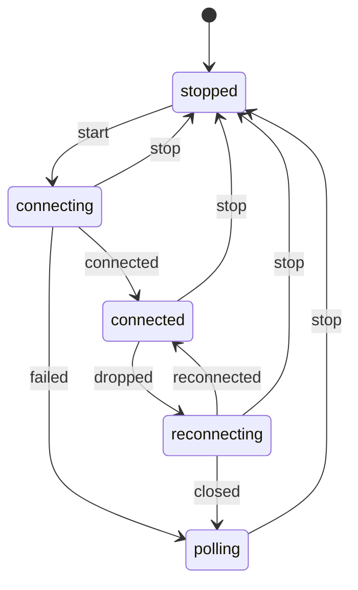

Code : les fichiers [`examples/l03_*`](https://github.com/spareilleux/learn/tree/d039c6a49edd3fac4b6bf6003260282e3f77119d/code/typescript-advanced/examples) et [`errors/l03_*`](https://github.com/spareilleux/learn/tree/d039c6a49edd3fac4b6bf6003260282e3f77119d/code/typescript-advanced/errors), et les côtés C# et Java dans [`compare/`](https://github.com/spareilleux/learn/tree/d039c6a49edd3fac4b6bf6003260282e3f77119d/code/typescript-advanced/compare) (`l03_positions.cs`, `L03TypeState.java`) et [`compare_fail/`](https://github.com/spareilleux/learn/tree/d039c6a49edd3fac4b6bf6003260282e3f77119d/code/typescript-advanced/compare_fail) (`l03_positions_mixed.cs`, `L03TypeState.java`).

Le typage structurel est pratique jusqu'au jour où deux valeurs ont la même forme et des sens différents. Un indice de corde et une case sont tous deux des `number`, un identifiant de nœud et un identifiant d'arête sont tous deux des `string`, et un composant qui suit dans trois variables séparées s'il est en train de charger, ce qu'il a chargé et ce qui a échoué peut contenir des combinaisons qui ne veulent rien dire. Les développeurs C# et Java règlent le premier problème avec une petite classe ou un record, et le second avec une hiérarchie de classes. TypeScript a ses propres outils pour les deux, moins coûteux à l'exécution et plus faibles par endroits, et cette leçon les applique à trois endroits du front end de GA.

## Deux numérotations pour les mêmes cordes

La bibliothèque de composants de GA numérote les cordes de guitare de deux façons, et les deux sont typées `number` :

- [`types/InstrumentConfig.ts`, ligne 73](https://github.com/GuitarAlchemist/ga/blob/32f143c866c126338b332e384e4a615cd4b44381/ReactComponents/ga-react-components/src/types/InstrumentConfig.ts#L72-L78), et [`GuitarFretboard.tsx`, ligne 8](https://github.com/GuitarAlchemist/ga/blob/32f143c866c126338b332e384e4a615cd4b44381/ReactComponents/ga-react-components/src/components/GuitarFretboard.tsx#L7-L11), comptent à partir de 0 : « 0 = highest pitch », « 0 = high E ».
- [`VexTabViewer.tsx`, ligne 86](https://github.com/GuitarAlchemist/ga/blob/32f143c866c126338b332e384e4a615cd4b44381/ReactComponents/ga-react-components/src/components/VexTabViewer.tsx#L84-L90), et [`InverseKinematics.tsx`, ligne 141](https://github.com/GuitarAlchemist/ga/blob/32f143c866c126338b332e384e4a615cd4b44381/ReactComponents/ga-react-components/src/components/InverseKinematics/InverseKinematics.tsx#L140-L143), comptent à partir de 1, comme la tablature : « 1 = high E, 6 = low E ».

Les deux conventions sont raisonnables, et chaque fichier est cohérent. Le risque se situe entre les fichiers : quatre interfaces de la bibliothèque s'appellent `FretboardPosition`, toutes avec `string: number; fret: number`, et le typage structurel les rend interchangeables, donc une position venue du manche et passée au code de tablature est décalée d'une corde, sans bruit. Je n'ai trouvé aucun endroit où GA les mélange aujourd'hui ; l'intérêt d'un type est que personne n'ait à le vérifier de nouveau.

## Brands

```ts
// examples/l03_positions.ts
// Des nombres marqués pour les deux numérotations des cordes trouvées dans le front end de GuitarAlchemist/ga :
// InstrumentConfig.ts compte à partir de 0 (0 = corde la plus aiguë), VexTabViewer.tsx et InverseKinematics.tsx à partir de 1 (1 = mi aigu)

// Un unique symbol n'existe que dans les déclarations de ce module : rien à l'extérieur ne peut nommer le brand
declare const brand: unique symbol;
type Brand<T, B extends string> = T & { readonly [brand]: B };

export type StringIndex = Brand<number, 'StringIndex'>; // à partir de 0, 0 = corde la plus aiguë
export type StringNumber = Brand<number, 'StringNumber'>; // à partir de 1, 1 = corde la plus aiguë, comme en tablature
export type Fret = Brand<number, 'Fret'>; // 0 = corde à vide

export const STRING_COUNT = 6;
export const MAX_FRET = 24;

// Constructeurs intelligents : les seules fonctions qui transforment un nombre en nombre marqué, après l'avoir vérifié
export function stringIndex(value: number): StringIndex {
  if (!Number.isInteger(value) || value < 0 || value >= STRING_COUNT) throw new RangeError(`string index out of range: ${value}`);
  return value as StringIndex;
}
export function stringNumber(value: number): StringNumber {
  if (!Number.isInteger(value) || value < 1 || value > STRING_COUNT) throw new RangeError(`string number out of range: ${value}`);
  return value as StringNumber;
}
export function fret(value: number): Fret {
  if (!Number.isInteger(value) || value < 0 || value > MAX_FRET) throw new RangeError(`fret out of range: ${value}`);
  return value as Fret;
}

// Les conversions sont explicites, et écrites une seule fois
export const toStringNumber = (index: StringIndex): StringNumber => (index + 1) as StringNumber;
export const toStringIndex = (number: StringNumber): StringIndex => (number - 1) as StringIndex;
```

Un **brand** fait l'intersection du type de base avec un type objet qu'aucune vraie valeur ne possède : `number & { readonly [brand]: 'StringIndex' }`. Un `number` ordinaire ne lui est pas assignable, puisqu'il n'a pas la propriété, et un `StringIndex` n'est pas assignable à un `StringNumber`, puisque les types littéraux de la propriété diffèrent. La propriété n'existe jamais à l'exécution. `declare const brand: unique symbol` déclare un symbole pour le vérificateur seulement ; Node.js retire la ligne, et rien n'est alloué.

Le module exporte les types et un **constructeur intelligent** (*smart constructor*) pour chacun : les seules fonctions qui affirment un brand, après avoir vérifié l'intervalle. Comme `brand` n'est pas exporté, aucun autre module ne peut écrire le type du brand à la main ; il peut encore écrire `as StringNumber`, et c'est la limite de la technique.

```ts
// examples/l03_brands.ts
import type { Equal, Expect } from './type-tests.ts';
import { attempt, show } from './show.ts';
import { fret, stringIndex, stringNumber, toStringIndex, toStringNumber, type Fret, type StringIndex, type StringNumber } from './l03_positions.ts';

// VexTabViewer.tsx de GA : getPitchFromTabPosition(string: number, fret: number), avec 1 = mi aigu
const openStrings = ['E/5', 'B/4', 'G/4', 'D/4', 'A/3', 'E/3'];
function openStringOf(string: StringNumber): string {
  return openStrings[string - 1] ?? 'E/3';
}
// InstrumentConfig.ts de GA : FretboardPosition { string: number; fret: number }, avec 0 = corde la plus aiguë
interface FretboardPosition {
  string: StringIndex;
  fret: Fret;
}

const clicked: FretboardPosition = { string: stringIndex(1), fret: fret(3) }; // la corde de si, troisième case
show('openStringOf(toStringNumber(…))', openStringOf(toStringNumber(clicked.string)));

// Un brand est un type, et rien d'autre : à l'exécution, la valeur est un nombre ordinaire
show('typeof clicked.string', typeof clicked.string);
show('JSON.stringify(clicked)', JSON.stringify(clicked));

// L'arithmétique redonne un number : le brand dit ce qu'est la valeur, et une nouvelle valeur doit être vérifiée de nouveau
const next = clicked.fret + 1;
type _1 = Expect<Equal<typeof next, number>>;
show('fret(next)', fret(next));
attempt('fret(25)', () => fret(25));
attempt('stringNumber(0)', () => stringNumber(0));

// Une valeur marquée reste un nombre partout où un nombre est attendu
show('Math.max(clicked.fret, 5)', Math.max(clicked.fret, 5));
show('toStringIndex(stringNumber(6))', toStringIndex(stringNumber(6)));

// Les classes avec un champ #private sont comparées de façon nominale : deux formes identiques ne sont pas interchangeables
class Semitones {
  #value: number;
  constructor(value: number) {
    this.#value = value;
  }
  get value(): number {
    return this.#value;
  }
}
class Cents {
  #value: number;
  constructor(value: number) {
    this.#value = value;
  }
  get value(): number {
    return this.#value;
  }
}
// @ts-expect-error: un Cents n'est pas un Semitones, bien que les deux aient un accesseur value
const wrong: Semitones = new Cents(700);
show('new Semitones(7).value', new Semitones(7).value);
show('wrong instanceof Semitones', wrong instanceof Semitones);
```

```text
openStringOf(toStringNumber(…))    'B/4'
typeof clicked.string              'number'
JSON.stringify(clicked)            '{"string":1,"fret":3}'
fret(next)                         4
fret(25)                           RangeError: fret out of range: 25
stringNumber(0)                    RangeError: string number out of range: 0
Math.max(clicked.fret, 5)          5
toStringIndex(stringNumber(6))     5
new Semitones(7).value             7
wrong instanceof Semitones         false
```

- **Un brand est un type et rien d'autre** : `typeof` donne `'number'`, et `JSON.stringify` écrit des nombres ordinaires, donc les valeurs marquées traversent le réseau comme n'importe quelle autre.
- **L'arithmétique renvoie un `number`** : `clicked.fret + 1` n'est pas une `Fret`, parce que le résultat pourrait valoir 25. Le brand dit que la valeur a été vérifiée, et une nouvelle valeur doit être vérifiée de nouveau, ici avec `fret(next)`.
- **Une valeur marquée reste un nombre** partout où un nombre est attendu, donc `Math.max` et l'indexation d'un tableau fonctionnent sans conversion.
- **Les champs `#private` rendent les classes nominales.** Deux classes avec le même champ privé et le même accesseur ne sont pas assignables l'une à l'autre, parce qu'on ne peut accéder à un [champ privé](https://www.typescriptlang.org/docs/handbook/2/classes.html#caveats) que par sa propre classe. On obtient ainsi de vrais types nominaux, avec une vérification à l'exécution par `instanceof`, au prix d'un objet par valeur.

Les erreurs que les brands détectent :

```text
> npx tsc -p out/tsconfig.l03_brands.json --pretty
errors/l03_brands.ts:11:14 - error TS2345: Argument of type 'StringIndex' is not assignable to parameter of type 'StringNumber'.
  Type 'StringIndex' is not assignable to type '{ readonly [brand]: "StringNumber"; }'.
    Types of property '[brand]' are incompatible.
      Type '"StringIndex"' is not assignable to type '"StringNumber"'.

11 openStringOf(clicked.string); // a 0-based index where a 1-based number is expected
                ~~~~~~~~~~~~~~

errors/l03_brands.ts:12:14 - error TS2345: Argument of type 'number' is not assignable to parameter of type 'StringNumber'.
  Type 'number' is not assignable to type '{ readonly [brand]: "StringNumber"; }'.

12 openStringOf(2); // a plain number
                ~

errors/l03_brands.ts:13:48 - error TS2322: Type 'number' is not assignable to type 'Fret'.
  Type 'number' is not assignable to type '{ readonly [brand]: "Fret"; }'.

13 const moved: FretboardPosition = { ...clicked, fret: clicked.fret + 1 }; // arithmetic loses the brand
                                                  ~~~~

  errors/l03_brands.ts:7:3 - The expected type comes from property 'fret' which is declared here on type 'FretboardPosition'
    7   fret: Fret;
        ~~~~

errors/l03_brands.ts:14:38 - error TS2322: Type 'Fret' is not assignable to type 'StringIndex'.
  Type 'Fret' is not assignable to type '{ readonly [brand]: "StringIndex"; }'.
    Types of property '[brand]' are incompatible.
      Type '"Fret"' is not assignable to type '"StringIndex"'.

14 const swapped: FretboardPosition = { string: clicked.fret, fret: clicked.string };
                                        ~~~~~~

  errors/l03_brands.ts:6:3 - The expected type comes from property 'string' which is declared here on type 'FretboardPosition'
    6   string: StringIndex;
        ~~~~~~

errors/l03_brands.ts:14:60 - error TS2322: Type 'StringIndex' is not assignable to type 'Fret'.
  Type 'StringIndex' is not assignable to type '{ readonly [brand]: "Fret"; }'.
    Types of property '[brand]' are incompatible.
      Type '"StringIndex"' is not assignable to type '"Fret"'.

14 const swapped: FretboardPosition = { string: clicked.fret, fret: clicked.string };
                                                              ~~~~

  errors/l03_brands.ts:7:3 - The expected type comes from property 'fret' which is declared here on type 'FretboardPosition'
    7   fret: Fret;
        ~~~~


Found 5 errors in the same file, starting at: errors/l03_brands.ts:11
```

L'indice passé là où un numéro de tablature est attendu, le nombre ordinaire, le brand perdu après l'arithmétique, et la corde et la case inversées sont tous des erreurs de compilation. La dernière ligne, `99 as StringNumber`, compile : une assertion contrefait un brand, et c'est à une règle de lint ou à une revue de code de le détecter. Les messages mentionnent `[brand]`, ce qui est une raison de donner au brand un nom lisible.

C# exprime la même idée avec un vrai type. Un [`readonly record struct`](https://learn.microsoft.com/dotnet/csharp/language-reference/builtin-types/record) enveloppe l'`int` sans allocation, porte ses vérifications dans le constructeur, et la conversion entre numérotations est une méthode :

```csharp
// compare/l03_positions.cs
// En C#, une enveloppe nominale est un vrai type : un readonly record struct ne coûte aucune allocation et porte ses vérifications
var clicked = new FretboardPosition(new StringIndex(1), new Fret(3));
Console.WriteLine(OpenStringOf(clicked.String.ToStringNumber()));
Console.WriteLine(clicked);
try
{
    _ = new Fret(25);
}
catch (ArgumentOutOfRangeException e)
{
    Console.WriteLine(e.Message);
}

static string OpenStringOf(StringNumber number) => new[] { "E/5", "B/4", "G/4", "D/4", "A/3", "E/3" }[number.Value - 1];

readonly record struct StringIndex
{
    public int Value { get; }
    public StringIndex(int value)
    {
        ArgumentOutOfRangeException.ThrowIfNegative(value);
        ArgumentOutOfRangeException.ThrowIfGreaterThan(value, 5);
        Value = value;
    }
    public StringNumber ToStringNumber() => new(Value + 1);
}

readonly record struct StringNumber
{
    public int Value { get; }
    public StringNumber(int value)
    {
        ArgumentOutOfRangeException.ThrowIfLessThan(value, 1);
        ArgumentOutOfRangeException.ThrowIfGreaterThan(value, 6);
        Value = value;
    }
}

readonly record struct Fret
{
    public int Value { get; }
    public Fret(int value)
    {
        ArgumentOutOfRangeException.ThrowIfNegative(value);
        ArgumentOutOfRangeException.ThrowIfGreaterThan(value, 24);
        Value = value;
    }
}

record FretboardPosition(StringIndex String, Fret Fret);
```

```text
> dotnet run l03_positions.cs
B/4
FretboardPosition { String = StringIndex { Value = 1 }, Fret = Fret { Value = 3 } }
value ('25') must be less than or equal to '24'. (Parameter 'value')
Actual value was 25.
```

```text
> dotnet run l03_positions_mixed.cs
compare_fail/l03_positions_mixed.cs(3,32): error CS1503: Argument 1: cannot convert from 'StringIndex' to 'StringNumber'
compare_fail/l03_positions_mixed.cs(4,32): error CS1503: Argument 1: cannot convert from 'int' to 'StringNumber'

The build failed. Fix the build errors and run again.
```

| | C# `readonly record struct` | Java `record` | Brand TypeScript | Classe TypeScript avec `#private` |
|---|---|---|---|---|
| Distinct du type de base | oui | oui | oui | oui |
| Coût à l'exécution | aucun, un struct | un objet | aucun | un objet |
| Vérification à l'exécution | constructeur | constructeur | constructeur intelligent seulement | constructeur et `instanceof` |
| Peut être contrefait | non, sans code unsafe | non | oui, avec `as` | non |
| Sérialisé comme la valeur de base | avec un convertisseur | avec un sérialiseur | oui | non |

## États impossibles

Le widget de chat de GA suit la saisie vocale dans [`ChatWidget.tsx`, lignes 763-764](https://github.com/GuitarAlchemist/ga/blob/32f143c866c126338b332e384e4a615cd4b44381/ReactComponents/ga-react-components/src/components/PrimeRadiant/ChatWidget.tsx#L763-L764), avec deux éléments d'état :

```ts
const [isListening, setIsListening] = useState(false);
const [voiceState, setVoiceState] = useState<'idle' | 'listening' | 'processing' | 'understood'>('idle');
```

Les deux peuvent se contredire, et le code qui les met à jour montre comment. Dans [`startListening`](https://github.com/GuitarAlchemist/ga/blob/32f143c866c126338b332e384e4a615cd4b44381/ReactComponents/ga-react-components/src/components/PrimeRadiant/ChatWidget.tsx#L971-L1025), les gestionnaires `onerror` et `onend` appellent `setIsListening(false)`, puis `if (voiceState === 'listening') setVoiceState('idle')`. `voiceState` y est la valeur capturée à la création du callback, et `voiceState` ne figure pas dans sa liste de dépendances, `[sendMessage, alwaysListen, locale]` ; `setVoiceState('listening')` est appelé à la fin de la même fonction, après la capture. Le test est donc probablement toujours faux, et après une erreur le widget peut afficher `isListening` à false avec `voiceState` encore à `'listening'` (*à vérifier* dans un navigateur). La même fonction appelle `sendMessage(transcript).then(() => setVoiceState('understood'))` sans `catch`, et `sendMessage` a un `try`/`finally` sans `catch`, donc une requête qui échoue laisse l'état à `'processing'`. La closure périmée est un problème React, pour le cours [React (Vite)](../../react-vite/) ; la paire contradictoire est un problème de modélisation, et un type peut la supprimer.

```ts
// examples/l03_states.ts
import type { Equal, Expect } from './type-tests.ts';
import { show } from './show.ts';

// ChatWidget.tsx de GA garde la saisie vocale dans deux éléments d'état qui peuvent se contredire :
//   const [isListening, setIsListening] = useState(false);
//   const [voiceState, setVoiceState] = useState<'idle' | 'listening' | 'processing' | 'understood'>('idle');
interface LooseVoice {
  isListening: boolean;
  voiceState: 'idle' | 'listening' | 'processing' | 'understood';
  transcript?: string;
  error?: string;
}
// 2 × 4 × 2 × 2 = 32 combinaisons, et la plupart ne veulent rien dire : à l'écoute et au repos, une erreur alors que la phrase est comprise…
const contradictory: LooseVoice = { isListening: false, voiceState: 'listening', error: 'network' };
show('contradictory', contradictory);

// Une seule union discriminée : chaque état porte exactement les données qui existent dans cet état
type Voice =
  | { status: 'idle' }
  | { status: 'listening'; startedAt: number }
  | { status: 'processing'; transcript: string }
  | { status: 'understood'; transcript: string }
  | { status: 'failed'; transcript: string; error: string };

// Les événements qui le font changer, eux aussi sous forme d'union
type VoiceEvent =
  | { type: 'start'; at: number }
  | { type: 'final-result'; transcript: string }
  | { type: 'sent' }
  | { type: 'send-failed'; error: string }
  | { type: 'stop' }
  | { type: 'reset' };

// Les transitions, sous forme de reducer : chaque état traite chaque événement, et un événement qui ne s'applique pas garde l'état
function transition(state: Voice, event: VoiceEvent): Voice {
  switch (state.status) {
    case 'idle':
      return event.type === 'start' ? { status: 'listening', startedAt: event.at } : state;
    case 'listening':
      if (event.type === 'final-result') return { status: 'processing', transcript: event.transcript };
      return event.type === 'stop' ? { status: 'idle' } : state;
    case 'processing':
      if (event.type === 'sent') return { status: 'understood', transcript: state.transcript };
      return event.type === 'send-failed' ? { status: 'failed', transcript: state.transcript, error: event.error } : state;
    case 'understood':
    case 'failed':
      return event.type === 'reset' ? { status: 'idle' } : state;
    default:
      return assertNever(state);
  }
}
function assertNever(value: never): never {
  throw new Error(`unexpected state: ${JSON.stringify(value)}`);
}

// Le rendu lit les données que l'état garantit, sans vérifications d'options
function label(state: Voice): string {
  switch (state.status) {
    case 'idle':
      return 'mic off';
    case 'listening':
      return `listening since ${state.startedAt} ms`;
    case 'processing':
      return `sending "${state.transcript}"`;
    case 'understood':
      return `understood "${state.transcript}"`;
    case 'failed':
      return `could not send "${state.transcript}": ${state.error}`;
  }
}

const events: VoiceEvent[] = [
  { type: 'start', at: 120 },
  { type: 'final-result', transcript: 'show me drop D voicings' },
  { type: 'send-failed', error: 'HTTP 503' },
  { type: 'sent' }, // ignoré : une requête qui a échoué ne peut pas réussir ensuite
  { type: 'reset' },
];
let state: Voice = { status: 'idle' };
for (const event of events) {
  state = transition(state, event);
  console.log(`${event.type.padEnd(13)} → ${label(state)}`);
}

// Le nombre de valeurs possibles est maintenant le nombre d'états
type _1 = Expect<Equal<Voice['status'], 'idle' | 'listening' | 'processing' | 'understood' | 'failed'>>;
```

```text
contradictory                      { isListening: false, voiceState: 'listening', error: 'network' }
start         → listening since 120 ms
final-result  → sending "show me drop D voicings"
send-failed   → could not send "show me drop D voicings": HTTP 503
sent          → could not send "show me drop D voicings": HTTP 503
reset         → mic off
```

`LooseVoice` a 32 combinaisons, et le programme en construit une qui ne veut rien dire sans erreur de compilation. `Voice` est une **union discriminée** : cinq états, et chacun contient les données qui existent dans cet état. Il n'y a pas de `transcript` au repos, pas d'`error` sauf si la requête a échoué, et aucun moyen d'être à la fois à l'écoute et pas à l'écoute. Les événements sont aussi une union, et les transitions sont une fonction d'un état et d'un événement vers un état, la forme de reducer qu'utilise le `useReducer` de React.

- La branche `default` passe `state` à `assertNever`, dont le paramètre est `never` : si un sixième état est ajouté sans être traité, `state` n'y est pas `never`, et l'appel est une erreur de compilation.
- `label` n'a pas de `default`, et n'en a pas besoin : son type de retour est `string`, et un cas manquant rend la fin de la fonction atteignable, ce que `tsc` signale.
- Le quatrième événement, `sent`, arrive après `send-failed` et il est ignoré, parce que l'état `failed` ne le traite pas : l'ordre des événements asynchrones fait partie du modèle, et un succès tardif ne peut pas écraser un échec.

Les erreurs :

```text
> npx tsc -p out/tsconfig.l03_states.json --pretty
errors/l03_states.ts:8:31 - error TS2366: Function lacks ending return statement and return type does not include 'undefined'.

8 function label(state: Voice): string {
                                ~~~~~~

errors/l03_states.ts:9:62 - error TS2339: Property 'transcript' does not exist on type '{ status: "listening"; startedAt: number; }'.

9   if (state.status === 'listening') return `sending "${state.transcript}"`;
                                                               ~~~~~~~~~~

errors/l03_states.ts:29:42 - error TS2353: Object literal may only specify known properties, and 'transcript' does not exist in type '{ status: "idle"; }'.

29 const invalid: Voice = { status: 'idle', transcript: 'leftover' };
                                            ~~~~~~~~~~

errors/l03_states.ts:30:17 - error TS2345: Argument of type '"stop"' is not assignable to parameter of type '"start"'.

30 send('stopped', 'stop');
                   ~~~~~~

errors/l03_states.ts:31:7 - error TS2820: Type '"poling"' is not assignable to type '"connected" | "connecting" | "polling" | "stopped"'. Did you mean '"polling"'?

31 const next: LiveState = send('connecting', 'failed');
         ~~~~


Found 5 errors in the same file, starting at: errors/l03_states.ts:8
```

`TS2366` est le cas `'failed'` manquant. `TS2339` lit un `transcript` dans l'état `listening`, qui n'en a pas. `TS2353` construit un état de repos avec des données restantes. Les deux dernières erreurs concernent la machine à états de la section suivante ; la faute de frappe `'poling'` n'est détectée que là où une cible est utilisée comme état, ce que le troisième exercice améliore.

La version Java du même modèle utilise une [interface scellée](https://docs.oracle.com/en/java/javase/25/language/sealed-classes-and-interfaces.html) et des records. Elle va un pas plus loin que le reducer TypeScript : chaque état est une classe, qui n'a que les méthodes de ses propres transitions, donc une transition invalide n'est même pas un appel de méthode qu'on peut écrire.

```java
// compare/L03TypeState.java
// Java 25 : interfaces scellées et records, où chaque état ne propose que les transitions qu'il autorise
public class L03TypeState {
    sealed interface Voice permits Idle, Listening, Processing, Failed {}

    record Idle() implements Voice {
        Listening start(long at) { return new Listening(at); }
    }

    record Listening(long startedAt) implements Voice {
        Processing finalResult(String transcript) { return new Processing(transcript); }
        Idle stop() { return new Idle(); }
    }

    record Processing(String transcript) implements Voice {
        Failed sendFailed(String error) { return new Failed(transcript, error); }
    }

    record Failed(String transcript, String error) implements Voice {}

    // Le switch sur une interface scellée doit couvrir chaque type autorisé
    static String label(Voice state) {
        return switch (state) {
            case Idle i -> "mic off";
            case Listening l -> "listening since " + l.startedAt() + " ms";
            case Processing p -> "sending \"" + p.transcript() + "\"";
            case Failed f -> "could not send \"" + f.transcript() + "\": " + f.error();
        };
    }

    public static void main(String[] args) {
        Voice state = new Idle().start(120).finalResult("show me drop D voicings").sendFailed("HTTP 503");
        System.out.println(label(state));
    }
}
```

```text
> java L03TypeState.java
could not send "show me drop D voicings": HTTP 503
```

```text
> javac L03TypeState.java
L03TypeState.java:13: error: cannot find symbol
        new Idle().stop();
                  ^
  symbol:   method stop()
  location: class Idle
1 error
```

## Une machine à états typée

La connexion aux données en direct de [`DataLoader.ts`](https://github.com/GuitarAlchemist/ga/blob/32f143c866c126338b332e384e4a615cd4b44381/ReactComponents/ga-react-components/src/components/PrimeRadiant/DataLoader.ts#L242-L441) essaie d'abord SignalR et se rabat sur le polling HTTP. Son état est réparti sur trois variables mutables, `active`, `connection` et `pollInterval`, et signalé à l'appelant sous la forme `'connected' | 'polling' | 'disconnected'`. Écrits sous forme de table, les états et les transitions sont :



La table est aussi une valeur, et son type suffit à typer la machine :

```ts
// examples/l03_machine.ts
import type { Equal, Expect } from './type-tests.ts';
import { show } from './show.ts';

// La connexion en direct de GA dans DataLoader.ts : SignalR d'abord, le polling HTTP en repli, trois variables mutables
// (active, connection, pollInterval) et un statut signalé sous la forme 'connected' | 'polling' | 'disconnected'.
// Une table de transitions, vérifiée par satisfies et gardée littérale par as const
const liveTransitions = {
  stopped: { start: 'connecting' },
  connecting: { connected: 'connected', failed: 'polling', stop: 'stopped' },
  connected: { dropped: 'reconnecting', stop: 'stopped' },
  reconnecting: { reconnected: 'connected', closed: 'polling', stop: 'stopped' },
  polling: { stop: 'stopped' },
} as const satisfies Record<string, Record<string, string>>;

type Transitions = typeof liveTransitions;
type LiveState = keyof Transitions;
type EventOf<S extends LiveState> = keyof Transitions[S];
type Next<S extends LiveState, E extends EventOf<S>> = Transitions[S][E];

// Chaque cible de la table est un état : une faute de frappe dans une cible ferait échouer ce test
type Targets = { [S in LiveState]: Transitions[S][keyof Transitions[S]] }[LiveState];
type _1 = Expect<Equal<[Targets] extends [LiveState] ? true : false, true>>;
type _2 = Expect<Equal<EventOf<'connected'>, 'dropped' | 'stop'>>;
type _3 = Expect<Equal<Next<'connecting', 'failed'>, 'polling'>>;

// send n'accepte que les événements de l'état courant, et son type de retour est l'état suivant
function send<S extends LiveState, E extends EventOf<S>>(state: S, event: E): Next<S, E> {
  const targets: Record<string, string> = liveTransitions[state];
  return targets[event as string] as Next<S, E>; // une assertion : la recherche est celle que décrit le type
}

const s1 = send('stopped', 'start');
const s2 = send(s1, 'connected');
const s3 = send(s2, 'dropped');
const s4 = send(s3, 'closed');
type _4 = Expect<Equal<typeof s4, 'polling'>>;
show('stopped → … → s4', [s1, s2, s3, s4]);

// Un état connu seulement à l'exécution est une union : send accepte les événements que chaque membre de l'union autorise
type _5 = Expect<Equal<EventOf<LiveState>, never>>; // stopped n'a pas d'événement stop
function stop(state: Exclude<LiveState, 'stopped'>) {
  return send(state, 'stop');
}
type _6 = Expect<Equal<ReturnType<typeof stop>, 'stopped'>>;
show("stop('reconnecting')", stop('reconnecting'));

// Ce que dit la table, listé à l'exécution
for (const [state, events] of Object.entries(liveTransitions)) {
  console.log(`${state.padEnd(13)} ${Object.entries(events).map(([event, next]) => `${event} → ${next}`).join(', ')}`);
}
```

```text
stopped → … → s4                   [ 'connecting', 'connected', 'reconnecting', 'polling' ]
stop('reconnecting')               'stopped'
stopped       start → connecting
connecting    connected → connected, failed → polling, stop → stopped
connected     dropped → reconnecting, stop → stopped
reconnecting  reconnected → connected, closed → polling, stop → stopped
polling       stop → stopped
```

- **`as const satisfies`**, vu dans la [leçon 2](../02-variance-and-assignability/#satisfies-annotations-et-assertions), garde chaque cible sous forme de type littéral et vérifie la forme de la table.
- **`EventOf<S>`** est `keyof Transitions[S]`, les événements que l'état `S` accepte, et **`Next<S, E>`** est l'accès indexé `Transitions[S][E]`. `send('stopped', 'start')` a le type `'connecting'`, et le vérificateur suit la chaîne de `s1` à `s4` pas à pas.
- **Une union d'états n'accepte que leurs événements communs.** Le `keyof` d'une union est l'intersection des clés, donc `EventOf<LiveState>` vaut `never` : l'état `stopped` n'a pas d'événement `stop`. `stop` prend les quatre autres états, et son type de retour est `'stopped'`.
- **`Targets`** rassemble chaque cible de la table, et le test de type `_1` vérifie que chacune est un état. Il passe ici ; avec la faute de frappe `'poling'`, il échouerait, et c'est une vérification de la table qui ne dépend pas de l'endroit où la table est utilisée.

La machine vérifie les transitions que le code écrit. Elle ne vérifie pas que le code envoie `dropped` quand le `onreconnecting` de SignalR se déclenche : cette partie reste un test à l'exécution. XState, la bibliothèque de machines à états la plus utilisée en TypeScript, construit ses machines typées sur les mêmes principes, avec un [modèle d'acteurs](https://stately.ai/docs/actors) par-dessus.

## À retenir

- Un brand, `T & { readonly [brand]: 'Name' }`, rend incompatibles deux types structurellement identiques, sans coût à l'exécution ; les constructeurs intelligents sont le seul endroit qui l'affirme.
- Les brands disparaissent dans l'arithmétique et peuvent être contrefaits avec `as` ; les classes avec des champs `#private` sont vraiment nominales, au prix d'un objet.
- Une union discriminée contient exactement les données de chaque état, et supprime les combinaisons que trois variables séparées permettent.
- `never` dans une branche `default`, ou un type de retour sans `undefined`, fait d'un cas manquant une erreur de compilation.
- Une table de transitions gardée littérale avec `as const satisfies` type une machine à états : les événements autorisés viennent de `keyof`, les états suivants de l'accès indexé.

## Exercices

1. Le `GraphIndex` de GA, dans `DataLoader.ts`, a cinq maps indexées par `string`, certaines par identifiant de nœud et d'autres par identifiant d'arête. Marque `NodeId` et `EdgeId` avec un brand, convertis les identifiants une seule fois à la lecture du graphe, et montre que chercher un nœud avec un identifiant d'arête ne compile plus.

<details>
<summary>Solution</summary>

[`solutions/l03_ex1_graph_ids.ts`](https://github.com/spareilleux/learn/blob/d039c6a49edd3fac4b6bf6003260282e3f77119d/code/typescript-advanced/solutions/l03_ex1_graph_ids.ts) :

```ts
// solutions/l03_ex1_graph_ids.ts
declare const brand: unique symbol;
type Brand<T, B extends string> = T & { readonly [brand]: B };
type NodeId = Brand<string, 'NodeId'>;
type EdgeId = Brand<string, 'EdgeId'>;

interface GovernanceNode {
  id: NodeId;
  name: string;
}
interface GovernanceEdge {
  id: EdgeId;
  source: NodeId;
  target: NodeId;
}

// Le GraphIndex de GA dans DataLoader.ts, avec des identifiants distincts : dans GA, les cinq maps sont indexées par string
interface GraphIndex {
  nodeMap: Map<NodeId, GovernanceNode>;
  outEdges: Map<NodeId, GovernanceEdge[]>;
  connectedEdges: Map<NodeId, Set<EdgeId>>;
}

// Les données viennent du JSON : les identifiants sont marqués une seule fois, là où le graphe est lu
function readGraph(raw: { nodes: { id: string; name: string }[]; edges: { id: string; source: string; target: string }[] }) {
  const nodes = raw.nodes.map((n): GovernanceNode => ({ id: n.id as NodeId, name: n.name }));
  const edges = raw.edges.map((e): GovernanceEdge => ({ id: e.id as EdgeId, source: e.source as NodeId, target: e.target as NodeId }));
  return { nodes, edges };
}

function buildGraphIndex(graph: { nodes: GovernanceNode[]; edges: GovernanceEdge[] }): GraphIndex {
  const index: GraphIndex = { nodeMap: new Map(), outEdges: new Map(), connectedEdges: new Map() };
  for (const node of graph.nodes) index.nodeMap.set(node.id, node);
  for (const edge of graph.edges) {
    index.outEdges.set(edge.source, [...(index.outEdges.get(edge.source) ?? []), edge]);
    for (const end of [edge.source, edge.target]) {
      index.connectedEdges.set(end, (index.connectedEdges.get(end) ?? new Set()).add(edge.id));
    }
  }
  return index;
}

const graph = readGraph({
  nodes: [{ id: 'constitution', name: 'Constitution' }, { id: 'policy-7', name: 'Alignment policy' }],
  edges: [{ id: 'e1', source: 'constitution', target: 'policy-7' }],
});
const index = buildGraphIndex(graph);
const edge = graph.edges[0]!;
console.log(index.nodeMap.get(edge.target)?.name, [...(index.connectedEdges.get(edge.source) ?? [])]);

function mistakes() {
  // @ts-expect-error: un identifiant d'arête n'est pas un identifiant de nœud
  index.nodeMap.get(edge.id);
  // @ts-expect-error: une chaîne ordinaire n'est pas un identifiant de nœud
  index.outEdges.get('constitution');
}
console.log(typeof mistakes);
```

```text
Alignment policy [ 'e1' ]
function
```

Les assertions sont toutes dans `readGraph`, où les chaînes venues du JSON deviennent des identifiants ; tout ce qui suit est vérifié. `Map<NodeId, …>` refuse un `EdgeId` et une chaîne ordinaire dans `get`, là où une confusion renverrait sinon `undefined`. La leçon 4 remplace les assertions de `readGraph` par un schéma qui marque les identifiants après les avoir vérifiés.

</details>

2. Beaucoup de composants de GA gardent `[loading, setLoading]`, `[error, setError]` et `[data, setData]` côte à côte. Écris `RemoteData<T, E>` sous forme d'union, et un `fold(state, handlers)` qui exige un gestionnaire par statut et passe à chacun le bon membre de l'union.

<details>
<summary>Solution</summary>

[`solutions/l03_ex2_remote_data.ts`](https://github.com/spareilleux/learn/blob/d039c6a49edd3fac4b6bf6003260282e3f77119d/code/typescript-advanced/solutions/l03_ex2_remote_data.ts) :

```ts
// solutions/l03_ex2_remote_data.ts
// Les composants de GA gardent [loading, setLoading], [error, setError] et [data, setData] côte à côte ;
// une seule union remplace les trois, et fold oblige chaque appelant à traiter chaque état
type RemoteData<T, E = string> =
  | { status: 'idle' }
  | { status: 'loading' }
  | { status: 'success'; data: T }
  | { status: 'failure'; error: E };

// Un gestionnaire par statut, chacun recevant son propre membre de l'union : un type mappé sur le discriminant
type Handlers<T, E, R> = { [S in RemoteData<T, E>['status']]: (state: Extract<RemoteData<T, E>, { status: S }>) => R };

function fold<T, E, R>(state: RemoteData<T, E>, handlers: Handlers<T, E, R>): R {
  // Une assertion : tsc ne sait pas corréler handlers[state.status] avec state, une limite connue des unions indexées ainsi
  const handler = handlers[state.status] as (state: RemoteData<T, E>) => R;
  return handler(state);
}

interface Voicing {
  name: string;
  frets: string;
}
const render = (state: RemoteData<Voicing[]>) =>
  fold(state, {
    idle: () => 'search for a chord',
    loading: () => 'searching…',
    success: ({ data }) => data.map((v) => `${v.name} ${v.frets}`).join(', '),
    failure: ({ error }) => `search failed: ${error}`,
  });

const states: RemoteData<Voicing[]>[] = [
  { status: 'idle' },
  { status: 'loading' },
  { status: 'success', data: [{ name: 'C', frets: 'x32010' }, { name: 'C/G', frets: '332010' }] },
  { status: 'failure', error: 'HTTP 503' },
];
for (const state of states) console.log(render(state));

function mistakes(state: RemoteData<Voicing[]>) {
  // @ts-expect-error: le gestionnaire failure manque
  fold(state, { idle: () => '', loading: () => '', success: () => '' });
}
console.log(typeof mistakes);
```

```text
search for a chord
searching…
C x32010, C/G 332010
search failed: HTTP 503
function
```

`Handlers` est un type mappé sur le discriminant, et `Extract` choisit le membre de l'union pour chaque statut, donc le gestionnaire `success` peut déstructurer `data` et le gestionnaire `failure` `error`. Dans `fold`, `handlers[state.status](state)` ne compile pas sans l'assertion : le type de `handlers[state.status]` est une union de quatre fonctions, et appeler une union de fonctions exige l'intersection de leurs paramètres, qui vaut ici `never`, l'intersection contravariante de la [leçon 1](../01-type-level-programming/#types-conditionnels). `tsc` ne suit pas le fait que la clé et l'argument viennent du même `state`, une limite connue sous le nom d'unions corrélées (*correlated unions*).

</details>

3. La faute de frappe `'poling'` dans une table de transitions n'est signalée que là où la cible est utilisée. Écris `defineMachine(table)`, qui refuse une table dont les cibles ne sont pas toutes des clés de la table elle-même.

<details>
<summary>Solution</summary>

[`solutions/l03_ex3_define_machine.ts`](https://github.com/spareilleux/learn/blob/d039c6a49edd3fac4b6bf6003260282e3f77119d/code/typescript-advanced/solutions/l03_ex3_define_machine.ts) :

```ts
// solutions/l03_ex3_define_machine.ts
import type { Equal, Expect } from '../examples/type-tests.ts';

// La contrainte fait référence à T lui-même : chaque cible doit être l'une des clés de la table
function defineMachine<const T extends Record<string, Record<string, keyof T>>>(transitions: T): T {
  return transitions;
}

const live = defineMachine({
  stopped: { start: 'connecting' },
  connecting: { connected: 'connected', failed: 'polling', stop: 'stopped' },
  connected: { dropped: 'reconnecting', stop: 'stopped' },
  reconnecting: { reconnected: 'connected', closed: 'polling', stop: 'stopped' },
  polling: { stop: 'stopped' },
});
type _1 = Expect<Equal<(typeof live)['connecting']['failed'], 'polling'>>;

function mistakes() {
  defineMachine({
    stopped: { start: 'connecting' },
    // @ts-expect-error: 'poling' n'est pas un état
    connecting: { failed: 'poling' },
  });
}
console.log(Object.keys(live), typeof mistakes);
```

```text
[ 'stopped', 'connecting', 'connected', 'reconnecting', 'polling' ] function
```

La contrainte `T extends Record<string, Record<string, keyof T>>` fait référence à `T` lui-même, ce que TypeScript autorise, comme le `<T extends Comparable<T>>` de Java. Le modificateur `const` garde les cibles littérales, donc chacune doit être l'une des clés littérales. `satisfies` ne peut pas faire cela, parce que le type qui le suit ne peut pas faire référence au type de l'expression vérifiée ; une fonction générique le peut.

</details>

## Sources

- [Handbook TypeScript — Narrowing : unions discriminées et vérification d'exhaustivité](https://www.typescriptlang.org/docs/handbook/2/narrowing.html#discriminated-unions), [Classes](https://www.typescriptlang.org/docs/handbook/2/classes.html), [Symboles — `unique symbol`](https://www.typescriptlang.org/docs/handbook/symbols.html#unique-symbol)
- [FAQ TypeScript sur le typage nominal, dans le wiki TypeScript](https://github.com/microsoft/TypeScript/wiki/FAQ#can-i-make-a-type-alias-nominal)
- [Microsoft — Records](https://learn.microsoft.com/dotnet/csharp/language-reference/builtin-types/record), [ArgumentOutOfRangeException.ThrowIfGreaterThan](https://learn.microsoft.com/dotnet/api/system.argumentoutofrangeexception.throwifgreaterthan)
- [Java 25 — Classes et interfaces scellées](https://docs.oracle.com/en/java/javase/25/language/sealed-classes-and-interfaces.html), [Filtrage par motif pour switch](https://docs.oracle.com/en/java/javase/25/language/pattern-matching-switch.html)
- [React — Extraire la logique d'état dans un reducer](https://react.dev/learn/extracting-state-logic-into-a-reducer)
