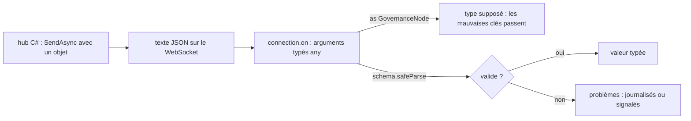

Code : les fichiers [`examples/l04_*`](https://github.com/spareilleux/learn/tree/d039c6a49edd3fac4b6bf6003260282e3f77119d/code/typescript-advanced/examples) et [`errors/l04_*`](https://github.com/spareilleux/learn/tree/d039c6a49edd3fac4b6bf6003260282e3f77119d/code/typescript-advanced/errors), les bundles dans [`bundle/`](https://github.com/spareilleux/learn/tree/d039c6a49edd3fac4b6bf6003260282e3f77119d/code/typescript-advanced/bundle) avec [`bundle-size.mjs`](https://github.com/spareilleux/learn/blob/d039c6a49edd3fac4b6bf6003260282e3f77119d/code/typescript-advanced/bundle-size.mjs), et les côtés C# et Java dans [`compare/`](https://github.com/spareilleux/learn/tree/d039c6a49edd3fac4b6bf6003260282e3f77119d/code/typescript-advanced/compare) (`l04_hub_json.cs`, `l04_json_required.cs`) et [`compare_fail/`](https://github.com/spareilleux/learn/tree/d039c6a49edd3fac4b6bf6003260282e3f77119d/code/typescript-advanced/compare_fail) (`L04Checked.java`).

Les trois premières leçons ont fait prouver davantage au vérificateur. Tout ce qu'il prouve repose sur une hypothèse : chaque valeur a le type écrit pour elle. À l'intérieur du programme, `tsc` le vérifie. À la frontière, là où les valeurs viennent de `JSON.parse`, de `response.json()`, d'un message SignalR ou de `localStorage`, rien ne le vérifie : ces API renvoient `any`, ou un paramètre typé à la main, et les types sont effacés avant que le programme s'exécute. Les développeurs C# et Java sont habitués à un désérialiseur qui construit au moins le type déclaré et échoue quand il n'y arrive pas. En TypeScript, un type faux à la frontière compile, s'exécute, et échoue ailleurs, ou pas du tout.

## Une mise à jour perdue dans GA

Le hub C# de GA diffuse le changement de santé d'un nœud dans [`GovernanceHub.cs`, lignes 163-176](https://github.com/GuitarAlchemist/ga/blob/32f143c866c126338b332e384e4a615cd4b44381/Apps/ga-server/GaApi/Hubs/GovernanceHub.cs#L163-L176), sous la forme d'un objet anonyme dont la première propriété est `nodeId`. Le front end le reçoit dans [`DataLoader.ts`, lignes 276-279](https://github.com/GuitarAlchemist/ga/blob/32f143c866c126338b332e384e4a615cd4b44381/ReactComponents/ga-react-components/src/components/PrimeRadiant/DataLoader.ts#L276-L279) :

```ts
connection.on('NodeChanged', (data: { nodeId: string; health: unknown; healthStatus: string; color: string }) => {
  // Mise à jour partielle — un seul nœud
  onUpdate({ nodes: [data as unknown as GovernanceNode], edges: [], globalHealth: { resilienceScore: 0, lolliCount: 0, ergolCount: 0 }, timestamp: new Date().toISOString() } as GovernanceGraph);
});
```

Le type du paramètre est juste : il correspond au serveur. L'assertion `as unknown as GovernanceNode` affirme ensuite qu'un objet avec `nodeId` est un nœud, dont la clé est `id`. [`ForceRadiant.tsx`, ligne 3585](https://github.com/GuitarAlchemist/ga/blob/32f143c866c126338b332e384e4a615cd4b44381/ReactComponents/ga-react-components/src/components/PrimeRadiant/ForceRadiant.tsx#L3582-L3587), passe les nœuds de ce graphe à [`updateNodeHealth`](https://github.com/GuitarAlchemist/ga/blob/32f143c866c126338b332e384e4a615cd4b44381/ReactComponents/ga-react-components/src/components/PrimeRadiant/DataLoader.ts#L446-L471), qui cherche chaque nœud de la scène par `id` parmi les nœuds reçus. Elle ne trouve rien, et la mise à jour est abandonnée sans erreur. Une recherche de code sur GitHub ne trouve aujourd'hui aucun appel à `BroadcastNodeChanged`, donc ce chemin est latent (*à vérifier* sur un serveur en marche) ; c'est exactement le genre de bug qui apparaît le jour où quelqu'un l'appelle.

L'exemple réduit le handler et la fonction de mise à jour à l'essentiel :

```ts
// examples/l04_border.ts
// Le handler NodeChanged de GuitarAlchemist/ga, réduit : la charge utile est affirmée être un nœud, et la mise à jour est perdue
import * as z from 'zod';
import { show } from './show.ts';

interface HealthMetrics {
  resilienceScore: number;
  lolliCount: number;
  ergolCount: number;
}
interface GovernanceNode {
  id: string;
  name: string;
  health?: HealthMetrics;
}

// DataLoader.ts, updateNodeHealth : cherche chaque nœud existant par id parmi les nœuds reçus, et met à jour sa santé
function updateNodeHealth(existingNodes: GovernanceNode[], freshNodes: GovernanceNode[]): string[] {
  const freshMap = new Map(freshNodes.map((n) => [n.id, n]));
  const updated: string[] = [];
  for (const node of existingNodes) {
    const fresh = freshMap.get(node.id);
    if (!fresh?.health) continue;
    node.health = fresh.health;
    updated.push(node.id);
  }
  return updated;
}

const scene: GovernanceNode[] = [{ id: 'policy-7', name: 'Alignment policy', health: { resilienceScore: 0.9, lolliCount: 0, ergolCount: 3 } }];

// Le message qu'envoie GovernanceHub.BroadcastNodeChanged, tel que SignalR le sérialise (compare/l04_hub_json.cs)
const message = '{"nodeId":"policy-7","health":{"resilienceScore":0.4,"lolliCount":0,"ergolCount":3},"healthStatus":"warning","color":"#FFB300","timestamp":"2026-09-15T12:00:01Z"}';

// DataLoader.ts, lignes 276-279 : le paramètre du handler est annoté, puis affirmé être un GovernanceNode
const data: { nodeId: string; health: unknown; healthStatus: string; color: string } = JSON.parse(message);
const asserted = updateNodeHealth(scene, [data as unknown as GovernanceNode]);
show('updated (asserted)', asserted);
show('scene[0].health.resilienceScore', scene[0]?.health?.resilienceScore);

// Un schéma vérifie la même charge utile à la frontière, et dit ce qui ne va pas
const HealthMetricsSchema = z.object({
  resilienceScore: z.number().min(0).max(1),
  lolliCount: z.int().nonnegative(),
  ergolCount: z.int().nonnegative(),
});
const GovernanceNodeSchema = z.object({
  id: z.string().min(1),
  name: z.string(),
  health: HealthMetricsSchema.optional(),
});
const asNode = GovernanceNodeSchema.safeParse(JSON.parse(message));
if (!asNode.success) console.log(z.prettifyError(asNode.error));

// Le schéma de ce que le hub envoie vraiment, et la conversion en nœud écrite une seule fois
const NodeChangedSchema = z.object({
  nodeId: z.string().min(1),
  health: HealthMetricsSchema,
  healthStatus: z.enum(['error', 'warning', 'healthy', 'unknown', 'contradictory']),
  color: z.string().regex(/^#[0-9A-F]{6}$/i),
  timestamp: z.iso.datetime(),
});
const changed = NodeChangedSchema.parse(JSON.parse(message));
const updated = updateNodeHealth(scene, [{ id: changed.nodeId, name: '', health: changed.health }]);
show('updated (validated)', updated);
show('scene[0].health.resilienceScore', scene[0]?.health?.resilienceScore);
```

```text
updated (asserted)                 []
scene[0].health.resilienceScore    0.9
✖ Invalid input: expected string, received undefined
  → at id
✖ Invalid input: expected string, received undefined
  → at name
updated (validated)                [ 'policy-7' ]
scene[0].health.resilienceScore    0.4
```

Avec l'assertion, `updated` est vide et le score reste à 0,9. Le premier schéma, `GovernanceNodeSchema`, est le type que le code supposait, et il dit tout de suite ce qui ne va pas dans le message : pas d'`id`, pas de `name`. Le second schéma décrit ce que le hub envoie, et la conversion d'un message en nœud est écrite une seule fois, après la vérification ; la mise à jour passe.

Ce que le hub envoie exactement est une question pour le côté C#, et un programme C# y répond avec le sérialiseur de SignalR lui-même :

```csharp
// compare/l04_hub_json.cs
// Ce que GovernanceHub.cs met sur le fil : le protocole de hub JSON de SignalR, avec ses options de sérialisation par défaut
#:sdk Microsoft.NET.Sdk.Web
// Les applications basées sur un fichier sont prêtes pour l'AOT par défaut, ce qui désactive le JSON par réflexion : les types anonymes en ont besoin
#:property PublishAot=false
using System.Buffers;
using System.Text;
using Microsoft.AspNetCore.SignalR.Protocol;

var protocol = new JsonHubProtocol();

// BroadcastNodeChanged envoie un objet anonyme dont la première propriété est nodeId, et non id
var nodeChanged = new
{
    nodeId = "policy-7",
    health = new HealthMetrics(0.4, 0, 3),
    healthStatus = "warning",
    color = "#FFB300",
    timestamp = new DateTime(2026, 9, 15, 12, 0, 1, DateTimeKind.Utc),
};
Console.WriteLine(Write(new InvocationMessage("NodeChanged", [nodeChanged])));

// ViewersChanged envoie des records ViewerInfo : les propriétés en PascalCase passent en camelCase, et null est écrit null
var viewer = new ViewerInfo("c3", "#d2a8ff", "Firefox", new DateTime(2026, 9, 15, 12, 0, 0, DateTimeKind.Utc));
Console.WriteLine(Write(new InvocationMessage("ViewersChanged", [new List<ViewerInfo> { viewer }])));

string Write(HubMessage message)
{
    var buffer = new ArrayBufferWriter<byte>();
    protocol.WriteMessage(message, buffer);
    // Chaque message se termine par le caractère séparateur d'enregistrements, 0x1E
    return Encoding.UTF8.GetString(buffer.WrittenSpan).TrimEnd((char)0x1E);
}

record HealthMetrics(double ResilienceScore, int LolliCount, int ErgolCount);
record ViewerInfo(string ConnectionId, string Color, string Browser, DateTime ConnectedAt, string? DisplayName = null, string? AvatarUrl = null);
```

```text
> dotnet run l04_hub_json.cs
{"type":1,"target":"NodeChanged","arguments":[{"nodeId":"policy-7","health":{"resilienceScore":0.4,"lolliCount":0,"ergolCount":3},"healthStatus":"warning","color":"#FFB300","timestamp":"2026-09-15T12:00:01Z"}]}
{"type":1,"target":"ViewersChanged","arguments":[[{"connectionId":"c3","color":"#d2a8ff","browser":"Firefox","connectedAt":"2026-09-15T12:00:00Z","displayName":null,"avatarUrl":null}]]}
```

Le [protocole de hub JSON](https://github.com/dotnet/aspnetcore/blob/a5383385245bdacc20ec19f30e46090a8154d8da/src/SignalR/docs/specs/HubProtocol.md) écrit les arguments avec `System.Text.Json` et [des noms de propriétés en camelCase par défaut](https://learn.microsoft.com/aspnet/core/signalr/configuration#jsonmessagepack-serialization-options). L'objet anonyme garde `nodeId`. Le second message est le `ViewersChanged` de GA : le `string? DisplayName = null` du record est écrit `"displayName":null`. Le [`ViewerInfo`](https://github.com/GuitarAlchemist/ga/blob/32f143c866c126338b332e384e4a615cd4b44381/ReactComponents/ga-react-components/src/components/PrimeRadiant/DataLoader.ts#L218-L225) du front end déclare `displayName?: string`, dont la [leçon 2](../02-variance-and-assignability/#optionnel-undefined-et-null) a montré que c'est un type différent de `string | null`. Le code de GA fonctionne parce que chaque lecture utilise `?.` ou `??`, qui traitent `null` et `undefined` de la même façon.

Deux détails du programme C# sont bons à savoir. Les [applications basées sur un fichier](https://learn.microsoft.com/dotnet/core/sdk/file-based-apps) sont publiées en AOT natif par défaut, ce qui désactive le JSON par réflexion ; les types anonymes en ont besoin, d'où `#:property PublishAot=false`. Et le [`on`](https://github.com/dotnet/aspnetcore/blob/a5383385245bdacc20ec19f30e46090a8154d8da/src/SignalR/clients/ts/signalr/src/HubConnection.ts#L508-L509) du client JavaScript est déclaré `on(methodName: string, newMethod: (...args: any[]) => any)` : chaque type de paramètre d'un handler est une affirmation que rien ne vérifie.



La bibliothèque de composants de GA compte 42 appels à `JSON.parse`, 55 lignes qui affirment le résultat de `response.json()` avec `as`, et 34 `as unknown as` hors des tests, au commit `32f143c`. Ce ne sont pas toutes des frontières, et elles ne sont pas toutes fausses ; chacune est un endroit où l'on croit un type au lieu de le vérifier.

## Schémas : une définition, deux vérifications

Une **bibliothèque de schémas** décrit les données avec des valeurs, vérifie par rapport à elles les données inconnues à l'exécution, et calcule le type TypeScript à partir de la même description, avec les techniques de la leçon 1. Ce cours utilise [Zod](https://zod.dev/) 4 :

```ts
// examples/l04_schemas.ts
import * as z from 'zod';
import type { Equal, Expect } from './type-tests.ts';
import { show } from './show.ts';

// 1. Le type dérivé du schéma : une seule définition, vérifiée à l'exécution et à la compilation
const ViewerInfoSchema = z.object({
  connectionId: z.string(),
  color: z.string(),
  browser: z.enum(['Edge', 'Chrome', 'Firefox', 'Safari', 'Unknown']),
  connectedAt: z.iso.datetime(),
  displayName: z.string().nullable(), // le string? DisplayName = null du record C# est envoyé comme null
  avatarUrl: z.string().nullable(),
});
type ViewerInfo = z.infer<typeof ViewerInfoSchema>;
type _1 = Expect<Equal<ViewerInfo['displayName'], string | null>>;

// 2. Ou le schéma vérifié par rapport à une interface écrite à la main : satisfies z.ZodType<T> échoue s'ils divergent.
// Le ViewerInfo de GA dans DataLoader.ts déclare displayName?: string, où null n'entre pas (errors/l04_schemas.ts)
interface ViewerInfoFixed {
  connectionId: string;
  color: string;
  browser: 'Edge' | 'Chrome' | 'Firefox' | 'Safari' | 'Unknown';
  connectedAt: string;
  displayName: string | null;
  avatarUrl: string | null;
}
const CheckedViewerInfoSchema = ViewerInfoSchema satisfies z.ZodType<ViewerInfoFixed>;
type _2 = Expect<Equal<z.infer<typeof CheckedViewerInfoSchema>, ViewerInfoFixed>>;

// 3. Les types d'entrée et de sortie diffèrent dès que le schéma transforme : des chaînes dans le message, une Date et un nombre dans le programme
const CameraSyncSchema = z.object({
  px: z.number(),
  py: z.number(),
  pz: z.number(),
  sender: z.string(),
  sentAt: z.iso.datetime().transform((text) => new Date(text)),
  zoom: z.coerce.number().default(1),
});
type CameraSyncInput = z.input<typeof CameraSyncSchema>;
type CameraSync = z.output<typeof CameraSyncSchema>;
type _3 = Expect<Equal<CameraSyncInput['sentAt'], string>>;
type _4 = Expect<Equal<CameraSync['sentAt'], Date>>;
type _5 = Expect<Equal<CameraSync['zoom'], number>>;
const camera = CameraSyncSchema.parse({ px: 0, py: 2, pz: 10, sender: 'c3', sentAt: '2026-09-15T12:00:00Z', zoom: '1.5' });
show('camera.sentAt.getUTCHours()', camera.sentAt.getUTCHours());
show('camera.zoom', camera.zoom);

// 4. Un brand ajouté par le schéma : la seule façon d'obtenir un NodeId est de passer la vérification (leçon 3)
const NodeIdSchema = z.string().regex(/^[a-z0-9-]+$/).brand<'NodeId'>();
type NodeId = z.infer<typeof NodeIdSchema>;
const nodeId: NodeId = NodeIdSchema.parse('policy-7');
show('nodeId', nodeId);
show("safeParse('Policy 7').success", NodeIdSchema.safeParse('Policy 7').success);

// 5. Les clés inconnues : retirées par défaut, gardées avec z.looseObject, rejetées avec z.strictObject
const payload = { connectionId: 'c3', color: '#d2a8ff', browser: 'Firefox', connectedAt: '2026-09-15T12:00:00Z', displayName: null, avatarUrl: null, isAdmin: true };
show("'isAdmin' in parse(payload)", 'isAdmin' in ViewerInfoSchema.parse(payload));
const strict = z.strictObject(ViewerInfoSchema.shape).safeParse(payload);
show('strictObject issues', strict.error?.issues.map((issue) => `${issue.code}: ${issue.message}`));

// 6. Le schéma en JSON Schema, le format qu'utilisent les documents OpenAPI et les générateurs C# ou Java
show('z.toJSONSchema(NodeIdSchema)', z.toJSONSchema(NodeIdSchema));
```

```text
camera.sentAt.getUTCHours()        12
camera.zoom                        1.5
nodeId                             'policy-7'
safeParse('Policy 7').success      false
'isAdmin' in parse(payload)        false
strictObject issues                [ 'unrecognized_keys: Unrecognized key: "isAdmin"' ]
z.toJSONSchema(NodeIdSchema)       {
  '$schema': 'https://json-schema.org/draft/2020-12/schema',
  type: 'string',
  pattern: '^[a-z0-9-]+$'
}
```

1. **Types dérivés.** [`z.infer`](https://zod.dev/basics#inferring-types) est le type de sortie du schéma. Le test de types vérifie que `displayName` est `string | null`, comme le hub l'envoie.
2. **Un schéma vérifié par rapport à une interface.** Quand l'interface vient en premier, par exemple générée à partir d'un document OpenAPI, `satisfies z.ZodType<ViewerInfoFixed>` échoue dès que les deux divergent. Avec le `ViewerInfo` de GA lui-même, il échoue, et c'est la divergence de la section précédente trouvée par le compilateur.
3. **Entrée et sortie.** Un [`transform`](https://zod.dev/api#transforms) ou un [`coerce`](https://zod.dev/api#coercion) rend le type du message différent du type du programme : `sentAt` est une `string` dans [`z.input`](https://zod.dev/basics#inferring-types) et une `Date` dans `z.output`. Un schéma est un parseur, pas seulement un validateur.
4. **Brands.** [`.brand<'NodeId'>()`](https://zod.dev/api#branded-types) ajoute le brand de la leçon 3 au type de sortie, donc le constructeur intelligent est le schéma lui-même.
5. **Clés inconnues.** `z.object` les retire, ce qui protège le code qui étale le résultat dans une requête ; [`z.strictObject`](https://zod.dev/api#objects) les rejette.
6. **JSON Schema.** [`z.toJSONSchema`](https://zod.dev/json-schema) transforme le schéma dans le format que lisent OpenAPI et les générateurs C# et Java, donc le schéma peut être le contrat plutôt qu'une copie de celui-ci.

Les erreurs :

```text
> npx tsc -p out/tsconfig.l04_schemas.json --pretty
errors/l04_schemas.ts:23:34 - error TS1360: Type 'ZodObject<{ connectionId: ZodString; color: ZodString; browser: ZodString; connectedAt: ZodISODateTime; displayName: ZodNullable<ZodString>; avatarUrl: ZodNullable<...>; }, $strip>' does not satisfy the expected type 'ZodType<ViewerInfo, unknown, $ZodTypeInternals<ViewerInfo, unknown>>'.
  The types of '_zod.output.displayName' are incompatible between these types.
    Type 'string | null' is not assignable to type 'string'.
      Type 'null' is not assignable to type 'string'.

23 const checked = ViewerInfoSchema satisfies z.ZodType<ViewerInfo>;
                                    ~~~~~~~~~

errors/l04_schemas.ts:27:22 - error TS18048: 'result.data' is possibly 'undefined'.

27 console.log(checked, result.data.color);
                        ~~~~~~~~~~~


Found 2 errors in the same file, starting at: errors/l04_schemas.ts:23
> node errors/l04_schemas.ts
errors/l04_schemas.ts:27
console.log(checked, result.data.color);
                                 ^

TypeError: Cannot read properties of undefined (reading 'color')

Node.js v24.21.0
```

`TS1360` est `satisfies` qui refuse l'interface de GA, avec le chemin de propriété `_zod.output.displayName` qui explique pourquoi. `TS18048` est le résultat de [`safeParse`](https://zod.dev/basics#handling-errors), une union d'un succès et d'un échec, lu sans vérifier `success` ; Node.js montre ce que la vérification empêche.

En C#, les types existent à l'exécution, et depuis .NET 9 `System.Text.Json` peut imposer deux des règles que TypeScript laisse à un schéma, les [annotations nullables](https://learn.microsoft.com/dotnet/standard/serialization/system-text-json/nullable-annotations) et les [paramètres de constructeur obligatoires](https://learn.microsoft.com/dotnet/api/system.text.json.jsonserializeroptions.respectrequiredconstructorparameters) :

```csharp
// compare/l04_json_required.cs
// Les types C# existent à l'exécution : System.Text.Json peut vérifier la charge utile par rapport au record dans lequel il désérialise
// Les applications basées sur un fichier sont prêtes pour l'AOT par défaut, ce qui désactive le JSON par réflexion
#:property PublishAot=false
using System.Text.Json;

var options = new JsonSerializerOptions(JsonSerializerDefaults.Web)
{
    RespectNullableAnnotations = true, // .NET 9 : null pour une propriété non nullable est une erreur
    RespectRequiredConstructorParameters = true, // .NET 9 : un paramètre de constructeur manquant est une erreur
};

string[] messages =
[
    """{"id":"policy-7","name":"Alignment policy"}""",
    """{"nodeId":"policy-7","health":{"resilienceScore":0.4}}""",
    """{"id":"policy-7","name":null}""",
];
foreach (var message in messages)
{
    try
    {
        var node = JsonSerializer.Deserialize<GovernanceNode>(message, options);
        Console.WriteLine($"ok: {node}");
    }
    catch (JsonException e)
    {
        Console.WriteLine($"JsonException: {e.Message}");
    }
}

record GovernanceNode(string Id, string Name);
```

```text
> dotnet run l04_json_required.cs
ok: GovernanceNode { Id = policy-7, Name = Alignment policy }
JsonException: JSON deserialization for type 'GovernanceNode' was missing required properties including: 'id', 'name'.
JsonException: The constructor parameter 'Name' on type 'GovernanceNode' doesn't allow null values. Consider updating its nullability annotation. Path: $.name | LineNumber: 0 | BytePositionInLine: 28.
```

Les deux options sont désactivées par défaut, pour la compatibilité, et les vérifications d'intervalle ou de format demandent encore du code de validation ou des attributs. [Jackson](https://github.com/FasterXML/jackson-databind), en Java, est dans la même situation, avec [Bean Validation](https://jakarta.ee/specifications/bean-validation/3.0/) pour les règles.

## Zod, Valibot ou ArkType

Trois bibliothèques dominent en 2026, et chacune est construite différemment :

- [Zod](https://zod.dev/) a une API à chaînage de méthodes, `z.string().min(1)`, et le plus grand écosystème : tRPC, React Hook Form, les générateurs OpenAPI et les SDK d'IA l'acceptent. Sa variante fonctionnelle, [`zod/mini`](https://zod.dev/packages/mini), écrit `z.string().check(z.minLength(1))` et est conçue pour la taille du bundle.
- [Valibot](https://valibot.dev/) est fonctionnelle dès le départ, `v.pipe(v.string(), v.minLength(1))` : chaque vérification est une fonction, et un bundler ne garde que celles qui sont utilisées.
- [ArkType](https://arktype.io/) écrit les définitions sous forme de chaînes dans la syntaxe de TypeScript lui-même, `'string > 0'`, analysées par des *template literal types* à la compilation et compilées en validateur à l'exécution.

Le même schéma de nœud, mis en bundle pour un navigateur avec esbuild 0.28.2, minifié, avec chaque bibliothèque :

```text
library     minified   gzip
zod-named   442.7 kB   90.6 kB
zod          87.4 kB   25.5 kB
zod-mini     17.6 kB    6.1 kB
valibot       4.8 kB    1.7 kB
arktype     150.1 kB   46.0 kB
```

| | Zod 4.6.5 | `zod/mini` | Valibot 1.5.0 | ArkType 2.2.3 |
|---|---|---|---|---|
| Bundle, gzip | 25,5 kB | 6,1 kB | 1,7 kB | 46,0 kB |
| API | méthodes | fonctions | fonctions | syntaxe TypeScript dans des chaînes |
| Téléchargements npm, semaine du 7 sept. 2026 | 211 005 391, avec `zod/mini` | | 13 793 124 | 1 431 002 |
| JSON Schema | intégré | intégré | `@valibot/to-json-schema` | intégré |
| Standard Schema | oui | oui | oui | oui |

La première ligne de la mesure est une découverte : `import { z } from 'zod'` donne un bundle cinq fois plus gros que `import * as z from 'zod'`, 90,6 kB contre 25,5 kB une fois compressé avec gzip, avec le même code par ailleurs (compare [`bundle/zod-named.ts`](https://github.com/spareilleux/learn/blob/d039c6a49edd3fac4b6bf6003260282e3f77119d/code/typescript-advanced/bundle/zod-named.ts) et [`bundle/zod.ts`](https://github.com/spareilleux/learn/blob/d039c6a49edd3fac4b6bf6003260282e3f77119d/code/typescript-advanced/bundle/zod.ts)). L'export nommé est un objet qui contient toutes les fonctions, donc esbuild ne peut pas retirer celles qui ne servent pas ; l'import d'espace de noms le lui permet. La documentation de Zod écrit `import * as z from "zod"`, et c'est la forme à garder.

Le cours utilise Zod, pour trois raisons : c'est ce qu'un lecteur rencontrera dans d'autres bases de code, ses messages d'erreur et sa sortie JSON Schema ne demandent aucun package supplémentaire, et sur un serveur ou dans Node.js la taille du bundle n'a pas d'importance. Pour un bundle de navigateur où chaque kilo-octet compte, `zod/mini` ou Valibot sont de meilleurs choix, et la section suivante montre que ce choix n'a pas à se propager dans le code qui utilise les schémas.

## Standard Schema

[Standard Schema](https://standardschema.dev/) est une petite interface, publiée sous forme du package de types seuls `@standard-schema/spec`, que les trois bibliothèques implémentent : chaque schéma a une propriété `~standard` avec une fonction `validate` et les types d'entrée et de sortie. Une bibliothèque qui accepte des schémas, une bibliothèque de formulaires ou un routeur, s'écrit une seule fois face à l'interface :

```ts
// examples/l04_standard_schema.ts
// Standard Schema : une interface que Zod, Valibot et ArkType implémentent tous, pour qu'une fonction puisse accepter n'importe lequel
import type { StandardSchemaV1 } from '@standard-schema/spec';
import { type } from 'arktype';
import * as v from 'valibot';
import * as z from 'zod';
import type { Equal, Expect } from './type-tests.ts';

type Parsed<T> = { ok: true; value: T } | { ok: false; issues: string[] };

// Écrite une seule fois, face à l'interface : le type de sortie vient du schéma, quelle que soit la bibliothèque qui l'a construit
async function parseJson<S extends StandardSchemaV1>(schema: S, text: string): Promise<Parsed<StandardSchemaV1.InferOutput<S>>> {
  let json: unknown;
  try {
    json = JSON.parse(text);
  } catch (err) {
    return { ok: false, issues: [`not JSON: ${err instanceof Error ? err.message : String(err)}`] };
  }
  const result = await schema['~standard'].validate(json);
  if (result.issues) {
    return { ok: false, issues: result.issues.map((issue) => `${issue.path?.map((p) => (typeof p === 'object' ? p.key : p)).join('.') ?? ''}: ${issue.message}`) };
  }
  return { ok: true, value: result.value };
}

// Le même type de charge utile, trois bibliothèques
const zodSchema = z.object({ target: z.string().min(1), timestamp: z.iso.datetime() });
const valibotSchema = v.object({ target: v.pipe(v.string(), v.minLength(1)), timestamp: v.pipe(v.string(), v.isoTimestamp()) });
const arktypeSchema = type({ target: 'string > 0', timestamp: 'string.date.iso' });

type NavigateToPlanet = { target: string; timestamp: string };
type _1 = Expect<Equal<StandardSchemaV1.InferOutput<typeof zodSchema>, NavigateToPlanet>>;
type _2 = Expect<Equal<StandardSchemaV1.InferOutput<typeof valibotSchema>, NavigateToPlanet>>;
type _3 = Expect<Equal<StandardSchemaV1.InferOutput<typeof arktypeSchema>, NavigateToPlanet>>;

const messages = ['{"target":"saturn","timestamp":"2026-09-15T12:00:00Z"}', '{"target":"","timestamp":"yesterday"}', '{"target":'];
for (const [name, schema] of [['zod', zodSchema], ['valibot', valibotSchema], ['arktype', arktypeSchema]] as const) {
  for (const message of messages) {
    const parsed = await parseJson(schema, message);
    console.log(`${name.padEnd(8)} ${parsed.ok ? `ok: ${parsed.value.target}` : parsed.issues.join(' | ')}`);
  }
}
```

```text
zod      ok: saturn
zod      target: Too small: expected string to have >=1 characters | timestamp: Invalid ISO datetime
zod      not JSON: Unexpected end of JSON input
valibot  ok: saturn
valibot  target: Invalid length: Expected >=1 but received 0 | timestamp: Invalid timestamp: Received "yesterday"
valibot  not JSON: Unexpected end of JSON input
arktype  ok: saturn
arktype  target: target must be non-empty | timestamp: timestamp must be an ISO 8601 (YYYY-MM-DDTHH:mm:ss.sssZ) date (was "yesterday")
arktype  not JSON: Unexpected end of JSON input
```

`parseJson` ne sait rien de Zod, de Valibot ni d'ArkType, et son type de retour est pourtant le type de sortie du schéma qu'elle reçoit, quel qu'il soit, grâce à `StandardSchemaV1.InferOutput` ; les trois tests de types vérifient que les trois bibliothèques infèrent le même type. `validate` peut renvoyer une `Promise`, pour les schémas aux vérifications asynchrones, c'est pourquoi la fonction est `async`. Les messages diffèrent : chaque bibliothèque a sa propre formulation, et les échecs de `JSON.parse` arrivent avant tout schéma.

## Erreurs typées

Une vérification qui échoue est un échec attendu : le programme doit le traiter, pas planter. TypeScript n'a pas d'exceptions vérifiées, et un `catch` reçoit `unknown` sous `strict` ([`useUnknownInCatchVariables`](https://www.typescriptlang.org/tsconfig/#useUnknownInCatchVariables)), donc le type de ce qu'une fonction lève ne fait pas partie de sa signature. Un **type résultat** place plutôt les échecs attendus dans le type de retour :

```ts
// examples/l04_result.ts
import * as z from 'zod';
import { show } from './show.ts';

// Un résultat : succès ou échec, distingués par ok, avec un type pour chaque côté
type Result<T, E> = { ok: true; value: T } | { ok: false; error: E };
const ok = <T>(value: T): Result<T, never> => ({ ok: true, value });
const err = <E>(error: E): Result<never, E> => ({ ok: false, error });

// Les échecs dont un appelant peut faire quelque chose, sous forme d'union discriminée
type LoadError =
  | { kind: 'network'; cause: unknown }
  | { kind: 'http'; status: number }
  | { kind: 'invalid-json'; message: string }
  | { kind: 'invalid-data'; issues: string[] };

const GraphSchema = z.object({
  nodes: z.array(z.object({ id: z.string(), name: z.string() })),
  timestamp: z.iso.datetime(),
});
type GovernanceGraph = z.infer<typeof GraphSchema>;

// Un faux fetch, pour que l'exemple s'exécute sans serveur : chaque URL répond différemment
type Fetch = (url: string) => Promise<{ ok: boolean; status: number; text(): Promise<string> }>;
const fakeFetch: Fetch = async (url) => {
  if (url.endsWith('/offline')) throw new TypeError('fetch failed');
  const bodies: Record<string, [number, string]> = {
    '/api/governance': [200, '{"nodes":[{"id":"policy-7","name":"Alignment policy"}],"timestamp":"2026-09-15T12:00:00Z"}'],
    '/api/governance/stale': [200, '{"nodes":[{"id":"policy-7"}],"timestamp":"yesterday"}'],
    '/api/governance/html': [200, '<!doctype html>'],
    '/api/governance/missing': [404, 'Not Found'],
  };
  const [status, body] = bodies[url] ?? [500, ''];
  return { ok: status < 400, status, text: async () => body };
};

// Chaque échec attendu est renvoyé ; un bug dans cette fonction lèverait toujours une exception
async function loadGraph(fetch: Fetch, url: string): Promise<Result<GovernanceGraph, LoadError>> {
  let response;
  try {
    response = await fetch(url);
  } catch (cause) {
    return err({ kind: 'network', cause });
  }
  if (!response.ok) return err({ kind: 'http', status: response.status });
  let json: unknown;
  try {
    json = JSON.parse(await response.text());
  } catch (e) {
    return err({ kind: 'invalid-json', message: e instanceof Error ? e.message : String(e) });
  }
  const parsed = GraphSchema.safeParse(json);
  if (!parsed.success) return err({ kind: 'invalid-data', issues: parsed.error.issues.map((i) => `${i.path.join('.')}: ${i.message}`) });
  return ok(parsed.data);
}

// L'appelant doit regarder ok avant d'atteindre la valeur, et un switch sur kind couvre chaque échec
function describe(result: Result<GovernanceGraph, LoadError>): string {
  if (result.ok) return `${result.value.nodes.length} node(s) at ${result.value.timestamp}`;
  const error = result.error;
  switch (error.kind) {
    case 'network':
      return `offline (${error.cause instanceof Error ? error.cause.message : 'unknown cause'}), keeping the static graph`;
    case 'http':
      return `HTTP ${error.status}, keeping the static graph`;
    case 'invalid-json':
      return `not JSON: ${error.message}`;
    case 'invalid-data':
      return `unexpected graph: ${error.issues.join('; ')}`;
    default:
      return error satisfies never;
  }
}

for (const url of ['/api/governance', '/api/governance/offline', '/api/governance/missing', '/api/governance/html', '/api/governance/stale']) {
  console.log(`${url.padEnd(26)} ${describe(await loadGraph(fakeFetch, url))}`);
}

// Là où une exception reste le bon outil : une erreur que l'appelant ne peut pas traiter, avec l'erreur d'origine comme cause
function requireGraph(result: Result<GovernanceGraph, LoadError>): GovernanceGraph {
  if (result.ok) return result.value;
  throw new Error(`governance graph unavailable: ${result.error.kind}`, { cause: result.error });
}
try {
  requireGraph(await loadGraph(fakeFetch, '/api/governance/missing'));
} catch (e) {
  show('caught', e instanceof Error ? [e.message, e.cause] : e);
}
```

```text
/api/governance            1 node(s) at 2026-09-15T12:00:00Z
/api/governance/offline    offline (fetch failed), keeping the static graph
/api/governance/missing    HTTP 404, keeping the static graph
/api/governance/html       not JSON: Unexpected token '<', "<!doctype html>" is not valid JSON
/api/governance/stale      unexpected graph: nodes.0.name: Invalid input: expected string, received undefined; timestamp: Invalid ISO datetime
caught                             [ 'governance graph unavailable: http', { kind: 'http', status: 404 } ]
```

- **`Result<T, E>`** est une union discriminée sur `ok`. `ok` renvoie `Result<T, never>` et `err` renvoie `Result<never, E>`, et les deux sont assignables à `Result<GovernanceGraph, LoadError>` par la covariance de la leçon 2.
- **`LoadError`** liste les échecs dont un appelant peut faire quelque chose, chacun avec ses données : le statut d'une erreur HTTP, les problèmes de données invalides.
- **`error satisfies never`** dans la branche `default` est la vérification d'exhaustivité de la leçon 3, sans fonction utilitaire.
- **`loadGraph` lève toujours une exception pour les bugs.** Seuls les échecs attendus sont interceptés et renvoyés ; une `TypeError` à l'intérieur de la fonction elle-même se propagerait, comme il se doit.
- **Les exceptions restent l'outil des échecs que personne ne peut traiter**, et l'[option `cause` d'`Error`](https://tc39.es/ecma262/#sec-installerrorcause) garde l'erreur d'origine attachée.

Les erreurs :

```text
> npx tsc -p out/tsconfig.l04_result.json --pretty
errors/l04_result.ts:7:20 - error TS2339: Property 'value' does not exist on type 'Result<{ nodes: string[]; }, LoadError>'.
  Property 'value' does not exist on type '{ ok: false; error: LoadError; }'.

7 console.log(result.value.nodes); // the value exists only when ok is true
                     ~~~~~

errors/l04_result.ts:16:7 - error TS2322: Type '{ kind: "invalid-json"; message: string; }' is not assignable to type 'string'.

16       return error satisfies never; // invalid-json is not handled
         ~~~~~~

errors/l04_result.ts:16:20 - error TS1360: Type '{ kind: "invalid-json"; message: string; }' does not satisfy the expected type 'never'.

16       return error satisfies never; // invalid-json is not handled
                      ~~~~~~~~~

errors/l04_result.ts:23:15 - error TS18046: 'e' is of type 'unknown'.

23   console.log(e.message, describe({ kind: 'http', status: 500 }));
                 ~


Found 4 errors in the same file, starting at: errors/l04_result.ts:7
```

`TS2339` lit `value` sans vérifier `ok`. Les deux erreurs de la ligne 16 sont le cas `'invalid-json'` manquant : `satisfies never` le signale, et le type de retour aussi. `TS18046` est une variable de `catch` utilisée comme une `Error`.

La réponse de Java se trouve aussi dans la signature, avec les exceptions vérifiées :

```java
// compare_fail/L04Checked.java
// Les exceptions vérifiées de Java font partie de la signature : l'appelant doit les intercepter ou les déclarer
import java.io.IOException;

public class L04Checked {
    static String loadGraph(String url) throws IOException {
        throw new IOException("fetch failed: " + url);
    }

    public static void main(String[] args) {
        System.out.println(loadGraph("/api/governance"));
    }
}
```

```text
> javac L04Checked.java
L04Checked.java:11: error: unreported exception IOException; must be caught or declared to be thrown
        System.out.println(loadGraph("/api/governance"));
                                    ^
1 error
```

| | C# | Java | TypeScript |
|---|---|---|---|
| Échec attendu dans la signature | non ; un type résultat par convention, ou `bool TryParse(…, out T)` | exceptions vérifiées | une union résultat |
| Type d'une valeur interceptée | `Exception` ou une sous-classe | `Throwable` ou une sous-classe | `unknown` |
| Exhaustivité sur les échecs | avertissement `CS8509` de l'expression switch | non | `never` |
| Chaîner une cause | `innerException` | `cause` | `{ cause }` depuis ES2022 |

## À retenir

- `JSON.parse`, `response.json()` et le `on` de SignalR renvoient `any` : un type écrit à cet endroit est une affirmation, et `as` transforme une affirmation fausse en bug silencieux, comme la mise à jour `NodeChanged` de GA.
- Un schéma vérifie les données à l'exécution et donne le type à la compilation à partir d'une seule définition ; `satisfies z.ZodType<T>` garde un schéma et une interface écrite à la main alignés.
- Un schéma est un parseur : ses types d'entrée et de sortie diffèrent dès qu'il transforme ou convertit.
- Zod est le choix par défaut pour son écosystème ; Valibot et `zod/mini` sont beaucoup plus petits dans un navigateur ; importe Zod comme espace de noms, sinon le bundle grossit cinq fois.
- Standard Schema permet à du code d'accepter un schéma de n'importe laquelle des trois bibliothèques, avec le type inféré.
- Renvoie les échecs attendus sous forme d'union résultat avec une erreur typée, et garde les exceptions pour les bugs et les échecs que personne ne peut traiter.

## Exercices

1. Le `GovernanceHealthStatus` de GA a cinq valeurs, et [`ForceRadiant.tsx`](https://github.com/GuitarAlchemist/ga/blob/32f143c866c126338b332e384e4a615cd4b44381/ReactComponents/ga-react-components/src/components/PrimeRadiant/ForceRadiant.tsx#L721-L725) compare aussi le statut à `'ok'` et `'critical'`. Écris trois schémas pour un nœud : un qui rejette un statut inconnu, un qui le remplace par `'unknown'`, et un qui le remplace et enregistre la valeur remplacée.

<details>
<summary>Solution</summary>

[`solutions/l04_ex1_health_status.ts`](https://github.com/spareilleux/learn/blob/d039c6a49edd3fac4b6bf6003260282e3f77119d/code/typescript-advanced/solutions/l04_ex1_health_status.ts) :

```ts
// solutions/l04_ex1_health_status.ts
import * as z from 'zod';

// Les cinq statuts du GovernanceHealthStatus de GA ; ForceRadiant.tsx compare aussi avec 'ok' et 'critical'
const HealthStatus = z.enum(['error', 'warning', 'healthy', 'unknown', 'contradictory']);

// Strict : un statut inconnu rejette le nœud entier
const StrictNode = z.object({ id: z.string(), healthStatus: HealthStatus });
// Tolérant : un statut inconnu devient 'unknown', et le reste du nœud est gardé
const TolerantNode = z.object({ id: z.string(), healthStatus: HealthStatus.catch('unknown') });

// Tolérant et visible : la valeur remplacée est signalée, pour qu'un nouveau statut sur le serveur ne passe pas inaperçu
const replaced: string[] = [];
const ReportingNode = z.object({
  id: z.string(),
  healthStatus: HealthStatus.catch((ctx) => {
    replaced.push(String(ctx.value));
    return 'unknown';
  }),
});

const nodes = JSON.parse('[{"id":"policy-7","healthStatus":"healthy"},{"id":"policy-8","healthStatus":"critical"},{"id":"policy-9","healthStatus":"ok"}]');
console.log('strict:  ', z.array(StrictNode).safeParse(nodes).error?.issues.map((i) => `${i.path.join('.')}: ${i.message}`));
console.log('tolerant:', z.array(TolerantNode).parse(nodes).map((n) => n.healthStatus));
console.log('reported:', z.array(ReportingNode).parse(nodes).map((n) => n.healthStatus), 'replaced', replaced);
```

```text
strict:   [
  '1.healthStatus: Invalid option: expected one of "error"|"warning"|"healthy"|"unknown"|"contradictory"',
  '2.healthStatus: Invalid option: expected one of "error"|"warning"|"healthy"|"unknown"|"contradictory"'
]
tolerant: [ 'healthy', 'unknown', 'unknown' ]
reported: [ 'healthy', 'unknown', 'unknown' ] replaced [ 'critical', 'ok' ]
```

Le schéma strict rejette le tableau entier pour une seule valeur inconnue, ce qui est juste pour une commande et dur pour un affichage. [`.catch`](https://zod.dev/api#catch) garde le reste du nœud, et sa forme fonction reçoit la valeur invalide, donc un nouveau statut sur le serveur apparaît dans un journal au lieu de disparaître.

</details>

2. Réécris le hub typé de la leçon 1 pour que la table contienne des schémas au lieu de types : `on` dérive le type de la charge utile du schéma, valide chaque message, et appelle un callback `onInvalid` avec les problèmes au lieu du handler. Accepte n'importe quel Standard Schema.

<details>
<summary>Solution</summary>

[`solutions/l04_ex2_validated_hub.ts`](https://github.com/spareilleux/learn/blob/d039c6a49edd3fac4b6bf6003260282e3f77119d/code/typescript-advanced/solutions/l04_ex2_validated_hub.ts) :

```ts
// solutions/l04_ex2_validated_hub.ts
import type { StandardSchemaV1 } from '@standard-schema/spec';
import * as z from 'zod';

interface HubConnection {
  on(methodName: string, newMethod: (...args: any[]) => any): void;
}

// La table de la leçon 1 contient maintenant des schémas, et les types des charges utiles en sont dérivés
const governanceHubEvents = {
  NavigateToPlanet: z.object({ target: z.string().min(1), timestamp: z.iso.datetime() }),
  NodeChanged: z.object({ nodeId: z.string().min(1), healthStatus: z.string(), color: z.string() }),
} satisfies Record<string, StandardSchemaV1>;
type Events = typeof governanceHubEvents;
type Payload<K extends keyof Events> = StandardSchemaV1.InferOutput<Events[K]>;

// Le handler ne reçoit que des données validées ; un message invalide va à onInvalid, avec les problèmes
function on<K extends keyof Events & string>(connection: HubConnection, name: K, handler: (data: Payload<K>) => void, onInvalid: (name: string, issues: readonly StandardSchemaV1.Issue[]) => void): void {
  const schema: StandardSchemaV1<unknown, Payload<K>> = governanceHubEvents[name];
  connection.on(name, (data: unknown) => {
    const result = schema['~standard'].validate(data);
    if (result instanceof Promise) throw new TypeError(`${name}: asynchronous schemas are not supported here`);
    if (result.issues) onInvalid(name, result.issues);
    else handler(result.value);
  });
}

const handlers = new Map<string, (data: unknown) => void>();
const connection: HubConnection = { on: (name, handler) => void handlers.set(name, handler) };
const reportInvalid = (name: string, issues: readonly StandardSchemaV1.Issue[]) => console.log(`invalid ${name}: ${issues.map((i) => i.message).join('; ')}`);

on(connection, 'NavigateToPlanet', (data) => console.log(`navigate to ${data.target}`), reportInvalid);
on(connection, 'NodeChanged', (data) => console.log(`node ${data.nodeId} is ${data.healthStatus}`), reportInvalid);

handlers.get('NavigateToPlanet')?.({ target: 'saturn', timestamp: '2026-09-15T12:00:00Z' });
handlers.get('NavigateToPlanet')?.({ planet: 'saturn' });
handlers.get('NodeChanged')?.({ nodeId: 'policy-7', healthStatus: 'warning', color: '#FFB300' });
```

```text
navigate to saturn
invalid NavigateToPlanet: Invalid input: expected string, received undefined; Invalid input: expected string, received undefined
node policy-7 is warning
```

La table est vérifiée avec `satisfies Record<string, StandardSchemaV1>`, et `Payload<K>` est la sortie inférée de chaque schéma. Le client n'attend pas un handler, donc un schéma asynchrone est refusé avec une erreur claire plutôt que laissé en cours d'exécution en arrière-plan. Le schéma de `NodeChanged` décrit ce que le hub envoie vraiment : le handler reçoit `nodeId`, et n'a aucune raison d'affirmer un nœud.

</details>

3. Écris `map`, `andThen` et `all` pour `Result`. `all` prend un tuple de résultats et renvoie un résultat de tuple, dont le type d'erreur est l'union des types d'erreur.

<details>
<summary>Solution</summary>

[`solutions/l04_ex3_result_helpers.ts`](https://github.com/spareilleux/learn/blob/d039c6a49edd3fac4b6bf6003260282e3f77119d/code/typescript-advanced/solutions/l04_ex3_result_helpers.ts) :

```ts
// solutions/l04_ex3_result_helpers.ts
import type { Equal, Expect } from '../examples/type-tests.ts';

type Result<T, E> = { ok: true; value: T } | { ok: false; error: E };
const ok = <T>(value: T): Result<T, never> => ({ ok: true, value });
const err = <E>(error: E): Result<never, E> => ({ ok: false, error });

const map = <T, U, E>(result: Result<T, E>, f: (value: T) => U): Result<U, E> => (result.ok ? ok(f(result.value)) : result);
const andThen = <T, U, E, F>(result: Result<T, E>, f: (value: T) => Result<U, F>): Result<U, E | F> => (result.ok ? f(result.value) : result);

// all : un tuple de résultats devient un résultat de tuple, et le type d'erreur est l'union des erreurs
type Values<R extends readonly Result<unknown, unknown>[]> = { -readonly [K in keyof R]: R[K] extends Result<infer T, unknown> ? T : never };
type Errors<R extends readonly Result<unknown, unknown>[]> = R[number] extends infer U ? (U extends { ok: false; error: infer E } ? E : never) : never;
function all<const R extends readonly Result<unknown, unknown>[]>(results: R): Result<Values<R>, Errors<R>> {
  const values: unknown[] = [];
  for (const result of results) {
    if (!result.ok) return result as Result<never, Errors<R>>;
    values.push(result.value);
  }
  return ok(values as Values<R>); // une assertion : une valeur par résultat, dans l'ordre
}

type FretError = { kind: 'fret-out-of-range'; fret: number };
type NoteError = { kind: 'unknown-note'; text: string };
const parseFret = (text: string): Result<number, FretError> => {
  const fret = Number(text);
  return Number.isInteger(fret) && fret >= 0 && fret <= 24 ? ok(fret) : err({ kind: 'fret-out-of-range', fret });
};
const parseNote = (text: string): Result<string, NoteError> => (/^[A-G][#b]?$/.test(text) ? ok(text) : err({ kind: 'unknown-note', text }));

const position = all([parseNote('E'), parseFret('7')]);
type _1 = Expect<Equal<typeof position, Result<[string, number], NoteError | FretError>>>;
console.log(map(position, ([note, fret]) => `${note} string, fret ${fret}`));
console.log(all([parseNote('H'), parseFret('7')]));
console.log(andThen(parseFret('30'), (fret) => parseNote(fret > 12 ? 'E' : 'A')));
```

```text
{ ok: true, value: 'E string, fret 7' }
{ ok: false, error: { kind: 'unknown-note', text: 'H' } }
{ ok: false, error: { kind: 'fret-out-of-range', fret: 30 } }
```

`andThen` élargit le type d'erreur à `E | F`, puisque l'une ou l'autre étape peut échouer. Dans `all`, le paramètre de type `const` garde l'argument sous forme de tuple, `Values` est un type mappé homomorphe sur ce tuple qui retire `readonly` et extrait le type de chaque valeur avec `infer`, et `Errors` se distribue sur les éléments pour rassembler les types d'erreur ; le test de types vérifie `Result<[string, number], NoteError | FretError>`. La boucle ne peut pas prouver qu'elle pousse une valeur par élément, donc le résultat est affirmé, comme dans le `fold` de la leçon 3.

</details>

## Sources

- [Handbook TypeScript — Narrowing](https://www.typescriptlang.org/docs/handbook/2/narrowing.html), [TSConfig — `useUnknownInCatchVariables`](https://www.typescriptlang.org/tsconfig/#useUnknownInCatchVariables)
- [ECMAScript — `JSON.parse`](https://tc39.es/ecma262/#sec-json.parse), [InstallErrorCause](https://tc39.es/ecma262/#sec-installerrorcause)
- [Documentation de Zod](https://zod.dev/), [guides de Valibot](https://valibot.dev/guides/introduction/), [documentation d'ArkType](https://arktype.io/docs/intro/setup), [Standard Schema](https://standardschema.dev/)
- [API d'esbuild](https://esbuild.github.io/api/), et les nombres de téléchargements npm d'[api.npmjs.org](https://github.com/npm/registry/blob/main/docs/download-counts.md)
- [Protocole de hub SignalR](https://github.com/dotnet/aspnetcore/blob/a5383385245bdacc20ec19f30e46090a8154d8da/src/SignalR/docs/specs/HubProtocol.md) et le [`HubConnection.ts` du client TypeScript](https://github.com/dotnet/aspnetcore/blob/a5383385245bdacc20ec19f30e46090a8154d8da/src/SignalR/clients/ts/signalr/src/HubConnection.ts), ASP.NET Core v10.0.11
- [Microsoft — Configuration de SignalR](https://learn.microsoft.com/aspnet/core/signalr/configuration), [Hubs fortement typés](https://learn.microsoft.com/aspnet/core/signalr/hubs#strongly-typed-hubs), [Respecter les annotations nullables](https://learn.microsoft.com/dotnet/standard/serialization/system-text-json/nullable-annotations), [Applications basées sur un fichier](https://learn.microsoft.com/dotnet/core/sdk/file-based-apps)
- [Java Language Specification, chapitre 11 — Exceptions](https://docs.oracle.com/javase/specs/jls/se25/html/jls-11.html)
