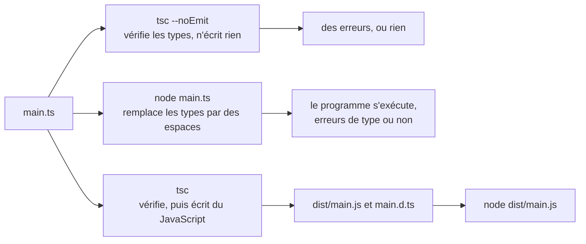

import { Tabs, TabItem } from '@astrojs/starlight/components';

Code : les fichiers [`examples/l01_*`](https://github.com/spareilleux/learn/tree/a504f1c0571aa8ed15a8d9ca81616b5f050bf8cc/code/typescript-for-csharp-java/examples) et [`errors/l01_*`](https://github.com/spareilleux/learn/tree/a504f1c0571aa8ed15a8d9ca81616b5f050bf8cc/code/typescript-for-csharp-java/errors), le projet [`l01-emit`](https://github.com/spareilleux/learn/tree/a504f1c0571aa8ed15a8d9ca81616b5f050bf8cc/code/typescript-for-csharp-java/l01-emit), le [`tsconfig.json`](https://github.com/spareilleux/learn/blob/a504f1c0571aa8ed15a8d9ca81616b5f050bf8cc/code/typescript-for-csharp-java/tsconfig.json) du cours, et les côtés C# et Java dans [`compare_fail/l01_types.cs`](https://github.com/spareilleux/learn/blob/a504f1c0571aa8ed15a8d9ca81616b5f050bf8cc/code/typescript-for-csharp-java/compare_fail/l01_types.cs) et [`compare_fail/L01Types.java`](https://github.com/spareilleux/learn/blob/a504f1c0571aa8ed15a8d9ca81616b5f050bf8cc/code/typescript-for-csharp-java/compare_fail/L01Types.java).

## Des types qui disparaissent

En C# et en Java, le compilateur et le runtime sont d'accord sur les types. `csc` refuse un programme dont les types ne sont pas corrects, et les types qu'il a vérifiés sont toujours là dans l'IL, où le CLR vérifie les casts et où `typeof(T)` renvoie un vrai type. [TypeScript](https://www.typescriptlang.org/) fonctionne autrement : c'est du JavaScript avec des annotations de type, le compilateur les vérifie, et rien d'elles n'atteint le programme qui s'exécute.

| | C# | Java | TypeScript |
|---|---|---|---|
| Compilateur | `csc`, via `dotnet build` | `javac` | `tsc` |
| Ce qu'il produit | de l'IL, avec les types | du bytecode, avec la plupart des types | du JavaScript, sans les types, ou rien du tout |
| Une erreur de type | pas d'assembly | pas de fichier class | un message ; le JavaScript est écrit quand même, et Node.js exécute le fichier `.ts` quand même |
| Types à l'exécution | tous, génériques compris | les classes, pas les arguments génériques | aucun |
| Un cast vers le mauvais type | `InvalidCastException` | `ClassCastException` | rien : `as` ne vérifie rien ([leçon 3](../03-unions-and-narrowing/)) |

Un projet TypeScript a donc deux étapes séparées là où un projet .NET n'en a qu'une : *vérifier* les types, ce que fait `tsc`, et *exécuter* le code, ce que fait un moteur JavaScript une fois les types retirés, soit par `tsc` lui-même, soit, depuis Node.js 23.6, par Node.js.



Rien n'impose le premier chemin avant les autres. C'est la différence la plus importante avec C#, et cette leçon la montre sur de vraies sorties avant toute autre chose.

## TypeScript 5, 6 et 7

Le compilateur a plus changé au cours de la dernière année que pendant les dix précédentes :

| Version | Sortie | Ce qui a changé |
|---|---|---|
| [5.9](https://devblogs.microsoft.com/typescript/announcing-typescript-5-9/) | août 2025 | la dernière version de la ligne 5.x, le compilateur écrit en TypeScript |
| [6.0](https://devblogs.microsoft.com/typescript/announcing-typescript-6-0/) | mars 2026 | le dernier compilateur écrit en TypeScript : de nouvelles valeurs par défaut (`strict` activé, `module` `esnext`, `types` vide) et la dépréciation d'anciennes options |
| [7.0](https://devblogs.microsoft.com/typescript/announcing-typescript-7-0/) | juillet 2026 | le compilateur [porté en Go](https://github.com/microsoft/typescript-go), un exécutable natif, avec les valeurs par défaut de 6.0 et sans les options dépréciées |

TypeScript 7 est conçu pour signaler les mêmes erreurs que TypeScript 6.0 sur le même code, et son annonce mesure des builds complets 8 à 12 fois plus rapides. Sur ma machine, vérifier le projet d'application de la bibliothèque de composants de GA prenait 14,7 secondes avec TypeScript 5.9.3 et 1,9 seconde avec 7.0.2. Ce qui manque encore à 7.0, c'est une API programmatique : les outils qui chargent le compilateur comme une bibliothèque, comme typescript-eslint ou les outils de langage d'Astro, Vue et Svelte, ont encore besoin de TypeScript 6, que l'équipe publie sous le nom `@typescript/typescript6` avec une commande `tsc6`, à installer à côté de 7. Ce cours utilise **TypeScript 7.0.2**, la dernière version au 14 septembre 2026.

## Installer le compilateur

TypeScript est un package npm, installé dans chaque projet comme dépendance de développement, comme un [outil .NET local](https://learn.microsoft.com/dotnet/core/tools/local-tools-how-to-use) épinglé dans un manifeste. Il n'y a pas d'installation globale à garder synchronisée : la version inscrite dans `package-lock.json` est celle que tout le monde obtient.

<Tabs syncKey="os">
<TabItem label="Windows">

```powershell
New-Item -ItemType Directory typescript-course | Set-Location
npm init -y
npm install --save-dev --save-exact typescript@7.0.2 @types/node@24.13.4
npx tsc --version
Get-ChildItem node_modules\@typescript -Name
```

```text
Version 7.0.2
typescript-win32-x64
```

</TabItem>
<TabItem label="Linux / WSL">

```bash
mkdir typescript-course && cd typescript-course
npm init -y
npm install --save-dev --save-exact typescript@7.0.2 @types/node@24.13.4
npx tsc --version
ls node_modules/@typescript
```

```text
Version 7.0.2
typescript-linux-x64
```

</TabItem>
<TabItem label="macOS">

```bash
mkdir typescript-course && cd typescript-course
npm init -y
npm install --save-dev --save-exact typescript@7.0.2 @types/node@24.13.4
npx tsc --version
ls node_modules/@typescript
```

```text
Version 7.0.2
typescript-darwin-arm64
```

</TabItem>
</Tabs>

La dernière ligne diffère, et c'est elle la nouveauté. Le package `typescript` liste un package par plateforme comme dépendances optionnelles, et npm n'installe que celui qui correspond à la machine : l'exécutable Go pour Windows x64, Linux x64 ou macOS sur Apple silicon. La CI du cours affiche cette ligne sur ses trois runners. `@types/node` contient les déclarations de types de l'API de Node.js, `process`, `node:fs` et le reste, versionnées comme Node.js 24 ; `--save-exact` écrit `7.0.2` au lieu de `^7.0.2` dans `package.json` (la [leçon 1 de JavaScript](../../javascript-for-csharp-java/01-node-npm-modules/#npm-et-packagejson) explique la différence).

`npx tsc` exécute le compilateur depuis `node_modules/.bin` ; `"typecheck": "tsc"` dans les `scripts` de `package.json` fait de même, et c'est ainsi que le [`package.json`](https://github.com/spareilleux/learn/blob/a504f1c0571aa8ed15a8d9ca81616b5f050bf8cc/code/typescript-for-csharp-java/package.json) du cours l'exécute.

## tsconfig.json

Un `tsconfig.json` est à `tsc` ce qu'un `.csproj` est à `dotnet build` : les fichiers du projet et les options du compilateur. `npx tsc --init` en écrit un, commenté :

```text
> npx tsc --init

Created a new tsconfig.json

You can learn more at https://aka.ms/tsconfig
```

```jsonc
{
  // Visit https://aka.ms/tsconfig to read more about this file
  "compilerOptions": {
    // File Layout
    // "rootDir": "./src",
    // "outDir": "./dist",

    // Environment Settings
    // See also https://aka.ms/tsconfig/module
    "module": "nodenext",
    "target": "esnext",
    "types": [],
    // For nodejs:
    // "lib": ["esnext"],
    // "types": ["node"],
    // and npm install -D @types/node

    // Other Outputs
    "sourceMap": true,
    "declaration": true,
    "declarationMap": true,

    // Stricter Typechecking Options
    "noUncheckedIndexedAccess": true,
    "exactOptionalPropertyTypes": true,

    // Style Options
    // "noImplicitReturns": true,
    // "noImplicitOverride": true,
    // "noUnusedLocals": true,
    // "noUnusedParameters": true,
    // "noFallthroughCasesInSwitch": true,
    // "noPropertyAccessFromIndexSignature": true,

    // Recommended Options
    "strict": true,
    "jsx": "react-jsx",
    "verbatimModuleSyntax": true,
    "isolatedModules": true,
    "noUncheckedSideEffectImports": true,
    "moduleDetection": "force",
    "skipLibCheck": true,
  }
}
```

C'est un point de départ pour une bibliothèque publiée sur npm, avec des fichiers de déclaration et des source maps. Le cours exécute ses fichiers avec Node.js et demande seulement à `tsc` de les vérifier, donc son [`tsconfig.json`](https://github.com/spareilleux/learn/blob/a504f1c0571aa8ed15a8d9ca81616b5f050bf8cc/code/typescript-for-csharp-java/tsconfig.json) suit les réglages que [Node.js recommande](https://nodejs.org/docs/latest-v24.x/api/typescript.html#type-stripping) pour la suppression des types (*type stripping*) :

```jsonc
{
  // Les options du compilateur du cours : Node.js 24 exécute lui-même les fichiers .ts, tsc se contente de les vérifier
  "compilerOptions": {
    "noEmit": true,
    "target": "esnext",
    "lib": ["esnext"],
    "types": ["node"],
    "module": "nodenext",
    "rewriteRelativeImportExtensions": true,
    "erasableSyntaxOnly": true,
    "verbatimModuleSyntax": true,
    "strict": true,
    "skipLibCheck": true
  },
  "include": ["examples", "solutions"]
}
```

| Option | Ce qu'elle fait | L'équivalent le plus proche en .NET |
|---|---|---|
| [`noEmit`](https://www.typescriptlang.org/tsconfig/#noEmit) | vérifier seulement, n'écrire aucun JavaScript | un build qui s'arrête après les analyseurs |
| [`target`](https://www.typescriptlang.org/tsconfig/#target) | la version de JavaScript en sortie ; `esnext` garde la syntaxe telle qu'elle est écrite | — |
| [`lib`](https://www.typescriptlang.org/tsconfig/#lib) | les API intégrées qui existent, ici ECMAScript seulement, sans le DOM du navigateur | la bibliothèque de classes de base du framework cible |
| [`types`](https://www.typescriptlang.org/tsconfig/#types) | les déclarations globales à charger depuis les packages `@types` ; vide par défaut depuis 6.0 | les références de package qui ajoutent des usings globaux |
| [`module`](https://www.typescriptlang.org/tsconfig/#module) `nodenext` | résoudre et vérifier les imports exactement comme Node.js, `"type"` de `package.json` compris | — |
| [`rewriteRelativeImportExtensions`](https://www.typescriptlang.org/tsconfig/#rewriteRelativeImportExtensions) | autoriser `import './money.ts'`, et écrire `./money.js` dans le code émis | — |
| [`erasableSyntaxOnly`](https://www.typescriptlang.org/tsconfig/#erasableSyntaxOnly) | refuser la syntaxe que Node.js ne sait pas supprimer (plus bas) | — |
| [`verbatimModuleSyntax`](https://www.typescriptlang.org/tsconfig/#verbatimModuleSyntax) | exiger `import type` pour les types, afin que retirer les types ne change jamais un import | — |
| [`strict`](https://www.typescriptlang.org/tsconfig/#strict) | une famille de vérifications, dont `strictNullChecks` ; activé par défaut depuis 6.0 | `<Nullable>enable</Nullable>`, et plus encore |
| [`skipLibCheck`](https://www.typescriptlang.org/tsconfig/#skipLibCheck) | ne pas vérifier les fichiers `.d.ts` des packages | — |

`strict` est écrit explicitement bien que ce soit la valeur par défaut : du code copié dans un projet qui fixe encore `"strict": false` doit échouer bruyamment plutôt que perdre ses vérifications en silence. La [leçon 2](../02-structural-typing/) ouvre la famille.

## Une erreur de type n'arrête rien

Une commande tirée d'un fichier CSV, où chaque prix arrive sous forme de texte :

```ts
// errors/l01_order.ts
interface Line {
  product: string;
  price: number;
  quantity: number;
}

function withTax(line: Line): number {
  return line.price + line.price * 0.15;
}

// Les prix viennent d'un fichier CSV, où tout est du texte
const lines: Line[] = [
  { product: 'capo', price: '9.99', quantity: 2 },
  { product: 'strings', price: 12.5, quantity: 1 },
];
for (const line of lines) {
  console.log(line.product, withTax(line) * line.quantity);
}
```

`tsc` voit le problème :

```text
> npx tsc -p out/tsconfig.l01_order.json --pretty
errors/l01_order.ts:14:22 - error TS2322: Type 'string' is not assignable to type 'number'.

14   { product: 'capo', price: '9.99', quantity: 2 },
                        ~~~~~

  errors/l01_order.ts:4:3 - The expected type comes from property 'price' which is declared here on type 'Line'
    4   price: number;
        ~~~~~


Found 1 error in errors/l01_order.ts:14
```

La même ligne en C#, où `Line` est un record avec un prix `decimal`, et en Java :

```text
> dotnet run l01_types.cs
compare_fail/l01_types.cs(4,22): error CS1503: Argument 2: cannot convert from 'string' to 'decimal'

The build failed. Fix the build errors and run again.
```

```text
> javac L01Types.java
L01Types.java:6: error: incompatible types: String cannot be converted to double
        var lines = new Line[] { new Line("capo", "9.99", 2), new Line("strings", 12.5, 1) };
                                                  ^
Note: Some messages have been simplified; recompile with -Xdiags:verbose to get full output
1 error
```

Jusqu'ici, les trois langages sont d'accord. Maintenant, exécute le fichier :

```text
> node errors/l01_order.ts
capo NaN
strings 14.375
```

Node.js l'a exécuté, et le programme a affiché `NaN` pour le capo sans lever d'exception. `line.price` contient la chaîne `'9.99'`, donc `line.price + line.price * 0.15` concatène `'9.99'` et `1.4985` en `'9.991.4985'`, et multiplier cette chaîne par la quantité donne `NaN` (la [leçon 2 de JavaScript](../../javascript-for-csharp-java/02-values-and-types/#conversions-----parsing-et-truthiness) explique les deux sens de `+`). L'annotation de type `price: number` était une promesse faite à `tsc`, et Node.js ne la lit jamais.

Dans une solution .NET, une erreur de type signifie qu'il n'y a pas de programme à exécuter. Dans un projet TypeScript, elle signifie qu'il y a un message, et c'est le projet qui décide de ce que ce message arrête : un script `typecheck` en CI, un hook de pre-commit, l'éditeur. Un projet qui fait son build avec un outil qui se contente de supprimer les types, comme le fait Vite, peut livrer du code que `tsc` rejette, et la dernière section de cette leçon trouve un tel code dans GA.

### tsc écrit du JavaScript même quand il signale des erreurs

Sans `noEmit`, `tsc` écrit aussi du JavaScript. Le projet [`l01-emit`](https://github.com/spareilleux/learn/tree/a504f1c0571aa8ed15a8d9ca81616b5f050bf8cc/code/typescript-for-csharp-java/l01-emit) étend les options du cours et écrit dans `dist` :

```ts
// l01-emit/src/money.ts
export type Currency = 'CAD' | 'EUR';

export interface Money {
  readonly cents: number;
  readonly currency: Currency;
}

export function add(a: Money, b: Money): Money {
  if (a.currency !== b.currency) throw new Error(`${a.currency} + ${b.currency}`);
  return { cents: a.cents + b.cents, currency: a.currency };
}

export function formatMoney(money: Money): string {
  return `${(money.cents / 100).toFixed(2)} ${money.currency}`;
}
```

```ts
// l01-emit/src/main.ts
import { add, formatMoney, type Money } from './money.ts';

const capo: Money = { cents: 999, currency: 'CAD' };
const strings = { cents: 1250, currency: 'CAD' } satisfies Money;
const shipping: Money = { cents: '500', currency: 'CAD' }; // une erreur de type : tsc la signale, et écrit quand même les fichiers

console.log(formatMoney(add(add(capo, strings), shipping)));
```

```text
> npx tsc
src/main.ts(6,27): error TS2322: Type 'string' is not assignable to type 'number'.
> ls dist
dist/main.d.ts
dist/main.js
dist/money.d.ts
dist/money.js
```

`tsc` s'est terminé avec le code 2, qui signifie « des erreurs, et les fichiers ont quand même été écrits », et `dist/main.js` s'exécute :

```js
// l01-emit/src/main.ts
import { add, formatMoney } from './money.js';
const capo = { cents: 999, currency: 'CAD' };
const strings = { cents: 1250, currency: 'CAD' };
const shipping = { cents: '500', currency: 'CAD' }; // une erreur de type : tsc la signale, et écrit quand même les fichiers
console.log(formatMoney(add(add(capo, strings), shipping)));
```

```text
> node dist/main.js
22495.00 CAD
```

Les types ont disparu, l'`import` a perdu `type Money` et désigne maintenant `./money.js`, et les frais de port `'500'` ont été concaténés à la somme : 2 249 centimes suivis du texte `500` donnent `2249500` centimes. L'option [`noEmitOnError`](https://www.typescriptlang.org/tsconfig/#noEmitOnError) fait que `tsc` n'écrit rien quand il trouve une erreur (exercice 3). `dist/money.d.ts` garde ce que le JavaScript a perdu, les types de ce que le module exporte, pour les projets qui l'importent ; il joue le rôle des métadonnées d'une assembly .NET :

```ts
export type Currency = 'CAD' | 'EUR';
export interface Money {
    readonly cents: number;
    readonly currency: Currency;
}
export declare function add(a: Money, b: Money): Money;
export declare function formatMoney(money: Money): string;
```

## Lire un diagnostic

Un message de `tsc` donne le fichier, la ligne et la colonne, la gravité, un code et un texte, puis, avec `--pretty`, la ligne elle-même avec `~~~` sous le problème. La partie indentée est une information associée : `The expected type comes from property 'price'` pointe vers la déclaration qui a fixé l'attente, là où C# dirait seulement ce qu'il n'a pas pu convertir.

`--pretty` est la valeur par défaut dans un terminal, et `--pretty false` affiche une ligne par erreur, au format `file(line,col): error CODE: text` de MSBuild et de `csc`, que lisent les éditeurs et les annotations de CI :

```text
> npx tsc --pretty false
src/main.ts(6,27): error TS2322: Type 'string' is not assignable to type 'number'.
```

Les codes sont regroupés par numéro, approximativement, dans le [catalogue de messages](https://github.com/microsoft/TypeScript/blob/v6.0.3/src/compiler/diagnosticMessages.json) du compilateur : les 1000 concernent surtout la syntaxe, les 2000 la vérification des types, les 5000 les options et la configuration, les 6000 les textes de la ligne de commande, les 7000 le `any` implicite, et les 18000 des vérifications plus récentes. `TS2322`, « Type … is not assignable to type … », est celui que tu rencontreras le plus souvent.

Une erreur de configuration surprend tous ceux qui tapent `tsc file.ts`, comme on taperait `javac File.java` :

```text
> npx tsc errors/l01_order.ts
error TS5112: tsconfig.json is present but will not be loaded if files are specified on commandline. Use '--ignoreConfig' to skip this error.
```

Depuis TypeScript 6.0, un nom de fichier sur la ligne de commande, dans un dossier qui contient un `tsconfig.json`, est une erreur, parce que le fichier aurait été vérifié avec les options par défaut au lieu de celles du projet. `npx tsc` vérifie le projet ; `npx tsc --ignoreConfig file.ts` vérifie un seul fichier avec les options par défaut. Le `check.sh` du cours vérifie chaque extrait d'erreur isolément en lui donnant un `tsconfig.json` de deux lignes qui étend celui du cours : c'est le `-p out/tsconfig.l01_order.json` plus haut.

:::note[Les sorties de ce cours]
Les sorties sont celles de Node.js 24.21.0, TypeScript 7.0.2, .NET 10 et Java 25. Les chemins sont affichés relativement au dossier du cours, les frames de la pile d'appels et les couleurs sont retirées, et un identifiant de processus est affiché sous la forme `PID` ; [`normalize.mjs`](https://github.com/spareilleux/learn/blob/a504f1c0571aa8ed15a8d9ca81616b5f050bf8cc/code/typescript-for-csharp-java/normalize.mjs) applique les mêmes modifications avant que la CI compare les sorties sous Windows, Linux et macOS, où elles sont identiques.
:::

## Exécuter TypeScript avec Node.js

Node.js 24 exécute directement un fichier `.ts`. Il ne le compile pas : il remplace les annotations de type par des espaces, une fonctionnalité appelée [*type stripping*](https://nodejs.org/docs/latest-v24.x/api/typescript.html#type-stripping), la suppression des types, activée par défaut depuis Node.js 23.6 et marquée stable en 24.12. La fonction qui s'en charge est publique, sous le nom [`module.stripTypeScriptTypes`](https://nodejs.org/docs/latest-v24.x/api/module.html#modulestriptypescripttypescode-options) :

```ts
// examples/l01_strip.ts
import { stripTypeScriptTypes } from 'node:module';

// Ce que Node.js exécute : le même texte, avec les types remplacés par des espaces
const source = `interface Line {
  price: number;
  quantity: number;
}
export function total(lines: readonly Line[]): number {
  let sum: number = 0;
  for (const line of lines) sum += line.price * line.quantity;
  return sum;
}
const empty = [] as Line[];`;
console.log(stripTypeScriptTypes(source));
```

```text
                
                
                   
 
export function total(lines                 )         {
  let sum         = 0;
  for (const line of lines) sum += line.price * line.quantity;
  return sum;
}
const empty = []          ;
(node:PID) ExperimentalWarning: stripTypeScriptTypes is an experimental feature and might change at any time
(Use `node --trace-warnings ...` to show where the warning was created)
```

L'interface est devenue des lignes vides et chaque annotation est devenue autant d'espaces qu'elle avait de caractères, si bien que chaque caractère restant garde sa ligne et sa colonne. C'est pourquoi une erreur dans un fichier `.ts` pointe au bon endroit sans source map. L'avertissement vient de la fonction, encore marquée *release candidate* dans la documentation ; exécuter un fichier `.ts` n'en affiche aucun.

Node.js lit un fichier `.ts` comme il lit un fichier `.js` : le `package.json` le plus proche décide entre module ES et CommonJS, et `.mts` et `.cts` forcent le choix, comme `.mjs` et `.cjs`. Node.js ignore complètement `tsconfig.json` et ne vérifie aucun type.

### Ce que Node.js refuse

La suppression des types ne fonctionne que sur la syntaxe qui disparaît sans laisser de trou. Quelques fonctionnalités de TypeScript génèrent du JavaScript à la place, et Node.js les refuse :

```ts
// errors/l01_not_erasable.ts
class Price {
  constructor(private readonly cents: number) {} // une propriété de paramètre déclare et assigne un champ
  toString() {
    return (this.cents / 100).toFixed(2);
  }
}

namespace Tax {
  export const rate = 0.15;
}

const price = <Price>new Price(999); // l'ancienne syntaxe de cast
console.log(`${price}`, Tax.rate);
```

```text
> node errors/l01_not_erasable.ts
node:internal/modules/run_main:107
    triggerUncaughtException(
    ^

errors/l01_not_erasable.ts:3
class Price {
  constructor(private readonly cents: number) {} // a parameter property declares and assigns a field
                               ^^^^^^^^^^^^^
  toString() {

SyntaxError [ERR_UNSUPPORTED_TYPESCRIPT_SYNTAX]: TypeScript parameter property is not supported in strip-only mode
{
  code: 'ERR_UNSUPPORTED_TYPESCRIPT_SYNTAX'
}

Node.js v24.21.0
```

Node.js s'arrête à la première. Avec `erasableSyntaxOnly`, `tsc` signale les trois avant que quoi que ce soit ne s'exécute :

```text
> npx tsc -p out/tsconfig.l01_not_erasable.json --pretty
errors/l01_not_erasable.ts:3:15 - error TS1294: This syntax is not allowed when 'erasableSyntaxOnly' is enabled.

3   constructor(private readonly cents: number) {} // a parameter property declares and assigns a field
                ~~~~~~~~~~~~~~~~~~~~~~~~~~~~~~

errors/l01_not_erasable.ts:9:11 - error TS1294: This syntax is not allowed when 'erasableSyntaxOnly' is enabled.

9 namespace Tax {
            ~~~

errors/l01_not_erasable.ts:13:15 - error TS1294: This syntax is not allowed when 'erasableSyntaxOnly' is enabled.

13 const price = <Price>new Price(999); // the old cast syntax
                 ~~~~~~~


Found 3 errors in the same file, starting at: errors/l01_not_erasable.ts:3
```

| Refusé | Ce que cela génère | Ce qu'il faut écrire à la place |
|---|---|---|
| une propriété de paramètre, `constructor(private readonly cents: number)` | un champ et une affectation | le champ, et l'affectation dans le constructeur |
| un `namespace` qui contient des valeurs | un objet rempli par une fonction | un module, un par fichier |
| un `enum` | un objet avec un mapping inverse | un objet avec `as const`, et un type union (exercice 2) |
| `<Price>value`, l'ancienne syntaxe d'assertion | rien, et Node.js refuse la syntaxe | `value as Price` |

Un namespace qui ne contient que des types est accepté, puisqu'il disparaît. Les développeurs C# sortent `enum` en premier, et c'est celui qu'il faut désapprendre :

```ts
// errors/l01_enum.ts
enum Currency {
  CAD,
  EUR,
}

console.log(Currency.EUR, Currency[1]);
```

```text
> node errors/l01_enum.ts
node:internal/modules/run_main:107
    triggerUncaughtException(
    ^

errors/l01_enum.ts:2
    // errors/l01_enum.ts
  > enum Currency {
      CAD,
      EUR,
  > }

SyntaxError [ERR_UNSUPPORTED_TYPESCRIPT_SYNTAX]: TypeScript enum is not supported in strip-only mode
{
  code: 'ERR_UNSUPPORTED_TYPESCRIPT_SYNTAX'
}

Node.js v24.21.0
```

Deux outils l'exécutent quand même. L'option [`--experimental-transform-types`](https://nodejs.org/docs/latest-v24.x/api/cli.html#--experimental-transform-types) de Node.js génère le JavaScript, avec un avertissement, et [tsx](https://tsx.hirok.io/), un package construit sur esbuild, exécute n'importe quel fichier TypeScript, sans le vérifier lui non plus :

```text
> node --experimental-transform-types errors/l01_enum.ts
(node:PID) ExperimentalWarning: Transform Types is an experimental feature and might change at any time
(Use `node --trace-warnings ...` to show where the warning was created)
1 EUR
> npx tsx errors/l01_enum.ts
1 EUR
```

Les deux affichent `1 EUR` : `Currency.EUR` vaut `1`, et `Currency[1]` est le mapping inverse qui ramène au nom. Le cours s'en tient à la syntaxe effaçable, qui s'exécute avec un simple `node`, n'a besoin d'aucun package supplémentaire, et se lit de la même façon avant et après la suppression des types.

### Les imports : l'extension, et type

Node.js a besoin du vrai nom de fichier dans un import, `.ts` compris (la [leçon 1 de JavaScript](../../javascript-for-csharp-java/01-node-npm-modules/#les-mélanger) montrait la même règle pour `.js`). Un import écrit comme beaucoup de projets TypeScript les écrivent :

```ts
// errors/l01_imports.ts
import { formatMoney, Money } from '../examples/l01_money';

const price: Money = { cents: 999, currency: 'CAD' };
console.log(formatMoney(price));
```

```text
> npx tsc -p out/tsconfig.l01_imports.json --pretty
errors/l01_imports.ts:2:36 - error TS2835: Relative import paths need explicit file extensions in ECMAScript imports when '--moduleResolution' is 'node16' or 'nodenext'. Did you mean '../examples/l01_money.js'?

2 import { formatMoney, Money } from '../examples/l01_money';
                                     ~~~~~~~~~~~~~~~~~~~~~~~


Found 1 error in errors/l01_imports.ts:2
> node errors/l01_imports.ts
node:internal/modules/esm/resolve:272
    throw new ERR_MODULE_NOT_FOUND(
          ^

Error [ERR_MODULE_NOT_FOUND]: Cannot find module 'examples/l01_money' imported from errors/l01_imports.ts
{
  code: 'ERR_MODULE_NOT_FOUND',
  url: 'examples/l01_money'
}

Node.js v24.21.0
```

Avec `module` à `nodenext`, `tsc` signale l'erreur que Node.js lèvera, et suggère `.js`, l'extension qu'importerait un projet compilé en JavaScript ; pour la suppression des types de Node.js, la bonne extension est `.ts`. Avec l'extension, une deuxième erreur apparaît :

```ts
// errors/l01_type_import.ts
import { formatMoney, Money } from '../examples/l01_money.ts';

const price: Money = { cents: 999, currency: 'CAD' };
console.log(formatMoney(price));
```

```text
> npx tsc -p out/tsconfig.l01_type_import.json --pretty
errors/l01_type_import.ts:2:23 - error TS1484: 'Money' is a type and must be imported using a type-only import when 'verbatimModuleSyntax' is enabled.

2 import { formatMoney, Money } from '../examples/l01_money.ts';
                        ~~~~~


Found 1 error in errors/l01_type_import.ts:2
> node errors/l01_type_import.ts
errors/l01_type_import.ts:2
import { formatMoney, Money } from '../examples/l01_money.ts';
                      ^^^^^
SyntaxError: The requested module '../examples/l01_money.ts' does not provide an export named 'Money'

Node.js v24.21.0
```

La suppression des types travaille fichier par fichier, donc Node.js ne peut pas savoir que `Money` est un type dans l'autre fichier : il garde le nom dans l'`import`, et le module qui l'exporte n'a aucune valeur de ce nom. `import { formatMoney, type Money }` marque le nom comme un type, et le retire avec les autres annotations. `verbatimModuleSyntax` fait exiger ce marqueur par `tsc`. Le fichier corrigé, [`examples/l01_imports.ts`](https://github.com/spareilleux/learn/blob/a504f1c0571aa8ed15a8d9ca81616b5f050bf8cc/code/typescript-for-csharp-java/examples/l01_imports.ts) :

```ts
// examples/l01_imports.ts
import { formatMoney, type Money } from './l01_money.ts';

const price: Money = { cents: 999, currency: 'CAD' };
console.log(formatMoney(price));
```

```text
> node examples/l01_imports.ts
9.99 CAD
```

## Dans de vrais projets

**GuitarAlchemist/ga** a deux front ends React en TypeScript, au commit [`a826864`](https://github.com/GuitarAlchemist/ga/commit/a826864f3a012cad88e415954bf57eca0ce12aa6). Leurs fichiers `package.json` demandent `typescript` `^5.5.3`, et leur script `build` est `vite build` ([`ga-client/package.json`, ligne 13](https://github.com/GuitarAlchemist/ga/blob/a826864f3a012cad88e415954bf57eca0ce12aa6/Apps/ga-client/package.json#L13)). [Vite](https://vite.dev/guide/features.html#typescript) supprime les types avec esbuild et, comme le dit sa documentation, ne les vérifie pas ; la vérification est un script séparé, `build:with-types`, `tsc -b && vite build`. J'ai cloné le dépôt dans un dossier de travail, installé les dépendances et exécuté `tsc -b` avec TypeScript 5.9.3 :

- [`Apps/ga-client`](https://github.com/GuitarAlchemist/ga/tree/a826864f3a012cad88e415954bf57eca0ce12aa6/Apps/ga-client) signale 346 erreurs, dont 165 `TS6133` pour des variables inutilisées. Parmi les autres, [`ChatInterface.tsx`](https://github.com/GuitarAlchemist/ga/blob/a826864f3a012cad88e415954bf57eca0ce12aa6/Apps/ga-client/src/components/Chat/ChatInterface.tsx#L219) utilise `VIRTUALIZATION_THRESHOLD` et `VirtualizedMessageList` aux lignes 69, 219, 254 et 255, et rien ne les définit ni ne les importe : `TS2304: Cannot find name 'VIRTUALIZATION_THRESHOLD'`. Ces noms manquent depuis le premier commit du fichier. La ligne 219 est dans le JSX du composant, donc afficher la page `/ai-copilot` devrait lever une `ReferenceError` (*à vérifier* dans un navigateur).
- [`ReactComponents/ga-react-components`](https://github.com/GuitarAlchemist/ga/tree/a826864f3a012cad88e415954bf57eca0ce12aa6/ReactComponents/ga-react-components) signale 186 erreurs. Son fichier de verrouillage ne correspond plus à son `package.json` (`pnpm install --frozen-lockfile` le refuse : 21 dépendances ont été ajoutées sans mettre à jour le fichier de verrouillage), j'ai donc installé sans lui, et certaines de ces erreurs peuvent dépendre des versions que j'ai obtenues.

Son projet d'application seul, `tsc -p tsconfig.app.json`, signale 180 erreurs en 14,7 secondes avec TypeScript 5.9.3, et 197 en 1,9 seconde avec TypeScript 7.0.2. L'essentiel de la différence vient de la nouvelle valeur par défaut de `types` : un script qui utilise `process`, `fs` et `__dirname` obtient `TS2591: Cannot find name 'process'. Do you need to install type definitions for node?`, et `"types": ["node"]` dans les options de ce projet les ramène, comme le prévoient les [notes de version de 6.0](https://www.typescriptlang.org/docs/handbook/release-notes/typescript-6-0.html).

**Ce site** a un [`tsconfig.json`](https://github.com/spareilleux/learn/blob/8ba378e7ea22a64a57b3e45b45afa4c85afa85a3/tsconfig.json) qui étend le préréglage `strict` d'Astro, et aucune dépendance `typescript` : Astro supprime les types avec Vite, et seul l'éditeur lit le fichier. Vérifié avec `npx -p typescript@7.0.2 tsc --noEmit` au commit [`8ba378e`](https://github.com/spareilleux/learn/commit/8ba378e7ea22a64a57b3e45b45afa4c85afa85a3), il signale trois erreurs, et aucune ne casse le site : `astro:content` est un module qui n'existe qu'une fois que `astro sync` a généré ses déclarations, l'extrait d'erreur du cours JavaScript sur les champs privés est pris par le motif `**/*`, et la barre latérale qu'`astro.config.mjs` importe depuis `src/streeling-sidebar.json` ne correspond pas au type de Starlight pour les éléments de barre latérale, ce qu'explique la [leçon 3](../03-unions-and-narrowing/). L'annonce de TypeScript 7 dit que l'outillage d'Astro lui-même a encore besoin de TypeScript 6.

## À retenir

- Les types de TypeScript n'existent que pour `tsc` : Node.js, Vite et esbuild les retirent sans les lire, et rien ne les vérifie à l'exécution.
- Une erreur de type n'empêche ni un programme de s'exécuter, ni `tsc` d'écrire du JavaScript. Fais de `tsc --noEmit` une étape de ton build et de ta CI, ou active `noEmitOnError`.
- TypeScript 7 est le même vérificateur de types que 6.0, porté en Go et plusieurs fois plus rapide ; les outils qui ont besoin de l'API du compilateur restent sur 6.0 pour l'instant.
- Installe TypeScript par projet avec npm ; `tsconfig.json` est le fichier de projet, et `tsc file.ts` à côté d'un tel fichier est une erreur depuis 6.0.
- Node.js 24 supprime les types des fichiers `.ts` ; il refuse `enum`, les propriétés de paramètre, les namespaces qui contiennent des valeurs et les assertions `<T>`. `erasableSyntaxOnly` et `verbatimModuleSyntax` font que `tsc` les refuse avant lui.
- Pour Node.js, importe `./file.ts` avec son extension, et importe les types avec `import type`.

## Exercices

1. Corrige [`errors/l01_order.ts`](https://github.com/spareilleux/learn/blob/a504f1c0571aa8ed15a8d9ca81616b5f050bf8cc/code/typescript-for-csharp-java/errors/l01_order.ts) pour que `tsc` l'accepte et qu'il affiche les bons totaux, avec les lignes du CSV sous forme de tableaux de chaînes. Où la conversion doit-elle avoir lieu ?

<details>
<summary>Solution</summary>

À la frontière, une seule fois : le reste du programme travaille ensuite avec une `Line` dont le `price` est vraiment un nombre. [`solutions/l01_ex1_order.ts`](https://github.com/spareilleux/learn/blob/a504f1c0571aa8ed15a8d9ca81616b5f050bf8cc/code/typescript-for-csharp-java/solutions/l01_ex1_order.ts) :

```ts
// solutions/l01_ex1_order.ts
interface Line {
  product: string;
  price: number;
  quantity: number;
}

function withTax(line: Line): number {
  return line.price + line.price * 0.15;
}

// Le CSV donne du texte : le convertir une seule fois, à la frontière, et refuser ce qui n'est pas un prix
function parsePrice(text: string): number {
  if (!/^\d+(\.\d{1,2})?$/.test(text)) throw new TypeError(`not a price: ${JSON.stringify(text)}`);
  return Number(text);
}

const rows = [
  ['capo', '9.99', '2'],
  ['strings', '12.5', '1'],
] as const;
const lines: Line[] = rows.map(([product, price, quantity]) => ({
  product,
  price: parsePrice(price),
  quantity: Number.parseInt(quantity, 10),
}));
for (const line of lines) {
  console.log(line.product, (withTax(line) * line.quantity).toFixed(2));
}
```

```text
capo 22.98
strings 14.38
```

`as const` fait de chaque ligne un tuple de trois chaînes, donc la déstructuration dans `map` obtient `product`, `price` et `quantity` sous forme de chaînes, et `tsc` rejetterait `price` dans un champ typé `number` tant qu'il ne passe pas par `parsePrice`. La [leçon 2 de JavaScript](../../javascript-for-csharp-java/02-values-and-types/#conversions-----parsing-et-truthiness) explique pourquoi l'expression régulière passe avant `Number`. `tsc` vérifie que la conversion a lieu ; il ne peut pas vérifier qu'elle est juste.

</details>

2. Réécris [`errors/l01_not_erasable.ts`](https://github.com/spareilleux/learn/blob/a504f1c0571aa8ed15a8d9ca81616b5f050bf8cc/code/typescript-for-csharp-java/errors/l01_not_erasable.ts) avec uniquement de la syntaxe effaçable, et ajoute une `Currency` qui aurait été un `enum`, pour que `node` l'exécute sans option.

<details>
<summary>Solution</summary>

[`solutions/l01_ex2_erasable.ts`](https://github.com/spareilleux/learn/blob/a504f1c0571aa8ed15a8d9ca81616b5f050bf8cc/code/typescript-for-csharp-java/solutions/l01_ex2_erasable.ts) :

```ts
// solutions/l01_ex2_erasable.ts
// Un enum devient un objet marqué as const, et un type union de ses valeurs
const Currency = { CAD: 'CAD', EUR: 'EUR' } as const;
type Currency = (typeof Currency)[keyof typeof Currency];

// Une propriété de paramètre devient un champ et une affectation
class Price {
  readonly #cents: number;
  readonly currency: Currency;
  constructor(cents: number, currency: Currency) {
    this.#cents = cents;
    this.currency = currency;
  }
  toString() {
    return `${(this.#cents / 100).toFixed(2)} ${this.currency}`;
  }
}

// Un namespace devient un module, ou ici un objet gelé
const Tax = Object.freeze({ rate: 0.15 });

const price = new Price(999, Currency.EUR); // pas besoin d'assertion : new Price a déjà le type Price
console.log(`${price}`, Tax.rate, Object.values(Currency));
```

```text
9.99 EUR 0.15 [ 'CAD', 'EUR' ]
```

Le nom `Currency` est utilisé deux fois, une fois comme valeur et une fois comme type, ce que TypeScript autorise parce que les valeurs et les types vivent dans des espaces séparés. `(typeof Currency)[keyof typeof Currency]` se lit « le type de n'importe quelle propriété de l'objet », ici `'CAD' | 'EUR'` ; la leçon 4 explique `keyof` et les types indexés. Contrairement à l'`enum`, l'objet n'a pas de mapping inverse et ses valeurs sont les chaînes elles-mêmes, ce que contient aussi un payload JSON. Le champ privé `#cents` remplace `private` : il est imposé par le moteur, comme le montre la [leçon 4 de JavaScript](../../javascript-for-csharp-java/04-objects-prototypes-classes/#classes), alors que `private` n'est vérifié que par `tsc`.

</details>

3. Copie la configuration de `l01-emit` avec `"noEmitOnError": true`, supprime `dist`, et exécute `tsc`. Qu'écrit-il, et quel code de sortie renvoie-t-il ?

<details>
<summary>Solution</summary>

[`solutions/l01-ex3/tsconfig.json`](https://github.com/spareilleux/learn/blob/a504f1c0571aa8ed15a8d9ca81616b5f050bf8cc/code/typescript-for-csharp-java/solutions/l01-ex3/tsconfig.json) étend la configuration de `l01-emit` :

```jsonc
{
  // Exercice 3 : le projet de l01-emit, avec noEmitOnError
  "extends": "../../l01-emit/tsconfig.json",
  "compilerOptions": {
    "noEmitOnError": true,
    "rootDir": "../../l01-emit/src",
    "outDir": "dist"
  },
  "include": ["../../l01-emit/src"]
}
```

```text
> npx tsc --pretty false
../../l01-emit/src/main.ts(6,27): error TS2322: Type 'string' is not assignable to type 'number'.
> node -e "console.log('dist exists:', require('node:fs').existsSync('dist'))"
dist exists: false
```

La même erreur, pas de dossier `dist`, et le code de sortie 1 au lieu de 2 : 1 signifie que des erreurs ont empêché la sortie, 2 que la sortie a été écrite malgré les erreurs. C'est le comportement de `dotnet build`, et le réglage à utiliser quand `tsc` produit ce que tu déploies. `extends` hérite des options d'un autre fichier ; les chemins relatifs d'une configuration sont résolus à partir du fichier qui les contient, c'est pourquoi `rootDir` et `include` sont répétés ici.

</details>

## Sources

- [TypeScript — Annonce de TypeScript 7.0](https://devblogs.microsoft.com/typescript/announcing-typescript-7-0/), [notes de version de TypeScript 6.0](https://www.typescriptlang.org/docs/handbook/release-notes/typescript-6-0.html), [référence TSConfig](https://www.typescriptlang.org/tsconfig/), [Modules — Théorie](https://www.typescriptlang.org/docs/handbook/modules/theory.html)
- [Node.js — Modules : TypeScript](https://nodejs.org/docs/latest-v24.x/api/typescript.html), [`module.stripTypeScriptTypes`](https://nodejs.org/docs/latest-v24.x/api/module.html#modulestriptypescripttypescode-options), [`--experimental-transform-types`](https://nodejs.org/docs/latest-v24.x/api/cli.html#--experimental-transform-types)
- [microsoft/typescript-go](https://github.com/microsoft/typescript-go), le portage en Go ; [tsx](https://tsx.hirok.io/) ; [Vite — TypeScript](https://vite.dev/guide/features.html#typescript)
- [Microsoft — Outils .NET locaux](https://learn.microsoft.com/dotnet/core/tools/local-tools-how-to-use)
