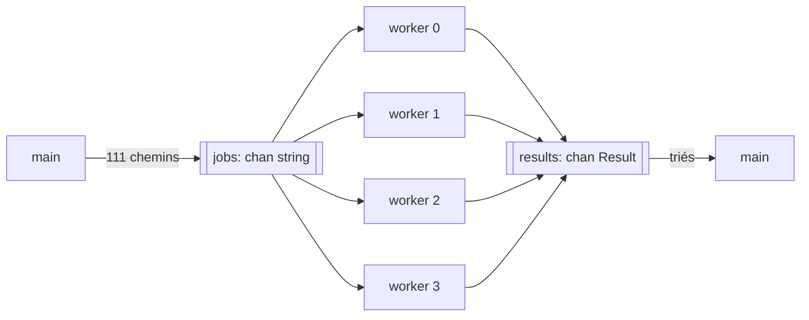

Code : [`examples/l07_spawn.v`](https://github.com/spareilleux/learn/blob/bb5c13f2e8e9b85d3a3613d2df53726465afb4ab/code/v-for-csharp-java/examples/l07_spawn.v), [`examples/l07_channels.v`](https://github.com/spareilleux/learn/blob/bb5c13f2e8e9b85d3a3613d2df53726465afb4ab/code/v-for-csharp-java/examples/l07_channels.v) et [`examples/l07_shared.v`](https://github.com/spareilleux/learn/blob/bb5c13f2e8e9b85d3a3613d2df53726465afb4ab/code/v-for-csharp-java/examples/l07_shared.v) — `v run examples/l07_channels.v` depuis `code/v-for-csharp-java`.

## Trois outils

| | C# | Java | V |
|---|---|---|---|
| Exécuter une fonction en concurrence | [`Task.Run`](https://learn.microsoft.com/dotnet/api/system.threading.tasks.task.run), sur le pool de threads | [`CompletableFuture.supplyAsync`](https://docs.oracle.com/en/java/javase/25/docs/api/java.base/java/util/concurrent/CompletableFuture.html), [threads virtuels](https://docs.oracle.com/en/java/javase/25/core/virtual-threads.html) | `spawn f()`, un thread système |
| Attendre un résultat | `await task`, `Task.WhenAll` | `future.join()` | `h.wait()`, `threads.wait()` |
| Passer des messages | [`System.Threading.Channels`](https://learn.microsoft.com/dotnet/core/extensions/channels) | [`BlockingQueue`](https://docs.oracle.com/en/java/javase/25/docs/api/java.base/java/util/concurrent/BlockingQueue.html) | `chan T`, `select` |
| Partager de la mémoire | [`lock`](https://learn.microsoft.com/dotnet/csharp/language-reference/statements/lock), [`ReaderWriterLockSlim`](https://learn.microsoft.com/dotnet/api/system.threading.readerwriterlockslim) | `synchronized`, `ReentrantReadWriteLock` | `shared`, `lock`, `rlock` |
| Oublier le verrou | compile | compile | refusé pour `shared`, compile pour une référence `mut` |

Source : [Concurrency](https://docs.vlang.io/concurrency.html).

Les exemples calculent, pour chacun des 111 projets de ga, combien de projets il référence directement ou par l'intermédiaire d'autres projets. [`reachable`](https://github.com/spareilleux/learn/blob/bb5c13f2e8e9b85d3a3613d2df53726465afb4ab/code/v-for-csharp-java/examples/l07_spawn.v#L20-L34) parcourt les références avec une pile et un ensemble, donc un projet référencé deux fois, comme `GA.Domain.Core` dans l'arbre de la leçon 6, compte une seule fois :

```v
fn (g Graph) reachable(from string) int {
	mut seen := map[string]bool{}
	mut stack := [from]
	for stack.len > 0 {
		p := stack.pop()
		for to in g.refs[p] {
			if to !in seen {
				seen[to] = true
				stack << to
			}
		}
	}
	return seen.len
}
```

:::note[Des sorties qui dépendent du minutage]
Un programme concurrent n'affiche pas toujours la même chose. Les exemples affichent ce qui dépend de la machine ou du minutage sur des lignes qui commencent par `# ` : le [`check.sh`](https://github.com/spareilleux/learn/blob/f6c34f637df430c031060cb89fb903e7c15be266/code/v-for-csharp-java/check.sh#L35-L45) du cours affiche ces lignes sans les comparer, et compare les autres sur les trois OS. Les valeurs `# ` citées plus bas viennent de ma machine (24 CPU logiques) ou des runners de la CI.
:::

## `spawn` et `wait`

`spawn` exécute un appel dans un nouveau thread, et renvoie un handle dont le `wait()` renvoie le résultat de l'appel ([`l07_spawn.v`, lignes 46-72](https://github.com/spareilleux/learn/blob/bb5c13f2e8e9b85d3a3613d2df53726465afb4ab/code/v-for-csharp-java/examples/l07_spawn.v#L46-L72)) :

```v
// Un thread, un résultat
h := spawn g.reachable('Apps/GaCli/GaCli.fsproj')
println('GaCli: ${h.wait()} projects')

// Un thread par projet : wait() renvoie les résultats dans l'ordre des threads
mut sw := time.new_stopwatch()
mut threads := []thread int{}
for p in projects {
	threads << spawn g.reachable(p)
}
counts := threads.wait()
parallel := sw.elapsed()
```

```text
111 projects, 87 with references
GaCli: 7 projects
111 results, the most: GA.Business.Core.Tests with 23
same results: true
```

`thread int` est le type d'un handle dont la fonction renvoie un `int`, comme `Task<int>`. `wait()` sur un tableau de handles les attend tous et renvoie les résultats dans l'ordre du tableau, comme `await Task.WhenAll(tasks)` : `counts[i]` correspond à `projects[i]`, quel que soit l'ordre dans lequel les threads se terminent. La fonction elle-même est ordinaire : rien de tel que `async` ne la marque.

`GA.Business.Core.Tests` référence 23 des 111 projets, directement ou non. La version parallèle est pourtant plus lente :

```text
# 111 threads: 5212 us, one thread: 439 us
```

Sur les runners de la CI, 5709 µs contre 776 µs sous Linux, 11707 µs contre 939 µs sous Windows. `spawn` crée un thread du système d'exploitation à chaque fois, et 111 threads coûtent plus que 111 parcours d'un petit graphe. `Task.Run` aurait mis les 111 appels en file sur le pool de threads .NET, et les threads virtuels de Java sont peu coûteux à créer. Avec `spawn`, crée quelques threads pour un travail qui dure, comme le fait la section suivante.

Un thread que personne n'attend peut ne pas se terminer : `main` ne l'attend pas avant de sortir. Dans un petit programme qui lance `report('GaCli')` avec spawn puis affiche `main: done`, la ligne du thread est apparue une fois sur cinq exécutions sur ma machine.

Une fonction qui renvoie un result donne un `thread !int` ; `wait()` sur le tableau renvoie alors `![]int`, et la première erreur aboutit dans `or` :

```v
mut checks := []thread !int{}
for p in ['GaCli/GaCli.fsproj', 'Apps/GaCli/GaCli.fsproj'] {
	checks << spawn find(g, p)
}
found := checks.wait() or {
	println('wait: ${err.msg()}')
	[]int{}
}
println('found: ${found}')
```

```text
wait: no references from GaCli/GaCli.fsproj
found: []
```

L'erreur d'un thread fait perdre les résultats des autres, comme `await Task.WhenAll` lève une exception quand une tâche échoue.

### `go` est `spawn`

La documentation dit que `go foo()` exécute `foo()` « dans un thread léger géré par le runtime de V ». Dans V 0.5.2, le parser transforme `go` en `spawn` sauf si le programme est compilé avec `-use-coroutines` ([`parser.v`, lignes 1391-1405](https://github.com/vlang/v/blob/7647ce1c6fad63b5578bc07883139906de74b2f8/vlib/v/parser/parser.v#L1391-L1405)), une option expérimentale. Sans elle, `go` crée aussi un thread système.

## Canaux

Un `chan T`, un canal (*channel*), passe des valeurs d'un thread à un autre, comme un `Channel<T>` en .NET ou une `BlockingQueue<T>` en Java. `chan string{cap: 111}` contient jusqu'à 111 valeurs ; `chan string{}` n'en contient aucune, et un envoi attend un receveur.

[`l07_channels.v`](https://github.com/spareilleux/learn/blob/bb5c13f2e8e9b85d3a3613d2df53726465afb4ab/code/v-for-csharp-java/examples/l07_channels.v#L40-L83) démarre quatre workers. `main` envoie les chemins des projets sur `jobs` et le ferme ; chaque worker reçoit jusqu'à ce que le canal soit fermé et vide, et envoie un `Result` sur `results` :



```v
fn worker(id int, g Graph, jobs chan string, results chan Result) {
	for {
		project := <-jobs or { break }
		results <- Result{id, project, g.reachable(project)}
	}
}
```

```v
jobs := chan string{cap: projects.len}
results := chan Result{cap: projects.len}
mut workers := []thread{}
for id in 0 .. 4 {
	workers << spawn worker(id, g, jobs, results)
}
for p in projects {
	jobs <- p
}
jobs.close()
workers.wait()
results.close()
```

`<-jobs or { break }` est la réception sur un canal fermé et vide : le bloc `or` s'exécute, comme la fin d'un `await foreach (var p in reader.ReadAllAsync())` en C#. Un canal n'a pas besoin de `mut` pour être passé à un thread.

Les résultats arrivent dans un ordre quelconque, et chaque worker traite une part différente des jobs :

```text
# results per worker: [32, 24, 28, 27]
111 results
# same order as the jobs: false
```

Donc `main` les trie, par nombre puis par chemin, avant de les afficher :

```text
23 GA.Business.Core.Tests.csproj
21 AllProjects.AppHost.csproj
21 VectorSearchBenchmark.csproj
```

Cette sortie est la même à chaque exécution et sur chaque OS. Avec quatre workers ou un seul, c'est le tri après la collecte qui la rend telle.

### `select`

`select` attend la première de plusieurs opérations sur des canaux, avec un délai d'expiration facultatif, comme le `select` de Go. .NET et Java n'ont pas d'équivalent direct ; le plus proche est `Task.WhenAny` sur plusieurs lectures.

```v
slow := chan int{}
fast := chan int{}
spawn fn (c chan int) {
	time.sleep(500 * time.millisecond)
	c <- 1
}(slow)
spawn fn (c chan int) {
	c <- 2
}(fast)
select {
	n := <-slow {
		println('# slow ${n}')
	}
	n := <-fast {
		println('select: fast ${n}')
	}
	2 * time.second {
		println('select: timeout')
	}
}
```

```text
select: fast 2
```

Les fonctions anonymes reçoivent les canaux en paramètres : une closure ne voit que les variables listées dans `[…]`, comme le montrent les snippets rejetés plus bas.

### Un canal fermé

La documentation dit qu'envoyer sur un canal fermé aboutit « à un panic à l'exécution ». V 0.5.2 ne fait pas de panic :

```v
closed := chan string{cap: 2}
closed <- 'GaApi'
closed.close()
closed <- 'GaCli'
closed <- 'GaCli' or { println('send with or: ${err.msg()}') }
println('buffered after close: ${<-closed}')
empty := <-closed
println('receive without or: "${empty}"')
println('receive with or: ${<-closed or { 'closed' }}')
```

```text
send with or: channel closed
buffered after close: GaApi
receive without or: ""
receive with or: closed
```

Le premier envoi après `close()` perd `GaCli` sans un mot : le C généré appelle `try_push_priv` et ignore son résultat ([`cgen.v`, lignes 2498-2501](https://github.com/vlang/v/blob/7647ce1c6fad63b5578bc07883139906de74b2f8/vlib/v/gen/c/cgen.v#L2498-L2501) ; [`channels.c.v`, lignes 203-206](https://github.com/vlang/v/blob/7647ce1c6fad63b5578bc07883139906de74b2f8/vlib/sync/channels.c.v#L203-L206) renvoie `.closed`). La valeur encore dans le tampon est reçue, puis une réception sans `or` renvoie la valeur zéro, une chaîne vide. Avec `or`, les deux opérations signalent la fermeture. En .NET, `TryWrite` renvoie `false` après `Complete()`, et `WriteAsync` lève une `ChannelClosedException`, ce que j'ai vérifié avec .NET 11. Utilise `or` sur les opérations d'un canal qui peut être fermé.

## `shared`, `lock` et `rlock`

Une variable déclarée `shared` porte son propre verrou lecture-écriture. Le compilateur refuse tout accès en dehors de `lock` (lecture et écriture) ou de `rlock` (lecture seule). [`count_packages`](https://github.com/spareilleux/learn/blob/bb5c13f2e8e9b85d3a3613d2df53726465afb4ab/code/v-for-csharp-java/examples/l07_shared.v#L6-L18) compte les références de paquets d'une tranche de `package_refs.csv` dans une map partagée par quatre threads :

```v
struct Usage {
mut:
	by_package map[string]int
}

fn count_packages(shared usage Usage, lines []string) {
	for line in lines {
		package := line.split(',')[1]
		lock usage {
			usage.by_package[package]++
		}
	}
}
```

```v
shared usage := Usage{}
mut threads := []thread{}
chunk := (lines.len + 3) / 4
for start := 0; start < lines.len; start += chunk {
	end := if start + chunk < lines.len { start + chunk } else { lines.len }
	threads << spawn count_packages(shared usage, lines[start..end])
}
threads.wait()
rlock usage {
	println('${usage.by_package.len} packages, ${usage.by_package['Spectre.Console']} references to Spectre.Console')
}
// rlock et lock sont aussi des expressions
counts := rlock usage {
	usage.by_package.values()
}
println('references: ${arrays.sum(counts)!}')
```

```text
136 packages, 20 references to Spectre.Console
references: 478
```

`shared` s'écrit à la déclaration, au paramètre et à l'appel. Seuls les structs, les tableaux et les maps peuvent être partagés. Sans le verrou, la fonction ne compile pas :

```v
fn count(shared usage Usage, package string) {
	usage.by_package[package]++
}
```

```text
e07_shared_without_lock.v:7:2: error: `usage` is `shared` and needs explicit lock for `v.ast.SelectorExpr`
    5 | 
    6 | fn count(shared usage Usage, package string) {
    7 |     usage.by_package[package]++
      |     ~~~~~
    8 | }
    9 |
```

Le `lock (usage) { … }` de C# et le `synchronized` de Java protègent ce que le programmeur met dedans ; un verrou oublié compile. Le message laisse fuiter un nom interne du compilateur (`v.ast.SelectorExpr`), mais la vérification est réelle. Une écriture sous `rlock` est refusée aussi :

```v
shared usage := Usage{}
rlock usage {
	usage.by_package['Spectre.Console']++
}
```

```text
e07_rlock_write.v:9:3: error: usage has an `rlock` but needs a `lock`
    7 |     shared usage := Usage{}
    8 |     rlock usage {
    9 |         usage.by_package['Spectre.Console']++
      |         ~~~~~
   10 |     }
   11 | }
e07_rlock_write.v:9:3: error: `usage` is `shared` and needs explicit lock for `v.ast.SelectorExpr`
    7 |     shared usage := Usage{}
    8 |     rlock usage {
    9 |         usage.by_package['Spectre.Console']++
      |         ~~~~~
   10 |     }
   11 | }
```

### Ce que le compilateur ne vérifie pas

`spawn` refuse un argument `mut` qui est une valeur :

```v
fn count(mut by_package map[string]int, package string) {
	by_package[package]++
}

fn main() {
	mut by_package := map[string]int{}
	h := spawn count(mut by_package, 'Spectre.Console')
	h.wait()
	println(by_package)
}
```

```text
e07_spawn_mut_value.v:7:23: error: function in `spawn` statement cannot contain mutable non-reference arguments
    5 | fn main() {
    6 |     mut by_package := map[string]int{}
    7 |     h := spawn count(mut by_package, 'Spectre.Console')
      |                          ~~~~~~~~~~
    8 |     h.wait()
    9 |     println(by_package)
```

Une référence `mut`, en revanche, passe, et huit threads peuvent alors écrire le même compteur sans verrou ([`l07_shared.v`, lignes 20-30 et 61-68](https://github.com/spareilleux/learn/blob/bb5c13f2e8e9b85d3a3613d2df53726465afb4ab/code/v-for-csharp-java/examples/l07_shared.v#L61-L68)) :

```v
fn add_unsafely(mut c Counter, times int) {
	for _ in 0 .. times {
		c.n++
	}
}
```

```v
mut racy := &Counter{}
mut racers := []thread{}
for _ in 0 .. 8 {
	racers << spawn add_unsafely(mut racy, 100_000)
}
racers.wait()
println('# without a lock: ${racy.n} of 800000')
```

```text
# without a lock: 281217 of 800000
```

Une data race : les incréments de threads différents s'écrasent les uns les autres, et le total change à chaque exécution (475721 sur le runner Linux, 409095 sur Windows, 352627 sur macOS). C# et Java compilent la même erreur. La même boucle sur un compteur `shared`, avec `lock c { c.n++ }`, donne toujours 800000 :

```text
with lock: 800000 of 800000
```

V vérifie les variables `shared`, pas la mémoire partagée d'une autre manière : une référence passée à plusieurs threads est sous ta responsabilité, comme en C# et en Java.

### Les closures capturent des copies

Une closure liste entre crochets les variables qu'elle utilise. Oublies-en une, et le compilateur refuse :

```v
fn main() {
	project := 'Apps/GaCli/GaCli.fsproj'
	h := spawn fn () {
		println(project)
	}()
	h.wait()
}
```

```text
e07_closure_capture.v:2:2: warning: unused variable: `project`
    1 | fn main() {
    2 |     project := 'Apps/GaCli/GaCli.fsproj'
      |     ~~~~~~~
    3 |     h := spawn fn () {
    4 |         println(project)
e07_closure_capture.v:4:11: error: `project` must be explicitly listed as inherited variable to be used inside a closure
    2 |     project := 'Apps/GaCli/GaCli.fsproj'
    3 |     h := spawn fn () {
    4 |         println(project)
      |                 ~~~~~~~
    5 |     }()
    6 |     h.wait()
Details: use `fn [project] () {` instead of `fn () {`
e07_closure_capture.v:4:3: error: `println` can not print void expressions
    2 |     project := 'Apps/GaCli/GaCli.fsproj'
    3 |     h := spawn fn () {
    4 |         println(project)
      |         ~~~~~~~~~~~~~~~~
    5 |     }()
    6 |     h.wait()
e07_closure_capture.v:4:11: error: undefined ident: `project`
    2 |     project := 'Apps/GaCli/GaCli.fsproj'
    3 |     h := spawn fn () {
    4 |         println(project)
      |                 ~~~~~~~
    5 |     }()
    6 |     h.wait()
```

Une capture manquante, quatre messages. La variable listée est copiée à la création de la closure, même avec `mut` :

```v
mut captured := 0
h := spawn fn [mut captured] () int {
	captured += 42
	return captured
}()
println('in the thread: ${h.wait()}, in main: ${captured}')
```

```text
in the thread: 42, in main: 0
```

Une lambda C# capture la variable elle-même : le même code avec `Task.Run(() => { captured += 42; })` affiche `in main: 42`. Java le refuse : `local variables referenced from a lambda expression must be final or effectively final`. V le compile et modifie une copie ; pour partager une valeur avec un thread, passe une référence ou une variable `shared`.

:::caution[Un bug du compilateur : une fonction anonyme dans `lock`]
V 0.5.2 accepte une fonction anonyme contenant un `return` dans un bloc `lock` ou `rlock`, puis génère du C qui ne compile pas : le `return` de la fonction anonyme libère le verrou de la fonction englobante, dont la variable n'existe pas à cet endroit. [`compiler_bugs/b07_return_in_lock.v`](https://github.com/spareilleux/learn/blob/bb5c13f2e8e9b85d3a3613d2df53726465afb4ab/code/v-for-csharp-java/compiler_bugs/b07_return_in_lock.v) le reproduit, et la CI vérifie qu'il échoue toujours avec `C error found while compiling generated C code.` Déclare la fonction avant le bloc `lock`. Par défaut, V 0.5.2 envoie ces erreurs C, avec le code C généré, à `bugs.vlang.io` (voir le [journal](../journal/)).
:::

## À retenir

- `spawn f()` démarre un thread système et renvoie un handle ; `wait()` renvoie le résultat, et sur un tableau de handles, les résultats dans l'ordre. `go` est identique à `spawn` sans `-use-coroutines`.
- Les threads coûtent cher à créer : un pool de workers alimenté par un canal convient à beaucoup de petits jobs.
- `<-ch or { }` termine une boucle quand le canal est fermé et vide ; sans `or`, un envoi sur un canal fermé est perdu et une réception renvoie la valeur zéro.
- Une variable `shared` ne peut être utilisée que dans `lock` ou `rlock`, et le compilateur le vérifie ; une référence `mut` passée à des threads n'est pas vérifiée.
- Les closures capturent des copies des variables listées, même avec `mut`.
- Pour une sortie comparable, trie ce que produisent les threads ; affiche le reste à part.

## Exercices

1. Compte les références de paquets de chaque projet de `package_refs.csv` avec un pool de `runtime.nr_cpus()` workers qui reçoivent des lignes depuis un canal et comptent dans une map `shared`, puis affiche les trois projets qui ont le plus de références.

<details>
<summary>Solution</summary>

[`examples/s07_packages.v`](https://github.com/spareilleux/learn/blob/bb5c13f2e8e9b85d3a3613d2df53726465afb4ab/code/v-for-csharp-java/examples/s07_packages.v#L10-L44) :

```v
fn worker(jobs chan string, shared counts Counts) {
	for {
		line := <-jobs or { break }
		project := line.all_before(',')
		lock counts {
			counts.by_project[project]++
		}
	}
}
```

```v
// Une copie de la map, pour que le tri n'ait pas besoin de verrou
by_project := rlock counts {
	counts.by_project.clone()
}
mut sorted := by_project.keys()
sorted.sort_with_compare(fn [by_project] (a &string, b &string) int {
	if by_project[*a] != by_project[*b] {
		return by_project[*b] - by_project[*a]
	}
	return compare_strings(*a, *b)
})
```

```text
96 projects with packages, 478 references
29 GaApi.csproj
29 GA.Business.ML.csproj
23 GA.Domain.Services.csproj
```

`rlock … { counts.by_project.clone() }` copie la map sous le verrou, et le tri a lieu en dehors. Trier à l'intérieur du `rlock` avec une closure qui capture `counts` déclenche le bug du compilateur ci-dessus. `jobs` n'a qu'une capacité de 16 : quand il est plein, `main` attend qu'un worker reçoive, ce qui borne la mémoire, comme un canal borné `Channel.CreateBounded<string>(16)`.

</details>

2. Dans `l07_spawn.v`, `threads.wait()` renvoie les nombres dans l'ordre des projets, alors que les résultats de `l07_channels.v` arrivent dans n'importe quel ordre. Pourquoi ?

<details>
<summary>Solution</summary>

`wait()` sur un tableau de handles ne renvoie pas les résultats au fur et à mesure que les threads se terminent : il attend chaque handle dans l'ordre du tableau et range son résultat au même indice. Un canal livre les valeurs dans l'ordre où elles sont envoyées, et quatre workers envoient au fur et à mesure qu'ils terminent, dans un ordre qui dépend de l'ordonnanceur. `Task.WhenAll` se comporte comme `wait()` ; lire un `Channel<T>` rempli par plusieurs producteurs se comporte comme le canal.

</details>

3. Un collègue remplace `shared usage := Usage{}` par `mut usage := &Usage{}`, le paramètre `shared` par `mut usage Usage`, et supprime le bloc `lock`. Est-ce que ça compile, et qu'est-ce que ça affiche ?

<details>
<summary>Solution</summary>

Ça compile : `spawn` accepte une référence `mut`, comme dans `add_unsafely`. Quatre threads écrivent alors la même map sans verrou, et une map fait pire que perdre des incréments. J'ai exécuté cette variante 20 fois sur ma machine : 8 exécutions ont affiché des nombres faux, de `136 packages, references: 474` à `197 packages, references: 472` (plus de paquets qu'il n'en existe) ; 4 se sont arrêtées avec `V panic: array.get: index out of range (i,a.len):1, 1` ; 8 ont planté avec `Unhandled Exception`, code de sortie 139 dans Git Bash. Aucune n'a affiché `136 packages, references: 478`. Avec `shared`, le compilateur interdit exactement cela.

</details>

## Sources

- [Documentation V — Concurrency](https://docs.vlang.io/concurrency.html) : [Spawning concurrent tasks](https://docs.vlang.io/concurrency.html#spawning-concurrent-tasks), [Channels](https://docs.vlang.io/concurrency.html#channels), [Channel select](https://docs.vlang.io/concurrency.html#channel-select), [Shared objects](https://docs.vlang.io/concurrency.html#shared-objects) ; la documentation de la 0.5.2 : [`doc/docs.md`](https://github.com/vlang/v/blob/0.5.2/doc/docs.md)
- [Bibliothèque standard V — `sync`](https://modules.vlang.io/sync.html), [`runtime`](https://modules.vlang.io/runtime.html)
- [.NET — Task-based asynchronous programming](https://learn.microsoft.com/dotnet/standard/parallel-programming/task-based-asynchronous-programming), [Channels](https://learn.microsoft.com/dotnet/core/extensions/channels), [The `lock` statement](https://learn.microsoft.com/dotnet/csharp/language-reference/statements/lock)
- [Java — Virtual threads](https://docs.oracle.com/en/java/javase/25/core/virtual-threads.html), [`CompletableFuture`](https://docs.oracle.com/en/java/javase/25/docs/api/java.base/java/util/concurrent/CompletableFuture.html), [Intrinsic locks and synchronization](https://docs.oracle.com/javase/tutorial/essential/concurrency/locksync.html)
