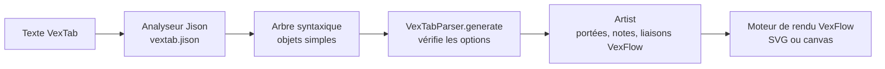

import FirstNotes from '../../../../assets/vexflow-vextab/l01-first-notes.svg';
import Notation from '../../../../assets/vexflow-vextab/l01-notation.svg';
import Durations from '../../../../assets/vexflow-vextab/l01-durations.svg';
import Overfull from '../../../../assets/vexflow-vextab/l01-overfull.svg';

[VexTab](https://github.com/0xfe/vextab) est un langage texte pour la tablature de guitare et la notation standard. Vous écrivez quelques lignes, VexTab les analyse et demande à [VexFlow](https://www.vexflow.com/) de dessiner le résultat. Cette leçon écrit les premières lignes, les suit du texte jusqu'au dessin, et finit par les erreurs que VexTab lève quand une ligne est fausse.

Chaque dessin de cette page est le SVG que VexFlow a écrit pour l'exemple qui le précède, rendu sous Node par le code du cours, pas une capture d'écran. Chaque message d'erreur est celui que VexTab a levé.

## Lancer les exemples

Le code du cours est dans [`code/vexflow-vextab`](https://github.com/spareilleux/learn/tree/20497783691a7e4f4134be79c5531ea7754934e3/code/vexflow-vextab). Il vous faut [Node.js](https://nodejs.org/) 24 et Git ; la leçon 4 demande aussi le [SDK .NET 10](https://dotnet.microsoft.com/download/dotnet/10.0). Sous Windows, lancez les commandes depuis Git Bash.

```bash
cd code/vexflow-vextab
npm ci                                            # les versions exactes de package-lock.json
bash check.sh                                     # chaque exemple, comparé à expected/
node render.cjs --out out/mine my-file.vextab     # un fichier à vous : out/mine/my-file.svg et .txt
```

`render.cjs` écrit le dessin dans `<name>.svg` et un rapport d'une ligne dans `<name>.txt` : `ok` et la taille du dessin, ou l'erreur. Avec `--ast`, il écrit aussi l'arbre syntaxique, que cette leçon examine plus bas.

## La première portée

Le plus petit texte VexTab tient en un mot, `tabstave` : une portée de tablature vide à six lignes, avec la clé `TAB`. Les notes vont sur une ligne `notes` en dessous.

```vextab
tabstave
notes 5/5 7/5 5/4 7/4
```

<FirstNotes role="img" aria-label="Une portée de tablature avec quatre notes : frette 5 puis 7 sur la corde 5, frette 5 puis 7 sur la corde 4." />

Chaque note s'écrit **`frette/corde`** : `5/5` est la frette 5 sur la corde 5, la corde de la. Les cordes sont numérotées comme les guitaristes les numérotent, 1 pour le mi aigu, 6 pour le mi grave. Gardez cet ordre en tête : la leçon 4 porte sur un programme qui l'écrit à l'envers.

Les mots `vexflow.com` sous le dessin sont le logo de VexTab, dessiné par défaut sous chaque rendu ([`ArtistRenderer.ts:261-266`](https://github.com/0xfe/vextab/blob/3a5e00d858ae98934ba545f9bef5eb923e17e402/src/artist/ArtistRenderer.ts#L261-L266)). `Artist.NOLOGO = true` le désactive ; le cours le garde, puisque c'est ce que vous obtenez.

## La notation standard au-dessus de la tablature

`notation=true` ajoute une portée de cinq lignes avec une clé de sol au-dessus de la tablature, et VexTab calcule la hauteur de chaque frette à partir de l'accordage.

```vextab
tabstave notation=true
notes :q 4/5 5/5 7/5 | :h 5/4 7/4
```

<Notation role="img" aria-label="Une portée de notation au-dessus d'une portée de tablature. Première mesure : do dièse, ré, mi en noires, aux frettes 4, 5 et 7 de la corde 5. Deuxième mesure : sol et la en blanches, aux frettes 5 et 7 de la corde 4." />

La frette 4 de la corde de la donne do♯, la frette 5 ré, la frette 7 mi. Les notes sont au milieu de la portée en clé de sol, une octave plus haut qu'elles ne sonnent : la musique pour guitare s'écrit une octave au-dessus de sa hauteur réelle pour tenir en clé de sol ([Théorie musicale pour GA, leçon 1](../../music-theory-ga/01-notes-and-the-fretboard/) passe en revue les hauteurs et les octaves). L'accordage par défaut de VexTab le dit à sa façon : `E/5, B/4, G/4, D/4, A/3, E/3`, une octave au-dessus du mi4 au mi2 qui sonnent.

`tablature=false` ne garde que la notation. Les notes s'écrivent alors **`nom/octave`**, et un tiret enchaîne des notes de la même octave :

```vextab
tabstave notation=true tablature=false
notes :q C-D-E-F/4 | :h G/4 C/5
```

Les altérations sont `#` pour le dièse, `##` pour le double dièse, `n` pour le bécarre, et `@` et `@@` pour le bémol et le double bémol ([`vextab.jison:432-437`](https://github.com/0xfe/vextab/blob/3a5e00d858ae98934ba545f9bef5eb923e17e402/src/vextab.jison#L432-L437)). Pas `b` : dans une ligne `notes`, `b` est un bend (leçon 2). `B@/4` est un si bémol ; `Bb/4` est une erreur.

## Durées et barres de mesure

Une durée commence par deux-points et reste en vigueur jusqu'à la suivante : `:w` ronde, `:h` blanche, `:q` noire (la valeur par défaut), `:8`, `:16` et `:32`. Un `d` après elle ajoute un point, `:qd`. Un `|` trace une barre de mesure.

```vextab
tabstave notation=true
notes :w 5/5 | :h 5/5 7/5 | :q 5/5 7/5 5/4 7/4 | :8 5/5 7/5 5/4 7/4 :q 5/3 7/3
```

<Durations role="img" aria-label="Quatre mesures : une ronde, deux blanches, quatre noires, puis quatre croches ligaturées par deux et deux noires." />

VexFlow ligature les croches de lui-même, par deux, et répartit chaque mesure sur la largeur dont elle dispose. Ce qu'il ne fait pas, c'est compter. Cinq noires dans une mesure à 4/4 sont dessinées sans un mot :

```vextab
tabstave notation=true time=4/4
notes :q 5/5 7/5 5/4 7/4 5/3 | :h 7/3
```

<Overfull role="img" aria-label="Une mesure à 4/4 qui contient cinq noires, suivie d'une mesure avec une seule blanche. Rien ne signale le temps en trop." />

VexTab construit ses voix dans le mode `SOFT` de VexFlow ([`ArtistRenderer.ts:67`](https://github.com/0xfe/vextab/blob/3a5e00d858ae98934ba545f9bef5eb923e17e402/src/artist/ArtistRenderer.ts#L67)), qui accepte n'importe quel nombre de temps. Une voix en mode `STRICT` lèverait une exception à la place ; la leçon 5 en construit une à la main.

Une suite de frettes sur une même corde s'écrit avec des tirets, comme les notes d'une même octave : `5-7-9/3` donne les frettes 5, 7 et 9 sur la corde 3. `##` est un silence.

## Du texte au dessin

VexTab est un petit compilateur. Sa grammaire, [`src/vextab.jison`](https://github.com/0xfe/vextab/blob/3a5e00d858ae98934ba545f9bef5eb923e17e402/src/vextab.jison), est une grammaire LALR(1) pour [Jison](https://gerhobbelt.github.io/jison/), un générateur d'analyseurs pour JavaScript de la famille de yacc et bison. L'analyseur renvoie un arbre d'objets simples ; le `VexTabParser` de VexTab le parcourt et appelle un **Artist**, qui construit des objets VexFlow ; l'Artist les dessine ensuite avec un moteur de rendu VexFlow.



Pour un développeur C# ou Java, c'est un DSL compilé en appels sur une API objet, comme une vue Razor compilée en C# qui écrit du HTML, à une différence près : rien n'est généré sous forme de code source ; l'arbre est interprété directement.

`node render.cjs --ast` enregistre l'arbre. Pour l'exemple de notation ci-dessus ([`expected/ast/l01-notation.ast.json`](https://github.com/spareilleux/learn/blob/20497783691a7e4f4134be79c5531ea7754934e3/code/vexflow-vextab/expected/ast/l01-notation.ast.json)), raccourci :

```json
[
  {
    "element": "tabstave",
    "options": [{ "key": "notation", "value": "true", "_l": 1, "_c": 9 }],
    "notes": [
      { "time": "q", "dot": false },
      { "fret": "4", "_l": 2, "_c": 9, "decorator": null, "string": "5" },
      { "fret": "5", "_l": 2, "_c": 13, "decorator": null, "string": "5" },
      { "fret": "7", "_l": 2, "_c": 17, "decorator": null, "string": "5" },
      { "command": "bar", "type": "single", "_l": 2, "_c": 21 },
      { "time": "h", "dot": false },
      { "fret": "5", "_l": 2, "_c": 26, "decorator": null, "string": "4" },
      { "fret": "7", "_l": 2, "_c": 30, "decorator": null, "string": "4" }
    ],
    "text": [],
    "_l": 1,
    "_c": 0
  }
]
```

Trois choses à remarquer. Une durée est un élément de la liste, comme une note, et c'est pourquoi elle s'applique à ce qui suit. Chaque valeur est une chaîne, `"4"`, `"true"` : rien n'est converti avant que `VexTabParser` lise les options, et la leçon 3 trouve un endroit où rien n'est converti du tout. `_l` et `_c` sont la ligne et la colonne, gardées pour les messages d'erreur.

Le point d'entrée est court ([`VexTab.ts:68-95`](https://github.com/0xfe/vextab/blob/3a5e00d858ae98934ba545f9bef5eb923e17e402/src/vextab/VexTab.ts#L68-L95)) : nettoyer chaque ligne, analyser, puis `this.compiler.generate(this.elements)`. Le [`render.cjs`](https://github.com/spareilleux/learn/blob/20497783691a7e4f4134be79c5531ea7754934e3/code/vexflow-vextab/render.cjs#L25-L34) du cours l'appelle comme le ferait une page web :

```js
const div = document.createElement('div');
const renderer = new Vex.Flow.Renderer(div, Vex.Flow.Renderer.Backends.SVG);
const artist = new Artist(10, 10, width);   // x, y, largeur du dessin
const vextab = new VexTab(artist);
const elements = vextab.parse(code);        // l'arbre ci-dessus ; lève une exception en cas d'erreur
artist.render(renderer);                    // VexFlow dessine dans le div
```

## Quel VexFlow ?

Le paquet `vextab` sur npm n'est pas une fine couche au-dessus d'un VexFlow installé à côté. Son `dist/main.prod.js`, 1,2 Mo, est un bundle webpack qui contient son propre VexFlow ; dans la copie du cours, `Vex.Flow.BUILD` indique `VERSION: '5.0.0'` et `ID: '0ca6f889…'`, le commit de VexFlow à partir duquel il a été construit. VexTab 4.0.5 recrée l'espace de noms `Vex.Flow` de VexFlow 4 au-dessus de VexFlow 5 pour que son ancien code continue de fonctionner ([`src/vexflow.ts`](https://github.com/0xfe/vextab/blob/3a5e00d858ae98934ba545f9bef5eb923e17e402/src/vexflow.ts#L1-L21)).

Deux conséquences. D'abord, `npm install vexflow@4` à côté de `vextab@4.0.5` ne fait pas dessiner VexTab avec VexFlow 4 : le bundle l'ignore. Ensuite, le `Vex` exporté par `vextab` est ce VexFlow embarqué ; le cours l'utilise, et n'installe le paquet `vexflow` 5.0.0 séparé que pour le second lot.

GA se trouve de l'autre côté de cette ligne : ses composants React demandent `vexflow ^4.2.5` ([`package.json:67`](https://github.com/GuitarAlchemist/ga/blob/17ccee6885851e4b460ebd14d7f4cfb838f5541e/ReactComponents/ga-react-components/package.json#L67)), et la racine web du chatbot livre une copie dont l'en-tête dit `VexFlow 4.2.5 2024-05-12` ([`vexflow.js:2`](https://github.com/GuitarAlchemist/ga/blob/17ccee6885851e4b460ebd14d7f4cfb838f5541e/Apps/GaChatbot.Api/wwwroot/vendor/vexflow/vexflow.js#L2)). La leçon 8 porte sur cet écart.

## Rendre sans navigateur

VexFlow dessine dans un élément SVG ; sous Node, il lui faut donc un DOM : [jsdom](https://github.com/jsdom/jsdom) en fournit un. Il doit aussi mesurer du texte. VexFlow 5 dessine chaque symbole musical comme un caractère de la police [Bravura](https://github.com/steinbergmedia/bravura) (une clé est U+E050, une tête de note noire U+E0A4, selon [SMuFL](https://w3c.github.io/smufl/latest/)), et il met en page une mesure à partir de la largeur et de la hauteur de ces caractères, qu'il demande à un `<canvas>` ([`element.ts:607-622`](https://github.com/vexflow/vexflow/blob/0ca6f889545c33cce851b420c24945f6eb685aeb/src/element.ts#L607-L622)). jsdom n'a pas de canvas. Le paquet [`canvas`](https://www.npmjs.com/package/canvas), qu'utilisent les outils de test de VexFlow sous Node, n'a pas pu charger le fichier OpenType de Bravura sous Windows : chaque glyphe retombait sur une police système.

VexFlow a un point d'accroche public pour cela, `Element.setTextMeasurementCanvas()` ([`element.ts:96`](https://github.com/vexflow/vexflow/blob/0ca6f889545c33cce851b420c24945f6eb685aeb/src/element.ts#L96)). Le cours lui donne un objet dont la méthode `measureText()` lit les chasses et les contours des glyphes de Bravura et d'Academico avec [opentype.js](https://opentype.js.org/) ([`lib/env.cjs`](https://github.com/spareilleux/learn/blob/20497783691a7e4f4134be79c5531ea7754934e3/code/vexflow-vextab/lib/env.cjs)). C'est du JavaScript pur, donc les trois systèmes d'exploitation de la CI mettent chaque exemple en page à l'identique, et `check.sh` peut comparer les SVG octet par octet après avoir arrondi les coordonnées à deux décimales et renuméroté les identifiants `vf-auto…` de VexFlow.

Cette mise en page est-elle celle que dessine le navigateur d'un lecteur ? J'ai écrit quatre hypothèses avant de mesurer ([`results/hypotheses.md`](https://github.com/spareilleux/learn/blob/284eb7e/code/vexflow-vextab/results/hypotheses.md)), puis rendu cinq exemples avec le bundle navigateur de VexTab lui-même dans Chrome 153. Le plus grand écart entre Chrome et le rendu sans navigateur, sur 157 éléments de texte, est de 0,74 px en largeur et de 0,67 px en hauteur ([`results/browser-2026-09-24.txt`](https://github.com/spareilleux/learn/blob/20497783691a7e4f4134be79c5531ea7754934e3/code/vexflow-vextab/results/browser-2026-09-24.txt)). Le premier essai disait 204 px : ma page de test n'avait pas de `<meta charset="utf-8">`, Chrome a lu le bundle en Windows-1252, et chaque caractère de Bravura est devenu deux caractères latins. Le [journal](../journal/) garde les deux essais.

## Quand VexTab dit non

Deux sortes d'erreurs sortent de `parse`. Une erreur de **syntaxe** vient de Jison et nomme les jetons qu'il attendait :

```vextab
tabstaff notation=true
notes 5/5
```

```text
error Error: Parse error on line 1:
tabstaff notation=tr
^
Expecting 'EOF', 'OPTIONS', 'TABSTAVE', 'STAVE', 'VOICE', got 'WORD'
```

```vextab
tabstave
notes 5/5 7
```

```text
error Error: Parse error on line 2:
...abstavenotes 5/5 7
---------------------^
Expecting '/', 'h', 'd', '-', 's', 't', 'T', 'b', 'p', 'v', 'V', 'u', got 'EOF'
```

Le second message montre `...abstavenotes` : Jison affiche le texte qui précède l'erreur sans ses retours à la ligne. Une frette sans corde peut encore être suivie d'une technique, d'où la liste de ce qu'il attendait.

Une erreur **sémantique** vient de `VexTabParser`, qui vérifie les options après l'analyse, et donne une ligne et une colonne ([`VexTabParser.ts:39-99`](https://github.com/0xfe/vextab/blob/3a5e00d858ae98934ba545f9bef5eb923e17e402/src/vextab/VexTabParser.ts#L39-L99)) :

```vextab
tabstave notation=yes
notes 5/5
```

```text
error ParseError: [RuntimeError] ParseError: 'notation' must be 'true' or 'false' in line 1 column 9
```

```vextab
tabstave notation=false tablature=false
notes 5/5
```

```text
error ParseError: [RuntimeError] ParseError: Both 'notation' and 'tablature' can't be invisible in line 1 column 24
```

Le premier `error …:` est le rapport du cours, `e.code` ou `e.name` suivi de `e.message` ; le reste est le message de VexTab. Les six messages de la leçon sont dans [`expected/ex/`](https://github.com/spareilleux/learn/tree/20497783691a7e4f4134be79c5531ea7754934e3/code/vexflow-vextab/expected/ex).

## À retenir

- Un texte VexTab est une liste de blocs `tabstave`, chacun suivi de lignes `notes` et `text`. Les notes s'écrivent `frette/corde` en tablature et `nom/octave` en notation, et un bémol s'écrit `@`.
- Une durée est un élément de la liste des notes : elle s'applique jusqu'à la suivante. Les mesures ne sont pas comptées.
- VexTab analyse avec une grammaire Jison vers un arbre de chaînes, vérifie les options, puis pilote VexFlow par son Artist.
- Le paquet npm `vextab` embarque son propre VexFlow 5.0.0.
- Sous Node, VexFlow a besoin d'un DOM et d'un moyen de mesurer Bravura ; mesurée avec opentype.js, la mise en page est à 0,74 px près celle de Chrome.

## Exercices

1. Écrivez la gamme pentatonique mineure de la en cinquième position, en montant de la frette 5 de la corde 6 à la frette 5 de la corde 1, en croches, avec la notation, en deux mesures à 4/4 terminées par une blanche.

<details>
<summary>Solution</summary>

```vextab
tabstave notation=true time=4/4
notes :8 5-8/6 5-7/5 5-7/4 5-7/3 | :8 5-8/2 5-8/1 :h 5/1
```

Huit croches remplissent la première mesure ; quatre croches et une blanche remplissent la seconde. `check.sh` la rend sous le nom [`l01-ex-pentatonic`](https://github.com/spareilleux/learn/blob/20497783691a7e4f4134be79c5531ea7754934e3/code/vexflow-vextab/expected/ex/l01-ex-pentatonic.svg). VexTab l'aurait dessinée tout aussi bien avec un temps en moins : compter, c'est votre travail.

</details>

2. Prédisez ce que VexTab dit de `notes 12/7` sous un simple `tabstave`, puis vérifiez avec `render.cjs`.

<details>
<summary>Solution</summary>

La grammaire accepte n'importe quel nombre comme corde, donc le texte s'analyse. L'erreur vient plus tard, de l'accordage de VexFlow, quand l'Artist demande la hauteur de la corde 7 d'une guitare à six cordes :

```text
error BadArguments: [RuntimeError] BadArguments: String number must be between 1 and 6:7
```

</details>

3. Dans l'arbre syntaxique de `notes :8 5-7-9/3`, la deuxième et la troisième note portent `"articulation": "-"` et la première non. Pourquoi ?

<details>
<summary>Solution</summary>

La grammaire traite le tiret comme le plus simple des liens entre deux frettes d'une même corde, à côté de `h`, `p`, `s`, `b` et `t` ([`vextab.jison:383-392`](https://github.com/0xfe/vextab/blob/3a5e00d858ae98934ba545f9bef5eb923e17e402/src/vextab.jison#L383-L392)). Chaque frette après la première enregistre le lien qui y a mené ; `-` signifie « pas de technique ». L'arbre est dans [`expected/ast/l01-fret-run.ast.json`](https://github.com/spareilleux/learn/blob/20497783691a7e4f4134be79c5531ea7754934e3/code/vexflow-vextab/expected/ast/l01-fret-run.ast.json).

</details>

## Sources

- Mohit Cheppudira, [The VexTab Tutorial](https://vexflow.com/vextab/tutorial.html), étapes 1 à 4 et 9.
- [`src/vextab.jison`](https://github.com/0xfe/vextab/blob/3a5e00d858ae98934ba545f9bef5eb923e17e402/src/vextab.jison) et [`src/vextab/VexTab.ts`](https://github.com/0xfe/vextab/blob/3a5e00d858ae98934ba545f9bef5eb923e17e402/src/vextab/VexTab.ts) à `3a5e00d`, identiques aux fichiers du paquet npm 4.0.5.
- VexFlow [`src/element.ts`](https://github.com/vexflow/vexflow/blob/0ca6f889545c33cce851b420c24945f6eb685aeb/src/element.ts) à `0ca6f88`, et son propre générateur d'images sous jsdom, [`tools/generate_images_jsdom.js`](https://github.com/vexflow/vexflow/blob/0ca6f889545c33cce851b420c24945f6eb685aeb/tools/generate_images_jsdom.js).
- [Jison](https://gerhobbelt.github.io/jison/docs/), le générateur d'analyseurs.
