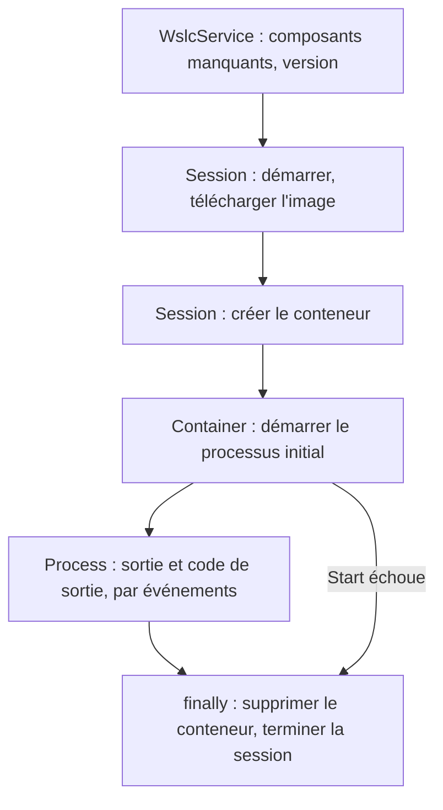

## Comparaison

| Critère | `wslc` (WSL containers) | Docker Desktop |
|---|---|---|
| Installation | incluse dans WSL ≥ 2.9.3 | produit séparé |
| Maturité (sept. 2026) | préversion publique | stable |
| CLI | proche de Docker | `docker` |
| API pour applications Windows | oui — NuGet `Microsoft.WSL.Containers` | API Docker Engine (HTTP) |
| Gestion en entreprise | Microsoft Defender for Endpoint, Intune | Docker Business |
| Écosystème (Compose, Kubernetes, extensions, interface graphique) | aucun en 2.9.11 : pas de commande `compose`, pas de Kubernetes (k3s ne démarre pas), pas d'extensions, pas de page conteneurs dans WSL Settings | complet |

:::note[Vérifié : pas de Compose dans `wslc` 2.9.11]
`wslc compose` → `Unrecognized command: 'compose'`, et `docker compose` ne peut pas atteindre le moteur Docker de la session. Une petite pile se reproduit avec un script (`network create`, `volume create`, `run --network --network-alias`) ; la traduction testée d'un `compose.yaml` est dans le [journal](../journal/).
:::

:::note[Vérifié : les images ne sont pas partagées]
Après `docker pull busybox`, `wslc image list` ne l'affiche pas : chaque outil a son propre stock (`docker_data.vhdx` pour Docker, un `storage.vhdx` par session `wslc`). Une image utilisée par les deux est téléchargée deux fois, et le même tag `latest` peut même désigner deux versions différentes (qdrant 1.16.3 dans Docker, 1.19.1 dans `wslc`). Détails dans le [journal](../journal/).
:::

## Quand choisir quoi

- **`wslc`** : besoin simple (lancer une base de données, un service, un outil), envie de ne pas dépendre de Docker Desktop, ou application Windows qui doit piloter des conteneurs.
- **Docker Desktop** : projets basés sur Docker Compose, Kubernetes local, équipe déjà outillée autour de Docker.
- **Les deux** : possible, mais chaque outil garde sa propre VM et sa propre mémoire. Sur une machine chargée, c'est un coût réel (voir le [journal](../journal/)).

## L'API WSL container

Une application Windows peut créer ses propres conteneurs Linux. Les objets suivent le cycle de vie :

| Objet | Rôle |
|---|---|
| `WslcService` | vérifier que les composants WSL sont installés, version du service |
| `Session` | hôte WSL qui gère les images et crée les conteneurs |
| `Container` | démarrer, arrêter, inspecter, supprimer ; lancer des processus |
| `Process` | lire `stdout`/`stderr`, écrire sur `stdin`, envoyer des signaux |

Le paquet [`Microsoft.WSL.Containers`](https://www.nuget.org/packages/Microsoft.WSL.Containers) 2.9.9 est une projection [C#/WinRT](https://learn.microsoft.com/windows/apps/develop/platform/csharp-winrt/) compilée contre le SDK Windows 10.0.26100, avec une DLL native pour x64 et arm64 seulement. Le projet doit l'indiquer, sinon la compilation échoue avec `CS1705` :

```xml
<PropertyGroup>
  <OutputType>Exe</OutputType>
  <TargetFramework>net10.0-windows10.0.26100.0</TargetFramework>
  <WindowsSdkPackageVersion>10.0.26100.80</WindowsSdkPackageVersion>
  <RuntimeIdentifier>win-x64</RuntimeIdentifier>
</PropertyGroup>
<ItemGroup>
  <PackageReference Include="Microsoft.WSL.Containers" Version="2.9.9" />
</ItemGroup>
```

```csharp
using System.Text;
using Microsoft.WSL.Containers;

var missing = WslcService.GetMissingComponents();
if (missing.Count > 0)
{
    Console.WriteLine($"Missing WSL components: {string.Join(", ", missing)} (run wsl --install)");
    return 1;
}
var version = WslcService.GetVersion();
Console.WriteLine($"WSL container service {version.Major}.{version.Minor}.{version.Revision}");

// La session garde ses images et conteneurs dans son propre storage.vhdx.
var storage = Path.Combine(Environment.GetFolderPath(Environment.SpecialFolder.LocalApplicationData), "WslcHost");
using var session = new Session(new SessionSettings("wslc-host", storage)
{
    CpuCount = 2,
    MemorySizeInMB = 2048
});
session.Start();
Console.WriteLine($"Session started, storage in {storage}");

await session.PullImageAsync(new PullImageOptions("docker.io/library/alpine:latest"));
foreach (var image in session.GetImages())
    Console.WriteLine($"Image {image.Name} ({image.Size / 1024 / 1024} MB)");

using var container = session.CreateContainer(new ContainerSettings("alpine:latest")
{
    Name = "wslc-host-hello",
    InitProcess = new ProcessSettings
    {
        CommandLine = ["/bin/sh", "-c", "echo Hello from $(cat /etc/alpine-release) on $(uname -r)"],
        OutputMode = ProcessOutputMode.Event
    }
});

try
{
    var exited = new TaskCompletionSource<int>();
    container.InitProcess.OutputReceived += data => Console.Write(Encoding.UTF8.GetString(data));
    container.InitProcess.Exited += code => exited.TrySetResult(code);
    container.Start();

    var exitCode = await exited.Task.WaitAsync(TimeSpan.FromMinutes(2));
    Console.WriteLine($"Container {container.Id[..12]} exited with code {exitCode}");
    return exitCode;
}
finally
{
    // Sans cela, un Start en échec laisse le conteneur dans storage.vhdx et bloque son nom.
    container.Delete(DeleteContainerOption.Force);
    session.Terminate();
}
```

```text
WSL container service 2.9.11
Session started, storage in C:\Users\spare\AppData\Local\WslcHost
Image alpine:latest (8 MB)
Hello from 3.24.1 on 6.18.40.1-microsoft-standard-WSL2
Container 2b900903f6c8 exited with code 0
```

Le programme utilise les quatre objets dans l'ordre, et son bloc finally nettoie même quand le conteneur ne démarre pas.



Le programme complet, qui supprime aussi un conteneur laissé par une exécution plantée, est dans [`code/wsl-containers/wslc-host`](https://github.com/spareilleux/learn/tree/main/code/wsl-containers/wslc-host).

:::caution[Pas de réseau par défaut]
Un conteneur créé par l'API reçoit `NetworkMode: none` : aucune interface à part `lo`, pas d'accès à internet, contrairement à `wslc run`. Renseigner `NetworkingMode = ContainerNetworkingMode.Bridged` dans `ContainerSettings` pour un service qui appelle l'extérieur ou publie des ports.
:::

Le paquet sait aussi construire ta propre image pendant `dotnet build` : un élément `WslcImage` lance `wslc image build` et `wslc image save`, et le programme charge le `.tar` dans sa session avec `LoadImageAsync` (pas `ImportImageAsync`, qui attend un système de fichiers à plat). Montage testé et sorties dans le [journal](../journal/).

:::caution[Les extraits de Microsoft Learn ne compilent pas avec la 2.9.9]
La page utilise `ComponentFlags`, `MemoryMB`, `CmdLine` et `DeleteContainerFlags`. Dans le paquet 2.9.9, ce sont `IReadOnlyList<Component>`, `MemorySizeInMB`, `CommandLine` et `DeleteContainerOption`. Détails dans le [journal](../journal/).
:::

## À retenir

- `wslc` = conteneurs natifs WSL, sans produit tiers, encore en préversion.
- Docker Desktop reste plus complet (Compose, Kubernetes, interface graphique).
- L'API `Microsoft.WSL.Containers` ouvre un usage que Docker Desktop ne couvre pas directement : des applications Windows qui embarquent des conteneurs Linux.

## Exercice

Choisis un service que tu lances aujourd'hui avec Docker (par exemple [qdrant](https://qdrant.tech/) ou [MongoDB](https://www.mongodb.com/)) et fais-le tourner avec `wslc`. Note dans le [journal](../journal/) ce qui diffère.

<details>
<summary>Piste</summary>

Si Docker publie déjà qdrant sur 6333, choisis **un autre port Windows** : `wslc` prendrait 6333 sans aucune erreur et enlèverait discrètement `127.0.0.1:6333` au conteneur Docker.

```powershell
wslc volume create qdrant-data
wslc run -d --name qdrant -p 16333:6333 -v qdrant-data:/qdrant/storage qdrant/qdrant
curl.exe http://127.0.0.1:16333/
wslc container stop qdrant
```

Points à observer : l'image est-elle retéléchargée ? Est-ce la même version que le `latest` de Docker ? Quelle mémoire consomme la VM ? Que journalise qdrant si tu montes un dossier Windows au lieu d'un volume ? Réponses dans le [journal](../journal/).

</details>

## Sources

- [WSL container — Microsoft Learn](https://learn.microsoft.com/windows/wsl/wsl-container)
- [Référence de l'API WSL container](https://wsl.dev/api-reference/), et les exemples complets sur [aka.ms/wslc-samples](https://aka.ms/wslc-samples)
- [`Microsoft.WSL.Containers` — NuGet](https://www.nuget.org/packages/Microsoft.WSL.Containers)
- [C#/WinRT — Microsoft Learn](https://learn.microsoft.com/windows/apps/develop/platform/csharp-winrt/)
