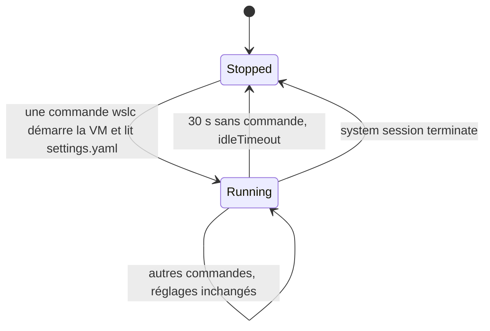

Un développeur Java sait que `-Xmx` plafonne le tas et que la JVM ne prend la mémoire qu'au fur et à mesure de ses besoins. Un développeur .NET sait que le ramasse-miettes lit la limite mémoire du conteneur. Les utilisateurs de Docker Desktop avec le backend WSL 2 connaissent l'autre niveau : la mémoire et les processeurs de toute la VM Linux, réglés dans `.wslconfig`. Sur une machine qui fait aussi tourner un IDE, un navigateur et quelques services, c'est cette limite au niveau de la VM qui garde Windows réactif.

`wslc` a les deux mêmes niveaux : une limite pour la **VM de session**, et des limites facultatives par **conteneur**. Cette leçon règle les deux, mesure ce qu'un conteneur et Windows voient réellement, puis s'intéresse à la troisième ressource qu'on oublie jusqu'à ce que le disque soit plein : le disque virtuel de la session. Les mesures viennent du [journal](../journal/), sauf les limites par conteneur, mesurées pour cette leçon avec `wslc` 2.9.11.

## Pourquoi c'est important sur une machine chargée

Le journal commence par un incident. Avec Docker Desktop et son Kubernetes, Podman, ollama et quelques processus rust-analyzer en même temps, Docker Desktop a planté trois fois en quelques minutes, et `wsl -l -v` lui-même échouait :

```text
Not enough memory resources are available to complete this operation.
Error code: Wsl/0x8007000e
```

La machine avait 97 Go de mémoire engagée sur 132 Go. Chaque outil de conteneurs fait tourner sa propre VM, et chaque VM prend de la mémoire à Windows. `wslc` ajoute une VM par session, donc ses limites méritent la même attention.

## Le `settings.yaml` de la session

`wslc settings` crée `%LocalAppData%\wslc\settings.yaml` la première fois, avec tous les réglages commentés, et l'ouvre dans l'éditeur par défaut. La partie sur les ressources :

```yaml
session:
  # Number of virtual CPUs allocated to the session (e.g. 4 default: all available CPUs)
  # cpuCount: default

  # Memory limit for the session (e.g. 2GB default: half of available memory)
  # memorySize: default
```

Le même fichier contient quelques autres réglages de session, décrits dans le fichier lui-même et sur [aka.ms/wslc-settings](https://aka.ms/wslc-settings) :

| Réglage | Par défaut | Rôle |
|---|---|---|
| `cpuCount` | tous les CPU logiques | processeurs virtuels de la VM de session |
| `memorySize` | la moitié de la RAM | plafond mémoire de la VM de session |
| `maxStorageSize` | 1 To | taille maximale du disque virtuel de la session |
| `storagePath` | sous `%LocalAppData%\wslc` | où est créé `wslc\sessions\<session>\storage.vhdx` |
| `defaultBindingAddress` | `127.0.0.1` | adresse utilisée par `-p` quand tu n'en donnes pas |
| `hostLoopback` | voir le fichier | le nom `host.wslc.internal`, pour joindre Windows depuis un conteneur |
| `idleTimeout` | 30 s | durée pendant laquelle une VM de session inactive reste allumée |

Une application Windows qui pilote des conteneurs par l'API règle les mêmes limites dans le code, avec `SessionSettings.CpuCount` et `SessionSettings.MemorySizeInMB` ([leçon 9](../09-csharp-api/)).

## Mesurer ce que voit un conteneur

L'hôte a 24 CPU logiques et 63,7 Go de RAM. Un conteneur Alpine jetable affiche le nombre de processeurs et la mémoire :

```powershell
wslc run --rm alpine sh -c "echo nproc=`$(nproc); free -m"
```

L'accent grave devant le signe dollar empêche PowerShell d'évaluer lui-même la substitution de commande dans une chaîne entre guillemets doubles, pour que `sh` la reçoive. Avec des guillemets simples, comme dans les commandes plus bas, PowerShell n'interprète rien et aucun accent grave n'est nécessaire.

| Réglages | `nproc` | RAM (`free -m`) | Swap |
|---|---|---|---|
| par défaut | 24 | 31946 Mo | 32617 Mo |
| `cpuCount: 4`, `memorySize: 4GB` | 4 | 3919 Mo | 4096 Mo |

Avec les réglages par défaut, le conteneur voit tous les processeurs et la moitié de la RAM. Avec les limites, il voit exactement ce qui a été donné à la VM, et le swap suit `memorySize`.

## Piège : une session en cours garde ses anciens réglages

La première mesure après modification du fichier affichait toujours 24 CPU. Les réglages sont lus au démarrage de la VM de session, donc il faut terminer la session ; la commande `wslc` suivante en démarre une nouvelle avec les nouvelles valeurs :

```powershell
wslc --session wslc-cli-spare system session terminate
```

Le nom de la session se donne dans l'option globale `--session`, **avant** la sous-commande. Donné en argument, comme dans `wslc system session terminate wslc-cli-spare`, il échoue avec `Found a positional argument when none was expected`.

Quatre gigaoctets se sont révélés trop justes pour la suite du cours, qui fait tourner qdrant. Le réglage retenu sur cette machine est `cpuCount: 8` et `memorySize: 16GB`, et un conteneur indique alors `nproc=8`, 15996 Mo de RAM et 16384 Mo de swap. C'est de là que vient la limite de 15,62 Gio affichée par `wslc stats` dans la [leçon 3](../03-first-containers/).

La VM de session passe par quelques états, et un seul d'entre eux lit le fichier de réglages.



### La session administrateur lit le même fichier

Dans un terminal administrateur, `wslc info` affiche le même `Settings file: C:\Users\spare\AppData\Local\wslc\settings.yaml`. Après avoir terminé la session admin, ses conteneurs voient les mêmes limites :

```text
> wslc --session wslc-cli-admin-spare system session terminate
> wslc run --rm alpine sh -c 'echo nproc=$(nproc); free -m'
nproc=8
Mem:          15996 ...
Swap:         16384 ...
```

Les limites s'appliquent **par session** : une session non élevée et une session administrateur qui tournent en même temps peuvent chacune utiliser jusqu'à 16 Go.

## Limites par conteneur

`wslc run --help` liste les mêmes options par conteneur que `docker run`, parmi lesquelles `--cpus` (« Number of CPUs (e.g. 0.5, 1, 2.5) ») et `-m`, `--memory` (« Memory limit (e.g. 512M, 1G) »). Elles ne changent pas la VM : elles règlent le groupe de contrôle Linux du conteneur. Mesure avec la session à 8 CPU et 16 Go :

```powershell
wslc run --rm --memory 512M --cpus 1.5 alpine sh -c 'echo nproc=$(nproc); cat /sys/fs/cgroup/memory.max /sys/fs/cgroup/cpu.max; free -m'
```

```text
wsl: Your kernel does not support swap limit capabilities or the cgroup is not mounted. Memory limited without swap.
nproc=8
536870912
150000 100000
              total        used        free      shared  buff/cache   available
Mem:          15996         278       15439           3         280       15527
Swap:         16384           0       16384
```

- `memory.max` vaut 536870912 octets, exactement 512 Mio, et `cpu.max` autorise 150000 microsecondes de temps CPU par tranche de 100000 : 1,5 processeur.
- `nproc` et `free` indiquent toujours les 8 CPU et les 16 Go **de la VM**. Ils ne lisent pas le groupe de contrôle. Un runtime qui se dimensionne d'après eux surestimerait ce qu'il peut utiliser ; les runtimes .NET et Java récents lisent plutôt les limites du groupe de contrôle, *à vérifier* pour la version du runtime que tu livres.
- L'avertissement indique que, dans ce noyau, la limite mémoire ne couvre pas le swap.

## La VM côté Windows

Sous Windows, chaque VM de session est un processus nommé `vmmem` suivi du nom de la session : `vmmemwslc-cli-spare` pour la session non élevée, `vmmemwslc-cli-admin-spare` pour la session administrateur. `hcsdiag list`, depuis un terminal administrateur, la montre comme une VM `Running` portant le nom de la session. Ses chiffres mémoire, le working set et la mémoire privée que rapporte `Get-Process`, ne sont lisibles que depuis un terminal élevé.

Le test : un conteneur qui occupe 6 Go pendant deux minutes, dans la session non élevée.

```powershell
wslc run -d --name memtest alpine sh -c 'apk add -q stress-ng && stress-ng --vm 1 --vm-bytes 6G --vm-hang 0 --timeout 120s'
```

| Moment | Processus VM | Working set | Mémoire privée |
|---|---|---|---|
| session inactive (admin, rien ne tourne) | `vmmemwslc-cli-admin-spare` | 921 Mo | 970 Mo |
| 6 Go occupés dans le conteneur | `vmmemwslc-cli-spare` | 7069 Mo | 7083 Mo |
| 10 s après `container stop` + `remove` | `vmmemwslc-cli-spare` | 2776 Mo | 7084 Mo |
| un peu plus tard | `vmmemwslc-cli-spare` | 902 Mo | 1902 Mo |

- Une VM de session inactive coûte environ **0,9 Go**.
- La mémoire qu'utilise un conteneur se retrouve presque entièrement côté Windows : environ 6 Go plus la VM de base.
- Après l'arrêt du conteneur, la mémoire n'est **pas rendue tout de suite** : elle redescend progressivement.
- `memorySize` est un plafond, pas une réservation, exactement comme `-Xmx` : la VM ne prend que ce qu'utilisent ses conteneurs.

## Quand la VM inactive s'arrête

Pour voir quand la VM disparaît, lance un conteneur, puis surveille le processus **sans lancer aucune commande `wslc`**, puisque toute commande `wslc` réveille la session :

```powershell
wslc run --rm alpine true
# puis, toutes les 5 s :
Get-Process -Name 'vmmemwslc-cli-spare' -ErrorAction SilentlyContinue
```

```text
    0s  VM running: True
   35s  VM running: False
```

La VM s'arrête **30 à 35 secondes** après la dernière commande, mesuré avec un relevé toutes les 5 secondes : c'est `idleTimeout: 30`. La session elle-même reste listée par `wslc system session list` ; seule sa VM est arrêtée, et la commande suivante la redémarre, avec une nouvelle lecture de `settings.yaml`.

## Le disque : `storage.vhdx` grossit, et ne rétrécit pas

Les images, les conteneurs et les volumes vivent dans `%LocalAppData%\wslc\sessions\<session>\storage.vhdx`, un disque virtuel par session. Sa taille côté Windows, étape par étape :

| Étape | Taille du fichier |
|---|---|
| départ (`alpine`, `nginx`) | 814 Mo |
| `wslc pull mcr.microsoft.com/dotnet/sdk:9.0` (869 Mo) | 1070 Mo |
| `wslc image remove` de cette image | 1070 Mo |
| `wslc image prune --all` (« Total reclaimed space: 178.5MB », plus rien) | 1070 Mo |
| `system session terminate` | 1070 Mo |
| nouveau pull de `dotnet/sdk:9.0` | 1070 Mo |
| + `dotnet/aspnet:9.0` (224 Mo) + `eclipse-temurin:21-jdk` (491 Mo) | 1550 Mo |

- Le fichier **grossit** quand on ajoute des images, et **ne rétrécit jamais** tout seul : ni avec `image remove`, ni avec `prune`, ni quand la session est terminée.
- L'espace libéré à l'intérieur est **réutilisé** : retélécharger le SDK n'a pas fait grossir le fichier.
- La croissance est inférieure à la colonne `SIZE`, qui affiche la taille décompressée : la taille du fichier n'est donc pas un compteur fiable des images.

:::caution[`-f` n'est pas `--force`]
Dans `wslc image prune`, `-f` veut dire `--filter`. Il n'y a pas de `--force`, et `wslc image prune --all` ne demande pas de confirmation.
:::

## Compacter `storage.vhdx`

Après les builds de la [leçon 4](../04-build-an-image/), le fichier atteignait **3995 Mo**, alors que `df` dans la session n'indiquait que **1,9 Go** utilisés. Compacter un VHDX est une opération Hyper-V :

```powershell
# 1. Arrêter la VM de la session (sans élévation) et vérifier qu'elle a disparu
wslc --session wslc-cli-spare system session terminate
Get-Process -Name 'vmmemwslc-cli-spare' -ErrorAction SilentlyContinue   # rien

# 2. PowerShell administrateur (module Hyper-V) : sauvegarder, puis compacter
$f = "$env:LOCALAPPDATA\wslc\sessions\wslc-cli-spare\storage.vhdx"
Copy-Item $f "$f.bak"
Optimize-VHD -Path $f -Mode Full
```

```text
before: 3,995 MB
Optimize-VHD -Mode Full: OK in 10s
after: 2,789 MB
```

Cela a rendu **1,2 Go** à Windows en 10 secondes. Avant de supprimer la sauvegarde, vérifie que rien n'a été perdu : `wslc image list` listait toujours `csharp-api`, `java-reactor-api` et `alpine`, et les deux API répondaient toujours après `wslc run`.

- [`Optimize-VHD`](https://learn.microsoft.com/powershell/module/hyper-v/optimize-vhd) exige un terminal **administrateur** et le module PowerShell **Hyper-V**.
- La VM de session doit être arrêtée ; sinon le VHDX est en cours d'utilisation.
- Le fichier reste plus gros que l'espace utilisé à l'intérieur, 2,8 Go contre 1,9 Go, parce que seuls les blocs entièrement libres sont récupérés.
- `fstrim`, qui indiquerait au disque virtuel quels blocs sont libres, n'est pas disponible dans la VM de session : `wslc system session run fstrim -v /` échoue avec `Failed to launch command fstrim. Errno = 2`.

## À retenir

- `cpuCount` et `memorySize` dans `%LocalAppData%\wslc\settings.yaml` limitent la VM de session ; par défaut, tous les CPU et la moitié de la RAM.
- Les réglages sont lus au démarrage de la VM : termine la session avec `wslc --session <name> system session terminate` après les avoir modifiés.
- Les deux sessions, non élevée et administrateur, lisent le même fichier, et chacune a sa propre VM avec ces limites.
- `--memory` et `--cpus` limitent un conteneur par son groupe de contrôle, mais `nproc` et `free` à l'intérieur montrent toujours la VM.
- La VM de session est le processus `vmmem<session>` : environ 0,9 Go à vide, arrêtée 30 secondes après la dernière commande, et lente à rendre la mémoire.
- `storage.vhdx` ne rétrécit jamais tout seul. Termine la session, sauvegarde le fichier, puis lance `Optimize-VHD -Mode Full` en administrateur.

## Exercices

1. Tu as mis `cpuCount: 4` dans `settings.yaml`, mais `wslc run --rm alpine nproc` affiche toujours 24. Explique, puis corrige avec une seule commande.

<details>
<summary>Solution</summary>

La VM de session tournait déjà, et elle ne lit le fichier qu'à son démarrage. Termine-la, et la commande suivante démarre une nouvelle VM avec quatre processeurs :

```powershell
wslc --session wslc-cli-<user> system session terminate
```

Attendre plus de 30 secondes sans aucune commande `wslc` fonctionne aussi, puisque la VM inactive s'arrête d'elle-même.

</details>

2. Un collègue écrit `wslc run --rm alpine sh -c "echo nproc=$(nproc)"` dans PowerShell, et la sortie n'a aucun nombre après `nproc=`. Pourquoi ? Donne deux corrections.

<details>
<summary>Solution</summary>

Dans une chaîne entre guillemets doubles, PowerShell évalue `$(nproc)` comme sa propre sous-expression avant d'appeler `wslc`, donc `sh` ne la voit jamais : la substitution de commande a lieu du mauvais côté, où `nproc` n'existe normalement pas. Soit tu échappes le signe dollar avec un accent grave, comme dans `` "echo nproc=`$(nproc)" ``, soit tu utilises des guillemets simples, `'echo nproc=$(nproc)'`, que PowerShell transmet tels quels.

</details>

3. Un service Spring Boot tourne avec `--memory 512M` dans une session limitée à 16 Go. Dans le conteneur, `free -m` indique 15996 Mo. La limite est-elle appliquée ? Comment le vérifier ?

<details>
<summary>Solution</summary>

Oui. `free` lit la mémoire de la VM, pas le groupe de contrôle. Lis la limite là où le noyau l'applique :

```powershell
wslc exec <container> cat /sys/fs/cgroup/memory.max
```

La commande a affiché 536870912, soit 512 Mio, dans la mesure de cette leçon. Si le processus la dépasse, le noyau l'arrête faute de mémoire, quoi qu'ait dit `free`.

</details>

4. Dans le Gestionnaire des tâches, tu vois un processus `vmmemwslc-cli-spare` qui utilise 7 Go, mais `wslc container list` n'affiche rien. Que s'est-il passé, et que va-t-il se passer ensuite ?

<details>
<summary>Solution</summary>

Un conteneur a utilisé cette mémoire puis s'est arrêté, et la VM n'a pas encore rendu la mémoire à Windows : après le test à 6 Go, le working set était encore de 2,8 Go dix secondes après la suppression du conteneur, et la mémoire privée encore de 7 Go. La mémoire redescend progressivement, et la VM entière s'arrête environ 30 secondes après la dernière commande `wslc`.

</details>

5. Ton `storage.vhdx` occupe 4 Go, et tu viens de lancer `wslc image prune --all`. Le fichier n'a pas changé. Liste les étapes qui rendent l'espace à Windows, et indique quel terminal chacune demande.

<details>
<summary>Solution</summary>

1. Dans un terminal **non élevé**, termine la session avec `wslc --session wslc-cli-<user> system session terminate`, puis vérifie que le processus `vmmemwslc-cli-<user>` a disparu.
2. Dans un PowerShell **administrateur** avec le module Hyper-V, copie `storage.vhdx` vers une sauvegarde, puis lance `Optimize-VHD -Path <file> -Mode Full`.
3. De retour dans le terminal normal, vérifie que `wslc image list` et tes conteneurs fonctionnent toujours, puis supprime la sauvegarde.

Lancer le prune d'abord restait utile : il libère les blocs qu'`Optimize-VHD` peut ensuite récupérer.

</details>

## Sources

- [WSL container — Microsoft Learn](https://learn.microsoft.com/windows/wsl/wsl-container) : `SessionSettings`, CLI
- [Référence des réglages wslc](https://aka.ms/wslc-settings)
- [Configuration des paramètres avancés dans WSL (`.wslconfig`) — Microsoft Learn](https://learn.microsoft.com/windows/wsl/wsl-config)
- [Réglages de Docker Desktop : Resources](https://docs.docker.com/desktop/settings-and-maintenance/settings/#resources) — documentation Docker
- [Resource constraints](https://docs.docker.com/engine/containers/resource_constraints/) — documentation Docker (`--memory`, `--cpus`)
- [Control Group v2](https://docs.kernel.org/admin-guide/cgroup-v2.html) — documentation du noyau Linux (`memory.max`, `cpu.max`)
- [`Optimize-VHD` — Microsoft Learn](https://learn.microsoft.com/powershell/module/hyper-v/optimize-vhd)
