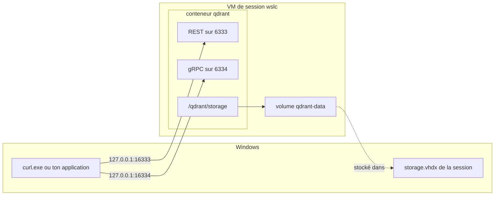

Si tu développes en C# ou en Java, tu as sans doute déjà démarré une base de données pour le travail local avec un seul `docker run` : PostgreSQL pour un projet Entity Framework Core ou JPA, Redis pour un cache, une base vectorielle pour une expérience de recherche augmentée. Trois questions reviennent toujours. Quel port publier ? Quelle version viens-je de télécharger ? Où vivent les données quand je supprime le conteneur ?

Cette leçon y répond avec `wslc` et un vrai service, [qdrant](https://qdrant.tech/), un moteur de recherche vectorielle avec une API REST sur le port 6333 et une API gRPC sur le port 6334. La machine fait déjà tourner un qdrant dans Docker Desktop, utilisé par une autre application, ce qui rend l'exercice réaliste : la copie `wslc` ne doit pas la perturber. Toutes les sorties ci-dessous viennent de `wslc` 2.9.11 et sont consignées dans le [journal](../journal/).

## Choisir les ports Windows

Avant de démarrer quoi que ce soit, regarde ce qui est déjà publié :

```text
> docker ps
ga-qdrant  qdrant/qdrant:latest  Up About an hour (healthy)  0.0.0.0:6333-6334->6333-6334/tcp, [::]:6333-6334->6333-6334/tcp
```

Docker Desktop publie 6333 et 6334 sur toutes les adresses IPv4 et IPv6. Comme le montre la [leçon 5](../05-wslc-vs-docker/), `wslc` publierait les mêmes ports **sans aucune erreur**, sur `127.0.0.1`, et prendrait discrètement cette adresse à l'application qui utilise `ga-qdrant`. La copie `wslc` utilise donc **16333** et **16334** côté Windows. Dans son conteneur, qdrant écoute toujours sur 6333 et 6334 : seul le côté gauche de `-p` change.

## Téléchargement : même tag, version différente

```powershell
wslc pull qdrant/qdrant    # 21 s, 198 MB
```

L'image Docker était déjà sur le disque, mais `wslc` la télécharge de nouveau, parce que les deux outils gardent des stocks d'images séparés. La surprise vient plus tard, quand les deux copies répondent sur leur URL racine :

```text
> curl.exe http://127.0.0.1:16333/     # wslc
{"title":"qdrant - vector search engine","version":"1.19.1","commit":"6ab21cac18ebb6f4ae29102c7f8f5cc11affd5de"}
> curl.exe http://127.0.0.1:6333/      # Docker (ga-qdrant, tirée le 2025-12-19)
{"title":"qdrant - vector search engine","version":"1.16.3","commit":"bd49f45a8a2d4e4774cac50fa29507c4e8375af2"}
```

Les deux images s'appellent `qdrant/qdrant:latest`, et elles ont trois versions mineures d'écart. Un tag est une étiquette mobile, un peu comme une version NuGet flottante ou un `LATEST` Maven : `latest` veut dire « la plus récente au moment où *cet* outil l'a tirée ». Quand deux environnements doivent correspondre, épingle la version, comme dans `qdrant/qdrant:v1.19.1`.

## Un volume nommé

Le système de fichiers propre à un conteneur disparaît avec le conteneur. Pour une base de données, les données doivent vivre ailleurs : dans un **volume nommé**, créé par le moteur de conteneurs et monté au chemin où le service écrit.

```powershell
wslc volume create qdrant-data
wslc run -d --name qdrant -p 16333:6333 -p 16334:6334 -v qdrant-data:/qdrant/storage qdrant/qdrant
curl.exe http://127.0.0.1:16333/readyz    # all shards are ready (après 1 s)
```

```text
CONTAINER ID   IMAGE           COMMAND             CREATED         STATUS        PORTS                                                  NAMES
da52872e3246   qdrant/qdrant   "./entrypoint.sh"   5 seconds ago   Up 1 second   127.0.0.1:16333->6333/tcp, 127.0.0.1:16334->6334/tcp   qdrant
```

| Option | Effet |
|---|---|
| `-p 16333:6333` | API REST : port Windows 16333 vers le port 6333 du conteneur |
| `-p 16334:6334` | API gRPC : port Windows 16334 vers le port 6334 du conteneur |
| `-v qdrant-data:/qdrant/storage` | monte le volume nommé là où qdrant garde ses collections |

Le point d'accès `readyz` est la sonde de disponibilité de qdrant : il répond dès que le service peut traiter des requêtes, et c'est ce qu'un script doit attendre plutôt qu'un délai fixe.

Le diagramme montre les deux chemins vers le conteneur : les ports publiés depuis Windows, et le volume qui vit dans le disque virtuel de la session.



:::caution[L'URL du tableau de bord dans le log est celle du conteneur]
qdrant journalise `Access web UI at http://localhost:6333/dashboard`. Ce port est celui **dans** le conteneur. Depuis Windows, le tableau de bord de cette copie est à `http://127.0.0.1:16333/dashboard`, et `localhost:6333` ouvrirait celui de Docker.
:::

## Y mettre des données

Une collection de vecteurs à quatre dimensions, trois points avec une petite charge utile, et une requête. Les corps des requêtes sont dans des fichiers JSON, ce qui évite les règles de PowerShell sur les guillemets doubles passés à un programme natif :

```powershell
curl.exe -X PUT http://127.0.0.1:16333/collections/journal -H "Content-Type: application/json" --data-binary "@coll.json"
curl.exe -X PUT "http://127.0.0.1:16333/collections/journal/points?wait=true" -H "Content-Type: application/json" --data-binary "@points.json"
curl.exe -X POST http://127.0.0.1:16333/collections/journal/points/query -H "Content-Type: application/json" --data-binary "@query.json"
```

```text
coll.json    {"vectors":{"size":4,"distance":"Cosine"}}
points.json  {"points":[{"id":1,"vector":[0.9,0.1,0.1,0.1],"payload":{"note":"wslc sessions"}},{"id":2,"vector":[0.1,0.9,0.1,0.1],"payload":{"note":"ports and localhost"}},{"id":3,"vector":[0.1,0.1,0.9,0.1],"payload":{"note":"storage.vhdx"}}]}
query.json   {"query":[0.2,0.8,0.1,0.1],"limit":2,"with_payload":true}
```

```text
{"result":true,"status":"ok","time":0.24333272}
{"result":{"operation_id":1,"status":"completed"},"status":"ok","time":0.003567116}
{"result":{"points":[{"id":2,"version":1,"score":0.99111706,"payload":{"note":"ports and localhost"}},{"id":1,"version":1,"score":0.3651484,"payload":{"note":"wslc sessions"}}]},"status":"ok","time":0.00189502}
```

Le vecteur de la requête pointe surtout le long du deuxième axe, donc le point 2 arrive en premier avec une similarité cosinus d'environ 0,99, et le point 1 suit loin derrière. `wait=true` fait que l'upsert ne rend la main qu'une fois les points indexés, pour que la requête suivante les voie.

## Supprimer le conteneur, garder les données

```powershell
wslc container stop qdrant
wslc container remove qdrant
wslc run -d --name qdrant -p 16333:6333 -p 16334:6334 -v qdrant-data:/qdrant/storage qdrant/qdrant
curl.exe http://127.0.0.1:16333/collections
curl.exe -X POST http://127.0.0.1:16333/collections/journal/points/count -H "Content-Type: application/json" -d "{}"
```

```text
{"result":{"collections":[{"name":"journal"}]},"status":"ok","time":8.866e-6}
{"result":{"count":3},"status":"ok","time":0.007211133}
```

Le nouveau conteneur retrouve la collection et ses trois points, parce qu'ils vivent dans le volume, pas dans le conteneur. `wslc volume inspect qdrant-data` montre où : `"Driver": "guest"` et un point de montage dans la VM de session, `/var/lib/docker/volumes/qdrant-data/_data`. Autrement dit, les données se trouvent dans le `storage.vhdx` de la session côté Windows, ce qui a deux conséquences :

- le volume appartient à une seule session : un terminal administrateur, qui utilise une autre session, ne le voit pas ([leçon 3](../03-first-containers/)) ;
- supprimer des données du volume libère de la place dans le disque virtuel, mais le fichier ne rétrécit pas tout seul ([leçon 6](../06-resources-and-limits/)).

## Ne monte pas un dossier Windows pour une base de données

Avec Docker, tu as peut-être l'habitude d'un **montage lié** (bind mount), où `-v` prend un dossier de l'hôte au lieu d'un nom de volume, pour que les fichiers de données soient visibles dans l'Explorateur. `wslc` accepte un chemin Windows :

```powershell
wslc run -d --name qdrant-bind -p 16335:6333 -v "C:\...\qdrant-bind:/qdrant/storage" qdrant/qdrant
wslc exec qdrant-bind sh -c "mount | grep /qdrant/storage"
```

```text
drvfs on /qdrant/storage type virtiofs (rw,relatime)
```

Le dossier arrive côté Linux par [virtiofs](https://virtio-fs.gitlab.io/), un système de fichiers partagé entre la VM et Windows. qdrant démarre quand même et écrit ses fichiers dans le dossier Windows, mais il vérifie le système de fichiers au démarrage et journalise une erreur :

```text
ERROR qdrant: Filesystem check failed for storage path ./storage. Details: FUSE filesystems may cause data corruption due to caching issues
```

La même règle vaut pour PostgreSQL, SQL Server ou tout moteur qui compte sur un verrouillage et une écriture sur disque précis des fichiers : garde ses fichiers dans un volume, dans la VM, et utilise un montage lié pour le code source, les fichiers de configuration ou les exports.

:::caution[Une source de montage lié absente est créée pour toi]
Si le chemin Windows donné à `-v` n'existe pas, `wslc` le crée sous forme de dossier vide, sans avertissement. Un test de la [leçon 8](../08-compose/) a laissé ainsi un dossier vide `C:\var\run\docker.sock\`. Vérifie le chemin quand un conteneur démarre avec un répertoire étonnamment vide.
:::

## Ce que ça coûte

```text
> wslc stats qdrant
CONTAINER ID   NAME     CPU %   MEM USAGE / LIMIT     MEM %   NET I/O           BLOCK I/O        PIDS
da52872e3246   qdrant   0.16%   47.21MiB / 15.62GiB   0.30%   10.1kB / 5.77kB   8.19kB / 184kB   35
> docker stats ga-qdrant --no-stream --format "CPU {{.CPUPerc}}  MEM {{.MemUsage}}"
CPU 0.41%  MEM 367.8MiB / 31.2GiB
```

- La limite de chaque ligne est celle de la VM, pas celle du conteneur : **15,62 Gio** pour `wslc`, parce que cette machine règle `memorySize: 16GB`, et **31,2 Gio** pour Docker Desktop, la moitié de la RAM par défaut.
- 47 Mio pour trois points contre 368 Mio pour `ga-qdrant`, ce n'est pas une comparaison entre les outils : `ga-qdrant` contient de vraies données.
- Côté Windows, le processus `vmmemwslc-cli-spare` de la VM de session était à 1160 Mo, dont environ 0,9 Go est le coût d'une session inactive.
- qdrant journalise `starting 7 workers` : il voit les 8 CPU autorisés par `cpuCount: 8`.

La [leçon 6](../06-resources-and-limits/) explique ces limites et comment mesurer la VM.

## Nettoyage

```powershell
wslc container stop qdrant qdrant-bind
wslc container remove qdrant qdrant-bind
wslc volume remove qdrant-data
```

Supprimer le conteneur garde le volume ; supprimer le volume efface les collections pour de bon. `ga-qdrant`, dans Docker, n'a jamais été touché.

## À retenir

- Quand un autre outil publie déjà un port, choisis un autre port Windows : seul le côté hôte de `-p` change, et rien ne te prévient d'un conflit.
- `latest` n'est pas une version. Le même tag tiré à deux dates a donné qdrant 1.16.3 dans Docker et 1.19.1 dans `wslc` ; épingle le tag quand les environnements doivent correspondre.
- Un volume nommé survit au conteneur. Il vit dans le `storage.vhdx` de la session et n'est visible que depuis cette session.
- Un service journalise les ports côté conteneur ; depuis Windows, utilise le port publié sur `127.0.0.1`.
- Pour une base de données, utilise un volume, pas un dossier Windows : un montage lié passe par virtiofs, et qdrant avertit d'un risque de corruption des données.
- `wslc stats` affiche la mémoire de la VM comme limite, pas une limite par conteneur.

## Exercices

1. Sans la lancer, prédis quel point arrive en premier pour le vecteur de requête `[0.1,0.1,0.9,0.1]`, et à peu près son score. Puis lance la requête.

<details>
<summary>Solution</summary>

Le point 3, `storage.vhdx`, dont le vecteur est exactement le vecteur de la requête. La similarité cosinus d'un vecteur avec lui-même vaut 1, donc le score devrait être 1 ou une valeur à virgule flottante très proche. Les points 1 et 2 sont symétriques par rapport à cette requête et devraient obtenir le même score, bien plus bas. Le corps de `query.json` devient :

```text
{"query":[0.1,0.1,0.9,0.1],"limit":2,"with_payload":true}
```

</details>

2. Docker Desktop publie qdrant sur `0.0.0.0:6333` et `[::]:6333`, et rien d'autre n'utilise ce port. Quel qdrant atteignent `http://127.0.0.1:6333/` et `http://localhost:6333/` ? Qu'est-ce qui change si tu lances maintenant `wslc run -d -p 6333:6333 qdrant/qdrant` ?

<details>
<summary>Solution</summary>

Avant le conteneur `wslc`, les deux adresses atteignent Docker, qui écoute sur toutes les adresses. Après, `wslc` écoute sur `127.0.0.1:6333`, l'adresse la plus précise : `127.0.0.1` atteint `wslc`, tandis que `localhost`, qui se résout d'abord en `::1`, atteint toujours Docker. Aucune des deux commandes n'échoue. La version dans la réponse racine te dit lequel a répondu.

</details>

3. Un collègue démarre qdrant avec `wslc run -d --name qdrant -p 16333:6333 qdrant/qdrant`, crée une collection, puis arrête et supprime le conteneur et le relance avec la même commande. La collection est-elle toujours là ? Pourquoi ?

<details>
<summary>Solution</summary>

Non. Sans `-v`, qdrant écrit dans le système de fichiers propre au conteneur, qui est supprimé avec le conteneur. La correction est le volume nommé de cette leçon : `-v qdrant-data:/qdrant/storage`. *À vérifier :* si l'image qdrant déclare un volume anonyme qui garderait une copie orpheline des données dans la session.

</details>

4. Tu veux que les deux copies de qdrant tournent dans la même version. Écris la commande `wslc run`, et dis ce que tu changerais côté Docker.

<details>
<summary>Solution</summary>

```powershell
wslc run -d --name qdrant -p 16333:6333 -p 16334:6334 -v qdrant-data:/qdrant/storage qdrant/qdrant:v1.19.1
```

Côté Docker, utilise le même tag, `qdrant/qdrant:v1.19.1`, au lieu de `latest`. Avant de mettre à jour un qdrant qui contient de vraies données, lis les notes de version de qdrant : le format de stockage peut changer d'une version à l'autre.

</details>

5. Depuis un terminal administrateur, `wslc volume list` n'affiche pas `qdrant-data`. Le volume est-il perdu ?

<details>
<summary>Solution</summary>

Non. Le terminal administrateur utilise la session `wslc-cli-admin-<user>`, dont le moteur et le disque sont séparés. Le volume est dans la session non élevée. Depuis le terminal administrateur, tu peux quand même le voir avec `wslc --session wslc-cli-<user> volume list` ; l'inverse, d'un terminal normal vers la session admin, exige l'élévation.

</details>

## Sources

- [Documentation qdrant : installation](https://qdrant.tech/documentation/guides/installation/) et [référence de l'API](https://api.qdrant.tech/)
- [qdrant/qdrant — Docker Hub](https://hub.docker.com/r/qdrant/qdrant)
- [WSL container — Microsoft Learn](https://learn.microsoft.com/windows/wsl/wsl-container)
- [Volumes](https://docs.docker.com/engine/storage/volumes/) et [bind mounts](https://docs.docker.com/engine/storage/bind-mounts/) — documentation Docker (`wslc` suit le même modèle)
- [virtiofs](https://virtio-fs.gitlab.io/)
