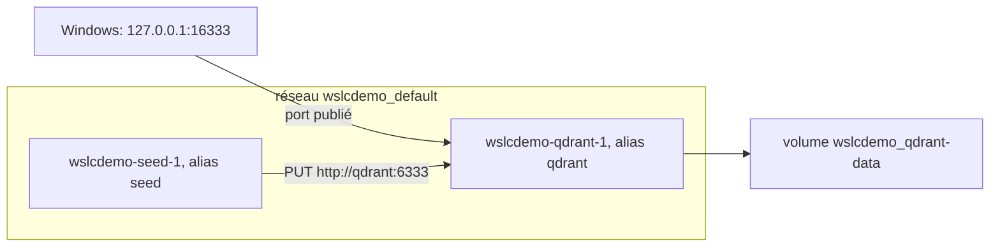

Pour la plupart des développeurs C# et Java, les conteneurs au quotidien, c'est un fichier `compose.yaml` : une base de données, un broker de messages et parfois l'application elle-même, démarrés ensemble par `docker compose up`. Spring Boot peut même démarrer ce fichier pour toi au lancement de l'application, et les développeurs .NET en gardent souvent un à côté de leur solution. La première question sur un nouvel outil de conteneurs est donc de savoir s'il lit `compose.yaml`.

Pour `wslc` 2.9.11, la réponse est non. Cette leçon montre les vérifications derrière cette réponse, une impasse qui vaut la peine d'être connue, et ce que Compose fait réellement en coulisses, pour que tu puisses reproduire une petite pile avec de simples commandes `wslc`. Toutes les sorties viennent du [journal](../journal/).

## Pas de commande `compose`

```text
> wslc compose --help
Unrecognized command: 'compose'
```

`wslc --help` ne liste aucun équivalent de Compose non plus, et le [tutoriel officiel](https://learn.microsoft.com/windows/wsl/tutorials/wsl-containers) n'en parle pas. `wslc` 2.9.11 ne prend pas en charge Compose.

## Impasse : brancher `docker compose` sur le moteur de la session

Avec Docker Desktop, la commande `docker compose` n'est qu'un client : elle parle à l'API Docker Engine par un canal nommé ou un socket Unix. L'idée est donc tentante : si la session `wslc` fait tourner un moteur compatible, il suffirait d'y brancher Compose. La VM de session en fait bien tourner un :

```text
> wslc system session run ps -eo pid,args
  131 /usr/bin/containerd --address /run/containerd/containerd.sock --root /var/lib/docker/containerd/daemon --state /run/docker/containerd/daemon
  132 /usr/bin/dockerd --containerd /run/containerd/containerd.sock
> wslc system session run ls -la /var/run/docker.sock
srw-rw---- 1 root docker 0 Sep 13 18:47 /var/run/docker.sock
```

`wslc system session run` lance une commande dans la VM de session elle-même, pas dans un conteneur. Elle montre `dockerd` et son socket. Mais trois portes sont fermées :

1. Rien n'expose ce socket à Windows : `wslc` ne crée aucun canal nommé pour lui.
2. Le client `docker` de la VM ne fonctionne pas : `wslc system session run docker version` répond `The handle is invalid. Error code: ERROR_INVALID_HANDLE`.
3. On ne peut pas le monter dans un conteneur qui contient la CLI Docker et Compose, comme `docker:cli` :

```powershell
wslc run --rm -e DOCKER_HOST=unix:///var/run/docker.sock -v /var/run/docker.sock:/var/run/docker.sock docker:cli docker ps
```

```text
Cannot connect to the Docker daemon at unix:///var/run/docker.sock. Is the docker daemon running?
```

La raison se trouve dans la table des montages de ce conteneur. La source de `-v` est lue comme un chemin **Windows** : `/var/run/docker.sock` est devenu `C:\var\run\docker.sock`, partagé par virtiofs, et non le socket de la VM :

```text
drvfs on /run/docker.sock type virtiofs (rw,relatime)
```

:::caution[`wslc` crée une source de montage lié absente]
Ce test a laissé un dossier vide `C:\var\run\docker.sock\` sous Windows : `wslc` crée la source d'un montage lié quand elle n'existe pas. Supprime-le à la main ensuite. La syntaxe longue n'aide pas non plus : `--mount type=bind,source=/var/run/docker.sock,...` est refusé avec `The bind source path must be absolute.`
:::

Le même mur arrête tout outil construit sur l'API Docker Engine, comme Testcontainers pour .NET ou Java : il lui faut un point d'accès côté Windows. *À vérifier* à chaque version, puisque la surface d'API de la préversion peut changer.

## Ce que fait vraiment Compose

Enlève le YAML, et un projet Compose se résume à une poignée d'objets aux noms prévisibles. Prends ce fichier à deux services, une base qdrant et un conteneur `seed` à usage unique qui y crée une collection :

```yaml
services:
  qdrant:
    image: qdrant/qdrant:v1.19.1
    ports:
      - "127.0.0.1:16333:6333"
    volumes:
      - qdrant-data:/qdrant/storage

  seed:
    image: curlimages/curl:8.16.0
    depends_on:
      - qdrant
    command: >
      --silent --show-error --retry 10 --retry-connrefused --retry-delay 1
      -X PUT http://qdrant:6333/collections/demo
      -H "Content-Type: application/json"
      -d '{"vectors":{"size":4,"distance":"Cosine"}}'

volumes:
  qdrant-data:
```

`docker compose -p wslcdemo config` le valide et affiche le modèle entièrement résolu, ce qui rend visibles les parties implicites :

- **un réseau par projet**, nommé `wslcdemo_default`, que rejoint chaque service ;
- des **volumes nommés** préfixés par le nom du projet, ici `wslcdemo_qdrant-data` ;
- des **conteneurs** nommés `<project>-<service>-<index>`, comme `wslcdemo-qdrant-1` ;
- les **noms de service comme noms DNS** sur le réseau du projet, ce qui explique que `seed` puisse appeler `http://qdrant:6333` ;
- un **ordre de démarrage** tiré de `depends_on`, qui ne fait qu'ordonner les démarrages : il n'attend pas que qdrant soit prêt. C'est le rôle du `--retry-connrefused` de curl.

Le diagramme montre ces objets pour le projet `wslcdemo`.



## Les noms DNS sur un réseau `wslc`

La pièce maîtresse est la résolution de noms entre conteneurs. Sur un réseau créé avec `wslc network create`, elle fonctionne, y compris pour les alias supplémentaires donnés avec `--network-alias`. Sur le réseau par défaut, elle ne fonctionne pas :

```text
> wslc run --rm --network demo alpine wget -qO- http://qdrant:6333/
{"title":"qdrant - vector search engine","version":"1.19.1","commit":"6ab21cac18ebb6f4ae29102c7f8f5cc11affd5de"}
> wslc run --rm --network demo alpine wget -qO- http://vectors:6333/readyz      # --network-alias vectors
all shards are ready
> wslc run --rm alpine wget -qO- -T 5 http://qdrant:6333/                      # réseau par défaut
wget: bad address 'qdrant:6333'
```

Dans ce test, un conteneur qdrant appelé `qdrant` tournait sur un réseau nommé `demo`, avec l'alias supplémentaire `vectors`. Son nom et chacun de ses alias se résolvent pour les autres conteneurs de ce réseau. C'est le même comportement que les réseaux définis par l'utilisateur de Docker, et la raison pour laquelle Compose en crée un par projet.

## La traduction, en PowerShell

Avec ces pièces, le fichier devient deux scripts. Le code est dans [`code/wsl-containers/compose`](https://github.com/spareilleux/learn/tree/main/code/wsl-containers/compose). `wslc-up.ps1` :

```powershell
# Équivalent de `docker compose -p wslcdemo up -d` pour compose.yaml, avec wslc
$project = 'wslcdemo'

# Ce que Compose crée implicitement : un réseau par projet, des volumes nommés
wslc network create "${project}_default"
wslc volume create "${project}_qdrant-data"

# service qdrant (le nom du service devient un alias DNS sur le réseau du projet)
wslc run -d --name "$project-qdrant-1" --network "${project}_default" --network-alias qdrant `
    -p 127.0.0.1:16333:6333 -v "${project}_qdrant-data:/qdrant/storage" qdrant/qdrant:v1.19.1

# service seed (depends_on ne fait qu'ordonner le démarrage : curl réessaie jusqu'à ce que qdrant réponde)
wslc run --name "$project-seed-1" --network "${project}_default" --network-alias seed `
    curlimages/curl:8.16.0 --silent --show-error --retry 10 --retry-connrefused --retry-delay 1 `
    -X PUT http://qdrant:6333/collections/demo -H 'Content-Type: application/json' `
    -d '{"vectors":{"size":4,"distance":"Cosine"}}'
```

`wslc-down.ps1` :

```powershell
# Équivalent de `docker compose -p wslcdemo down --volumes`
$project = 'wslcdemo'
wslc container stop "$project-qdrant-1"
wslc container remove "$project-qdrant-1" "$project-seed-1"
wslc network remove "${project}_default"
wslc volume remove "${project}_qdrant-data"
```

| `compose.yaml` | `wslc` |
|---|---|
| le projet | un préfixe `$project` sur chaque nom |
| le réseau par défaut implicite | `wslc network create "${project}_default"` |
| `volumes:` au niveau racine | `wslc volume create` |
| un service | `wslc run --name <project>-<service>-1 --network … --network-alias <service>` |
| `ports:` | `-p 127.0.0.1:16333:6333` |
| `command:` | les arguments après le nom de l'image |
| `depends_on:` | l'ordre des lignes dans le script |
| `down --volumes` | `stop`, `remove`, puis `network remove` et `volume remove` |

:::note[Guillemets du JSON dans PowerShell]
Le `-d '{"vectors":…}'` du seed passe des guillemets doubles à un programme natif. L'exécution ci-dessous a fonctionné ; *à vérifier* dans Windows PowerShell 5.1, dont le passage d'arguments aux programmes natifs est connu pour supprimer les guillemets doubles imbriqués. Les fichiers JSON de la [leçon 7](../07-volumes-and-a-real-service/) évitent complètement la question.
:::

## Le résultat

Après `wslc-up.ps1`, `wslc container list --all` montre le seed déjà terminé et qdrant en marche :

```text
CONTAINER ID   IMAGE                  COMMAND                  CREATED         STATUS                              PORTS                       NAMES
28be34e431f5   curlimages/curl:8.1…   "/entrypoint.sh --si…"   1 second ago    Exited (0) Less than a second ago                               wslcdemo-seed-1
c1f82d52d6ca   qdrant/qdrant:v1.19…   "./entrypoint.sh"        2 seconds ago   Up 1 second                         127.0.0.1:16333->6333/tcp   wslcdemo-qdrant-1
> wslc logs wslcdemo-seed-1
{"result":true,"status":"ok","time":0.409039704}
> curl.exe http://127.0.0.1:16333/collections
{"result":{"collections":[{"name":"demo"}]},"status":"ok","time":0.00004439}
```

Le seed est sorti avec le code 0, son log est la réponse de qdrant au `PUT`, et la collection `demo` existe. Après `wslc-down.ps1`, il ne reste aucun conteneur, seulement les réseaux par défaut `bridge`, `host` et `none`, et aucun volume.

Sur GitHub Actions, les runners hébergés n'ont pas le service WSL containers, donc la CI ne peut pas lancer ces scripts. Elle lance à la place le `compose.yaml` d'origine avec Docker Compose, et vérifie que le seed crée la collection : cela prouve que le fichier que traduisent les scripts est correct.

## Les health checks existent, `condition: service_healthy` non

Compose peut attendre qu'un service soit **en bonne santé** (healthy) avant de démarrer le suivant, avec `depends_on` et `condition: service_healthy`. L'attente est l'affaire de Compose ; le health check lui-même est celle du moteur, et `wslc run --help` en liste les options : `--health-cmd`, `--health-interval`, `--health-retries`, `--health-start-period` et `--health-timeout`. Un test pour cette leçon, avec un conteneur qui ne devient prêt qu'au bout de six secondes :

```powershell
wslc run -d --name hc --health-cmd 'test -f /tmp/ready' --health-interval 2s alpine sh -c 'sleep 6; touch /tmp/ready; sleep 60'
wslc container list
```

```text
CONTAINER ID   IMAGE    COMMAND                  CREATED         STATUS                            PORTS   NAMES
1f3750e9e55b   alpine   "sh -c 'sleep 6; tou…"   4 seconds ago   Up 3 seconds (health: starting)           hc
```

Huit secondes plus tard :

```text
CONTAINER ID   IMAGE    COMMAND                  CREATED          STATUS                    PORTS   NAMES
1f3750e9e55b   alpine   "sh -c 'sleep 6; tou…"   12 seconds ago   Up 11 seconds (healthy)           hc
```

`wslc container inspect hc` contient aussi un objet `"Health"`, avec un compteur `FailingStreak` et un `Log` des dernières vérifications. Un script peut donc reproduire `service_healthy` en interrogeant l'état jusqu'à ce qu'il indique `(healthy)` avant de lancer le service suivant. La commande de santé s'exécute dans le conteneur, donc elle ne peut utiliser que les outils de l'image.

## Ce que le script ne t'apporte pas

Pour une pile de deux ou trois services, un script reproduit l'essentiel : le réseau, les volumes, les noms DNS et l'ordre de démarrage. Ce qu'il ne reproduit pas :

- **la lecture de `compose.yaml`** : le fichier et le script peuvent diverger, et rien ne le vérifie ;
- **`depends_on` avec `condition: service_healthy`** : le health check tourne, mais l'attendre est une boucle que tu écris toi-même ;
- **un `up` différentiel**, qui ne recrée que les services dont la configuration a changé ; le script relance toutes les commandes, et reste *à vérifier* le comportement de chaque `create` et `run` quand son objet existe déjà ;
- **`logs -f` sur tous les services**, entrelacés et colorés par service ;
- **les profils, `extends`, l'interpolation `.env`** et le reste de la [spécification Compose](https://compose-spec.io/).

Pour un vrai projet Compose, Docker Desktop ou Podman reste l'outil. `wslc` convient à un petit ensemble stable de services, ou à une application Windows qui démarre ses propres conteneurs ([leçon 9](../09-csharp-api/)).

## À retenir

- `wslc` 2.9.11 n'a pas de commande `compose` et n'expose pas le moteur Docker de sa session à Windows, donc `docker compose` et les autres clients de l'API Docker ne peuvent pas l'utiliser.
- `-v /var/run/docker.sock:…` monte un chemin Windows, pas le socket de la VM, et `wslc` crée sans prévenir une source de montage lié absente.
- Compose ajoute un réseau par projet, des volumes préfixés, des noms de conteneurs prévisibles, des noms DNS pour les services et un ordre de démarrage.
- Sur un réseau créé avec `wslc network create`, les noms de conteneurs et les valeurs de `--network-alias` se résolvent ; sur le réseau par défaut, non.
- `depends_on` ne fait qu'ordonner le démarrage. La disponibilité est l'affaire du client, ici avec le `--retry-connrefused` de curl, ou d'une boucle qui attend l'état `(healthy)` d'un `--health-cmd`.
- Un script peut traduire une petite pile, mais il ne lit pas le YAML, n'attend pas les health checks sauf si tu écris la boucle, et ne compare pas la pile en cours avec le fichier.

## Exercices

1. Dans le conteneur `seed`, l'URL est `http://qdrant:6333`. Depuis Windows, c'est `http://127.0.0.1:16333`. Explique chaque partie des deux URL.

<details>
<summary>Solution</summary>

`qdrant` est l'alias DNS du conteneur qdrant sur le réseau du projet, que seuls les autres conteneurs de ce réseau peuvent résoudre, et 6333 est le port sur lequel qdrant écoute dans son conteneur. Depuis Windows, le réseau des conteneurs n'est pas joignable : tu passes par le port publié, `127.0.0.1:16333`, que `wslc` transfère au port 6333 du conteneur.

</details>

2. Tu retires `--retry 10 --retry-connrefused --retry-delay 1` de la commande du seed, puisque `depends_on` est là. Qu'est-ce qui peut mal tourner, et pourquoi ?

<details>
<summary>Solution</summary>

`depends_on`, comme l'ordre des lignes dans le script, garantit seulement que le conteneur qdrant a **démarré** en premier, pas que qdrant **écoute**. Si curl s'exécute entre les deux, la connexion est refusée, curl sort en erreur, et la collection n'est jamais créée. Dans le test ci-dessus, le seed a démarré une seconde après qdrant : une course gagnée par chance n'est pas une garantie. Les nouvelles tentatives transforment la course en attente.

</details>

3. Modifie les scripts pour que `down` garde les données, comme `docker compose down` sans `--volumes`. Que se passe-t-il au `up` suivant ?

<details>
<summary>Solution</summary>

Retire la dernière ligne de `wslc-down.ps1`, `wslc volume remove`, et mets à jour son commentaire. Au `up` suivant, `wslc volume create "${project}_qdrant-data"` rencontre un volume existant : *à vérifier* si `wslc` signale alors une erreur ou le réutilise. Le conteneur qdrant monte ensuite l'ancien volume, et le `PUT` du seed vise une collection qui existe déjà, ce que qdrant peut refuser. Dans tous les cas, les données sont toujours là, ce que tu peux vérifier avec `curl.exe http://127.0.0.1:16333/collections`.

</details>

4. Un conteneur sur le réseau par défaut lance `wget http://qdrant:6333/` et obtient `bad address`. Donne deux corrections.

<details>
<summary>Solution</summary>

La résolution de noms ne fonctionne que sur un réseau défini par l'utilisateur. Soit tu lances le client sur le même réseau que qdrant, avec `--network demo`, soit, pour un conteneur qui tourne déjà, tu le connectes avec `wslc network connect demo <container>`. La seconde commande apparaît dans `wslc network --help` ; *à vérifier :* son effet sur un conteneur en cours d'exécution en 2.9.11.

</details>

5. Écris la ligne `wslc run` d'un troisième service, un cache `redis:8` joignable depuis les autres conteneurs sous le nom `cache`, sans port publié vers Windows.

<details>
<summary>Solution</summary>

```powershell
wslc run -d --name "$project-redis-1" --network "${project}_default" --network-alias cache redis:8
```

Pas de `-p`, parce que seuls les conteneurs du réseau du projet en ont besoin. Ajoute `wslc container stop` et `remove` de `$project-redis-1` au script `down`. *À vérifier :* cette ligne n'a pas été lancée ; le tag `redis:8` doit exister sur Docker Hub quand tu l'essaies.

</details>

## Sources

- [Get started with containers on WSL — Microsoft Learn](https://learn.microsoft.com/windows/wsl/tutorials/wsl-containers)
- [WSL container — Microsoft Learn](https://learn.microsoft.com/windows/wsl/wsl-container)
- [Spécification Compose](https://compose-spec.io/) et [Networking in Compose](https://docs.docker.com/compose/how-tos/networking/) — documentation Docker
- [Référence du Dockerfile : `HEALTHCHECK`](https://docs.docker.com/reference/dockerfile/#healthcheck) — documentation Docker (les options `--health-*` de `run` la remplacent)
- [Control startup order in Compose](https://docs.docker.com/compose/how-tos/startup-order/) — documentation Docker
- [Page de manuel de curl : `--retry-connrefused`](https://curl.se/docs/manpage.html#--retry-connrefused)
- [Documentation qdrant](https://qdrant.tech/documentation/)
