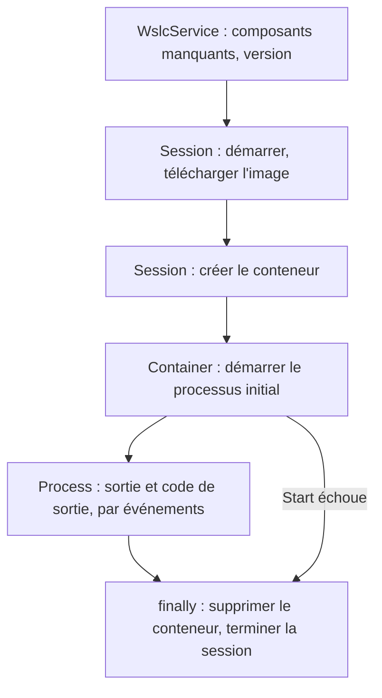
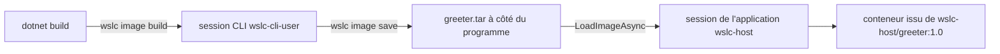

Si tu as déjà lancé des conteneurs depuis du code .NET ou Java, tu l'as probablement fait à travers un client Docker : [Testcontainers](https://testcontainers.com/) pour les tests d'intégration, ou les bibliothèques Docker.DotNet et docker-java. Toutes parlent HTTP à l'API Docker Engine, par un tube nommé ou un socket, et toutes partagent un seul moteur avec tous les autres outils de la machine.

L'API WSL container fonctionne autrement. [`Microsoft.WSL.Containers`](https://www.nuget.org/packages/Microsoft.WSL.Containers) est un paquet NuGet qu'une **application Windows** appelle dans son propre processus. L'application crée sa propre **session**, avec sa propre VM, son propre disque et ses propres limites, puis y télécharge des images et y lance des conteneurs. Il n'y a aucun démon à installer ni aucun socket à trouver : si WSL 2.9 ou plus récent est présent, l'application peut utiliser des conteneurs Linux dans sa propre logique.

Cette leçon construit le plus petit programme utile, se heurte à ce que la documentation de la préversion dit de travers, puis va un cran plus loin : une image construite pendant `dotnet build`, livrée sous forme de fichier à côté du programme. Le code est dans [`code/wsl-containers/wslc-host`](https://github.com/spareilleux/learn/tree/main/code/wsl-containers/wslc-host) ; les sorties viennent du [journal](../journal/), avec le paquet 2.9.9 sur WSL 2.9.11.

## Les objets

L'API suit le cycle de vie d'un conteneur :

| Objet | Rôle |
|---|---|
| `WslcService` | vérifier que les composants WSL sont installés, version du service |
| `Session` | hôte WSL qui gère les images et crée les conteneurs |
| `Container` | démarrer, arrêter, inspecter, supprimer ; lancer des processus |
| `Process` | lire `stdout`/`stderr`, écrire sur `stdin`, envoyer des signaux |

Si tu connais la CLI Docker, une `Session` joue le rôle du moteur, `Container` celui de `docker create`, `start`, `inspect` et `rm`, et `Process` celui de la sortie attachée de `docker run` ou `docker exec`.

## Un projet qui compile

Pars de l'extrait de la [page Microsoft Learn](https://learn.microsoft.com/windows/wsl/wsl-container), colle-le dans un projet console qui référence le paquet, et la compilation échoue avec cinq erreurs :

```text
error CS0103: The name 'ComponentFlags' does not exist in the current context
error CS0117: 'SessionSettings' does not contain a definition for 'MemoryMB'
error CS0117: 'ProcessSettings' does not contain a definition for 'CmdLine'
error CS0103: The name 'DeleteContainerFlags' does not exist in the current context
error CS1705: Assembly 'wslcsdkcs' with identity 'wslcsdkcs, Version=1.0.0.0, Culture=neutral, PublicKeyToken=null' uses 'Microsoft.Windows.SDK.NET, Version=10.0.26100.79, Culture=neutral, PublicKeyToken=31bf3856ad364e35' which has a higher version than referenced assembly 'Microsoft.Windows.SDK.NET' with identity 'Microsoft.Windows.SDK.NET, Version=10.0.19041.38, Culture=neutral, PublicKeyToken=31bf3856ad364e35'
```

### Quatre noms ont changé

La page décrit un état antérieur de l'API. Les vrais noms viennent de la lecture des types publics de `wslcsdkcs.dll`, l'assembly managé du paquet, avec [`MetadataLoadContext`](https://learn.microsoft.com/dotnet/standard/assembly/inspect-contents-using-metadataloadcontext), qui charge un assembly pour l'inspecter sans l'exécuter :

| Microsoft Learn | Paquet 2.9.9 |
|---|---|
| `ComponentFlags GetMissingComponents()` | `IReadOnlyList<Component> GetMissingComponents()` (`VirtualMachinePlatform`, `WslPackage`, `SdkNeedsUpdate`) |
| `SessionSettings.MemoryMB` | `SessionSettings.MemorySizeInMB` |
| `ProcessSettings.CmdLine` | `ProcessSettings.CommandLine` (`IList<string>`) |
| `DeleteContainerFlags.None` | `DeleteContainerOption.None` / `Force` |

Dans un IDE, l'explorateur d'objets ou Atteindre la définition montrent la même chose. Pour un paquet en préversion, fais confiance au compilateur plutôt qu'à la page.

### `CS1705` : la projection du SDK Windows

Le paquet est une projection [C#/WinRT](https://learn.microsoft.com/windows/apps/develop/platform/csharp-winrt/), avec une DLL native pour x64 et arm64 seulement. Il déclare la cible `net8.0-windows10.0.19041.0`, mais son `wslcsdkcs.dll` est compilé contre `Microsoft.Windows.SDK.NET` 10.0.26100.79, une projection plus récente que celle qu'apporte cette cible.

Passer le projet à `net10.0-windows10.0.26100.0` ne suffit pas : le SDK .NET choisit alors la projection 10.0.26100.38, et l'erreur reste. Il faut forcer la version avec `WindowsSdkPackageVersion`, et `10.0.26100.79` elle-même n'existe pas sur nuget.org : `NU1102`, la plus proche étant `10.0.26100.80`. Le fichier projet qui fonctionne :

```xml
<PropertyGroup>
  <OutputType>Exe</OutputType>
  <TargetFramework>net10.0-windows10.0.26100.0</TargetFramework>
  <WindowsSdkPackageVersion>10.0.26100.80</WindowsSdkPackageVersion>
  <RuntimeIdentifier>win-x64</RuntimeIdentifier>
</PropertyGroup>
<ItemGroup>
  <PackageReference Include="Microsoft.WSL.Containers" Version="2.9.9" />
</ItemGroup>
```

`RuntimeIdentifier` choisit la DLL native ; utilise `win-arm64` sur une machine Arm.

## Le programme

```csharp
using System.Runtime.InteropServices;
using System.Text;
using Microsoft.WSL.Containers;

const string ContainerName = "wslc-host-hello";

var missing = WslcService.GetMissingComponents();
if (missing.Count > 0)
{
    Console.WriteLine($"Missing WSL components: {string.Join(", ", missing)} (run wsl --install)");
    return 1;
}
var version = WslcService.GetVersion();
Console.WriteLine($"WSL container service {version.Major}.{version.Minor}.{version.Revision}");

// La session garde ses images et conteneurs dans son propre storage.vhdx.
var storage = Path.Combine(Environment.GetFolderPath(Environment.SpecialFolder.LocalApplicationData), "WslcHost");
using var session = new Session(new SessionSettings("wslc-host", storage)
{
    CpuCount = 2,
    MemorySizeInMB = 2048
});
session.Start();
Console.WriteLine($"Session started, storage in {storage}");

// Un conteneur laissé par une exécution plantée survit dans storage.vhdx et bloque le nom.
try
{
    using var leftover = session.OpenContainer(ContainerName, ProcessOutputMode.Discard);
    leftover.Delete(DeleteContainerOption.Force);
    Console.WriteLine($"Removed leftover container {ContainerName}");
}
catch (COMException) { }

await session.PullImageAsync(new PullImageOptions("docker.io/library/alpine:latest"));
foreach (var image in session.GetImages())
    Console.WriteLine($"Image {image.Name} ({image.Size / 1024 / 1024} MB)");

using var container = session.CreateContainer(new ContainerSettings("alpine:latest")
{
    Name = ContainerName,
    InitProcess = new ProcessSettings
    {
        CommandLine = args.Length > 0 ? [.. args] : ["/bin/sh", "-c", "echo Hello from $(cat /etc/alpine-release) on $(uname -r)"],
        OutputMode = ProcessOutputMode.Event
    }
});

try
{
    var exited = new TaskCompletionSource<int>();
    container.InitProcess.OutputReceived += data => Console.Write(Encoding.UTF8.GetString(data));
    container.InitProcess.Exited += code => exited.TrySetResult(code);
    container.Start();

    var exitCode = await exited.Task.WaitAsync(TimeSpan.FromMinutes(2));
    Console.WriteLine($"Container {container.Id[..12]} exited with code {exitCode}");
    return exitCode;
}
finally
{
    container.Delete(DeleteContainerOption.Force);
    session.Terminate();
}
```

Quelques points qu'un lecteur C# reconnaîtra :

- La `Session` et le `Container` sont `IDisposable`, donc `using var` libère leurs handles natifs à la fin de la méthode.
- La sortie arrive sous forme d'**événements**, `OutputReceived` avec les octets bruts et `Exited` avec le code de sortie. Un [`TaskCompletionSource<int>`](https://learn.microsoft.com/dotnet/api/system.threading.tasks.taskcompletionsource-1) transforme l'événement de sortie en tâche, et `WaitAsync` lui ajoute un délai maximal.
- Les erreurs du côté natif remontent sous forme de [`COMException`](https://learn.microsoft.com/dotnet/api/system.runtime.interopservices.comexception), ou d'`ArgumentException` pour un paramètre invalide.
- Les arguments de ligne de commande, quand il y en a, remplacent la commande par défaut : `dotnet run -- /bin/cat /etc/os-release` lance cette commande à la place.

```text
WSL container service 2.9.11
Session started, storage in C:\Users\spare\AppData\Local\WslcHost
Image alpine:latest (8 MB)
Hello from 3.24.1 on 6.18.40.1-microsoft-standard-WSL2
Container b27dd2f80927 exited with code 0
```

L'exécution complète a pris 7 secondes, téléchargement d'`alpine` compris dans une session neuve et vide. Le conteneur voit les limites de la session, pas celles de `settings.yaml` : `nproc` a affiché `2`, et `free -m` un total de `1907` Mo pour `MemorySizeInMB = 2048`.

Le programme utilise les quatre objets dans l'ordre, et son bloc finally nettoie même quand le conteneur ne démarre pas.



## Où apparaît la session de l'application

Pendant qu'un conteneur de 20 secondes tournait, la CLI voyait la session de l'application à côté de ses deux propres sessions :

```text
> wslc system session list
ID   Creator PID   Display Name
6    350476        wslc-cli-admin-spare
8    275812        wslc-cli-spare
16   110952        wslc-host
> Get-Process vmmem*
vmmemCmZygote     0
vmmemWSL       3307
vmmemwslc-host  510
> wslc --session wslc-host container list
CONTAINER ID   IMAGE           COMMAND                  CREATED         STATUS         PORTS   NAMES
2e75803c92a9   alpine:latest   "/bin/sh -c 'echo st…"   4 seconds ago   Up 3 seconds           wslc-host-hello
```

- La session de l'application est une session `wslc` ordinaire : le même genre de VM `vmmem<session>`, visible et pilotable depuis la CLI avec `--session`. C'est le premier outil à sortir quand le programme se comporte mal.
- Son disque est là où l'application l'a choisi, `%LocalAppData%\WslcHost\storage.vhdx`, 67 Mo après le téléchargement, pas sous `%LocalAppData%\wslc\sessions`.
- Ses limites viennent de `SessionSettings` : les sessions de la CLI ont 8 CPU sur cette machine, les conteneurs de l'application en voient 2.
- Après `session.Terminate()`, la session et son processus `vmmem` disparaissent tout de suite, sans le délai d'inactivité de 30 secondes des sessions de la CLI ([leçon 6](../06-resources-and-limits/)).

## Piège : un démarrage en échec laisse le conteneur derrière lui

La première version du programme n'avait ni nettoyage des restes ni `Delete` dans un `finally`. Une exécution lancée depuis Git Bash avec `/bin/sh` en argument a échoué : MSYS, la couche qui fait tourner Bash sous Windows, a converti ce chemin d'allure Linux en `C:/Program Files/Git/usr/bin/sh`, et `container.Start()` a levé :

```text
Unhandled exception. System.ArgumentException: The parameter is incorrect.

failed to create task for container: failed to create shim task: OCI runtime create failed: runc create failed: unable to start container process: error during container init: exec: "C:/Program Files/Git/usr/bin/sh": stat C:/Program Files/Git/usr/bin/sh: no such file or directory: unknown
```

L'exécution suivante, avec une commande correcte, a échoué plus tôt, sur `CreateContainer` :

```text
Unhandled exception. System.Runtime.InteropServices.COMException (0x800700B7): Cannot create a file when that file already exists.

Conflict. The container name "/wslc-host-hello" is already in use by container "176a59b772bebfb974a8404150407157d49cc279cbe2f66c2d6e2788f9bfbadc". You have to remove (or rename) that container to be able to reuse that name.
```

Le conteneur avait été créé, jamais démarré, et il a survécu au processus dans `storage.vhdx`. Le programme ci-dessus contient les deux corrections : `Delete(DeleteContainerOption.Force)` dans un `finally`, et, au démarrage, `OpenContainer` puis `Delete` d'un reste portant le même nom, où une `COMException` signifie simplement qu'il n'y en a pas. Vérifié : le reste a été supprimé (`Removed leftover container wslc-host-hello`), et une commande qui n'existe pas, `/nope`, ne laisse plus rien derrière elle.

C'est la même discipline qu'avec toute ressource non managée : un objet natif créé par ton processus ne disparaît pas avec le processus.

## Construire l'image pendant `dotnet build`

Télécharger `alpine` depuis Docker Hub convient pour un test. Une vraie application livre sa propre image, et le paquet offre un moyen de la construire avec le programme. Ses cibles MSBuild, dans `build\Microsoft.WSL.Containers.common.targets`, ajoutent un élément `WslcImage` : après `Build`, elles lancent `wslc image build`, puis `wslc image save` vers un `.tar` à côté du programme. Un projet de test :

```xml
<ItemGroup>
  <PackageReference Include="Microsoft.WSL.Containers" Version="2.9.9" />
  <WslcImage Include="greeter" Image="wslc-host/greeter:1.0" Dockerfile="container/Containerfile" Context="container/" />
</ItemGroup>
```

```dockerfile
FROM docker.io/library/alpine:3.24
COPY greet.sh /usr/local/bin/greet
RUN chmod +x /usr/local/bin/greet
ENTRYPOINT ["/usr/local/bin/greet"]
```

Le premier piège est celui de la [leçon 2](../02-installation/) : les cibles appellent `wslc` sans chemin, donc un terminal ou un IDE ouvert avant la mise à jour de WSL ne le trouve pas :

```text
error WSLC0001: The wslc CLI check failed: 'wslc --version' returned exit code 9009. Install WSL by running 'wsl --install --no-distribution', or set the WslcCliPath property to a specific wslc.exe path.
```

Avec `-p:WslcCliPath="C:\Program Files\WSL\wslc.exe"`, ou depuis un nouveau terminal :

```text
  WSLC: Building image 'wslc-host/greeter:1.0'...
    | naming to docker.io/wslc-host/greeter:1.0
  WSLC: Saving image 'wslc-host/greeter:1.0' to 'bin\Debug\net10.0-windows10.0.26100.0\win-x64\greeter.tar'...
Build succeeded.
```

Cela a pris 9 secondes et produit un `greeter.tar` de 8,3 Mo. L'image est construite dans la session de la CLI, `wslc-cli-spare`, où elle reste.

La construction est incrémentale. La cible compare les fichiers de `Context`, et un fichier `wslc.greeter.options` qui mémorise les options, avec le `.tar` :

| Changement | `dotnet build` | `.tar` |
|---|---|---|
| aucun | 1 s, aucune ligne `WSLC:` | inchangé |
| `greet.sh` touché | 2 s, reconstruit (cache des couches) | réécrit |
| `echo edited` ajouté à `greet.sh` | 3 s, reconstruit | réécrit |
| aucun | 2 s, aucune ligne `WSLC:` | inchangé |

Chaque vrai changement laisse l'image précédente sans tag, en `<none>`, dans la session de la CLI. C'est à cela que sert la propriété `WslcPruneAfterBuild`.

### Charger le `.tar` dans la session de l'application

[`LoadImageAsync`](https://wsl.dev/api-reference/), l'équivalent de `wslc load`, garde le tag et l'`ENTRYPOINT`. `CommandLine` passe alors des arguments à l'entrypoint, comme `docker run image args` :

```csharp
await session.LoadImageAsync(Path.Combine(AppContext.BaseDirectory, "greeter.tar"));
// ... new ContainerSettings("wslc-host/greeter:1.0") avec CommandLine = ["Claude"]
```

```text
before: 
load 427 ms
after: wslc-host/greeter:1.0
Hello Claude from an image built by dotnet build (alpine 3.24.1)
edited
exit 0
```

La session n'avait aucune image avant, et le chargement a pris 427 ms. La chaîne complète fonctionne sans registre : `dotnet build` produit l'image, le `.tar` est livré avec le programme, et le programme le charge dans sa propre session.



### `ImportImageAsync` est autre chose

`ImportImageAsync`, l'équivalent de `wslc import`, attend un **système de fichiers à plat**, comme celui que produit `wslc export` à partir d'un conteneur. Avec le `.tar` d'`image save`, une disposition OCI qui commence par `blobs/sha256/…`, il accepte le fichier, mais l'image obtenue n'a pas d'entrypoint, donc `CommandLine = ["Claude"]` échoue avec `exec: "Claude": executable file not found in $PATH`, et elle n'a pas non plus de `/bin/sh` :

```text
failed to create task for container: failed to create shim task: OCI runtime create failed: runc create failed: unable to start container process: error during container init: exec: "/bin/sh": stat /bin/sh: no such file or directory: unknown
```

Vérifié avec la CLI : `wslc export` d'un conteneur Alpine, puis `wslc import`, puis `wslc run --rm exptest/rootfs:1 /bin/cat /etc/alpine-release` a affiché `3.24.1`, et `image inspect` montrait `"Cmd": null` et `"Entrypoint": null`. `save` et `load` transportent une image ; `export` et `import` transportent un système de fichiers.

:::caution[Pas de réseau par défaut]
Un conteneur créé par l'API reçoit `NetworkMode: none` : aucune interface à part `lo`, et pas d'accès à internet, contrairement à `wslc run`. Renseigne `NetworkingMode = ContainerNetworkingMode.Bridged` dans `ContainerSettings` pour un service qui appelle l'extérieur ou publie des ports. La mesure est dans la [leçon 10](../10-networking-kubernetes-gui/).
:::

## Intégration continue

Sur GitHub Actions, les runners Windows hébergés n'ont pas le service WSL containers. Le [workflow](https://github.com/spareilleux/learn/blob/main/.github/workflows/wsl-containers-examples.yml) de ce cours ne fait que **compiler** `wslc-host`, ce qui attrape au moins les erreurs du genre `CS0117` et `CS1705` quand le paquet change. L'exécuter demande une machine Windows avec WSL 2.9 ou plus récent.

## À retenir

- `Microsoft.WSL.Containers` tourne dans le processus de l'application : pas de démon, pas de socket, et une session à elle, avec sa propre VM, son propre disque et ses propres limites.
- Le paquet 2.9.9 exige `net10.0-windows10.0.26100.0`, `WindowsSdkPackageVersion` 10.0.26100.80 et un identifiant de runtime, sinon la compilation échoue avec `CS1705`.
- L'extrait de Microsoft Learn utilise d'anciens noms : `GetMissingComponents` renvoie une liste, et les propriétés sont `MemorySizeInMB`, `CommandLine` et `DeleteContainerOption`.
- La session de l'application est une session ordinaire : `wslc --session <name>` liste et inspecte ses conteneurs.
- Un conteneur qui ne démarre pas survit au processus. Supprime-le dans un `finally`, et retire les restes au démarrage.
- Un élément `WslcImage` construit et enregistre une image pendant `dotnet build` ; charge le `.tar` avec `LoadImageAsync`, pas `ImportImageAsync`.
- Les conteneurs de l'API n'ont pas de réseau tant que `NetworkingMode` n'est pas réglé sur `Bridged`.

## Exercices

1. Réécris ces trois lignes de la page Microsoft Learn pour qu'elles compilent avec le paquet 2.9.9 :

```csharp
if (WslcService.GetMissingComponents() != ComponentFlags.None) return 1;
var settings = new SessionSettings("demo", storage) { MemoryMB = 1024 };
container.Delete(DeleteContainerFlags.None);
```

<details>
<summary>Solution</summary>

```csharp
if (WslcService.GetMissingComponents().Count > 0) return 1;
var settings = new SessionSettings("demo", storage) { MemorySizeInMB = 1024 };
container.Delete(DeleteContainerOption.None);
```

`GetMissingComponents` renvoie une `IReadOnlyList<Component>`, vide quand tout est installé. *À vérifier :* ces trois lignes ont été contrôlées par rapport aux noms lus dans l'assembly, pas compilées isolément.

</details>

2. Ton programme a planté pendant une exécution. L'exécution suivante lève `COMException (0x800700B7)` avec `Conflict. The container name … is already in use`. Comment sortir de cet état en ligne de commande, sans modifier le code ?

<details>
<summary>Solution</summary>

Le conteneur restant est dans la session de l'application, pas dans celle de la CLI. Nomme la session avec l'option globale :

```powershell
wslc --session wslc-host container list --all
wslc --session wslc-host container remove wslc-host-hello
```

Cela ne fonctionne que tant que la session de l'application tourne ; *à vérifier :* si la CLI peut ouvrir par son nom une session d'application arrêtée. La correction durable est dans le code : `Delete` dans un `finally`, et suppression d'un reste au démarrage.

</details>

3. Pourquoi le programme passe-t-il `ProcessOutputMode.Event` pour le processus initial, et que perdrais-tu avec `ProcessOutputMode.Discard`, le mode utilisé pour ouvrir le conteneur restant ?

<details>
<summary>Solution</summary>

Avec `Event`, le processus déclenche `OutputReceived` pour chaque morceau de sortie, que le programme écrit dans la console. Avec `Discard`, la sortie est jetée : c'est très bien pour un conteneur qu'on n'ouvre que pour le supprimer, mais tu ne verrais plus `Hello from 3.24.1 …`. Le code de sortie arrive toujours par `Exited` dans les deux cas, *à vérifier* pour `Discard`.

</details>

4. Un collègue compile le projet dans Visual Studio et obtient `WSLC0001` avec le code de sortie 9009, alors que `wslc --version` fonctionne dans son terminal. Explique, et donne deux corrections.

<details>
<summary>Solution</summary>

Le code de sortie 9009 signifie « commande introuvable ». Visual Studio a été lancé avant l'installation de WSL 2.9 et a gardé l'ancien `PATH`, donc la cible MSBuild ne trouve pas `wslc` appelé sans chemin. Soit on redémarre Visual Studio, pour qu'il hérite du nouveau `PATH`, soit on renseigne la propriété dans le projet ou en ligne de commande : `-p:WslcCliPath="C:\Program Files\WSL\wslc.exe"`.

</details>

5. Tu reçois deux fichiers : `app.tar`, produit par `wslc save`, et `rootfs.tar`, produit par `wslc export`. Quelle méthode de l'API charge chacun d'eux, et que dois-tu ajouter quand tu lances le second ?

<details>
<summary>Solution</summary>

`app.tar` est une image avec ses couches et sa configuration : charge-la avec `LoadImageAsync`, et elle garde son tag et son `ENTRYPOINT`. `rootfs.tar` n'est qu'un système de fichiers : charge-le avec `ImportImageAsync`. L'image obtenue n'a ni `Cmd` ni `Entrypoint`, donc tu dois donner la commande complète dans `CommandLine`, en commençant par un exécutable qui existe dans ce système de fichiers, comme `/bin/cat`.

</details>

## Sources

- [WSL container — Microsoft Learn](https://learn.microsoft.com/windows/wsl/wsl-container) : vue d'ensemble et exemple d'API
- [Référence de l'API WSL container](https://wsl.dev/api-reference/), et les exemples complets sur [aka.ms/wslc-samples](https://aka.ms/wslc-samples)
- [`Microsoft.WSL.Containers` — NuGet](https://www.nuget.org/packages/Microsoft.WSL.Containers)
- [C#/WinRT — Microsoft Learn](https://learn.microsoft.com/windows/apps/develop/platform/csharp-winrt/)
- [Inspecter le contenu d'un assembly avec MetadataLoadContext — Microsoft Learn](https://learn.microsoft.com/dotnet/standard/assembly/inspect-contents-using-metadataloadcontext)
- [Frameworks cibles : version du système d'exploitation dans les TFM — Microsoft Learn](https://learn.microsoft.com/dotnet/standard/frameworks#support-older-os-versions)
- [Testcontainers](https://testcontainers.com/)
