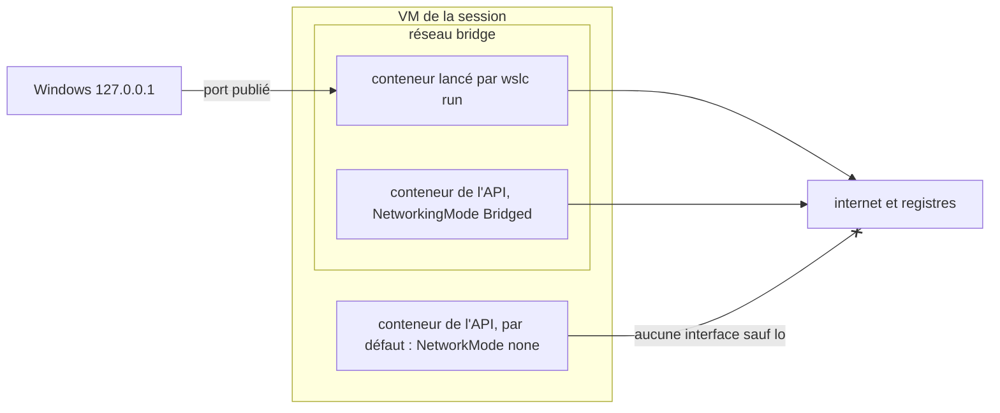

Docker Desktop est plus qu'un moteur. Il a un tableau de bord, une case à cocher Kubernetes, une place de marché d'extensions, et une configuration réseau à laquelle la plupart des développeurs n'ont jamais à penser : publier un port, ouvrir `localhost`, terminé. Cette dernière leçon compare ces parties une à une avec `wslc` 2.9.11, de la plus utile au quotidien, le réseau, à ce qui n'existe tout simplement pas.

Les sorties viennent du [journal](../journal/), sauf la vérification des capacités du conteneur lancé par la CLI, refaite pour cette leçon.

## Où écoute un port publié

Par défaut, `wslc` publie sur `127.0.0.1` seulement, comme tu l'as vu dans chaque colonne `PORTS` depuis la [leçon 3](../03-first-containers/) :

```text
CONTAINER ID   IMAGE   COMMAND                  CREATED         STATUS         PORTS                    NAMES
1796028d1f6a   nginx   "/docker-entrypoint.…"   3 seconds ago   Up 2 seconds   127.0.0.1:8080->80/tcp   web
```

Docker Desktop, à l'inverse, publie sur toutes les adresses, IPv4 et IPv6, sauf si tu en indiques une. Sous Windows, l'écoute du conteneur `wslc` appartient à un processus `dllhost` :

```text
TCP  0.0.0.0:8080     LISTENING  com.docker.backend
TCP  [::]:8080        LISTENING  com.docker.backend
TCP  127.0.0.1:8080   LISTENING  dllhost      ← wslc
TCP  [::1]:8080       LISTENING  wslrelay
```

Ce tableau vient du test de conflit de ports de la [leçon 5](../05-wslc-vs-docker/), avec Docker Desktop et `wslc` sur le même port. Deux réglages de `settings.yaml` modifient ce comportement ([leçon 6](../06-resources-and-limits/)) :

- `defaultBindingAddress`, `127.0.0.1` par défaut, est l'adresse qu'utilise `-p` quand tu n'en indiques pas ;
- `hostLoopback` concerne l'autre sens : le nom `host.wslc.internal`, pour un conteneur qui doit joindre un service tournant sous Windows. *À vérifier :* le nom a été lu dans le fichier de réglages, pas testé depuis un conteneur.

Une adresse explicite dans `-p` est acceptée : `wslc run -d -p 0.0.0.0:8082:80 nginx` a démarré sans erreur, et `127.0.0.1:8082` l'a atteint. *À vérifier :* si un tel port est alors joignable depuis une autre machine du réseau, ce qui dépend aussi du pare-feu Windows.

C'est un défaut prudent pour une machine de développement : une base de données ou un courtier de messages dans un conteneur n'a aucune raison d'être joignable depuis le réseau local.

## Les réseaux d'une session

Chaque session fait tourner son propre moteur, donc chacune a ses propres réseaux. La même commande `wslc network list`, depuis la session administrateur :

```text
> wslc network list
d9c6879f7df3   bridge    bridge    local
0dd65e6d15ec   host      host      local
34ad73ecd806   none      null      local
```

Les trois réseaux par défaut sont ceux de Docker : `bridge`, où `wslc run` branche un conteneur par défaut ; `host`, la pile réseau de la VM elle-même ; et `none`, aucun réseau. Dans la session non élevée, les trois mêmes réseaux ont des **identifiants différents**. Un réseau créé avec `wslc network create` dans une session n'existe pas dans l'autre.

`wslc network --help` liste `create`, `remove`, `inspect`, `list`, `prune`, `connect` et `disconnect`. La [leçon 8](../08-compose/) a montré la propriété la plus importante d'un réseau créé : les noms des conteneurs et les valeurs de `--network-alias` s'y résolvent comme noms DNS, alors que sur le réseau `bridge` par défaut, ils ne se résolvent pas.

## Les conteneurs de l'API démarrent sans réseau

La CLI et l'API n'ont pas le même comportement par défaut. `container.Inspect()` indique `"NetworkMode":"none"` quand `ContainerSettings.NetworkingMode` n'est pas renseigné. Le même conteneur Alpine, créé deux fois depuis C#, affiche `ip -4 addr` puis tente un `wget` vers internet :

```text
--- NetworkingMode=default
NetworkMode in inspect: none
    inet 127.0.0.1/8 scope host lo
no internet
--- NetworkingMode=Bridged
NetworkMode in inspect: bridge
    inet 127.0.0.1/8 scope host lo
    inet 172.17.0.2/16 brd 172.17.255.255 scope global eth0
internet ok
```

Sans le réglage, le conteneur n'a que l'interface de bouclage. Avec `Bridged`, il obtient une adresse `eth0` sur le réseau `bridge`, `172.17.0.2`, et atteint internet.

Le téléchargement de l'image fonctionne dans les deux cas, parce que c'est la session qui télécharge les images, pas le conteneur. Un programme peut donc télécharger une image, démarrer un conteneur et obtenir sa sortie, et ne découvrir l'absence de réseau que lorsque le service à l'intérieur essaie d'appeler l'extérieur, ou qu'un port publié ne répond pas.

```csharp
new ContainerSettings("alpine:latest")
{
    NetworkingMode = ContainerNetworkingMode.Bridged,
    // ...
}
```

Le schéma résume les trois cas de cette leçon.



## Kubernetes : non, même pas k3s

`wslc` n'a aucune commande Kubernetes, et l'application WSL Settings n'a pas de page Kubernetes. Avec Docker, un contournement courant consiste à faire tourner une petite distribution comme [k3s](https://k3s.io/) dans un conteneur privilégié. Elle a besoin de `--privileged`, parce que Kubernetes doit gérer les groupes de contrôle et les montages, précisément ce qu'on refuse normalement à un conteneur.

### Depuis la CLI

`wslc run --help` n'a ni option `--privileged` ni `--cap-add`. Sans elles, k3s s'arrête aussitôt :

```powershell
wslc run -d --name k3s-cli --tmpfs /run --tmpfs /var/run rancher/k3s:v1.36.4-k3s1 server
```

```text
time="2026-09-14T02:17:38Z" level=fatal msg="Error: failed to evacuate root cgroup: mkdir /sys/fs/cgroup/init: read-only file system"
```

Le système de fichiers des groupes de contrôle est monté en lecture seule dans le conteneur, donc k3s ne peut pas créer son propre groupe. Trois commandes montrent les limites d'un conteneur lancé par la CLI, refaites pour cette leçon :

```powershell
wslc run --rm alpine sh -c 'grep cgroup /proc/mounts; grep CapEff /proc/self/status; ls /dev | wc -l'
```

```text
cgroup /sys/fs/cgroup cgroup2 ro,nosuid,nodev,noexec,relatime 0 0
CapEff:	00000000a80425fb
15
```

- Le `ro` dans les options de montage est le système de fichiers des groupes de contrôle en lecture seule qui a arrêté k3s.
- `CapEff` est le masque de bits des **capacités** effectives du conteneur, les morceaux du pouvoir de root que Linux distribue un par un. `a80425fb` est le jeu par défaut de Docker, sans `CAP_SYS_ADMIN`, la capacité dont `mount` a besoin, entre autres.
- `/dev` a 15 entrées : seulement les périphériques de base, pas ceux de l'hôte.

### Depuis l'API : `Privileged` n'a aucun effet

L'API a ce qui manque à la CLI : `ContainerSettings.Privileged`. Deux conteneurs Alpine dans la même session, un pour chaque valeur, affichent les trois mêmes informations :

```text
--- Privileged=False
cgroup /sys/fs/cgroup cgroup2 ro,nosuid,nodev,noexec,relatime 0 0
CapEff:	00000000a80425fb
15
--- Privileged=True
cgroup /sys/fs/cgroup cgroup2 ro,nosuid,nodev,noexec,relatime 0 0
CapEff:	00000000a80425fb
15
```

Rien ne change : mêmes capacités, mêmes groupes de contrôle en lecture seule, mêmes 15 entrées dans `/dev`. Et k3s échoue avec la même erreur. Le suspect évident est la session : peut-être que les privilèges exigent une session élevée. Le même test **en administrateur**, dans une session limitée à 1 CPU et 1 Go, avec une vérification de plus, `mount -t tmpfs none /mnt` :

```text
elevated: True
--- Privileged=False  HostConfig={"Memory":0,"NanoCpus":0,"NetworkMode":"none","Ulimits":[]}
cgroup /sys/fs/cgroup cgroup2 ro,nosuid,nodev,noexec,relatime 0 0
CapEff:	00000000a80425fb
dev=15
mount: permission denied (are you root?)
mount denied
--- Privileged=True  HostConfig={"Memory":0,"NanoCpus":0,"NetworkMode":"none","Ulimits":[]}
cgroup /sys/fs/cgroup cgroup2 ro,nosuid,nodev,noexec,relatime 0 0
CapEff:	00000000a80425fb
dev=15
mount: permission denied (are you root?)
mount denied
```

Aucune différence non plus, et le `HostConfig` renvoyé par `Inspect()` n'a même pas de champ `Privileged`. Le drapeau existe pourtant dans l'en-tête C du SDK, sous la forme `WSLC_CONTAINER_FLAG_PRIVILEGED = 0x00000004` dans `wslcsdk.h` : déclaré, mais pas appliqué en 2.9.11. k3s n'a pas été retenté.

:::note[Kubernetes sur cette machine]
Pour un cluster local, utilise un outil fait pour cela au-dessus de Docker Desktop ou de Podman, comme [kind](https://kind.sigs.k8s.io/), qui fait tourner chaque nœud dans un conteneur. Le [cours Kubernetes](../../kubernetes/) de ce site fait exactement cela, avec les images de la [leçon 4](../04-build-an-image/). Surveille les notes de version de WSL pour `Privileged` dans une version ultérieure.
:::

## Extensions et interface graphique : aucune

- `wslc --help` liste `container`, `image`, `network`, `registry`, `settings`, `system`, `volume` et les raccourcis façon Docker. Il n'y a aucun mécanisme d'extension ou de plugin.
- `wslc settings` ouvre seulement `settings.yaml` dans l'éditeur par défaut.
- L'application **WSL Settings**, la seule application WSL du menu Démarrer à part `WSL` lui-même, n'a pas de page conteneurs. Ses pages sont `About`, `Developer`, `DistroManagement`, `DockerDesktopIntegration`, `FileSystem`, `General`, `GPUAcceleration`, `GUIApps`, `MemAndProc`, `Networking`, `NetworkingIntegration`, `OptionalFeatures`, `VSCodeIntegration`, `VSIntegration` et `WorkingAcrossFileSystems`.

Les vues quotidiennes du tableau de bord de Docker Desktop n'ont donc que des équivalents en ligne de commande : `wslc container list --all` pour les conteneurs, `wslc logs` pour leur sortie, `wslc stats` pour les ressources, `wslc image list` et `wslc volume list` pour le stockage.

## Ce que le cours a trouvé

`wslc` 2.9.11 est un **moteur d'exécution**, pas une plateforme. Il lance, construit, publie et limite des conteneurs Linux sans aucun produit tiers, et son API permet à une application Windows de posséder ses conteneurs, avec une image construite par `dotnet build` et chargée sans registre. Autour de ce cœur, il n'y a ni Compose, ni Kubernetes, ni conteneurs privilégiés, ni extensions, ni interface graphique. Pour un service isolé, un outil ou une application qui embarque des conteneurs, cela suffit. Pour un projet Compose, un cluster local ou une équipe qui partage une configuration Docker, Docker Desktop ou Podman reste l'outil, et les deux peuvent cohabiter sur une machine si tu gardes leurs ports séparés ([leçon 5](../05-wslc-vs-docker/)).

## À retenir

- `wslc` publie sur `127.0.0.1` par défaut, fixé par `defaultBindingAddress` ; Docker Desktop publie sur toutes les adresses.
- Chaque session a ses propres réseaux `bridge`, `host` et `none`, avec des identifiants différents, et ses propres réseaux créés par l'utilisateur.
- Les conteneurs créés par l'API ont `NetworkMode: none` tant que `NetworkingMode` n'est pas `Bridged`, même si le téléchargement de l'image fonctionne.
- La CLI n'a ni `--privileged` ni `--cap-add`, et k3s s'arrête sur un système de fichiers des groupes de contrôle en lecture seule.
- `ContainerSettings.Privileged` est déclaré mais n'a aucun effet en 2.9.11, dans une session normale comme dans une session élevée.
- Il n'y a ni extensions ni page conteneurs dans WSL Settings : `wslc` est un moteur d'exécution, et la CLI est sa seule interface.

## Exercices

1. Un programme C# démarre un conteneur nginx avec une redirection de port, mais `curl.exe http://127.0.0.1:8080/` n'obtient aucune réponse, alors que `wslc run -d -p 8080:80 nginx` fonctionne. Que vérifies-tu en premier ?

<details>
<summary>Solution</summary>

Le mode réseau. Un conteneur de l'API sans `NetworkingMode` a `NetworkMode: none`, seulement l'interface de bouclage, donc une redirection de port n'a rien vers quoi transférer. Vérifie avec `container.Inspect()` ou avec `wslc --session <name> container inspect <container>`, puis renseigne `NetworkingMode = ContainerNetworkingMode.Bridged`. *À vérifier :* le comportement exact de `PortMappings` sur un conteneur sans réseau, que le journal n'a pas testé.

</details>

2. Décode `CapEff: 00000000a80425fb` avec l'outil de ton choix, et dis si le conteneur a `CAP_NET_ADMIN`, le bit 12, et `CAP_SYS_ADMIN`, le bit 21.

<details>
<summary>Solution</summary>

`capsh --decode=00000000a80425fb`, des outils libcap d'une distribution Linux, liste les capacités par leur nom. À la main, en PowerShell :

```powershell
$caps = 0xa80425fb
(($caps -shr 12) -band 1), (($caps -shr 21) -band 1)
```

Les deux lignes affichent `0`. Le masque a les bits 0, 1, 3 à 8, 10, 13, 18, 27, 29 et 31 à un. Le bit 12 n'est pas à un, donc pas de `CAP_NET_ADMIN` : le conteneur ne peut pas modifier sa propre configuration réseau. Le bit 21 n'est pas à un non plus, donc pas de `CAP_SYS_ADMIN`, ce qui explique `mount: permission denied` en tant que root.

</details>

3. Tu veux savoir si une version ultérieure de WSL applique `Privileged`. Écris la plus petite vérification qui te le dirait, sans installer k3s.

<details>
<summary>Solution</summary>

Crée deux conteneurs depuis l'API, un avec `Privileged = false` et un avec `true`, qui lancent la même commande que dans cette leçon :

```text
grep cgroup /proc/mounts; grep CapEff /proc/self/status; ls /dev | wc -l
```

Un conteneur privilégié devrait montrer un `CapEff` différent, avec toutes les capacités, plus d'entrées dans `/dev`, et un `mount -t tmpfs none /mnt` qui réussit. Si les trois lignes sont identiques, le drapeau est toujours ignoré.

</details>

4. Depuis le terminal non élevé, tu as créé un réseau `demo` et lancé un conteneur dessus. Dans un terminal administrateur, `wslc network list` n'affiche pas `demo`, et l'identifiant de `bridge` est différent. Quelque chose est-il cassé ?

<details>
<summary>Solution</summary>

Non. Le terminal administrateur utilise une autre session, `wslc-cli-admin-<user>`, avec sa propre VM et son propre moteur, donc ses réseaux par défaut ont leurs propres identifiants et elle ne voit pas les réseaux de l'autre session. Utilise le même genre de terminal pour tout, ou nomme la session avec `--session`.

</details>

5. À partir des dix leçons, dresse la liste de ce qui te ferait choisir Docker Desktop plutôt que `wslc` pour un nouveau projet, et la liste de ce qui te ferait choisir `wslc`.

<details>
<summary>Solution</summary>

Docker Desktop, ou Podman : un `compose.yaml` à lancer, `depends_on` avec des conditions de santé, un cluster Kubernetes local, des conteneurs privilégiés, des outils qui ont besoin de l'API Docker Engine comme Testcontainers, une équipe déjà équipée de Docker, un tableau de bord graphique.

`wslc` : rien à installer au-delà de WSL, des services simples démarrés par un script, des limites et des disques par session faciles à mesurer et à supprimer, et surtout une application Windows qui fait tourner ses propres conteneurs Linux grâce à `Microsoft.WSL.Containers`, avec une image construite par `dotnet build`. Les deux listes valent pour la 2.9.11, une préversion : revois-les à chaque version.

</details>

## Sources

- [WSL container — Microsoft Learn](https://learn.microsoft.com/windows/wsl/wsl-container)
- [Référence de l'API WSL container](https://wsl.dev/api-reference/)
- [Networking overview](https://docs.docker.com/engine/network/) et [Runtime privilege and Linux capabilities](https://docs.docker.com/engine/containers/run/#runtime-privilege-and-linux-capabilities) — documentation Docker
- [capabilities(7)](https://man7.org/linux/man-pages/man7/capabilities.7.html) — page de manuel Linux
- [k3s](https://docs.k3s.io/) et [kind](https://kind.sigs.k8s.io/)
- [Notes de version WSL — GitHub](https://github.com/microsoft/WSL/releases)
