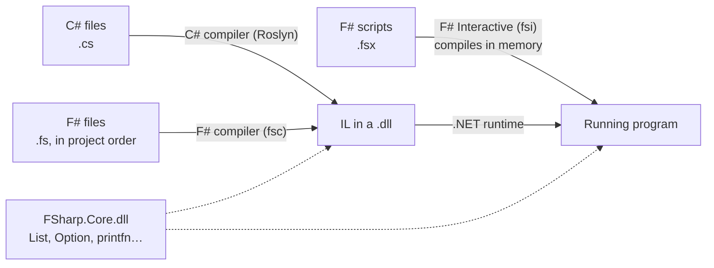
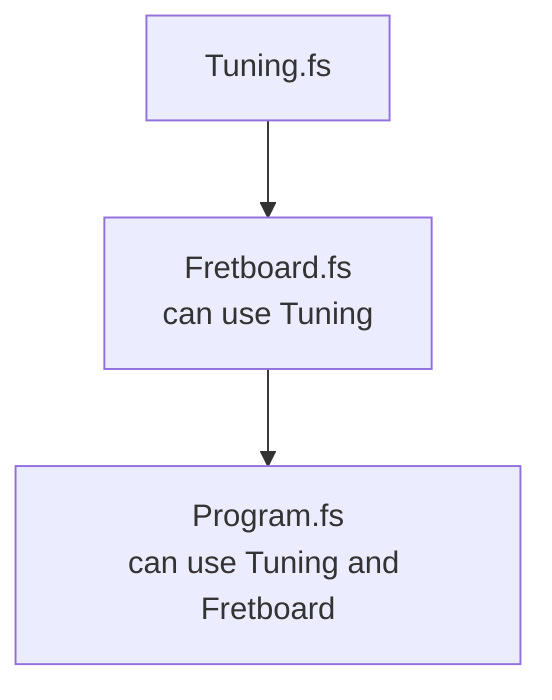

import { Tabs, TabItem } from '@astrojs/starlight/components';

Code: the scripts [`examples/l01_*.fsx`](https://github.com/spareilleux/learn/tree/14eebfd073566c52654d9f5671d893d392308871/code/fsharp/examples), the rejected snippets in [`compile_fail/`](https://github.com/spareilleux/learn/tree/14eebfd073566c52654d9f5671d893d392308871/code/fsharp/compile_fail), the session [`sessions/l01_fsi.txt`](https://github.com/spareilleux/learn/blob/14eebfd073566c52654d9f5671d893d392308871/code/fsharp/sessions/l01_fsi.txt) and the projects [`l01-project`](https://github.com/spareilleux/learn/tree/14eebfd073566c52654d9f5671d893d392308871/code/fsharp/l01-project/Hello) and [`l01-order`](https://github.com/spareilleux/learn/tree/14eebfd073566c52654d9f5671d893d392308871/code/fsharp/l01-order/Hello).

## F# in the .NET picture

F# is a .NET language, like C#. Its compiler turns `.fs` files into the same intermediate language (IL) and the same `.dll` files, which the same runtime runs. A C# project can reference an F# library and the other way around.



Three things differ from C#:

- **FSharp.Core.** F# programs use a library of their own, [FSharp.Core](https://fsharp.github.io/fsharp-core-docs/), for lists, options, `printfn` and the rest of the core functions. The SDK adds it to every F# project, and a published program ships its `FSharp.Core.dll`.
- **F# Interactive.** The SDK contains a REPL and script runner, [`dotnet fsi`](https://learn.microsoft.com/dotnet/fsharp/tools/fsharp-interactive/). F# has had one since its first versions; C# got file-based apps with .NET 10.
- **File order.** An F# project compiles its files in the order its `.fsproj` lists them, and a file can only use what the files above it define. [Files compile in order](#files-compile-in-order) explains why.

## Check the SDK

F# comes with the .NET SDK: there is nothing else to install. If `dotnet --version` doesn't answer, install the .NET 10 SDK as [lesson 1 of C# for beginners](../../csharp-beginner/01-first-program/#install-the-net-sdk) explains for each OS.

```text
> dotnet --version
10.0.112
> dotnet fsi --help
Microsoft (R) F# Interactive version 14.0.112.0 for F# 10.0
Copyright (c) Microsoft Corporation. All Rights Reserved.
…
```

F# Interactive 14.0.112 is the version of the tool; **F# 10.0** is the version of the language, the one [What's new in F# 10](https://learn.microsoft.com/dotnet/fsharp/whats-new/fsharp-10) describes. The course folder contains a [`global.json`](https://github.com/spareilleux/learn/blob/14eebfd073566c52654d9f5671d893d392308871/code/fsharp/global.json) that selects a version 10 SDK, since my machine also has a .NET 11 preview.

## F# Interactive

`dotnet fsi` alone starts an interactive session. You type code, end it with two semicolons `;;`, and F# Interactive compiles it, runs it, and prints what it defined:

```text
> let strings = 6;;
val strings: int = 6

> strings * 22;;
val it: int = 132

> let greet name = "Hello, " + name;;
val greet: name: string -> string

> greet "F#";;
val it: string = "Hello, F#"

> #quit;;
```

- `let strings = 6` defines a value. F# Interactive answers with its **name, type and value**: `val strings: int = 6`. You wrote no type: the compiler *inferred* it from `6`.
- An expression without `let`, like `strings * 22`, gets the name `it`.
- `greet` is a function. Its type, `name: string -> string`, reads "takes a string named `name` and returns a string". The compiler knows `name` is a string because `"Hello, " + name` adds it to a string. [Lesson 2](../02-values-and-functions/) comes back to inference and to the `->` arrows.
- `#quit;;` leaves the session.

This session is checked by the course: [`check.sh`](https://github.com/spareilleux/learn/blob/14eebfd073566c52654d9f5671d893d392308871/code/fsharp/check.sh) types the lines of [`sessions/l01_fsi.txt`](https://github.com/spareilleux/learn/blob/14eebfd073566c52654d9f5671d893d392308871/code/fsharp/sessions/l01_fsi.txt) into `dotnet fsi --nologo` and compares the answers. In C#, the closest tools are the C# Interactive window of Visual Studio and [.NET Interactive notebooks](https://github.com/dotnet/interactive); Java has `jshell`.

## Your first script

A script is a file with the `.fsx` extension. Create `hello.fsx` with one line:

```fsharp
printfn "Hello, world!"
```

```text
> dotnet fsi hello.fsx
Hello, world!
```

[`printfn`](https://fsharp.github.io/fsharp-core-docs/reference/fsharp-core-extratopleveloperators.html#printfn) prints a line, like `Console.WriteLine`. There are no parentheses around its argument, and no semicolon at the end: in F#, a function is called by writing its arguments after it, separated by spaces, and a line break ends the expression.

A longer script runs from top to bottom, like the top-level statements of a C# file:

```fsharp
// A script runs from top to bottom, like the top-level statements of a C# file
let tuning = "E2 A2 D3 G3 B3 E4"   // let gives a name to a value
let strings = 6

printfn "Guitar Alchemist tunes a guitar like this: %s" tuning
printfn "%d strings, %d frets each" strings 22

// Interpolated strings: {expression}, or %d{expression} to check the type too
printfn $"{strings} strings x 22 frets = {strings * 22} positions"
printfn $"%d{strings} strings"

// %A prints any value the way F# writes it
printfn "%A" [ "E2"; "A2"; "D3"; "G3"; "B3"; "E4" ]
```

```text
> dotnet fsi examples/l01_script.fsx
Guitar Alchemist tunes a guitar like this: E2 A2 D3 G3 B3 E4
6 strings, 22 frets each
6 strings x 22 frets = 132 positions
6 strings
["E2"; "A2"; "D3"; "G3"; "B3"; "E4"]
```

- `%s`, `%d` and `%A` are **format specifiers**: a string, an integer, and any value. `printfn "%d strings, %d frets each" strings 22` takes one argument per specifier. The [plain text formatting](https://learn.microsoft.com/dotnet/fsharp/language-reference/plaintext-formatting) page lists them all.
- `$"…"` is an [interpolated string](https://learn.microsoft.com/dotnet/fsharp/language-reference/interpolated-strings), as in C#. `%d{strings}` adds a type check to the hole.
- `[ "E2"; "A2"; … ]` is a list; its elements are separated by `;`. Lesson 5 is about lists.
- `//` starts a comment, as in C#. `(* … *)` surrounds a comment on several lines.

The tuning is Guitar Alchemist's default one, written `E2 A2 D3 G3 B3 E4` in [`Tuning.cs`](https://github.com/GuitarAlchemist/ga/blob/32f143c866c126338b332e384e4a615cd4b44381/Common/GA.Domain.Core/Instruments/Tuning.cs#L20-L23).

## The format string is type-checked

In C#, `Console.WriteLine("{0} strings", "six")` compiles: the placeholders accept anything. In F#, the compiler reads the format string:

```fsharp
let strings = "six"
printfn "Starting the script"
printfn "%d strings" strings
```

```text
> dotnet fsi compile_fail/l01_format_type.fsx
l01_format_type.fsx(3,22): error FS0001: The type 'string' is not compatible with any of the types byte,int16,int32,int64,sbyte,uint16,uint32,uint64,nativeint,unativeint, arising from the use of a printf-style format string
```

The message has the same parts as a C# error: file, `(line,column)`, `error`, a code, and the text. F# codes start with `FS`; the [compiler messages](https://learn.microsoft.com/dotnet/fsharp/language-reference/compiler-messages/) page documents some of them. `FS0001` is the most common one: a type mismatch.

Notice what didn't happen: `Starting the script` wasn't printed. F# Interactive **checks the whole script before running any of it**. A script with an error runs nothing.

## Indentation is syntax

F# has no braces around blocks: the indentation says where a block starts and ends, as in Python. The F# documentation calls it the [offside rule](https://learn.microsoft.com/dotnet/fsharp/language-reference/code-formatting-guidelines#indentation).

```fsharp
let describe name =
    let label = name + " major"
  label

printfn "%s" (describe "C")
```

```text
l01_indentation.fsx(2,5): error FS0588: The block following this 'let' is unfinished. Every code block is an expression and must have a result. 'let' cannot be the final code element in a block. Consider giving this block an explicit result.
```

The body of `describe` is the block indented under it. `label`, indented by two spaces instead of four, is outside that block, so the block ends with `let label = …` and has no result. The message says something important about F#: **every block is an expression and has a result**, the value of its last line. There is no `return`:

```fsharp
let describe name =
    let label = name + " major"
    label   // the last expression of the block is the result of the function

printfn "%s" (describe "C")
```

```text
C major
```

Use spaces, not tabs: F# rejects tabs in indentation. Four spaces is the convention of the [F# style guide](https://learn.microsoft.com/dotnet/fsharp/style-guide/formatting).

## Referencing a NuGet package

A script can use a NuGet package with `#r "nuget: …"`. F# Interactive downloads it on the first run and keeps it in the NuGet cache:

```fsharp
// A script can reference a NuGet package: dotnet fsi downloads it on the first run
#r "nuget: FParsec, 1.1.1"

open FParsec

// FParsec is the parser library of Guitar Alchemist's music DSL (lesson 11)
printfn "%A" (run pint32 "22")
printfn "%A" (run pint32 "twenty-two")
```

```text
Success: 22
Failure:
Error in Ln: 1 Col: 1
twenty-two
^
Expecting: integer number (32-bit, signed)
```

- `open FParsec` is C#'s `using FParsec;` and Java's `import`.
- [FParsec](https://www.quanttec.com/fparsec/) is a parser combinator library. `run pint32 "22"` runs the parser of a 32-bit integer on the text. GA's `GA.Business.DSL` project uses FParsec 1.1.1 to parse chord symbols; lesson 4 runs that parser.

C# file-based apps have the same feature with `#:package`. The [F# Interactive page](https://learn.microsoft.com/dotnet/fsharp/tools/fsharp-interactive/#referencing-packages-in-f-interactive) describes the other directives: `#load` loads another `.fs` or `.fsx` file, `#r` a `.dll`, `#I` adds a folder to search.

## A project

Scripts are good for exploring and for tools. An application or a library is a project:

```text
> dotnet new console -lang "F#" -o Hello
The template "Console App" was created successfully.

Processing post-creation actions...
Restoring C:\Users\spare\…\Hello\Hello.fsproj:
  Determining projects to restore...
  Restored C:\Users\spare\…\Hello\Hello.fsproj (in 535 ms).
Restore succeeded.
```

The template writes two files:

```xml
<Project Sdk="Microsoft.NET.Sdk">

  <PropertyGroup>
    <OutputType>Exe</OutputType>
    <TargetFramework>net10.0</TargetFramework>
  </PropertyGroup>

  <ItemGroup>
    <Compile Include="Program.fs" />
  </ItemGroup>

</Project>
```

```fsharp
// For more information see https://aka.ms/fsharp-console-apps
printfn "Hello from F#"
```

Compare with the `.csproj` of `dotnet new console` in C#: there is no `ImplicitUsings` and no `Nullable`, and there is an `ItemGroup` that **lists the source files**. A C# project compiles every `.cs` file in its folder; an F# project compiles the files of its `Compile` items, in that order, and nothing else.

Let's add a file. The project in [`l01-project/Hello`](https://github.com/spareilleux/learn/tree/14eebfd073566c52654d9f5671d893d392308871/code/fsharp/l01-project/Hello) has a `Tuning.fs`:

```fsharp
module Tuning

let standard = "E2 A2 D3 G3 B3 E4"

let describe name = name + " tuning: " + standard
```

listed before `Program.fs`:

```xml
  <ItemGroup>
    <Compile Include="Tuning.fs" />
    <Compile Include="Program.fs" />
  </ItemGroup>
```

and `Program.fs` uses it:

```fsharp
// For more information see https://aka.ms/fsharp-console-apps
printfn "Hello from F#"

// Program.fs is the last file of Hello.fsproj: it sees Tuning.fs, listed above it
printfn "%s" (Tuning.describe "Standard")
```

```text
> dotnet run --project l01-project/Hello
Hello from F#
Standard tuning: E2 A2 D3 G3 B3 E4
```

`module Tuning` puts the file's definitions in a module named `Tuning`, which compiles to a static class; `Tuning.describe` calls a function of that module. Lesson 6 is about modules and namespaces.

<Tabs syncKey="os">
<TabItem label="Windows">

`dotnet build` writes the program to `bin\Debug\net10.0\`: `Hello.dll`, `Hello.exe`, and `FSharp.Core.dll`, with folders such as `cs`, `de`, `es` and `fr` that hold the translated resources of FSharp.Core.

</TabItem>
<TabItem label="Linux / WSL">

`dotnet build` writes the program to `bin/Debug/net10.0/`: `Hello.dll`, an executable `Hello`, and `FSharp.Core.dll`, with folders such as `cs`, `de`, `es` and `fr` for the translated messages of FSharp.Core (*to verify*: I built the project on Windows, and on Linux only in CI).

</TabItem>
<TabItem label="macOS">

`dotnet build` writes the program to `bin/Debug/net10.0/`: `Hello.dll`, an executable `Hello`, and `FSharp.Core.dll`, with folders such as `cs`, `de`, `es` and `fr` for the translated messages of FSharp.Core (*to verify*: I built the project on Windows, and on macOS only in CI).

</TabItem>
</Tabs>

## Files compile in order

Now a project where the order is wrong. In [`l01-order/Hello`](https://github.com/spareilleux/learn/tree/14eebfd073566c52654d9f5671d893d392308871/code/fsharp/l01-order/Hello), `Fretboard.fs` uses `Tuning`, but the project lists it first:

```xml
  <ItemGroup>
    <Compile Include="Fretboard.fs" />
    <Compile Include="Tuning.fs" />
    <Compile Include="Program.fs" />
  </ItemGroup>
```

```fsharp
module Fretboard

// Uses Tuning, which Hello.fsproj lists after this file
let positions frets = Tuning.strings * (frets + 1)
```

```text
> dotnet build l01-order/Hello
Fretboard.fs(4,23): error FS0039: The value, namespace, type or module 'Tuning' is not defined.
```

`Tuning` exists, but it is defined *after* `Fretboard.fs`, so `Fretboard.fs` can't see it. Moving `Tuning.fs` above `Fretboard.fs` fixes the build.



This isn't a limitation that F# forgot to remove; it is a design choice. Since a file only depends on the files above it, **there are no dependency cycles between files**, and you can read a project from top to bottom: the basic types first, the program last. Type inference also relies on it: the compiler checks each file knowing everything above it. Rider, Visual Studio and Ionide let you move files up and down in the project.

Real projects show the same structure. GA's [`GA.Business.DSL.fsproj`](https://github.com/GuitarAlchemist/ga/blob/32f143c866c126338b332e384e4a615cd4b44381/Common/GA.Business.DSL/GA.Business.DSL.fsproj#L8-L57) lists 48 files: the types first (`Types/ChordAst.fs`, `Types/MusicalSetTypes.fs`…), then the parsers that produce those types, the generators that render them, the services that use both, and `Library.fs` last. TARS's [`Tars.Core.fsproj`](https://github.com/GuitarAlchemist/tars/blob/87464ce583c42cd11c3d76836e05842377455b24/v2/src/Tars.Core/Tars.Core.fsproj#L32-L37) keeps a trace of the order problem in a comment:

```xml
    <Compile Include="SymbolicReflection.fs" />
    <!-- Moved here for dependency reasons -->
    <Compile Include="WorkflowOfThought\ExecutionTypes.fs" />
    <Compile Include="WorkflowOfThought\AgentRegistry.fs" />
    <Compile Include="WorkflowOfThought\TraceTypes.fs" />
    <Compile Include="Abstractions.fs" />
```

These three files of the `WorkflowOfThought` folder sit in the middle of the list, while the other ten files of that folder come at its end: files in between depend on them. The project also sets `EnableDefaultCompileItems` to `false`, which only makes sure that the SDK adds no file on its own.

The explicit list has a consequence that C# developers don't expect: **a `.fs` file that isn't listed isn't compiled**, even in the project folder. TARS's `v2/src` folder contains nine `.fs` files (`Fibonacci.fs`, `Program.fs`, `Main.fs`…) that no project lists: nothing builds them, and nothing tells you. The [journal](../journal/) has the details.

## The entry point

A console application starts at the top of its **last file**, as `Program.fs` above. A C# developer can also keep the familiar `Main` method, with the [`[<EntryPoint>]`](https://learn.microsoft.com/dotnet/fsharp/language-reference/functions/entry-point) attribute. GA's language server for its music DSL, [`GaMusicTheoryLsp`](https://github.com/GuitarAlchemist/ga/blob/32f143c866c126338b332e384e4a615cd4b44381/Apps/GaMusicTheoryLsp/Program.fs#L8-L20), does that:

```fsharp
[<EntryPoint>]
let main argv =
    eprintfn "Starting Music Theory DSL Language Server..."
    eprintfn "Listening on stdin/stdout for LSP messages..."

    try
        // Run the LSP server
        LanguageServer.run ()
        0
    with ex ->
        eprintfn "Fatal error: %s" ex.Message
        eprintfn "Stack trace: %s" ex.StackTrace
        1
```

- `[<EntryPoint>]` is an attribute: F# writes attributes between `[<` and `>]`, where C# uses `[` and `]`.
- `main` takes the command-line arguments `argv` (a `string[]`) and returns the exit code: `0` or `1`, the last expression of each branch. It is C#'s `static int Main(string[] args)`.
- `eprintfn` prints to standard error, which matters here: a language server talks to the editor on standard output.
- `try … with ex ->` is `try … catch (Exception ex)`, and it is an expression too: its value is `0` or `1`.

The entry point must be the last declaration of the last file.

## Choose an editor

| Editor | Runs on | F# support |
|---|---|---|
| [Visual Studio Code](https://code.visualstudio.com/) with [Ionide](https://ionide.io/) | Windows, Linux, macOS | free; Ionide is the community F# extension, built on the F# compiler service |
| [JetBrains Rider](https://www.jetbrains.com/rider/) | Windows, Linux, macOS | F# support built in; free for non-commercial use |
| [Visual Studio](https://visualstudio.microsoft.com/) | Windows | F# support built in; the Community edition is free for individuals |

All three can send the selected lines of a script to F# Interactive, with <kbd>Alt</kbd>+<kbd>Enter</kbd> by default (*to verify*: the lessons of this course were run from the command line, not from an editor). Licenses change over time: read each editor's terms when you install it.

## Key takeaways

- F# compiles to the same IL as C# and uses FSharp.Core; F# 10 ships with the .NET 10 SDK.
- `dotnet fsi` is a REPL (end each input with `;;`) and runs `.fsx` scripts; a script is checked completely before any of it runs, and can reference NuGet packages with `#r "nuget: …"`.
- `printfn` format strings are type-checked; a block's result is its last expression, and indentation delimits blocks.
- An F# project lists its files in the `.fsproj` and compiles them in that order; a file sees only the files above it, and unlisted files aren't compiled.
- A console application starts at the top of its last file, or at a function marked `[<EntryPoint>]`.

## Exercises

1. Write a script `chord.fsx` that prints the name of a chord, the six strings, and the frets of a C major chord (`x 3 2 0 1 0`), then the sum of the three fretted numbers computed by F#. Use `printfn` with a format specifier for each value.

<details>
<summary>Solution</summary>

[`exercises/l01_ex_chord.fsx`](https://github.com/spareilleux/learn/blob/14eebfd073566c52654d9f5671d893d392308871/code/fsharp/exercises/l01_ex_chord.fsx):

```fsharp
// A C major chord (x32010): its name, the strings, and the frets to press
let name = "C major"
let frets = "x 3 2 0 1 0"

printfn "%s" name
printfn "E A D G B E"
printfn "%s" frets
printfn "Frets played: %d" (3 + 2 + 1)
```

```text
C major
E A D G B E
x 3 2 0 1 0
Frets played: 6
```

The parentheses around `3 + 2 + 1` are needed: without them, `printfn "Frets played: %d" 3 + 2 + 1` would give `3` to `printfn`, then try to add `2` to what `printfn` returns. Function application binds tighter than operators.

</details>

2. GA's [`Scripts/ModesConfig.fsx`](https://github.com/GuitarAlchemist/ga/blob/32f143c866c126338b332e384e4a615cd4b44381/Scripts/ModesConfig.fsx#L20-L21) prints the alternate names of a mode with this line. Here it is reduced to a list; run it, fix what F# reports, and run again until it works.

```fsharp
// Reduced from Guitar Alchemist's Scripts/ModesConfig.fsx: the same printfn line, with a list instead of the config file
let names = [ "Major"; "Ionian mode" ]
printfn $"  Alternate Names: %s{String.Join(", ", names)}"
```

<details>
<summary>Solution</summary>

The first run stops on the string:

```text
l01_ex_modes.fsx(3,45): error FS3373: Invalid interpolated string. Single quote or verbatim string literals may not be used in interpolated expressions in single quote or verbatim strings. Consider using an explicit 'let' binding for the interpolation expression or use a triple quote string as the outer string literal.

l01_ex_modes.fsx(3,47): error FS3373: Invalid interpolated string. Single quote or verbatim string literals may not be used in interpolated expressions in single quote or verbatim strings. Consider using an explicit 'let' binding for the interpolation expression or use a triple quote string as the outer string literal.
```

An interpolated string between single double quotes, `$"…"`, can't contain `", "` inside its holes: F# reads the `"` as the end of the string. As the message suggests, a triple-quoted string `$"""…"""` can contain quotes. The second run gets further:

```text
l01_ex_modes_step2.fsx(3,42): error FS0039: The value, constructor, namespace or type 'Join' is not defined.
```

`String.Join` is `System.String.Join`. Without `open System`, `String` is FSharp.Core's [`String` module](https://fsharp.github.io/fsharp-core-docs/reference/fsharp-core-stringmodule.html), which has `String.concat` but no `Join`. The fixed script ([`exercises/l01_ex_modes_fixed.fsx`](https://github.com/spareilleux/learn/blob/14eebfd073566c52654d9f5671d893d392308871/code/fsharp/exercises/l01_ex_modes_fixed.fsx)):

```fsharp
// Step 3: String.Join is System.String.Join, so the script needs open System
open System

let names = [ "Major"; "Ionian mode" ]
printfn $"""  Alternate Names: %s{String.Join(", ", names)}"""
```

```text
  Alternate Names: Major, Ionian mode
```

GA's script has the same line, and no `open System`: it doesn't run. The [journal](../journal/) describes what else stops it.

</details>

3. In the project of [A project](#a-project), delete the line `module Tuning` at the top of `Tuning.fs` and build. What does the compiler say, and why does `Program.fs` not need such a line?

<details>
<summary>Solution</summary>

```text
Tuning.fs(1,1): error FS0222: Files in libraries or multiple-file applications must begin with a namespace or module declaration, e.g. 'namespace SomeNamespace.SubNamespace' or 'module SomeNamespace.SomeModule'. Only the last source file of an application may omit such a declaration.
```

Every file of a project except the last one must say which module or namespace its definitions belong to, so that other files can name them (`Tuning.describe`). The last file of an application is the program itself: nothing comes after it that would need to call it by name, so it may omit the declaration. The project is [`l01-ex-module/Hello`](https://github.com/spareilleux/learn/tree/14eebfd073566c52654d9f5671d893d392308871/code/fsharp/l01-ex-module/Hello).

</details>

## Sources

- [Get started with F#](https://learn.microsoft.com/dotnet/fsharp/get-started/), [F# Interactive](https://learn.microsoft.com/dotnet/fsharp/tools/fsharp-interactive/)
- [What's new in F# 10](https://learn.microsoft.com/dotnet/fsharp/whats-new/fsharp-10)
- [Plain text formatting](https://learn.microsoft.com/dotnet/fsharp/language-reference/plaintext-formatting), [interpolated strings](https://learn.microsoft.com/dotnet/fsharp/language-reference/interpolated-strings)
- [Code formatting guidelines: indentation](https://learn.microsoft.com/dotnet/fsharp/language-reference/code-formatting-guidelines), [F# formatting guidelines](https://learn.microsoft.com/dotnet/fsharp/style-guide/formatting)
- [Modules](https://learn.microsoft.com/dotnet/fsharp/language-reference/modules), [console applications and the entry point](https://learn.microsoft.com/dotnet/fsharp/language-reference/functions/entry-point)
- [The F# language specification](https://fsharp.org/specs/language-spec/), section on the compilation order of files
