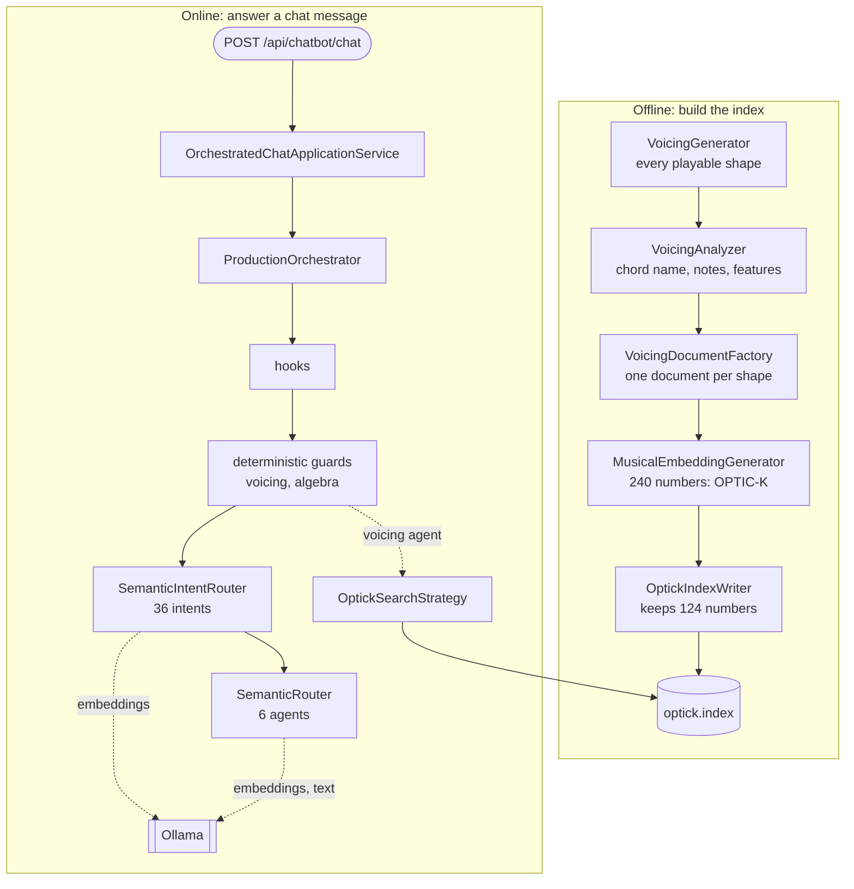

"GA's AI" is not one component. It is a pipeline that computes a vector for every chord shape a guitar can play and stores them in a file, and a web host that answers chat messages, sometimes with that file, sometimes with plain C# code, sometimes with a language model. This lesson draws both, then opens the chatbot host and lists what it really registers, so that the next three lessons each zoom into one box of the map.

All GA links point to commit [`a826864`](https://github.com/GuitarAlchemist/ga/tree/a826864f3a012cad88e415954bf57eca0ce12aa6).

## Running the code

The course program lives in [`code/ga-ai`](https://github.com/spareilleux/learn/tree/main/code/ga-ai). The first run clones the parts of GA it needs into `code/ga-ai/.ga`, builds everything and compares every lesson with its expected output:

```bash
bash code/ga-ai/check.sh
```

On Windows, run it from Git Bash; the commands are the same on the three systems. The clone is blobless and sparse: [`fetch-ga.sh`](https://github.com/spareilleux/learn/blob/8e335d7/code/ga-ai/fetch-ga.sh) checks out 17 project folders, about 11 MB of source, and never touches a clone of GA you may already have. On the CI runners, a whole run, clone and build included, takes 1.5 minutes on Linux and 3 on Windows. Then each lesson runs on its own:

```bash
dotnet run --project code/ga-ai/GaAi -c Release -- l1
```

## Five layers

GA's [`CLAUDE.md`](https://github.com/GuitarAlchemist/ga/blob/a826864f3a012cad88e415954bf57eca0ce12aa6/CLAUDE.md#L20-L30) describes a strict bottom-up model of five layers, and a rule: AI code goes in layer 4, orchestration in layer 5, never lower.

| Layer | Projects | What the AI side uses from it |
|---|---|---|
| 1. Core | `GA.Core`, `GA.Domain.Core` | notes, pitch classes, the fretboard, set classes: the [music theory course](../../music-theory-ga/) reads these |
| 2. Domain | `GA.Business.Core`, `GA.Business.Config` | the records a voicing analysis fills |
| 3. Analysis | voicing generation and analysis (in `GA.Domain.Services` at this commit) | `VoicingGenerator`, `VoicingAnalyzer` |
| 4. AI/ML | `GA.Business.ML` | the OPTIC-K schema, the embedding generator, the index reader and search, the agents and intents |
| 5. Orchestration | `GA.Business.Core.Orchestration` | `ProductionOrchestrator`, the skills plugin, the warm-up services |

The layer 3 projects `CLAUDE.md` names, `GA.Business.Core.Harmony` and `GA.Business.Core.Fretboard`, are not the ones that hold the voicing code at this commit: `VoicingGenerator` and `VoicingAnalyzer` are in `Common/GA.Domain.Services`. The apps sit above the five layers: the chatbot host is [`Apps/GaChatbot.Api`](https://github.com/GuitarAlchemist/ga/tree/a826864f3a012cad88e415954bf57eca0ce12aa6/Apps/GaChatbot.Api), and the tool that writes the index is a demo project, [`Demos/Music Theory/FretboardVoicingsCLI`](https://github.com/GuitarAlchemist/ga/tree/a826864f3a012cad88e415954bf57eca0ce12aa6/Demos/Music%20Theory/FretboardVoicingsCLI).

## Two pipelines

The diagram shows the two halves. The first group is work done once, offline: every playable chord shape becomes a vector, and the vectors go into one file. The second group is work done for each chat message.



Lesson 2 opens the embedding box, lesson 3 the index and its search, lesson 4 the orchestrator. Two remarks already:

- **The same schema is used on both sides.** A search query is turned into a vector with the same partitions and weights as the stored shapes, so that a dot product between them means something. If the two drift apart, the index file's header carries a hash of the layout, and the reader refuses a file written with another one (lesson 3).
- **The model server is optional for some paths and required for others.** GA talks to [Ollama](https://ollama.com/), a local server for open-weight models, through [Microsoft.Extensions.AI](https://learn.microsoft.com/dotnet/ai/microsoft-extensions-ai): `IEmbeddingGenerator` for embeddings, `IChatClient` for text. Lesson 4 shows which questions survive without it.

## The sibling repositories

GA's [`CLAUDE.md`](https://github.com/GuitarAlchemist/ga/blob/a826864f3a012cad88e415954bf57eca0ce12aa6/CLAUDE.md#L55-L59) names three repositories that exchange files with it:

- **[ix](https://github.com/GuitarAlchemist/ix)**, machine learning algorithms in Rust, "produces `state/voicings/optick.index` consumed by GA's RAG layer", and trains sparse autoencoders on it. In GA's code, though, the file is written by the C# `OptickIndexWriter` of `FretboardVoicingsCLI`: GA's own [`optic-k-rebuild` skill](https://github.com/GuitarAlchemist/ga/blob/a826864f3a012cad88e415954bf57eca0ce12aa6/.claude/skills/optic-k-rebuild/SKILL.md#L71-L112) builds the index with that CLI, then runs ix's diagnostics on it. Whether ix can also write the file is *to verify*. The [IX course](../../machine-learning-ix/) reads ix's code at another commit.
- **[Demerzel](https://github.com/GuitarAlchemist/Demerzel)**, governance: its pipelines run the reviews GA's contracts describe, and it generates the [Streeling](../../streeling/) modules on this site.
- **[TARS](https://github.com/GuitarAlchemist/tars)**, in F#, is described as a "cross-model theory validator". Nothing in this course calls it.

## What the chatbot host registers

The canonical chatbot host is `GaChatbot.Api`: GA's [chat surfaces document](https://github.com/GuitarAlchemist/ga/blob/a826864f3a012cad88e415954bf57eca0ce12aa6/docs/architecture/chat-surfaces.md#L16-L21) says so since 2026-05-13, and says it serves the public demo at `demos.guitaralchemist.com/chatbot/`. The host has three modes. [`AddMinimalChatbotApi`](https://github.com/GuitarAlchemist/ga/blob/a826864f3a012cad88e415954bf57eca0ce12aa6/Apps/GaChatbot.Api/Extensions/ServiceCollectionExtensions.cs#L22-L50) reads `Chatbot:Mode`, `direct` by default: `direct` sends every message to the model, `routed` uses a lightweight router, and `full` (or `orchestrated`) registers the whole orchestration stack. The course uses `full`.

Rather than read the registrations, the program starts the host and asks its container. [`WebApplicationFactory<TEntryPoint>`](https://learn.microsoft.com/aspnet/core/test/integration-tests) is the class ASP.NET Core integration tests use: it runs an app's `Program` inside the test process, with an in-memory server, and lets the caller override settings and services. The course's [`ChatHost.cs`](https://github.com/spareilleux/learn/blob/8e335d7/code/ga-ai/GaAi/ChatHost.cs#L38-L43) is a console program's version of it:

```csharp
builder.UseSetting("Chatbot:Mode", "full");
builder.UseSetting("Chatbot:PathBase", "");
builder.UseSetting("Ollama:BaseUrl", DeadOllama);
builder.UseSetting("Ollama:Endpoint", DeadOllama);
builder.UseSetting("VoicingSearch:OpticIndexPath", Lesson3.IndexPath);
builder.UseSetting("IX:External:Enabled", "false");
```

`DeadOllama` is `http://127.0.0.1:9`, a port nothing listens on, so every model call fails at once, as on a CI runner. The index is a small one lesson 3 builds. The chat memory, which GA stores in `~/.ga` by default, is redirected to files next to the program, so a run never reads or changes the author's. Then [`Lesson1.cs`](https://github.com/spareilleux/learn/blob/8e335d7/code/ga-ai/GaAi/Lesson1.cs) resolves a few services:

```text
== Orchestrator and application service
IHarmonicChatOrchestrator        ProductionOrchestrator
IChatApplicationService (host)   OrchestratedChatApplicationService
```

### 36 intents

An **intent**, here, is a C# object that can answer one kind of question, with a list of example prompts. The semantic intent router compares a message with those examples (lesson 4). The host registers 36:

```text
== Intents the semantic router chooses from (36)
id                           examples  first example
skill.chordinfo              32        What is a C major chord?
skill.scaleinfo              24        What notes are in C major?
skill.modes                  37        What are the modes of the major scale
skill.interval               13        What is the interval between C and G?
skill.fretspan               0         (none)
skill.chordsubstitution      12        Tritone substitution for G7
skill.beginnerchords         7         Show me some easy beginner chords
skill.progressionmood        15        How do I make this progression sound darker?
skill.circleoffifths         10        Explain the circle of fifths
skill.practiceroutine        9         give me a 20 minute practice routine
skill.genreessentials        8         essential chords for blues guitar
skill.whatcanyoudo           14        what can you do
skill.transpose              13        transpose this progression down a half step
skill.commontones            9         What notes do Cmaj7 and Am7 share?
skill.diatonicchords         20        Give me the diatonic chords in C major
skill.relativekey            12        What is the relative minor of G major
skill.theorycomparison       7         What is the difference between major and minor
skill.settheoryequivalence   5         Are pitch classes 0,1,4 and 0,1,6 equivalent under inversion
skill.capo                   10        What shape do I play in E with capo 4
skill.voiceleading           10        voice leading from C to F
skill.alternatetunings       12        what is DADGAD tuning
skill.intervalclassvector    10        what is the interval-class vector of Cmaj7
skill.grothendieckdelta      10        how harmonically far is Am from D7
skill.icvneighbors           10        which chords are most similar to Dm7
skill.icvshortestpath        10        shortest harmonic path from Cmaj7 to G7
skill.grothendieckparse      10        parse C ⊗ G
skill.chordvoicings          12        voicings for Cmaj7
skill.improvisation          17        what scale can I use to solo over Cmaj7?
skill.outsidenotes           10        why does F sound outside over Cmaj7
skill.keyidentification      7         What key is C Am F G in?
skill.progressioncompletion  5         What chord comes next after C G Am?
skill.rememberthis           7         remember that I prefer drop-2 voicings for jazz comping
algebra                      13        Are 0146 and 0137 z-related?
tab.optimize                 5         Make this progression smoother to play
tab.analyze                  4         Analyse this tab
voicing                      11        Show me Drop 2 voicings of Cmaj7
```

32 of them wrap a **skill**, a class implementing `IOrchestratorSkill` that [`GaPlugin`](https://github.com/GuitarAlchemist/ga/blob/a826864f3a012cad88e415954bf57eca0ce12aa6/Common/GA.Business.Core.Orchestration/Plugins/GaPlugin.cs#L32-L40) registers three times over: as itself, as `IOrchestratorSkill`, and wrapped in an `OrchestratorSkillIntent`. One of them, `skill.fretspan`, has no example, and the router [skips intents without examples](https://github.com/GuitarAlchemist/ga/blob/a826864f3a012cad88e415954bf57eca0ce12aa6/Common/GA.Business.ML/Agents/Intents/SemanticIntentRouter.cs#L95-L96): it can never be chosen by similarity.

### 6 agents and 4 hooks

An **agent**, in GA's code, is a class that answers with a language model, possibly calling tools. Messages no intent claims go to one of six:

```text
== Agents behind the LLM path (6)
tab          TabAgent
theory       TheoryAgent
technique    TechniqueAgent
composer     ComposerAgent
critic       CriticAgent
voicing      VoicingAgent

== Hooks, in the order they run (4)
PromptSanitizationHook
MemoryHook
MemoryWriteHook
ObservabilityHook
```

A **hook** runs at fixed points of every request: when it arrives, before and after a skill, when the response leaves. It's the same idea as the hooks of the [agentic coding course](../../agentic-coding/03-hooks-skills-subagents/), on the other side: there, code around an agent you use; here, code around the agents GA runs.

The last line of the lesson ties the two pipelines together:

```text
== The embedding every voicing gets
OPTIC-K-v1.8, 240 dims in 11 partitions, 124 of them searched
```

## What the chatbot is meant to become

GA's [chatbot roadmap](https://github.com/GuitarAlchemist/ga/blob/a826864f3a012cad88e415954bf57eca0ce12aa6/docs/plans/2026-05-07-chatbot-roadmap.md#L23-L25) states its North Star in one sentence: the chatbot is "the conversational front end to the Guitar Alchemist domain", in which "each user query is **routed by intent**, **answered by the domain**, **formatted by the skill**, and **shaped by the LLM only at the prose layer**". The model writes sentences; the facts come from GA's typed music theory.

Issue [#623](https://github.com/GuitarAlchemist/ga/issues/623), opened on 2026-08-01 and marked P0, turns that into a user-visible goal: a guitarist gives a chord progression and a tuning, and gets the key and chord functions, scale and arpeggio choices, playable voicings with little hand movement between them, and an explanation of the trade-offs. Issue [#589](https://github.com/GuitarAlchemist/ga/issues/589) names the risk it answers: "free-form LLM text asserting music-theory claims nothing validates", and proposes that the model only fill a JSON structure that the theory engine checks.

Where things stand, as far as this course can tell on 2026-09-14:

| Status | What | Evidence |
|---|---|---|
| Works, verified here | OPTIC-K vectors, the index writer and reader, search by chord symbol, the algebra and voicing paths of the chatbot, the skills called directly | lessons 2 to 4, run in CI without a model |
| Works with a model, not verified here | routing by embeddings, the six agents, prose answers | needs Ollama; not run by this course (*to verify*) |
| Known problems, open | the CONTEXT partition carries nothing ([#616](https://github.com/GuitarAlchemist/ga/issues/616)); wrong advice on borrowed chords ([#567](https://github.com/GuitarAlchemist/ga/issues/567)); "E-flat major" read as E major ([#554](https://github.com/GuitarAlchemist/ga/issues/554)); keys of cadences ([#614](https://github.com/GuitarAlchemist/ga/issues/614)) | GA's issues, open on 2026-09-14 |
| Planned | the progression-to-voicing coach ([#623](https://github.com/GuitarAlchemist/ga/issues/623)); validated structured output ([#589](https://github.com/GuitarAlchemist/ga/issues/589)) | proposed, open |
| Research | latent world models and planning over OPTIC-K ([#605](https://github.com/GuitarAlchemist/ga/issues/605), [#610](https://github.com/GuitarAlchemist/ga/issues/610), [#611](https://github.com/GuitarAlchemist/ga/issues/611), [#606](https://github.com/GuitarAlchemist/ga/issues/606), [#607](https://github.com/GuitarAlchemist/ga/issues/607)) | spikes, open |

The lessons add to the "known problems" row: the course found more than a dozen differences between GA's code and its documents, listed in the [journal](../journal/).

## Exercises

1. Without running anything, which path answers "Are 0146 and 0137 z-related?": an intent, an agent, or something before both? Look at the list of intents above and at the diagram.
2. The host is started with `Chatbot:Mode` left at its default. Which `IChatApplicationService` does it resolve, and what happens to every message?
3. Why does the course program redirect `MemoryStore` and `ChatTranscriptStore` instead of letting GA use its defaults?

<details>
<summary>Solutions</summary>

1. Something before both: `ProductionOrchestrator` runs a deterministic algebra check before any intent routing ([lines 359-373](https://github.com/GuitarAlchemist/ga/blob/a826864f3a012cad88e415954bf57eca0ce12aa6/Common/GA.Business.Core.Orchestration/Services/ProductionOrchestrator.cs#L359-L373)). The prompt contains "z-related", one of the classifier's keywords. The `algebra` intent exists too, with this very prompt as its first example, but the fast path answers before the router is asked. Lesson 4 shows the response: `routingMethod ix-algebra`.
2. `DirectChatApplicationService`: the default mode is `direct` ([line 22](https://github.com/GuitarAlchemist/ga/blob/a826864f3a012cad88e415954bf57eca0ce12aa6/Apps/GaChatbot.Api/Extensions/ServiceCollectionExtensions.cs#L22)), and in that mode every message goes straight to the chat model with a system prompt. With the model unreachable, every message fails.
3. Because the defaults are files in the user's home directory, `~/.ga`: a test that writes a chat turn would change the author's real memory, and a test that reads it would depend on it. Pointing both stores at a fresh folder makes the run repeatable and harmless. `ConfigureTestServices` registers the replacements after the app's own registrations, so they win.

</details>

## Key takeaways

- GA's AI is two pipelines sharing one schema: offline, chord shapes become 240-number OPTIC-K vectors stored in an index; online, a chat message goes through hooks, deterministic guards, 36 intents and 6 agents.
- AI code lives in `GA.Business.ML` (layer 4), orchestration in `GA.Business.Core.Orchestration` (layer 5); the chatbot host is `GaChatbot.Api`, and the index writer is a CLI in `Demos`.
- `WebApplicationFactory` lets a plain console program start a real ASP.NET Core host, override its settings and services, and read its container: the most reliable map of what is registered.
- The North Star is a chatbot where the domain answers and the model only phrases; the planned coach slice and structured output are steps towards it, and several known problems stand in the way.

## Sources

- GuitarAlchemist/ga at [`a826864`](https://github.com/GuitarAlchemist/ga/tree/a826864f3a012cad88e415954bf57eca0ce12aa6): `CLAUDE.md`, `docs/architecture/chat-surfaces.md`, `docs/plans/2026-05-07-chatbot-roadmap.md`, `Apps/GaChatbot.Api/Extensions/ServiceCollectionExtensions.cs`, `Common/GA.Business.Core.Orchestration/Plugins/GaPlugin.cs`, `Common/GA.Business.Core.Orchestration/Services/ProductionOrchestrator.cs`.
- GA issues [#554](https://github.com/GuitarAlchemist/ga/issues/554), [#567](https://github.com/GuitarAlchemist/ga/issues/567), [#589](https://github.com/GuitarAlchemist/ga/issues/589), [#605](https://github.com/GuitarAlchemist/ga/issues/605), [#606](https://github.com/GuitarAlchemist/ga/issues/606), [#607](https://github.com/GuitarAlchemist/ga/issues/607), [#610](https://github.com/GuitarAlchemist/ga/issues/610), [#611](https://github.com/GuitarAlchemist/ga/issues/611), [#614](https://github.com/GuitarAlchemist/ga/issues/614), [#616](https://github.com/GuitarAlchemist/ga/issues/616), [#623](https://github.com/GuitarAlchemist/ga/issues/623), read on 2026-09-14.
- Microsoft Learn: [Integration tests in ASP.NET Core](https://learn.microsoft.com/aspnet/core/test/integration-tests), [Microsoft.Extensions.AI libraries](https://learn.microsoft.com/dotnet/ai/microsoft-extensions-ai).
- [Ollama](https://ollama.com/).
