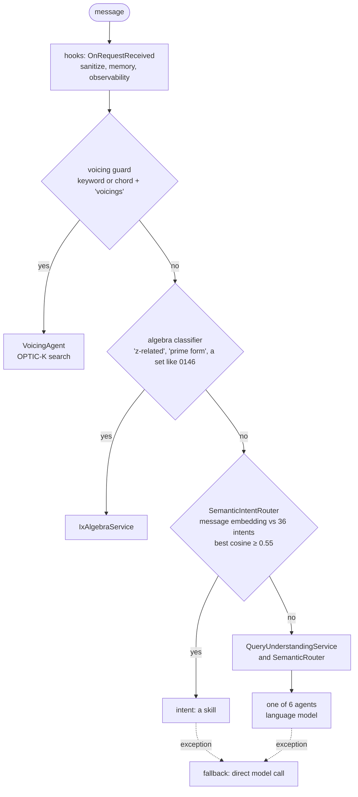

The previous lessons called GA's classes one by one. This one sends HTTP requests to the chatbot host itself, `GaChatbot.Api`, started in the course's process as in lesson 1, with the index of lesson 3 and a model address where nothing listens. Four messages go in; what comes out, answers, traces and errors, shows the order in which GA tries to answer and what depends on a model.

All GA links point to commit [`a826864`](https://github.com/GuitarAlchemist/ga/tree/a826864f3a012cad88e415954bf57eca0ce12aa6). The outputs come from:

```bash
dotnet run --project code/ga-ai/GaAi -c Release -- l4
```

## The order of attempts

`POST /api/chatbot/chat` reaches [`ChatbotController.Chat`](https://github.com/GuitarAlchemist/ga/blob/a826864f3a012cad88e415954bf57eca0ce12aa6/Apps/GaChatbot.Api/Controllers/ChatbotController.cs#L102-L109), then [`OrchestratedChatApplicationService`](https://github.com/GuitarAlchemist/ga/blob/a826864f3a012cad88e415954bf57eca0ce12aa6/Apps/GaChatbot.Api/Services/OrchestratedChatApplicationService.cs#L43-L125), which calls the orchestrator and falls back to a plain model call if anything goes wrong. [`ProductionOrchestrator.AnswerAsync`](https://github.com/GuitarAlchemist/ga/blob/a826864f3a012cad88e415954bf57eca0ce12aa6/Common/GA.Business.Core.Orchestration/Services/ProductionOrchestrator.cs#L304-L520) tries, in order:



| Step | Needs a model? | Code |
|---|---|---|
| hooks | no | [lines 318-339](https://github.com/GuitarAlchemist/ga/blob/a826864f3a012cad88e415954bf57eca0ce12aa6/Common/GA.Business.Core.Orchestration/Services/ProductionOrchestrator.cs#L318-L339) |
| voicing guard: a keyword such as "voicings" or "fingering", or a chord symbol followed by "shape" or "voicings" | no | [lines 343-357](https://github.com/GuitarAlchemist/ga/blob/a826864f3a012cad88e415954bf57eca0ce12aa6/Common/GA.Business.Core.Orchestration/Services/ProductionOrchestrator.cs#L343-L357), [779-787](https://github.com/GuitarAlchemist/ga/blob/a826864f3a012cad88e415954bf57eca0ce12aa6/Common/GA.Business.Core.Orchestration/Services/ProductionOrchestrator.cs#L779-L787) |
| algebra fast path: a keyword or a pitch-class set pattern | no | [lines 359-373](https://github.com/GuitarAlchemist/ga/blob/a826864f3a012cad88e415954bf57eca0ce12aa6/Common/GA.Business.Core.Orchestration/Services/ProductionOrchestrator.cs#L359-L373), [`KeywordAlgebraPromptClassifier`](https://github.com/GuitarAlchemist/ga/blob/a826864f3a012cad88e415954bf57eca0ce12aa6/Common/GA.Business.Core.Orchestration/Services/KeywordAlgebraPromptClassifier.cs) |
| semantic intent router | **embeddings** | [line 403](https://github.com/GuitarAlchemist/ga/blob/a826864f3a012cad88e415954bf57eca0ce12aa6/Common/GA.Business.Core.Orchestration/Services/ProductionOrchestrator.cs#L403), [`SemanticIntentRouter`](https://github.com/GuitarAlchemist/ga/blob/a826864f3a012cad88e415954bf57eca0ce12aa6/Common/GA.Business.ML/Agents/Intents/SemanticIntentRouter.cs#L87-L160) |
| filter extraction and agent routing, in parallel | **text and embeddings** | [lines 501-506](https://github.com/GuitarAlchemist/ga/blob/a826864f3a012cad88e415954bf57eca0ce12aa6/Common/GA.Business.Core.Orchestration/Services/ProductionOrchestrator.cs#L501-L506) |

The intent router is a nearest-neighbour classifier over text embeddings: it embeds the message, compares it with each intent's description and examples, keeps each intent's best cosine, adds small bonuses for surface patterns, and accepts the best intent if it reaches `DefaultMinConfidence`, 0.55 ([line 47](https://github.com/GuitarAlchemist/ga/blob/a826864f3a012cad88e415954bf57eca0ce12aa6/Common/GA.Business.ML/Agents/Intents/SemanticIntentRouter.cs#L36-L47)). The embeddings come from Ollama. The two guards in front of it are the parts that don't need one, and both were put there on purpose: the voicing guard because the router sent "Show me Drop 2 voicings of Cmaj7" to the modes skill, the algebra path because without an embedding endpoint "CI runners without Ollama" fail "and 500s when the LLM is ALSO unreachable" ([lines 359-368](https://github.com/GuitarAlchemist/ga/blob/a826864f3a012cad88e415954bf57eca0ce12aa6/Common/GA.Business.Core.Orchestration/Services/ProductionOrchestrator.cs#L359-L368)).

## An algebra question

The course's [`Lesson4.cs`](https://github.com/spareilleux/learn/blob/8e335d7/code/ga-ai/GaAi/Lesson4.cs) posts `{ "message": "..." }` with the `HttpClient` of [`WebApplicationFactory`](https://learn.microsoft.com/aspnet/core/test/integration-tests), and prints the fields of the JSON response:

```text
== POST /api/chatbot/chat "Are 0146 and 0137 z-related?"
HTTP 200
agentId        algebra
routingMethod  ix-algebra
confidence     1.00
grounding      ix-compatible 7b02a56 z-relation
  left         [0,1,4,6]
  right        [0,1,3,7]
  leftIcv      <1 1 1 1 1 1>
  rightIcv     <1 1 1 1 1 1>
  zRelated     True
answer:
  | [0,1,4,6] and [0,1,3,7] are Z-related: they share ICV <1 1 1 1 1 1> but have different prime forms.
trace:
  chat.request             completed
  orchestration.answer     completed
  orchestration.route      completed
  agent.semantic_result    completed
  notation.vextab          completed
  response.emit            completed
```

The algebra classifier matched "z-related", so no model was asked. The response says who answered (`agentId`), how it was chosen (`routingMethod`), with what confidence, and on what **grounding**: a source, a revision and the facts the answer rests on. The set classes and their shared interval-class vector are those of the [music theory course](../../music-theory-ga/04-set-classes/). This is the North Star of lesson 1 in miniature: the domain computed the facts, and the sentence only restates them.

The **trace** is the list of steps the host recorded for the right-hand panel of GA's chat page. The course prints the step names and statuses; the host also records durations and attributes such as `routing.method`, left out here because durations change on every run.

## A voicing question

````text
== POST /api/chatbot/chat "Show me Cmaj7 voicings"
HTTP 200
agentId        voicing
routingMethod  deterministic-voicing
confidence     0.92
grounding      (none)
answer:
  | Found 2 voicings matching chord Cmaj7:
  |
  | - **Cmaj7** `3-0-x-2-3-x` (guitar, score 0.369)
  | ```vextab
  | 6/3 5/0 3/2 2/3
  | ```
  | - **Cmaj7** `3-0-0-2-3-x` (guitar, score 0.369)
  | ```vextab
  | 6/3 5/0 4/0 3/2 2/3
  | ```
trace:
  chat.request             completed
  orchestration.answer     completed
  orchestration.route      completed
  agent.semantic_result    completed
  notation.vextab          completed
  response.emit            completed
````

"voicings" triggered the guard, and [`VoicingAgent`](https://github.com/GuitarAlchemist/ga/blob/a826864f3a012cad88e415954bf57eca0ce12aa6/Common/GA.Business.ML/Agents/VoicingAgent.cs#L46-L150) answered. Despite its name and its `IChatClient` parameter, it didn't call the model: a typed parser extracted the chord symbol `Cmaj7`, [`MusicalQueryEncoder`](https://github.com/GuitarAlchemist/ga/blob/a826864f3a012cad88e415954bf57eca0ce12aa6/Common/GA.Business.ML/Search/MusicalQueryEncoder.cs#L43-L109) built the query vector, and the search with the `ChordName` filter returned the two shapes of lesson 3, with the same score, 0.369. The "agent" label, in GA, means a class that *may* use the model.

Then [`PlayableNotationFormatter`](https://github.com/GuitarAlchemist/ga/blob/a826864f3a012cad88e415954bf57eca0ce12aa6/Common/GA.Business.ML/Notation/PlayableNotationFormatter.cs#L31-L53) added a [VexTab](https://vexflow.com/vextab/) block under each diagram, so the page can draw a tablature. It reads the diagram low E first: element 0 becomes string 6. GA's diagrams start at the high E, so `3-0-x-2-3-x` (C, E, B and G from the bass up) becomes `6/3 5/0 3/2 2/3`: G, A, A and D. The chord shown under "Cmaj7" is not a Cmaj7. It's lesson 2's diagram-order problem again, now in front of a user.

## A question for a skill

```text
== POST /api/chatbot/chat "What is the relative minor of C major?"
HTTP 500
logged:
  Error ExceptionHandlerMiddleware: An unhandled exception has occurred while executing the request. [HttpRequestException at DirectChatApplicationService.GenerateAnswerAsync, DirectChatApplicationService.cs:96]
  Error OrchestratedChatApplicationService: Chat orchestration failed. Falling back to direct chat client. [HttpRequestException at SemanticRouter.EnsureEmbeddingsInitializedAsync, SemanticRouter.cs:251]
  Warning QueryUnderstandingService: [QueryUnderstanding] Failed to extract filters [HttpRequestException at OllamaGenerateClient.GenerateAsync, OllamaGenerateClient.cs:46]
  Warning SemanticIntentRouter: SemanticIntentRouter: example embedding failed; router will degrade to fallback [HttpRequestException at SemanticIntentRouter.EnsureExamplesEmbeddedAsync, SemanticIntentRouter.cs:370]
  Warning SemanticIntentRouter: SemanticIntentRouter: query embedding failed; routing falls through to LLM path [HttpRequestException at SemanticIntentRouter.RouteAsync, SemanticIntentRouter.cs:111]
```

HTTP 500 and no answer. The course keeps the host's warnings and errors, with the exception type and the innermost GA frame, and prints them sorted. Put back in the order they happened:

1. No guard matched, so the orchestrator asked `SemanticIntentRouter`. Embedding the intents' examples failed ([line 370](https://github.com/GuitarAlchemist/ga/blob/a826864f3a012cad88e415954bf57eca0ce12aa6/Common/GA.Business.ML/Agents/Intents/SemanticIntentRouter.cs#L341-L385)), then embedding the query failed ([line 111](https://github.com/GuitarAlchemist/ga/blob/a826864f3a012cad88e415954bf57eca0ce12aa6/Common/GA.Business.ML/Agents/Intents/SemanticIntentRouter.cs#L106-L127)). Both are caught: the router logs a warning and returns `null`, "no intent".
2. The orchestrator moved on to `QueryUnderstandingService`, whose model call failed and was caught too.
3. In parallel, [`SemanticRouter.RouteAsync`](https://github.com/GuitarAlchemist/ga/blob/a826864f3a012cad88e415954bf57eca0ce12aa6/Common/GA.Business.ML/Agents/SemanticRouter.cs#L68-L104) called `EnsureEmbeddingsInitializedAsync`, which embeds the six agents' descriptions ([line 251](https://github.com/GuitarAlchemist/ga/blob/a826864f3a012cad88e415954bf57eca0ce12aa6/Common/GA.Business.ML/Agents/SemanticRouter.cs#L233-L258)). Nothing in `RouteAsync` catches that exception. `RouteAsync` has a keyword fallback, at step 3 of its own comments, `semanticResult ?? KeywordRoute(query)`: it is never reached.
4. `OrchestratedChatApplicationService` caught the exception, logged "Chat orchestration failed. Falling back to direct chat client." ([lines 109-124](https://github.com/GuitarAlchemist/ga/blob/a826864f3a012cad88e415954bf57eca0ce12aa6/Apps/GaChatbot.Api/Services/OrchestratedChatApplicationService.cs#L109-L124)), and called [`DirectChatApplicationService`](https://github.com/GuitarAlchemist/ga/blob/a826864f3a012cad88e415954bf57eca0ce12aa6/Apps/GaChatbot.Api/Services/DirectChatApplicationService.cs#L69-L99), which calls the model, again, and throws, at line 96. That one reaches ASP.NET Core's exception handler: 500.

The question needs no model. The skill for it exists, and the program calls it directly, without the router:

```text
== The skill.relativekey intent, called directly with "What is the relative minor of C major?"
confidence     1.00
  | The relative minor of **C major** is **Am**.
  |
  | Both share the same key signature (no sharps or flats). Same notes, different tonal center — the relative minor starts on the 6th degree of the major scale.
```

Confidence 1.00, the right answer, computed by GA's domain code. Before the semantic router existed, each skill's `CanHandle` method decided with keywords. The orchestrator no longer calls it, but the skills still implement it:

```text
== IOrchestratorSkill.CanHandle for each prompt (the keyword path the orchestrator no longer calls)
Are 0146 and 0137 z-related?             (none)
Show me Cmaj7 voicings                   ChordVoicings
What is the relative minor of C major?   ScaleInfo
Why does a ii-V-I sound resolved?        (none)
```

The keyword path would not have saved this question either: it picks `ScaleInfo`, not the relative-key skill. GA's roadmap lists "replacing semantic routing with regex" among its [non-goals](https://github.com/GuitarAlchemist/ga/blob/a826864f3a012cad88e415954bf57eca0ce12aa6/docs/plans/2026-05-07-chatbot-roadmap.md#L46-L49), and this output shows why keywords alone are weak. It also shows the cost of the choice: at `a826864`, when the embedding server is down, every question that no guard catches ends in a 500, including the ones a deterministic skill answers with certainty.

## A question for the model

```text
== POST /api/chatbot/chat "Why does a ii-V-I sound resolved?"
HTTP 500
logged:
  Error ExceptionHandlerMiddleware: An unhandled exception has occurred while executing the request. [HttpRequestException at DirectChatApplicationService.GenerateAnswerAsync, DirectChatApplicationService.cs:96]
  Error OrchestratedChatApplicationService: Chat orchestration failed. Falling back to direct chat client. [HttpRequestException at SemanticRouter.EnsureEmbeddingsInitializedAsync, SemanticRouter.cs:251]
  Warning QueryUnderstandingService: [QueryUnderstanding] Failed to extract filters [HttpRequestException at OllamaGenerateClient.GenerateAsync, OllamaGenerateClient.cs:46]
  Warning SemanticIntentRouter: SemanticIntentRouter: example embedding failed; router will degrade to fallback [HttpRequestException at SemanticIntentRouter.EnsureExamplesEmbeddedAsync, SemanticIntentRouter.cs:370]
  Warning SemanticIntentRouter: SemanticIntentRouter: query embedding failed; routing falls through to LLM path [HttpRequestException at SemanticIntentRouter.RouteAsync, SemanticIntentRouter.cs:111]
```

The same five log lines. This one really needs a model: explaining why a cadence sounds resolved is prose, and no skill claims it. What the six agents of lesson 1 answer, with Ollama running, is not verified by this course (*to verify*). With no model, the right outcome would be a clear "the assistant is unavailable" message; the host returns a 500 from its exception handler instead. Issue [#589](https://github.com/GuitarAlchemist/ga/issues/589) describes where GA wants this path to go: the model proposes a typed structure, and the theory engine validates it before the user sees anything.

## A race in the course's own CI

The first version of this lesson passed on Windows and failed on Linux and macOS. On those two, the log lines of the relative-minor request also appeared under the algebra request, the first one sent. The cause is [`IntentEmbeddingWarmupService`](https://github.com/GuitarAlchemist/ga/blob/a826864f3a012cad88e415954bf57eca0ce12aa6/Common/GA.Business.Core.Orchestration/Services/IntentEmbeddingWarmupService.cs#L27-L66), a [hosted service](https://learn.microsoft.com/aspnet/core/fundamentals/host/hosted-services) whose `StartAsync` starts the embedding of every intent's examples and returns at once:

```csharp
public Task StartAsync(CancellationToken cancellationToken)
{
    // Fire-and-forget — host startup must not block on this.
    _ = Task.Run(() => WarmAsync(cancellationToken), cancellationToken);
    return Task.CompletedTask;
}
```

For a real server that's reasonable: the first user doesn't wait a minute for the cache. For a test, it means that warnings from the warm-up land in whichever request runs at that moment, and the moment depends on the machine. The course now waits for the warm-up's own last log line, "cache warmed" or "warmup failed", before sending anything, and throws after two minutes ([`ChatHost.WaitForWarmup`](https://github.com/spareilleux/learn/blob/8e335d7/code/ga-ai/GaAi/ChatHost.cs#L23-L34)). A log line is a weak signal to synchronize on; a hosted service that exposed a `Task` for its completion would be a better one.

## Exercises

1. Which path answers "What voicings of G7 are easy?", and does it need a model?
2. `SemanticRouter.RouteAsync` has a keyword fallback. Change as little code as possible so that a message reaches it when the embedding server is down. Where would you put a `try`, and what should it catch?
3. With your change from exercise 2, would "What is the relative minor of C major?" get a correct answer offline?
4. The course prints the trace's step names but not their durations. Why, and what would you do to test durations anyway?

<details>
<summary>Solutions</summary>

1. The voicing guard: "voicings" is one of its keywords ([line 128](https://github.com/GuitarAlchemist/ga/blob/a826864f3a012cad88e415954bf57eca0ce12aa6/Common/GA.Business.Core.Orchestration/Services/ProductionOrchestrator.cs#L128-L134)). Then `VoicingAgent` extracts `G7` with the typed parser, and doesn't need a model. What "easy" does to the search depends on the extractor and the comfort filter; not checked here (*to verify*).
2. For example in `RouteAsync`, around the semantic block:

   ```csharp
   if (textEmbeddings != null)
   {
       try
       {
           await EnsureEmbeddingsInitializedAsync(cancellationToken);
           semanticResult = await SemanticRouteAsync(query, cancellationToken);
           // ... the confidence check, unchanged
       }
       catch (HttpRequestException ex)
       {
           _logger.LogWarning(ex, "Agent embeddings unavailable; using keyword routing");
       }
   }
   ```

   Catch the exception a dead server produces, `HttpRequestException`, not `Exception`, so that a real bug still surfaces; let `OperationCanceledException` through, the caller's cancellation. Not compiled or run against GA (*to verify*): the LLM routing step after it calls the model too, and may need the same treatment.
3. No. The keyword router chooses one of the six agents, and an agent answers with the model, which is down. The relative-key skill is reached only through the intent router, which needs embeddings. An offline answer needs a deterministic route to the skill: its `CanHandle`, a keyword hint, or a cache of intent embeddings computed in advance.
4. Durations change on every run and every machine, so an exact comparison with `expected/` would always fail. A test can assert properties instead: every duration is non-negative, the steps are in order, the total is below a generous bound.

</details>

## Key takeaways

- GA's chatbot tries, in order: hooks, a voicing guard, an algebra classifier, an embedding-based intent router over 36 intents, then model-based routing to 6 agents; a failed orchestration falls back to a direct model call.
- Without a model server, the two guards still answer, with grounding facts and a trace; everything else ends in HTTP 500 at `a826864`, because an uncaught exception in agent routing skips the keyword fallback, and the fallback itself needs the model.
- "Agent" names a class that may use a model: `VoicingAgent` answers "Show me Cmaj7 voicings" with a parser and the OPTIC-K index alone.
- The tablature shown under the voicings reads GA's diagrams in the wrong string order, so the chord drawn is not the chord named.
- A fire-and-forget warm-up in a hosted service makes a host's logs depend on timing; tests need a completion signal, and CI on several systems is what exposed the race.

## Sources

- GuitarAlchemist/ga at [`a826864`](https://github.com/GuitarAlchemist/ga/tree/a826864f3a012cad88e415954bf57eca0ce12aa6): `Apps/GaChatbot.Api` (`Controllers/ChatbotController.cs`, `Services/OrchestratedChatApplicationService.cs`, `Services/DirectChatApplicationService.cs`), `Common/GA.Business.Core.Orchestration/Services` (`ProductionOrchestrator.cs`, `KeywordAlgebraPromptClassifier.cs`, `IntentEmbeddingWarmupService.cs`), `Common/GA.Business.ML/Agents` (`SemanticRouter.cs`, `VoicingAgent.cs`, `Intents/SemanticIntentRouter.cs`), `Common/GA.Business.ML/Notation/PlayableNotationFormatter.cs`, `docs/plans/2026-05-07-chatbot-roadmap.md`.
- GA issue [#589](https://github.com/GuitarAlchemist/ga/issues/589), read on 2026-09-14.
- Microsoft Learn: [Integration tests in ASP.NET Core](https://learn.microsoft.com/aspnet/core/test/integration-tests), [Background tasks with hosted services](https://learn.microsoft.com/aspnet/core/fundamentals/host/hosted-services), [Handle errors in ASP.NET Core](https://learn.microsoft.com/aspnet/core/fundamentals/error-handling).
- [VexTab](https://vexflow.com/vextab/).
