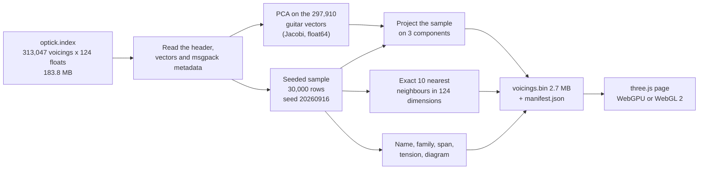

import LazyDemo from '../../../components/LazyDemo.astro';

Guitar Alchemist keeps every guitar voicing it knows as a list of 124 numbers. This prototype turns 30,000 of them into a cloud of points you can turn around, point at and listen to, and then measures how much of the real space the picture shows. The short answer: a useful map, and a poor neighbourhood guide.

<LazyDemo
	path="ga-lab/p1/"
	title="GA voicing space explorer"
	screenshot="ga-lab/p1-explorer.png"
	alt="A cloud of coloured points on a dark background, with a panel showing an open chord diagram and its ten nearest voicings"
	label="Load the explorer (3.7 MB)"
	note="Nothing is downloaded until you click. Drag to orbit, hover to name a voicing, click to select and hear it. Full page:"
/>

The published page weighs 3.7 MB: 2.7 MB of voicings, 0.9 MB of JavaScript with three.js, and a manifest. Every number in this lesson comes from [`code/ga-protos/p1-voicing-explorer`](https://github.com/spareilleux/learn/tree/main/code/ga-protos/p1-voicing-explorer), and the hypotheses were [committed](https://github.com/spareilleux/learn/blob/03f2bbb/code/ga-protos/p1-voicing-explorer/results/hypotheses.md) before the measurements.

## What you already know: a vector index

If you have used [vector search in Azure AI Search](https://learn.microsoft.com/azure/search/vector-search-overview) or [k-nearest-neighbour search in Elasticsearch](https://www.elastic.co/docs/solutions/search/vector/knn), you know the shape of GA's voicing index. Each document becomes a vector; a query becomes a vector too; the answer is the `k` documents whose vectors score highest against it. In C#, the core of it is a loop of [`TensorPrimitives.Dot`](https://learn.microsoft.com/dotnet/api/system.numerics.tensors.tensorprimitives.dot) calls and a priority queue of the best `k`.

Two things change when you want to *look* at the index instead of querying it.

- A screen has two dimensions, a 3D view three. The vectors have 124. Something must project them, and a projection loses information.
- A search service answers "what is near this?". A picture invites the same question, by eye: the points drawn next to a voicing look like its neighbours. Whether they are is measurable, and it's the main measurement of this lesson.

## OPTIC-K in one paragraph

GA's embedding is hand-built, not learned. The [GA AI course](../../ga-ai/02-optic-k-embeddings/) takes it apart: 240 named numbers in 11 partitions, of which 6 partitions and 124 numbers count for similarity. STRUCTURE describes the pitch-class set (its chroma, its interval-class vector), MORPHOLOGY the shape on the fretboard, CONTEXT the harmonic function, SYMBOLIC the technique tags, MODAL the modes the chord belongs to, ROOT the root. Each partition is normalized and scaled by the square root of its weight (0.45, 0.25, 0.20, 0.10, 0.10, 0.05), so a single dot product gives the weighted sum of per-partition cosines, at most 1.15. [Lesson 3](../../ga-ai/03-index-and-search/) of that course reads the binary index byte by byte, and the [OPTIC appendix](../../music-theory-ga/appendix-optic/) of the music theory course explains the equivalences behind the name.

## The data, pinned

GA's `main` branch was at [`66bdd049`](https://github.com/GuitarAlchemist/ga/tree/66bdd049ad3f4b10f996e4cc6a9c6e58797cf30e). The index file isn't in the repository: `FretboardVoicingsCLI --export-embeddings` generates it. A session working on GA's performance had built that tool at this commit and exported the index 25 minutes earlier; I read that file without rebuilding it, and pinned it by hash:

| | |
|---|---|
| file | `optick.index`, 183,770,270 bytes |
| SHA-256 | `1e91e4695bab8aa4bb451fdd1f199a4afaa4c4ad913f08acc5163c6ab07caa23` |
| voicings | 313,047: 297,910 guitar, 7,795 bass, 7,342 ukulele |
| dimensions | 124, schema hash `0x37cd8ecf` |
| export | 688,351 raw voicings, 313,047 kept after deduplication, 149 s |

The same session exported the index a second time from the same build. [`compare-indexes.mjs`](https://github.com/spareilleux/learn/blob/main/code/ga-protos/p1-voicing-explorer/scripts/compare-indexes.mjs) matches the two exports voicing by voicing:

```text
{"small":313047,"big":313047,"identical":312977,"differ":0,"missing":70,"vectorFound":313011,"sameName":312977,"maxAbsDifference":0}
```

Every vector found in both is bit-for-bit identical, but 70 voicings of one export are absent from the other. The export deduplicates voicings that share a fret shape and a pitch-class set, and keeps the cheapest to play ([`Program.cs`, lines 759-787](https://github.com/GuitarAlchemist/ga/blob/66bdd049ad3f4b10f996e4cc6a9c6e58797cf30e/Demos/Music%20Theory/FretboardVoicingsCLI/Program.cs#L759-L787)); the generator runs in parallel, and when two candidates cost the same, the first to arrive wins. So "the index at commit `66bdd049`" is not one file: the hash is what pins the data.

### Which string comes first

The index stores each diagram as text. Row 1000 reads:

```text
diagram "1-2-x-5-x-1", midiNotes [65, 61, 55, 41], quality_inferred "Gm7b5/F"
```

Read from the high E string, `1` is F4, MIDI 65, the first note of the list. Read from the low E, `1` would be F2, MIDI 41, the last. **GA's index writes string 1, the high E, first.** A guitarist writes the same shape low E first, `1x5x21`. GA's own [React `FretDiagram`](https://github.com/GuitarAlchemist/ga/blob/66bdd049ad3f4b10f996e4cc6a9c6e58797cf30e/ReactComponents/ga-react-components/src/components/FretDiagram.tsx#L8-L11) and its [`FretDiagram.cs` parser](https://github.com/GuitarAlchemist/ga/blob/66bdd049ad3f4b10f996e4cc6a9c6e58797cf30e/Common/GA.Business.ML/Agents/FretDiagram.cs#L14) expect low E first. The prototype keeps GA's order in its data and converts once, in [`voicing.mjs`](https://github.com/spareilleux/learn/blob/main/code/ga-protos/p1-voicing-explorer/src/lib/voicing.mjs), and the build step checks every sampled row: the diagram read high E first must give back the index's MIDI notes. It found 0 mismatches in 30,000 rows, and a unit test pins row 1000.

## The build pipeline



[`build-data.mjs`](https://github.com/spareilleux/learn/blob/main/code/ga-protos/p1-voicing-explorer/scripts/build-data.mjs) is plain Node.js with no dependency:

```bash
cd code/ga-protos/p1-voicing-explorer
node scripts/build-data.mjs --index G:/learn-33/ga-p1/optick.index --out public/data --ga-sha 66bdd049ad3f4b10f996e4cc6a9c6e58797cf30e
```

```text
sampled 30000 of 297910 guitar voicings with seed 20260916
PCA on 297910 vectors: 11 Jacobi sweeps, first 3 components explain 22.2 %
exact 10-NN of 30000 voicings in 124 dimensions: 84.9 s
checks: {"midiMismatches":0,"stringCountMismatches":0}
PCA explained variance, first 3 components: 8.8 %, 8.2 %, 5.3 %
wrote public\data\voicings.bin (2670024 bytes) and manifest.json (3380 chord names)
timings: openMs 48, pcaMs 1291, knnMs 84876, totalMs 86348
```

Each step is chosen to give the same bytes on every machine.

- **The reader** ([`optick.mjs`](https://github.com/spareilleux/learn/blob/main/code/ga-protos/p1-voicing-explorer/src/lib/optick.mjs)) follows `OptickIndexReader`'s layout, and recomputes the schema hash as the CRC-32 of the layout string, so a file written with another layout is rejected.
- **PCA** ([`pca.mjs`](https://github.com/spareilleux/learn/blob/main/code/ga-protos/p1-voicing-explorer/src/lib/pca.mjs)) builds the 124 × 124 covariance matrix in `float64` and diagonalizes it with cyclic Jacobi rotations, the method of [lesson 5](../../machine-learning-ix/05-dimensionality-reduction/) of the IX course. An eigenvector's sign is arbitrary, so each one is flipped until its largest component is positive: without that, a rebuild could mirror the cloud. A test fits the same data twice and compares the bits.
- **The sample** ([`sample.mjs`](https://github.com/spareilleux/learn/blob/main/code/ga-protos/p1-voicing-explorer/src/lib/sample.mjs)) is a partial Fisher-Yates shuffle driven by mulberry32, a generator written with `Math.imul` only, so no floating-point rounding can differ between platforms. The test pins the first rows seed 20260916 picks: 4, 10, 42, 47, 52.
- **The neighbours** ([`knn.mjs`](https://github.com/spareilleux/learn/blob/main/code/ga-protos/p1-voicing-explorer/src/lib/knn.mjs)) are exact: every pair of the 30,000 voicings, 900 million dot products, 85 seconds on one thread. Ties go to the lower row, like GA's `OptickSearchStrategy`.
- **The file** ([`format.mjs`](https://github.com/spareilleux/learn/blob/main/code/ga-protos/p1-voicing-explorer/src/lib/format.mjs)) is a 24-byte header and typed arrays, each aligned on 4 bytes, so the page views them in place: `Float32Array` positions, `Int8Array` frets, `Uint16Array` name ids and neighbour ids, `Float32Array` scores. The 3,380 distinct chord names, the families and the provenance go into `manifest.json`.

The published sample holds 30,000 of the 297,910 guitar voicings, 10 %. Bass and ukulele are left out: their diagrams have four strings, and the page draws guitar chord boxes.

## The page

[`main.js`](https://github.com/spareilleux/learn/blob/main/code/ga-protos/p1-voicing-explorer/src/main.js) uses three.js's `WebGPURenderer`, which falls back to WebGL 2 where WebGPU is missing, as in the [three.js course](../../threejs/01-scene-camera-renderer/).

- **Points.** WebGPU draws point primitives one pixel wide, whatever size you ask for ([`PointsNodeMaterial`](https://threejs.org/docs/pages/PointsNodeMaterial.html) says so). The page draws one [`Sprite`](https://threejs.org/docs/pages/Sprite.html) instead, 30,000 times: its material reads each instance's position, colour and visibility from instanced attributes, and a TSL expression on the quad's UVs makes it round. Filtering sets an instance's size to zero, one small buffer upload, no new geometry.
- **Colour.** By chord family (major, minor, dominant seventh… or "named by set class only" when GA had no chord symbol), by the tension proxy, by position on the neck, or by number of notes.
- **Picking.** On pointer move, the page projects every visible point with the camera matrix and keeps the nearest within 8 pixels: a plain loop over a `Float32Array`, as you would write it in C#.
- **The diagram** is ported from GA's `FretDiagram.tsx` to a 2D canvas, geometry and base-fret rule included, and fed frets converted to low E first.
- **The sound** is [Karplus-Strong](https://en.wikipedia.org/wiki/Karplus%E2%80%93Strong_string_synthesis) synthesis in [`synth.mjs`](https://github.com/spareilleux/learn/blob/main/code/ga-protos/p1-voicing-explorer/src/lib/synth.mjs): a delay line one period long, filled with noise, fed back through the average of two neighbouring samples. The average is a low-pass filter, so high partials die first, as on a real string. The notes start 35 ms apart, low string first, and the samples go to the [Web Audio API](https://developer.mozilla.org/docs/Web/API/Web_Audio_API) as one buffer.
- **The neighbours** listed on the right are the precomputed ten, with GA's score and their distance in the 3D view. Yellow lines join the voicing to them in the cloud.

The fret-span and tension filters use two values computed by the build step. The span is the distance between the lowest and highest fretted notes. The tension is not GA's: STRUCTURE has a "tension" slot, but the index stores it normalized with its partition, and the value can't be read back. The prototype counts the semitones, whole tones and tritones in the pitch-class set instead: 0 for a major triad, 2 for a dominant seventh.

## Measurements

[`measure.mjs`](https://github.com/spareilleux/learn/blob/main/code/ga-protos/p1-voicing-explorer/scripts/measure.mjs) runs in about two minutes on one thread and writes [`results/measurements.json`](https://github.com/spareilleux/learn/blob/main/code/ga-protos/p1-voicing-explorer/results/measurements.json):

```bash
node scripts/measure.mjs --index G:/learn-33/ga-p1/optick.index
```

It picks 2,000 query voicings out of the 30,000 with seed 20260917, finds their exact 10 nearest neighbours by dot product in 124 dimensions, and compares them with the 10 nearest by Euclidean distance after projecting on 2, 3, 10 or 32 principal components. Recall@10 is the fraction of the true ten found among the projected ten.

### What the three axes explain

| Components | 1 | 2 | 3 | 10 | 32 | 64 |
|---|---|---|---|---|---|---|
| Variance explained | 8.8 % | 17.0 % | 22.2 % | 48.0 % | 84.7 % | 99.9 % |

The first two axes are shape. The squared loadings of the first component are 85 % MORPHOLOGY and 12 % ROOT; the second, 83 % and 13 %; the third is 84 % STRUCTURE, the pitch classes. CONTEXT contributes nothing to any of them: it is the same constant for every voicing, a finding the GA AI course made too. Near 64 components, 99.9 % of the variance is reached: the 124 numbers really live in about 64 dimensions.

### Do neighbours on screen agree with true neighbours?

| Recall@10 | PCA 2 | PCA 3 | PCA 10 | PCA 32 |
|---|---|---|---|---|
| within the 30,000 sample | 0.036 | 0.168 | 0.438 | 0.693 |
| against all 297,910 guitar voicings | 0.168 | 0.348 | 0.765 | 0.787 |

In the explorer's view, about one in six of a voicing's ten nearest points is one of its ten true neighbours. The yellow lines show it: they reach across the cloud.

A second measure asks a musician's question: do a voicing's neighbours belong to the same chord family?

| Same family among the 10 neighbours | exact, 124 dims | PCA 3 | PCA 10 | PCA 32 |
|---|---|---|---|---|
| within the sample | 61.3 % | 36.9 % | 73.0 % | 60.5 % |
| against all guitar voicings | 96.5 % | 60.6 % | 96.9 % | 95.3 % |

Ten components keep neighbourhoods musically as coherent as the full space, and in the sample slightly more.

### Ties

For 10.1 % of the queries within the sample, and 47.4 % against the whole index, the 10th and 11th true neighbours have the same score. The cause is deeper than rounding: **121,768 of the 297,910 guitar vectors (40.9 %) are exact copies of another voicing's vector**, bit for bit. There are 176,142 distinct vectors, and the largest group holds 12 voicings: `5-1-2-4-2-x`, `5-1-4-4-2-x`, `5-1-4-4-x-2`… all an F♯ diminished chord with A on top, over B or C or nothing. Voicings with the same pitch-class set, the same top note and a similar hand shape are indistinguishable to OPTIC-K. The "top 10" is then a choice among equals, and the measure also reports recall that counts any neighbour scoring at least the 10th score as found: 0.354 instead of 0.348 for three components against the whole index.

### Diagrams

GA's `FretDiagram` shows five frets, starting at the nut when the lowest fretted note is on fret 1 or 2 ([line 31](https://github.com/GuitarAlchemist/ga/blob/66bdd049ad3f4b10f996e4cc6a9c6e58797cf30e/ReactComponents/ga-react-components/src/components/FretDiagram.tsx#L31)). A voicing from fret 2 to fret 6 needs six rows, and [line 104](https://github.com/GuitarAlchemist/ga/blob/66bdd049ad3f4b10f996e4cc6a9c6e58797cf30e/ReactComponents/ga-react-components/src/components/FretDiagram.tsx#L104) silently drops the dot that doesn't fit. Over the whole guitar index, **15,853 voicings (5.32 %) lose at least one dot**. The port keeps the rule, so that the explorer shows what GA shows; exercise 4 fixes it.

### Frame time

[`probe.mjs`](https://github.com/spareilleux/learn/blob/main/code/ga-protos/p1-voicing-explorer/scripts/probe.mjs) opens the page in Playwright's headless Chromium 153 at 1280 × 720, renders 10 warm-up frames, then 120 frames while the camera turns, and reports three times per frame: **wall**, from `render()` until the GPU says it has finished ([`onSubmittedWorkDone`](https://developer.mozilla.org/docs/Web/API/GPUQueue/onSubmittedWorkDone) on WebGPU, a one-pixel `readPixels` on WebGL 2); **CPU**, the `render()` call alone; and **GPU pass**, the render pass itself, measured by the GPU's timestamp queries. [`frame-series.sh`](https://github.com/spareilleux/learn/blob/main/code/ga-protos/p1-voicing-explorer/scripts/frame-series.sh) runs the series. The machine has an NVIDIA RTX 5080 with driver 610.88; WebGPU uses its "blackwell" adapter, and WebGL 2 goes through ANGLE on Direct3D 11. Medians, in milliseconds:

| Points | Backend | Drawn as | Wall | CPU | GPU pass | Picking |
|---|---|---|---|---|---|---|
| 30,000 | WebGPU | sprites | 3.5 | 0.3 | 0.066 | 0.2 |
| 30,000 | WebGL 2 | sprites | 0.9 | 0.3 | 0.071 | 0.1 |
| 30,000 | WebGPU | 1-pixel points | 3.5 | 0.3 | 0.066 | 0.2 |
| 297,910 | WebGPU | sprites | 3.6 | 0.3 | 0.262 | 1.4 |
| 297,910 | WebGL 2 | sprites | 1.1 | 0.3 | 0.276 | 1.3 |
| 1,000,000 random | WebGPU | sprites | 3.7 | 0.3 | 0.786 | 4.8 |
| 1,000,000 random | WebGL 2 | sprites | 1.8 | 0.3 | 0.832 | 4.4 |
| 3,000,000 random | WebGPU | sprites | 4.4 | 0.3 | 2.294 | 14.1 |

The raw lines are in [`results/frame-times.jsonl`](https://github.com/spareilleux/learn/blob/main/code/ga-protos/p1-voicing-explorer/results/frame-times.jsonl). Three things stand out.

- **The scene costs almost nothing.** Drawing 30,000 quads takes 66 microseconds of GPU time, and the cost grows roughly with the number of points: 0.26 ms for 300,000, 2.3 ms for 3 million. The CPU side stays at 0.3 ms, since the cloud is always one draw call.
- **The wall time measures the wait, not the work.** WebGPU's wall time sits at 3.5 ms whatever the point count, 50 times the render pass: that is how long `onSubmittedWorkDone` takes to come back in this browser, not how long the GPU draws. My first series used only that number, and it made WebGPU look four times slower than WebGL 2. The timestamp queries show both backends doing the same work.
- **Picking grows linearly and is the first thing to break.** Projecting every point on the CPU costs 1.4 ms at 300,000 points and 14 ms at 3 million, most of a 60 Hz frame. The page runs at most one pick every 40 ms while the pointer moves.

In the first run, `renderer.info.render.drawCalls` read 434, then negative numbers: three.js resets that counter at the start of each animation frame, and the probe's awaits cross frame boundaries. The table leaves the count out rather than print a wrong one.

### Hypotheses against results

| | Prediction, written first | Result | Verdict |
|---|---|---|---|
| H1 | 3 components explain less than 30 % | 22.2 % | right, but seen before writing |
| H2 | recall@10 of the 3D view below 0.15 in the sample; above 0.6 with 32 components | 0.168; 0.693 | wrong by a little; right |
| H3 | recall worse against the whole index than within the sample; 10th neighbour's score at least 0.05 higher | better (0.348 against 0.168); +0.051 | wrong; right by a hair |
| H4 | 10th and 11th neighbours tied for more than 5 % of voicings | 10.1 % in the sample, 47.4 % in the index | right, and the cause (40.9 % duplicate vectors) was not predicted |
| H5 | 30,000 points under 2 ms of GPU frame time, all guitar voicings under 5 ms; WebGL 2 within a factor of 2 of WebGPU | render pass of 0.066 ms and 0.262 ms; WebGL 2 within 8 % | right, once the right clock was used |
| H6 | picking under 5 ms for 30,000 points, over 16 ms for 297,910 | 0.2 ms; 1.4 ms, with a projection loop rather than `Raycaster` | right; wrong, 10 times faster than I guessed |
| H7 | more than 1 % of diagrams lose a dot | 5.32 % | right |

H3 was wrong for a reason worth keeping. I reasoned that a sampled voicing's true neighbours are mostly outside the sample, so the sample would look worse. But recall compares two neighbour lists *in the same candidate set*. Against the whole index, the true neighbours are so close (mean score of the 10th: 1.107 out of 1.15) that they are near duplicates, and near duplicates stay near each other in any projection. In a sparse sample, the ten nearest are farther away and more spread out, and the projection shuffles them.

## Local mode: the whole guitar index

The published page stops at 30,000 voicings. The same page can load all 297,910, with their 124-dimensional vectors, and search neighbours in the browser. That data is 156 MB and stays on your machine:

```bash
node scripts/build-data.mjs --index G:/learn-33/ga-p1/optick.index --out public/data-full --sample 297910 --k 0 --with-vectors --ga-sha 66bdd049ad3f4b10f996e4cc6a9c6e58797cf30e
npm run dev
# then open http://localhost:5198/?data=data-full
```

`--k 0` skips the neighbour precomputation, which would take about 100 times the 85 seconds of the sample; the page computes the ten neighbours of the voicing you click instead, over every vector. Measured with the probe on the same machine: loading and decoding the 156 MB from the local server takes 341 ms, the JavaScript heap holds 180 MB, the render pass stays at 0.26 ms, and finding the ten exact neighbours of a clicked voicing among 297,910 vectors takes 28 ms in the browser, on one thread. Past a million voicings, that search, like picking, would need a worker thread or the GPU.

## What worked, what didn't

**Worked.** The build step is fast, apart from the exact neighbours, and deterministic, with a test for each piece. Instanced sprites draw every point in one draw call, and even 3 million points leave most of a 60 Hz frame free. The string-order check caught nothing, which is the point: the order is now tested rather than assumed. And the page is fun: clicking through neighbours and hearing them is a good way to feel what OPTIC-K calls "similar".

**Didn't.**

- **The 3D view is a map, not a neighbourhood.** 22 % of the variance and a recall of 0.17 mean that points drawn together are, most of the time, not neighbours in GA's space. The panel therefore lists the true neighbours instead of trusting the picture, and the lines make the disagreement visible.
- **The axes mostly show fret shape.** Colour by family and the families overlap; colour by position on the neck and gradients appear. A projection fitted on STRUCTURE alone would show harmony better: exercise 2.
- **My hypotheses H3 and H6 were wrong**, and H2 missed its threshold.
- **My first frame-time series measured the wrong thing.** It timed `render()` plus `onSubmittedWorkDone`, and reported WebGPU at 3.5 ms and WebGL 2 at 0.5 ms for the same scene. The second series added GPU timestamp queries, which showed the same 0.07 ms of work on both. The first run is kept in [`results/frame-times-run1.jsonl`](https://github.com/spareilleux/learn/blob/main/code/ga-protos/p1-voicing-explorer/results/frame-times-run1.jsonl).
- **A partial export can't check provenance.** I tried to confirm the index by regenerating 3,000 voicings with GA's CLI (`--export-max 3000`). The limit stops after the first 3,000 raw voicings in generation order, which started at fret 19; deduplication inside that small set kept 2,641 high-neck voicings, and none of their vectors exists in the full index, where cheaper shapes lower on the neck won. The check that worked was comparing two full exports.
- **UMAP was not tried.** It would preserve local neighbourhoods better than PCA, at the cost of determinism across library versions, and a dependency. That's exercise 6.

## Exercises

1. The page colours by chord family. Using `manifest.json`, count how many of the 3,380 chord names are "named by set class or interval only", and how many voicings of the sample carry them.
2. Fit the PCA on the STRUCTURE partition only (compact dimensions 0 to 23) instead of all 124 dimensions. Predict first: will recall@10 against the full vectors go up or down, and will the families separate better?
3. The build step stores neighbour ids as `Uint16Array` for 30,000 voicings. Up to what sample size does that work, and what does `format.mjs` do beyond it?
4. Fix GA's diagram rule so no dot is ever dropped, keeping five rows. Measure how many of the 297,910 voicings still lose a dot.
5. Explain why two voicings with the same score against a query can be in different places of the 3D view.
6. Add UMAP (for example the `umap-js` package) with a fixed seed as a second projection. What would you have to pin to keep the build deterministic, and how would you test it?
7. The tension proxy counts the pairs of notes a semitone, a whole tone or a tritone apart, by pitch class. What are the lowest and highest tensions a chord of four distinct pitch classes can have, and which chords reach them?

<details>
<summary>Solutions</summary>

1. Filter `manifest.names` with `familyOf(name) === FAMILY_LIST.length - 1`: 104 of the 3,380 names are ones GA couldn't spell as a chord, such as `Forte 5-7 (pentachord)` or `C + Gb (Tritone)`. Decoding `voicings.bin` and counting `family[i] === 11` gives 1,237 voicings of the sample, the number the page's legend prints.
2. Change `fitPca(index.vectors, index.dim, fitRows)` to work on a copy holding only the first 24 numbers of each vector, and project the same way. Recall against the 124-dimensional neighbours should go down, since shape, which dominates today's axes, is no longer seen; family separation should go up, since families are defined by pitch classes. Measure both with `measure.mjs` before believing either.
3. `Uint16Array` holds ids up to 65,535, so up to 65,536 voicings. `encode` checks `count <= 65536` and switches to `Uint32Array`, recording the width (2 or 4 bytes) in the header, which `decode` reads before building the views.
4. One fix: start the grid at the nut only when every fretted note fits in five rows from there, `base = max <= 5 ? 1 : min`. GA's window keeps every shape within a span of 4 frets, so from `min` five rows always suffice. Run over the 297,910 guitar voicings with the loop of `measure.mjs`, the count of voicings losing a dot goes from 15,853 to 0.
5. The score is a sum over 124 dimensions; the 3D position keeps only the three directions of largest variance. Two voicings can match the query equally well on different partitions (one on STRUCTURE, the other on MORPHOLOGY), and those partitions point along different principal axes. Duplicate vectors, on the other hand, always land on the same 3D point.
6. Pin the package version in the lock file, pass a seeded random function (mulberry32) instead of `Math.random`, and fix every parameter (neighbours, minimum distance, epochs). Test like PCA: build twice, compare bytes, and pin a few coordinates in a test, so that a library upgrade that changes the result fails CI instead of silently moving the cloud.
7. Four pitch classes make six pairs. The augmented triad C, E, G♯ has no semitone, whole tone or tritone, but any fourth note sits a semitone or a whole tone from one of its notes, and the loop over all 495 four-note sets finds no chord at 0: the minimum is 1, reached for example by Cmaj7 (C, E, G, B, where only B and C rub). The maximum is 5, reached by the cluster C, D♭, D, E♭: three semitones and two whole tones, the sixth pair being a minor third. Writing that loop is the reliable way to answer.

</details>

## Key takeaways

- A picture of a vector index answers "where is everything?" well and "what is near this?" badly: three principal components keep 22 % of GA's variance and one in six true neighbours.
- Ten components keep neighbourhoods as musically coherent as the full 124 dimensions; the space really has about 64 dimensions.
- 40.9 % of GA's guitar vectors are exact duplicates of another voicing's vector, so a "top 10" is often a choice among ties.
- GA's index writes diagrams high E first, while GA's diagram components read low E first: test the order against the MIDI notes, don't assume it.
- A deterministic build needs more than a seed: integer random numbers, fixed eigenvector signs, tie-breaking by id, and a hash of the input file, since two exports at the same commit differ.
- Time the GPU with the GPU's own clock: waiting for the queue took 3.5 ms where the render pass took 0.07 ms.
- Write the hypothesis first. Three of mine were wrong or missed, and the reason H3 was wrong taught more than the ones that were right.

## Sources

- GuitarAlchemist/ga at [`66bdd049`](https://github.com/GuitarAlchemist/ga/tree/66bdd049ad3f4b10f996e4cc6a9c6e58797cf30e): `Common/GA.Business.ML/Embeddings/EmbeddingSchema.cs`, `Common/GA.Business.ML/Search/OptickIndexReader.cs`, `Demos/Music Theory/FretboardVoicingsCLI/OptickIndexWriter.cs` and `Program.cs`, `Common/GA.Business.ML/Agents/FretDiagram.cs`, `ReactComponents/ga-react-components/src/components/FretDiagram.tsx`.
- Kevin Karplus and Alex Strong, ["Digital Synthesis of Plucked-String and Drum Timbres"](https://doi.org/10.2307/3680062), *Computer Music Journal* 7 (2), 1983, pp. 43-55.
- Karl Pearson, "On Lines and Planes of Closest Fit to Systems of Points in Space", *Philosophical Magazine* 2 (11), 1901, pp. 559-572, the origin of principal component analysis; Wikipedia, [Principal component analysis](https://en.wikipedia.org/wiki/Principal_component_analysis) and [Jacobi eigenvalue algorithm](https://en.wikipedia.org/wiki/Jacobi_eigenvalue_algorithm).
- three.js r186: [`WebGPURenderer`](https://threejs.org/docs/pages/WebGPURenderer.html), [`PointsNodeMaterial`](https://threejs.org/docs/pages/PointsNodeMaterial.html) and its [source](https://github.com/mrdoob/three.js/blob/r186/src/materials/nodes/PointsNodeMaterial.js), [`Sprite`](https://threejs.org/docs/pages/Sprite.html), [`OrbitControls`](https://threejs.org/docs/pages/OrbitControls.html).
- MDN: [WebGPU API](https://developer.mozilla.org/docs/Web/API/WebGPU_API), [`GPUQueue.onSubmittedWorkDone`](https://developer.mozilla.org/docs/Web/API/GPUQueue/onSubmittedWorkDone), [Web Audio API](https://developer.mozilla.org/docs/Web/API/Web_Audio_API).
- Microsoft Learn: [Vector search in Azure AI Search](https://learn.microsoft.com/azure/search/vector-search-overview), [`TensorPrimitives.Dot`](https://learn.microsoft.com/dotnet/api/system.numerics.tensors.tensorprimitives.dot); Elastic, [kNN search](https://www.elastic.co/docs/solutions/search/vector/knn).
- [Vite](https://vite.dev/), [Playwright](https://playwright.dev/), [Node.js test runner](https://nodejs.org/api/test.html), [MessagePack](https://msgpack.org/).
