import LazyDemo from '../../../components/LazyDemo.astro';

Strum a chord into your microphone, and the page names it, lights the most common ways to finger it on a 3D neck, lights its notes on a ring of twelve beads, turns that ring to show how far the chord moved from the previous one, suggests what could come next, and makes a galaxy of twelve spiral arms glow with the notes it hears. No microphone? A demo plays sixteen synthesized chords.

<LazyDemo path="ga-lab/p2/" title="Play a chord, see the universe" screenshot="ga-lab/p2/screenshot.png" alt="A dark page with a panel on the left showing the chord name in large yellow letters, its confidence and three candidates; a ring of twelve beads with some lit and joined by a yellow polygon; a guitar neck with blue and gold markers; and faint colored spiral arms of small stars in the background." label="Start the prototype" note="The demo, audio files and microphone work in the frame below. If your browser refuses the microphone there, open the app in its own tab:" height={620} />

**Privacy.** The audio never leaves your device. The microphone stream, or the file you pick, is analyzed in the page, frame by frame, and thrown away. The published page declares a Content Security Policy with `connect-src 'none'`: the browser itself refuses any `fetch`, WebSocket or beacon from it, so not even a bug could upload a sound. The headless run below also lists every request the page made.

Code: [`code/ga-protos/p2-chord-universe`](https://github.com/spareilleux/learn/tree/9d2e393/code/ga-protos/p2-chord-universe). The signal processing is in [`src/dsp/`](https://github.com/spareilleux/learn/tree/9d2e393/code/ga-protos/p2-chord-universe/src/dsp), shared word for word by the browser app and by the evaluation in Node.js.

## What you already know

If you have written a data pipeline in C# or Java, you know the shape of this prototype: a stream of fixed-size buffers, a chain of pure transformations, a small amount of state carried from one buffer to the next, and a decision at the end. Think of a [TPL Dataflow](https://learn.microsoft.com/dotnet/standard/parallel-programming/dataflow-task-parallel-library) block chain, or a [Project Reactor](https://projectreactor.io/docs/core/release/reference/) `Flux` with a `window` and a few `map` steps.

The one step you may not have written yourself is the Fourier transform. .NET's [`System.Numerics`](https://learn.microsoft.com/dotnet/api/system.numerics) gives you [`Complex`](https://learn.microsoft.com/dotnet/api/system.numerics.complex) and SIMD vectors, but no FFT; the usual choices are [Math.NET Numerics](https://numerics.mathdotnet.com/)' `Fourier.Forward` in C# and [JTransforms](https://github.com/wendykierp/JTransforms)' `DoubleFFT_1D` in Java. The browser has none you can call on your own buffers, apart from the [`AnalyserNode`](https://developer.mozilla.org/docs/Web/API/AnalyserNode)'s, which applies its own window and smoothing. So [`fft.ts`](https://github.com/spareilleux/learn/blob/9d2e393/code/ga-protos/p2-chord-universe/src/dsp/fft.ts) is 60 lines: the iterative radix-2 algorithm, bit-reversal first, then the butterflies, with its tables built once per size, like JTransforms' power-of-two path. A unit test checks it on a sinusoid and against Parseval's theorem: the energy is the same in both domains.

The code is TypeScript. [Node.js 24 runs `.ts` files directly](https://nodejs.org/api/typescript.html) by stripping the types, so the evaluation imports exactly the modules the page imports, with no build step; the `tsconfig.json` sets `erasableSyntaxOnly` so that nothing Node.js can't strip slips in.

## The pipeline

Every hop of 2,048 samples, the page copies the last 8,192 samples of the input and runs them through this chain.

```mermaid
flowchart LR
  A["Microphone, file or demo"] --> B["Last 8192 samples<br/>every 2048"]
  B --> C["Hann window<br/>and FFT"]
  C --> D["Log magnitude"]
  D --> E["Spectral whitening"]
  E --> F["Peaks and<br/>tuning estimate"]
  F --> G["Notes by harmonic<br/>summation"]
  G --> H["Chroma: 12 bins<br/>and bass"]
  H --> I["Onset and<br/>integration"]
  I --> J["Template matching:<br/>156 chords"]
  J --> K["Stable label,<br/>confidence, top 3"]
  K --> L["Neck, bracelet,<br/>next chord"]
```



### Frames: the resolution you can afford

A frame of 8,192 samples lasts 186 ms at 44.1 kHz and 171 ms at 48 kHz, and its FFT bins are 5.4 or 5.9 Hz apart. The two lowest notes of a guitar, E2 at 82.4 Hz and F2 at 87.3 Hz, are 4.9 Hz apart: closer than one bin. Longer frames would separate them and blur chord changes; shorter ones would react faster and confuse the bass. The prototype keeps 8,192 samples and works around the low end in two ways: it locates each peak between bins, and it names notes from their harmonics, which are further apart.

### Log compression and whitening

[`chroma.ts`](https://github.com/spareilleux/learn/blob/9d2e393/code/ga-protos/p2-chord-universe/src/dsp/chroma.ts) scales the magnitudes so that a full-scale sine peaks at 1, then compresses them with log(1 + 1000 × a), as [Meinard Müller's FMP notebooks](https://www.audiolabs-erlangen.de/resources/MIR/FMP/C3/C3S1_LogCompression.html) recommend: a quiet high string counts, and a loud low one doesn't drown it.

Whitening then subtracts a moving average of that log spectrum, about two semitones wide on each side, and keeps what sticks out. Broadband noise and the scratch of a pick are flat, so they cancel; a string's partials are narrow peaks, so they stay.

### Peaks and tuning

Each local maximum of the whitened spectrum becomes one peak, placed between bins by fitting a parabola through the three log magnitudes around it. A guitar is rarely tuned to A = 440 Hz exactly, so the extractor also measures how far the peaks above 200 Hz sit from the nearest semitone, averages that deviation as an angle (a circular mean, since 49 cents flat and 51 cents sharp are neighbours), smooths it over frames, and shifts the semitone grid by it.

### Notes, not partials

This is the step that matters most, and it was not in the first design. A plucked string is not a sine: its second harmonic is the octave, its third is an octave and a fifth, its fifth two octaves and a major third, its seventh close to a minor seventh. Fold every peak into its pitch class, the classic chromagram of [Fujishima (1999)](https://quod.lib.umich.edu/i/icmc/bbp2372.1999.446), and a C major triad also shows G, E and B flat from its own harmonics: on the development set, triads came out as seventh chords.

So the extractor first estimates notes, after [Anssi Klapuri's harmonic summation (2006)](https://ismir2006.ismir.net/PAPERS/ISMIR06105_Paper.pdf). Every peak below 800 Hz that sits on the tuned semitone grid is a candidate fundamental. Its salience is the sum of the square roots of the amplitudes found at 1, 2, 3 and up to 10 times its frequency. The most salient candidate becomes a note; the peaks it explains are removed, and the search starts again, up to 10 notes, until the best candidate falls below 15 % of the first. Each note adds the square root of its relative salience to its pitch class.

The bass is decided before any removal: the lowest peak under 260 Hz, on the grid, with at least 10 % of the loudest amplitude there, and two of its harmonics 2 to 5 present.

### Onsets, integration, stability

[`tracker.ts`](https://github.com/spareilleux/learn/blob/9d2e393/code/ga-protos/p2-chord-universe/src/dsp/tracker.ts) adds time. A new strum shows up as a jump of spectral flux, the sum of the increases of the log spectrum from one frame to the next: when the flux exceeds twice the median of the last 8 frames plus a floor, the accumulated chroma is reset, so the previous chord's ringing strings stop voting. Between onsets, chroma and bass add up with a decay of 0.75 per frame. A label replaces the current one only after winning 2 frames in a row, and silence clears it.

## Template matching over GA's chord qualities

Guitar Alchemist names chords from pitch-class sets. Its [`CanonicalChordPatternCatalog`](https://github.com/GuitarAlchemist/ga/blob/a826864f3a012cad88e415954bf57eca0ce12aa6/Common/GA.Domain.Core/Theory/Harmony/CanonicalChordPatternCatalog.cs#L45-L112) lists each pattern as intervals from the root, modulo 12, with a priority: "lower priority wins when multiple patterns match". [`chords.ts`](https://github.com/spareilleux/learn/blob/9d2e393/code/ga-protos/p2-chord-universe/src/dsp/chords.ts) ports 13 of them, with GA's ids, intervals and priorities, at commit `a826864`.

| Symbol | GA id | Intervals | GA priority | Line |
|---|---|---|---|---|
| C | `major-triad` | 0 4 7 | 0 | [47](https://github.com/GuitarAlchemist/ga/blob/a826864f3a012cad88e415954bf57eca0ce12aa6/Common/GA.Domain.Core/Theory/Harmony/CanonicalChordPatternCatalog.cs#L47) |
| Cm | `minor-triad` | 0 3 7 | 1 | [48](https://github.com/GuitarAlchemist/ga/blob/a826864f3a012cad88e415954bf57eca0ce12aa6/Common/GA.Domain.Core/Theory/Harmony/CanonicalChordPatternCatalog.cs#L48) |
| Cdim | `diminished-triad` | 0 3 6 | 2 | [49](https://github.com/GuitarAlchemist/ga/blob/a826864f3a012cad88e415954bf57eca0ce12aa6/Common/GA.Domain.Core/Theory/Harmony/CanonicalChordPatternCatalog.cs#L49) |
| Caug | `augmented-triad` | 0 4 8 | 3 | [50](https://github.com/GuitarAlchemist/ga/blob/a826864f3a012cad88e415954bf57eca0ce12aa6/Common/GA.Domain.Core/Theory/Harmony/CanonicalChordPatternCatalog.cs#L50) |
| Csus2 | `sus2` | 0 2 7 | 8 | [51](https://github.com/GuitarAlchemist/ga/blob/a826864f3a012cad88e415954bf57eca0ce12aa6/Common/GA.Domain.Core/Theory/Harmony/CanonicalChordPatternCatalog.cs#L51) |
| Csus4 | `sus4` | 0 5 7 | 8 | [52](https://github.com/GuitarAlchemist/ga/blob/a826864f3a012cad88e415954bf57eca0ce12aa6/Common/GA.Domain.Core/Theory/Harmony/CanonicalChordPatternCatalog.cs#L52) |
| C6 | `major-6` | 0 4 7 9 | 10 | [55](https://github.com/GuitarAlchemist/ga/blob/a826864f3a012cad88e415954bf57eca0ce12aa6/Common/GA.Domain.Core/Theory/Harmony/CanonicalChordPatternCatalog.cs#L55) |
| C7 | `dominant-7` | 0 4 7 10 | 5 | [61](https://github.com/GuitarAlchemist/ga/blob/a826864f3a012cad88e415954bf57eca0ce12aa6/Common/GA.Domain.Core/Theory/Harmony/CanonicalChordPatternCatalog.cs#L61) |
| Cmaj7 | `major-7` | 0 4 7 11 | 5 | [62](https://github.com/GuitarAlchemist/ga/blob/a826864f3a012cad88e415954bf57eca0ce12aa6/Common/GA.Domain.Core/Theory/Harmony/CanonicalChordPatternCatalog.cs#L62) |
| Cm7 | `minor-7` | 0 3 7 10 | 5 | [63](https://github.com/GuitarAlchemist/ga/blob/a826864f3a012cad88e415954bf57eca0ce12aa6/Common/GA.Domain.Core/Theory/Harmony/CanonicalChordPatternCatalog.cs#L63) |
| Cm7b5 | `half-diminished-7` | 0 3 6 10 | 6 | [65](https://github.com/GuitarAlchemist/ga/blob/a826864f3a012cad88e415954bf57eca0ce12aa6/Common/GA.Domain.Core/Theory/Harmony/CanonicalChordPatternCatalog.cs#L65) |
| Cdim7 | `diminished-7` | 0 3 6 9 | 7 | [66](https://github.com/GuitarAlchemist/ga/blob/a826864f3a012cad88e415954bf57eca0ce12aa6/Common/GA.Domain.Core/Theory/Harmony/CanonicalChordPatternCatalog.cs#L66) |
| Cadd9 | `add-9` | 0 2 4 7 | 50 | [107](https://github.com/GuitarAlchemist/ga/blob/a826864f3a012cad88e415954bf57eca0ce12aa6/Common/GA.Domain.Core/Theory/Harmony/CanonicalChordPatternCatalog.cs#L107) |

Twelve roots times 13 qualities make 156 templates, each a vector of 12 zeros and ones, normalized. The score of a candidate is the cosine similarity between its template and the chroma, which is the dot product of two unit vectors, plus 0.08 times the bass chroma at the candidate's root. The candidates are sorted by score; equal scores go to GA's lower priority, then to the lower root. A softmax with a temperature of 0.02 turns the scores into the confidence and the percentages of the top 3.

```ts
const t = list[root * QUALITIES.length + q];
let score = 0;
for (let i = 0; i < 12; i++) score += c[i] * t[i];
if (bass && bassMax > 0) score += (options.bassWeight * bass[root]) / bassMax;
```

The bass term is not decoration. Among the 156 chords there are only 115 distinct pitch-class sets, and a script over the table lists the ones that start on C:

```text
chords 156 distinct sets 115
shared: Caug = Eaug = G#aug; Csus2 = Gsus4; Csus4 = Fsus2; C6 = Am7; Cm7 = D#6; Cdim7 = D#dim7 = F#dim7 = Adim7
```

The notes of C6 and Am7 are the same four; what tells them apart on a guitar is the lowest one. Without a bass, the templates tie exactly, and GA's priorities decide: `minor-7` (5) beats `major-6` (10), so C6 is always read as Am7, as a unit test checks.

## From a label to the universe

### The neck

The most common voicings come from a small search in [`voicings.ts`](https://github.com/spareilleux/learn/blob/9d2e393/code/ga-protos/p2-chord-universe/src/dsp/voicings.ts), not a port of GA's generator: for every four-fret window up to fret 12, every string is muted or fretted on a chord tone, and a voicing is kept when it has at least four strings, muted strings only on the bass side or the high E, every chord tone (a four-note chord may drop its fifth), and at most four fingers. Voicings are ranked by a cost that favours the root in the bass, low positions, open strings and few fingers; a unit test checks that the first ones are the open chords a guitarist expects, C as `x32010` and D as `xx0232`.

The neck itself is imported from the three.js course: [`scene.ts`](https://github.com/spareilleux/learn/blob/9d2e393/code/ga-protos/p2-chord-universe/src/app/scene.ts) builds it from the fret positions and string spacing of [lesson 13's `guitar.ts`](../../threejs/13-project-ga-fretboard/), GA's measurements, and lights the first voicing brightly, the root in gold, and the next two dimmer.

### The bracelet

The bracelet is the diagram of the [music theory course's lesson 2](../../music-theory-ga/02-scales-and-modes/): pitch class 0 at the top, the others clockwise, the chord's beads lit and joined. When a new chord arrives, ghosts leave the old beads and travel by the interval between the two roots. From C to F, the interval is 5: if both chords have the same quality, the ghosts land exactly on the new beads, which is what transposition means. If they don't, some ghosts land between lit beads, and the difference is visible. The status line gives the interval and the number of common tones.

Two qualities are special on the ring: an augmented triad maps onto itself when turned by 4 or 8 steps, and a diminished seventh by 3, 6 or 9. On the bracelet those chords are a triangle and a square, and turning them doesn't change the picture, which is exactly why their root can't be heard.

### The next chord

[`harmony.ts`](https://github.com/spareilleux/learn/blob/9d2e393/code/ga-protos/p2-chord-universe/src/dsp/harmony.ts) ports a small subset of GA's functional harmony, each rule with its source:

- the diatonic triads of a major and a natural minor key, from [`DomainClosures.fs`, lines 104-110](https://github.com/GuitarAlchemist/ga/blob/a826864f3a012cad88e415954bf57eca0ce12aa6/Common/GA.Business.DSL/Closures/BuiltinClosures/DomainClosures.fs#L104-L110);
- the three primary functions, tonic (I, iii, vi), subdominant (ii, IV) and dominant (V, vii°), from [`HarmonicFunctionAnalyzer.cs`, lines 92-99](https://github.com/GuitarAlchemist/ga/blob/a826864f3a012cad88e415954bf57eca0ce12aa6/Common/GA.Domain.Services/Tonal/HarmonicFunctionAnalyzer.cs#L92-L99);
- the authentic, plagal, half and deceptive cadences and the ii-V-I, from [`Cadences.yaml`, lines 6-50](https://github.com/GuitarAlchemist/ga/blob/a826864f3a012cad88e415954bf57eca0ce12aa6/Common/GA.Business.Config/Cadences.yaml#L6-L50).

The key is the one of the 24 whose diatonic triads cover the recent chords best, newer chords weighing more, with a bonus for the tonic chord. A relative major and minor share all their triads, so the course adds its own tie-breaker, not GA's: a dominant seventh on the fifth degree points to its tonic. Then the suggestions are, in order, the chord whose root is a fifth lower (the circle of fifths), the next function (tonic to subdominant, subdominant to dominant, dominant to tonic) and a cadence. After C, Am, F and G7, the key is C major and the suggestions are Cmaj7 ("circle of fifths, V to I") and Am7 (a deceptive cadence). A diminished seventh resolving up a half step is general practice, not in GA, and the page says so.

## The evaluation

### Hypothesis first

[`eval/hypothesis.md`](https://github.com/spareilleux/learn/blob/ec4ae18/code/ga-protos/p2-chord-universe/eval/hypothesis.md) was committed in `ec4ae18`, before the corpus was ever analyzed. It also says what had been looked at before: the DSP parameters were chosen on a separate development set of 104 clips, roots D and G, where the classic chromagram got 71 right and note estimation 92.

The hypothesis: estimating notes matters more than any other choice, and what remains after it is a naming problem, chords that share a pitch-class set, which only the bass can separate, so their inversions will be named after the bass.

### The synthetic corpus

[`eval/corpus.ts`](https://github.com/spareilleux/learn/blob/9d2e393/code/ga-protos/p2-chord-universe/eval/corpus.ts) strums 13 qualities × 12 roots × 4 voicings = 624 clips of 1.2 s at 44.1 kHz, with a [Karplus-Strong](https://doi.org/10.2307/3680062) string: a delay line of one period, filled with noise, fed back through an average of two samples. [Jaffe and Smith's](https://doi.org/10.2307/3680063) allpass filter supplies the fractional part of the period, so the notes are in tune within 3 cents from 82 Hz to 1.3 kHz, which a unit test measures. Everything comes from seeds, so every machine gets the same samples. The four voicings of each chord are the most common one, one at fret 3 or higher, one at fret 7 or higher, and the most common inversion. Each clip gets one condition in turn: clean, detuned (10 to 35 cents for the whole guitar, plus or minus 8 per string), noisy (white noise at 12 dB SNR), or both.

[`eval/evaluate.ts`](https://github.com/spareilleux/learn/blob/9d2e393/code/ga-protos/p2-chord-universe/eval/evaluate.ts) feeds each clip to the same extractor and tracker as the page, hop by hop, and takes the stable label at the end. It took 44.6 s for seven configurations on the author's machine, so it ran under the machine's heavy-work lock. An "oracle" line feeds the matcher the voicing's exact pitch classes and bass: what it misses, no signal processing can recover with these templates.

```bash
cd code/ga-protos/p2-chord-universe
npm ci
npm test
node eval/evaluate.ts
```

### Results against the predictions

| Configuration | predicted exact % | measured exact % | root % | quality % | same set % | in top 3 % |
|---|---|---|---|---|---|---|
| oracle (ideal pitch classes and bass) | 88 (86 to 90) | **85.7** | 85.7 | 89.6 | 95.2 | 98.7 |
| main: notes, binary templates, whitening, bass, tuning | 72 (62 to 82) | **79.3** | 83.7 | 83.5 | 89.1 | 98.2 |
| notes, harmonic templates | 62 (50 to 72) | **67.1** | 81.3 | 72.8 | 76.3 | 89.1 |
| peaks folded (classic chroma), harmonic templates | 58 (48 to 68) | **51.1** | 74.5 | 54.6 | 56.1 | 75.3 |
| peaks folded (classic chroma), binary templates | 45 (30 to 55) | **40.4** | 74.5 | 43.4 | 43.9 | 66.5 |
| no whitening | 67 (57 to 77) | **66.3** | 79.5 | 70.5 | 75.3 | 88.6 |
| no bass term | 60 (50 to 70) | **67.5** | 72.0 | 78.0 | 89.1 | 95.4 |
| no tuning correction | 64 (54 to 74) | **73.2** | 80.6 | 77.4 | 83.3 | 94.9 |

Seven of the eight exact figures fall in their predicted ranges. The oracle is below its range: I had counted the inversions of the ambiguous qualities as its only losses, and forgot a choice of my own voicing search. It lets a four-note chord drop its fifth, and a sixth chord without its fifth is a minor triad: C6 as `x32210` plays C, E and A, which is A minor over C. Fourteen root-position sixth voicings of the corpus are like that, and the oracle names all fourteen as minor chords. The hypothesis holds: going from folded peaks to notes adds 39 points with binary templates, more than any other switch, and removing the bass term costs 11.8 points of exact accuracy while the "same pitch-class set" column doesn't move, 89.1 % in both: the notes are found, the name is not.

By voicing and by condition, main configuration:

| | clips | exact % | root % | quality % | same set % |
|---|---|---|---|---|---|
| most common voicing | 156 | 89.7 | 96.2 | 89.7 | 90.4 |
| fret 3 or higher | 156 | 91.0 | 94.2 | 91.0 | 91.0 |
| fret 7 or higher | 156 | 86.5 | 89.7 | 87.8 | 89.7 |
| inversion | 156 | 50.0 | 54.5 | 65.4 | 85.3 |
| clean | 156 | 76.9 | 82.1 | 80.8 | 87.2 |
| detuned | 156 | 80.8 | 87.2 | 84.6 | 88.5 |
| noisy | 156 | 81.4 | 85.3 | 85.9 | 91.0 |
| detuned and noisy | 156 | 78.2 | 80.1 | 82.7 | 89.7 |

Root position reaches 89.1 %, against about 78 % predicted; inversions 50 %, against about 45 %. The conditions predicted a steady decline from clean (82) to detuned and noisy (65): there is none. The four figures lie within 4.5 points of each other, the clean clips come last, and with 156 clips each, differences of that size are noise. The tuning estimate and the whitening absorb the degradations the corpus applies; they don't absorb what a real room does, as the recordings below show.

The median time from the strum to the first frame with the right stable label is 182 ms of audio, below the predicted 190 to 330 ms: the first frame that contains the strum already ends 136 ms after it, and two frames are needed. The compute per frame, from samples to label, took 0.315 ms at the median and 0.741 ms at the 95th percentile in Node.js 24 on the author's machine, as predicted: a hop lasts 46 ms.

### The confusion matrix

Rows are the true quality, columns the predicted one, main configuration, 48 clips per row. The diagonal counts the right quality, whatever the root.

| truth \ predicted | maj | m | dim | aug | sus2 | sus4 | 6 | 7 | maj7 | m7 | m7b5 | dim7 | add9 |
|---|---|---|---|---|---|---|---|---|---|---|---|---|---|
| maj | **45** | 0 | 0 | 0 | 0 | 0 | 0 | 1 | 1 | 0 | 0 | 0 | 1 |
| m | 0 | **41** | 0 | 0 | 0 | 0 | 5 | 0 | 0 | 2 | 0 | 0 | 0 |
| dim | 0 | 0 | **47** | 0 | 0 | 0 | 0 | 0 | 0 | 0 | 1 | 0 | 0 |
| aug | 0 | 0 | 0 | **48** | 0 | 0 | 0 | 0 | 0 | 0 | 0 | 0 | 0 |
| sus2 | 0 | 0 | 0 | 0 | **37** | 11 | 0 | 0 | 0 | 0 | 0 | 0 | 0 |
| sus4 | 0 | 0 | 0 | 0 | 10 | **37** | 0 | 0 | 0 | 0 | 0 | 0 | 1 |
| 6 | 1 | 21 | 0 | 0 | 0 | 0 | **14** | 0 | 0 | 12 | 0 | 0 | 0 |
| 7 | 0 | 0 | 2 | 0 | 0 | 0 | 0 | **46** | 0 | 0 | 0 | 0 | 0 |
| maj7 | 8 | 2 | 0 | 0 | 0 | 0 | 1 | 0 | **36** | 1 | 0 | 0 | 0 |
| m7 | 0 | 4 | 0 | 0 | 0 | 0 | 2 | 0 | 0 | **40** | 1 | 0 | 1 |
| m7b5 | 0 | 1 | 2 | 0 | 0 | 1 | 2 | 0 | 0 | 0 | **42** | 0 | 0 |
| dim7 | 0 | 0 | 2 | 0 | 0 | 0 | 0 | 0 | 0 | 0 | 0 | **46** | 0 |
| add9 | 3 | 0 | 0 | 0 | 2 | 1 | 0 | 0 | 0 | 0 | 0 | 0 | **42** |

No clip ended without a label, so the "none" column, all zeros, is left out. The augmented triad's row is perfect and the diminished seventh's nearly so, yet their exact accuracy is 70.8 % each: the quality is right and the root is one of the other names of the same set, 14 times out of 48 for each. The most frequent mistakes, with the predicted root relative to the true one:

```text
  21  6 -> m (root +9)
  12  6 -> m7 (root +9)
  11  sus2 -> sus4 (root +7)
  10  sus4 -> sus2 (root +5)
   9  aug -> aug (root +4)
   8  maj7 -> maj (root +0)
   5  aug -> aug (root +8)
   5  m -> 6 (root +3)
   4  dim7 -> dim7 (root +3)
   4  dim7 -> dim7 (root +6)
   4  dim7 -> dim7 (root +9)
   4  m7 -> m (root +0)
```

### The recorded corpus

Synthetic strings are too kind: no inharmonicity, no body, no room. [`eval/recorded/sources.json`](https://github.com/spareilleux/learn/blob/9d2e393/code/ga-protos/p2-chord-universe/eval/recorded/sources.json) lists 17 recordings from [Freesound](https://freesound.org/), each under [CC0 1.0](https://creativecommons.org/publicdomain/zero/1.0/), each with its title, author and page; the files are Freesound's 128 kbps MP3 previews, 3.2 MB in total. The labels come from the titles and descriptions; one of them, "F#min (Low-D)", is described by its author as a D major with F# in the bass, and is labelled D. Chromium decodes them ([`scripts/decode-recorded.ts`](https://github.com/spareilleux/learn/blob/9d2e393/code/ga-protos/p2-chord-universe/scripts/decode-recorded.ts)), since Node.js has no MP3 decoder, and [`eval/recorded.ts`](https://github.com/spareilleux/learn/blob/9d2e393/code/ga-protos/p2-chord-universe/eval/recorded.ts) keeps, for each recording, the stable label that holds for the most frames. The predictions were added to the hypothesis file after the synthetic run and before this one: 11 exact out of 17, 13 roots.

| Freesound id | label | predicted | longest-held labels (share of frames) |
|---|---|---|---|
| 705409 | Bm | Bm | Bm 93% |
| 705410 | D | D | D 86% |
| 705411 | Em | Em | Em 94%, Esus2 2% |
| 705412 | G | G | G 85%, Gadd9 7%, Gmaj7 2% |
| 700651 | A | F#m7 ✗ | F#m7 71%, C#aug 15%, A 6% |
| 315706 | C | C | C 49%, Gsus2 14%, Am7 9% |
| 456801 | Dm | Dm7 ✗ | Dm7 46%, Dm 15%, Bdim 8% |
| 584138 | Em | Emaj7 ✗ | Emaj7 25%, Esus2 15%, D#m 13% |
| 8566 | E7 | E7 | E7 91%, Bsus4 9% |
| 8603 | Fm | Fm | Fm 29% |
| 47868 | Gm | Gm | Gm 91%, Gsus2 5%, Gadd9 2% |
| 380367 | Am | Am | Am 88%, E 4% |
| 334629 | Asus4 | Asus4 | Asus4 91%, Dsus2 6%, D7 1% |
| 246288 | E | A7 ✗ | A7 33%, Asus2 30%, Gadd9 20% |
| 420954 | G | G | G 76%, Gmaj7 3% |
| 177041 | Am | A ✗ | A 25%, Aadd9 22%, Asus2 21% |
| 8495 | D | Asus4 ✗ | Asus4 71%, D 28% |

11 exact and 14 roots: the count matches the prediction, the list doesn't. I expected the recording through guitar plugins to fail, and it is one of the best; I expected the three-note D over F# to pass, and it is read as Asus4. The A chord comes out as F#m7, whose set, F# A C# E, is A6: the recording likely rings an F#, or the detector invents one, and the four-note answer beats the three-note one. The "variation of Dm" adds a C, and Dm7 may well be the honest name. The percussive hit before the E chord comes out as A7, Asus2 and Gadd9, and the pad through delay and reverb comes out major. I haven't analyzed why frame by frame: the hit probably keeps triggering onsets, and reverb smears the notes of the previous strum into the next frames (*to verify*).

## In a real browser

[`scripts/fake-mic.ts`](https://github.com/spareilleux/learn/blob/9d2e393/code/ga-protos/p2-chord-universe/scripts/fake-mic.ts) writes the sixteen demo chords as a 32-second WAV file at 48 kHz, each in its most common voicing, 12 cents flat, with noise at 30 dB SNR. [`scripts/browser-run.ts`](https://github.com/spareilleux/learn/blob/9d2e393/code/ga-protos/p2-chord-universe/scripts/browser-run.ts) serves the built app on 127.0.0.1, starts headless Chromium from [Playwright](https://playwright.dev/) with `--use-fake-device-for-media-stream` and `--use-file-for-fake-audio-capture` pointing at that file, opens the page with `?source=mic`, waits for the progression, reads a probe the page exposes and lists every request. One run on the author's machine, with Chromium 153.0.8010.12 from Playwright 1.63; another lane held the GPU, so the run added `?webgl`, and it used a build from just before the Content Security Policy was added.

```text
WebGL 2, 153.0.8010.12, 48000 Hz, 251 frames
expected chords found in order: 15 of 16, extra labels: 5
labels: C Am Dm7 Bm7b5 G7 Cmaj7 C Fmaj7 Bm7b5 Eadd9 E7 Am Dsus4 D Gadd9 G6 Em Caug C#dim7 Dm
compute per frame: median 0.40 ms, p95 0.60 ms; offsite requests: 0
```

Fifteen of the sixteen chords come out in order, and the page made no request to any other host. The miss is F, read as Fmaj7 with a confidence of 52 %: probably the E of the Cmaj7 before it still ringing. G6, played as `320000` with its fifth, holds for 0.4 s and then gives way to Em for 1.7 s: the D, whose octave is the third harmonic of the low G, probably goes with the G's harmonics, as in the sixth-chord failures of the corpus. The other extra labels are short transitions, such as Bm7b5 between Dm7 and G7, whose notes are the mixture of the two.

These numbers are counters, not benchmarks. 251 analysis frames in about 33 seconds is one every 130 ms, not every 43 ms as the timer asks: the timer shares the main thread with rendering, and the machine was running other lanes' jobs, so a stable label took about a quarter of a second instead of 90 ms. The compute times move in steps of 0.1 ms, the precision `performance.now()` has in a page that isn't cross-origin isolated. The screenshot at the top of this page is the last frame of this run.

## What failed

- **The first design.** A classic chromagram with harmonic templates, the textbook recipe, turned triads into seventh chords on the development set. It stays in the evaluation as an ablation: 51.1 % exact, against 79.3 % for note estimation.
- **Sixths, and my own corpus.** C6 is read as Am in 21 clips out of 48 and as Am7 in 12. Fourteen of the 21 are not the detector's fault: the voicing search dropped the fifth, and C, E and A are an A minor triad, as the oracle agrees. The other seven, and the 8 maj7 read as major, are probably the price of note estimation: a chord tone that sits exactly on the third harmonic of a lower note (the fifth above the root, or the major seventh above the major third) is removed with that note's harmonics. A smoother removal, which subtracts only what the note's own spectral envelope predicts, did worse on the development set, 20 of 26 against 23, and was dropped. A fairer corpus would keep the fifth of sixth chords; it would also be a different corpus from the one the predictions were written for, so this one stays.
- **Chords that share a set.** sus2 and sus4 swap 21 times; augmented triads and diminished sevenths are named after their bass. Some of these are not even mistakes: the most common inversion that the voicing search finds for Csus2 is `330013`, which any guitarist plays as Gsus4.
- **Inversions.** 50 % exact. The bass bonus that separates C6 from Am7 in root position names the chord after its lowest note when it isn't the root.
- **Predictions.** The oracle's range was wrong, the four conditions don't degrade as predicted, the detection time is shorter than the range, and the recorded corpus fails on other clips than the ones I named.
- **The microphone in the lesson's frame.** Browsers only give a microphone to an iframe whose `allow` attribute includes `microphone` ([Permissions Policy](https://developer.mozilla.org/docs/Web/HTTP/Reference/Headers/Permissions-Policy/microphone)). The course's demo frame first allowed only `autoplay`, and the headless run above sidesteps the question by opening the app on its own. The frame now allows `microphone`, and if a browser still refuses, the app offers a link to open itself in its own tab. Only tested headless so far (*to verify* in a desktop browser).

## Privacy, in detail

- The page asks for the microphone with [`getUserMedia`](https://developer.mozilla.org/docs/Web/API/MediaDevices/getUserMedia), only when you click the button, with echo cancellation, noise suppression and automatic gain turned off, since those damage harmonics. Browsers only allow it in a secure context: HTTPS, as on the published site, or `localhost`.
- The stream goes into an `AnalyserNode`, which is not connected to the speakers. Every hop, the page copies the last 8,192 samples, computes a label and overwrites the buffer. Nothing is stored and nothing is recorded; when you press Stop, the tracks are stopped and the browser's microphone indicator goes off.
- The built page carries a [Content Security Policy](https://developer.mozilla.org/docs/Web/HTTP/Reference/Headers/Content-Security-Policy/connect-src) with `connect-src 'none'`, which makes the browser refuse `fetch`, `XMLHttpRequest`, WebSockets, `EventSource` and `sendBeacon` from the page. The policy is added by a small Vite plugin at build time only, since the development server needs a WebSocket.
- An audio file is read with `File.arrayBuffer()` and decoded by `decodeAudioData`, in the page.

## Run it yourself

The commands are the same on Windows (Git Bash), Linux, WSL and macOS.

```bash
cd code/ga-protos/p2-chord-universe
npm ci
npm run dev                      # http://localhost:5192, microphone allowed on localhost
npm run build                    # type check and build into dist/
node scripts/fake-mic.ts         # out/fake-mic.wav, the demo progression
node scripts/browser-run.ts      # headless Chromium with that file as the microphone
node scripts/decode-recorded.ts  # decode the CC0 recordings
node eval/recorded.ts
```

## Key takeaways

- A chord recognizer is a pipeline of pure steps over fixed-size frames, plus a little state; keep the steps in one module and both the browser and the evaluation can run them.
- Harmonics are the main enemy of a chromagram: estimating notes first raised exact accuracy from 51 % to 79 % on the same corpus.
- Check the corpus before blaming the detector: 14 of the sixth chords it "misread" had no fifth, and were minor triads.
- Pitch-class sets don't name chords. C6 and Am7, Csus2 and Gsus4, the three augmented triads and the four diminished sevenths share their sets; only the bass separates them, and an inversion defeats it.
- Write the numbers down before measuring, and say what you had already looked at: here, the prediction list was right in count and wrong in detail.
- Test on real recordings, even a few: the synthetic corpus hid failures that 17 CC0 recordings showed at once.
- Privacy can be enforced, not only promised: `connect-src 'none'` makes the browser refuse any upload.

## Exercises

1. GA's catalogue also has `minor-6`, intervals 0 3 7 9 ([line 56](https://github.com/GuitarAlchemist/ga/blob/a826864f3a012cad88e415954bf57eca0ce12aa6/Common/GA.Domain.Core/Theory/Harmony/CanonicalChordPatternCatalog.cs#L56)). Before adding it, predict how many distinct pitch-class sets the 168 chords would have, and which existing chord Cm6 would tie with.
2. A frame of 8,192 samples is too short to separate E2 from F2 by their fundamentals. How long would a frame have to be at 48 kHz for the bins to be closer than those two notes, and what would that cost the page?
3. Which of the 13 qualities map onto themselves when transposed, and by how many semitones? Answer from the bracelet first, then with a few lines of code over `QUALITIES`.
4. The bass bonus names an inversion after its lowest note. Sketch a scoring that reports a slash chord, C/E, instead of forcing the bass to be the root, and say which of the measured mistakes it would fix and which it would not.
5. How would you convince yourself, without reading the code, that the page sends no audio anywhere?
6. The next-chord rules suggest Cmaj7 and Am7 after G7 in C major. What do they suggest after Bm7b5 in A minor, and which of GA's sources does each suggestion come from?

<details>
<summary>Solution 1</summary>

Cm6 is C, E flat, G, A. Starting from A, the same notes are A, C, E flat, G: a root, a minor third, a diminished fifth and a minor seventh, Am7b5. So every m6 chord shares its set with an m7b5 chord, and adding the quality adds 12 chords and no new set. A script over the table, with `minor-6` appended, prints:

```text
chords 168 distinct sets 115
Cm6 = Am7b5
```

With the root in the bass, the bass term separates them; without it, GA's priorities decide, and `half-diminished-7` (6) beats `minor-6` (11), so Cm6 would be read as Am7b5.

</details>

<details>
<summary>Solution 2</summary>

The bins must be closer than 4.9 Hz, the gap between E2 (82.41 Hz) and F2 (87.31 Hz). The bin spacing is the sample rate divided by the frame length: 48,000 / 16,384 = 2.93 Hz, which is enough, while 8,192 gives 5.86 Hz. In practice a Hann window's main lobe is four bins wide, so separating two peaks cleanly needs about twice the resolution, 32,768 samples. That frame lasts 683 ms: a chord change would take most of a second to show, an onset would be smeared over two chords, and each FFT would cost four times as much. The prototype names the low notes from their harmonics instead, which are further apart.

</details>

<details>
<summary>Solution 3</summary>

On the bracelet, a set maps onto itself when turning the ring leaves the same beads lit: that needs beads spread evenly. The augmented triad is an equilateral triangle, invariant by 4 and 8 steps; the diminished seventh is a square, invariant by 3, 6 and 9. No other quality is regular. In code:

```ts
for (const q of QUALITIES) {
  const m = pcsMask(q.intervals);
  const t = [1,2,3,4,5,6,7,8,9,10,11].filter((k) => pcsMask(q.intervals.map((i) => (i + k) % 12)) === m);
  if (t.length) console.log(q.symbol, 'invariant under T' + t.join(', T'));
}
```

```text
aug invariant under T4, T8
dim7 invariant under T3, T6, T9
```

</details>

<details>
<summary>Solution 4</summary>

Score the pitch-class set and the bass separately. First choose the set with the cosine alone, without the bass term; then, among the chords with that set, prefer the one whose root is the bass; if none is, report the best one by GA's priority with the bass as a slash: C/E. The label would then say what a guitarist reads on a chart for inversions of sets with a single name, such as C major over E. It would not fix what makes inversions hard here: for the shared sets, Am7 over C still can't be told from C6 in root position, and a diminished seventh over any of its notes is named after that note either way. And it would do nothing for the sixths read as minor triads, which come from the corpus's missing fifths and from note estimation. A design, not code run (*to verify*).

</details>

<details>
<summary>Solution 5</summary>

Three independent checks. In the browser's developer tools, the Network panel stays empty while the microphone runs. The page's Content Security Policy, visible in the Elements panel as a `meta` tag, contains `connect-src 'none'`, and the browser enforces it: a `fetch` typed in the console fails with a CSP error. And [`scripts/browser-run.ts`](https://github.com/spareilleux/learn/blob/9d2e393/code/ga-protos/p2-chord-universe/scripts/browser-run.ts) records every request the page makes in headless Chromium and fails CI if one goes anywhere but the local server. What these checks don't cover is the browser itself or an extension: that part is trust in your browser, not in the page.

</details>

<details>
<summary>Solution 6</summary>

In A minor, GA's natural minor pattern gives the triads i, ii°, III, iv, v, VI and VII, and Bm7b5 is ii°, a subdominant. The rules suggest, in order: the circle of fifths, from ii° to v, a root a fifth lower, E, as the seventh chord of that degree, Em7 (source: the diatonic patterns); then subdominant to dominant, also v, Em7, which is already listed; then back to the tonic, Am7. So the list is Em7 and Am7. `suggestNext` in Node.js returns exactly these two, with the reasons "circle of fifths, ii° to v" and "back to the tonic, i". A jazz player would expect E7, the dominant of harmonic minor; GA's natural minor pattern doesn't have it, and the prototype follows GA.

</details>

## Sources

- GuitarAlchemist/ga at `a826864`: [`CanonicalChordPatternCatalog.cs`](https://github.com/GuitarAlchemist/ga/blob/a826864f3a012cad88e415954bf57eca0ce12aa6/Common/GA.Domain.Core/Theory/Harmony/CanonicalChordPatternCatalog.cs#L45-L112), [`DomainClosures.fs`](https://github.com/GuitarAlchemist/ga/blob/a826864f3a012cad88e415954bf57eca0ce12aa6/Common/GA.Business.DSL/Closures/BuiltinClosures/DomainClosures.fs#L104-L110), [`HarmonicFunction.cs`](https://github.com/GuitarAlchemist/ga/blob/a826864f3a012cad88e415954bf57eca0ce12aa6/Common/GA.Domain.Core/Theory/Tonal/HarmonicFunction.cs#L7-L17), [`HarmonicFunctionAnalyzer.cs`](https://github.com/GuitarAlchemist/ga/blob/a826864f3a012cad88e415954bf57eca0ce12aa6/Common/GA.Domain.Services/Tonal/HarmonicFunctionAnalyzer.cs#L92-L99), [`Cadences.yaml`](https://github.com/GuitarAlchemist/ga/blob/a826864f3a012cad88e415954bf57eca0ce12aa6/Common/GA.Business.Config/Cadences.yaml#L6-L50)
- Takuya Fujishima, ["Realtime Chord Recognition of Musical Sound: a System Using Common Lisp Music"](https://quod.lib.umich.edu/i/icmc/bbp2372.1999.446), ICMC 1999
- Anssi Klapuri, ["Multiple Fundamental Frequency Estimation by Summing Harmonic Amplitudes"](https://ismir2006.ismir.net/PAPERS/ISMIR06105_Paper.pdf), ISMIR 2006
- Kevin Karplus and Alex Strong, ["Digital Synthesis of Plucked-String and Drum Timbres"](https://doi.org/10.2307/3680062), Computer Music Journal 7(2), 1983; David A. Jaffe and Julius O. Smith, ["Extensions of the Karplus-Strong Plucked-String Algorithm"](https://doi.org/10.2307/3680063), same issue
- Meinard Müller, [FMP notebooks: log compression](https://www.audiolabs-erlangen.de/resources/MIR/FMP/C3/C3S1_LogCompression.html) and [chromagram](https://www.audiolabs-erlangen.de/resources/MIR/FMP/C3/C3S1_SpecLogFreq-Chromagram.html)
- MDN: [`getUserMedia`](https://developer.mozilla.org/docs/Web/API/MediaDevices/getUserMedia), [`AnalyserNode`](https://developer.mozilla.org/docs/Web/API/AnalyserNode), [`connect-src`](https://developer.mozilla.org/docs/Web/HTTP/Reference/Headers/Content-Security-Policy/connect-src), [Permissions Policy `microphone`](https://developer.mozilla.org/docs/Web/HTTP/Reference/Headers/Permissions-Policy/microphone)
- [three.js `WebGPURenderer`](https://threejs.org/docs/pages/WebGPURenderer.html), [Vite](https://vite.dev/), [Playwright](https://playwright.dev/), [Node.js TypeScript support](https://nodejs.org/api/typescript.html)
- Recordings: [Freesound](https://freesound.org/), 17 sounds under [CC0 1.0](https://creativecommons.org/publicdomain/zero/1.0/), listed with their authors in `eval/recorded/sources.json`
