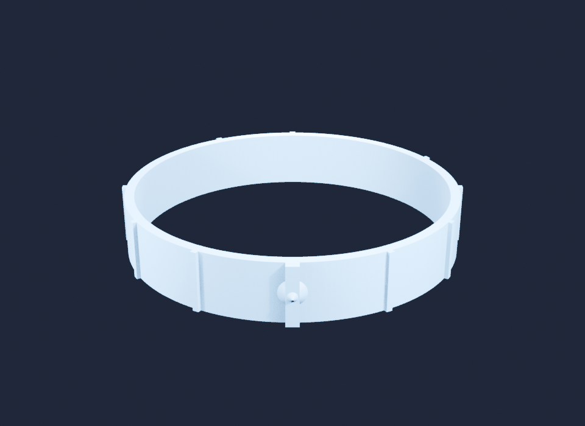
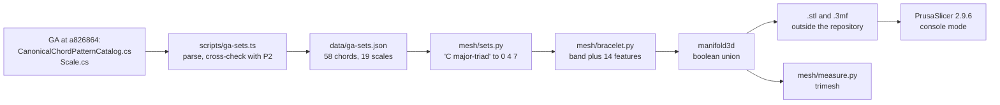
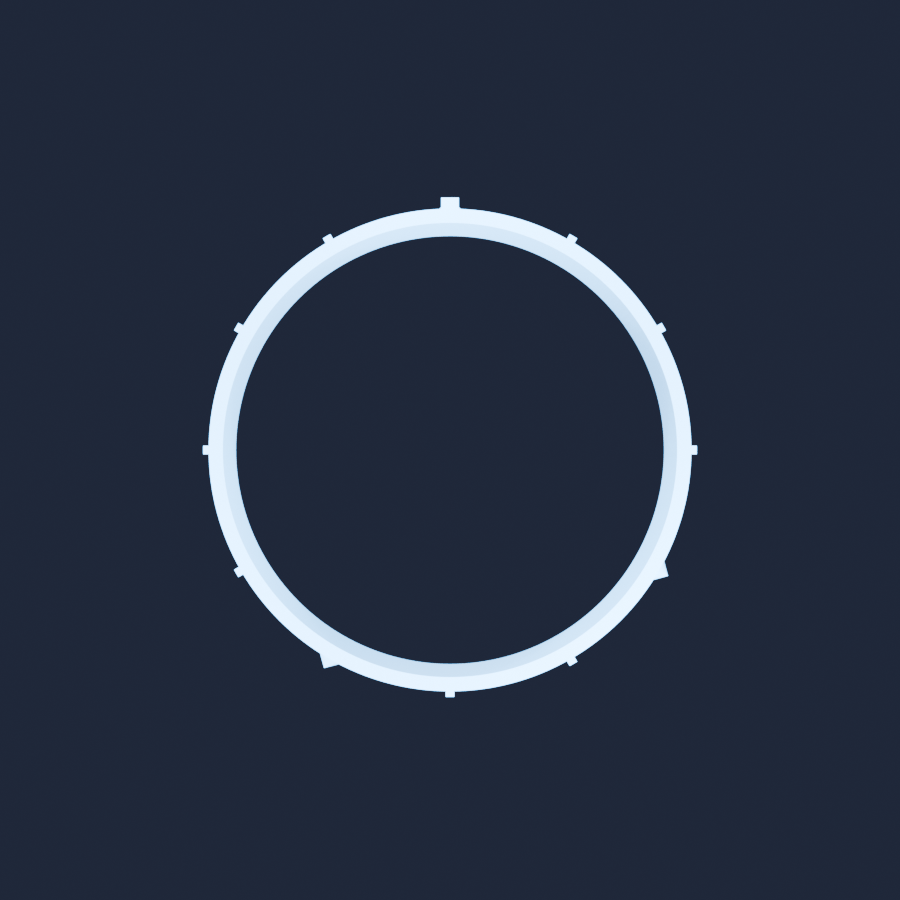

Prototype 2 draws a ring of twelve beads and lights the ones the chord is playing. This one asks whether that ring can leave the screen: a 65 mm bangle, twelve positions around it, a bead where GA's set has a note, a rib where it has none, and a keel on C so your thumb finds the top without counting. Nothing was printed — there is no printer here — so the question becomes a narrower one that can still be answered honestly: **does the mesh survive everything a printer's software checks before the first layer?**



*C major: beads on C, E and G, ribs on the nine other positions, and the keel on C facing the camera. Rendered by Blender 5.2.2 from the exported `.stl`.*

Code: [`code/ga-protos/p5-printable-bracelets`](https://github.com/spareilleux/learn/tree/b171d57/code/ga-protos/p5-printable-bracelets). The pitch classes come from [`scripts/ga-sets.ts`](https://github.com/spareilleux/learn/blob/b171d57/code/ga-protos/p5-printable-bracelets/scripts/ga-sets.ts), the geometry from [`mesh/bracelet.py`](https://github.com/spareilleux/learn/blob/b171d57/code/ga-protos/p5-printable-bracelets/mesh/bracelet.py), and every number below from [`mesh/measure.py`](https://github.com/spareilleux/learn/blob/b171d57/code/ga-protos/p5-printable-bracelets/mesh/measure.py) and [`mesh/slice.py`](https://github.com/spareilleux/learn/blob/b171d57/code/ga-protos/p5-printable-bracelets/mesh/slice.py). The `.stl` and `.3mf` files are not in the repository: they are written to a folder outside it, because the whole suite is 91 files and 15.5 MB, with another 49 MB of G-code, and none of it is source.

## What you already know

If you have ever serialized an object graph, you already know what an STL file is: the worst possible serialization. It is a flat list of triangles, each carrying its three vertex coordinates in full. There is no vertex table, no edge, no notion of which triangle touches which. Two triangles are neighbours only because two of their vertices happen to have the same floating-point coordinates. Everything a solid modeller knows about a shape is thrown away, and every tool downstream has to guess it back.

That is why the vocabulary of 3D printing is about recovering topology from a soup:

- **Watertight**, or edge-manifold: every edge is shared by exactly two triangles. No holes.
- **Consistent winding**: all the triangles agree on which side is outside. A solid whose normals disagree has no inside.
- **Manifold**: watertight, consistently wound, and no edge shared by three or more triangles.
- **Self-intersecting**: triangles that pass through each other. A mesh can be perfectly watertight and still be nonsense.

The other half of the vocabulary belongs to the printer. The object is built one 0.2 mm layer at a time, from the bed up, each layer laid on the one below. A face that leans out too far has nothing under it: that is an **overhang**, measured here as a face's **slope**, the angle between the face and the horizontal plane, which is [PrusaSlicer's own convention for its support threshold](https://help.prusa3d.com/article/support-material_1698). A vertical wall is 90 degrees and is free; a ceiling facing the bed is 0 degrees and needs scaffolding printed under it and broken off afterwards.

Nothing in the prototype is C# or Java: it is Python, because [trimesh](https://trimesh.org/) and [manifold3d](https://github.com/elalish/manifold) are there, and a little Node.js, because GA's catalog was already parsed for prototype 2 and there was no reason to parse it twice.

## The chain



## Where the twelve positions come from

The bracelet is only worth printing if it is right, so the pitch classes are read out of GA rather than typed in. [`scripts/ga-sets.ts`](https://github.com/spareilleux/learn/blob/b171d57/code/ga-protos/p5-printable-bracelets/scripts/ga-sets.ts) runs `git show` against a GA clone pinned on `a826864` and parses two files:

- [`CanonicalChordPatternCatalog.cs`](https://github.com/GuitarAlchemist/ga/blob/a826864f3a012cad88e415954bf57eca0ce12aa6/Common/GA.Domain.Core/Theory/Harmony/CanonicalChordPatternCatalog.cs#L45-L112), 58 chord patterns, each a list of root-relative intervals;
- [`Scale.cs`](https://github.com/GuitarAlchemist/ga/blob/a826864f3a012cad88e415954bf57eca0ce12aa6/Common/GA.Domain.Core/Theory/Tonal/Scales/Scale.cs#L53-L75), 19 named scales, written there as note names: `Scale.Major` is the string `"C D E F G A B"`.

The result is [`data/ga-sets.json`](https://github.com/spareilleux/learn/blob/b171d57/code/ga-protos/p5-printable-bracelets/data/ga-sets.json), with the SHA-256 of each blob it read. Three things guard it, and all three run in CI, where there is no GA clone:

1. every one of the 13 qualities prototype 2 ported must have exactly the same intervals and priority here — the same `QUALITIES` table is imported, not copied;
2. every set must be sorted, deduplicated, rooted on 0 and inside 0 to 11;
3. `Scale.Major` must come out as 0 2 4 5 7 9 11.

### GA's running server disagrees with GA's source

The files are one source; the server is another. Asked through GA's MCP tools on 2026-09-17, the running chord parser answered:

| Asked | GA answered | GA's own catalog file says |
|---|---|---|
| `get_scale_notes('C major')` | 0 2 4 5 7 9 11 | same |
| `get_scale_notes('A minor')` | 9 11 0 2 4 5 7 | same |
| `ga_chord_to_set('Cmaj7')` | C E G B | same |
| `ga_chord_to_set('Cdim7')` | C E flat F sharp B flat, Forte 4-27 | `diminished-7` is 0 3 6 9, Forte 4-28 |
| `ga_chord_to_set('Cm7b5')` | C E flat G B flat, Forte 4-26 | `half-diminished-7` is 0 3 6 10 |

`ga_parse_chord('Cdim7')` returns quality `diminished` with the component `ext:7`, so the seventh is added as a minor seventh instead of a diminished one, and the `b5` of `Cm7b5` is dropped on the floor. Two of the thirteen bracelets would have their beads in the wrong places if they had been built from the chatbot instead of the catalog. The full exchange is in [`results/ga-check.json`](https://github.com/spareilleux/learn/blob/b171d57/code/ga-protos/p5-printable-bracelets/results/ga-check.json); it is the kind of thing this lab exists to find, and it is in the course journal for the author to decide whether to open an issue.

### The ring reads the same way it does on screen

Position `pc` sits at `angle = pi/2 - pc * pi/6`: C at the top, the rest clockwise, exactly the formula in prototype 2's [`scene.ts`](https://github.com/spareilleux/learn/blob/b171d57/code/ga-protos/p2-chord-universe/src/app/scene.ts) and the diagram of the [music theory course's lesson 2](../../music-theory-ga/02-scales-and-modes/). A unit test asserts the formula, and three more assert that C is at 90 degrees, F sharp opposite it at 270, and every gap is 30 degrees.



*Seen from above: C at twelve o'clock with its keel, E at four, G at eight.*

## The object

| Parameter | Value |
|---|---|
| Inner diameter | 65.0 mm |
| Band wall | 2.0 mm |
| Band height | 12.0 mm |
| Outer diameter | 69.0 mm |
| Segments per circle | 192 |
| Bead, a note in the set | cone, base radius 3.0 mm, height 3.0 mm, embedded 0.4 mm in the wall |
| Rib, no note | 1.2 mm wide, 0.8 mm proud, full height |
| Keel, pitch class 0 | 2.5 mm wide, 1.6 mm proud, full height |

Fourteen parts are built along the +X axis and rotated onto their positions, then merged. The band is `trimesh.creation.annulus`, the cone is `trimesh.creation.cone` turned on its side, the ribs are boxes, and the keel is a profile extruded with [Shapely](https://shapely.readthedocs.io/). The merge is the whole point:

```python
def solid(self) -> trimesh.Trimesh:
    """The boolean union, computed by manifold3d."""
    return trimesh.boolean.union([p.copy() for p in self.parts], engine="manifold")
```

The alternative, which a great many scripts on the internet do, is to write all fourteen parts into one file and call it a model:

```python
def naive(self) -> trimesh.Trimesh:
    """Every part in one file, with no boolean at all: what a script without a CSG engine writes."""
    return trimesh.util.concatenate([p.copy() for p in self.parts])
```

Both were built and both were measured. What happened is not what was predicted.

## Hypotheses, committed first

[`results/hypotheses.md`](https://github.com/spareilleux/learn/blob/8a2ed53/code/ga-protos/p5-printable-bracelets/results/hypotheses.md) was committed in [`8a2ed53`](https://github.com/spareilleux/learn/commit/8a2ed53), before `mesh/build.py`, `mesh/measure.py` or `mesh/slice.py` existed. Twelve predictions, H1 to H12. The verdicts are at the end of this lesson; four of them are wrong.

## What the mesh says

Every figure below comes from [`results/measurements.json`](https://github.com/spareilleux/learn/blob/b171d57/code/ga-protos/p5-printable-bracelets/results/measurements.json), 31 solids built and measured in **5.95 s** on Python 3.14.2, trimesh 5.1.0, Windows 11. No GPU is involved at any point.

### Topology

| | union, cone beads | union, spherical beads | parts concatenated |
|---|---|---|---|
| Watertight | yes | yes | **yes** |
| Winding consistent | yes | yes | yes |
| Connected bodies | 1 | 1 | **14** |
| Euler characteristic | 0 | 0 | 26 |
| manifold3d verdict | NoError | NoError | **NoError** |
| Triangles | 2,386 | 5,474 | 2,040 |
| Volume | 5.2473 cm3 | 5.3761 cm3 | **5.3829 cm3** |

Euler characteristic 0 is the signature of a bangle: one solid of genus 1, a torus with bumps. The concatenated file gets 26 because it is fourteen separate closed solids, thirteen of genus 0 and one of genus 1, overlapping in space but touching nowhere in the data.

And here is the first surprise. **H2 predicted that the concatenated mesh would fail the watertightness test. It passes.** Each part is closed on its own, so every edge still has exactly two triangles, and both trimesh and manifold3d say it is fine. "Watertight" is a statement about edges, not about solids. What the concatenated file actually costs is everything downstream that believes it:

- its volume is 2.6 % too high, because the parts count their overlaps twice: 5.3829 cm3 instead of 5.2473;
- its surface area is 10.8 % too high, 68.13 cm2 instead of 61.48;
- and the wall thickness measurement, below, reads **1.40 mm** instead of 2.00, because the ribs' buried inner faces are real surfaces sitting inside the band. With spherical beads it reads 0.0488 mm.

### Does the wrist still fit

Rays are fired outwards from 2,000 points inside the wall; where each leaves the solid gives the thickness there. The bore is measured as the smallest distance from the axis to any point of the surface, which on a 192-sided polygon is the middle of an edge, never a vertex.

| | cone beads | spherical beads |
|---|---|---|
| Inner diameter | **64.9913 mm** | **63.0287 mm** |
| Lost to faceting | 0.0044 mm | 0.986 mm |
| Wall, minimum | 1.9954 mm | 1.9954 mm |
| Wall, median | 1.9968 mm | 1.9969 mm |


*The rejected variant, with spherical beads. From outside it looks fine; the 1 mm of each sphere that sticks into the bore is on the other side of the wall.*

The faceting costs 4.4 micrometres of radius, some fifty times less than the tolerance of a consumer printer. The second column is the second failure: **a sphere of radius 3.0 mm centred on the outer surface of a 2.0 mm wall comes out 1.0 mm into the bore.** Three beads become three lumps inside the bracelet, and the bore drops by 1.96 mm. This is exactly the bead prototype 2 draws on screen, where a bead has no thickness to eat into, transplanted without thinking into an object that does. The lesson is not that spheres are bad: it is that a shape that reads well in a renderer has no opinion about the wall it is standing on.

### Overhangs

Faces are grouped by slope; the ones resting on the bed are excluded, since they are not hanging over anything.

| | cone beads | spherical beads |
|---|---|---|
| Worst slope, off the bed | **45.0 degrees** | **4.87 degrees** |
| Area below 45 degrees | 0.0000 cm2 | 0.2163 cm2 |
| Share of the surface | 0.00 % | 0.35 % |

A cone whose height equals its base radius presents 45 degrees everywhere, which is exactly the threshold and therefore free. The sphere's lower half goes almost flat: 4.87 degrees is a ceiling. Supports are not optional there, and the slicer agrees below.

**H6 predicted 3 % to 8 % of the surface would need support with spherical beads; the answer is 0.35 %.** The prediction was an order of magnitude too high — three small spheres on a 62 cm2 object are simply not much area. The direction was right and the number was not, and that is worth saying plainly: "supports needed" and "3 % of the surface" are different claims, and only the first one held.

### The keel, three times

The mark on C went through three shapes, and [`results/keel-sweep.json`](https://github.com/spareilleux/learn/blob/b171d57/code/ga-protos/p5-printable-bracelets/results/keel-sweep.json) has all three.

| Ramp height | Worst slope | Area needing support | Depth at 0.5 mm | at 1 mm | at 2 mm | at mid-height |
|---|---|---|---|---|---|---|
| 1.6 mm | 36.03 degrees | 0.0498 cm2 | 0.0875 mm | 0.775 mm | 1.6 mm | 2.6 mm |
| 2.2 mm | 45.0 degrees | 0.0000 cm2 | 0.0 mm | 0.4 mm | 1.4 mm | 2.6 mm |
| none | 45.04 degrees | 0.0000 cm2 | **1.6 mm** | **1.6 mm** | **1.6 mm** | 2.6 mm |

The hypotheses file describes the keel as "chamfered at 45 degrees top and bottom". The code built a ramp 1.6 mm tall over 2.2 mm of depth, which is 36 degrees, below the threshold and needing support — a design intent that the implementation did not honour, and that only the measurement caught. Making the ramp a real 45 degrees fixed the overhang and cost the mark its depth: at 1 mm above the bed the keel stood 0.4 mm proud, half as much as an ordinary rib, so the feature meant to be found by touch had vanished exactly where a thumb rests.

The third row is the answer, and it is slightly embarrassing: a vertical feature on a vertical wall, printed with the bangle's axis up, **hangs over nothing at all**. Its bottom face is the bed and its top face points at the sky. The ramp was solving a problem that did not exist, and both the 36-degree overhang and the lost depth were self-inflicted. The ribs, plain boxes with no ramp at all, had been reporting zero overhang area the whole time.

## What the slicer says

There was no slicer on this machine when the hypotheses were written, and H11 said so. [PrusaSlicer 2.9.6](https://github.com/prusa3d/PrusaSlicer/releases/tag/version_2.9.6) was then downloaded as its portable Windows build (106.6 MB, [AGPL-3.0](https://github.com/prusa3d/PrusaSlicer/blob/master/LICENSE)) and run in console mode, with the whole profile spelled out on the command line so nothing depends on a configuration someone set up in a window:

```bash
prusa-slicer-console.exe --export-gcode \
  --nozzle-diameter 0.4 --filament-diameter 1.75 --filament-density 1.24 \
  --layer-height 0.2 --first-layer-height 0.2 --perimeters 3 \
  --top-solid-layers 4 --bottom-solid-layers 4 --fill-density 15% --fill-pattern gyroid \
  --temperature 215 --bed-temperature 60 --support-material-threshold 45 \
  --skirts 1 --bed-shape 0x0,250x0,250x210,0x210 --gcode-flavor marlin2 \
  --output out.gcode bracelet.stl
```

It sliced every file without one complaint, and printed no repair message for any of them. Sixty layers each.

| Object | Filament | Volume | Time |
|---|---|---|---|
| Plain band, no features | 6.15 g | 4.96 cm3 | 26 min 43 s |
| C major triad, cone beads | 6.42 g | 5.18 cm3 | 35 min 40 s |
| C major scale, cone beads | 6.47 g | 5.22 cm3 | 39 min 56 s |
| C major triad, spherical beads | 6.60 g | — | 37 min 31 s |
| the same, with supports on | 6.81 g | — | 39 min 07 s |
| C major scale, spherical beads | 6.90 g | — | 45 min 58 s |
| the same, with supports on | 7.47 g | — | 49 min 33 s |


*The C major scale: seven beads, five ribs. It is the heaviest and slowest of the set, at 6.47 g and 39 min 56 s. A natural minor produces exactly this object, which is the point.*

All thirteen chord bracelets land between 6.42 and 6.44 g and between 35 min 16 s and 37 min 10 s: the beads and ribs are a rounding error next to the band. Supports cost 0.21 g and 1 min 36 s for a triad, 0.57 g and 3 min 35 s for a seven-note scale — small, but they also have to be snapped off twelve raised features by hand, and that is the real price.

The filament volume is consistently about 1.3 % below the mesh volume, even at 15 % infill, because a 2.0 mm wall with three 0.45 mm perimeters on each side is solid all the way through: there is almost no infill in this object at all.

**H11 asked for 6.0 to 7.5 g and 25 to 50 minutes. Both held.** The rest of H11 did not.

### The slicer does not care about your fourteen bodies

H11 also predicted PrusaSlicer would repair at least one error in the concatenated mesh. It reported nothing, and sliced it to **6.42 g and 36 min 34 s** against the union's **6.42 g and 35 min 40 s** — 2,154.16 mm of filament against 2,154.05 mm, a difference of 0.005 %. A modern slicer unions overlapping closed solids as part of its own slicing, so fourteen interpenetrating bodies are, to it, one object.

That is worth stating carefully, because it inverts the usual advice. The danger of the un-unioned mesh is not the slicer. It is everything else: the volume and mass you quote, the wall thickness you measure, a resin slicer or an online printing service that is stricter, a CAD import, a mesh repair tool that "fixes" the intersections by deleting geometry, and anybody who opens the file expecting one object. The union is still the right thing to do — it just is not the slicer that will tell you so.

### The one check only the slicer makes

H12 predicted the slicer would find features that do not fit a whole number of extrusions. It does, and the G-code says so: PrusaSlicer writes a `;WIDTH:` comment every time it changes extrusion width.

| Object | Distinct widths | Range | Off the nominal 0.45 mm |
|---|---|---|---|
| Plain band | 18 | 0.371 to 0.572 mm | 17 |
| C major triad, cone beads | 173 | 0.358 to 0.667 mm | 141 |
| C major scale, cone beads | 185 | 0.357 to 0.662 mm | 151 |

The control matters: the featureless band already needs 18 different widths, because a curved 2.0 mm wall is not an integer number of 0.45 mm beads either. The features multiply that by ten. Nothing here is broken — PrusaSlicer's variable-width perimeters handle it — but no geometric measurement of the mesh could have predicted a single one of those numbers. **H12 held, with the caveat that the control experiment shows the effect is not only the ribs' fault.**

## Verdict against the hypotheses

| | Prediction | Result | |
|---|---|---|---|
| H1 | the union is watertight, one body, Euler 0, first try, for both bead shapes and all 13 qualities | 30 of 30 solids, watertight, winding consistent, one body, Euler 0, manifold3d NoError | held |
| H2 | the parts concatenated are not watertight | they are watertight, and manifold3d accepts them: 14 bodies, volume 2.6 % high, wall reads 1.40 mm | **wrong** |
| H3 | volume 5.2 to 5.6 cm3, PLA mass 6.4 to 7.0 g | 5.2473 cm3, 6.507 g | held |
| H4 | inner diameter 64.98 mm or more, faceting under 0.02 mm | 64.9913 mm, 0.0044 mm — but 63.0287 mm with spherical beads | held for the shipped design, and the sphere variant is a published failure |
| H5 | walls 1.99 mm or more, band 2.00 plus or minus 0.01 | minimum 1.9954 mm, median 1.9968 mm | held |
| H6 | spherical beads: 3 % to 8 % of the area needs support | 0.35 %, worst slope 4.87 degrees | **wrong in magnitude**, right that support is needed |
| H7 | cone beads: under 0.5 %, worst overhang 45 degrees or less | 0.00 %, worst slope 45.0 degrees — after the keel was fixed; the first build measured 36.03 degrees | held after a fix the hypothesis did not anticipate |
| H8 | under 60,000 triangles, STL under 3 MB | 2,386 triangles and 119 KB for a triad; 10,354 and 518 KB for the worst case | held |
| H9 | 13 bracelets, both shapes, measured and written, under 60 s | 31 solids in 5.95 s | held |
| H10 | GA's catalog agrees with P2's port; `Scale.Major` is 0 2 4 5 7 9 11; angles match P2 | all three, checked in CI | held |
| H11 | no slicer; if one is found, 0 repairs for the union and at least 1 for the concatenation, 6.0 to 7.5 g, 25 to 50 min | a slicer was found; 6.42 g and 35 min 40 s; **0 repairs for both**, and the concatenation slices to the same grams | grams and minutes held, the repair prediction is **wrong** |
| H12 | at least one feature too thin for whole extrusions | 173 distinct extrusion widths, 141 off nominal — but the bare band already needs 18 | held, with a caveat the hypothesis missed |

## What failed

- **The spherical bead ate the bracelet.** Prototype 2's bead, moved to a 2 mm wall, pokes 1 mm into the bore and takes 1.96 mm off the inner diameter. Both variants are still built and still measured, and the CI check asserts that the failure is still reproducible, so the lesson is not quoting a ghost.
- **The keel's chamfer was 36 degrees, not the 45 the hypotheses claimed.** Nobody noticed until `min_slope_deg` printed 36.027. Then the fix cost readability, and the real answer was to delete the feature that caused both problems.
- **H2 was wrong about what "watertight" means.** It is a property of edges. Fourteen solids sharing a bounding box pass it.
- **The slicer refused to be shocked.** It sliced the un-unioned mesh to the same grams as the union and said nothing. The argument for doing booleans properly has to be made on other grounds.
- **H6 was an order of magnitude out.** Predicting a percentage of surface area without doing the arithmetic first is guessing.

## What only a printer can tell, and is *to verify*

Everything above is geometry and G-code. None of it has been printed, and these are the questions that stay open:

- whether a 65 mm bore actually fits the wearer, and whether it should be 63 or 68 — bangle sizing is a body measurement, not a mesh property (*to verify*);
- whether the 1.2 mm ribs and the 2.5 mm keel are distinguishable by touch once printed at 0.2 mm layers, with the extrusion widths above (*to verify*);
- whether the cone beads' 45-degree underside prints cleanly or droops, since 45 degrees is exactly the threshold and real printers are not exactly at their nominal settings (*to verify*);
- whether a 2.0 mm PLA band 12 mm tall survives being pushed over a hand, or snaps — a 2 mm PLA ring is not obviously strong enough, and no simulation here says anything about it (*to verify*);
- whether the 8 degenerate, zero-area triangles that manifold3d leaves in the cone unions bother any other slicer. PrusaSlicer did not mention them (*to verify*).

## Run it yourself

```bash
cd code/ga-protos/p5-printable-bracelets
npm run sets                                    # check the committed GA sets against P2's port
npm test                                        # the Node.js side
python -m pip install -r requirements.txt
python -m unittest discover -s tests -t . -v    # 14 tests: order, bore, walls, overhangs, readability
python mesh/run.py --suite --band --bead both --naive \
  --out /somewhere/outside/the/repo --results results/measurements.json
python mesh/keel_sweep.py --results results/keel-sweep.json
python mesh/check_ci.py --results results/measurements.json
```

With a slicer, add its path; without one, the script says so and every slicer figure stays *to verify*:

```bash
python mesh/slice.py --slicer /path/to/prusa-slicer-console --out /somewhere/gcode \
  --results results/slicer.json /somewhere/outside/the/repo/*-cone.stl
```

The pictures need Blender, and only the pictures:

```bash
blender --background --python mesh/render.py -- \
  --stl /somewhere/C-major-triad-cone.stl --out shot.png --view three-quarter
python mesh/shrink.py shot.png --colors 128
```

The CI job `p5-printable-bracelets` runs everything except the slicer and Blender, on Ubuntu, Windows and macOS.

## Key takeaways

- "Watertight" is a claim about edges, not about solids. Fourteen interpenetrating closed parts pass every watertightness test, and manifold3d's too, while being wrong in volume by 2.6 % and in wall thickness by 30 %.
- Do the boolean anyway — but know why. The slicer will not thank you: it sliced both meshes to 6.42 g. Everything else downstream will.
- A shape that reads well on screen has no opinion about the wall it stands on. A 3 mm bead on a 2 mm wall costs 2 mm of bore.
- Print orientation decides which features are free. With the bangle's axis up, every vertical rib is free and every ramp you add is a problem you invented.
- Write the design's intent in numbers, then measure the numbers. "Chamfered at 45 degrees" was in the hypotheses and 36 degrees was in the code.
- Percentages of surface area are not intuitive. Predict them by computing an area, or do not predict them.
- Pin the data. GA's catalog files and GA's running chord parser disagree about `dim7` and `m7b5`; a bracelet built from the second would be wrong, and only a pinned, checked source keeps it right.

## Exercises

1. The band's analytic volume is `pi * (34.5^2 - 32.5^2) * 12`. Work it out, compare with the 5.0508 cm3 the mesh reports, and say where the difference comes from and in which direction.
2. The bore is measured as the smallest distance from the axis to the surface, not to a vertex. For a regular polygon of 192 sides inscribed in a circle of radius 32.5 mm, how much smaller is the mid-edge distance? Check against the 0.0044 mm in the table, and say how many segments you would need for the loss to reach 0.05 mm.
3. Twelve positions are 30 degrees apart. At the outer radius, how far apart are two neighbouring bead centres, and how large could a bead get before two of them touched?
4. A cone with equal height and base radius has a worst slope of exactly 45 degrees. What slope would a hemisphere of the same base radius have, and what slope does a cone of base radius 3 mm and height 4.5 mm have? Which would you print, and why might neither be the right answer?
5. GA's `Scale.Augmented` is the string `"C D# E G G# B"`. Work out its pitch classes, then say what the bracelet looks like when you turn it by four positions, and what that says about the scale.
6. The un-unioned mesh reports a minimum wall thickness of 1.40 mm with cone beads and 0.0488 mm with spherical ones. Explain both numbers from the geometry.

<details>
<summary>Solution 1</summary>

`pi * (1190.25 - 1056.25) * 12 = pi * 134 * 12 = 5050.9 mm3`, that is 5.0509 cm3. The mesh reports 5.0508 cm3, one part in fifty thousand lower. The mesh is lower because the circles are inscribed 192-sided polygons, which are slightly smaller than the circles they are inscribed in. The area of an inscribed regular polygon is `(N / 2 pi) * sin(2 pi / N)` times the circle's, about `1 - 6.58 / N^2`, so at N = 192 both the inner and the outer circle shrink by 1.8 parts in 100,000; the annulus between them shrinks by the same factor, and the volume with it.

</details>

<details>
<summary>Solution 2</summary>

The mid-edge distance is `R * cos(pi / N)`, so the loss is `R * (1 - cos(pi / N))`. With R = 32.5 mm and N = 192: `cos(0.9375 degrees) = 0.99986612`, so the loss is `32.5 * 1.338e-4 = 0.00435 mm`, which is the 0.0044 mm in the table, and the diameter is `65 - 2 * 0.00435 = 64.9913 mm`.

For a loss of 0.05 mm, solve `32.5 * (1 - cos(pi/N)) = 0.05`, so `cos(pi/N) = 0.9984615`, `pi/N = 0.055475` radians, `N = 56.6`. So any circle drawn with 57 segments or more keeps the faceting under 0.05 mm, and 192 is generous: the reason to use it is the smoothness of the shading, not the fit.

</details>

<details>
<summary>Solution 3</summary>

The outer radius is 34.5 mm and 30 degrees is `pi/6` radians, so the arc between two centres is `34.5 * pi / 6 = 18.06 mm`, and the straight-line distance is `2 * 34.5 * sin(15 degrees) = 17.86 mm`. Two beads of base radius `r` touch when `2r` reaches that, so `r = 8.9 mm` — nearly three times the 3.0 mm used. Long before that, a bead of radius `r` centred on the outer surface reaches `34.5 - r` inwards; it breaks into the bore as soon as `r` exceeds the 2.0 mm wall, which is precisely the failure the 3.0 mm sphere shows. On this band the binding constraint is the wall, not the spacing.

</details>

<details>
<summary>Solution 4</summary>

A hemisphere's surface reaches vertical at its base and horizontal at its pole, so somewhere on it the slope takes every value from 90 down to 0 degrees: its worst slope is 0, a ceiling, which is why the spherical bead measures 4.87 degrees once the mesh is faceted. A cone of base radius 3 and height 4.5 is steeper than 45 degrees: its surface makes `atan(4.5 / 3) = 56.3` degrees with the base plane, so its underside slope is 56.3 degrees, comfortably above the threshold and better than the 45-degree cone, which sits exactly on it.

Neither may be right, because both are pointed. A cone sticking 2.6 to 4.5 mm out of a bracelet is a spike against the wrist and catches on sleeves. A better answer is probably a truncated cone, or a half-cylinder with its axis vertical and its top and bottom cut at 45 degrees — which is the shape the keel ended up being, minus the ramps.

</details>

<details>
<summary>Solution 5</summary>

C is 0, D sharp is 3, E is 4, G is 7, G sharp is 8, B is 11, so the set is 0 3 4 7 8 11. Add 4 to each and reduce mod 12: 4 7 8 11 0 3, the same six notes. Add 8: 8 11 0 3 4 7, the same again. The augmented scale maps onto itself when turned by four or eight positions, so the bracelet has three-fold symmetry and its picture cannot tell you which of C, E or A flat is the root — the same property prototype 2 notes for the augmented triad and the diminished seventh, and the reason a keel on C is not decoration but the only thing that tells you where you are.

</details>

<details>
<summary>Solution 6</summary>

The rays start just inside the inner surface and travel outwards; the measurement is the distance to the first surface they meet. With cone beads, the parts that reach furthest in are the ribs, which are embedded 0.6 mm into the wall. In the concatenated file the rib's own inner face is still there, a real triangle at radius `34.5 - 0.6 = 33.9`, so a ray passing through a rib stops there: `33.9 - 32.5 = 1.40 mm`. In the union that face is interior and was removed, so the ray carries on to the true outer surface at 34.5 and reports 2.00.

With spherical beads the sphere's own surface is inside the bore: a sphere of radius 3.0 centred at 34.5 reaches down to 31.5, which is below the inner radius 32.5. A ray starting at 32.51 and aimed outwards through a bead leaves the sphere almost immediately, giving 0.0488 mm on the sample measured. That number is not a wall at all; it is the measurement telling you the geometry is not what you think it is.

</details>

## Sources

- GuitarAlchemist/ga at `a826864`: [`CanonicalChordPatternCatalog.cs`](https://github.com/GuitarAlchemist/ga/blob/a826864f3a012cad88e415954bf57eca0ce12aa6/Common/GA.Domain.Core/Theory/Harmony/CanonicalChordPatternCatalog.cs#L45-L112), [`Scale.cs`](https://github.com/GuitarAlchemist/ga/blob/a826864f3a012cad88e415954bf57eca0ce12aa6/Common/GA.Domain.Core/Theory/Tonal/Scales/Scale.cs#L53-L75)
- [trimesh](https://trimesh.org/) 5.1.0 and its [`trimesh.boolean`](https://trimesh.org/trimesh.boolean.html), [manifold3d](https://github.com/elalish/manifold) 3.5.3, [Shapely](https://shapely.readthedocs.io/) 2.1.2, [NumPy](https://numpy.org/) 2.5.3, [SciPy](https://scipy.org/) 1.18.1
- [PrusaSlicer 2.9.6](https://github.com/prusa3d/PrusaSlicer/releases/tag/version_2.9.6), [AGPL-3.0](https://github.com/prusa3d/PrusaSlicer/blob/master/LICENSE); [command-line interface](https://help.prusa3d.com/article/command-line-interface_1937) and [support material](https://help.prusa3d.com/article/support-material_1698)
- [Blender](https://www.blender.org/) 5.2.2 LTS, used only to render the pictures
- 3MF Consortium, [3MF core specification](https://github.com/3MFConsortium/spec_core), the format STL should have been
- Marco Attene, Marcel Campen and Leif Kobbelt, ["Polygon Mesh Repairing: An Application Perspective"](https://doi.org/10.1145/2431211.2431214), *ACM Computing Surveys* 45(2), 2013: what "broken mesh" means, and why watertight is only one of the properties that matter
- Prototype 2 of this lab, [Play a chord, see the universe](../02-chord-universe/), whose bracelet this one is made of
