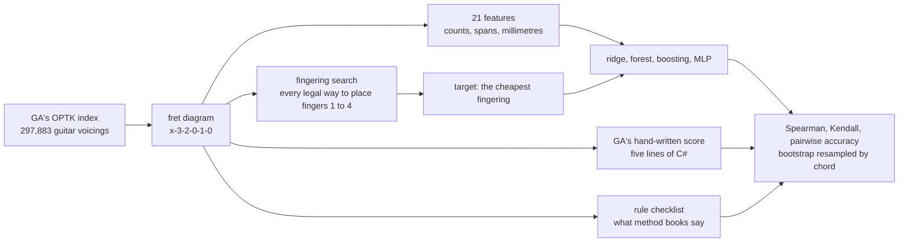

Ask Guitar Alchemist for the easy voicings of a chord and it sorts them by a number, `DifficultyScore`, between 1 and 10. That number is five lines of C#. This prototype asks whether a small model trained on a laptop processor can do better — and, first, what "better" could possibly mean, since nobody has labelled 297,883 voicings with how hard they are to play.

Everything here runs on one CPU core, with no GPU and no dependencies beyond [Node.js](https://nodejs.org/). The code is [`code/ga-protos/p7-playability`](https://github.com/spareilleux/learn/tree/main/code/ga-protos/p7-playability) and the twelve numbered predictions were [committed](https://github.com/spareilleux/learn/blob/c6a9937/code/ga-protos/p7-playability/results/hypotheses.md) before the experiment ran. Four of them were wrong.

## What you already know: a ranking problem without labels

If you have used [ML.NET](https://learn.microsoft.com/dotnet/machine-learning/), the modelling half of this lesson holds no surprises. Read features off each row, fit [`FastTreeRegressionTrainer`](https://learn.microsoft.com/dotnet/api/microsoft.ml.trainers.fasttree.fasttreeregressiontrainer) — gradient-boosted trees, the same family as the model here — and score the result on rows the model has not seen. Small tabular data, a few hundred trees, a CPU: this is the boring, reliable end of machine learning, and it works.

The interesting half is the other one. A supervised model needs a column to predict, and "how hard is this voicing to play" is not a column anyone has. GA has an opinion, but GA's opinion is the thing under test: training a model on GA's score and then announcing that the model agrees with GA would prove nothing. So most of this lesson is about building a target you can argue with, and saying out loud what it is worth.



## GA's cost, read line by line

The score lives in [`VoicingPhysicalAnalyzer.CalculatePlayability`](https://github.com/GuitarAlchemist/ga/blob/66bdd049ad3f4b10f996e4cc6a9c6e58797cf30e/Common/GA.Domain.Services/Fretboard/Voicings/Analysis/VoicingPhysicalAnalyzer.cs#L133-L142), at GA's commit [`66bdd049`](https://github.com/GuitarAlchemist/ga/tree/66bdd049ad3f4b10f996e4cc6a9c6e58797cf30e), the same commit P1 pinned:

```csharp
// Compute numeric difficulty score (1-10) using spanScore
var difficultyScore = 1.0;
if (barreRequired) difficultyScore += 2.0;

// Use logarithmic span score instead of raw fret count
difficultyScore += spanScore * 3.0; // max ~4.0 extra for wide stretch

if (layout.OpenStrings.Length == 0) difficultyScore += 1.0;
if (minimumFingers == 4) difficultyScore += 1.0;
difficultyScore = Math.Min(10.0, difficultyScore);
```

`spanScore` is the distance in millimetres between the lowest and the highest fretted note, divided by 80. The millimetres are real: [`PhysicalFretboardCalculator`](https://github.com/GuitarAlchemist/ga/blob/66bdd049ad3f4b10f996e4cc6a9c6e58797cf30e/Common/GA.Domain.Services/Fretboard/Analysis/PhysicalFretboardCalculator.cs#L52-L58) places each fret at `scale * (1 - 2^(-fret/12))` on a 648 mm neck, so the same three-fret stretch costs more at the nut than at the twelfth fret. That part is right, and this prototype reuses it.

The rest of the formula is where it gets interesting. [`ga-cost.mjs`](https://github.com/spareilleux/learn/blob/main/code/ga-protos/p7-playability/src/lib/ga-cost.mjs) ports it line for line into JavaScript so the two can be compared on the same rows. Four things fall out of the port, before any model is trained.

**The barre flag misses the most famous barre chord.** [`DetectBarreRequirement`](https://github.com/GuitarAlchemist/ga/blob/66bdd049ad3f4b10f996e4cc6a9c6e58797cf30e/Common/GA.Domain.Services/Fretboard/Voicings/Analysis/VoicingPhysicalAnalyzer.cs#L219-L233) looks for the same fret on **three adjacent** strings. The F barre, `133211`, holds strings 1, 2 and 6 at fret 1 — three strings, but not three adjacent ones, because strings 3, 4 and 5 are higher up. `barreRequired` is false, and the chord every beginner fears loses its two points. The A-shape barre `x13331` does trigger it, on the three middle strings at fret 3, where the *ring* finger usually sits.

**"Minimum fingers" counts frets, not fingers.** `minimumFingers` is `Math.Min(uniqueFrets, 4)`, the number of distinct fretted positions. Am (`x02210`) and Am7 (`x02010`) have the same two distinct frets, so GA gives them the same 2.29, although one uses three fingers and the other two. The same tie hits E against E7, G against the four-finger G, and D against Dsus4.

**A full F barre and a small four-string F score identically.** `133211` and `xx3211` both run from fret 1 to fret 3 with no open string and three distinct frets, and neither triggers the barre flag: both come out at exactly 4.50. One is the wall of every first method book; the other is what teachers offer instead.

**The label and the number disagree.** The `Difficulty` string is computed from `spanScore` too, with a "Beginner" band at `spanScore <= 0.8`, that is a span of at most 64 mm. Frets 1 to 3 already measure 66.7 mm, so the open C chord — `x32010`, the first chord of most method books — comes out **Intermediate**. Meanwhile a voicing GA calls "Advanced" can carry a score in the easiest quarter of the index, as the disagreement section below shows.

None of this is a crime. It is five lines that have to answer in microseconds, inside [`VoicingFilterService`](https://github.com/GuitarAlchemist/ga/blob/66bdd049ad3f4b10f996e4cc6a9c6e58797cf30e/Apps/ga-server/GaApi/Services/VoicingFilterService.cs#L53-L70), which filters on `DifficultyScore` and orders by it. But it is a low bar, and the point of P7 is to measure how low.

## A target you can argue with

GA's cost never assigns fingers. It reads four summary numbers off the diagram and adds them up. [`fingering.mjs`](https://github.com/spareilleux/learn/blob/main/code/ga-protos/p7-playability/src/lib/fingering.mjs) does the opposite: it enumerates every legal way of putting fingers 1 to 4 on the fretted notes and keeps the cheapest. That is the classic shape of the problem, from Sayegh's ["optimum path paradigm"](https://doi.org/10.2307/3680014) in 1989 to the constraint search of [Radicioni and Lombardo](https://doi.org/10.1007/s10601-007-9015-y), with the biomechanics of guitar difficulty measured by [Heijink and Meulenbroek](https://doi.org/10.1080/00222890209601952).

The rules are short. Finger numbers follow the frets: nothing the index finger holds sits above what the middle finger holds. Several notes at one fret may share a finger — a barre, full or partial, and *any* finger can make one, which is what a guitarist does with the ring finger in an A shape. A barre is impossible when a string between its ends is open, or sounds at a lower fret. Then each placement is charged:

| term | cost |
|---|---|
| each finger placed | 0.15 |
| the little finger is used at all | 0.20 |
| two fingers crowded on the same fret | 0.25 per pair |
| stretch beyond what the pair of fingers spans comfortably | 0.06 per millimetre |
| one finger holding several strings | 1.00, plus 0.35 per extra string |
| that barre sits on fret 1 or 2 | 0.80 |
| that barre is made by the ring or little finger | 0.60 |
| a muted string inside the chord | 0.90 each |
| a muted string under a barre | 0.80 each |
| the shape sits above fret 15 | 0.50 |

The comfortable spans are 42 mm between fingers 1 and 2, 34 mm between 2 and 3, 30 mm between 3 and 4, and the sums of those for the pairs that skip a finger. The geometry — fret spacing, string spacing at a given fret — is GA's own.

**Every number in that table is a constant I chose.** Nobody played a note to calibrate them. What makes this a defensible *target* rather than a second opinion is that it is a different kind of object: a combinatorial search over an explicit hand model, where GA's score is a closed-form sum of four flags. It knows about fingers; GA's does not. It also leaves out real guitar: the thumb over the top, a string damped by the fretting hand, notes held by two fingers. Shapes that need those come out dearer than a guitarist would find them, or impossible.

## What the target is worth

Three checks, none of them proof.

**Against a disclosed set of hand-ranked pairs.** [`results/annotations.json`](https://github.com/spareilleux/learn/blob/main/code/ga-protos/p7-playability/results/annotations.json) holds 32 pairwise judgements on canonical shapes: which of these two is harder. The file names its annotator — the language model that wrote this prototype, not a guitarist — and states the rules the answers follow: an open chord is easier than a barre chord, fewer fingers is easier, a smaller stretch is easier, a muted string inside the chord is harder, the same shape is harder at the first fret. Pairs that could not be defended from those rules were left out; arguable ones are marked and reported separately.

| cost | the 25 high-confidence pairs | all 32 pairs |
|---|---|---|
| fingering search (the target) | 1.000 | 0.938 |
| GA's hand-written score | 0.880 | 0.781 |
| rule checklist | 0.760 | 0.688 |

The target's perfect score is **not** evidence that it is right. The same head wrote the hand model and the annotation protocol from the same written rules, so that line measures internal consistency and nothing else. The line worth reading is GA's, because someone else wrote it: on eight of its thirty-two misses, GA returns an exact tie between two shapes a method book separates.

**Against a checklist that is neither of them.** [`rules.mjs`](https://github.com/spareilleux/learn/blob/main/code/ga-protos/p7-playability/src/lib/rules.mjs) turns what method books say in words into points — barre, stretch, inner mute, four busy fingers, no open string. Nothing is trained on it. Over the whole index its rank correlation is 0.445 with the search and 0.785 with GA's score: the checklist and GA agree because both are additive flag counts, and both differ from a search that places fingers.

**Against itself, on the shapes you can picture.** These are the costs of the annotated shapes, GA's score and its label next to them:

| shape | chart | fingering search | GA | GA's label |
|---|---|---|---|---|
| Em | `0-2-2-0-0-0` | 0.55 | 1.00 | Beginner |
| Am | `x-0-2-2-1-0` | 0.70 | 2.29 | Beginner |
| Am7 | `x-0-2-0-1-0` | 0.30 | 2.29 | Beginner |
| C | `x-3-2-0-1-0` | 0.65 | 3.50 | Intermediate |
| Cmaj7 | `x-3-2-0-0-0` | 0.30 | 2.21 | Beginner |
| Cadd9 | `x-3-2-0-3-3` | 1.55 | 2.21 | Beginner |
| D | `x-x-0-2-3-2` | 0.73 | 2.21 | Beginner |
| G | `3-2-0-0-0-3` | 0.90 | 2.21 | Beginner |
| Fmaj7 | `x-x-3-2-1-0` | 0.65 | 3.50 | Intermediate |
| F, four strings | `x-x-3-2-1-1` | 2.25 | 4.50 | Intermediate |
| F barre | `1-3-3-2-1-1` | 3.75 | 4.50 | Intermediate |
| A barre, fret 5 | `5-7-7-6-5-5` | 2.75 | 3.99 | Intermediate |
| B♭ barre | `x-1-3-3-3-1` | 3.87 | 6.50 | Intermediate |
| wide stretch | `x-x-7-9-8-11` | 3.00 | 6.35 | Intermediate |
| narrow stretch | `x-x-7-9-8-9` | 1.05 | 3.77 | Intermediate |

The search puts the F barre above the small F and above the same shape at the fifth fret, and it separates Am from Am7, which GA cannot. It also gets two of the thirty-two pairs wrong, both marked medium confidence: it calls Dsus4 slightly easier than D, and the A5 power chord easier than open D. Its constants are not calibrated, and those two pairs are where you can see it.

## A third of GA's guitar index cannot be fingered at all

The first measurement was not planned. Building the dataset over the whole index — 297,883 guitar voicings, from the file P1 pinned by hash — the search found **no legal fingering for 101,967 of them, 34.2 %**.

That number moved once. The first version of the search only allowed the index finger to barre, and only across every note of the lowest fret; it rejected 62 % of the index. Generalising it — any finger may barre, a barre may hold a subset of a fret's notes, a barre may pass under higher notes — brought it to 34.2 %. The shapes that remain are things like `x12345` (five frets, five fingers, one hand) or `103212`, where two notes at fret 1 sit on either side of an open string and three more sit at frets 2 and 3: two barres would be needed and neither is possible.

GA's index is generated combinatorially — P1 recorded 688,351 raw voicings deduplicated to 313,047 — so unplayable shapes surviving is not a surprise. What is worth noting is that **GA's score never says so**. The highest score it gives to a voicing nobody can finger is 7.73, comfortably inside the range it gives to ordinary chords, and `VoicingFilterService` will happily return one under `maxDifficulty: 8`.

Can a small model tell? Trained on the same 21 features, split by chord, gradient boosting separates fingerable from unfingerable with an accuracy of **0.903** against a majority baseline of 0.663, and an area under the ROC curve of **0.973**. Read as a ranker for the same question, GA's score reaches **0.677**. The information is in the diagram; the formula just does not look for it.

## Splitting by chord, and why it changed nothing

The classic trap in this domain is splitting by voicing. Ten fingerings of the same C major, one fret apart, are not ten independent rows: put some in training and some in test and the test set is answering a question it has already seen. So the experiment splits three ways and reports all three:

- **by voicing** — the naive split, every row its own group;
- **by chord** — the group is the pitch-class set, so every voicing of one chord stays on one side;
- **by shape** — the group is the fret pattern with the position removed, so the same grip transposed up the neck is one group, which is stricter still.

Rank correlation of each predictor on the held-out rows, same data, only the wall moves:

| predictor | by voicing | by chord | by shape |
|---|---|---|---|
| GA's score | 0.597 | 0.596 | 0.602 |
| span only | 0.793 | 0.794 | 0.803 |
| ridge | 0.907 | 0.906 | 0.910 |
| random forest | 0.958 | 0.957 | 0.960 |
| gradient boosting | 0.964 | 0.964 | 0.966 |
| MLP | 0.961 | 0.959 | 0.962 |

**H6 predicted a gap of 0.005 to 0.05 for the boosted trees, and there is none: 0.0005.** The prediction was wrong, and the reason is the useful part. Leakage costs you when the group carries information the features do not. Here the features are pure geometry of the diagram, the target is a deterministic function of the same diagram, and the chord label adds nothing: knowing that a voicing spells C major tells the model nothing it cannot read off the frets. Group splitting is still the right default — it is free, and the day someone adds a feature that depends on the chord, the naive split would start lying. But on this data it buys nothing, and saying so is more useful than repeating the warning.

## The models

One core of an Intel Core Ultra 9 285K, Node.js v24.12.0, no GPU, no dependencies. 118,243 training rows, 38,287 for choosing hyperparameters, 39,386 held out, split by chord. The whole run — three splits, six predictors each, bootstrap intervals, the feasibility model — took **302 seconds**. Building the dataset from the 183 MB index, including the fingering search on all 297,883 voicings, took 7.8 seconds.

| predictor | Spearman | 95 % CI | Kendall | MAE | pairwise | 95 % CI | train | size |
|---|---|---|---|---|---|---|---|---|
| mean baseline | 0.000 | 0.000 – 0.000 | 0.000 | 2.112 | 0.500 | 0.500 – 0.500 | 2 ms | 23 B |
| GA's score | 0.596 | 0.584 – 0.607 | 0.427 | 1.654 | 0.715 | 0.700 – 0.725 | — | — |
| rule checklist | 0.449 | 0.437 – 0.465 | 0.322 | 1.888 | 0.650 | 0.639 – 0.663 | — | — |
| span only | 0.794 | 0.785 – 0.803 | 0.610 | 1.295 | 0.799 | 0.785 – 0.813 | 3 ms | 59 B |
| ridge, 21 features | 0.906 | 0.901 – 0.910 | 0.736 | 0.882 | 0.871 | 0.857 – 0.876 | 64 ms | 1,238 B |
| random forest, 60 trees | 0.957 | 0.955 – 0.959 | 0.826 | 0.526 | 0.915 | 0.905 – 0.920 | 3.4 s | 11,947,829 B |
| gradient boosting, 300 trees | 0.964 | 0.962 – 0.966 | 0.841 | 0.477 | 0.921 | 0.912 – 0.930 | 15.9 s | 949,448 B |
| MLP, 32 hidden units | 0.959 | 0.957 – 0.961 | 0.831 | 0.507 | 0.916 | 0.908 – 0.925 | 19.3 s | 15,395 B |

"Pairwise" is the question a user actually asks: given two voicings of *different* chords, which is harder? Mean absolute error is only comparable after each predictor is put on the target's scale by a least-squares line fitted on the training rows, and the table does that. Confidence intervals are a percentile bootstrap over 200 rounds, resampling whole chords rather than voicings.

Three things to take from it.

- **A single feature gets you most of the way.** A least-squares line through the physical span alone reaches 0.794, well above GA's 0.596 — GA's own main term, without the three flags it adds around it. The flags actively hurt.
- **The gap between linear and non-linear is real but small.** Ridge on 21 features reaches 0.906; the boosted trees reach 0.964 and halve the absolute error. Fingering cost is mostly monotone in a few distances, with interactions at the edges.
- **Size and speed are not the same axis.** The forest is 12.6 times the boosting model for slightly worse scores, because 60 deep unpruned trees hold far more nodes than 300 shallow ones. The MLP fits in 15 KB and is within 0.005 of the best.

And the tie rate, which is where GA's cost breaks down: asked to rank two voicings *of the same chord*, GA returns an exact tie for 3.0 % of pairs over the whole index, and the target for 0.3 %. On the held-out rows the rule checklist ties 12.4 % of the time, GA 4.1 %, the boosted trees 0.09 %. The mean baseline, of course, ties every time.

## What the model learned

The share of squared-error gain the boosted trees collected per feature, split by chord:

| feature | share |
|---|---|
| `diagonalMm` — the widest pair of fretted notes, measured across the neck | 0.723 |
| `frettedCount` | 0.057 |
| `fingerSpreadMm` — the same pair, along the neck only | 0.031 |
| `physicalSpanMm` — GA's own term | 0.028 |
| `maxAtMinFret` — how many strings sit on the lowest fret, a barre in disguise | 0.026 |
| `lowStringPlayed` | 0.017 |
| `distinctFrets` | 0.016 |
| `barreAdjacent3` — GA's barre flag | 0.011 |

**H9 was half right.** The top feature is geometry, as predicted, and GA's barre flag holds 0.011 of the gain, below the 0.10 ceiling I gave it. But the model does not ignore barres: it reconstructs them from `maxAtMinFret`, which counts strings at the lowest fret without caring whether they are adjacent — exactly the test GA's flag gets wrong. And the second feature, `frettedCount`, is the one GA has no equivalent for at all.

The diagonal beating the span is the clearest single lesson. GA measures the distance along the neck between the lowest and the highest fret. The model prefers the distance between the two fretted notes that are furthest apart *including across the strings*, which is what the hand actually has to span.

### Two disagreements, taken apart on the neck

`scripts/explain.mjs` prints a voicing's cost term by term. The two extremes of the held-out set:

**GA says hardest, the model says easiest.** `555678`, which GA names Gmaj11/A. GA puts it at the 97th percentile of its own scores; the model at the 12th, and the target at the 8th.

```text
=== 555678   index diagram 8-7-6-5-5-5
  GA's difficulty score: 7.896 — "Intermediate"
    1.000  the base every voicing starts from
    2.000  three adjacent strings share a fret
    2.896  span of 77.2 mm / 80 x 3
    1.000  no open string
    1.000  four distinct frets

  fingering search: 2.500
    finger 1 on the D string, fret 5
    finger 1 on the A string, fret 5
    finger 1 on the low E string, fret 5
    finger 2 on the G string, fret 6
    finger 3 on the B string, fret 7
    finger 4 on the high E string, fret 8
      0.600  4 fingers
      0.200  the little finger is used
      1.700  finger 1 holds 3 strings at fret 5
```

Put your hand on it and it is a staircase: the index barres the bottom three strings at fret 5 and the other three fingers walk up one fret per string, each on the string next to the last. Every finger is where it naturally falls, and the search charges nothing for stretch. GA charges four separate penalties — the barre, the span, the missing open string, the four frets — and every one of them fires on a shape whose difficulty is *low precisely because* those four things line up.

**GA says easy, the model says nearly impossible.** `141404`, an F7♭9♯9 voicing. GA puts it in the easiest quarter, at 4.65; the model at the 95th percentile, and the target at the 92nd.

```text
=== 141404   index diagram 4-0-4-1-4-1
  GA's difficulty score: 4.649 — "Advanced"
    1.000  the base every voicing starts from
    3.649  span of 97.3 mm / 80 x 3

  fingering search: 10.318
    finger 1 on the D string, fret 1
    finger 1 on the low E string, fret 1
    finger 2 on the high E string, fret 4
    finger 3 on the G string, fret 4
    finger 4 on the A string, fret 4
      0.600  4 fingers
      0.200  the little finger is used
      1.350  finger 1 holds 2 strings at fret 1
      0.800  that barre is on fret 1 or 2
      3.693  fingers 1 and 2 are 103.5 mm apart, 61.5 mm over
      2.072  fingers 1 and 3 are 100.5 mm apart, 34.5 mm over
      0.852  fingers 1 and 4 are 100.2 mm apart, 14.2 mm over
      0.250  fingers 2 and 3 share fret 4
```

The index finger has to cover the low E and D strings at fret 1 while the A string between them rings at fret 4, and the three remaining notes sit on alternating strings three frets higher. That is over 100 mm between the index and each of the other three fingers, on a neck where 42 mm is comfortable between the first two. GA sees an open string, a span of three frets and only two distinct frets, and charges nothing but the span — while labelling it "Advanced", which its own score contradicts. That contradiction between GA's label and GA's number is the sharpest thing this prototype found.

**H10 was half right.** I predicted the biggest disagreements would come from GA's flat "+1 when nothing is open". They come from the other side: GA's four penalties *co-firing* on shapes whose ergonomics are good, and GA's span term being the only thing left on shapes whose ergonomics are terrible.

## Was it worth it?

Not on speed. **H12 predicted the model would score a voicing at least 50 times faster than the search finds its fingering; it is 3.8 times faster** — 0.0145 ms against 0.0558 ms per voicing, averaged over 2,000 voicings. The search I called expensive is not expensive: six notes, four fingers and a monotonicity constraint make a tiny tree, and 300 boosted trees are not free to walk either. The whole index takes 4.8 seconds of search. If you wanted the target, you would just compute it.

What the model buys is elsewhere. It is 949 KB of JSON that answers from 21 numbers, so it can ship into a browser or a phone without the hand model, its constants or its assumptions. And it is a *measurement instrument*: it says how much of the target's structure a summary of the diagram can carry at all, and the answer — 0.964 of rank correlation, against 0.596 for GA's five lines — is the gap GA could close by rewriting those five lines, without any machine learning at all. The span-only baseline at 0.794 says most of that gap is three bad flags.

## Hypotheses against results

| | Prediction, written first | Result | Verdict |
|---|---|---|---|
| H0 | annotation scores, disclosed as already measured | 1.000 / 0.880 / 0.760 on the high-confidence pairs | unchanged after the search was generalised |
| H1 | GA against the target, Spearman between 0.55 and 0.80 | 0.593 over the whole index | right |
| H2 | GA ties on more than 25 % of within-chord pairs, the target under 5 % | 3.0 % and 0.3 % | wrong: GA's span term is continuous, so it rarely ties exactly |
| H3 | boosting at least 0.93, ridge 0.80 to 0.92, GA below 0.80 | 0.964, 0.906, 0.596 | right |
| H4 | every trained model beats GA by at least 0.10 | smallest margin 0.31, for ridge | right |
| H5 | pairwise: boosting at least 0.92, GA at most 0.82, mean exactly 0.50 | 0.921, 0.715, 0.500 | right |
| H6 | naive split overstates boosting by 0.005 to 0.05 | 0.0005 | wrong, and the reason matters |
| H7 | the whole experiment under 30 minutes of CPU | 302 s, plus 7.8 s to build the dataset | right |
| H8 | boosting under 1.5 MB, MLP under 25 KB, ridge under 1.5 KB | 949 KB, 15.4 KB, 1.24 KB | right |
| H9 | top three features all geometry; GA's barre flag under 0.10 | `diagonalMm`, `frettedCount`, `fingerSpreadMm`; flag at 0.011 | half right |
| H10 | a voicing above GA's 90th percentile and below the model's 50th, explained by the open-string term | found, at GA 0.970 and model 0.115 — explained by four penalties co-firing | half right |
| H11 | fewer than 2 % of voicings have no legal fingering | 34.2 % | badly wrong |
| H12 | the model scores at least 50 times faster than the search | 3.8 times | wrong |

Four wrong, two half right. H11 is the one that changed the prototype: it forced the search to be generalised and then forced the whole experiment to be split in two, a ranking task on the voicings that can be played and a yes-or-no question on the rest.

## Exercises

1. GA's barre flag misses `133211`. Write the test that would have caught it, and then a rule that catches both `133211` and `x13331` without calling a two-note double stop a barre.
2. The `Difficulty` label and the `DifficultyScore` disagree: find a voicing GA calls "Beginner" whose score is above the median, and one it calls "Advanced" whose score is below the first quartile. What band boundary is at fault?
3. Predict first: if you drop `diagonalMm` from the feature list, does the boosted trees' Spearman fall below ridge's 0.906? Then measure it.
4. The search never uses the thumb. Add a thumb that can fret the low E string at the lowest fret, at a cost you choose, and count how many of the 101,967 unfingerable voicings become playable.
5. The published run splits by pitch-class set. Group instead by root and quality as GA names them (`quality_inferred`), which splits C6 from Am7. Does any number move?
6. Train the boosted trees on **GA's score** instead of the fingering cost, then score that model against the fingering cost. What does the result tell you that the lesson's table does not?
7. The model is 949 KB. Cut the boosting to 60 rounds of depth 3 and report the Spearman and the size. Which curve is steeper?

<details>
<summary>Solutions</summary>

1. `assert.equal(gaBarreRequired(parseChart('1-3-3-2-1-1')), true)` fails on the port, as it would on the C#; the test in [`tests/voicing.test.mjs`](https://github.com/spareilleux/learn/blob/main/code/ga-protos/p7-playability/tests/voicing.test.mjs) asserts the current behaviour instead, with a comment, so the day GA fixes it the test fails loudly. A better rule: count the strings at the lowest fretted fret, require at least three of them, and require that no string *between* the lowest and highest of those sounds at a lower fret. That is `maxAtMinFret >= 3` plus the barre validity check of `fingering.mjs`, and it accepts both shapes while rejecting a two-string double stop.
2. Em (`022000`) is "Beginner" with a score of 1.00, so look the other way: `141404` is "Advanced" at 4.65, the 26th percentile of the index. The `Difficulty` bands use `spanScore` with a hard edge at 1.2 while the score uses the same `spanScore` continuously and then adds flags, so a voicing can cross the label boundary without the score moving much. The 0.8 boundary of "Beginner" is the other fault: it is under two frets at the nut, which excludes almost every open chord.
3. It does not. The model reconstructs most of the diagonal from `fingerSpreadMm` and the string-related counts; expect a fall of a few thousandths, not to 0.906. Measuring is the point of the exercise: change `FEATURE_NAMES` and `features()` together, rerun `train.mjs`, compare the `chord` split.
4. Allow a fifth "finger" 0 that may hold only the low E string, only at the lowest fret, at a cost of about 0.8 plus a penalty if the shape's span is under three frets, since a thumb that close is awkward. The count is the measurement; the interesting part is that it should mostly rescue shapes with six fretted notes over three frets, not the `x12345` family, which stays impossible.
5. The chord groups go from 2,498 pitch-class sets to several thousand names, so the groups get smaller and the split gets *less* strict. Given that the by-shape split — much stricter — already moves nothing, expect no change beyond the third decimal, for the same reason H6 failed.
6. The model trained on GA's score will reach a high correlation with GA's score and a correlation near GA's own 0.596 with the fingering cost. It cannot inherit knowledge the label does not contain. That is the whole argument for spending most of this prototype on the target rather than on the models.
7. Sixty rounds of depth 3 give roughly a fifth of the nodes, so around 100 to 200 KB, and a Spearman a little below 0.96. Size falls faster than accuracy, which is the usual shape: the last hundred trees of a boosting run are correcting rare rows.

</details>

## Key takeaways

- When the label does not exist, building it honestly is most of the work. Say who made it, out of what, and what it cannot see.
- A model trained on your own target will beat a formula that was never fitted to it. That is not the finding; the finding is *how much* structure the formula leaves behind — here 0.596 against 0.964 of rank correlation, most of it recoverable by one continuous feature.
- Measure your reference before you try to beat it. Reading GA's five lines found a barre flag that misses the F barre, a "minimum fingers" that counts frets, a full barre scoring the same as a four-string shape, and a label that contradicts its own score.
- 34.2 % of GA's guitar index has no legal fingering under a four-finger hand model, and GA's score never exceeds 7.73 on any of them.
- Split by group anyway, but check whether it matters: here the naive split, the split by chord and the split by transposed shape agree to three decimals, because the chord label adds nothing the diagram does not already say.
- Small models on one CPU core are enough for tabular data of this size: 118,000 rows, 21 features, 300 boosted trees, 16 seconds.
- The expensive thing was not expensive. A prototype whose premise is "replace a slow search with a fast model" has to measure both, and mine was only 3.8 times faster.
- Write the numbers down first. Four of my twelve predictions were wrong, and the one that was most wrong — 2 % against 34.2 % — changed the shape of the whole prototype.

## Sources

- GuitarAlchemist/ga at [`66bdd049`](https://github.com/GuitarAlchemist/ga/tree/66bdd049ad3f4b10f996e4cc6a9c6e58797cf30e): [`VoicingPhysicalAnalyzer.cs`](https://github.com/GuitarAlchemist/ga/blob/66bdd049ad3f4b10f996e4cc6a9c6e58797cf30e/Common/GA.Domain.Services/Fretboard/Voicings/Analysis/VoicingPhysicalAnalyzer.cs), [`PhysicalFretboardCalculator.cs`](https://github.com/GuitarAlchemist/ga/blob/66bdd049ad3f4b10f996e4cc6a9c6e58797cf30e/Common/GA.Domain.Services/Fretboard/Analysis/PhysicalFretboardCalculator.cs), [`PlayabilityInfo.cs`](https://github.com/GuitarAlchemist/ga/blob/66bdd049ad3f4b10f996e4cc6a9c6e58797cf30e/Common/GA.Business.Core/Analysis/Voicings/PlayabilityInfo.cs), [`VoicingFilterService.cs`](https://github.com/GuitarAlchemist/ga/blob/66bdd049ad3f4b10f996e4cc6a9c6e58797cf30e/Apps/ga-server/GaApi/Services/VoicingFilterService.cs), [`VoicingComfortService.cs`](https://github.com/GuitarAlchemist/ga/blob/66bdd049ad3f4b10f996e4cc6a9c6e58797cf30e/Apps/ga-server/GaApi/Services/VoicingComfortService.cs).
- Samir I. Sayegh, ["Fingering for String Instruments with the Optimum Path Paradigm"](https://doi.org/10.2307/3680014), *Computer Music Journal* 13 (3), 1989.
- Daniele P. Radicioni and Vincenzo Lombardo, ["A Constraint-based Approach for Annotating Music Scores with Gestural Information"](https://doi.org/10.1007/s10601-007-9015-y), *Constraints* 12 (4), 2007.
- Wieke Heijink and Ruud G. J. Meulenbroek, ["On the Complexity of Classical Guitar Playing: Functional Adaptations to Task Constraints"](https://doi.org/10.1080/00222890209601952), *Journal of Motor Behavior* 34 (4), 2002.
- Jerome H. Friedman, ["Greedy Function Approximation: A Gradient Boosting Machine"](https://doi.org/10.1214/aos/1013203451), *Annals of Statistics* 29 (5), 2001; Leo Breiman, ["Random Forests"](https://doi.org/10.1023/A:1010933404324), *Machine Learning* 45, 2001; Diederik Kingma and Jimmy Ba, ["Adam: A Method for Stochastic Optimization"](https://arxiv.org/abs/1412.6980), 2014; Bradley Efron, ["Bootstrap Methods: Another Look at the Jackknife"](https://doi.org/10.1214/aos/1176344552), *Annals of Statistics* 7 (1), 1979.
- scikit-learn, [grouped cross-validation](https://scikit-learn.org/stable/modules/cross_validation.html); SciPy, [`kendalltau`](https://docs.scipy.org/doc/scipy/reference/generated/scipy.stats.kendalltau.html) and its tie correction.
- Microsoft Learn: [ML.NET](https://learn.microsoft.com/dotnet/machine-learning/), [`FastTreeRegressionTrainer`](https://learn.microsoft.com/dotnet/api/microsoft.ml.trainers.fasttree.fasttreeregressiontrainer).
- [Node.js test runner](https://nodejs.org/api/test.html) and MDN's [`Math.imul`](https://developer.mozilla.org/docs/Web/JavaScript/Reference/Global_Objects/Math/imul), which the seeded generator and the group hash both use.
