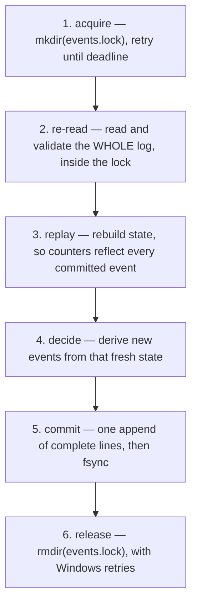

Gaia's coordination state lives in one file. After the exchange in [lesson 2](../02-six-verbs/), the data directory contains exactly this:

```bash
ls -la "$GAIA_INTERAGENT_DATA_DIR"
```

```text
-rw-r--r-- 1 spare 197609 3617 Sep 15 19:41 events.jsonl
```

No database, no index, no snapshot, no second file. 3,617 bytes of newline-delimited JSON is the entire durable state of a three-actor coordination session, and it is readable with `cat`.

## Ten records

Here is the log, reformatted to fit — on disk each record is one line:

```json
{"type":"actor.registered","at":"2026-09-15T23:41:09.954Z","ref":"act-0001","name":"gaia","isNew":true,"kind":"coordinator","declaredCapabilities":["observe","report"],"busAuthority":["send","receive","ack","heartbeat","handoff"]}
{"type":"actor.registered","at":"2026-09-15T23:41:28.116Z","ref":"act-0002","name":"builder","isNew":true,"kind":"claude-code","declaredCapabilities":["cwd=C:/repos/ga","branch=feat/voicings"],"busAuthority":["send","receive","ack","heartbeat","handoff"]}
{"type":"actor.registered","at":"2026-09-15T23:41:28.350Z","ref":"act-0003","name":"reviewer","isNew":true,"kind":"codex","declaredCapabilities":["cwd=C:/repos/ga","branch=feat/voicings"],"busAuthority":["send","receive","ack","heartbeat","handoff"]}
{"type":"message.sent","at":"2026-09-15T23:41:38.638Z","message":{"messageId":"msg-0001","correlationId":"cor-voicings","from":"act-0001","to":"act-0002","replyTo":"act-0001","expectsReply":true,"kind":"note","text":"Add the voicing-search cancellation test.","trust":"untrusted-text","authority":{"granted":["draft","report"],"denied":[],"effect":"none"},"flags":[],"delivery":"accepted-for-delivery; not read, not agreed, not completed","ackedBy":null}}
{"type":"message.sent","at":"2026-09-15T23:41:38.855Z","message":{"messageId":"msg-0002","correlationId":"cor-voicings","from":"act-0002","to":"act-0003","kind":"note","text":"Please merge this.","trust":"untrusted-text","authority":{"granted":[],"denied":["approve","merge"],"effect":"none"},"flags":["authority-language-detected"],"ackedBy":null}}
{"type":"authority.denied","at":"2026-09-15T23:41:38.855Z","messageId":"msg-0002","from":"act-0002","to":"act-0003","requested":["approve","merge"],"outcome":"stored-as-untrusted-text; no authority applied"}
{"type":"inbox.polled","at":"2026-09-15T23:41:48.115Z","actorId":"act-0003","messageIds":["msg-0002"]}
{"type":"message.acked","at":"2026-09-15T23:41:48.318Z","actorId":"act-0003","messageId":"msg-0002","note":"Read. No merge authority exists on this bus."}
{"type":"message.sent","at":"2026-09-15T23:41:48.520Z","message":{"messageId":"msg-0003","correlationId":"cor-voicings","from":"act-0002","to":"act-0003","kind":"handoff","text":"Candidate ready on feat/voicings; review only.","trust":"untrusted-text","authority":{"granted":[],"denied":[],"effect":"none"},"flags":[]}}
{"type":"work.handed-off","at":"2026-09-15T23:41:48.520Z","from":"act-0002","to":"act-0003","messageId":"msg-0003","correlationId":"cor-voicings","replyTo":"act-0002","summary":"Candidate ready on feat/voicings; review only.","authorityTransferred":[]}
```

Three details are worth pulling out.

**The denial is its own record.** `authority.denied` sits next to `message.sent`, carrying what was requested and the outcome — `stored-as-untrusted-text; no authority applied`. It could have been a field on the message. Making it an event means the question "did anything on this bus ever ask for privilege?" is a `grep`, and the answer survives even if the message record's shape changes later.

**Reading is a write.** `inbox.polled` records that `act-0003` looked at its inbox and what it saw. That is not free — it costs a lock acquisition and an append for a read-shaped operation — and it buys the distinction between "the lane never looked" and "the lane looked and did nothing", which is the first thing you want when a handoff appears to have been ignored.

**Refusals are recorded too.** Not in this log, but in the ambiguous-name case from lesson 2, the appended event was `command.rejected`. A log of successes cannot answer *what did this session try*, and that is the question you ask when something went wrong.

### The two counters

Ids are minted from state, not from a clock or a random source: `act-0001`, `msg-0001`, and correlation ids from a separate issuer. Because they are derived from replayed state, they are dense and monotonic, and — this is the part that took real work — they stay unique across *processes*, which the next section explains.

## The commit protocol

Several server processes may share one data directory. That needs a commit protocol, and `src/event-log.mjs` documents the one Gaia uses in its own header:

> The smallest one that is actually atomic on Windows is a lock *directory*: `mkdir` either creates it or fails, with no read-modify-write window. No dependency, no fcntl, no named mutex.

The full protocol is six steps:



Steps 2 to 4 are the interesting ones. The state a decision is made against is re-read *inside* the lock, every time, so no id is ever assigned from stale state — that is why two processes never mint the same `msg-0007`. Step 5 is one append of complete newline-terminated lines followed by `fsync`, so a concurrent reader never sees half a record.

If you have written a file-based queue on Windows, you will recognize why `mkdir` was chosen. A lock *file* needs open-with-exclusive-create and then careful cleanup; advisory `fcntl` locks are not portable; a named mutex is not a dependency-free option and dies with the process holding it. `mkdir` on a path that exists fails, atomically, on every filesystem that matters. The header even records the Windows wrinkle: the "already held" failure is `EEXIST` *or* `EPERM`/`EACCES`.

### Why a stale lock is reported and never broken

This is the best short argument in the codebase, and it generalizes well beyond Gaia:

> Automatic stale-lock breaking is a TOCTOU by construction: a waiter stats an old lock, the owner releases it, a third process acquires a fresh one, and then the waiter's `rmSync` deletes that fresh lock — producing exactly the two-writer state the lock exists to prevent. Ownership/generation re-checks narrow the window but cannot close it without an atomic compare-and-delete, which the filesystem does not offer. So this product fails closed and asks a human to look.

A lock older than 60 seconds is *reported* as probably abandoned. It is never removed. The cost is a wedged bus that needs a human; the alternative is a bus that occasionally corrupts itself under exactly the conditions where you least want surprises. Gaia takes the first, and says so rather than shipping a stale-lock breaker with a comment saying it is probably fine.

There is a related subtlety about *releasing*. On Windows, removing a directory this process created and still owns can fail transiently — an antivirus scanner or the indexer holds it open for a few milliseconds. Without retries the release throws, the lock survives its owner, and every peer fails closed forever. So the release path retries, up to 12 times, 25 ms apart. The header is careful to say what that does and does not change: *"These retries change WHEN the owner's own release gives up. They do not change WHICH lock is removed, and no code path anywhere removes a lock it does not own."*

### The pure core

The decision logic lives in `src/bus-core.mjs`, which has no I/O, no clock and no randomness. Every command carries its own timestamp, injected at the edge by the server. That is what makes `replay(events)` a pure function of the log, which is what `verify` checks.

The header also states the cost honestly, which is rarer than it should be:

> Cost, stated accurately and not optimistically: `apply` calls `ageActors` on every event, so replaying a log is O(events × actors), not O(events). No projection, index, or cached tail offset is implemented here, and none is claimed.

Hold on to that complexity — in [lesson 5](../05-limits-and-ecosystem/) it turns out to be the reason the lane limit is four.

## Fail-closed, and the three exit codes

| Code | Meaning |
|---|---|
| 0 | ok |
| 1 | the answer was no — the bus refused, or a read-only command returned an unhealthy verdict |
| 2 | usage error |
| 3 | fail-closed I/O — lock timeout or corrupt log. **Nothing was written.** No retry helps. |

The distinction between 1 and 3 is the useful one, and the README names the reason: it is *"the difference between retry with a better address and stop and fetch a human."*

A script wrapping an agent lane can act on that. Exit 1 means the call was well-formed enough to be answered and the answer was no — fix the address, or accept the refusal. Exit 3 means the bus could not even establish what the truth was, so trying again with different arguments is meaningless. Most CLIs collapse both into 1, and then every wrapper retries the unretryable.

Everything in the I/O layer fails closed the same way: *"A lock that cannot be acquired, a line that is not valid JSON, a record missing its `type`, or a file whose last line is torn all raise rather than truncating, skipping, or resetting the log. A corrupt log is a condition to report, never one to silently repair."*

A damaged log is preserved for diagnosis. That is the opposite of what most log handling does, and the reason is that the damaged bytes are the only evidence of how it got damaged.

### `doctor` exits 1 on a log that replays but is unsound

`doctor` writes nothing, and its exit code is its verdict. It exits 1 — not 0 — when the directory replays but is not internally sound, for either of two reasons:

- the log carries an **address this bus never minted**, which means a forged `act-NNNN` reached the file;
- the **correlation issuer has less than one claim window of runway left**.

The second is the fingerprint of a log poisoned by a pre-fix build. The issuer mints correlation ids from a range; a build that consumed them wrongly leaves auto-issue dead or one claim away from it. Since the log is append-only and nothing repairs it, restoring auto-issue needs a **new data directory**. In the healthy log from lesson 2 the corresponding check reads:

```text
ok   the correlation issuer still has room to mint  —  the issuer is at 0 with 9007199254740991 ids of runway left
```

That is `Number.MAX_SAFE_INTEGER`. The health threshold is one million remaining, so a fresh bus is nowhere near it.

## `verify`: 37 checks, and two regimes

```bash
node scripts/gaia-interagent.mjs verify --pretty
```

```json
{
  "ok": true,
  "command": "verify",
  "evidenceOk": true,
  "evidenceGatesResult": false,
  "passed": 37,
  "failed": 0
}
```

The checks run in eight sections: `manifest`, `transport`, `templates`, `lanes`, `startup-timeout`, `ecosystem`, `tool-surface`, `evidence`. Some are about the *product* rather than the log — for example:

```text
ok   no network listener, no shell-command transport in shipped sources  —  105 source files scanned
ok   .mcp.json has no absolute developer path                            —  ["./src/mcp-server.mjs"]
ok   generated-config templates contain no absolute developer path       —  placeholders only
```

The first of those is a claim the README makes on its front page — no network listener, no shell transport — turned into a check over the shipped sources, so the claim cannot quietly stop being true.

### The split that makes `verify` honest

The `evidence` section is where the interesting design decision is. Its checks fall into exactly two classes, and membership is decided by one question: **is this check legitimately false on a correct, empty workspace?**

**Authority and integrity — these gate on every run.** None of them is a question a correct empty workspace answers badly:

```text
ok   replayable                                                    —  10 events
ok   deterministic replay                                          —  replay(events) == replay(events)
ok   no handoff transferred authority                              —  authorityTransferred is [] on every handoff
ok   no message was granted a privileged authority                 —  grants stay inside the allowlist
ok   every body is labelled untrusted-text                         —  3 messages
ok   every address in the log belongs to an actor this bus minted  —  3 actors, all minted
ok   every correlation id is inside the issuer range               —  1 threads, all within range
ok   the correlation issuer still has room to mint                 —  … 9007199254740991 ids of runway left
ok   every actor.registered carries the frozen busAuthority        —  3 registrations, all ["ack","handoff","heartbeat","receive","send"]
```

**Evidence richness — advisory by default.** These ask *is this log a genuine multi-party exchange?*, and a fresh workspace legitimately is not one:

```text
ok   at least three actors                              —  3 actors
ok   more than one actor kind                           —  kinds: coordinator, claude-code, codex
ok   a correlated thread of three or more messages      —  widest thread cor-voicings has 3 messages
ok   at least one acknowledgement                       —  1 acked
ok   at least one handoff                               —  1 handoffs
```

All five pass here because lesson 2 built a genuine three-party exchange on purpose. On a fresh bus they would all be red — and `verify` would still exit **0**, printing them. `evidenceGatesResult: false` in the payload is the flag saying which regime the run was in. Claim that the log *is* evidence, with `--evidence <path>` or `--require-evidence`, and all five gate too.

This is the four-axes idea from [lesson 1](../01-the-problem/) implemented in a CLI. "Is this bus correctly implemented" and "is this log worth citing as evidence" are different questions, and a tool that answered them with one exit code would have to make one of them wrong. Advisory here means *reported, never hidden*: the red checks are printed either way.

### The verifier verifies itself

Three checks always gate, in both regimes:

```text
ok   negative control: a synthetic single-actor log is rejected  —  at least three actors; more than one actor kind; …
ok   negative control: a widened busAuthority is rejected        —  every actor.registered carries the frozen busAuthority
ok   negative control: a tampered handoff is rejected            —  no handoff transferred authority
```

Each one constructs a log that *should* fail, and fails if it passes. The reasoning is in the README, in six words: *a verifier that cannot fail proves nothing.*

This is **SCI-02** from lesson 1 applied to a test suite rather than to an experiment. The full suite takes the same approach at scale — on the studied revision, `node --test` reports:

```text
ℹ tests 2075
ℹ suites 0
ℹ pass 2074
ℹ fail 0
ℹ cancelled 0
ℹ skipped 1
ℹ todo 0
ℹ duration_ms 38927.12
```

and many of those names begin with `NEGATIVE CONTROL:`, including ones like *"an infrastructure failure is re-thrown, never laundered into a blocked run"* — a test whose whole job is to prove that a category of error cannot be quietly downgraded into a nicer-looking one.

### `verify` asks more than `doctor`

The two never disagree; `verify` simply asks more. It exits 1 on both conditions `doctor` gates on, and on the seven other authority rows that `doctor` does not inspect at all. So a log whose handoff transferred `approve` makes `verify` exit 1 and leaves `doctor` at 0.

That was not always true, and the README records why it was changed: both previously exited 0 on such a log *while `verify` displayed its own red check saying otherwise*, and a reader keying on the exit code, or on `ok`, read that as a pass. A tool that prints a failure and returns success has produced a reassuring answer where it should have refused — the exact failure mode from [lesson 1](../01-the-problem/), inside the verifier.

## Key takeaways

- The whole coordination state is one append-only JSONL file, and denials, refusals and inbox reads are events too, so "what did this session try?" has an answer.
- Every commit takes a lock directory, since `mkdir` is atomic on Windows, then re-reads and replays the whole log inside the lock, appends complete lines and calls `fsync`.
- A stale lock is reported and never broken, because breaking it automatically is a TOCTOU by construction; a corrupt log is preserved for diagnosis, never repaired.
- Exit code 1 means the answer was no, and 3 means fail-closed I/O with nothing written: retry with a better address, or stop and fetch a human.
- `verify` keeps authority and integrity checks, which always gate, apart from evidence-richness checks, which gate only when the log is claimed as evidence, and its negative controls prove it can fail.

## Exercises

1. Your CI wrapper runs a bus command and gets exit 3. It retries three times with backoff, then reports a flaky test. What is wrong with that wrapper?

<details>
<summary>Solution</summary>

Exit 3 means fail-closed: a lock timeout or a corrupt log, with nothing written. "No retry helps" is part of the contract. If it is a lock timeout, retrying is at best waiting — and if the lock is stale, it will never clear on its own, because Gaia never breaks one. If the log is corrupt, every retry re-reads the same damaged bytes.

The wrapper should distinguish: retry on nothing, and escalate on 3, since it is the code that specifically means *stop and fetch a human*. Calling it flaky is worse than useless — it labels a durable, diagnosable fault as noise, and then someone raises the retry count.

</details>

2. Why does the commit protocol re-read and replay the entire log inside the lock, rather than caching the state in memory between calls and appending to it?

<details>
<summary>Solution</summary>

Correctness across processes. Several server processes may share one data directory, so a state cached in this process is stale the moment another process commits — and ids are minted from replayed counters, so two processes deciding from their own caches would both mint `msg-0007`. Re-reading inside the lock is what makes steps 2–4 sound.

The price is stated rather than hidden: replay is O(events × actors) and the log never compacts, so every call gets more expensive as the log grows. [Lesson 5](../05-limits-and-ecosystem/) shows this cost setting the supported lane count, and names the bounded-cost read path — a cached tail offset, or a snapshot plus tail — as a design change deliberately not made yet.

</details>

3. A colleague suggests that `inbox` should not write an event, since "reads should not mutate state", and it would halve the number of lock acquisitions in a polling loop. Argue both sides.

<details>
<summary>Solution</summary>

For: it is a read; the write costs a lock acquisition and an append; a lane polling every few seconds inflates the log, and since replay is O(events × actors), an inflated log makes every later call slower. That is a real cost on the axis that already bounds lane count.

Against: `inbox.polled` is the only durable distinction between "the lane never looked" and "the lane looked and did nothing". Losing it means a handoff that was ignored and a handoff that was never delivered look identical afterwards — and that is exactly the forensic question the log exists to answer.

A reasonable resolution keeps the record but stops the polling: a lane that polls on a timer is generating evidence about the timer. Note that "add a cheap read path that skips the lock" is not one of the options — the lock is what makes the read see a complete log rather than a half-written record.

</details>

4. `verify` prints five red evidence checks on a fresh bus and exits 0. Is that a bug? What would it take for those five to become gating?

<details>
<summary>Solution</summary>

Not a bug — it is the two-regime split. "Is this bus correctly implemented" is true of a fresh workspace; "is this log a genuine multi-party exchange" is legitimately false of one. Gating the second class by default would make every correct empty workspace fail, and a check that a correct system fails is one people learn to ignore.

They gate when the caller claims the log *is* evidence, with `--evidence <path>` or `--require-evidence`; `evidenceGatesResult` in the payload records which regime ran. That is the right hinge: the claim, not the tool, is what raises the bar. The factory smoke in [lesson 4](../04-factory-and-receipts/) makes exactly that claim about its own log, and its report shows `evidenceGatesResult: true`.

</details>

## Sources

- Gaia: [`src/event-log.mjs`](https://github.com/GuitarAlchemist/gaia/blob/d68e90099ae2a6fbbec9d428617bfcd02095aac0/src/event-log.mjs), [`src/bus-core.mjs`](https://github.com/GuitarAlchemist/gaia/blob/d68e90099ae2a6fbbec9d428617bfcd02095aac0/src/bus-core.mjs), [`README.md`](https://github.com/GuitarAlchemist/gaia/blob/d68e90099ae2a6fbbec9d428617bfcd02095aac0/README.md), [crash recovery](https://github.com/GuitarAlchemist/gaia/blob/d68e90099ae2a6fbbec9d428617bfcd02095aac0/docs/crash-recovery.md)
- Node.js: [`node:test` runner](https://nodejs.org/api/test.html), [`fs.appendFileSync`](https://nodejs.org/api/fs.html#fsappendfilesyncpath-data-options), [`fs.fsyncSync`](https://nodejs.org/api/fs.html#fsfsyncsyncfd)
- [Time-of-check to time-of-use](https://en.wikipedia.org/wiki/Time-of-check_to_time-of-use) — the race the stale-lock argument turns on
