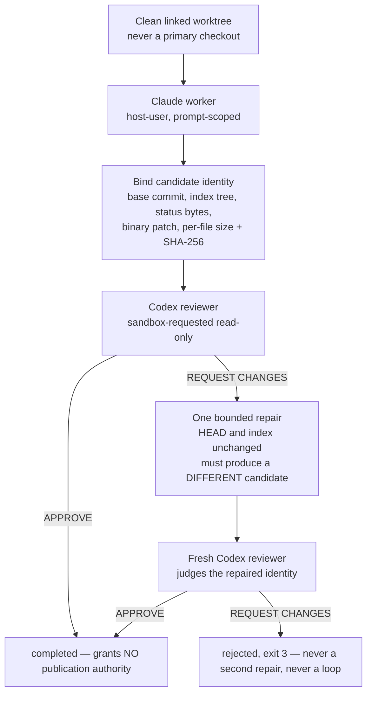

The bus carries messages. That is necessary and not sufficient: at some point an agent has to change a file, another has to judge the change, and somebody has to decide whether it may be published. This lesson is about that path, and about what the artifact it produces is actually worth.

Gaia builds it in two layers, and the split is deliberate. The first proves the control plane with no model in the loop at all. The second adds real agents.

## The coordination tracer

```bash
npm run factory:smoke -- \
  --data-dir ./state/factory-smoke \
  --artifact ./README.md \
  --out ./state/factory-smoke-report.json \
  --task "Review this candidate"
```

It registers a coordinator, a builder and a reviewer; sends and acknowledges three correlated messages; records a zero-authority handoff; and fails unless the evidence gate passes. Here is the report it wrote, abridged:

```json
{
  "ok": true,
  "status": "completed",
  "command": "factory-smoke",
  "execution": "coordination-tracer; no code execution",
  "artifact": {
    "path": "…\\gaia-pin\\README.md",
    "bytes": 71590,
    "sha256": "dc1a34bcbde334ad93e8d8df8effd8fade13f96b4a0d4babc643b62e36403225"
  },
  "task": "Review this candidate",
  "actors": { "coordinator": "act-0001", "builder": "act-0002", "reviewer": "act-0003" },
  "messages": ["msg-0001", "msg-0002", "msg-0004"],
  "acknowledgements": [
    { "messageId": "msg-0001", "ackedBy": "act-0002", "meaning": "receipt only; not agreement, approval, or completion" },
    { "messageId": "msg-0002", "ackedBy": "act-0001", "meaning": "receipt only; not agreement, approval, or completion" },
    { "messageId": "msg-0004", "ackedBy": "act-0001", "meaning": "receipt only; not agreement, approval, or completion" }
  ],
  "handoff": { "messageId": "msg-0003", "correlationId": "cor-0001", "authorityTransferred": [] },
  "evidenceLog": {
    "format": "gaia-event-log-fixed-point/1",
    "pathRole": "data-dir/events.jsonl",
    "bytes": 6315,
    "events": 15,
    "sha256": "256a51d27fd7920e3d871e486dbdf3e5a67489a115bb1f1216dc5a04033ec85a"
  },
  "verification": { "ok": true, "evidenceOk": true, "evidenceGatesResult": true },
  "toolSurface": ["ack", "handoff", "heartbeat", "inbox", "register", "send"]
}
```

Three fields carry the whole idea.

`execution: "coordination-tracer; no code execution"` is the report telling you what it is not. It ran no model and executed no repository code. It proves the factory *control-plane* path — that a three-role cycle can complete, be verified, and be replayed — and it deliberately proves nothing about the quality or provenance of an AI-produced change. A tracer that quietly implied more would be the "prototype accepted as integration" shortcut from [lesson 1](../01-the-problem/).

`evidenceLog` is a **fixed point**: the exact bytes of the log, their count, and their SHA-256. Anyone handed this report can recompute that digest from the log and confirm they are reading the same coordination history. Without it, "the run succeeded" is a sentence in a JSON file.

`evidenceGatesResult: true` is the claim from [lesson 3](../03-event-log-and-replay/) being made deliberately. The smoke run asserts that its log *is* evidence, so all five richness checks gate rather than merely report. Run it and the run fails if the exchange was not genuinely multi-party.

Notice also `toolSurface` in the receipt itself. The artifact records the complete set of verbs that existed when it was produced, so a reader in a year does not have to trust that today's code has the same six.

## The real agent factory

Now the layer with models in it. One command creates a candidate with a real Claude worker and judges it with a real Codex reviewer:

```bash
npm run factory:agent -- \
  --worktree ../my-project-gaia-run \
  --task "Implement the bounded change and its focused tests" \
  --out ../state/gaia-agent-run.json \
  --timeout-ms 600000
```

:::caution[Not run for this lesson]
This command spends a real Claude turn and a real Codex turn on the installed subscriptions. Everything below is read from `src/factory-agent.mjs`, [its design document](https://github.com/GuitarAlchemist/gaia/blob/d68e90099ae2a6fbbec9d428617bfcd02095aac0/docs/factory-agent-design.md), and the receipt schema — it is *to verify* against an actual run, and the journal says so.
:::

### The shape, and why it is that shape

The design document records three candidate interfaces before implementation — [Design It Twice](../01-the-problem/), applied to a load-bearing seam:

| Design | Why not / why |
|---|---|
| A monolithic Claude script | Smallest initial diff, but provider flags, Git isolation, evidence and verdict parsing become inseparable |
| An arbitrary command runner | Superficially flexible, but exposes a shallow shell-shaped interface and makes authority, quoting and provider identity *caller claims* |
| A provider-neutral core with **closed** provider profiles | Selected: the core owns worktree isolation, candidate identity, review non-mutation, one bounded repair and receipt semantics; small adapters own the exact Claude and Codex invocations |

The phrase worth stealing is *closed provider profiles*. The v1 profiles are deliberately not extensible, and the document says why: it is "intentionally closed rather than pretending arbitrary commands are safe providers". A plugin point here would have moved the authority boundary into the caller's hands, which is where it stops being a boundary.

### The cycle



Several of those boxes are load-bearing refusals rather than steps.

**Clean linked worktree, never a primary checkout.** A primary or submodule-primary checkout is refused, as is dirty entry state. The candidate is therefore always an isolated tree, and "what changed" is a question with an exact answer.

**Candidate identity is bound before review.** The base commit, index tree, `git status` bytes, the binary patch, and every changed or deleted file's size and SHA-256. A mismatched final worker `HEAD` or index is refused — so a worker that committed, or that fiddled with the index, does not get a receipt saying it produced a clean candidate.

**The reviewer must not mutate.** Gaia binds the **complete worktree tree, including ignored files**, before review and refuses if that tree, `HEAD`, the index or the candidate identity changed during it. Including ignored files is the detail that makes this real: a reviewer that dropped a `node_modules` artifact or a local config into the tree would otherwise pass unnoticed, and "the reviewer approved a tree" would be a claim about a tree that no longer existed.

**One repair, and it must actually repair.** A `REQUEST_CHANGES` does not become success and does not start a loop. Exactly one repair adapter receives the exact candidate identity and the exact reviewer output; it must leave `HEAD` and the index unchanged and must produce a **different, non-empty** candidate identity. A claimed repair that leaves the candidate unchanged fails with a typed error rather than going back to review. Then a *fresh* reviewer judges the repaired identity, and its verdict is authoritative. A second rejection ends the run with exit 3 and can never invoke another repair.

That last constraint is the anti-pattern this design was built against: the agent loop that keeps rewriting until a reviewer gets tired. Bounding it at one is what makes the outcome a fact rather than a function of patience.

### The receipt, and what it refuses to claim

A receipt binds the base commit, status and binary-patch digests, every changed file's size and SHA-256, content-addressed local evidence for every bounded agent output, the requested and observed authority boundary, and both reviewer verdicts when a repair occurred. Raw model outputs are treated as sensitive local evidence: they are **never embedded in the public receipt**, but their exact paths, sizes and SHA-256 identities are bound there and replayed after persistence.

And then the design document states what it does not prove. This paragraph is the most valuable one in the repository:

> The host-user worker remains a disclosed residual. Prompt policy plus post-hoc worktree observation cannot prove that it avoided network, secrets, installs, or writes elsewhere. It also cannot prove that a transient Git action was absent if the host-user worker restores the exact observed HEAD/index before returning. Any future receipt claiming true workspace containment or historical-action attestation needs a separate OS/container capability boundary and a new evidence gate.

Claude runs as the host user. Being told to stay in the worktree is a prompt, and a prompt is not containment — the document refuses to call it one: *"This is deliberately **not** called OS containment: bypass-permissions can reach whatever the host user can reach, while Gaia observes only the candidate worktree and Git controls."*

Compare what the two sentences would look like in a normal release note. "Runs agents in an isolated workspace" is what most tools would write. Gaia writes down the exact gap between what it observes and what it can attest, and names the capability boundary that would close it. The four axes again: *acceptance* is real here, and *containment* is unproven, and collapsing them would be the lie.

### Falsifiers

The design lists the conditions that would reject the seam outright. Not "things to watch" — conditions under which the design is wrong:

- a primary, submodule-primary or dirty checkout can run;
- a physical alias places the receipt or evidence inside the candidate;
- the final observed `HEAD` or index tree differs from its entry value;
- an ignored reviewer mutation is accepted;
- a rejected verdict exits as success;
- an API or cloud override reaches a subscription profile;
- a terminated child keeps running;
- one `REQUEST_CHANGES` causes two repairs, or a second rejection starts a loop.

Writing falsifiers before implementation is **SCI-01** from [lesson 1](../01-the-problem/). Their practical value is that they are a test plan somebody else can execute without asking the author what "done" meant.

### Provider hygiene

Every provider profile receives a **minimal OS environment allowlist**. API keys, auth-token overrides, cloud-routing flags, custom endpoints and unrelated host secrets are not inherited, so the installed subscription logins in their normal user-profile stores are what get used. Both providers are launched **without a shell** — on Windows Gaia resolves Claude's native executable and invokes the npm Codex JavaScript entry point directly rather than interpolating a prompt through `cmd.exe`, which is the difference between an argument and a command line somebody can inject into.

Output is bounded and each invocation has a deadline; termination covers the process tree, escalates after a grace period, and reports failure only after the child has closed.

### Progress you can watch, that is not an ETA

While a run is active, `stderr` carries redacted human progress — validation, worker start and completion, each review start and verdict, the optional repair, the terminal outcome — refreshed every 10 seconds. `stdout` stays exactly the final JSON. Each line carries elapsed time and a *remaining provider-time upper bound*, computed as the caller timeout times the maximum number of provider invocations still reachable, and labelled:

```text
(not an ETA)
```

Local Git inspection, evidence persistence and receipt I/O are deliberately given no fictional deadline. This is a small thing that says a lot: a progress bar is a prediction, predictions about open-ended model work are not supported by evidence, and so what gets displayed is a bound that *is* supported — with a label saying which one it is.

Task text, paths, secrets and provider output never enter progress or telemetry. The optional OpenTelemetry export accepts only HTTP loopback addresses, so the flag cannot be used to reach a hosted or billable backend, and export failures are swallowed on purpose: *observation must never change execution outcome or authority*.

## Binding a tree to a number

Reviews of a candidate need to name their subject. Gaia ships a tree digest for that:

```bash
node scripts/inventory-digest.mjs
```

```text
format=inventory-digest/1
root=…\scratchpad\gaia-pin
count=323
bytes=5937493
digest=ordinal-path-bytes-sha256/1 dccabe8f82fdced3240fef1ea9fb3f289daff950fa36b4ec6c06296df4132dbb
```

**The digest is never printed without the recipe beside it.** `inventory-digest/1` is the output contract and `ordinal-path-bytes-sha256/1` is the hash recipe, because — as the README puts it — a bare hex string "is exactly what gets copied into a review and later cannot be reproduced."

The recipe, exactly: walk every regular file, skipping `.git` and `node_modules` at any depth; per file emit `relative/path|byte-count|file-sha256` with separators rewritten to `/`; sort by path **ordinal**, by UTF-16 code unit, never `localeCompare` and never case-folded; join with LF, with no trailing LF; SHA-256 the UTF-8 encoding of that document.

Two consequences are worth internalizing because they bite in any content-addressing scheme:

- **Raw bytes, never decoded text.** A CRLF checkout and an LF checkout of the same sources are different trees with different digests. Gaia pins `* -text` in `.gitattributes` so a clean checkout on any host reproduces the bytes that were hashed — and deliberately keeps files of both line-ending regimes in the tree so the pin is load-bearing and testable rather than theoretical.
- **An entry that is neither a regular file nor a directory is refused by name**, not skipped. A symlink, junction or device node stops the command, because silently skipping would produce a fixed point of a tree that is not the one on disk.

And the command will not write inside the tree it measures: `--manifest <path>` pointing inside `--root` is refused, decided on filesystem identity so an 8.3 alias, a junction or a UNC spelling cannot walk around it. The README declines to publish a digest of its own tree for the same reason — the edit that published it would invalidate it.

## The only path to a privileged effect

An `APPROVE` from the factory **grants no publication authority**. So what does?

A human with a key. An operator mints a dedicated encrypted Ed25519 keypair once, then authorizes exactly one run against a pinned revision. Before anything is spent, `run` re-reads GitHub, materializes the single `AWAITING_AUTHORITY` intent, displays every GitHub-derived field of it through a control that **strips terminal control and bidirectional characters** and bounds the line, and requires the operator to type that intent's full revision.

Only then does it read the encrypted key, mint a short-lived grant in memory, spend it exactly once, and execute. The passphrase comes from a masked dialog on Windows or a hidden terminal reader elsewhere: *"There is no option, environment variable, or file that supplies either. A session driving this process with a pipe cannot authorize anything."*

Read that last sentence as a statement about agents. An agent orchestrating this process cannot authorize a publication *by construction*, because the only input channel that works is an interactive terminal. It is the same idea as the six verbs — absence rather than a check — applied one layer up.

Two more details in the same spirit. The receipt path is claimed **before** authority is spent, and every path returning after that claim leaves a redacted receipt there — including walking away from the prompt, which is "a refusal that names itself and exits 1, never a silent success". And the authorized adapter permits only commit, explicit leased push, and pull-request creation: it has **no merge capability at all**. A pull request may carry `Closes #N`, which GitHub acts on only after a separate authorized merge.

## Exercises

1. The factory returns `APPROVE` and a receipt binding every changed file's SHA-256. A teammate reads it as "the change is correct and can be merged". List everything wrong with that reading.

<details>
<summary>Solution</summary>

Three separate errors, one per axis.

*Correct*: the receipt binds **identity**, not correctness. It proves a specific reviewer, given a specific tree that provably did not change during review, returned `APPROVE`. Whether that judgement is right is not something a digest can establish.

*Can be merged*: approval grants no publication authority, explicitly. Publication requires the separate operator path — an encrypted key, an interactive terminal, the full revision typed by hand, a single-use grant — and even that adapter has no merge capability.

*The change*: the receipt describes the candidate in a linked worktree. Nothing has reached a branch anybody else can see.

There is also the disclosed residual: the worker ran as the host user, so the receipt cannot attest that nothing happened outside the worktree.

</details>

2. Why must the repair produce a *different* candidate identity, and why does a fresh reviewer judge it rather than the original one?

<details>
<summary>Solution</summary>

Different identity: it is the only machine-checkable evidence that the repair did something. Without it, an adapter that returned successfully having changed nothing would send the original candidate back to review, and a reviewer that flipped its verdict on the second pass would make "rejected then approved" a fact about the reviewer's variance rather than about the code. Gaia types that as a failure, not as an ordinary rejected candidate.

Fresh reviewer: a reviewer that already saw the rejected version has its own rejection in context, and an agent asked to re-judge its own earlier verdict is being asked to be consistent, which is not the same as being right. A fresh one judges the repaired tree on its merits. It is also ENG-08 — the author of a change cannot approve it — applied to the repair, which is itself a change.

</details>

3. Design a receipt field that would prove the worker never made a network request. What would it take?

<details>
<summary>Solution</summary>

Nothing you can add to the receipt as it stands, which is precisely why the residual is disclosed rather than papered over. The evidence Gaia holds is post-hoc observation of a worktree plus Git controls; a network request leaves no trace there. Prompt policy is not evidence either — it is an instruction to a model.

A sound answer needs a boundary that *observes* rather than *asks*: running the worker in a container or OS sandbox with no route out, or behind a proxy that logs every connection, and binding that component's own attestation into the receipt. The design document says exactly this — "a separate OS/container capability boundary and a new evidence gate".

The instructive part is the shape of the answer: you cannot add evidence for a property the system was never in a position to observe. Adding the field without the boundary would produce a receipt that lies.

</details>

4. The operator display strips terminal control and bidirectional characters from GitHub-derived fields before showing them. What attack is that defending against, and why does it matter more here than in a normal CLI?

<details>
<summary>Solution</summary>

Text from GitHub — a title, a branch name, an issue body — is attacker-controlled in the general case: anyone who can open an issue can put bytes in it. ANSI escape sequences can move the cursor, clear the line and overwrite what was already printed, and bidirectional override characters can make a string *render* in an order different from its byte order. Either can make the displayed intent differ from the one about to be authorized.

It matters more here because this display is the **last** human-readable checkpoint before a single-use grant is spent on a real effect. Everywhere else, garbled output is cosmetic; here, it is the thing the operator's decision is based on. The mitigation pairs with the other half of the design: the operator does not click yes, they type the intent's full revision, so agreement is bound to an identity rather than to what a terminal drew.

</details>

## Sources

- Gaia: [factory agent design](https://github.com/GuitarAlchemist/gaia/blob/d68e90099ae2a6fbbec9d428617bfcd02095aac0/docs/factory-agent-design.md), [portfolio operator](https://github.com/GuitarAlchemist/gaia/blob/d68e90099ae2a6fbbec9d428617bfcd02095aac0/docs/github-portfolio-operator.md), [candidate publication](https://github.com/GuitarAlchemist/gaia/blob/d68e90099ae2a6fbbec9d428617bfcd02095aac0/docs/github-portfolio-publication.md), [`README.md`](https://github.com/GuitarAlchemist/gaia/blob/d68e90099ae2a6fbbec9d428617bfcd02095aac0/README.md)
- Git: [`git worktree`](https://git-scm.com/docs/git-worktree), [`gitattributes`](https://git-scm.com/docs/gitattributes) for the `* -text` pin
- [Ed25519](https://ed25519.cr.yp.to/) and [PKCS #8](https://datatracker.ietf.org/doc/html/rfc5958), the key format the operator's passphrase protects
- [Unicode Technical Report #36](https://www.unicode.org/reports/tr36/), on bidirectional characters and visual spoofing
