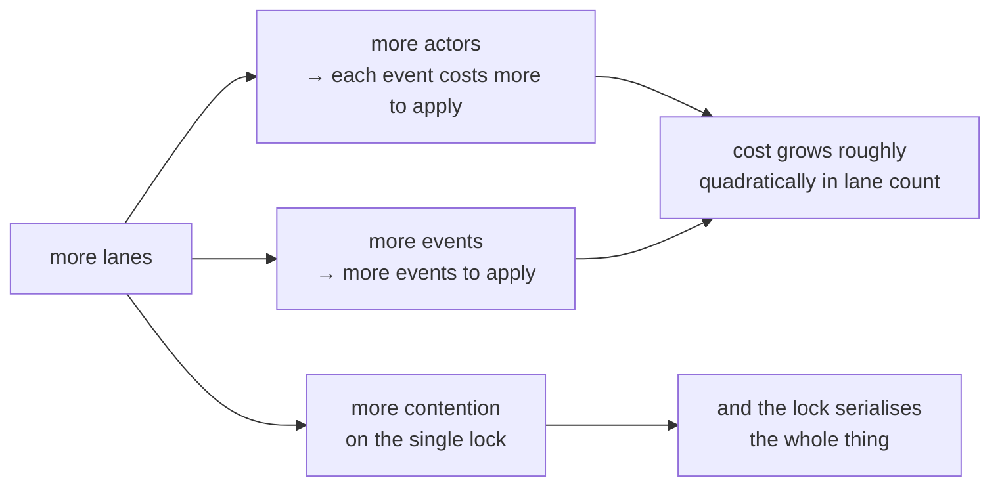

Every system has a number in it that nobody can justify. Someone wrote `MAX_CONCURRENT = 16` during a deadline, it never fell over, and five years later it is load-bearing folklore. This lesson is about Gaia's attempt not to have one of those, and about the same discipline applied to a harder question: which neighbouring systems to integrate with, and which to refuse.

## The claim ladder

Gaia supports **four live lanes per workspace**. The document behind that number is short and reads like a lab notebook:

| Lanes | Status | What backs it |
|---|---|---|
| **4** | **SUPPORTED DEFAULT** | Four concurrent client+server process pairs against one log, exercised in this product's own suite, plus the ported cross-process concurrency gates |
| 6 | NEXT VALIDATION TARGET | Nothing with real Claude/Codex lanes. Allowed only under `--experimental-lanes`, and labelled experimental in the output |
| 8 | UNPROVEN WITH REAL CLIENTS | Only identical Node workers have been measured at 8 and 16. Allowed only under `--experimental-lanes` |
| >8 | REFUSED ALWAYS | Nothing above 8 has been measured at all, with any client |

The ladder is in the code, not only in prose. `src/lanes.mjs` exports the evidence next to the constants:

```js
export const LANE_EVIDENCE = Object.freeze({
  4: 'supported: validated in this product\'s acceptance run',
  6: 'next validation target: NOT validated with real Claude/Codex lanes',
  8: 'unproven with real clients: only identical Node workers have been measured',
});
```

Ask for six and it refuses, in a sentence that hands you the whole state of knowledge:

```text
LaneLimitError: refusing 6 live lanes: the supported default maximum is 4 per workspace. 6 is the
next validation target and 8 is unproven with real Claude/Codex lanes (only identical Node workers
have been measured). Pass --experimental-lanes to accept an unproven limit; it changes no evidence.
```

Accept the unproven limit and you get it, correctly labelled:

```json
{ "limit": 6, "experimental": true, "note": "next validation target: NOT validated with real Claude/Codex lanes" }
```

Ask for nine, even with the flag:

```text
LaneLimitError: refusing 9 live lanes even with --experimental-lanes: nothing above 8 has been
measured at all, with any client. Raise this only with real-client evidence.
```

And the admission check, when the lanes are actually live:

```text
LaneLimitError: refusing to register lane 5: 4 live lanes already at the limit of 4. Retire a lane,
or raise the limit deliberately with --max-lanes/--experimental-lanes.
```

Two design choices in these messages are worth copying.

**It throws rather than clamping.** The module comment says why: *"a caller that asks for 8 lanes without the flag must not silently get 4 and believe it got 8."* Silent clamping is the same family of mistake as coercing a malformed `requestedAuthority` to `[]` in [lesson 2](../02-six-verbs/) — the system produces a comfortable value and destroys the information that the caller wanted something else.

**The escape hatch records rather than grants.** From the document: *"`--experimental-lanes` records that an operator accepted an unproven limit. It creates no evidence and changes no default."* The flag is honest about being a decision, not a capability.

## What the measurements do and do not prove

This is the part of the document I keep coming back to, because it is the rarer half of an engineering claim.

The 4/8/16-writer probes ran **identical Node client+server pairs** against one data directory. They prove:

- ids are unique across processes, dense and monotonic;
- the JSONL stays one complete record per line under contention;
- replay is deterministic and byte-identical across processes;
- the degradation mode under a stuck lock is fail-closed, not corrupting.

They do **not** prove:

- throughput, or latency under a real model turn;
- heterogeneity — "a Claude lane and a Codex lane are not two Node workers, and their call patterns, timeouts, and idle behaviour differ";
- behaviour on a log of 10⁴–10⁵ events, which no measurement has covered;
- anything about a lane that stalls mid-call.

The missing experiment is named: *the same probe with real Claude and Codex lanes.* Until it runs, six and eight stay where they are.

That second list is [SCI-04](../01-the-problem/) — reproducibility versus replication — as an operational statement. The Node-worker probe is reproducible and cheap, and it genuinely establishes the concurrency invariants. It is not a replication with the population the system actually serves, and the ladder refuses to let one stand in for the other.

## Why the ceiling is where it is

The cost model comes straight from [lesson 3](../03-event-log-and-replay/). Per-call cost is **O(events × actors)** under one global lock on a log that never compacts, and lanes push on both factors:



So four is not a round number chosen for tidiness; it is the largest count anyone has exercised end to end.

### What would raise it

Three things, together — and the honesty of this list is that the first one is explicitly *not* a tuning knob:

1. **A bounded-cost read path** — a cached tail offset, or a snapshot plus tail — so per-call cost stops being O(events × actors). "This is a design change, not a tuning knob, and it is deliberately not implemented here."
2. **A probe with real Claude and Codex lanes** at the target count, on a log of realistic size, asserting the same id-uniqueness, JSONL-integrity and replay-determinism properties the Node-worker probes assert.
3. **An answer for what happens when one lane wedges the lock**, since there is still no automatic recovery — and [lesson 3](../03-event-log-and-replay/) showed why breaking a stale lock automatically is a TOCTOU by construction.

Then the sentence that makes the whole document work:

> Raising the number in `src/lanes.mjs` without (1) and (2) would make this document a lie. The number and its evidence live in the same file for that reason.

Co-locating a constant with its justification is a cheap trick with a large payoff. The next person to feel the limit opens the file to change `4`, and finds the argument before they find the assignment.

## Operating inside the limit

- One lane type, one checkout, one writer scope, one result path, one completion marker per lane. **Preserve one mutable writer per repository** — the rule that makes the workspace-collision report from [lesson 2](../02-six-verbs/) actionable.
- `status` reports `overSupportedLaneLimit`, so a workspace that drifted past four by some other route is visible rather than silently over.
- **A lane unseen for 30 seconds is `stale`, not gone**: still registered, still addressable. *"Partial reachability is the normal case."* This is the right default for agent lanes, which routinely go quiet for minutes inside one model turn — treating silence as death would garbage-collect a lane in the middle of its work.
- `wmux-lanes sweep` marks exited and stale lanes with an ordinary durable `send`. It signals no process and closes no surface. Even the cleanup verb has no privilege.

A heartbeat, incidentally, establishes exactly one thing. From the architecture map: *"Lane heartbeats establish only sensor freshness. They do not enter backlog truth, acceptance, completion, cost, percentage, or ETA."* A lane that is alive is a lane that is alive.

## The ecosystem verdicts

The second half of this lesson is a different kind of limit. Gaia sits in a family of repositories — [GA](https://github.com/GuitarAlchemist/ga) (music theory in C# and F#), [TARS](https://github.com/GuitarAlchemist/tars) (an F# agent system), Hari, and IX (a Rust engine) — and the obvious move is to connect everything to the bus.

Gaia connects two of the four, and the verdicts are **enforced in code**:

```js
import { assertIntegrationAllowed } from './src/ecosystem.mjs';
```

```text
ga   -> ALLOWED {"repo":"ga","verdict":"ADAPTER_ONLY","reason":"GA is a producer with no MCP client; the shipped adapter tails its JSONL read-only and never writes GA."}
tars -> ALLOWED {"repo":"tars","verdict":"ADAPTER_ONLY","reason":"TARS already mounts MCP servers at runtime via configure_mcp_server. Generate a local, uncommitted mount; never edit the tracked mcp_config.json."}
hari -> EcosystemRefusal: hari: REJECT — Hari removed its MCP crate from main and already ships its own stdio-JSONL protocol with a reference client. Rejected: no integration ships in this plugin.
ix   -> EcosystemRefusal: ix: DEFER — IX states "not runtime coupling" as policy and already implements append-only-log-as-source-of-truth with deterministic replay. Deferred pending write-serialisation + actor identity AND an explicit owner decision.
```

Those are not comments. `assertIntegrationAllowed` throws, and the shipped scripts call it before doing anything — so a future contributor who writes a Hari adapter finds out at runtime that the decision was made and recorded, rather than discovering it in a review six weeks later.

### GA — a tailer and nothing more

GA is the biggest producer in the family and has **no MCP client**, so "GA consumes the bus" would mean writing .NET MCP-client infrastructure for a coordination channel. Everything GA would publish is already on disk under a versioned schema, so the bus adds exactly one thing: **push and a return address**. Not durability, not ordering, not schema — those are already better on GA's side.

So the adapter opens GA's file with mode `'r'` only, stores its byte offset in *Gaia's* data directory rather than beside GA, reports and skips an unparseable record rather than rewriting it, publishes with `requestedAuthority: ["report"]` — the most advisory grant there is — and is dry-run by default.

One line captures the whole authority discipline of this course: *"A GA governance denial arriving on the bus is a report about a denial. It is not authority to act on it."*

### TARS — runtime only, zero repo changes

TARS is the only sibling that is already an MCP client and host, so it can mount the bus at runtime through its own `configure_mcp_server` tool with no repository code at all — the cheapest and most reversible integration available.

It stays out of the repository for a mundane and decisive reason: `mcp_config.json` is tracked and shared with CI, so putting an absolute machine path there breaks every other machine. The generator emits its artifact into a directory you name, never into a checkout.

The gap it closes is precise: TARS's `delegate_task` is an in-process registry lookup — delegation vocabulary with no cross-process reach. The bus gives it a live counterparty with `correlationId` and `replyTo` intact.

### Hari — rejected, not deferred

Hari already has this, and better-typed: a documented stdio-JSONL streaming protocol, deterministic replay parity, a reference client for its only counterparty, and a durable ledger. And Hari **removed its MCP crate from `main`**.

> Adding a second stdio protocol to a repo that deleted its first one is a proposal to reverse a decision the owner already made. That is a conversation with the owner, not a tracer bullet — so nothing ships.

This is the most interesting verdict of the four, because the reason is not technical. The integration would work. It is refused because shipping it would quietly overturn somebody else's decision, and the correct move is to have the conversation instead. Revisit only if Hari re-introduces an MCP surface for its own reasons — "the bus is not one of those reasons."

### IX — deferred, with two named conditions

IX already ships this architecture internally and more rigorously: an append-only session event log as source of truth, replay as a pure projection with cross-process bit-identical output, deterministic approval middleware emitting a verdict on every action. Gaia's load-bearing insight — separate coordination from authority by construction — is not news to IX. IX also has a written policy against runtime cross-repo coupling, and an MCP surface gated by an exact tool-count assertion whose whole job is to make a surface change stop and think.

Two conditions must **both** hold before this becomes `ADAPTER_ONLY`:

1. the bus gains **actor identity** better than positional trust — it has write serialisation; it does not have authentication;
2. an explicit owner decision to amend the no-runtime-coupling invariant, with a written answer to why this does not repeat the deprecated A2A protocol.

Neither has happened, so the call throws. Note the shape: a deferral with exit criteria is a decision, while a deferral without them is a backlog item that never comes back.

### And a transport that is not one

The bus is often compared to Claude Code's own `SendMessage`, which addresses other Claude sessions in plain text. Gaia's document is blunt about the difference: it is not available on native Windows, no non-Claude client can speak it under any configuration, it carries no correlation id, no authority metadata and no durable log, and its per-agent mailbox is transient, session-scoped and self-repairing — *it drops records that fail validation*.

> That is the sharpest available contrast with this bus, which refuses a record it cannot parse rather than dropping it.

A dropped record is a hole in the evidence that nothing reports. A refused record is an event. And if a native fast path is ever used, the rule is stated in advance: it must be a transport optimisation writing the same events to the same log, never a second source of truth.

## What is implemented, and what is not

The architecture map ends with a paragraph most projects would not publish:

> This repository is an installation candidate, not an installed plugin. Automatic pull-request conflict resolution and its effect lifecycle, remote operator authority beyond the shipped interactive path, and six-lane validation remain planned; production tenant/quota services are out of scope. Planned work stays non-normative until code, evidence, and a fresh verification revision are linked here.

"Not an installed plugin" is on the README's front page too, under a heading called **Install status**. The pull-request conflict classifier ships with an *empty* automation strategy registry, so the words `resolve` and `reconcile` appear in the lifecycle vocabulary while the code refuses to do either — reserved names that imply nothing.

And the map carries its own verification record, deliberately stored outside the file to avoid a self-referential hash:

```json
{
  "schema": "gaia-architecture-verification/1",
  "commit": "f26978df2f2a27a5ccd185a1ef7d18afe72ae1cf",
  "date": "2026-09-13",
  "contentRevision": "sha256:741d824db4e35be0ca92ee5b6be5f7c31f0cfc5724cd72069857880dfaaef273"
}
```

A verification record that binds a date, a reviewed commit and the SHA-256 of the exact reviewed bytes — so "the architecture was reviewed" is a checkable statement about specific bytes rather than a claim about a document that has since been edited.

## Key takeaways

- Four live lanes is the largest count anyone has exercised end to end. Six and eight need `--experimental-lanes`, which records a decision and creates no evidence, and nothing above eight is allowed.
- Asking for more than the limit throws rather than clamping, and the number lives in the same file as its evidence.
- The Node-worker probes prove the concurrency invariants, not the behaviour of real Claude and Codex lanes: reproducible is not replicated.
- The ceiling comes from replay costing O(events × actors) under one lock; raising it needs a bounded-cost read path, a probe with real clients and an answer for a wedged lock.
- The ecosystem verdicts are enforced in code: GA and TARS get adapters only, Hari is rejected, and IX is deferred with two named conditions.

## Exercises

1. Your team hits the four-lane limit constantly. A colleague opens `src/lanes.mjs`, changes `DEFAULT_MAX_LIVE_LANES` to 8 and notes that the tests still pass. What is wrong, and what is the smallest honest change?

<details>
<summary>Solution</summary>

The tests passing is not evidence for the new number: the suite asserts concurrency invariants with identical Node workers, which is exactly the population the document says does *not* generalize to real Claude and Codex lanes. Edit the constant and the document co-located with it becomes false — which is the outcome the file's own comment predicts.

Smallest honest change: none to the constant. Pass `--experimental-lanes`, which records that an operator accepted an unproven limit, and which labels every output `experimental: true`. That gets the lanes today and keeps the evidence statement true.

The real fix is bigger, and the document already names it: the bounded-cost read path, then the real-client probe, then an answer for a wedged lock. Note the ordering — without (1), the probe at eight lanes would mostly be measuring the O(events × actors) replay cost.

</details>

2. Why is Hari a `REJECT` rather than a `DEFER`, when IX — which also already implements the architecture — is deferred?

<details>
<summary>Solution</summary>

Because the blockers are different in kind. IX's is a *condition*: a policy invariant that its owner could amend, plus a capability Gaia could gain (actor identity better than positional trust). Both are stated as exit criteria, so the deferral can end.

Hari's is a *decision already taken*: it removed its MCP crate from `main`. Shipping an MCP adapter would be reversing somebody else's choice from the outside, and no amount of engineering on Gaia's side changes that — only a conversation with the owner does. Recording it as `DEFER` would imply Gaia is waiting for something it controls.

The general form: defer when you know what would unblock it, reject when the blocker is not yours to move.

</details>

3. A lane goes quiet for 90 seconds. Gaia marks it `stale` and keeps it registered and addressable. Argue for the alternative — deregistering it — and say why Gaia does not.

<details>
<summary>Solution</summary>

For deregistering: a stale lane occupies one of four scarce slots, keeps appearing in `status`, still receives messages nobody may read, and every retained actor makes replay more expensive, since cost is O(events × actors).

Against, and decisive: quiet is the normal state of a healthy agent lane. A single model turn with a long tool call routinely exceeds 30 seconds, so deregistering on silence would evict lanes in the middle of their work, and the messages addressed to them would have to be refused or dropped. It would also require deciding that a process is gone from the outside — the same judgement Gaia declines to make about a stale lock, for the same TOCTOU reason.

So Gaia reports the state and leaves the actor addressable: *"Partial reachability is the normal case."* Retirement is an explicit act — `sweep` marks lanes with an ordinary durable `send`, and signals no process.

</details>

4. Gaia's README says the repository is "an installation candidate, not an installed plugin", and the PR conflict classifier ships with an empty strategy registry. Why publish either fact?

<details>
<summary>Solution</summary>

Both are defences against the same misreading. A repository with 2,075 passing tests, a lifecycle vocabulary containing `resolve` and `reconcile`, and a factory that runs real agents reads as a finished product — and a reader who installs it expecting automatic conflict resolution has been misled by the vocabulary rather than by any false claim.

Stating it makes the four axes visible one more time: the code is high *quality* and has not been *accepted* for installation, and those are independent. The empty registry is the structural version — reserved words that imply nothing, with the emptiness documented so that a reader who greps for `resolve` and finds the lifecycle does not conclude that resolution happens.

There is also a self-interested reason. "Installation candidate" is the state in which fresh, independent Standards and Spec reviews are the gate — and, as the README puts it, *the lane that wrote this cannot review it*.

</details>

## Sources

- Gaia: [scale and lanes](https://github.com/GuitarAlchemist/gaia/blob/d68e90099ae2a6fbbec9d428617bfcd02095aac0/docs/scale-and-lanes.md), [`src/lanes.mjs`](https://github.com/GuitarAlchemist/gaia/blob/d68e90099ae2a6fbbec9d428617bfcd02095aac0/src/lanes.mjs), [ecosystem adapters](https://github.com/GuitarAlchemist/gaia/blob/d68e90099ae2a6fbbec9d428617bfcd02095aac0/docs/ecosystem-adapters.md), [`src/ecosystem.mjs`](https://github.com/GuitarAlchemist/gaia/blob/d68e90099ae2a6fbbec9d428617bfcd02095aac0/src/ecosystem.mjs), [`ARCHITECTURE.md`](https://github.com/GuitarAlchemist/gaia/blob/d68e90099ae2a6fbbec9d428617bfcd02095aac0/ARCHITECTURE.md)
- The siblings: [GuitarAlchemist/ga](https://github.com/GuitarAlchemist/ga), [GuitarAlchemist/tars](https://github.com/GuitarAlchemist/tars)
- [Claude Code](https://code.claude.com/docs/en/overview) — the agent whose session-to-session messaging the last section contrasts with the bus
