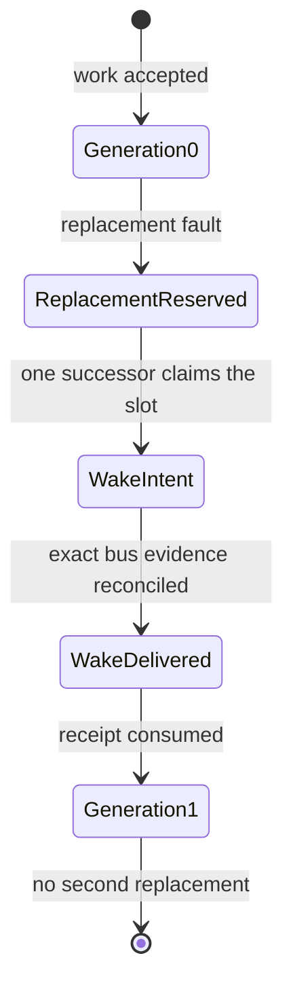
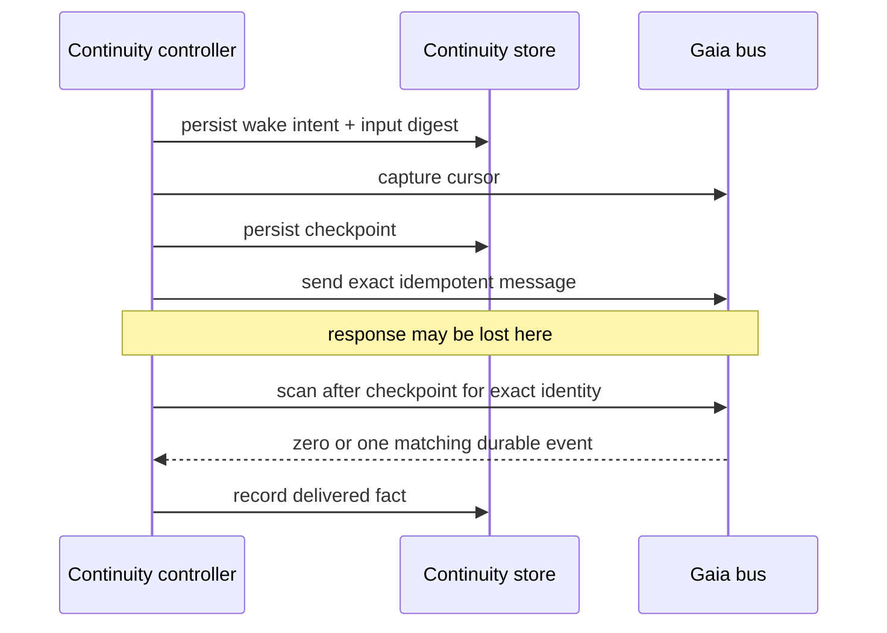

The first five lessons follow an artifact through coordination and review. They stop just before a hard operational question: what happens when the agent that owns accepted work disappears after review, and a successor must continue without duplicating the effect or inheriting invisible authority?

[Gaia issue 76](https://github.com/GuitarAlchemist/gaia/issues/76) approaches that question with a deliberately tiny tracer. It does not promise arbitrary recovery. It models exactly one work identity, one successor slot and one replacement from generation 0 to generation 1.

## The bounded state machine



The narrowness is a safety feature. A general “replace any dead agent” loop needs leader election, leases, duplicate suppression, authority delegation and an answer to split brain. The tracer asks a smaller question: can one accepted review result produce one successor wake, survive one ambiguous send, and publish a portable receipt that grants no authority?

## Exact replay in SQLite WAL

The continuity store uses [SQLite](https://sqlite.org/) in WAL mode as a local transition ledger. Each accepted operation binds an idempotency key to its exact input. Repeating that key with the same input returns the prior result; repeating it with different input refuses with `OPERATION_CONFLICT`.

That second clause matters. “Idempotent by name” is not enough: if `replace-76` first names generation 1 and later names generation 2, returning the old success would hide a disagreement. Exact replay means equality of the material request, not merely equality of a convenient key.

The controller receives its store through a port. During integration, an earlier shape imported SQLite persistence directly into the controller; review moved that dependency back behind injection. Replay policy belongs to the domain transition, while the database remains an adapter.

## A wake is not delivered because `send` returned

The bus path records four distinct facts:

1. **wake intent** — the controller has decided which successor should be notified;
2. **pre-send cursor/checkpoint** — the durable bus position before the attempt;
3. **idempotent send** — the exact message identity and payload are submitted;
4. **delivered fact** — reconciliation after the checkpoint finds the one matching durable event.

If the process loses the response after the bus accepted the message, retry does not blindly send another message. It searches from the saved checkpoint for the exact message identity. Finding it records delivery; not finding it permits the same bounded attempt. A decision cannot advance on wake intent alone: it requires the delivered fact.



## The portable post-consumption receipt

After the successor consumes the wake, the tracer emits a portable JSON receipt. It carries the work identity, predecessor and successor generation, exact transition evidence, bus evidence and content digests. Its authority field is intentionally empty.

That emptiness is not a missing feature. Continuity transfers the ability to *continue the work context*, not permission to merge, deploy, spend or widen scope. Any later effect still needs its own authority artifact.

[Demerzel](https://github.com/GuitarAlchemist/Demerzel) vendors the JSON Schema and fixtures and validates them read-only. It does not call Gaia, mutate the receipt or reinterpret the authority field. That establishes a useful cross-repository artifact chain:

```text
Gaia transition -> portable receipt -> Demerzel schema validation -> independent governance input
```

The receipt is the seam. Sharing a database or importing Gaia runtime code into Demerzel would collapse repository ownership.

## What review caught

| Weak shape | Failure | Corrected invariant |
|---|---|---|
| controller imports persistence | domain policy depends on SQLite details | inject the store port |
| wake intent is enough to decide | a crashed or refused send looks delivered | require exact delivered wake evidence |
| same idempotency key always replays | changed input inherits an unrelated success | same key + different input is `OPERATION_CONFLICT` |
| test constructs only the main log | production sidecar evidence is absent from the test | construct and assert the bus evidence sidecar |
| repeated whole-log scans and allocations | reconciliation cost grows needlessly | query once and reuse bounded results |

The broad lesson is that recovery must test *ambiguous success*, not only clean failure. The dangerous point is after the external effect may have happened and before local code knows it happened.

## Provider and cost guardrails

Continuity must not silently turn provider availability into authority. A successor selector may inspect capability and remaining allowance, but provider choice stays subject to explicit policy:

- no paid fallback unless authorized;
- no retry that can exceed the attempt or dollar ceiling;
- model and provider identities recorded in evidence;
- unavailable provider means a durable refusal or human review, not a guessed substitute;
- a lower-cost classifier such as Jev may advise routing, but cannot prove delivery or grant an effect.

## Measured candidate evidence — not release evidence

On 2026-09-20, the isolated issue-76 candidate ran **2,261 Node tests: 2,259 passed, 0 failed, 2 skipped**. The focused continuity/bus regression ran **87/87**. Gaia's verifier reported **37 passed, 0 failed**, and the architecture verifier passed. Demerzel's read-only consumer ran **787 Python tests with 1 skipped**, plus **10/10 IXQL checks**.

Those measurements are bound to Gaia implementation commit [`9a2f696`](https://github.com/GuitarAlchemist/gaia/commit/9a2f696805740cd75da6ebe29e9a99976f57dc2f), its [evidence receipt](https://github.com/GuitarAlchemist/gaia/blob/2352085379ea365424b009d334d451b2c0dc1bd8/docs/design-receipts/gaia-76-continuity-r0-v7.4-acceptance.md), and Demerzel consumer commit [`fa04d7c`](https://github.com/GuitarAlchemist/Demerzel/commit/fa04d7ce234f10cd38b1134531c0b0032af59d72). The local command streams were not committed; reproduce the named gates or use the pull-request checks before treating the numbers as publication evidence.

Those numbers describe an isolated candidate and consumer worktree. They are not evidence that either change is on `main`, published, reviewed at its final commit, or released. The formal review and normal pull-request gates still apply.

## Key takeaways

- Continuity R0 is one slot and one generation replacement, not a general supervisor.
- Idempotency binds exact input; a reused key with changed input is a conflict.
- Save a pre-send checkpoint and reconcile exact durable bus evidence after ambiguity.
- A portable receipt transfers context evidence with an empty authority set.
- Demerzel validates the artifact read-only rather than sharing Gaia's state.
- Provider choice and low cost cannot weaken authority, retry or spending gates.

## Exercises

1. The bus accepts a wake, but the process dies before receiving the response. Why is “retry once” unsafe without a checkpoint and message identity?

<details><summary>Solution</summary>

The first send may already be durable. A second send creates two wakes for one slot. The checkpoint bounds the search, and the exact identity distinguishes the prior effect from unrelated traffic. Retry is allowed only when evidence proves the effect absent.

</details>

2. Why must the Demerzel fixture contain an empty authority field instead of omitting authority?

<details><summary>Solution</summary>

An explicit empty field makes the claim inspectable: this artifact carries no authority. Omission could mean “not modeled,” “unknown,” or “forgotten,” inviting a consumer to invent semantics.

</details>

## Sources

- [Gaia issue 76](https://github.com/GuitarAlchemist/gaia/issues/76)
- Gaia repository: [README](https://github.com/GuitarAlchemist/gaia), [architecture](https://github.com/GuitarAlchemist/gaia/blob/main/ARCHITECTURE.md)
- [SQLite write-ahead logging](https://sqlite.org/wal.html)
- [Demerzel](https://github.com/GuitarAlchemist/Demerzel)
