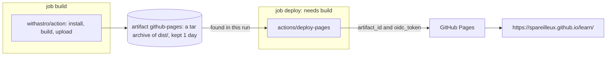

## The deployment you're reading

This page reached you through [`.github/workflows/deploy.yml`](https://github.com/spareilleux/learn/blob/main/.github/workflows/deploy.yml), on every push to `main`. It's short, and every line uses something from the previous lessons:

```yaml
name: Deploy to GitHub Pages

on:
  push:
    branches: [main]
  workflow_dispatch:

permissions:
  contents: read
  pages: write
  id-token: write

# Two pushes in a row would start two Pages deployments, and the second one fails with
# "Deployment request failed ... due to in progress deployment". Queue them instead.
concurrency:
  group: pages
  cancel-in-progress: false

jobs:
  build:
    runs-on: ubuntu-latest
    steps:
      - name: Checkout
        uses: actions/checkout@v7
      - name: Install, build, and upload site
        uses: withastro/action@v6

  deploy:
    needs: build
    runs-on: ubuntu-latest
    environment:
      name: github-pages
      url: ${{ steps.deployment.outputs.page_url }}
    steps:
      - name: Deploy to GitHub Pages
        id: deployment
        uses: actions/deploy-pages@v5
```

On the repository side, [GitHub Pages](https://docs.github.com/pages) is set to deploy from Actions rather than from a branch:

```powershell
gh api repos/spareilleux/learn/pages --jq '{url: .html_url, build_type, https_enforced}'
```

```text
{"build_type":"workflow","https_enforced":true,"url":"https://spareilleux.github.io/learn/"}
```

`build_type: workflow` is *Settings → Pages → Source: GitHub Actions*. With the older *Deploy from a branch* source, GitHub runs its own Jekyll build on a branch such as `gh-pages`; with a workflow, you build anything and hand over the files.

## Job 1: build and upload the site

[`withastro/action`](https://github.com/withastro/action) is a composite action ([lesson 6](../06-reuse/)). Its `action.yml` detects the lockfile, sets up Node with the npm cache, installs, restores the Astro cache, builds, saves the cache, and ends with:

```text
- name: Upload Pages Artifact
  uses: actions/upload-pages-artifact@fc324d3547104276b827a68afc52ff2a11cc49c9 # v5
```

An action pinned to a commit SHA, with the version in a comment — [lesson 7](../07-security/)'s advice, applied by the Astro team. From the run of commit `fd52d46`:

```text
Cache restored from key: node-cache-Linux-x64-npm-fa7181d77dee2cc1ba065b6111b07b81f0308595291d60af9f8cc32a0d812697
added 275 packages, and audited 276 packages in 6s
Cache restored from key: astro-cache-Linux-a7a6f729702b8a1a4ed15adcb709863a3eb63db6
13:32:45 [starlight:pagefind] Found 310 HTML files.
13:32:46 [build] 310 page(s) built in 7.47s
  name: github-pages
  retention-days: 1
Artifact github-pages has been successfully uploaded! Final size is 9108634 bytes. Artifact ID is 10350355767
```

- The site is an ordinary **artifact** ([lesson 5](../05-caches-and-artifacts/)) named `github-pages`: a tar archive of `dist/`, about 9 MB for 310 pages in three languages.
- `retention-days: 1` is the default of `upload-pages-artifact`: once deployed, the archive is useless.
- The Astro cache key is `astro-cache-${{ runner.os }}-${{ github.sha }}` with `restore-keys: astro-cache-${{ runner.os }}-`: a new key on every commit, and the previous commit's cache (`a7a6f72`) restored by prefix — exercise 3 of lesson 5.
- The whole job took 30 s, 24 of them in this one step.

## Job 2: deploy

[`actions/deploy-pages`](https://github.com/actions/deploy-pages) finds the artifact of **this** run and asks GitHub to publish it:

```text
Fetching artifact metadata for "github-pages" in this workflow run
Found 1 artifact(s)
Creating Pages deployment with payload:
{
	"artifact_id": 10350355767,
	"pages_build_version": "fd52d46d1d2940e5dee33790e4a2873056f074f3",
	"oidc_token": "***"
}
Created deployment for fd52d46d1d2940e5dee33790e4a2873056f074f3, ID: fd52d46d1d2940e5dee33790e4a2873056f074f3
Getting Pages deployment status...
Reported success!
Evaluated environment url: https://spareilleux.github.io/learn/
```

Why both permissions? The README: "The pages permission relates to the `GITHUB_TOKEN` by giving it the permissions to create pages deployments when calling the GitHub API. The id-token permission is necessary to request the OIDC JWT token" — the `oidc_token` of the payload, masked in the log. It's the mechanism of lesson 7, used by GitHub itself to check that the deployment comes from a workflow of this repository.

The deploy job doesn't check out the repository or install anything: 8 seconds.

The two jobs hand the site over as an artifact, and the deploy job sends its ID to GitHub with the OIDC token.



## The `github-pages` environment

`environment: name: github-pages` attaches the job to an [environment](https://docs.github.com/actions/how-tos/deploy/configure-and-manage-deployments/manage-environments), which GitHub created automatically for Pages. An environment can hold its own secrets and variables, and **protection rules** that a job must pass before it starts:

```powershell
gh api repos/spareilleux/learn/environments --jq '.environments[] | {name, protection_rules}'
gh api repos/spareilleux/learn/environments/github-pages/deployment-branch-policies --jq '.branch_policies[] | {name, type}'
```

```text
{"name":"github-pages","protection_rules":[{"id":65464384,"node_id":"GA_kwDOUZJuCs4D5uhA","type":"branch_policy"}]}
{"name":"main","type":"branch"}
```

Only `main` may deploy — exercise 1 tries another branch. Other rules, such as required reviewers or a wait timer, turn the environment into a manual approval gate, like an approval check on an Azure Pipelines environment.

Each run also creates a **deployment**, with a history of statuses:

```powershell
gh api repos/spareilleux/learn/deployments/6438161238/statuses --jq '.[] | "\(.state) \(.created_at) \(.environment_url)"'
```

```text
success 2026-09-14T13:33:06Z https://spareilleux.github.io/learn/
in_progress 2026-09-14T13:32:57Z 
queued 2026-09-14T13:32:54Z 
waiting 2026-09-14T13:32:53Z 
```

The `url:` of the environment is what appears as the link on the run summary and on the repository's *Deployments* page.

## Queued deployments

[Lesson 3](../03-triggers/) added the concurrency group after two deployments collided. Several sessions push to this repository; two pushes 41 seconds apart, 45 minutes later:

| Run | Commit | Run created | `build` job created | `deploy` job finished |
|---|---|---|---|---|
| 34849759801 | `a7a6f72` | 13:31:23 | 13:31:24 | 13:32:18 |
| 34849828422 | `fd52d46` | 13:32:04 | 13:32:18 | 13:33:05 |

The second run existed at 13:32:04, but its `build` job was created at 13:32:18 — the second the first deployment finished: 14 seconds *pending*, then deployed. No failure, no lost commit.

## The base path

A repository site is served under the repository name: `https://spareilleux.github.io/learn/`, not at the domain root. Astro must know it, in `astro.config.mjs`:

```text
site: 'https://spareilleux.github.io',
base: '/learn',
```

That's also why this site's lessons only use relative links (`../journal/`): exercise 3.

## Key takeaways

- A Pages workflow is two jobs: build an artifact named `github-pages`, then `actions/deploy-pages` with `pages: write` and `id-token: write`.
- The `github-pages` environment records every deployment and can restrict who deploys: here, only `main`.
- `concurrency: group: pages` with `cancel-in-progress: false` queues deployments instead of failing them.
- A project site lives under `/<repository>/`: configure the base path and avoid root-absolute links.

## Exercises

1. Start the deployment workflow on another branch: `gh workflow run deploy.yml --ref gha-06-invalid`. Does the site change?

<details>
<summary>Solution</summary>

No. The `build` job ran and uploaded its artifact; the `deploy` job was rejected before getting a runner (0 steps, 1 second):

```text
X Branch "gha-06-invalid" is not allowed to deploy to github-pages due to environment protection rules.
X The deployment was rejected or didn't satisfy other protection rules.
```

A deployment was still recorded, with the statuses `waiting` then `failure`. The rule is checked when the job **starts**, so any job of that branch without `environment:` would still run: the environment protects its secrets and its deployments, not the rest of the workflow.

</details>

2. The `deploy` job has no `actions/checkout`. Where do the site's files come from, and what would happen if the `build` job uploaded them under another artifact name?

<details>
<summary>Solution</summary>

From the artifact of the same run, fetched through the API — the job's steps are only *Set up job*, *Deploy to GitHub Pages* and *Complete job*. `deploy-pages` looks for the name given by its `artifact_name` input, `github-pages` by default (`Fetching artifact metadata for "github-pages" in this workflow run`). With another name, it wouldn't find it: pass the same name to both actions. *To verify*: the exact error message.

</details>

3. A lesson contains the Markdown link `[method](/method/)`. Locally, with `astro dev`, where does it lead, and on the published site?

<details>
<summary>Solution</summary>

On the published site, to `https://spareilleux.github.io/method/`, outside the repository site:

```text
404 https://spareilleux.github.io/method/
200 https://spareilleux.github.io/learn/method/
```

Astro doesn't rewrite links written in Markdown with the `base`. Locally the dev server also serves under `/learn/`, so the link breaks there too — *to verify* with `astro dev`. A relative link (`../method/`) works in both places.

</details>

## Sources

- [Using custom workflows with GitHub Pages](https://docs.github.com/pages/getting-started-with-github-pages/using-custom-workflows-with-github-pages)
- [`actions/deploy-pages`](https://github.com/actions/deploy-pages) and [`actions/upload-pages-artifact`](https://github.com/actions/upload-pages-artifact)
- [Managing environments for deployment](https://docs.github.com/actions/how-tos/deploy/configure-and-manage-deployments/manage-environments)
- [Deploy your Astro site to GitHub Pages](https://docs.astro.build/en/guides/deploy/github/)
- [REST API: deployments](https://docs.github.com/rest/deployments/deployments)
