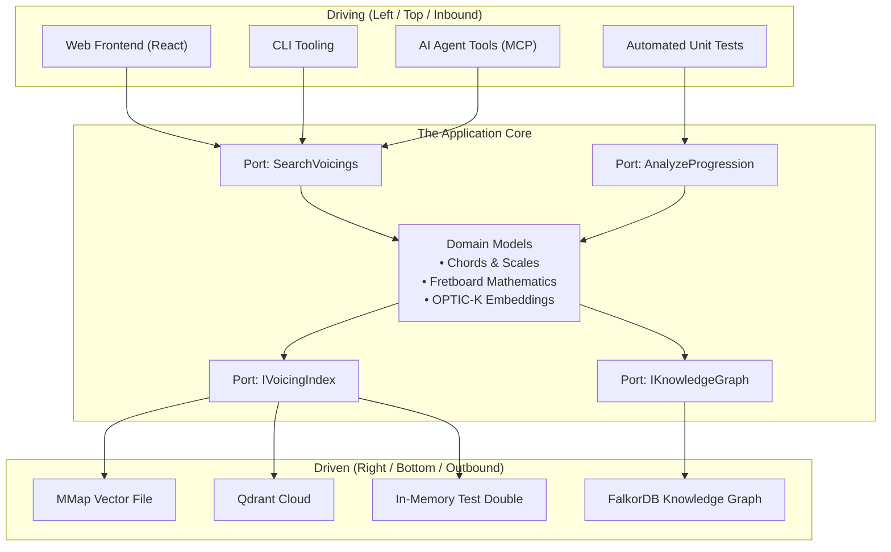
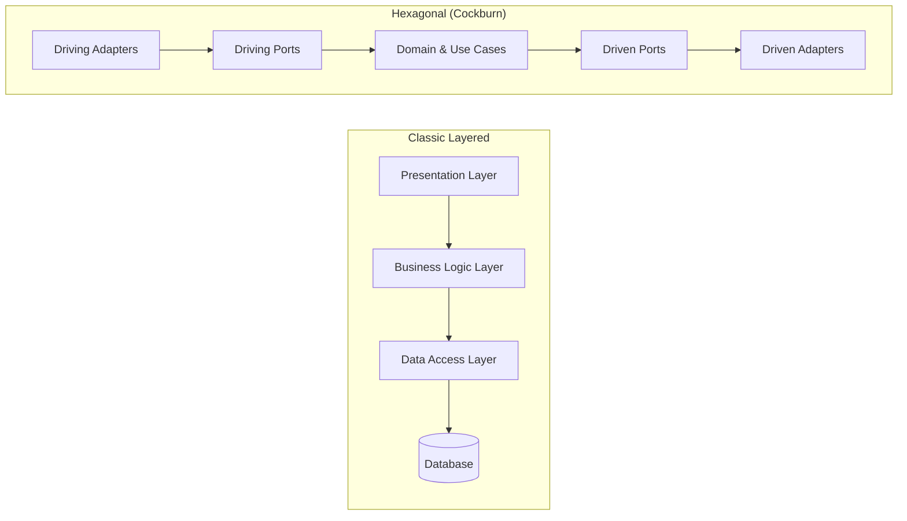

Hexagonal Architecture was formulated by **Alistair Cockburn** in 2005 to solve a recurrent pathology in software development: application logic becoming inextricably tangled with user interfaces, HTTP frameworks, SQL queries, and third-party libraries.

Cockburn observed that whether an input arrives from an HTTP request, an automated test harness, a console script, or an administrative GUI, the business problem being solved is identical. Symmetrically, whether state is persisted into an SQLite file, an enterprise relational database, an in-memory dictionary, or a cloud-hosted vector store, the business requirement is simply: *"store and retrieve this aggregate"*.

The core proposition is simple:

> *"Allow an application to equally be driven by users, other programs, automated test or batch scripts, and to be developed and tested in isolation from its eventual run-time devices and databases."*
> — Alistair Cockburn

---

## Why a Hexagon?

The shape has no magical mathematical significance: it is not limited to six sides. 

Cockburn chose a hexagon purely as a visual metaphor to break free from the traditional 1D top-to-bottom layered diagram (User Interface &rarr; Business Logic &rarr; Database). A 2D polygon visually emphasizes that the application core has **multiple edges** (facets) through which it interacts with the outside world:



The hexagon is divided by one fundamental boundary: **Inside vs Outside**.

---

## The Inside vs Outside Boundary

### The Inside (The Hexagon)

The inside contains two layers:
1. **The Domain Model**: Pure business rules, entities, value objects, and mathematical invariants. In Guitar Alchemist, this includes `PitchClass`, `Interval`, `PitchClassSet`, `ChordDefinition`, and fretboard coordinate calculations. It contains zero references to ASP.NET Core, Entity Framework, Qdrant, or JSON serializers.
2. **The Application / Use Case Layer**: Orchestrates domain objects to satisfy user intents. Defines what the application can do (e.g., `SearchVoicingsUseCase`, `AnalyzeProgressionUseCase`).

The inside defines the **Ports**. The inside never references anything on the outside.

### The Outside

The outside contains everything technical, volatile, and environment-specific:
- Protocols: HTTP, WebSockets, SignalR, gRPC, Language Server Protocol (LSP), Model Context Protocol (MCP);
- Persistence: SQL databases, Redis, FalkorDB, memory-mapped files, S3 buckets;
- External services: LLM APIs (Anthropic Claude, OpenAI), ONNX runtimes, audio hardware.

The outside implements or consumes the ports using **Adapters**.

---

## Ports: Contracts at the Boundary

A **Port** is an application-defined boundary interface. It is named in ubiquitous business language, not technical terms.

Ports are categorized into two symmetrical groups:

### 1. Inbound (Driving / Primary) Ports

Inbound ports define **what the application offers** to the outside world. They are the application's use cases.

- **Actor**: A user, an AI agent, a scheduled job, or a test harness.
- **Direction**: The outside calls *into* the inside.
- **Form**: In C#, an inbound port is typically an interface or a command/query handler.

```csharp
// Inside: Inbound Port
public interface ISearchVoicingsUseCase
{
    Result<VoicingSearchResult, SearchError> Execute(VoicingSearchQuery query);
}

public readonly record struct VoicingSearchQuery(
    PitchClassSet PitchClasses,
    Tuning Tuning,
    FretSpan AllowedSpan,
    int MaxFretSpan = 4);
```

### 2. Outbound (Driven / Secondary) Ports

Outbound ports define **what the application requires** from the outside world to fulfill its business logic.

- **Actor**: A database, an external API, a file system, or a vector search engine.
- **Direction**: The inside calls *out* to the port; the outside adapter implements the port.
- **Form**: An interface declared by the core, implemented in the infrastructure layer.

```csharp
// Inside: Outbound Port (declared by the core)
public interface IVoicingVectorIndexPort
{
    ValueTask<IReadOnlyList<VoicingMatch>> FindNearestNeighborsAsync(
        ReadOnlyMemory<float> queryVector, 
        int limit, 
        CancellationToken cancellationToken = default);
}
```

Notice the crucial detail: **the interface `IVoicingVectorIndexPort` lives inside the core, not in the infrastructure library.** This is the **Dependency Inversion Principle (DIP)** in its purest form.

---

## Adapters: The Translators

An **Adapter** is a concrete component that bridges the external technology with a port.

### Driving (Primary) Adapters

A driving adapter takes an external trigger (like an HTTP POST request or a CLI argument) and translates it into a call to an Inbound Port:

```csharp
// Outside: Driving Adapter (ASP.NET Core Controller)
[ApiController]
[Route("api/voicings")]
public sealed class VoicingsController(ISearchVoicingsUseCase searchUseCase) : ControllerBase
{
    [HttpPost("search")]
    public IActionResult Search([FromBody] VoicingSearchHttpRequest request)
    {
        // 1. Translate external DTO to Domain Query
        var query = new VoicingSearchQuery(
            PitchClassSet.FromMask(request.PitchClassMask),
            Tuning.StandardGuitar,
            new FretSpan(request.MinFret, request.MaxFret));

        // 2. Invoke Inbound Port
        var result = searchUseCase.Execute(query);

        // 3. Translate Domain Result to HTTP Response
        return result.Match<IActionResult>(
            success => Ok(VoicingSearchHttpResponse.FromDomain(success)),
            error => BadRequest(new { error = error.Message }));
    }
}
```

Another driving adapter could be an **AI Model Context Protocol (MCP)** tool:

```csharp
// Outside: Driving Adapter (GaMcpServer Tool)
[McpTool("search_voicings", "Finds ergonomic guitar voicings for a chord")]
public sealed class SearchVoicingsMcpTool(ISearchVoicingsUseCase searchUseCase)
{
    public Task<string> ExecuteAsync(int pitchClassMask, int minFret, int maxFret)
    {
        var query = new VoicingSearchQuery(
            PitchClassSet.FromMask(pitchClassMask),
            Tuning.StandardGuitar,
            new FretSpan(minFret, maxFret));

        var result = searchUseCase.Execute(query);
        return Task.FromResult(result.Match(
            s => JsonSerializer.Serialize(s),
            e => $"Error: {e.Message}"));
    }
}
```

Notice that both `VoicingsController` and `SearchVoicingsMcpTool` call the **exact same port** (`ISearchVoicingsUseCase`). Neither owns any business logic.

### Driven (Secondary) Adapters

A driven adapter implements an Outbound Port by wrapping a specific technology:

```csharp
// Outside: Driven Adapter (Memory-Mapped File OPTIC-K Index)
public sealed class MemoryMappedOptickAdapter(OptickIndexReader reader) : IVoicingVectorIndexPort
{
    public ValueTask<IReadOnlyList<VoicingMatch>> FindNearestNeighborsAsync(
        ReadOnlyMemory<float> queryVector, 
        int limit, 
        CancellationToken cancellationToken)
    {
        // Translate domain call into memory-mapped pointer search
        var results = reader.SearchCosine(queryVector.Span, limit);
        return ValueTask.FromResult(results);
    }
}
```

If you decide to replace the memory-mapped file with a Qdrant cloud cluster, you write a `QdrantVectorAdapter` implementing `IVoicingVectorIndexPort`. **The domain core does not change by a single character.**

---

## Comparison: Hexagonal vs Layered vs Onion vs Clean

Developers often confuse Hexagonal Architecture, Onion Architecture, and Clean Architecture. They share the same core philosophy (Dependency Inversion), but differ in nuance and structure.

| Feature | Classic N-Tier Layered | Hexagonal (Cockburn 2005) | Onion (Palermo 2008) | Clean (Martin 2012) |
|---|---|---|---|---|
| **Center of Gravity** | Database / Data Access Layer | Domain & Use Cases | Domain Model | Entities |
| **Primary Symmetry** | Top &rarr; Down (Vertical) | Inside &harr; Outside (Radial) | Concentric Rings | Concentric Rings |
| **Distinction of Ports** | None (Interfaces are layered) | Explicit: Driving vs Driven | Core interfaces | Use Case Input/Output Ports |
| **Number of Rings** | 3 or 4 layers | 2 (Inside vs Outside) | 4 concentric rings | 4 concentric rings |
| **Prescribed Structure** | Fixed (UI, BLL, DAL) | Minimalist (Ports & Adapters) | Prescribes Domain Services | Prescribes Presenters, Gateways |



### The Key Takeaway

- In **Layered Architecture**, dependencies flow down towards the database. The database is the foundation.
- In **Hexagonal Architecture**, dependencies flow **inward** towards the domain. The database is merely an external peripheral device, completely interchangeable with an in-memory dictionary or a file.
