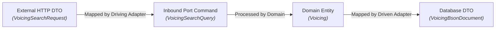
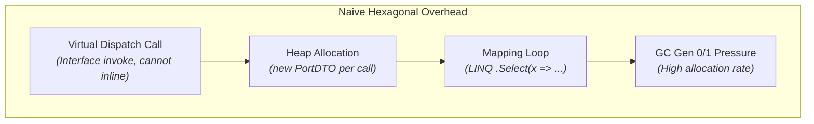

No architecture is a free lunch. Software architecture is the art of balancing conflicting forces: maintainability against cognitive load, isolation against performance, and flexibility against implementation speed.

Hexagonal Architecture is often presented as an unquestioned ideal. To make sound engineering decisions, we must evaluate both its profound superpowers and its tangible costs — particularly in high-throughput, low-latency C# systems like [Guitar Alchemist](../music-theory-ga/).

---

## The Advantages

### 1. Testability at Ludicrous Speed

In a classic layered application, testing a service often requires configuring an in-memory EF Core database, setting up Testcontainers for PostgreSQL or Redis, or constructing brittle mock trees with `Mock<IRepository>` and `Mock<ILogger>`.

In Hexagonal Architecture, testing the core domain requires **zero infrastructure**:
- Driven ports are implemented using plain in-memory collections or lightweight fakes (not dynamic proxy mocks);
- A test suite of 500 business logic tests can execute in **under 200 milliseconds**;
- Tests run completely offline, without Docker daemon requirements, network sockets, or file system access.

```csharp
[Fact]
public void SearchVoicings_ReturnsOnlyErgonomicVoicings_WithinAllowedSpan()
{
    // Arrange: Use a pure in-memory fake adapter for the vector index
    var fakeIndex = new InMemoryVoicingIndexAdapter(SampleVoicings.All);
    var useCase = new SearchVoicingsUseCase(fakeIndex);

    var query = new VoicingSearchQuery(
        PitchClassSet.FromNotes(Note.C, Note.E, Note.G),
        Tuning.StandardGuitar,
        new FretSpan(0, 4));

    // Act
    var result = useCase.Execute(query);

    // Assert: pure domain assertion, executed in 0.4 ms
    Assert.True(result.IsSuccess);
    Assert.All(result.Value.Voicings, v => Assert.True(v.FretSpan <= 4));
}
```

### 2. Multi-Surface Parity for Modern AI Systems

Software today is no longer just a web application backed by an HTTP controller. In the era of AI and developer tools, an application must expose its capabilities across multiple distinct surfaces:
1. **Web / Mobile APIs**: HTTP REST, GraphQL, SignalR;
2. **AI Agent Tooling**: Model Context Protocol (MCP) servers used by Claude Code, Codex, or Antigravity;
3. **IDE Integration**: Language Server Protocol (LSP) for code editors;
4. **Developer Workflows**: CLI commands and background batch jobs.

Without Hexagonal Architecture, each surface tends to re-implement orchestration, validation, and error translation, resulting in subtle behavioral discrepancies. 

With Hexagonal Architecture, **every surface is simply another driving adapter invoking the identical inbound port**. When an AI agent calls `SearchVoicings` via MCP and a web user calls it via React/REST, both run the exact same compiled domain pipeline.

### 3. Technology Deferral and Clean Swapping

Architecture should defer commitments to specific technologies as long as possible:
- You can begin building the entire music theory and chord progression engine before deciding between Qdrant, FalkorDB, or a flat binary file for vector search;
- When replacing an LLM provider (e.g., Anthropic Claude with an on-premises ONNX model or Ollama), only the outbound adapter changes;
- The core domain remains completely untouched when migrating from .NET 8 to .NET 10 or upgrading web frameworks.

### 4. Complete Domain Purity

The domain code is free of technical noise:
- No database annotations like `[Table]`, `[Key]`, or `[ForeignKey]`;
- No serialization attributes like `[JsonPropertyName]` or `[BsonElement]`;
- No HTTP status codes, routing annotations, or controller base classes.

---

## The Disadvantages and Hidden Costs

### 1. The DTO and Mapping Explosion

In Hexagonal Architecture, data crossing the boundary must be translated between three distinct models:



For every feature, developers must write:
- 1 Inbound Port Interface;
- 1 Inbound Request DTO;
- 1 Domain Entity / Value Object;
- 1 Outbound Port Interface;
- 1 Outbound Adapter Entity;
- 2 to 4 mapping functions.

In simple CRUD operations, this feels like pure ceremonial overhead. If an operation merely reads rows from a table and serializes them to JSON, Hexagonal Architecture introduces massive boilerplate without delivering any architectural benefit.

### 2. Cognitive Load and Navigation Friction

When diagnosing a bug, a developer cannot simply "Go to Implementation" in their IDE and follow linear code. Instead, they must jump:
`Controller` &rarr; `Mapping` &rarr; `Inbound Port` &rarr; `Use Case` &rarr; `Domain Model` &rarr; `Outbound Port` &rarr; `Driven Adapter` &rarr; `Database Client`.

For onboarding junior engineers or working under tight deadlines, this indirection introduces mental fatigue and can lead to accidental workarounds (like bypassing ports to call adapters directly).

---

## The Critical Problem: The Performance Tax

In standard enterprise CRUD apps (100 requests per second to a relational database), architectural abstraction overhead is negligible compared to network latency.

However, in **computational, high-throughput, or low-latency systems** — such as Guitar Alchemist's 240-dimensional OPTIC-K vector searches across 626,094 voicings, real-time audio synthesis, or chord recognition loops running 100,000 times per second — **naïve Hexagonal Architecture can degrade performance by orders of magnitude.**



### Why Naive Ports Kill Performance:

1. **Virtual Dispatch and Inlining Barriers**:
   Calling methods through interfaces (`IVectorIndex.Search(...)`) requires virtual dispatch (vtable lookup). The .NET JIT compiler cannot inline interface calls across dynamic assembly boundaries, preventing critical loop vectorization and register reuse.
2. **Heap Allocations Across Boundaries**:
   If an outbound port accepts `IEnumerable<float>` or returns `Task<List<VoicingMatch>>`, every search allocates objects on the managed heap. Searching 626,000 voicings creates millions of ephemeral objects, triggering frequent Gen 0 and Gen 1 Garbage Collection pauses.
3. **Loss of Zero-Copy and Contiguous Memory Guarantees**:
   SIMD vector operations (`Vector256<float>`, AVX-512) require contiguous memory aligned on 32-byte or 64-byte boundaries. Abstracting data access behind a generic `IReadOnlyList<T>` forces pointer indirection, destroying CPU L1/L2 cache locality.

### How to overcome this in .NET:
As we explore in [Lesson 3](03-hexagonal-csharp-dotnet/), modern C# 14 and .NET 10 offer powerful primitives (`ReadOnlySpan<T>`, `ref struct`, static abstract interfaces, unmanaged memory) that allow us to enforce hexagonal boundaries **without paying the performance tax**.

---

## When to Use Hexagonal Architecture

| Context | Recommendation | Rationale |
|---|---|---|
| **Complex Domain Logic (DDD)** | **Strongly Recommended** | Protects complex invariants, algorithms, and rules from technical pollution. |
| **Multi-Surface Applications (Web + AI MCP + CLI + LSP)** | **Strongly Recommended** | Eliminates logic duplication; ensures behavioral parity across all consumers. |
| **High-Performance Audio / DSP / Vector Search** | **Recommended with Care** | Must use zero-allocation ports (`Span<T>`, value types); avoid naive interface wrappers. |
| **Simple CRUD / Data Entry APIs** | **Not Recommended** | Pure boilerplate; classic Minimal APIs or simple 2-tier architecture is far more productive. |
| **Microservices with Short Lifespans / Throwaways** | **Not Recommended** | The maintenance benefits will never pay back the initial architectural investment. |
