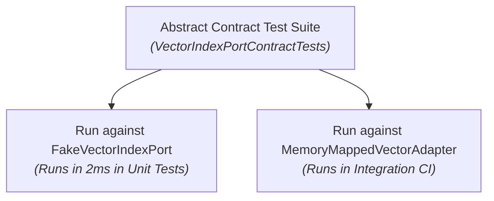

Implementing Hexagonal Architecture in C# has evolved dramatically over the last decade. Early .NET implementations relied heavily on heavy interface trees, dynamic mocking libraries (`Moq`), and heap-allocated DTOs.

With **C# 14** and **.NET 10**, we have modern language features that allow us to enforce strict hexagonal boundaries **with zero heap allocations and near-zero runtime overhead.**

---

## 1. Zero-Allocation Ports with `ReadOnlySpan<T>`

The biggest threat to performance in Hexagonal Architecture is copying data across port boundaries. If an outbound port method allocates arrays or collections for every call, Garbage Collection quickly degrades latency.

In .NET 10, ports can accept `ReadOnlySpan<T>` or `ReadOnlyMemory<T>`, enabling zero-copy data passing directly from memory-mapped files or stack allocations:

```csharp
namespace GA.Domain.Ports.Outbound;

public readonly record struct NeighborMatch(int VoicingId, float Similarity);

public interface IVectorIndexPort
{
    /// <summary>
    /// Searches for nearest neighbors using SIMD without heap allocations.
    /// Uses ReadOnlySpan<float> so memory-mapped buffers can be searched in-place.
    /// </summary>
    int SearchNearest(
        ReadOnlySpan<float> queryVector, 
        Span<NeighborMatch> destinationMatches);
}
```

### Implementing the Driven Adapter

The adapter implements this contract directly against memory-mapped unmanaged memory:

```csharp
namespace GA.Infrastructure.Adapters.Vector;

public sealed class MemoryMappedVectorAdapter(SafeBuffer indexMemory, int totalVoicings) : IVectorIndexPort
{
    public unsafe int SearchNearest(
        ReadOnlySpan<float> queryVector, 
        Span<NeighborMatch> destinationMatches)
    {
        byte* ptr = null;
        indexMemory.AcquirePointer(ref ptr);
        try
        {
            float* vectorData = (float*)ptr;
            // High-speed SIMD search over contiguous memory-mapped floats
            return SimdVectorSearch.FindTopK(
                queryVector, 
                vectorData, 
                totalVoicings, 
                destinationMatches);
        }
        finally
        {
            indexMemory.ReleasePointer();
        }
    }
}
```

No objects are allocated on the heap during the search. The query vector and the destination buffer can both reside on the stack using `stackalloc`:

```csharp
// Inside a Use Case: Zero allocations end-to-end
Span<float> queryVector = stackalloc float[240];
embeddingService.ComputeOptickVector(chord, queryVector);

Span<NeighborMatch> matches = stackalloc NeighborMatch[10];
int found = vectorIndexPort.SearchNearest(queryVector, matches);
```

---

## 2. Railway-Oriented Programming (ROP) at Port Boundaries

Traditional .NET architectures often use exceptions for control flow across boundaries (e.g., throwing `VoicingNotFoundException` or `ValidationException`).

Throwing exceptions across architectural boundaries has two major flaws:
1. **Severe Performance Cost**: Capturing a stack trace in .NET costs microseconds, causing dramatic latency spikes in high-throughput pipelines.
2. **Hidden Control Flow**: Callers have no compiler-enforced guarantee that they are handling domain failure cases.

In modern Hexagonal C#, ports return explicit functional types: `Result<T, E>`, `Option<T>`, or `Validation<T>`:

```csharp
namespace GA.Domain.Ports.Inbound;

public interface IRecognizeChordUseCase
{
    Result<RecognizedChord, RecognitionError> Execute(PitchClassSet pitchClasses);
}

public readonly record struct RecognitionError(string Code, string Message);
```

### The Driving Adapter Handles Both Tracks Explicitly

```csharp
[HttpPost("recognize")]
public IActionResult Recognize([FromBody] int pitchClassMask)
{
    var pcSet = PitchClassSet.FromMask(pitchClassMask);

    // Call the Inbound Port
    Result<RecognizedChord, RecognitionError> result = recognizeUseCase.Execute(pcSet);

    // Railway-Oriented pattern matching
    return result.Match<IActionResult>(
        success => Ok(new ChordApiResponse(success.Name, success.Quality)),
        error => error.Code switch
        {
            "AMBIGUOUS_CHORD" => Conflict(new { error.Message }),
            "EMPTY_SET" => BadRequest(new { error.Message }),
            _ => UnprocessableEntity(new { error.Message })
        });
}
```

The compiler forces the driving adapter to account for both the success track and the error track.

---

## 3. Devirtualization with Static Abstract Members

When interface methods are invoked in tight loops, virtual dispatch (vtable lookups) prevents the JIT compiler from inlining method calls.

In C# 14 / .NET 10, **Static Abstract Interface Members** allow defining port contracts that the JIT can fully devirtualize when using generic constraints:

```csharp
namespace GA.Domain.Ports;

public interface IChordMetric<TSelf> where TSelf : IChordMetric<TSelf>
{
    static abstract float ComputeDistance(in PitchClassSet a, in PitchClassSet b);
}

// Inbound Use Case using generic constraint: JIT inlines ComputeDistance!
public sealed class VoiceLeadingAnalyzer<TMetric> where TMetric : IChordMetric<TMetric>
{
    public float CalculateSmoothness(PitchClassSet from, PitchClassSet to)
    {
        // Zero virtual calls, completely inlined by the JIT!
        return TMetric.ComputeDistance(in from, in to);
    }
}
```

---

## 4. Testing Strategy: "Fakes" over "Mocks"

Dynamic mock libraries (like `Moq` or `NSubstitute`) generate runtime proxy classes that incur reflection overhead, are prone to refactoring breakages, and often lead to asserting *how* something was called rather than *what* was produced.

In Hexagonal Architecture, write **Lightweight In-Memory Fakes** for outbound ports:

```csharp
public sealed class FakeVectorIndexPort : IVectorIndexPort
{
    private readonly List<(int Id, float[] Vector)> _data = [];

    public void Seed(int id, float[] vector) => _data.Add((id, vector));

    public int SearchNearest(ReadOnlySpan<float> queryVector, Span<NeighborMatch> destination)
    {
        int count = 0;
        foreach (var item in _data)
        {
            if (count >= destination.Length) break;
            destination[count++] = new NeighborMatch(item.Id, 0.95f);
        }
        return count;
    }
}
```

### Contract Testing: Ensuring Fakes and Adapters Agree

To ensure your fake adapter does not diverge from the real production adapter, use **Contract Tests**: a shared abstract test suite executed against both the Fake and the Real adapter.



```csharp
public abstract class VectorIndexPortContractTests
{
    protected abstract IVectorIndexPort CreatePort();

    [Fact]
    public void SearchNearest_ReturnsCorrectTopMatches()
    {
        var port = CreatePort();
        Span<float> query = stackalloc float[240];
        Span<NeighborMatch> matches = stackalloc NeighborMatch[5];

        int found = port.SearchNearest(query, matches);

        Assert.True(found > 0);
    }
}

// 1. Unit Test Suite (Runs instantly)
public sealed class FakeVectorIndexPortTests : VectorIndexPortContractTests
{
    protected override IVectorIndexPort CreatePort() => new FakeVectorIndexPort();
}

// 2. Integration Test Suite (Runs in CI with real files)
public sealed class ProductionVectorIndexPortTests : VectorIndexPortContractTests
{
    protected override IVectorIndexPort CreatePort() => new MemoryMappedVectorAdapter(...);
}
```

Both adapters are guaranteed to obey identical semantics.

---

## 5. Dependency Injection Wiring in .NET 10

The Core Hexagon must never reference the DI container (`Microsoft.Extensions.DependencyInjection`). 

Instead, each adapter project provides its own registration extension methods:

```csharp
// In GA.Infrastructure.Adapters.Vector.csproj
public static class VectorAdapterServiceCollectionExtensions
{
    public static IServiceCollection AddMemoryMappedVectorIndex(
        this IServiceCollection services, 
        string indexPath)
    {
        services.AddSingleton<IVectorIndexPort>(sp => new MemoryMappedVectorAdapter(indexPath));
        return services;
    }
}

// In GA.Infrastructure.Adapters.Mcp.csproj
public static class McpAdapterServiceCollectionExtensions
{
    public static IServiceCollection AddGuitarAlchemistMcpTools(this IServiceCollection services)
    {
        services.AddScoped<SearchVoicingsMcpTool>();
        return services;
    }
}
```

The application host (`Program.cs` or Aspire `AppHost`) acts as the **Composition Root**: it references both the core and the adapters, wiring them together without any bidirectional project coupling.
