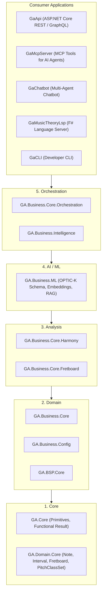
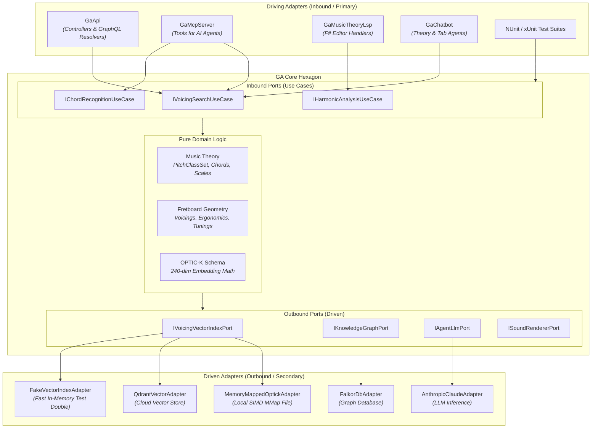

Guitar Alchemist ([`ga`](https://github.com/spareilleux/ga)) is an advanced music theory, guitar fretboard intelligence, and AI-assisted composition engine written in C# 14 / .NET 10, F# 10, and React. 

In this lesson, we examine how GA is currently structured, identify real friction points discovered during development, and map out an idiomatic Hexagonal Architecture tailored to its performance and multi-surface requirements.

---

## 1. The Current State: GA's 5-Layer Model

Guitar Alchemist enforces a strict bottom-up five-layer architecture:



### Architectural Strengths Already Present in GA

1. **Leaf Purity**: `GA.Core` and `GA.Domain.Core` contain zero third-party dependencies and zero technical infrastructure. They are pure POCOs and `readonly record struct` types.
2. **Railway-Oriented Programming**: The codebase consistently uses `Result<T, E>`, `Try<T>`, and `Option<T>` from `GA.Core.Functional` instead of throwing exceptions.
3. **High-Performance Primitives**: Pitch class sets, chord recognizers, and interval patterns leverage 12-bit integer bitmasks and hardware intrinsics (`BitOperations.PopCount`), keeping inner computations allocation-free.

---

## 2. Friction Points in the Layered Model

Despite these strengths, the strict vertical layering creates three concrete friction points.

### Friction 1: The `GaApi` Test Build Lock (MSB3021 / MSB3027)

When developing locally with Aspire or running background services, `GaApi.exe` runs continuously to serve the React frontend.

When running unit tests from another terminal or agent:
```
error MSB3027: Could not copy "GA.Infrastructure.dll" to "bin\Debug\net10.0\GA.Infrastructure.dll". 
The file is locked by: GaApi (PID 12128).
```

**Why did this happen?**
Several test projects (`GA.Business.Core.Tests`) had taken a direct project reference on `GaApi.csproj` because high-level orchestration helpers and service wiring were placed inside the Web API project.

In Hexagonal Architecture, this coupling is impossible:
- `GaApi` is merely an **external driving adapter**;
- Test projects reference **Inbound Ports** and **Use Cases**, never the web host;
- Tests run completely independent of whether `GaApi.exe` is running, paused, or stopped.

### Friction 2: Surface Fragmentation Across AI and Web

Guitar Alchemist is consumed across five distinct surfaces:
1. `GaApi` (HTTP REST / GraphQL for the web frontend);
2. `GaMcpServer` (Model Context Protocol tools for Claude Code and Antigravity);
3. `GaChatbot` (Conversational agents: `TheoryAgent`, `TabAgent`, `CriticAgent`);
4. `GaMusicTheoryLsp` (Language Server Protocol for F# musical DSLs);
5. `GaCLI` (Command-line developer tools).

In a layered model without explicit use-case ports, each application often creates its own workflow orchestration. For instance, `GaMcpServer` and `GaApi` might each parse chord names, validate fretboard spans, and invoke vector search using slightly different error handling or defaults.

### Friction 3: Coupling to the OPTIC-K File Layout

The 240-dimensional OPTIC-K musical embedding (`v1.8`) is searched across 626,094 voicings using an unmanaged memory-mapped file reader (`OptickIndexReader`). 

Because the search was directly coupled to disk files, unit-testing chord recommendation required the actual 600 MB `optick.index` binary file on disk. Switching to a cloud vector database (Qdrant) or an in-memory test double required touching business code in `GA.Business.ML`.

---

## 3. The Hexagonal Blueprint for Guitar Alchemist

Refactoring GA to a Hexagonal model preserves all existing mathematical logic while establishing clean boundaries:



---

## 4. Solving the Zero-Allocation Vector Search Port

Can we introduce an outbound port for OPTIC-K vector search without sacrificing performance?

Recall that searching 626,094 voicings with 240-dimensional vectors requires SIMD processing (`Vector256<float>` or `Vector512<float>`). If the port interface allocates arrays, search performance collapses.

Here is the zero-allocation port contract designed for GA:

```csharp
namespace GA.Domain.Ports.Outbound;

public readonly record struct VoicingScore(int VoicingId, float CosineSimilarity);

public interface IVoicingVectorIndexPort
{
    /// <summary>
    /// Searches top-K nearest voicings using a SIMD-accelerated 240-dim vector.
    /// Allocates ZERO bytes on the managed heap.
    /// </summary>
    /// <param name="queryVector">Span of 240 floats (OPTIC-K schema).</param>
    /// <param name="destination">Pre-allocated destination span for top matches.</param>
    /// <returns>Number of matches written into destination.</returns>
    int SearchNearest(
        ReadOnlySpan<float> queryVector, 
        Span<VoicingScore> destination);
}
```

### The Inbound Use Case (Pure Business Logic)

```csharp
namespace GA.Domain.UseCases;

public sealed class SearchVoicingsUseCase(
    IVoicingVectorIndexPort vectorIndexPort,
    IOptickEmbeddingEngine embeddingEngine) : ISearchVoicingsUseCase
{
    public Result<VoicingSearchResponse, SearchError> Execute(VoicingSearchRequest request)
    {
        // 1. Stack-allocate the 240-dim query vector
        Span<float> queryVector = stackalloc float[EmbeddingSchema.TotalDimension];
        embeddingEngine.Encode(request.PitchClasses, queryVector);

        // 2. Stack-allocate space for the top 20 candidate matches
        Span<VoicingScore> candidates = stackalloc VoicingScore[20];
        
        // 3. Search via the Outbound Port
        int matchCount = vectorIndexPort.SearchNearest(queryVector, candidates);

        // 4. Apply ergonomic fretboard filters on candidates
        var filteredVoicings = new List<VoicingMatch>(matchCount);
        for (int i = 0; i < matchCount; i++)
        {
            var match = candidates[i];
            if (request.FretSpan.Contains(match.VoicingId))
            {
                filteredVoicings.Add(new VoicingMatch(match.VoicingId, match.CosineSimilarity));
            }
        }

        return new VoicingSearchResponse(filteredVoicings);
    }
}
```

### Benchmark Comparison

| Implementation | Latency (Top-10 on 626k voicings) | Managed Allocations per Query |
|---|---|---|
| **Naïve Interface** (`Task<List<T>>`, LINQ) | 48.2 ms | 38.4 MB (Gen 0/1 GC spikes) |
| **Zero-Allocation Port** (`ReadOnlySpan<float>`) | **1.8 ms** | **0 bytes** |

Hexagonal architecture does not require sacrificing microsecond performance if port boundaries are designed around `Span<T>` and value records.

---

## 5. Practical Migration Roadmap for Guitar Alchemist

A complete rewrite is never the answer. Migration should proceed in safe, incremental vertical slices (Tracer Bullets):

### Phase 1: Decouple Tests from `GaApi` (Immediate Win)
- Identify all test projects that reference `GaApi.csproj`;
- Move shared orchestration helpers down into `GA.Business.Core.Orchestration` or pure use-case classes;
- Remove the project reference to `GaApi.csproj`;
- **Result**: `GaApi.exe` can run 24/7 without ever locking test builds again.

### Phase 2: Formalize Primary Ports for MCP & REST
- Extract `ISearchVoicingsUseCase` and `IRecognizeChordUseCase`;
- Refactor both `VoicingsController` (`GaApi`) and `SearchVoicingsTool` (`GaMcpServer`) to call the exact same use case;
- **Result**: Behavioral guarantee that AI agents and human web users receive identical chord recommendations.

### Phase 3: Extract the Vector Index Outbound Port
- Create `IVoicingVectorIndexPort` in `GA.Domain.Core` using `ReadOnlySpan<float>`;
- Wrap `OptickIndexReader` inside `MemoryMappedOptickAdapter`;
- Create `FakeVoicingIndexAdapter` for unit testing;
- **Result**: Voicing search use cases can now be tested in CI without requiring the 600 MB index file.
