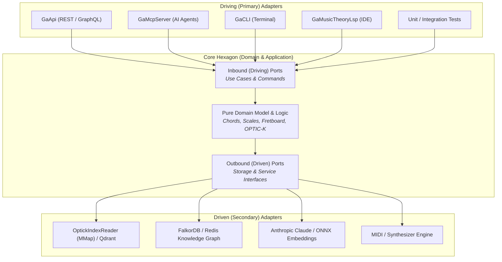

:::note[What this course runs on]
The code and architectural benchmarks of this course are built with the [.NET SDK](https://dotnet.microsoft.com/download) **10.0.112** and run on .NET **10.0.12**, with C# 14 features enabled. The case study examines real production components from [Guitar Alchemist](https://github.com/spareilleux/ga): `GA.Domain.Core`, `GA.Business.ML`, `GaApi`, and `GaMcpServer`.
:::

## Why I'm learning this

In traditional N-tier layered architecture (Presentation &rarr; Business Logic &rarr; Data Access), the database sits at the very foundation of the dependency tree. Over time, the database schema dictates domain models, ORM annotations bleed into business entities, controllers become thick with orchestration logic, and unit testing becomes impossible without launching Docker containers or dealing with database fixtures.

In a complex domain like [Guitar Alchemist](../music-theory-ga/) — involving mathematical music theory, 240-dimensional OPTIC-K vector embeddings, multi-agent AI orchestration, a Web API, an MCP server for coding agents, an F# Language Server Protocol (LSP), and a real-time 3D fretboard — traditional layering creates dangerous coupling:

- **Build locks and test fragility**: Running services (like `GaApi.exe`) hold file locks on shared binaries, preventing test suites that reference the web project from compiling.
- **Surface fragmentation**: The Web API (`GaApi`), the Model Context Protocol server (`GaMcpServer`), the F# LSP (`GaMusicTheoryLsp`), and the CLI (`GaCLI`) each want to invoke the same music theory use cases, but end up duplicating orchestration logic or coupling to HTTP-specific request models.
- **Infrastructure lock-in**: Vector similarity search is coupled to local memory-mapped files; switching to Qdrant or an in-memory test double requires surgery on core logic.

**Hexagonal Architecture** (also known as *Ports and Adapters*), formulated by Alistair Cockburn in 2005, solves these problems by turning the software inside out: **the domain is at the center, and infrastructure (HTTP, databases, vector indexes, AI models) is pushed to the exterior as replaceable adapters.**

## Who this course is for

You are a C# or .NET developer who knows clean code, dependency injection, and modern C# (C# 12 to 14). You have built Web APIs and worked with layered or onion architectures, but you want to understand:

1. How Ports & Adapters genuinely differs from classic N-tier and Onion/Clean architecture;
2. The honest trade-offs: boilerplate, indirection, and the **performance tax** (virtual dispatch, GC allocations, span boundaries);
3. How to write zero-allocation ports in .NET 10 using `ReadOnlySpan<T>`, static abstract interfaces, and Railway-Oriented Programming (`Result<T, E>`);
4. How to apply it to a real-world high-performance music-theory and AI codebase (Guitar Alchemist).

## By the end of this course, I will be able to

- Explain the symmetry of Ports and Adapters: why driving and driven ports obey the Dependency Inversion Principle;
- Clearly distinguish Hexagonal Architecture from Onion Architecture and Clean Architecture;
- Evaluate when Hexagonal Architecture is justified and when it is over-engineering;
- Design zero-allocation port boundaries in C# 14 using `ReadOnlySpan<T>` and value records;
- Implement Railway-Oriented Programming across port boundaries without throwing exceptions;
- Decouple multi-surface entry points (REST, MCP, CLI, LSP) so they share identical use cases;
- Fix binary file locks and test coupling in multi-project .NET solutions;
- Construct a concrete migration roadmap from a layered architecture to a hexagonal architecture.

## Outline

| # | Lesson | What you will learn |
|---|---|---|
| 1 | [Principles and Foundations](01-principles-and-foundations/) | Inside vs Outside, Primary vs Secondary ports, adapters, and comparison with Onion/Clean Architecture |
| 2 | [Trade-offs and Critique](02-trade-offs-and-critique/) | Testability, multi-surface parity, technology deferral vs boilerplate, indirection, and the performance tax |
| 3 | [Hexagonal Architecture in Modern C#](03-hexagonal-csharp-dotnet/) | Zero-allocation ports, `ReadOnlySpan<T>`, `Result<T, E>`, static abstract interfaces, and testing without mocks |
| 4 | [Case Study: Guitar Alchemist](04-guitar-alchemist-case-study/) | Evaluating GA's 5 layers, solving the `GaApi` test build lock, multi-surface AI/MCP parity, and SIMD vector search ports |
| 5 | [Journal](journal/) | Progress notes, benchmarks, architectural decisions, and open questions |

## Resources

- Alistair Cockburn, [*Hexagonal Architecture (Ports and Adapters)*](https://alistair.cockburn.us/hexagonal-architecture/) (original 2005 article)
- Jeffrey Palermo, [*The Onion Architecture*](https://jeffreypalermo.com/2008/07/the-onion-architecture-part-1/) (2008)
- Robert C. Martin, [*The Clean Architecture*](https://blog.cleancoder.com/uncle-bob/2012/08/13/the-clean-architecture.html) (2012)
- Vaughn Vernon, *Implementing Domain-Driven Design*, Addison-Wesley, 2013 (Chapter 4: Architecture)
- Guitar Alchemist codebase: [`AllProjects.slnx`](https://github.com/spareilleux/ga)
