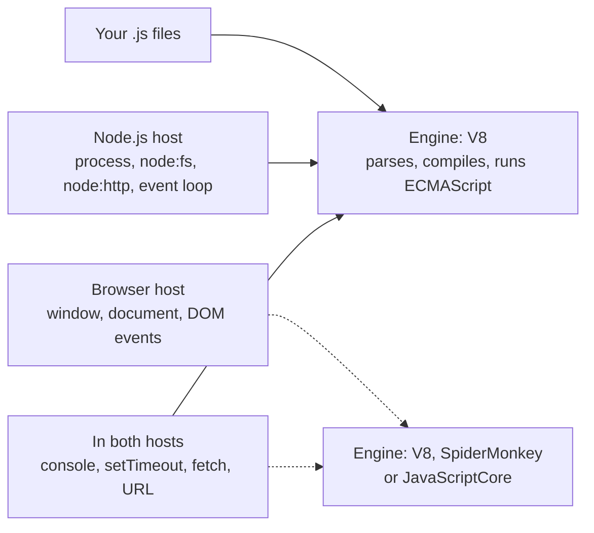

import { Tabs, TabItem } from '@astrojs/starlight/components';

Code: [`examples/l01_hello.js`](https://github.com/spareilleux/learn/blob/c65efe4fb76e61efd229793b296d3d7a44e71baf/code/javascript-for-csharp-java/examples/l01_hello.js), the projects [`l01-esm`](https://github.com/spareilleux/learn/tree/c65efe4fb76e61efd229793b296d3d7a44e71baf/code/javascript-for-csharp-java/l01-esm), [`l01-cjs`](https://github.com/spareilleux/learn/tree/c65efe4fb76e61efd229793b296d3d7a44e71baf/code/javascript-for-csharp-java/l01-cjs) and [`l01-interop`](https://github.com/spareilleux/learn/tree/c65efe4fb76e61efd229793b296d3d7a44e71baf/code/javascript-for-csharp-java/l01-interop), and the error snippets in [`errors/`](https://github.com/spareilleux/learn/tree/c65efe4fb76e61efd229793b296d3d7a44e71baf/code/javascript-for-csharp-java/errors).

## An engine and a host

In .NET and Java, one product gives you the language, the runtime and the standard library. JavaScript splits them in three:

| | C# | Java | JavaScript |
|---|---|---|---|
| The language | C#, compiled by Roslyn | Java, compiled by `javac` | [ECMAScript](https://tc39.es/ecma262/), parsed by the engine at load time |
| The runtime | the CLR | the JVM | an engine: [V8](https://v8.dev/), [SpiderMonkey](https://spidermonkey.dev/) or [JavaScriptCore](https://docs.webkit.org/Deep%20Dive/JSC/JavaScriptCore.html) |
| Files, network, processes | the base class library | the JDK | the host: Node.js, Deno, Bun, or a browser |

The ECMAScript specification defines values, objects, functions, `Array`, `Map`, `JSON` and `Promise`, and nothing that touches the outside world: no files, no network, not even `console.log`. The host adds those. Node.js embeds V8 and adds modules such as `node:fs`, a `process` object and an event loop; a browser embeds its engine and adds `document` and `window`.



So the same language gives different globals depending on where it runs:

```text
> node -p "typeof window"
undefined
> node -p "typeof process"
object
> node -p "process.versions.v8"
13.6.233.17-node.53
```

This course runs everything in Node.js. The browser is the subject of lesson 12, and the DOM belongs to the React course.

## Installing Node.js 24

Node.js publishes a major version every six months. Even-numbered versions become long-term support (LTS) releases in October, and each LTS release is supported for about 30 months ([release schedule](https://github.com/nodejs/Release#release-schedule)):

| | Released | LTS from | End of life |
|---|---|---|---|
| Node.js 22 "Jod" | April 2024 | October 2024 | April 2027 |
| Node.js 24 "Krypton" | May 2025 | October 2025 | April 2028 |
| Node.js 26 | May 2026 | October 2026 | April 2029 |

That is close to .NET, where [every even-numbered release is LTS](https://learn.microsoft.com/dotnet/core/releases-and-support) for three years, and to Java, where [a new LTS version comes every two years](https://www.oracle.com/java/technologies/java-se-support-roadmap.html). This course uses Node.js **24.21.0**, the latest 24 release on 14 September 2026.

<Tabs syncKey="os">
<TabItem label="Windows">

I downloaded the ZIP archive, checked its SHA-256 against the list Node.js publishes, and expanded it in a folder of its own, outside the global `PATH`:

```powershell
Invoke-WebRequest https://nodejs.org/dist/v24.21.0/node-v24.21.0-win-x64.zip -OutFile node-v24.21.0-win-x64.zip
(Get-FileHash node-v24.21.0-win-x64.zip -Algorithm SHA256).Hash.ToLower()
(Invoke-RestMethod https://nodejs.org/dist/v24.21.0/SHASUMS256.txt) -split "`n" | Select-String 'win-x64.zip'
Expand-Archive node-v24.21.0-win-x64.zip -DestinationPath C:\tools   # creates C:\tools\node-v24.21.0-win-x64
C:\tools\node-v24.21.0-win-x64\node.exe --version
```

The two hashes must be identical: on my machine, both were `158f7685…e541`, and the four commands took 22 seconds. Add the folder to your `PATH` to call `node` and `npm` from any terminal.

The installer is another option: `winget install OpenJS.NodeJS.LTS` (*to verify*: I haven't run it). On 14 September 2026, `winget show OpenJS.NodeJS.LTS` still offered 24.19.0, two releases behind.

</TabItem>
<TabItem label="Linux / WSL">

[nvm](https://github.com/nvm-sh/nvm) installs Node.js versions in your home folder and switches between them, like a `global.json` for the whole shell (*to verify*: I haven't run these commands):

```bash
curl -o- https://raw.githubusercontent.com/nvm-sh/nvm/v0.40.7/install.sh | bash
# open a new terminal, then:
nvm install 24.21.0
node --version
```

The archives on [nodejs.org/dist](https://nodejs.org/dist/v24.21.0/) (`node-v24.21.0-linux-x64.tar.xz`) are the other way, with the same `SHASUMS256.txt` as on Windows.

**On WSL**, install Node.js *inside* the distribution and keep your projects in the Linux file system (`~/src/...`), not under `/mnt/c`: a `node_modules` folder holds thousands of small files, and [reading Windows files from Linux is slower](https://learn.microsoft.com/windows/wsl/filesystems#file-storage-and-performance-across-file-systems).

</TabItem>
<TabItem label="macOS">

The macOS installer (`node-v24.21.0.pkg`) is on [nodejs.org/dist](https://nodejs.org/dist/v24.21.0/), and nvm works on macOS as on Linux. With [Homebrew](https://formulae.brew.sh/formula/node@24) (*to verify*: I haven't run it):

```bash
brew install node@24
echo 'export PATH="$(brew --prefix node@24)/bin:$PATH"' >> ~/.zshrc   # node@24 is keg-only: not linked by default
node --version
```

</TabItem>
</Tabs>

Then, on any OS:

```text
> node --version
v24.21.0
> npm --version
11.19.0
```

npm comes with Node.js: each Node.js release bundles a version of npm.

## Running JavaScript

```js
// examples/l01_hello.js
const names = process.argv.slice(2); // argv[0] is node, argv[1] is this file
console.log('Hello, world!');
for (const name of names) {
  console.log(`Hello, ${name}!`);
}
```

```text
> node examples/l01_hello.js Ada Grace
Hello, world!
Hello, Ada!
Hello, Grace!
```

| | C# | Java | Node.js |
|---|---|---|---|
| Run one file | `dotnet run app.cs` ([.NET 10](https://learn.microsoft.com/dotnet/core/sdk/file-based-apps)) | [`java Hello.java`](https://openjdk.org/jeps/330) | `node hello.js` |
| Evaluate an expression | — | — | `node -p "0.1 + 0.2"` |
| Interactive shell | C# Interactive in Visual Studio | [`jshell`](https://docs.oracle.com/en/java/javase/25/jshell/introduction-jshell.html) | `node`, then `.exit` |
| Rerun on every change | `dotnet watch` | — | [`node --watch hello.js`](https://nodejs.org/docs/latest-v24.x/api/cli.html#--watch) |
| Program arguments | `args` | `String[] args` | [`process.argv`](https://nodejs.org/docs/latest-v24.x/api/process.html#processargv), from index 2 |

There is no compilation step to run: Node.js reads the source, V8 compiles it on the fly. `console.log` is the `Console.WriteLine` of JavaScript; template literals, between backticks, interpolate like `$"…"` in C#. [Lesson 2](../02-values-and-types/) explains `const`.

## npm and package.json

A folder becomes a project when it has a `package.json`. [`npm init -y`](https://docs.npmjs.com/cli/v11/commands/npm-init) writes one with default values:

```text
> npm init -y
Wrote to C:\…\npmdemo\package.json:

{
  "name": "npmdemo",
  "version": "1.0.0",
  "description": "",
  "main": "index.js",
  "scripts": {
    "test": "echo \"Error: no test specified\" && exit 1"
  },
  "keywords": [],
  "author": "",
  "license": "ISC",
  "type": "commonjs"
}
```

npm 11.19 writes `"type": "commonjs"` explicitly; the [modules section](#modules-es-modules-and-commonjs) below explains why that field matters. Installing a package adds it to `dependencies`, downloads it into `node_modules`, and writes `package-lock.json`:

```text
> npm install semver@7.7.2

added 1 package, and audited 2 packages in 782ms

found 0 vulnerabilities
```

```json
  "dependencies": {
    "semver": "^7.7.2"
  }
```

| | NuGet | Maven | npm |
|---|---|---|---|
| Manifest | `.csproj`, `<PackageReference>` | `pom.xml`, `<dependency>` | [`package.json`](https://docs.npmjs.com/cli/v11/configuring-npm/package-json), `dependencies` |
| Build or test only | `PrivateAssets="all"` | `<scope>test</scope>` | `devDependencies` |
| A version written `7.7.2` | means 7.7.2 or higher ([NuGet versioning](https://learn.microsoft.com/nuget/concepts/package-versioning)) | a soft requirement for 7.7.2 ([POM reference](https://maven.apache.org/pom.html#Dependency_Version_Requirement_Specification)) | exactly 7.7.2 |
| Default range when you add a package | the version, as a minimum | the version | `^7.7.2`: 7.7.2 or higher, below 8.0.0 ([semver](https://docs.npmjs.com/about-semantic-versioning)) |
| Lock file | `packages.lock.json`, [opt-in](https://learn.microsoft.com/nuget/consume-packages/package-references-in-project-files#locking-dependencies) | none | [`package-lock.json`](https://docs.npmjs.com/cli/v11/configuring-npm/package-lock-json), always |
| Where packages go | a shared cache, `~/.nuget/packages` | a shared cache, `~/.m2/repository` | a `node_modules` folder in each project, filled from a cache |
| Restore exactly the lock file | `dotnet restore --locked-mode` | — | [`npm ci`](https://docs.npmjs.com/cli/v11/commands/npm-ci) |
| Run a tool of a package | `dotnet tool run` | a plugin goal | `npx <tool>` |

Commit `package.json` and `package-lock.json`, never `node_modules`. In CI, `npm ci` deletes `node_modules` and installs exactly what the lock file lists, or fails if the lock file doesn't match `package.json`.

### Scripts

The `scripts` of `package.json` are named commands, the closest thing to MSBuild targets or Maven goals. [`l01-esm/package.json`](https://github.com/spareilleux/learn/blob/c65efe4fb76e61efd229793b296d3d7a44e71baf/code/javascript-for-csharp-java/l01-esm/package.json) has two:

```json
{
  "name": "l01-esm",
  "version": "1.0.0",
  "private": true,
  "type": "module",
  "scripts": {
    "start": "node main.js",
    "greet": "node main.js Ada Grace"
  }
}
```

`npm run` prints the script before running it; [`node --run`](https://nodejs.org/docs/latest-v24.x/api/cli.html#--run), added in Node.js 22, runs it without npm:

```text
> npm run greet

> l01-esm@1.0.0 greet
> node main.js Ada Grace

Hello, Ada!
Hello, Grace!
Bye, Ada!
l01-esm: main.js, typeof require = undefined
> node --run greet
Hello, Ada!
Hello, Grace!
Bye, Ada!
l01-esm: main.js, typeof require = undefined
```

Both add `node_modules/.bin` to the `PATH`, so a script can call the tools of installed packages by name. `node --run` [intentionally](https://nodejs.org/docs/latest-v24.x/api/cli.html#intentional-limitations) skips the `pre` and `post` scripts that npm runs around a script (exercise 2).

### In real projects

This site's [`package.json`](https://github.com/spareilleux/learn/blob/c65efe4fb76e61efd229793b296d3d7a44e71baf/package.json#L1-L12) declares `"type": "module"` and scripts that call [Astro](https://docs.astro.build/): `npm run build` runs `astro build`, found in `node_modules/.bin`.

GuitarAlchemist/ga shows two traps of a JavaScript project maintained by C# developers:

- [`Apps/ga-client`](https://github.com/GuitarAlchemist/ga/tree/a826864f3a012cad88e415954bf57eca0ce12aa6/Apps/ga-client) has both a `package-lock.json` and a `pnpm-lock.yaml`. They are the lock files of two package managers, npm and [pnpm](https://pnpm.io/), and nothing keeps them in agreement: a developer who runs `npm install` and one who runs `pnpm install` can get different versions of the same dependency.
- [`ReactComponents/ga-react-components/package.json`](https://github.com/GuitarAlchemist/ga/blob/a826864f3a012cad88e415954bf57eca0ce12aa6/ReactComponents/ga-react-components/package.json#L71) lists `@esbuild/win32-x64` in `devDependencies`. That package declares `"os": ["win32"]`, and npm refuses to install it anywhere else. The course's CI installs it on the three OSes: it works on Windows, and on Linux npm stops with:

```text
npm error code EBADPLATFORM
npm error notsup Unsupported platform for @esbuild/win32-x64@0.25.12: wanted {"os":"win32","cpu":"x64"} (current: {"os":"linux","cpu":"x64"})
npm error notsup Valid os:   win32
npm error notsup Actual os:  linux
npm error notsup Valid cpu:  x64
npm error notsup Actual cpu: x64
```

macOS fails the same way. The folder has only a `pnpm-lock.yaml`, and pnpm 10 installed a package for another OS without a word on my machine, so the project probably installs with pnpm on every OS, but not with npm (*to verify* on Linux and macOS). The usual fix is to leave the platform packages out: esbuild lists them all as `optionalDependencies`, and each package manager installs the one that matches.

## Modules: ES modules and CommonJS

Node.js has two module systems. CommonJS came first, with Node.js in 2009: `require` loads a file, `module.exports` is what it exports. ES modules came with the language in ECMAScript 2015, and are what browsers understand: `import` and `export`.

| | CommonJS | ES modules |
|---|---|---|
| Import | `const { hello } = require('./greet')` | `import { hello } from './greet.js'` |
| Export | `module.exports = { hello }` | `export function hello…` |
| File extension in the path | optional | required |
| Loading | synchronous, when `require` runs | the imports are resolved before the module runs |
| Strict mode ([lesson 3](../03-functions-and-scope/#strict-mode)) | only with `'use strict'` | always |
| `await` at the top level | no | yes |
| The folder of the current file | `__dirname` | [`import.meta.dirname`](https://nodejs.org/docs/latest-v24.x/api/esm.html#importmetadirname) |

In both, a module is a **file**: there is no namespace that spans files, and nothing is visible to other files unless it is exported. Compared with C#, `export` is `public`, everything else is `private` to the file, and `import` names the file where a `using` would name a namespace.

### How Node.js decides

Node.js [chooses the module system](https://nodejs.org/docs/latest-v24.x/api/packages.html#determining-module-system) file by file:

1. a `.mjs` file is an ES module, a `.cjs` file is CommonJS;
2. a `.js` file follows the `"type"` field of the nearest `package.json`, `"module"` or `"commonjs"`;
3. a `.js` file without a `"type"` above it is parsed as CommonJS, and parsed again as an ES module if it contains `import` or `export` ([syntax detection](https://nodejs.org/docs/latest-v24.x/api/packages.html#syntax-detection)).

The third case works, with a warning. [`l01-interop/package.json`](https://github.com/spareilleux/learn/blob/c65efe4fb76e61efd229793b296d3d7a44e71baf/code/javascript-for-csharp-java/l01-interop/package.json) has no `"type"`, and `detect.js` contains an `import`:

```text
> node detect.js
(node:PID) [MODULE_TYPELESS_PACKAGE_JSON] Warning: Module type of l01-interop/detect.js is not specified and it doesn't parse as CommonJS.
Reparsing as ES module because module syntax was detected. This incurs a performance overhead.
To eliminate this warning, add "type": "module" to l01-interop/package.json.
(Use `node --trace-warnings ...` to show where the warning was created)
8 undefined
```

:::note[Error outputs in this course]
Node.js prints absolute paths, a process ID and a stack trace whose frames name its internal files. The outputs in the lessons show the paths relative to the course folder, `PID` for the process ID, and no `at …` frames; [`normalize.mjs`](https://github.com/spareilleux/learn/blob/c65efe4fb76e61efd229793b296d3d7a44e71baf/code/javascript-for-csharp-java/normalize.mjs) makes the same changes before the CI compares them. Everything else is Node.js 24.21.0's output, identical on Windows, Linux and macOS.
:::

### The same program, twice

The ES module version, in a package with `"type": "module"`:

```js
// l01-esm/greet.js
// An ES module: what it exports is declared with export, everything else stays private to the file
const punctuation = '!';

export function hello(name) {
  return `Hello, ${capitalize(name)}${punctuation}`;
}

export default function farewell(name) {
  return `Bye, ${capitalize(name)}${punctuation}`;
}

function capitalize(text) {
  return text.charAt(0).toUpperCase() + text.slice(1);
}
```

```js
// l01-esm/main.js
// "type": "module" in package.json: .js files are ES modules
import { readFile } from 'node:fs/promises';
import path from 'node:path';
import farewell, { hello } from './greet.js'; // the extension is required

const names = process.argv.length > 2 ? process.argv.slice(2) : ['world'];
for (const name of names) {
  console.log(hello(name));
}
console.log(farewell(names[0]));

// No __dirname in an ES module: import.meta gives the module's own location
const manifest = JSON.parse(await readFile(path.join(import.meta.dirname, 'package.json'), 'utf8')); // top-level await
console.log(`${manifest.name}: ${path.basename(import.meta.filename)}, typeof require = ${typeof require}`);
```

```text
> node main.js
Hello, World!
Bye, World!
l01-esm: main.js, typeof require = undefined
```

A module has any number of *named* exports and at most one *default* export; `import farewell, { hello }` takes the default one under a name you choose, and `hello` under its own name. Built-in modules start with `node:`.

The CommonJS version, in a package with `"type": "commonjs"`:

```js
// l01-cjs/greet.js
// A CommonJS module: what it exports is whatever ends up in module.exports
const punctuation = '!';

function hello(name) {
  return `Hello, ${capitalize(name)}${punctuation}`;
}

function capitalize(text) {
  return text.charAt(0).toUpperCase() + text.slice(1);
}

module.exports = { hello };
```

```js
// l01-cjs/main.js
// "type": "commonjs" in package.json: .js files are CommonJS modules
const fs = require('node:fs');
const path = require('node:path');
const { hello } = require('./greet'); // the extension can be left out

const names = process.argv.length > 2 ? process.argv.slice(2) : ['world'];
for (const name of names) {
  console.log(hello(name));
}

const manifest = JSON.parse(fs.readFileSync(path.join(__dirname, 'package.json'), 'utf8'));
console.log(`${manifest.name}: ${path.basename(__filename)}, typeof require = ${typeof require}`);
```

```text
> node main.js Ada
Hello, Ada!
l01-cjs: main.js, typeof require = function
```

### Mixing them up

`require` in an ES module. The course folder's [`package.json`](https://github.com/spareilleux/learn/blob/c65efe4fb76e61efd229793b296d3d7a44e71baf/code/javascript-for-csharp-java/package.json) says `"type": "module"`:

```js
// errors/l01_require_in_esm.js
const fs = require('node:fs');
console.log(fs.existsSync('package.json'));
```

```text
errors/l01_require_in_esm.js:2
const fs = require('node:fs');
           ^

ReferenceError: require is not defined in ES module scope, you can use import instead
This file is being treated as an ES module because it has a '.js' file extension and 'package.json' contains "type": "module". To treat it as a CommonJS script, rename it to use the '.cjs' file extension.

Node.js v24.21.0
```

`import` in a CommonJS file:

```js
// errors/l01_import_in_cjs.cjs
import { readFileSync } from 'node:fs';
console.log(readFileSync);
```

```text
(node:PID) Warning: Failed to load the ES module: errors/l01_import_in_cjs.cjs. Make sure to set "type": "module" in the nearest package.json file or use the .mjs extension.
(Use `node --trace-warnings ...` to show where the warning was created)
errors/l01_import_in_cjs.cjs:2
import { readFileSync } from 'node:fs';
^^^^^^

SyntaxError: Cannot use import statement outside a module

Node.js v24.21.0
```

The error that surprises C# and Java developers most, and TypeScript developers too: an ES module import without its extension.

```js
// errors/l01_missing_extension.js
import { show } from '../examples/show';
show('never', 'printed');
```

Run from the `errors` folder:

```text
node:internal/modules/run_main:107
    triggerUncaughtException(
    ^

Error [ERR_MODULE_NOT_FOUND]: Cannot find module 'examples/show' imported from errors/l01_missing_extension.js
Did you mean to import "../examples/show.js"?
{
  code: 'ERR_MODULE_NOT_FOUND',
  url: 'examples/show'
}

Node.js v24.21.0
```

Run from the course folder, with `node errors/l01_missing_extension.js`, the same file gives the same error *without* the line `Did you mean to import "../examples/show.js"?`. To find that hint, Node.js asks the CommonJS resolver where `require` would have found the file ([`resolve.js`, lines 888-895](https://github.com/nodejs/node/blob/v24.21.0/lib/internal/modules/esm/resolve.js#L888-L895)), but it gives the resolver a parent module without a file name, and for such a parent the resolver looks for relative paths from the current folder ([`loader.js`, lines 1021-1028](https://github.com/nodejs/node/blob/v24.21.0/lib/internal/modules/cjs/loader.js#L1021-L1028)). The hint appears only when `../examples/show.js` also exists relative to where you typed the command. The error itself is right either way: add the extension.

### Using one from the other

An ES module can import a CommonJS module. `module.exports` becomes the default export, and Node.js [finds the named exports](https://nodejs.org/docs/latest-v24.x/api/esm.html#commonjs-namespaces) by reading the source for assignments such as `exports.half = …`:

```js
// l01-interop/legacy.cjs
exports.half = (n) => n / 2;
exports.kind = 'CommonJS';
```

```js
// l01-interop/from-esm.mjs
import legacy, { half } from './legacy.cjs';

console.log('default import:', legacy);
console.log('named import:  ', half(3));
```

```text
default import: { half: [Function (anonymous)], kind: 'CommonJS' }
named import:   1.5
```

The other direction, `require` of an ES module, used to be impossible. It works since Node.js 22.12 without a flag, and the Node.js 24 documentation [no longer calls it experimental](https://nodejs.org/docs/latest-v24.x/api/modules.html#loading-ecmascript-modules-using-require), as long as the module doesn't use top-level `await`:

```js
// l01-interop/modern.mjs
export const twice = (n) => n * 2;
export default 'ES module';
```

```js
// l01-interop/from-cjs.cjs
const modern = require('./modern.mjs');

console.log(modern);
console.log(modern.twice(21), modern.default);
```

```text
[Module: null prototype] {
  __esModule: true,
  default: 'ES module',
  twice: [Function: twice]
}
42 ES module
```

GuitarAlchemist/ga uses the extensions as intended: its front ends are `"type": "module"` packages, and the one configuration file written with `module.exports` is named [`postcss.config.cjs`](https://github.com/GuitarAlchemist/ga/blob/a826864f3a012cad88e415954bf57eca0ce12aa6/Apps/ga-client/postcss.config.cjs): named `.js`, it would be an ES module, where `module` doesn't exist. This site names its scripts `.mjs`, such as `scripts/sync-streeling.mjs`, which is redundant under `"type": "module"` and still correct if the field is removed.

**Which one to write?** ES modules, for new code: they are the standard, the browser's format, and what TypeScript and bundlers produce by default. You still meet CommonJS in older packages and configuration files.

## Key takeaways

- ECMAScript is the language; V8 is the engine; Node.js is a host that adds files, processes and modules. A browser is another host.
- Node.js 24 is the active LTS line until October 2026 and stays supported until April 2028; npm comes with it.
- `package.json` is the manifest and `package-lock.json` the lock file; commit both, and install in CI with `npm ci`.
- `npm install` writes `^` ranges: any later minor or patch version is accepted, and the lock file is what pins the exact one.
- A `.js` file is an ES module or a CommonJS module according to the `"type"` of the nearest `package.json`; `.mjs` and `.cjs` force the choice.
- ES modules need the file extension in relative imports, are always strict, and allow top-level `await`.

## Exercises

1. Rename `l01-cjs/greet.js` to `greet.mjs` and rewrite it as an ES module, but keep `main.js` a CommonJS module. What must change in `main.js`?

<details>
<summary>Solution</summary>

Only the path: `require('./greet')` doesn't find `greet.mjs`, because `require` only tries the extensions `.js`, `.json` and `.node`. [`solutions/l01-ex1`](https://github.com/spareilleux/learn/tree/c65efe4fb76e61efd229793b296d3d7a44e71baf/code/javascript-for-csharp-java/solutions/l01-ex1):

```js
// main.js
const greet = require('./greet.mjs');

console.log(greet.hello('world'));
console.log('exports of greet.mjs:', Object.keys(greet));
```

```text
Hello, World!
exports of greet.mjs: [ 'hello' ]
```

`greet.mjs` is loaded synchronously because it has no top-level `await`. Add one, and `require` throws [`ERR_REQUIRE_ASYNC_MODULE`](https://nodejs.org/docs/latest-v24.x/api/errors.html#err_require_async_module).

</details>

2. In a copy of `l01-esm`, add a script `"pregreet": "node -e \"console.log('pregreet runs')\""`. Run `npm run greet`, then `node --run greet`. What differs?

<details>
<summary>Solution</summary>

```text
> npm run greet

> l01-esm@1.0.0 pregreet
> node -e "console.log('pregreet runs')"

pregreet runs

> l01-esm@1.0.0 greet
> node main.js Ada Grace

Hello, Ada!
Hello, Grace!
Bye, Ada!
l01-esm: main.js, typeof require = undefined
```

```text
> node --run greet
Hello, Ada!
Hello, Grace!
Bye, Ada!
l01-esm: main.js, typeof require = undefined
```

npm runs `pregreet` before `greet` and prints each command; `node --run` runs only `greet`, silently. The [Node.js documentation](https://nodejs.org/docs/latest-v24.x/api/cli.html#intentional-limitations) lists this as a deliberate limitation. A project that relies on `pre` scripts, such as `pretest` to build before testing, must keep `npm run`.

</details>

3. Add `"type": "module"` to `l01-interop/package.json` and run `node detect.js` again, then `node from-cjs.cjs`. What changes, and why don't the `.mjs` and `.cjs` files care?

<details>
<summary>Solution</summary>

`node detect.js` prints `8 undefined` without the warning: the `.js` file is now an ES module by declaration, and Node.js doesn't parse it twice. `from-cjs.cjs`, `legacy.cjs` and `modern.mjs` behave exactly as before, since their extension decides before `"type"` is read. Adding `"type": "module"` to a package changes only its `.js` files: that is why a project that switches often renames a few configuration files to `.cjs`, like GA's `postcss.config.cjs`.

</details>

## Sources

- [Node.js — Modules: packages, determining the module system](https://nodejs.org/docs/latest-v24.x/api/packages.html#determining-module-system), [ECMAScript modules](https://nodejs.org/docs/latest-v24.x/api/esm.html), [CommonJS modules](https://nodejs.org/docs/latest-v24.x/api/modules.html), [Command-line options](https://nodejs.org/docs/latest-v24.x/api/cli.html)
- [Node.js release schedule](https://github.com/nodejs/Release#release-schedule), [Node.js 24.21.0 downloads](https://nodejs.org/dist/v24.21.0/)
- [npm — package.json](https://docs.npmjs.com/cli/v11/configuring-npm/package-json), [package-lock.json](https://docs.npmjs.com/cli/v11/configuring-npm/package-lock-json), [npm ci](https://docs.npmjs.com/cli/v11/commands/npm-ci), [semantic versioning](https://docs.npmjs.com/about-semantic-versioning)
- [ECMAScript — Modules](https://tc39.es/ecma262/#sec-modules)
- [Microsoft — File-based apps](https://learn.microsoft.com/dotnet/core/sdk/file-based-apps), [NuGet package versioning](https://learn.microsoft.com/nuget/concepts/package-versioning), [JEP 330 — Launch single-file source-code programs](https://openjdk.org/jeps/330)
