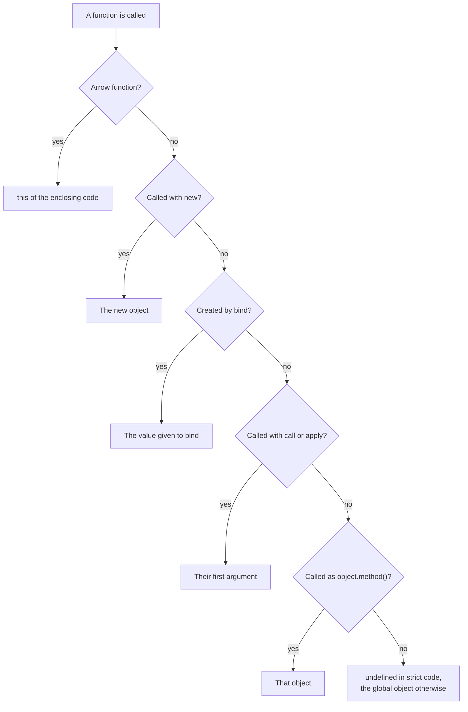

Code: the files [`examples/l03_*`](https://github.com/spareilleux/learn/tree/c65efe4fb76e61efd229793b296d3d7a44e71baf/code/javascript-for-csharp-java/examples), [`errors/l03_duplicate_function.js`](https://github.com/spareilleux/learn/blob/c65efe4fb76e61efd229793b296d3d7a44e71baf/code/javascript-for-csharp-java/errors/l03_duplicate_function.js), and the C# and Java sides in [`compare/l03_closures.cs`](https://github.com/spareilleux/learn/blob/c65efe4fb76e61efd229793b296d3d7a44e71baf/code/javascript-for-csharp-java/compare/l03_closures.cs), [`compare/L03MethodRef.java`](https://github.com/spareilleux/learn/blob/c65efe4fb76e61efd229793b296d3d7a44e71baf/code/javascript-for-csharp-java/compare/L03MethodRef.java) and [`compare_fail/L03Closures.java`](https://github.com/spareilleux/learn/blob/c65efe4fb76e61efd229793b296d3d7a44e71baf/code/javascript-for-csharp-java/compare_fail/L03Closures.java).

## Three ways to write a function

```js
// examples/l03_functions.js
import { show } from './show.js';

function add(a, b) {
  return a + b;
}
const subtract = function (a, b) {
  return a - b;
};
const multiply = (a, b) => a * b;

show('add(2, 3)', add(2, 3));
show('subtract(2, 3)', subtract(2, 3));
show('multiply(2, 3)', multiply(2, 3));

// Too few or too many arguments: no error
show('add(2)', add(2));
show('add(2, 3, 4)', add(2, 3, 4));
show('add.length', add.length);

// Default values and rest parameters
function greet(name = 'reader', ...titles) {
  return `Hello, ${[...titles, name].join(' ')}!`;
}
show('greet()', greet());
show("greet('Hopper', 'Admiral')", greet('Hopper', 'Admiral'));
show('greet(undefined)', greet(undefined));
show('greet(null)', greet(null));

// No overloading: in a function body, the second declaration replaces the first
function overloads() {
  function describe(page) {
    return `page ${page}`;
  }
  function describe(page, locale) {
    return `page ${page} in ${locale}`;
  }
  return describe('mission');
}
show('overloads()', overloads());

// Functions are objects: they can be stored, passed and given properties
const operations = { add, subtract, multiply };
show('Object.keys(operations)', Object.keys(operations));
// map calls its callback with (element, index, array): extra arguments are silently used
show('[1, 2, 3].map(multiply)', [1, 2, 3].map(multiply));
show("['1', '2', '3'].map(parseInt)", ['1', '2', '3'].map(parseInt));
show('typeof add', typeof add);
show('add.name', add.name);
```

```text
add(2, 3)                          5
subtract(2, 3)                     -1
multiply(2, 3)                     6
add(2)                             NaN
add(2, 3, 4)                       5
add.length                         2
greet()                            'Hello, reader!'
greet('Hopper', 'Admiral')         'Hello, Admiral Hopper!'
greet(undefined)                   'Hello, reader!'
greet(null)                        'Hello, !'
overloads()                        'page mission in undefined'
Object.keys(operations)            [ 'add', 'subtract', 'multiply' ]
[1, 2, 3].map(multiply)            [ 0, 2, 6 ]
['1', '2', '3'].map(parseInt)      [ 1, NaN, NaN ]
typeof add                         'function'
add.name                           'add'
```

| | C# | Java | JavaScript |
|---|---|---|---|
| Named function | a method | a method | `function add(a, b) { … }`, a *declaration* |
| Function in a variable | `Func<int, int, int> add = (a, b) => a + b;` | `IntBinaryOperator add = (a, b) -> a + b;` | a function *expression*, or an *arrow function* `(a, b) => a + b` |
| Wrong number of arguments | compile error | compile error | accepted: missing ones are `undefined`, extra ones are ignored |
| Default value | `int b = 0` | — | `b = 0`, used when the argument is `undefined` |
| Variable arguments | `params int[] rest` | `int... rest` | `...rest`, a real array |
| Overloading | by signature | by signature | none |

A call checks nothing: `add(2)` runs with `b` set to `undefined`, and `2 + undefined` is `NaN`. A default value replaces `undefined` only, so `greet(null)` keeps the `null`. There is no overloading either: inside a function, a second `function describe` silently replaces the first one, and code that needs two behaviors inspects its arguments. At the top level of a module, the same duplicate is refused before anything runs, because a module's top-level declarations follow [the rules of `let`](https://tc39.es/ecma262/#sec-module-semantics-static-semantics-early-errors):

```text
errors/l03_duplicate_function.js:5
function describe(page, locale) {
^

SyntaxError: Identifier 'describe' has already been declared

Node.js v24.21.0
```

Functions are objects: they have properties such as `name` and `length`, and they can be stored and passed around like delegates in C# or functional interfaces in Java, without a named type. Passing one as a callback combines with the lack of checks into a classic trap. [`Array.prototype.map`](https://developer.mozilla.org/en-US/docs/Web/JavaScript/Reference/Global_Objects/Array/map) calls its callback with three arguments: the element, its index, and the array. `multiply` uses the first two, and returns `1 × 0`, `2 × 1` and `3 × 2`. `parseInt` takes the index as its radix: `parseInt('1', 0)` treats radix 0 as 10, radix 1 doesn't exist, and `'3'` isn't a digit in base 2. Write `map((text) => parseInt(text, 10))` to say which arguments you pass.

## Hoisting and the temporal dead zone

```js
// examples/l03_hoisting.js
import { attempt, show } from './show.js';

// A function declaration can be called before its line
show('square(4)', square(4));
function square(n) {
  return n * n;
}

// var is hoisted with the value undefined, for the whole function
function withVar() {
  const before = total;
  var total = 10;
  return [before, total];
}
show('withVar()', withVar());

// let, const and class are hoisted too, but reading them before their line throws
function withLet() {
  const before = total;
  let total = 10;
  return [before, total];
}
attempt('withLet()', withLet);
attempt('typeof total, in the TDZ', () => {
  const kind = typeof total;
  let total = 1;
  return kind;
});
show('typeof neverDeclared', typeof neverDeclared);
attempt('new Later()', () => new Later());
class Later {}

// var has no block scope: the if doesn't contain it
function blocks() {
  if (true) {
    var fromVar = 'visible';
    let fromLet = 'hidden';
  }
  return [fromVar, typeof fromLet];
}
show('blocks()', blocks());
```

```text
square(4)                          16
withVar()                          [ undefined, 10 ]
withLet()                          ReferenceError: Cannot access 'total' before initialization
typeof total, in the TDZ           ReferenceError: Cannot access 'total' before initialization
typeof neverDeclared               'undefined'
new Later()                        ReferenceError: Cannot access 'Later' before initialization
blocks()                           [ 'visible', 'undefined' ]
```

Before running a function or a module, the engine creates all the variables it declares. That is called *hoisting*, and what a variable holds before its line depends on how it was declared:

- a function declaration is ready at once, which is why `square(4)` works above its definition, as a method can be called before it appears in a C# class;
- a `var` holds `undefined`, and belongs to the whole function, not to the block where it is written;
- a `let`, a `const` or a `class` exists but may not be read until its line has run. The time between the start of the scope and that line is the *temporal dead zone*, and reading the variable there throws a `ReferenceError`, even through `typeof`, which otherwise returns `'undefined'` for a name that was never declared.

C# refuses at compile time to use a local variable before its declaration. JavaScript can only refuse when the line runs, and `let` and `const` at least make that a loud error instead of a silent `undefined`. `var` is the reason to prefer them: it ignores blocks, and it plays badly with closures, as the next section shows.

## Closures

```js
// examples/l03_closures.js
import { attempt, show } from './show.js';

function counter() {
  let count = 0; // private: only the returned functions can reach it
  return {
    increment: () => ++count,
    current: () => count,
  };
}
const a = counter();
const b = counter();
a.increment();
a.increment();
b.increment();
show('a.current()', a.current());
show('b.current()', b.current());
show('a.count', a.count);

// The variable is captured, so a later change is visible
let label = 'draft';
const readLabel = () => label;
label = 'published';
show('readLabel()', readLabel());

// Loops: var gives one variable for the whole loop, let gives one per iteration
const withVar = [];
for (var i = 0; i < 3; i++) {
  withVar.push(() => i);
}
const withLet = [];
for (let j = 0; j < 3; j++) {
  withLet.push(() => j);
}
show('withVar, called', withVar.map((f) => f()));
show('withLet, called', withLet.map((f) => f()));

// A callback that runs later sees the value at that time
const timeline = [];
for (var k = 0; k < 3; k++) {
  setTimeout(() => timeline.push(k), 0);
}
setTimeout(() => show('timeline', timeline), 0);
attempt('k, after the loop', () => k);
```

```text
a.current()                        2
b.current()                        1
a.count                            undefined
readLabel()                        'published'
withVar, called                    [ 3, 3, 3 ]
withLet, called                    [ 0, 1, 2 ]
k, after the loop                  3
timeline                           [ 3, 3, 3 ]
```

A function keeps access to the variables of the scope where it was created, even after that scope has returned: `count` lives as long as the functions that use it, one `count` per call of `counter`. That is a *closure*, and before classes had private fields, it was the way to hide state. The function captures the **variable**, not its value at the time: `readLabel` sees `'published'`.

Loops are where that matters. A `var` in a `for` is one variable for the whole loop, so the three functions read the same `i`, which is `3` when they run. With `let`, the specification [creates a new variable for each iteration](https://tc39.es/ecma262/#sec-createperiterationenvironment) and copies the current value into it, so each function keeps its own. The timers show the same thing with callbacks that run after the loop has finished; [lesson 7](../#outline) explains when.

C# and Java meet the same question, and answer it differently:

```text
> dotnet run l03_closures.cs
for:     3, 3, 3
foreach: 0, 1, 2
method group: GA plays
```

```text
> javac L03Closures.java
L03Closures.java:10: error: local variables referenced from a lambda expression must be final or effectively final
            suppliers.add(() -> i);
                                ^
1 error
```

C# captures variables, as JavaScript does: a `for` loop has one variable, and its lambdas print `3, 3, 3`. Its `foreach` loop gives each iteration its own variable since C# 5, a [breaking change made for exactly this reason](https://ericlippert.com/2009/11/12/closing-over-the-loop-variable-considered-harmful-part-one/). Java refuses to compile a lambda that captures a variable that changes ([JLS 15.27.2](https://docs.oracle.com/javase/specs/jls/se25/html/jls-15.html#jls-15.27.2)), and makes you copy it into an effectively final one.

## this

In C# and Java, `this` is the object whose method is running, decided where the method is written. In JavaScript, `this` is an implicit parameter of every non-arrow function, and its value is decided **by each call** ([OrdinaryCallBindThis](https://tc39.es/ecma262/#sec-ordinarycallbindthis)).

```js
// examples/l03_this.js
import { attempt, show } from './show.js';

function whoAmI() {
  return this?.name;
}
const lesson = { name: 'lesson', whoAmI };
const journal = { name: 'journal' };

// Implicit binding: the object before the dot
show('lesson.whoAmI()', lesson.whoAmI());

// Default binding: a plain call, undefined in strict code (modules and classes)
show('whoAmI()', whoAmI());
const detached = lesson.whoAmI;
show('detached()', detached());

// Explicit binding: call, apply and bind
show('whoAmI.call(journal)', whoAmI.call(journal));
show('whoAmI.apply(journal, [])', whoAmI.apply(journal, []));
const bound = whoAmI.bind(journal);
show('bound()', bound());
lesson.bound = bound;
show('lesson.bound()', lesson.bound());
show('bound.call(lesson)', bound.call(lesson));

// New binding: a new object
function Page(name) {
  this.name = name;
}
show("new Page('index')", new Page('index'));
const BoundPage = Page.bind(journal);
show("new BoundPage('index')", new BoundPage('index'));
show('journal, unchanged', journal);

// Arrow functions have no this of their own: they use the one around them
const site = {
  name: 'site',
  pages: ['mission', 'journal'],
  withArrow() {
    return this.pages.map((page) => `${this.name}/${page}`);
  },
  withFunction() {
    return this.pages.map(function (page) {
      return `${this?.name}/${page}`;
    });
  },
  arrowMethod: () => typeof this,
};
show('site.withArrow()', site.withArrow());
show('site.withFunction()', site.withFunction());
show('site.arrowMethod()', site.arrowMethod());

// A class method passed as a callback loses its object
class Player {
  name = 'GA';
  play() {
    return `${this.name} plays`;
  }
}
const player = new Player();
attempt("['C'].map(player.play)", () => ['C'].map(player.play));
show("['C'].map(() => player.play())", ['C'].map(() => player.play()));
const play = player.play.bind(player);
show("['C'].map(play)", ['C'].map(play));
```

```text
lesson.whoAmI()                    'lesson'
whoAmI()                           undefined
detached()                         undefined
whoAmI.call(journal)               'journal'
whoAmI.apply(journal, [])          'journal'
bound()                            'journal'
lesson.bound()                     'journal'
bound.call(lesson)                 'journal'
new Page('index')                  Page { name: 'index' }
new BoundPage('index')             Page { name: 'index' }
journal, unchanged                 { name: 'journal' }
site.withArrow()                   [ 'site/mission', 'site/journal' ]
site.withFunction()                [ 'undefined/mission', 'undefined/journal' ]
site.arrowMethod()                 'undefined'
['C'].map(player.play)             TypeError: Cannot read properties of undefined (reading 'name')
['C'].map(() => player.play())     [ 'GA plays' ]
['C'].map(play)                    [ 'GA plays' ]
```

Four rules decide `this`, from the strongest to the weakest:

1. **`new`**: `new Page('index')` creates an object and passes it as `this`. It even wins over `bind`: `new BoundPage('index')` ignores `journal`.
2. **Explicit**: [`call`](https://developer.mozilla.org/en-US/docs/Web/JavaScript/Reference/Global_Objects/Function/call) and [`apply`](https://developer.mozilla.org/en-US/docs/Web/JavaScript/Reference/Global_Objects/Function/apply) pass `this` for one call; [`bind`](https://developer.mozilla.org/en-US/docs/Web/JavaScript/Reference/Global_Objects/Function/bind) returns a new function whose `this` is fixed for good, so neither a dot nor `call` can change it afterwards.
3. **Implicit**: `lesson.whoAmI()` passes the object before the dot. The function doesn't belong to `lesson`: the same function called as `detached()` has lost it.
4. **Default**: a plain call passes `undefined` in strict code, and every ES module and every class body is strict. In non-strict code, it passes the global object instead (see [strict mode](#strict-mode) below).

An **arrow function** doesn't take part: it has no `this` of its own and uses the one of the code around it, like any other captured variable. That makes arrows right for callbacks inside a method, as in `withArrow`, where the `function` of `withFunction` gets rule 4 and loses `site`. It also makes them wrong as methods: `arrowMethod` sees the `this` of the module's top level, which is `undefined`.

The case that bites C# and Java developers is the last one. `player.play` reads the function, without calling it; `map` later calls it without a dot, and rule 4 gives `this` the value `undefined`. In C#, a method group such as `Func<string> play = player.Play;` keeps its object, and so does a bound method reference `player::play` in Java, as the comparison programs print (`method group: GA plays`, `method reference: GA plays`). In JavaScript, wrap the call in an arrow function or `bind` the method.



## Strict mode

[Strict mode](https://developer.mozilla.org/en-US/docs/Web/JavaScript/Reference/Strict_mode) fixed some early design mistakes in 2009, without breaking old pages: code opts in with the directive `'use strict'`. ES modules and class bodies are [always strict](https://tc39.es/ecma262/#sec-strict-mode-code); a CommonJS file isn't, unless it asks.

```js
// examples/l03_sloppy.cjs
function sloppy() {
  return this === globalThis;
}
function strict() {
  'use strict';
  return this;
}
console.log('sloppy() gets globalThis:', sloppy());
console.log('strict() gets:', strict());
console.log('this at the top of a CommonJS file is module.exports:', this === module.exports);

// Without strict mode, a typo creates a global variable
function typo() {
  totl = 42;
}
typo();
console.log('globalThis.totl:', globalThis.totl);
```

```text
sloppy() gets globalThis: true
strict() gets: undefined
this at the top of a CommonJS file is module.exports: true
globalThis.totl: 42
```

In non-strict code, a plain call passes the global object as `this`, so a detached method silently reads and writes global properties instead of throwing; assigning an undeclared name creates a global variable; and assigning a read-only property, like the frozen object of [lesson 2](../02-values-and-types/#let-const-and-var), does nothing instead of throwing. Write ES modules, and these three mistakes become errors.

## In GuitarAlchemist/ga: keeping this in event listeners

An event listener is a callback, so the `player.play` trap applies to every `addEventListener(…, this.method)`. The front end of GA uses three correct ways to keep `this`, and each keeps a reference to the function it registers, because `removeEventListener` needs the *same* function:

- [`LunarLanderEngine.ts`, lines 427-433](https://github.com/GuitarAlchemist/ga/blob/a826864f3a012cad88e415954bf57eca0ce12aa6/ReactComponents/ga-react-components/src/components/PrimeRadiant/LunarLanderEngine.ts#L427-L433) binds each handler once, in the constructor, and stores the result;
- [`InteractionHandler.ts`, lines 53 and 65](https://github.com/GuitarAlchemist/ga/blob/a826864f3a012cad88e415954bf57eca0ce12aa6/ReactComponents/ga-react-components/src/components/PrimeRadiant/InteractionHandler.ts#L53-L65) declares the handlers as arrow functions in class fields;
- [`GodotBridge.ts`, lines 197-220](https://github.com/GuitarAlchemist/ga/blob/a826864f3a012cad88e415954bf57eca0ce12aa6/ReactComponents/ga-react-components/src/components/PrimeRadiant/GodotBridge.ts#L197-L220) stores an arrow function in a field before registering it.

Node.js has the same [`EventTarget`](https://nodejs.org/docs/latest-v24.x/api/events.html#eventtarget-and-event-api) class as browsers, so the patterns run without a browser:

```js
// examples/l03_ga_listeners.js
const target = new EventTarget();
const ping = () => target.dispatchEvent(new Event('ping'));

// A method passed as is: this is the EventTarget, not the object
class Naive {
  count = 0;
  onPing() {
    this.count++;
  }
  start() {
    target.addEventListener('ping', this.onPing);
  }
}

// LunarLanderEngine.ts: bind once, keep the bound function to remove it later
class BindOnce {
  count = 0;
  constructor() {
    this.boundPing = this.onPing.bind(this);
  }
  onPing() {
    this.count++;
  }
  start() {
    target.addEventListener('ping', this.boundPing);
  }
  stop() {
    target.removeEventListener('ping', this.boundPing);
  }
}

// InteractionHandler.ts: an arrow function in a class field, one per instance
class ArrowField {
  count = 0;
  onPing = () => {
    this.count++;
  };
  start() {
    target.addEventListener('ping', this.onPing);
  }
  stop() {
    target.removeEventListener('ping', this.onPing);
  }
}

// The mistake the three avoid: bind creates a new function, so this remove removes nothing
class BindTwice {
  count = 0;
  onPing() {
    this.count++;
  }
  start() {
    target.addEventListener('ping', this.onPing.bind(this));
  }
  stop() {
    target.removeEventListener('ping', this.onPing.bind(this));
  }
}

const naive = new Naive();
naive.start();
const listeners = [new BindOnce(), new ArrowField(), new BindTwice()];
for (const listener of listeners) listener.start();
ping();
for (const listener of listeners) listener.stop();
ping();

console.log('Naive.count     ', naive.count, '; target.count', target.count);
for (const listener of listeners) {
  console.log(`${listener.constructor.name}.count`.padEnd(16), listener.count);
}
console.log('bind returns a new function each time:', naive.onPing.bind(naive) === naive.onPing.bind(naive));
```

```text
Naive.count      0 ; target.count NaN
BindOnce.count   1
ArrowField.count 1
BindTwice.count  2
bind returns a new function each time: false
```

`Naive` doesn't even fail: an `EventTarget` calls its listeners with the target as `this`, so `this.count++` creates a property `count` on the target, `undefined + 1` makes it `NaN`, and the object's own counter stays at zero. `BindOnce` and `ArrowField` receive the first ping and not the second. `BindTwice` receives both, because each call to `bind` returns a different function, and `removeEventListener` found nothing to remove: the listener stays registered for the life of the target, and so does the object it holds.

## Key takeaways

- A call doesn't check its arguments: missing ones are `undefined`, extra ones are ignored, and there is no overloading.
- Passing a function to `map` or another callback passes it every argument that callback receives, index included.
- `let` and `const` are block-scoped and throw when read before their line; `var` is function-scoped and reads as `undefined`.
- A closure captures variables, not values; a `let` in a `for` loop creates one variable per iteration.
- `this` depends on the call: `new`, then `bind`, `call` or `apply`, then the object before the dot, then `undefined`. Arrow functions take the `this` around them.
- A method passed as a callback loses its object; wrap it in an arrow function, or bind it once and keep the result.
- ES modules and classes are strict, which turns silent mistakes into errors.

## Exercises

1. Keep the `var` of the `withVar` loop, and make the three functions return `0`, `1` and `2`.

<details>
<summary>Solution</summary>

[`solutions/l03_ex1_var_loop.js`](https://github.com/spareilleux/learn/blob/c65efe4fb76e61efd229793b296d3d7a44e71baf/code/javascript-for-csharp-java/solutions/l03_ex1_var_loop.js) shows two ways:

```js
const withParameter = [];
for (var i = 0; i < 3; i++) {
  withParameter.push(((copy) => () => copy)(i)); // the parameter is a new variable at each call
}
console.log(withParameter.map((f) => f()));

const withBind = [];
for (var j = 0; j < 3; j++) {
  withBind.push(((value) => value).bind(null, j)); // bind stores the value the argument has now
}
console.log(withBind.map((f) => f()));
```

```text
[ 0, 1, 2 ]
[ 0, 1, 2 ]
```

The first calls a function at each iteration, and a parameter is a new variable at each call: that is the Java fix, a copy per iteration. The second uses the other feature of `bind`, which fixes arguments as well as `this`. Before `let`, old code wrapped the body in an immediately invoked function for the same reason.

</details>

2. Write `once(fn)`, which returns a function that calls `fn` the first time only and returns the first result on every later call. It must pass on its `this` and its arguments, so that it works as a method.

<details>
<summary>Solution</summary>

[`solutions/l03_ex2_once.js`](https://github.com/spareilleux/learn/blob/c65efe4fb76e61efd229793b296d3d7a44e71baf/code/javascript-for-csharp-java/solutions/l03_ex2_once.js):

```js
function once(fn) {
  let called = false;
  let result;
  return function (...args) {
    if (!called) {
      called = true;
      result = fn.apply(this, args);
    }
    return result;
  };
}

const player = {
  starts: 0,
  start: once(function (label) {
    this.starts++;
    return `${label} started`;
  }),
};
console.log(player.start('first'));
console.log(player.start('second'));
console.log('starts:', player.starts);
```

```text
first started
first started
starts: 1
```

`called` and `result` live in the closure, one pair per call of `once`. The returned function must be a `function`, not an arrow: `player.start(…)` gives it `player` as `this` by rule 3, and `apply` passes that `this` on to `fn`. An arrow would pass the `this` of `once`'s body, which is `undefined`.

</details>

3. Predict each line, then run [`solutions/l03_ex3_predict.js`](https://github.com/spareilleux/learn/blob/c65efe4fb76e61efd229793b296d3d7a44e71baf/code/javascript-for-csharp-java/solutions/l03_ex3_predict.js):

```js
class Tuner {
  note = 'E';
  read() {
    return this.note;
  }
  readArrow = () => this.note;
}
const tuner = new Tuner();
const other = new Tuner();

const { read, readArrow } = tuner;
attempt('read()', () => read());
show('readArrow()', readArrow());
show("read.call({ note: 'A' })", read.call({ note: 'A' }));
show("readArrow.call({ note: 'A' })", readArrow.call({ note: 'A' }));
show('tuner.read === other.read', tuner.read === other.read);
show('readArrow === other.readArrow', readArrow === other.readArrow);
```

<details>
<summary>Solution</summary>

```text
read()                             TypeError: Cannot read properties of undefined (reading 'note')
readArrow()                        'E'
read.call({ note: 'A' })           'A'
readArrow.call({ note: 'A' })      'E'
tuner.read === other.read          true
readArrow === other.readArrow      false
```

Destructuring reads the two properties without calling them. `read` is a method: called alone, it gets `undefined` as `this`, since a class body is strict. `readArrow` was created by the field initializer, where `this` was `tuner`, and keeps it: even `call` can't change the `this` of an arrow. The last two lines show the cost: `read` is one function on the class's prototype, shared by every instance ([lesson 4](../04-objects-prototypes-classes/)), while each instance gets its own `readArrow`.

</details>

## Sources

- [ECMAScript — Function definitions](https://tc39.es/ecma262/#sec-function-definitions), [Arrow function definitions](https://tc39.es/ecma262/#sec-arrow-function-definitions), [OrdinaryCallBindThis](https://tc39.es/ecma262/#sec-ordinarycallbindthis), [Function.prototype.bind](https://tc39.es/ecma262/#sec-function.prototype.bind), [Let and const declarations](https://tc39.es/ecma262/#sec-let-and-const-declarations), [CreatePerIterationEnvironment](https://tc39.es/ecma262/#sec-createperiterationenvironment), [Strict mode code](https://tc39.es/ecma262/#sec-strict-mode-code)
- [MDN — Functions](https://developer.mozilla.org/en-US/docs/Web/JavaScript/Reference/Functions), [Closures](https://developer.mozilla.org/en-US/docs/Web/JavaScript/Guide/Closures), [this](https://developer.mozilla.org/en-US/docs/Web/JavaScript/Reference/Operators/this), [Hoisting](https://developer.mozilla.org/en-US/docs/Glossary/Hoisting)
- [Eric Lippert — Closing over the loop variable considered harmful](https://ericlippert.com/2009/11/12/closing-over-the-loop-variable-considered-harmful-part-one/), [JLS 15.27.2 — Lambda body](https://docs.oracle.com/javase/specs/jls/se25/html/jls-15.html#jls-15.27.2)
