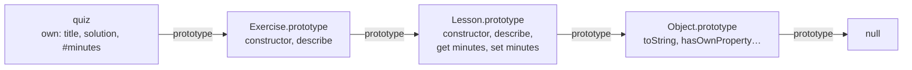

Code: the files [`examples/l04_*.js`](https://github.com/spareilleux/learn/tree/c65efe4fb76e61efd229793b296d3d7a44e71baf/code/javascript-for-csharp-java/examples), [`errors/l04_private_outside.js`](https://github.com/spareilleux/learn/blob/c65efe4fb76e61efd229793b296d3d7a44e71baf/code/javascript-for-csharp-java/errors/l04_private_outside.js), and the C# and Java sides in [`compare/l04_equality.cs`](https://github.com/spareilleux/learn/blob/c65efe4fb76e61efd229793b296d3d7a44e71baf/code/javascript-for-csharp-java/compare/l04_equality.cs) and [`compare/L04Equality.java`](https://github.com/spareilleux/learn/blob/c65efe4fb76e61efd229793b296d3d7a44e71baf/code/javascript-for-csharp-java/compare/L04Equality.java).

## Objects are property bags

```js
// examples/l04_objects.js
import { show } from './show.js';

const page = { title: 'Mission', order: 0 };
page.locale = 'en'; // add
delete page.order; // remove
show('page', page);
show('page.author', page.author);
show("'title' in page", 'title' in page);
show("Object.hasOwn(page, 'title')", Object.hasOwn(page, 'title'));

// Property names are strings (or symbols): other keys are converted
const grid = {};
grid[1] = 'one';
grid['1'] = 'one, again';
grid[{ x: 1 }] = 'an object';
grid[{ y: 2 }] = 'another object';
show('grid', grid);

// Order: integer-like keys first, in ascending order, then the others in insertion order
const lessons = { journal: 99, 10: 'ten', index: 0, 2: 'two' };
show('Object.keys(lessons)', Object.keys(lessons));

// Shorthand properties, computed names and methods
const field = 'draft';
const title = 'Values and types';
const lesson = {
  title,
  [field]: true,
  describe() {
    return `${this.title} (${this.draft ? 'draft' : 'published'})`;
  },
};
show('lesson.describe()', lesson.describe());
show('Object.entries(lesson)', Object.entries(lesson));
```

```text
page                               { title: 'Mission', locale: 'en' }
page.author                        undefined
'title' in page                    true
Object.hasOwn(page, 'title')       true
grid                               { '1': 'one, again', '[object Object]': 'another object' }
Object.keys(lessons)               [ '2', '10', 'journal', 'index' ]
lesson.describe()                  'Values and types (draft)'
Object.entries(lesson)             [
  [ 'title', 'Values and types' ],
  [ 'draft', true ],
  [ 'describe', [Function: describe] ]
]
```

A C# or Java object has the fields its class declares, no more, no less. A JavaScript object is closer to a `Dictionary<string, object>`, or to C#'s [`ExpandoObject`](https://learn.microsoft.com/dotnet/api/system.dynamic.expandoobject): properties are added by assigning them, removed with `delete`, and a missing one reads as `undefined`. The literal `{ … }` needs no class, and is how most JavaScript code passes data around.

Two details of that dictionary surprise:

- **Keys are strings** (or [symbols](https://developer.mozilla.org/en-US/docs/Web/JavaScript/Reference/Global_Objects/Symbol)). `grid[1]` and `grid['1']` are the same property, and every object used as a key becomes the same string, `'[object Object]'`. Use a [`Map`](https://developer.mozilla.org/en-US/docs/Web/JavaScript/Reference/Global_Objects/Map) when keys aren't strings; lesson 5 compares it with `Dictionary` and `HashMap`.
- **The order isn't only insertion order.** Keys that look like array indexes come first, in ascending numeric order, then the other strings in the order they were added ([OrdinaryOwnPropertyKeys](https://tc39.es/ecma262/#sec-ordinaryownpropertykeys)). An object keyed by year or by identifier gets sorted.

## The prototype chain

```js
// examples/l04_prototypes.js
import { show } from './show.js';

const base = {
  kind: 'page',
  describe() {
    return `${this.title} is a ${this.kind}`;
  },
};
const mission = Object.create(base); // mission's prototype is base
mission.title = 'Mission';

show('mission.describe()', mission.describe());
show('Object.keys(mission)', Object.keys(mission));
show("Object.hasOwn(mission, 'kind')", Object.hasOwn(mission, 'kind'));
const { getPrototypeOf } = Object;
show('getPrototypeOf(mission) === base', getPrototypeOf(mission) === base);

// Reading walks up the chain; writing creates an own property that hides the prototype's
mission.kind = 'lesson';
show('mission.describe()', mission.describe());
show('base.kind', base.kind);

// A change to the prototype is seen by every object that inherits from it, even existing ones
const journal = Object.create(base);
journal.title = 'Journal';
base.describe = function () {
  return `${this.title}, ${this.kind}, changed at run time`;
};
show('journal.describe()', journal.describe());

// The end of the chain
show('getPrototypeOf(base)', getPrototypeOf(base));
show('getPrototypeOf(Object.prototype)', getPrototypeOf(Object.prototype));
const dictionary = Object.create(null);
show("'toString' in {}", 'toString' in {});
show("'toString' in dictionary", 'toString' in dictionary);
```

```text
mission.describe()                 'Mission is a page'
Object.keys(mission)               [ 'title' ]
Object.hasOwn(mission, 'kind')     false
getPrototypeOf(mission) === base   true
mission.describe()                 'Mission is a lesson'
base.kind                          'page'
journal.describe()                 'Journal, page, changed at run time'
getPrototypeOf(base)               [Object: null prototype] {}
getPrototypeOf(Object.prototype)   null
'toString' in {}                   true
'toString' in dictionary           false
```

Every object has a hidden link to another object, its **prototype**, or to `null`. Reading a property that the object doesn't have goes on to the prototype, then to the prototype's prototype, until it finds the property or reaches `null` ([OrdinaryGet](https://tc39.es/ecma262/#sec-ordinaryget)). `mission` has one own property, `title`, and finds `kind` and `describe` on `base`. When `describe` runs, `this` is still `mission`, by the implicit rule of [lesson 3](../03-functions-and-scope/#this), so the method reads `mission`'s title.

That lookup is JavaScript's inheritance, and it differs from a class hierarchy in three ways:

- **It links objects, not types.** Any object can serve as the prototype of another, with [`Object.create`](https://developer.mozilla.org/en-US/docs/Web/JavaScript/Reference/Global_Objects/Object/create).
- **Writing doesn't go up the chain.** `mission.kind = 'lesson'` creates an own property that hides the prototype's, and `base.kind` is unchanged.
- **It is live.** Replacing `base.describe` changes the method of every object that inherits from `base`, including objects created before the change. That is how old libraries added methods to built-in types, a practice now discouraged.

Plain objects inherit from `Object.prototype`, where `toString` and `hasOwnProperty` live; `in` sees them, `Object.hasOwn` doesn't. `Object.create(null)` makes an object with no prototype at all, a dictionary with no inherited keys.

## Classes

```js
// examples/l04_classes.js
import { attempt, show } from './show.js';

class Lesson {
  static count = 0;
  title; // public field: an own property of each instance
  #minutes = 0; // private field: unreachable outside the class body

  constructor(title, minutes) {
    this.title = title;
    this.minutes = minutes; // calls the setter
    Lesson.count++;
  }

  get minutes() {
    return this.#minutes;
  }

  set minutes(value) {
    if (!Number.isInteger(value) || value < 0) {
      throw new RangeError(`minutes must be a non-negative integer, got ${value}`);
    }
    this.#minutes = value;
  }

  describe() {
    return `${this.title} (${this.#minutes} min)`;
  }

  static isLesson(value) {
    return #minutes in value; // does value have this class's private field?
  }
}

class Exercise extends Lesson {
  constructor(title, minutes, solution) {
    super(title, minutes);
    this.solution = solution;
  }

  describe() {
    return `${super.describe()}, with a solution`;
  }
}

const values = new Lesson('Values and types', 25);
const quiz = new Exercise('Coercions', 10, 'details');
show('values.describe()', values.describe());
show('quiz.describe()', quiz.describe());
show('values', values);
show('Object.keys(quiz)', Object.keys(quiz));
show('Lesson.count', Lesson.count);
attempt("values.minutes = 'ten'", () => {
  values.minutes = 'ten';
});
show('values.minutes', values.minutes);

// Underneath: a function, and methods on its prototype
show('typeof Lesson', typeof Lesson);
show("Object.hasOwn(values, 'describe')", Object.hasOwn(values, 'describe'));
const proto = Lesson.prototype;
show('values.describe === proto.describe', values.describe === proto.describe);
show('quiz.describe === proto.describe', quiz.describe === proto.describe);
show('quiz instanceof Lesson', quiz instanceof Lesson);
attempt("Lesson('no new')", () => Lesson('no new'));

// Private fields are checked by the engine, not hidden by convention
show('Lesson.isLesson(quiz)', Lesson.isLesson(quiz));
show('Lesson.isLesson({ minutes: 5 })', Lesson.isLesson({ minutes: 5 }));
show("Object.hasOwn(values, '#minutes')", Object.hasOwn(values, '#minutes'));
show('JSON.stringify(values)', JSON.stringify(values));
attempt('proto.describe.call({ title })', () => proto.describe.call({ title: 'fake' }));
```

```text
values.describe()                  'Values and types (25 min)'
quiz.describe()                    'Coercions (10 min), with a solution'
values                             Lesson { title: 'Values and types' }
Object.keys(quiz)                  [ 'title', 'solution' ]
Lesson.count                       2
values.minutes = 'ten'             RangeError: minutes must be a non-negative integer, got ten
values.minutes                     25
typeof Lesson                      'function'
Object.hasOwn(values, 'describe')  false
values.describe === proto.describe true
quiz.describe === proto.describe   false
quiz instanceof Lesson             true
Lesson('no new')                   TypeError: Class constructor Lesson cannot be invoked without 'new'
Lesson.isLesson(quiz)              true
Lesson.isLesson({ minutes: 5 })    false
Object.hasOwn(values, '#minutes')  false
JSON.stringify(values)             '{"title":"Values and types"}'
proto.describe.call({ title })     TypeError: Cannot read private member #minutes from an object whose class did not declare it
```

The syntax reads like C# or Java, and most of it means the same thing:

| | C# | Java | JavaScript |
|---|---|---|---|
| Field | `public string Title;` | `public String title;` | `title;`, an own property of each instance |
| Private field | `private int minutes;` | `private int minutes;` | `#minutes`, checked by the engine |
| Property | `public int Minutes { get; set; }` | `getMinutes()`, `setMinutes()` | `get minutes()`, `set minutes(value)` |
| Static member | `static int Count;` | `static int count;` | `static count = 0;` |
| Inheritance | `class Exercise : Lesson` | `class Exercise extends Lesson` | `class Exercise extends Lesson`, one parent |
| Call the parent | `base.Describe()` | `super.describe()` | `super.describe()` |
| Several constructors | yes | yes | one `constructor` |
| Interfaces, abstract classes | yes | yes | no; an object fits if it has the methods called |

Underneath, `class` is a layer over the prototypes of the previous section ([ClassDefinitionEvaluation](https://tc39.es/ecma262/#sec-runtime-semantics-classdefinitionevaluation)). `Lesson` is a function, the constructor. Methods such as `describe` are stored once on `Lesson.prototype`, and every instance finds them through its prototype link, which is why `values` has no own `describe`. `extends` links `Exercise.prototype` to `Lesson.prototype`, so the chain of `quiz` is:



`quiz.describe` finds `Exercise.prototype.describe` first, and `super.describe()` continues one link up. `instanceof` walks the same chain, looking for `Lesson.prototype`. What a class adds over a hand-written prototype is mostly safety: calling it without `new` throws, its body is strict, and its methods aren't enumerable, so a `for…in` loop over an instance doesn't list them.

**Private fields** are the one feature with no prototype equivalent. A name that starts with `#` exists only inside the class body; code outside can't even mention it, and the module is rejected before it runs:

```js
// errors/l04_private_outside.js
class Lesson {
  #minutes = 25;
}
console.log('this line never runs');
console.log(new Lesson().#minutes);
```

```text
errors/l04_private_outside.js:6
console.log(new Lesson().#minutes);
                        ^

SyntaxError: Private field '#minutes' must be declared in an enclosing class

Node.js v24.21.0
```

Inside the class, reading `#minutes` on an object that doesn't have it throws a `TypeError`, as the last line of the output shows, and `#minutes in value` tests for it without throwing. Private fields aren't properties: `Object.hasOwn`, `Object.keys` and `JSON.stringify` don't see them. C#'s reflection can read a private field and Java's can with `setAccessible`; nothing in JavaScript can read a `#` field from outside. TypeScript's `private` keyword, by contrast, is checked only at compile time, and the next course shows what remains of it at run time.

**Accessors** run code on a property read or write, like C# properties: `this.minutes = minutes` in the constructor goes through the setter and its validation. And the fields of a class are created on each instance, which is why an arrow function in a field, as in the listener pattern of [lesson 3](../03-functions-and-scope/#in-guitaralchemistga-keeping-this-in-event-listeners), costs one function per object.

## Equality and copies

```js
// examples/l04_equality_copy.js
import { attempt, show } from './show.js';

const a = { x: 1, y: 2 };
const b = { x: 1, y: 2 };
show('a === b', a === b);
show('a === a', a === a);

// Map and Set use the same identity: two equal-looking keys are two keys
const visits = new Map();
visits.set({ x: 1, y: 2 }, 'first');
visits.set({ x: 1, y: 2 }, 'second');
show('visits.size', visits.size);
show('visits.get({ x: 1, y: 2 })', visits.get({ x: 1, y: 2 }));
const byKey = new Map([[`${a.x},${a.y}`, 'first']]);
show("byKey.get('1,2')", byKey.get('1,2'));

// Spread and Object.assign copy one level
const course = { title: 'JavaScript', tags: ['node'], created: new Date(Date.UTC(2026, 8, 14)) };
const shallow = { ...course };
shallow.title = 'TypeScript';
shallow.tags.push('typescript');
show('course.title', course.title);
show('course.tags', course.tags);

// structuredClone copies the whole graph: Map, Set, Date, cycles
const deep = structuredClone(course);
deep.tags.push('react');
show('course.tags', course.tags);
show('deep.created instanceof Date', deep.created instanceof Date);

// but not functions, and not the prototype of a class instance
class Point {
  constructor(x, y) {
    this.x = x;
    this.y = y;
  }
  length() {
    return Math.hypot(this.x, this.y);
  }
}
const cloned = structuredClone(new Point(3, 4));
show('cloned', cloned);
show('cloned instanceof Point', cloned instanceof Point);
attempt('structuredClone({ f() {} })', () => structuredClone({ f() {} }));

// JSON.parse(JSON.stringify(...)) loses more
const viaJson = JSON.parse(JSON.stringify({ ...course, draft: undefined }));
show('viaJson', viaJson);

// Object.freeze is shallow too
const frozen = Object.freeze({ tags: ['node'] });
frozen.tags.push('still mutable');
show('frozen.tags', frozen.tags);
```

```text
a === b                            false
a === a                            true
visits.size                        2
visits.get({ x: 1, y: 2 })         undefined
byKey.get('1,2')                   'first'
course.title                       'JavaScript'
course.tags                        [ 'node', 'typescript' ]
course.tags                        [ 'node', 'typescript' ]
deep.created instanceof Date       true
cloned                             { x: 3, y: 4 }
cloned instanceof Point            false
structuredClone({ f() {} })        DataCloneError: f() {} could not be cloned.
viaJson                            {
  title: 'JavaScript',
  tags: [ 'node', 'typescript' ],
  created: '2026-09-14T00:00:00.000Z'
}
frozen.tags                        [ 'node', 'still mutable' ]
```

C# records and Java records compare by value, and a `Dictionary` or a `HashMap` uses that equality for its keys:

```text
> dotnet run l04_equality.cs
a == b (record):        True
ReferenceEquals(a, b):  False
visits.Count:           1
c == d (class):         False
a with { Y = 5 }:       Point { X = 1, Y = 5 }
```

```text
> java L04Equality.java
a == b:                 false
a.equals(b):            true
visits.size():          1
```

JavaScript has no records, no `Equals` or `equals` to override, and no operator overloading. `===` on two objects asks whether they are the same object, like `ReferenceEquals`, and [`Map`](https://developer.mozilla.org/en-US/docs/Web/JavaScript/Reference/Global_Objects/Map) and [`Set`](https://developer.mozilla.org/en-US/docs/Web/JavaScript/Reference/Global_Objects/Set) use the same identity ([SameValueZero](https://tc39.es/ecma262/#sec-samevaluezero)): two points with the same coordinates are two keys, and a new `{ x: 1, y: 2 }` finds neither. To key a map by value, build a string or a number from the values, as `byKey` does. Comparing two objects field by field is exercise 1.

Copies need the same care, because nothing copies implicitly:

- **Spread** `{ ...course }` and [`Object.assign`](https://developer.mozilla.org/en-US/docs/Web/JavaScript/Reference/Global_Objects/Object/assign) copy the own properties, one level deep: `shallow.tags` is the same array as `course.tags`. That is what C#'s `with` does too, on a record.
- **[`structuredClone`](https://developer.mozilla.org/en-US/docs/Web/API/Window/structuredClone)**, defined by the [HTML standard](https://html.spec.whatwg.org/multipage/structured-data.html#dom-structuredclone) and available in Node.js, copies the whole graph, including dates, maps, sets and cycles. It refuses functions, with a `DataCloneError`, and it doesn't keep prototypes: the clone of a `Point` is a plain object with no `length` method.
- **`JSON.parse(JSON.stringify(…))`**, the old trick, loses more: `undefined` properties disappear, dates become strings, and a `bigint` throws.
- **`Object.freeze`** is shallow for the same reason: it freezes one object, not the ones it points to.

## In GuitarAlchemist/ga: merging saved preferences

[`SceneOptions.tsx`](https://github.com/GuitarAlchemist/ga/blob/a826864f3a012cad88e415954bf57eca0ce12aa6/ReactComponents/ga-react-components/src/components/PrimeRadiant/SceneOptions.tsx#L57-L80) builds the options of a 3D scene: default values, then parameters of the URL such as `?tower` that turn options on ([lines 62-73](https://github.com/GuitarAlchemist/ga/blob/a826864f3a012cad88e415954bf57eca0ce12aa6/ReactComponents/ga-react-components/src/components/PrimeRadiant/SceneOptions.tsx#L62-L73)), then the preferences saved in `localStorage`, merged with one line ([line 77](https://github.com/GuitarAlchemist/ga/blob/a826864f3a012cad88e415954bf57eca0ce12aa6/ReactComponents/ga-react-components/src/components/PrimeRadiant/SceneOptions.tsx#L77)):

```ts
if (saved) Object.assign(state, JSON.parse(saved));
```

Each toggle saves the whole state ([line 94](https://github.com/GuitarAlchemist/ga/blob/a826864f3a012cad88e415954bf57eca0ce12aa6/ReactComponents/ga-react-components/src/components/PrimeRadiant/SceneOptions.tsx#L94)). Reduced to three options, in plain JavaScript:

```js
// examples/l04_ga_assign.js
import { show } from './show.js';

function getDefaults(search, saved) {
  const state = { stars: true, tower: false, skyboxMode: 'milky-way' };
  // Lines 62-73: URL parameters override the defaults
  const params = new URLSearchParams(search);
  if (params.has('tower')) state.tower = true;
  // Lines 75-78: then the preferences saved in localStorage are merged in
  if (saved) Object.assign(state, JSON.parse(saved));
  return state;
}

// Every toggle saves the whole state (lines 94, 103 and 112), so a saved state has every key
const saved = JSON.stringify({ stars: false, tower: false, skyboxMode: 'milky-way' });
show("getDefaults('?tower', null)", getDefaults('?tower', null));
show("getDefaults('?tower', saved)", getDefaults('?tower', saved));

// Object.assign copies every own property of the source, known or not
show('with an old key', getDefaults('', '{"bloomLevel":3,"stars":"yes"}'));

// JSON.parse makes __proto__ an ordinary property; Object.assign then assigns it, which changes the prototype
const parsed = JSON.parse('{"__proto__":{"isAdmin":true}}');
show("Object.hasOwn(parsed, '__proto__')", Object.hasOwn(parsed, '__proto__'));
const state = getDefaults('', '{"__proto__":{"isAdmin":true}}');
show('state.isAdmin', state.isAdmin);
show("Object.hasOwn(state, 'isAdmin')", Object.hasOwn(state, 'isAdmin'));
show('{}.isAdmin', {}.isAdmin);

// Spread defines properties instead of assigning them: the prototype stays Object.prototype
const spread = { ...parsed };
show('spread.isAdmin', spread.isAdmin);
show('Object.keys(spread)', Object.keys(spread));
```

```text
getDefaults('?tower', null)        { stars: true, tower: true, skyboxMode: 'milky-way' }
getDefaults('?tower', saved)       { stars: false, tower: false, skyboxMode: 'milky-way' }
with an old key                    { stars: 'yes', tower: false, skyboxMode: 'milky-way', bloomLevel: 3 }
Object.hasOwn(parsed, '__proto__') true
state.isAdmin                      true
Object.hasOwn(state, 'isAdmin')    false
{}.isAdmin                         undefined
spread.isAdmin                     undefined
Object.keys(spread)                [ '__proto__' ]
```

Three things happen, from the most visible to the most obscure:

1. **The URL loses to the saved state.** `Object.assign` copies its sources in order, so the last one wins, and the saved state comes last. As soon as a user has toggled one option, the saved state contains every key, and `?tower` no longer turns the tower on. The comment above the URL block calls those parameters "overrides"; merging them after the saved preferences would make them override.
2. **Whatever is saved is copied, known or not.** An option renamed in a later version stays in `localStorage` and comes back as `bloomLevel`, and a value of the wrong type, `stars: 'yes'`, replaces a boolean. TypeScript's `SceneOptionsState` type doesn't check what `JSON.parse` returns, since the types are gone at run time.
3. **A `__proto__` key changes the prototype.** [`JSON.parse`](https://tc39.es/ecma262/#sec-json.parse) creates an ordinary own property named `__proto__`. `Object.assign` then *assigns* it to the target, and assigning `__proto__` calls the [`Object.prototype.__proto__` setter](https://tc39.es/ecma262/#sec-object.prototype.__proto__), which replaces the target's prototype: `state.isAdmin` is `true` without being an own property. Only that object is affected, `{}.isAdmin` stays `undefined`, and in GA the data comes from the user's own browser, so this is a curiosity rather than a hole. The same pattern applied to data from a request is a known vulnerability class, [prototype pollution](https://developer.mozilla.org/en-US/docs/Web/Security/Attacks/Prototype_pollution). Spread doesn't assign, it [defines properties](https://tc39.es/ecma262/#sec-copydataproperties), and keeps `__proto__` as a plain key.

Exercise 3 rewrites the function.

## Key takeaways

- An object is a set of string keys that can change at run time; a missing property reads as `undefined`; integer-like keys are listed first.
- Reading a property walks the prototype chain; writing creates an own property. Prototypes link objects, and changes to them are live.
- `class` builds a constructor function and a prototype: methods are shared on the prototype, fields are created on each instance.
- `#private` fields are enforced by the engine, and invisible to `Object.keys` and `JSON.stringify`.
- `===`, `Map` and `Set` compare objects by identity; there are no records and no `Equals` to override.
- Spread and `Object.assign` copy one level; `structuredClone` copies deeply but drops prototypes and refuses functions.
- `Object.assign` lets the last source win and copies every key, `__proto__` included.

## Exercises

1. Write `deepEqual(a, b)`, true when two values are identical, or are objects with the same prototype and the same own keys holding deeply equal values. What does it answer for two different dates, and why?

<details>
<summary>Solution</summary>

[`solutions/l04_ex1_deep_equal.js`](https://github.com/spareilleux/learn/blob/c65efe4fb76e61efd229793b296d3d7a44e71baf/code/javascript-for-csharp-java/solutions/l04_ex1_deep_equal.js):

```js
function deepEqual(a, b) {
  if (Object.is(a, b)) return true;
  if (typeof a !== 'object' || typeof b !== 'object' || a === null || b === null) return false;
  if (Object.getPrototypeOf(a) !== Object.getPrototypeOf(b)) return false;
  const keys = Object.keys(a);
  if (keys.length !== Object.keys(b).length) return false;
  return keys.every((key) => Object.hasOwn(b, key) && deepEqual(a[key], b[key]));
}

console.log(deepEqual({ x: 1, tags: ['a'] }, { tags: ['a'], x: 1 }));
console.log(deepEqual({ x: 1 }, { x: 1, y: undefined }));
console.log(deepEqual([1, 2], { 0: 1, 1: 2 }));
console.log(deepEqual(NaN, NaN), deepEqual(0, -0));
console.log(deepEqual(new Date(0), new Date(1)));
```

```text
true
false
false
true false
true
```

`Object.is` handles the primitives, and says `NaN` equals `NaN` but `0` differs from `-0`. The prototype check tells an array from an object with the same keys. The last line is wrong on purpose: a date keeps its time in an internal slot, not in a property, so two dates have no own keys and look equal. A general deep equality must know each built-in type; Node.js's [`assert.deepStrictEqual`](https://nodejs.org/docs/latest-v24.x/api/assert.html#assertdeepstrictequalactual-expected-message) does, and lesson 9 uses it in tests.

</details>

2. Write a class `Temperature` that stores degrees Celsius in a private field, exposes a `fahrenheit` getter and setter, has a static factory `fromFahrenheit`, and serializes to `{"celsius": …}` with `JSON.stringify`.

<details>
<summary>Solution</summary>

[`solutions/l04_ex2_temperature.js`](https://github.com/spareilleux/learn/blob/c65efe4fb76e61efd229793b296d3d7a44e71baf/code/javascript-for-csharp-java/solutions/l04_ex2_temperature.js):

```js
class Temperature {
  #celsius;

  constructor(celsius) {
    this.#celsius = celsius;
  }

  static fromFahrenheit(fahrenheit) {
    return new Temperature(((fahrenheit - 32) * 5) / 9);
  }

  get fahrenheit() {
    return (this.#celsius * 9) / 5 + 32;
  }

  set fahrenheit(value) {
    this.#celsius = ((value - 32) * 5) / 9;
  }

  toJSON() {
    return { celsius: this.#celsius };
  }
}

const room = new Temperature(20);
console.log(room.fahrenheit);
room.fahrenheit = 212;
console.log(JSON.stringify(room));
console.log(JSON.stringify(Temperature.fromFahrenheit(32)));
console.log(Object.keys(room), room);
```

```text
68
{"celsius":100}
{"celsius":0}
[] Temperature {}
```

Without `toJSON`, `JSON.stringify(room)` would print `{}`, since a private field isn't a property; [`toJSON`](https://developer.mozilla.org/en-US/docs/Web/JavaScript/Reference/Global_Objects/JSON/stringify#tojson_behavior) plays the role of a custom converter in `System.Text.Json` or Jackson. The last line shows the same invisibility: no keys, and Node.js's display shows an empty `Temperature`.

</details>

3. Rewrite `getDefaults` from the GA example so that the URL parameters win over the saved preferences, saved keys that aren't options are ignored, a saved value replaces a default only if it has the same type, and `__proto__` can't change anything.

<details>
<summary>Solution</summary>

[`solutions/l04_ex3_merge.js`](https://github.com/spareilleux/learn/blob/c65efe4fb76e61efd229793b296d3d7a44e71baf/code/javascript-for-csharp-java/solutions/l04_ex3_merge.js):

```js
function getDefaults(search, saved) {
  const state = { stars: true, tower: false, skyboxMode: 'milky-way' };
  const preferences = saved ? JSON.parse(saved) : {};
  for (const key of Object.keys(state)) {
    // Object.keys(state) lists the known keys: __proto__ and old keys are never read
    if (Object.hasOwn(preferences, key) && typeof preferences[key] === typeof state[key]) {
      state[key] = preferences[key];
    }
  }
  const params = new URLSearchParams(search);
  if (params.has('tower')) state.tower = true; // last, so the URL wins
  return state;
}

const saved = JSON.stringify({ stars: false, tower: false, skyboxMode: 'milky-way' });
console.log(getDefaults('?tower', saved));
console.log(getDefaults('', '{"bloomLevel":3,"stars":"yes","__proto__":{"isAdmin":true}}'));
console.log(getDefaults('', '{"__proto__":{"isAdmin":true}}').isAdmin);
```

```text
{ stars: false, tower: true, skyboxMode: 'milky-way' }
{ stars: true, tower: false, skyboxMode: 'milky-way' }
undefined
```

The loop turns the question around: instead of copying whatever the saved object contains, it asks the saved object for each key the state knows. The `typeof` test is a minimal validation; a value such as `skyboxMode` would also need to be one of the allowed strings, which is where a schema library, or the static types and runtime checks of the TypeScript course, come in.

</details>

## Sources

- [ECMAScript — Ordinary object internal methods](https://tc39.es/ecma262/#sec-ordinary-object-internal-methods-and-internal-slots), [OrdinaryOwnPropertyKeys](https://tc39.es/ecma262/#sec-ordinaryownpropertykeys), [ClassDefinitionEvaluation](https://tc39.es/ecma262/#sec-runtime-semantics-classdefinitionevaluation), [Object.assign](https://tc39.es/ecma262/#sec-object.assign), [CopyDataProperties](https://tc39.es/ecma262/#sec-copydataproperties), [Object.prototype.\_\_proto\_\_](https://tc39.es/ecma262/#sec-object.prototype.__proto__)
- [MDN — Inheritance and the prototype chain](https://developer.mozilla.org/en-US/docs/Web/JavaScript/Guide/Inheritance_and_the_prototype_chain), [Classes](https://developer.mozilla.org/en-US/docs/Web/JavaScript/Reference/Classes), [Private elements](https://developer.mozilla.org/en-US/docs/Web/JavaScript/Reference/Classes/Private_elements), [structuredClone](https://developer.mozilla.org/en-US/docs/Web/API/Window/structuredClone)
- [HTML Standard — Structured serialize and deserialize](https://html.spec.whatwg.org/multipage/structured-data.html#dom-structuredclone)
- [Microsoft — Records](https://learn.microsoft.com/dotnet/csharp/fundamentals/types/records), [Java — Record classes](https://docs.oracle.com/en/java/javase/25/language/records.html)
