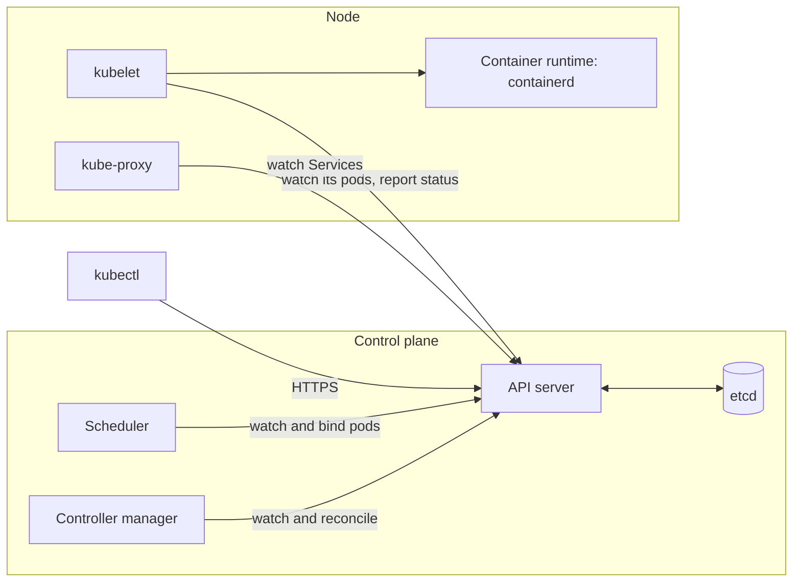

import { Tabs, TabItem } from '@astrojs/starlight/components';

Full code: [`code/kubernetes`](https://github.com/spareilleux/learn/tree/main/code/kubernetes). The cluster configuration is [`kind/cluster.yaml`](https://github.com/spareilleux/learn/blob/main/code/kubernetes/kind/cluster.yaml), and this lesson's commands are in [`l01/run.sh`](https://github.com/spareilleux/learn/blob/main/code/kubernetes/l01/run.sh). [`check.sh`](https://github.com/spareilleux/learn/blob/main/code/kubernetes/check.sh) runs them against a real cluster and compares their outputs with the files in [`expected`](https://github.com/spareilleux/learn/tree/main/code/kubernetes/expected), after replacing ages, generated names and IP addresses with placeholders.

## From `docker run` to a desired state

In the [WSL containers course](../../wsl-containers/04-build-an-image/), you built an image and ran it with one command. That command did something right away: it started a container. If the container crashed, nothing brought it back; if the machine rebooted, nothing started it again; to run three copies, you ran the command three times.

Kubernetes works the other way round. You don't tell it what to do; you describe what should exist ("three copies of this image, reachable under this name"), store that description in the cluster, and a set of programs keeps comparing it with what actually runs and fixing the difference. A C# developer has written this loop before, as a `BackgroundService` that wakes up, reads the expected state from a database, looks at reality, and acts on the gap. Kubernetes is dozens of such loops, called **controllers**, sharing one database.

| You know | In Kubernetes |
|---|---|
| `docker run` an image | a **Pod**: one or more containers scheduled together (lesson 2) |
| running the command three times, and restarting by hand | a **Deployment**: a desired number of identical pods, kept alive and updated (lesson 3) |
| `-p 8080:8080` and a host name | a **Service**: a stable name and address in front of changing pods (lesson 4) |
| `docker compose up` with a YAML file | `kubectl apply -f` with YAML manifests |
| a `BackgroundService` loop that converges on a target | a controller |
| `appsettings.json` and environment variables | ConfigMaps and Secrets (lesson 5) |

## The architecture

A cluster has a **control plane**, which stores and decides, and **nodes**, which run the containers. Nothing on a node talks to the database directly: every component, `kubectl` included, goes through the API server.



- The [**API server**](https://kubernetes.io/docs/concepts/architecture/#kube-apiserver) (`kube-apiserver`) is a REST API over HTTPS. It authenticates the caller, validates each object, stores it, and lets other components **watch** changes instead of polling.
- [**etcd**](https://etcd.io/) is the key-value store behind it: the only place where the cluster's state is kept.
- The [**scheduler**](https://kubernetes.io/docs/concepts/scheduling-eviction/kube-scheduler/) watches for pods without a node, picks one, and records the choice. It starts nothing itself.
- The [**controller manager**](https://kubernetes.io/docs/concepts/architecture/#kube-controller-manager) runs the built-in controllers: the ReplicaSet controller creates or deletes pods until their number matches, the Deployment controller manages ReplicaSets, and so on.
- On each node, the [**kubelet**](https://kubernetes.io/docs/concepts/architecture/#kubelet) watches for the pods assigned to its node, asks the container runtime ([containerd](https://containerd.io/) here) to start their containers, runs their probes, and reports their status.
- [**kube-proxy**](https://kubernetes.io/docs/concepts/architecture/#kube-proxy) turns Services into network rules on each node.

The loop is short enough to read. The ReplicaSet controller's [`manageReplicas`](https://github.com/kubernetes/kubernetes/blob/f54c212e3a2f75d674b717a9b29052b20b60aefc/pkg/controller/replicaset/replica_set.go#L649-L700) computes `diff := len(activePods) - int(*(rs.Spec.Replicas))`, creates pods when the difference is negative and deletes some when it is positive. It doesn't know why pods are missing: a crash, a deleted pod and a new ReplicaSet all look the same. That is what makes the model robust, and it is also why "I deleted the pod and it came back" surprises newcomers.

## Choosing a local cluster

Four tools run a cluster on a developer machine. They all give you a real API server; they differ in how they create nodes.

| Tool | Nodes are | Version checked on 2026-09-15 | Good for |
|---|---|---|---|
| [kind](https://kind.sigs.k8s.io/) | Docker or Podman containers | v0.33.0, Kubernetes 1.37.0 by default | CI and tests: the Kubernetes project tests itself with it; several nodes on one machine |
| [k3d](https://k3d.io/) | containers running [k3s](https://k3s.io/), a lighter distribution | v5.9.0 | small footprint, with a built-in load balancer and Traefik |
| [minikube](https://minikube.sigs.k8s.io/) | a VM or a container | v1.39.0, Kubernetes 1.37.0 by default | add-ons (dashboard, ingress, metrics) enabled with one command |
| [Docker Desktop](https://docs.docker.com/desktop/features/kubernetes/) | kubeadm, or kind since the newer provisioner | depends on the Docker Desktop release | a cluster from a checkbox, if you already use Docker Desktop |

This course uses **kind**: it is small, scriptable, identical on the three operating systems, and runs in GitHub Actions. Everything it teaches applies to the other three, and to managed clusters (lesson 15), except where a lesson says otherwise.

kind needs Docker (Docker Desktop on Windows and macOS, Docker Engine or Docker Desktop on Linux) or Podman. The `wslc` tool of the WSL containers course is not one of its providers.

## Installing kind and kubectl

`kubectl` is the command-line client. Its version should be within one minor version of the cluster's; here both are 1.37.0. The commands below download the pinned releases, as in the [kind quick start](https://kind.sigs.k8s.io/docs/user/quick-start/#installing-from-release-binaries) and the [kubectl install pages](https://kubernetes.io/docs/tasks/tools/).

<Tabs syncKey="os">
<TabItem label="Windows">

```powershell
mkdir $HOME\bin -Force
curl.exe -Lo $HOME\bin\kind.exe https://kind.sigs.k8s.io/dl/v0.33.0/kind-windows-amd64
curl.exe -Lo $HOME\bin\kubectl.exe https://dl.k8s.io/release/v1.37.0/bin/windows/amd64/kubectl.exe
# Add $HOME\bin to the user's PATH, then open a new terminal
[Environment]::SetEnvironmentVariable('Path', "$([Environment]::GetEnvironmentVariable('Path','User'));$HOME\bin", 'User')
```

</TabItem>
<TabItem label="Linux / WSL">

```bash
curl -Lo ./kind https://kind.sigs.k8s.io/dl/v0.33.0/kind-linux-amd64
curl -LO https://dl.k8s.io/release/v1.37.0/bin/linux/amd64/kubectl
chmod +x ./kind ./kubectl
sudo mv ./kind ./kubectl /usr/local/bin/
```

</TabItem>
<TabItem label="macOS">

```bash
# Apple silicon; use darwin-amd64 on an Intel Mac
curl -Lo ./kind https://kind.sigs.k8s.io/dl/v0.33.0/kind-darwin-arm64
curl -LO https://dl.k8s.io/release/v1.37.0/bin/darwin/arm64/kubectl
chmod +x ./kind ./kubectl
sudo mv ./kind ./kubectl /usr/local/bin/
```

</TabItem>
</Tabs>

Each release also publishes a SHA-256 checksum next to the binary ([kind](https://github.com/kubernetes-sigs/kind/releases/tag/v0.33.0), `kubectl.exe.sha256` or `kubectl.sha256` for kubectl): compare it with `Get-FileHash` or `sha256sum` before trusting a download. The Windows downloads were run on Windows 11, and the `PATH` line is *to verify*: the author's machine already had its tools on the path. The Linux commands follow the same pages and the course's CI runs their equivalent on Linux; the macOS tab is *to verify*.

```text
> kind version
kind v0.33.0 go1.26.7 windows/amd64
> kubectl version --client
Client Version: v1.37.0
Kustomize Version: v5.8.1
```

## Creating the cluster

A kind configuration file names the cluster, lists its nodes, and pins the node image by digest, so that everyone runs the same Kubernetes:

```yaml
# The course's cluster: one node, pinned to Kubernetes v1.37.0.
# kind create cluster --config kind/cluster.yaml
kind: Cluster
apiVersion: kind.x-k8s.io/v1alpha4
name: learn-k8s
nodes:
  - role: control-plane
    image: kindest/node:v1.37.0@sha256:a1ed56cfb0e7b93589bdf97c8cd566405a265939e3620fc4f5de89adff580ae5
    # Lesson 4: a NodePort service on 30080 answers on http://localhost:30080
    extraPortMappings:
      - containerPort: 30080
        hostPort: 30080
        listenAddress: 127.0.0.1
```

The digest is the one kind v0.33.0 uses by default, declared in its [`defaults/image.go`](https://github.com/kubernetes-sigs/kind/blob/407a9675e6d9af1200b5f57f9ca52ec6cdacce74/pkg/apis/config/defaults/image.go#L20-L21). One node is both the control plane and the only worker: enough for lessons 1 to 7, and light on a laptop.

```text
> kind create cluster --config kind/cluster.yaml
Creating cluster "learn-k8s" ...
 ✓ Ensuring node image (kindest/node:v1.37.0) 🖼️
 ✓ Preparing nodes 📦
 ✓ Writing configuration 📜
 ✓ Starting control-plane 🕹️
 ✓ Installing CNI 🔌
 ✓ Installing StorageClass 💾
Set kubectl context to "kind-learn-k8s"
You can now use your cluster with:

kubectl cluster-info --context kind-learn-k8s
```

In a terminal, each step first shows a spinner, and kind ends with a link to its documentation; the lines above are the final state. It took 58 seconds on the author's machine, with the node image already downloaded. The "node" is a Docker container named `learn-k8s-control-plane`, running systemd, containerd, the kubelet, and the control plane as containers inside it.

:::caution[Your other clusters]
`kind create cluster` adds a context to your kubeconfig (`~/.kube/config` by default) and makes it the current one. If you also use a work cluster, a later `kubectl delete` would go to whichever context is current. To keep kind apart, point the `KUBECONFIG` environment variable at a separate file before creating the cluster, or check `kubectl config current-context` before any destructive command.
:::

## Looking around

```text
> kubectl version
Client Version: v1.37.0
Kustomize Version: v5.8.1
Server Version: v1.37.0
> kubectl get nodes
NAME                      STATUS   ROLES           AGE   VERSION
learn-k8s-control-plane   Ready    control-plane   11m   v1.37.0
```

The control plane described above is right there, as pods in the `kube-system` namespace:

```text
> kubectl get pods -n kube-system
NAME                                              READY   STATUS    RESTARTS   AGE
coredns-559f6c778d-jlzvq                          1/1     Running   0          11m
coredns-559f6c778d-nvpd5                          1/1     Running   0          11m
etcd-learn-k8s-control-plane                      1/1     Running   0          11m
kindnet-8bcfl                                     1/1     Running   0          11m
kube-apiserver-learn-k8s-control-plane            1/1     Running   0          11m
kube-controller-manager-learn-k8s-control-plane   1/1     Running   0          11m
kube-proxy-kxrkk                                  1/1     Running   0          11m
kube-scheduler-learn-k8s-control-plane            1/1     Running   0          11m
```

- `etcd`, `kube-apiserver`, `kube-controller-manager` and `kube-scheduler` end with the node's name: they are [**static pods**](https://kubernetes.io/docs/tasks/configure-pod-container/static-pod/), which the kubelet starts from files on the node before any API server exists. The API server then shows a read-only copy of each.
- `coredns-559f6c778d-…` has two parts after its name: `559f6c778d` identifies the ReplicaSet (a hash of the pod template), and the last five characters are random. [CoreDNS](https://coredns.io/) answers the cluster's DNS queries (lesson 4).
- `kindnet` is kind's network plugin (the "CNI" of the creation log), and `kube-proxy` runs once per node: both have a single random suffix because a DaemonSet creates them (lesson 7).

The static pod files are on the node, which is a container, so `docker exec` can list them:

```text
> docker exec learn-k8s-control-plane ls /etc/kubernetes/manifests
etcd.yaml
kube-apiserver.yaml
kube-controller-manager.yaml
kube-scheduler.yaml
```

## kubectl talks HTTPS

`kubectl` is an HTTP client with good manners. Raise its verbosity and each request appears:

```text
> kubectl get nodes -v=6
I0915 00:17:57.387396   70612 round_trippers.go:632] "Response" verb="GET" url="https://127.0.0.1:55531/api/v1/nodes?limit=500" status="200 OK" milliseconds=6
NAME                      STATUS   ROLES           AGE    VERSION
learn-k8s-control-plane   Ready    control-plane   116s   v1.37.0
```

The lines before it, omitted here, say which kubeconfig file was loaded and list the client's feature gates.

The address, the certificates and the user come from the **kubeconfig** file. A **context** ties a cluster, a user and a default namespace together under one name:

```text
> kubectl config get-contexts
CURRENT   NAME             CLUSTER          AUTHINFO         NAMESPACE
*         kind-learn-k8s   kind-learn-k8s   kind-learn-k8s
```

`kubectl config use-context <name>` switches, `--context <name>` targets another cluster for one command, and `-n <namespace>` another namespace. The port, 55531 here, is chosen by Docker when kind creates the node; `kind get kubeconfig --name learn-k8s` prints the file again if you lose it.

The API also documents itself. [`kubectl explain`](https://kubernetes.io/docs/reference/kubectl/generated/kubectl_explain/) reads the schema the server publishes, so it always matches the cluster's version:

```text
> kubectl explain pod.spec.restartPolicy
KIND:       Pod
VERSION:    v1

FIELD: restartPolicy <string>
ENUM:
    Always
    Never
    OnFailure

DESCRIPTION:
    Restart policy for all containers within the pod. One of Always, OnFailure,
    Never. In some contexts, only a subset of those values may be permitted.
    Default to Always. More info:
    https://kubernetes.io/docs/concepts/workloads/pods/pod-lifecycle/#restart-policy
    
    Possible enum values:
     - `"Always"`
     - `"Never"`
     - `"OnFailure"`
```

`kubectl api-resources` lists every kind of object, with its short name and API group. The `apps` group holds the workloads of the next lessons:

```text
> kubectl api-resources --api-group=apps
NAME                  SHORTNAMES   APIVERSION   NAMESPACED   KIND
controllerrevisions                apps/v1      true         ControllerRevision
daemonsets            ds           apps/v1      true         DaemonSet
deployments           deploy       apps/v1      true         Deployment
replicasets           rs           apps/v1      true         ReplicaSet
statefulsets          sts          apps/v1      true         StatefulSet
```

## A first desired state

[`l01/hello.yaml`](https://github.com/spareilleux/learn/blob/main/code/kubernetes/l01/hello.yaml) asks for two copies of the smallest image there is, [`pause`](https://github.com/kubernetes/kubernetes/tree/f54c212e3a2f75d674b717a9b29052b20b60aefc/build/pause), which does nothing and never exits. The node already has it, so nothing is downloaded.

```yaml
# Lesson 1: a desired state. Two copies of the smallest image there is: pause does nothing and never exits.
apiVersion: apps/v1
kind: Deployment
metadata:
  name: hello
spec:
  replicas: 2
  selector:
    matchLabels:
      app: hello
  template:
    metadata:
      labels:
        app: hello
    spec:
      containers:
        - name: pause
          image: registry.k8s.io/pause:3.10
```

Every manifest has the same four top-level fields: `apiVersion` and `kind` say what the object is, `metadata` names it, and `spec` is the desired state. The controllers add a fifth, `status`, with what they observe.

Before storing anything, the API server can validate a file. A typo in a field name, `replica:` instead of `replicas:` in [`l01/hello-invalid.yaml`](https://github.com/spareilleux/learn/blob/main/code/kubernetes/l01/hello-invalid.yaml), is rejected:

```text
> kubectl apply --dry-run=server -f l01/hello-invalid.yaml
Error from server (BadRequest): error when creating "l01/hello-invalid.yaml": Deployment in version "v1" cannot be handled as a Deployment: strict decoding error: unknown field "spec.replica"
> kubectl apply --dry-run=server -f l01/hello.yaml
deployment.apps/hello created (server dry run)
```

Without a cluster, [kubeconform](https://github.com/yannh/kubeconform) checks the same files against the published JSON schemas. The course's [`validate.sh`](https://github.com/spareilleux/learn/blob/main/code/kubernetes/validate.sh) runs it on every manifest, on Windows, Linux and macOS.

Each lesson works in its own **namespace**, a named partition of the cluster, so that deleting the namespace at the end removes everything the lesson created:

```text
> kubectl create namespace l01
namespace/l01 created
> kubectl apply -n l01 -f l01/hello.yaml
deployment.apps/hello created
> kubectl rollout status -n l01 deployment/hello
deployment "hello" successfully rolled out
> kubectl get -n l01 rs,pods -l app=hello
NAME                               DESIRED   CURRENT   READY   AGE
replicaset.apps/hello-6f8b555b4b   2         2         2       1s

NAME                         READY   STATUS    RESTARTS   AGE
pod/hello-6f8b555b4b-6q7s9   1/1     Running   0          1s
pod/hello-6f8b555b4b-fv257   1/1     Running   0          1s
```

`kubectl rollout status` waits until the pods are ready; before its last line, it prints a varying number of `Waiting for deployment…` lines, left out here and in the rest of the course when they add nothing. One file created three kinds of objects: the Deployment, a ReplicaSet it created, and two pods the ReplicaSet created. `-l app=hello` selects them by label, the same way the ReplicaSet finds "its" pods.

### Changing the desired state

[`l01/hello-3-replicas.yaml`](https://github.com/spareilleux/learn/blob/main/code/kubernetes/l01/hello-3-replicas.yaml) differs by one line. `kubectl diff` sends it to the server, which computes what would change without storing it:

```text
> kubectl diff -n l01 -f l01/hello-3-replicas.yaml
...
-  generation: 1
+  generation: 2
...
-  replicas: 2
+  replicas: 3
```

(The real output is a unified diff between two temporary directories; the lines above are its changes.) `generation` counts the changes to `spec`: the controllers compare it with the generation they last acted on, which is how `kubectl rollout status` knows whether a change has been handled.

### Deleting what is desired

Delete both pods, and the ReplicaSet controller sees two pods missing:

```text
> kubectl delete pods -n l01 -l app=hello
pod "hello-6f8b555b4b-6q7s9" deleted from l01 namespace
pod "hello-6f8b555b4b-fv257" deleted from l01 namespace
> kubectl rollout status -n l01 deployment/hello
deployment "hello" successfully rolled out
> kubectl get events -n l01 --field-selector involvedObject.kind=ReplicaSet -o custom-columns=REASON:.reason,MESSAGE:.message
REASON             MESSAGE
SuccessfulCreate   Created pod: hello-6f8b555b4b-6q7s9
SuccessfulCreate   Created pod: hello-6f8b555b4b-fv257
SuccessfulCreate   Created pod: hello-6f8b555b4b-xlnl4
SuccessfulCreate   Created pod: hello-6f8b555b4b-wtgnm
```

Two new pods, with new names, created within a second. The events are the controller's log: the first two lines date from the `apply`, the last two from its reaction to the deletion. To remove the pods for good, you change the desired state: delete the Deployment, or the whole namespace.

```text
> kubectl delete namespace l01
namespace "l01" deleted
```

## Cleaning up

A kind cluster keeps running, and using memory, until you delete it. Its images stay cached by Docker, so the next `kind create cluster` is faster:

```bash
kind delete cluster --name learn-k8s
```

## Key takeaways

- A Kubernetes cluster stores desired states in etcd, behind an API server that every component talks to; controllers and kubelets watch those states and converge on them.
- The scheduler only chooses a node, the kubelet starts containers, and the ReplicaSet controller counts pods: each one does a small job in a loop.
- kind runs each node as a Docker container. It is a real cluster, pinned by node image digest, and the same on Windows, Linux and macOS.
- `kubectl` is an HTTPS client configured by a kubeconfig; check the current context before destructive commands.
- `kubectl explain`, `api-resources` and `--dry-run=server` ask the cluster itself, so their answers match its version.
- Deleting a pod that a controller manages starts a replacement; you change what exists by changing the desired state.

## Exercises

**1.** Scale `hello` to four replicas with `kubectl scale -n l01 deployment/hello --replicas=4`, check the result, then run `kubectl apply -n l01 -f l01/hello.yaml` again. How many replicas are left, and why?

<details>
<summary>Solution</summary>

```text
> kubectl scale -n l01 deployment/hello --replicas=4
deployment.apps/hello scaled
> kubectl get -n l01 deployment hello
NAME    READY   UP-TO-DATE   AVAILABLE   AGE
hello   4/4     4            4           4s
> kubectl apply -n l01 -f l01/hello.yaml
deployment.apps/hello configured
> kubectl get -n l01 deployment hello
NAME    READY   UP-TO-DATE   AVAILABLE   AGE
hello   2/2     2            2           5s
```

Two. `kubectl scale` changed the stored desired state to 4, but the file still says 2, and `apply` makes the stored object match the file. An imperative change lasts until the next `apply`: in a team that applies manifests from Git, the file is the truth (lesson 14).

</details>

**2.** Which image does the scheduler run, and with which command-line arguments? Use `kubectl get pod … -o jsonpath` rather than reading the file on the node.

<details>
<summary>Solution</summary>

```text
> kubectl get pod -n kube-system kube-scheduler-learn-k8s-control-plane -o jsonpath='{.spec.containers[0].image}{"\n"}{range .spec.containers[0].command[*]}{@}{"\n"}{end}'
registry.k8s.io/kube-scheduler:v1.37.0
kube-scheduler
--authentication-kubeconfig=/etc/kubernetes/scheduler.conf
--authorization-kubeconfig=/etc/kubernetes/scheduler.conf
--bind-address=127.0.0.1
--kubeconfig=/etc/kubernetes/scheduler.conf
--leader-elect=true
```

The scheduler reaches the API server with its own kubeconfig, like `kubectl`. `--leader-elect=true` lets several copies run in a highly available control plane while only one of them schedules. On Windows PowerShell, keep the single quotes around the JSONPath expression.

</details>

**3.** What happens during a rolling update if you don't set `maxSurge`? Answer with `kubectl explain`, without searching the web.

<details>
<summary>Solution</summary>

```text
> kubectl explain deployment.spec.strategy.rollingUpdate.maxSurge
GROUP:      apps
KIND:       Deployment
VERSION:    v1

FIELD: maxSurge <IntOrString>


DESCRIPTION:
    The maximum number of pods that can be scheduled above the desired number of
    pods. Value can be an absolute number (ex: 5) or a percentage of desired
    pods (ex: 10%). This can not be 0 if MaxUnavailable is 0. Absolute number is
    calculated from percentage by rounding up. Defaults to 25%. Example: when
    this is set to 30%, the new ReplicaSet can be scaled up immediately when the
    rolling update starts, such that the total number of old and new pods do not
    exceed 130% of desired pods. Once old pods have been killed, new ReplicaSet
    can be scaled up further, ensuring that total number of pods running at any
    time during the update is at most 130% of desired pods.
    IntOrString is a type that can hold an int32 or a string. When used in JSON
    or YAML marshalling and unmarshalling, it produces or consumes the inner
    type. This allows you to have, for example, a JSON field that can accept a
    name or number.
```

It defaults to 25% of the desired replicas, rounded up: with 2 replicas, one extra pod may exist during the update. Lesson 3 sets it explicitly.

</details>

## Sources

- Kubernetes documentation: [Cluster architecture](https://kubernetes.io/docs/concepts/architecture/), [Controllers](https://kubernetes.io/docs/concepts/architecture/controller/), [Objects in Kubernetes](https://kubernetes.io/docs/concepts/overview/working-with-objects/), [Namespaces](https://kubernetes.io/docs/concepts/overview/working-with-objects/namespaces/), [Organizing cluster access using kubeconfig files](https://kubernetes.io/docs/concepts/configuration/organize-cluster-access-kubeconfig/), [Server-side field validation](https://kubernetes.io/docs/reference/using-api/api-concepts/#field-validation)
- [Kubernetes v1.37 release announcement](https://kubernetes.io/blog/2026/08/26/kubernetes-v1-37-release/) and [supported releases](https://kubernetes.io/releases/)
- kind: [quick start](https://kind.sigs.k8s.io/docs/user/quick-start/), [configuration](https://kind.sigs.k8s.io/docs/user/configuration/), [v0.33.0 release notes](https://github.com/kubernetes-sigs/kind/releases/tag/v0.33.0)
- Source code at v1.37.0: [`replica_set.go`](https://github.com/kubernetes/kubernetes/blob/f54c212e3a2f75d674b717a9b29052b20b60aefc/pkg/controller/replicaset/replica_set.go#L649-L700)
