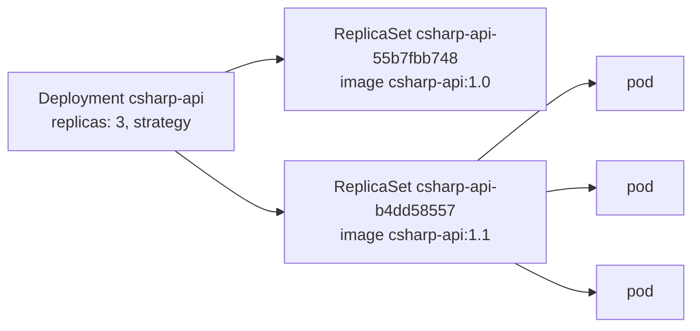

Full code: [`code/kubernetes/l03`](https://github.com/spareilleux/learn/tree/main/code/kubernetes/l03), with its commands in [`l03/run.sh`](https://github.com/spareilleux/learn/blob/main/code/kubernetes/l03/run.sh). The images come from [`images.sh`](https://github.com/spareilleux/learn/blob/main/code/kubernetes/images.sh), as in [lesson 2](../02-pods/#the-images); it also tags `csharp-api:1.0` a second time as `csharp-api:1.1`, the "new version" of this lesson.

A pod on its own is not replaced when it disappears: if its node fails or someone deletes it, it is gone. In [lesson 1](../01-architecture-and-local-cluster/), a **Deployment** recreated deleted pods. This lesson shows how: a Deployment doesn't manage pods directly, but **ReplicaSets**, one per version of the pod template, and it moves the replicas from one to the other when the template changes.



## The C# API as a Deployment

[`l03/csharp-api.yaml`](https://github.com/spareilleux/learn/blob/main/code/kubernetes/l03/csharp-api.yaml) wraps lesson 2's pod in a template, with three replicas and an update strategy:

```yaml
# Lesson 3: the C# API as a Deployment of three replicas, updated one pod at a time without losing capacity.
apiVersion: apps/v1
kind: Deployment
metadata:
  name: csharp-api
  labels:
    app: csharp-api
spec:
  replicas: 3
  # Old ReplicaSets kept for kubectl rollout undo
  revisionHistoryLimit: 5
  # A rollout that makes no progress for 60 s is reported as failed (the default is 600 s)
  progressDeadlineSeconds: 60
  selector:
    matchLabels:
      app: csharp-api
  strategy:
    type: RollingUpdate
    rollingUpdate:
      # One extra pod during the update, and never fewer than 3 ready ones
      maxSurge: 1
      maxUnavailable: 0
  template:
    metadata:
      labels:
        app: csharp-api
    spec:
      containers:
        - name: api
          image: csharp-api:1.0
          imagePullPolicy: Never
          ports:
            - name: http
              containerPort: 8080
          resources:
            requests:
              cpu: 100m
              memory: 64Mi
            limits:
              memory: 256Mi
          readinessProbe:
            httpGet:
              path: /
              port: http
            periodSeconds: 5
          livenessProbe:
            httpGet:
              path: /
              port: http
            periodSeconds: 10
```

The `selector` says which pods belong to the Deployment, and must match the template's labels. The container port now has a name, `http`, that the probes use, and that the Services of lesson 4 will use too.

```text
> kubectl apply -n l03 -f l03/csharp-api.yaml
deployment.apps/csharp-api created
> kubectl rollout status -n l03 deployment/csharp-api --timeout=180s
Waiting for deployment "csharp-api" rollout to finish: 0 of 3 updated replicas are available...
Waiting for deployment "csharp-api" rollout to finish: 1 of 3 updated replicas are available...
Waiting for deployment "csharp-api" rollout to finish: 2 of 3 updated replicas are available...
deployment "csharp-api" successfully rolled out
```

`kubectl rollout status` waits until every replica is updated and available, and its exit code says whether the rollout succeeded: that is what a deployment script or a CI job checks. The number of `Waiting` lines changes from run to run.

```text
> kubectl get -n l03 deployment,rs,pods -l app=csharp-api
NAME                         READY   UP-TO-DATE   AVAILABLE   AGE
deployment.apps/csharp-api   3/3     3            3           2s

NAME                                    DESIRED   CURRENT   READY   AGE
replicaset.apps/csharp-api-55b7fbb748   3         3         3       2s

NAME                              READY   STATUS    RESTARTS   AGE
pod/csharp-api-55b7fbb748-7c9m5   1/1     Running   0          2s
pod/csharp-api-55b7fbb748-lr6hb   1/1     Running   0          2s
pod/csharp-api-55b7fbb748-snz8v   1/1     Running   0          2s
```

The names tell the hierarchy. `55b7fbb748` is a hash of the pod template, computed by the deployment controller in [`sync.go`](https://github.com/kubernetes/kubernetes/blob/f54c212e3a2f75d674b717a9b29052b20b60aefc/pkg/controller/deployment/sync.go#L196-L207) and added to the ReplicaSet's name, selector and pods as the `pod-template-hash` label; the ReplicaSet then adds a random suffix to each pod. Each object also records its owner:

```text
> kubectl get -n l03 rs,pods -l app=csharp-api -o custom-columns=KIND:.kind,NAME:.metadata.name,OWNER:.metadata.ownerReferences[0].kind,OWNER-NAME:.metadata.ownerReferences[0].name
KIND         NAME                          OWNER        OWNER-NAME
ReplicaSet   csharp-api-55b7fbb748         Deployment   csharp-api
Pod          csharp-api-55b7fbb748-7c9m5   ReplicaSet   csharp-api-55b7fbb748
Pod          csharp-api-55b7fbb748-lr6hb   ReplicaSet   csharp-api-55b7fbb748
Pod          csharp-api-55b7fbb748-snz8v   ReplicaSet   csharp-api-55b7fbb748
```

These `ownerReferences` drive [garbage collection](https://kubernetes.io/docs/concepts/architecture/garbage-collection/): delete the Deployment, and its ReplicaSets and pods are deleted with it. You never edit a Deployment's ReplicaSets yourself; the Deployment would undo your change.

## A rolling update

Any change to the pod template starts a rollout: an image, an environment variable, a resource, even a label. Changes outside the template, such as `replicas`, don't. [`kubectl set image`](https://kubernetes.io/docs/reference/kubectl/generated/kubectl_set/kubectl_set_image/) changes the image directly on the cluster, and an annotation records why, for the history below:

```text
> kubectl set image -n l03 deployment/csharp-api api=csharp-api:1.1
deployment.apps/csharp-api image updated
> kubectl annotate -n l03 deployment/csharp-api kubernetes.io/change-cause="image csharp-api:1.1"
deployment.apps/csharp-api annotated
> kubectl rollout status -n l03 deployment/csharp-api --timeout=180s
Waiting for deployment "csharp-api" rollout to finish: 1 out of 3 new replicas have been updated...
Waiting for deployment "csharp-api" rollout to finish: 1 out of 3 new replicas have been updated...
Waiting for deployment "csharp-api" rollout to finish: 1 out of 3 new replicas have been updated...
Waiting for deployment "csharp-api" rollout to finish: 2 out of 3 new replicas have been updated...
Waiting for deployment "csharp-api" rollout to finish: 2 out of 3 new replicas have been updated...
Waiting for deployment "csharp-api" rollout to finish: 2 out of 3 new replicas have been updated...
Waiting for deployment "csharp-api" rollout to finish: 2 out of 3 new replicas have been updated...
Waiting for deployment "csharp-api" rollout to finish: 1 old replicas are pending termination...
Waiting for deployment "csharp-api" rollout to finish: 1 old replicas are pending termination...
Waiting for deployment "csharp-api" rollout to finish: 1 old replicas are pending termination...
deployment "csharp-api" successfully rolled out
> kubectl get -n l03 rs -l app=csharp-api
NAME                    DESIRED   CURRENT   READY   AGE
csharp-api-55b7fbb748   0         0         0       6s
csharp-api-b4dd58557    3         3         3       3s
```

`csharp-api:1.1` is the same image as `1.0` under another tag, but the template changed, so its hash did: a new ReplicaSet, `b4dd58557`, now has the three replicas, and the old one is kept with zero, for rollbacks. The Deployment's events show each step:

```text
> kubectl get events -n l03 --field-selector involvedObject.kind=Deployment,involvedObject.name=csharp-api -o custom-columns=REASON:.reason,MESSAGE:.message --sort-by=.metadata.creationTimestamp
REASON              MESSAGE
ScalingReplicaSet   Scaled up replica set csharp-api-55b7fbb748 from 0 to 3
ScalingReplicaSet   Scaled up replica set csharp-api-b4dd58557 from 0 to 1
ScalingReplicaSet   Scaled down replica set csharp-api-55b7fbb748 from 3 to 2
ScalingReplicaSet   Scaled up replica set csharp-api-b4dd58557 from 1 to 2
ScalingReplicaSet   Scaled down replica set csharp-api-55b7fbb748 from 2 to 1
ScalingReplicaSet   Scaled up replica set csharp-api-b4dd58557 from 2 to 3
ScalingReplicaSet   Scaled down replica set csharp-api-55b7fbb748 from 1 to 0
```

The first line is the initial creation; the six others are the update. With `maxSurge: 1`, there may be at most 3 + 1 = 4 pods, so the controller creates one new pod. With `maxUnavailable: 0`, at least 3 must be available, so it removes an old pod only once the new one is ready. And again, until the old ReplicaSet is empty. The controller's loop, in [`rolling.go`](https://github.com/kubernetes/kubernetes/blob/f54c212e3a2f75d674b717a9b29052b20b60aefc/pkg/controller/deployment/rolling.go#L31-L66), does exactly that: scale up if it can, otherwise scale down if it can. The scale-up count comes from [`NewRSNewReplicas`](https://github.com/kubernetes/kubernetes/blob/f54c212e3a2f75d674b717a9b29052b20b60aefc/pkg/controller/deployment/util/deployment_util.go#L817-L842).

Both settings accept a number or a percentage. The defaults are 25% and 25%: on 3 replicas, one extra pod (rounded up) and zero unavailable (rounded down), the same as here. The other [strategy](https://kubernetes.io/docs/concepts/workloads/controllers/deployment/#strategy), `Recreate`, deletes every old pod before creating new ones, for applications that can't run two versions side by side.

This rollout depended on the readiness probe: without it, a pod counts as available as soon as its container starts, and the old pods are removed before the new ones can answer.

:::note[set image or apply?]
`kubectl set image` changed the cluster, not `l03/csharp-api.yaml`, which still says `1.0`: the next `kubectl apply` of that file would roll back without anyone noticing. It is handy for a lesson, and the usual practice is to change the image in the file, commit it, and apply it, possibly through a GitOps tool (lesson 14).
:::

## A broken update

Now an image that doesn't exist on the node:

```text
> kubectl set image -n l03 deployment/csharp-api api=csharp-api:9.9
deployment.apps/csharp-api image updated
> kubectl annotate -n l03 deployment/csharp-api kubernetes.io/change-cause="image csharp-api:9.9, which doesn't exist"
deployment.apps/csharp-api annotated
> kubectl rollout status -n l03 deployment/csharp-api --timeout=180s
Waiting for deployment "csharp-api" rollout to finish: 1 out of 3 new replicas have been updated...
error: deployment "csharp-api" exceeded its progress deadline
> kubectl get -n l03 pods -l app=csharp-api --sort-by=.metadata.creationTimestamp
NAME                          READY   STATUS              RESTARTS   AGE
csharp-api-b4dd58557-ssn94    1/1     Running             0          65s
csharp-api-b4dd58557-8p44v    1/1     Running             0          64s
csharp-api-b4dd58557-bz2dz    1/1     Running             0          63s
csharp-api-796c4fd69c-vc9zb   0/1     ErrImageNeverPull   0          61s
```

After 60 seconds without progress, `kubectl rollout status` exits with code 1. The new pod can't start: `ErrImageNeverPull`, because `imagePullPolicy: Never` forbids looking for the missing tag in a registry. With a registry, the same mistake gives `ErrImagePull`, then `ImagePullBackOff`.

The three pods of version 1.1 are still running: `maxUnavailable: 0` never removed one, because no new pod became ready. The service is not interrupted, and the Deployment says both things at once:

```text
> kubectl get -n l03 deployment csharp-api
NAME         READY   UP-TO-DATE   AVAILABLE   AGE
csharp-api   3/3     1            3           68s
> kubectl get -n l03 deployment csharp-api -o jsonpath='{range .status.conditions[*]}{.type}={.status} {.reason}: {.message}{"\n"}{end}'
Available=True MinimumReplicasAvailable: Deployment has minimum availability.
Progressing=False ProgressDeadlineExceeded: ReplicaSet "csharp-api-796c4fd69c" has timed out progressing.
```

`Available=True`: enough replicas answer. `Progressing=False` with reason `ProgressDeadlineExceeded`, set in [`progress.go`](https://github.com/kubernetes/kubernetes/blob/f54c212e3a2f75d674b717a9b29052b20b60aefc/pkg/controller/deployment/progress.go#L86-L95): the update is stuck. Kubernetes doesn't roll back by itself; the condition is a signal for you, your pipeline or your alerting. The Deployment keeps trying to start the new pod.

## History and rollback

Each ReplicaSet is a **revision** of the Deployment, and `kubernetes.io/change-cause` gives its description:

```text
> kubectl rollout history -n l03 deployment/csharp-api
deployment.apps/csharp-api 
REVISION  CHANGE-CAUSE
1         <none>
2         image csharp-api:1.1
3         image csharp-api:9.9, which doesn't exist

> kubectl rollout undo -n l03 deployment/csharp-api
Warning: resource deployments/csharp-api was previously managed with 'kubectl apply'. Rolling back will not update the kubectl.kubernetes.io/last-applied-configuration annotation, which may cause unexpected behavior on future 'kubectl apply' operations. Consider using 'kubectl apply' with your previous configuration file instead.
deployment.apps/csharp-api rolled back
> kubectl rollout status -n l03 deployment/csharp-api --timeout=180s | tail -1
deployment "csharp-api" successfully rolled out
> kubectl rollout history -n l03 deployment/csharp-api
deployment.apps/csharp-api 
REVISION  CHANGE-CAUSE
1         <none>
3         image csharp-api:9.9, which doesn't exist
4         image csharp-api:1.1

> kubectl get -n l03 deployment csharp-api -o jsonpath='{.spec.template.spec.containers[0].image}{"\n"}'
csharp-api:1.1
```

[`kubectl rollout undo`](https://kubernetes.io/docs/concepts/workloads/controllers/deployment/#rolling-back-a-deployment) copies the template of the previous revision back into the Deployment. That template matches the ReplicaSet of revision 2, which is scaled up again and renumbered 4: a revision number is not a version, it is the order in which ReplicaSets were last used. The failed pod is removed with its ReplicaSet scaled to zero.

kubectl's warning is the same problem as `set image`: `kubectl apply` remembers the last file applied in an annotation, and a rollback doesn't update it. In a team, a rollback is usually a revert commit, applied like any other change.

`revisionHistoryLimit: 5` keeps five old ReplicaSets; older ones are deleted, and you can no longer return to them. The default is 10.

## The Spring Boot API

[`l03/java-reactor-api.yaml`](https://github.com/spareilleux/learn/blob/main/code/kubernetes/l03/java-reactor-api.yaml) is the same shape with two replicas, larger requests and limits for the JVM, and lesson 2's three probes:

```yaml
          startupProbe:
            httpGet:
              path: /
              port: http
            periodSeconds: 1
            failureThreshold: 60
          readinessProbe:
            httpGet:
              path: /
              port: http
            periodSeconds: 5
          livenessProbe:
            httpGet:
              path: /
              port: http
            periodSeconds: 10
```

```text
> kubectl apply -n l03 -f l03/java-reactor-api.yaml
deployment.apps/java-reactor-api created
> kubectl rollout status -n l03 deployment/java-reactor-api --timeout=180s | tail -1
deployment "java-reactor-api" successfully rolled out
> kubectl get -n l03 deployment java-reactor-api
NAME               READY   UP-TO-DATE   AVAILABLE   AGE
java-reactor-api   2/2     2            2           3s
```

Its strategy is not written, so it gets the defaults: `RollingUpdate`, 25% surge, 25% unavailable. Both APIs are now running side by side, each behind its own labels; lesson 4 gives them a stable address.

## Key takeaways

- A Deployment owns ReplicaSets, one per pod template, and each ReplicaSet owns identical pods; the name suffixes are a template hash and a random string.
- Any change to the template starts a rollout; `maxSurge` and `maxUnavailable` decide how many pods are created and removed at each step, and readiness probes decide when a step is done.
- A failed rollout stops at `progressDeadlineSeconds` with `Progressing=False` and `ProgressDeadlineExceeded`; with `maxUnavailable: 0`, the old version keeps serving, and nothing rolls back automatically.
- `kubectl rollout status` gives a script an exit code; `rollout history` lists revisions, and `rollout undo` restores a previous template under a new revision number.
- `kubectl set image` and `rollout undo` change the cluster, not your files: keep the files as the source of truth.

## Exercises

**1.** Go back to revision 1 explicitly, the original `csharp-api:1.0`. What does the history look like afterwards?

<details>
<summary>Solution</summary>

```text
> kubectl rollout undo -n l03 deployment/csharp-api --to-revision=1
Warning: resource deployments/csharp-api was previously managed with 'kubectl apply'. Rolling back will not update the kubectl.kubernetes.io/last-applied-configuration annotation, which may cause unexpected behavior on future 'kubectl apply' operations. Consider using 'kubectl apply' with your previous configuration file instead.
deployment.apps/csharp-api rolled back
> kubectl rollout status -n l03 deployment/csharp-api --timeout=180s | tail -1
deployment "csharp-api" successfully rolled out
> kubectl get -n l03 deployment csharp-api -o jsonpath='{.spec.template.spec.containers[0].image}{"\n"}'
csharp-api:1.0
> kubectl rollout history -n l03 deployment/csharp-api
deployment.apps/csharp-api 
REVISION  CHANGE-CAUSE
3         image csharp-api:9.9, which doesn't exist
4         image csharp-api:1.1
5         <none>

```

Revision 1 became revision 5, and it shows the change cause its ReplicaSet was created with: none.

</details>

**2.** List the Deployment's ReplicaSets with, for each one, its image, its number of replicas and its revision. How many are there, and why is `csharp-api:1.1` one of them when it is the same image as `1.0`?

<details>
<summary>Solution</summary>

The revision is an annotation on each ReplicaSet, `deployment.kubernetes.io/revision`; in JSONPath, the dots in its name are escaped.

```text
> kubectl get -n l03 rs -l app=csharp-api -o jsonpath='{range .items[*]}{.metadata.name} {.spec.template.spec.containers[0].image} replicas={.spec.replicas} revision={.metadata.annotations.deployment\.kubernetes\.io/revision}{"\n"}{end}'
csharp-api-55b7fbb748 csharp-api:1.0 replicas=3 revision=5
csharp-api-796c4fd69c csharp-api:9.9 replicas=0 revision=3
csharp-api-b4dd58557 csharp-api:1.1 replicas=0 revision=4
```

Three ReplicaSets, one per distinct template. The hash is computed from the template, where the image is only a string: Kubernetes doesn't know, or care, that two tags point to the same image. In the other direction, pushing a new image under the same tag doesn't change the template, and doesn't start a rollout.

</details>

**3.** Apply [`l03/too-big.yaml`](https://github.com/spareilleux/learn/blob/main/code/kubernetes/l03/too-big.yaml), a Deployment whose pod requests 100 GiB of memory. What happens to the pod, and where is the reason?

<details>
<summary>Solution</summary>

```text
> kubectl apply -n l03 -f l03/too-big.yaml
deployment.apps/too-big created
> kubectl get -n l03 pods -l app=too-big
NAME                       READY   STATUS    RESTARTS   AGE
too-big-6b6fb97d68-jkj2t   0/1     Pending   0          0s
> kubectl get events -n l03 --field-selector reason=FailedScheduling -o custom-columns=TYPE:.type,REASON:.reason,MESSAGE:.message --no-headers | sort -u
Warning   FailedScheduling   0/1 nodes are available: 1 Insufficient memory. preemption: 0/1 nodes are available: 1 Preemption is not helpful for scheduling.
```

The Deployment and its ReplicaSet are created, and so is the pod, but the scheduler finds no node with 100 GiB of unreserved memory: the pod stays `Pending`, without a node and without containers. The scheduler's event says why; `preemption` means that evicting lower-priority pods wouldn't free enough room either (priorities come in lesson 8). The request counts, not the actual use: the node doesn't have to be full.

</details>

## Sources

- Kubernetes documentation: [Deployments](https://kubernetes.io/docs/concepts/workloads/controllers/deployment/), [ReplicaSet](https://kubernetes.io/docs/concepts/workloads/controllers/replicaset/), [Garbage collection](https://kubernetes.io/docs/concepts/architecture/garbage-collection/), [`kubectl rollout`](https://kubernetes.io/docs/reference/kubectl/generated/kubectl_rollout/), [`kubectl set image`](https://kubernetes.io/docs/reference/kubectl/generated/kubectl_set/kubectl_set_image/), [Images and pull policy](https://kubernetes.io/docs/concepts/containers/images/#image-pull-policy)
- Source code at v1.37.0: [`pkg/controller/deployment/sync.go`](https://github.com/kubernetes/kubernetes/blob/f54c212e3a2f75d674b717a9b29052b20b60aefc/pkg/controller/deployment/sync.go#L196-L207), [`rolling.go`](https://github.com/kubernetes/kubernetes/blob/f54c212e3a2f75d674b717a9b29052b20b60aefc/pkg/controller/deployment/rolling.go#L31-L66), [`util/deployment_util.go`](https://github.com/kubernetes/kubernetes/blob/f54c212e3a2f75d674b717a9b29052b20b60aefc/pkg/controller/deployment/util/deployment_util.go#L817-L842), [`progress.go`](https://github.com/kubernetes/kubernetes/blob/f54c212e3a2f75d674b717a9b29052b20b60aefc/pkg/controller/deployment/progress.go#L86-L95)
