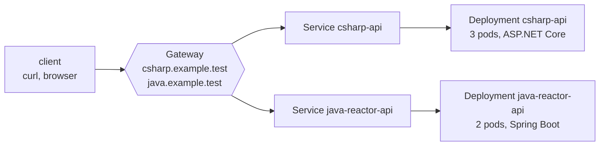

:::note[Versions studied]
[Kubernetes](https://kubernetes.io/docs/home/) **1.37.0**, the latest minor release on 2026-09-15, released on 2026-08-26 and [supported until 2027-10-28](https://kubernetes.io/releases/). The local cluster is [kind](https://kind.sigs.k8s.io/) **0.33.0** with its node image `kindest/node:v1.37.0`, pinned by digest, and `kubectl` **1.37.0**. Lesson 4 adds [cloud-provider-kind](https://github.com/kubernetes-sigs/cloud-provider-kind) **0.11.1** for load balancers and the Gateway API. Every manifest and command is in [`code/kubernetes`](https://github.com/spareilleux/learn/tree/main/code/kubernetes): [`check.sh`](https://github.com/spareilleux/learn/blob/main/code/kubernetes/check.sh) runs each lesson against the cluster and compares its outputs with [`expected`](https://github.com/spareilleux/learn/tree/main/code/kubernetes/expected), after replacing ages, generated names and IP addresses. CI validates the manifests with [kubeconform](https://github.com/yannh/kubeconform) on Windows, Linux and macOS, and runs the lessons on a kind cluster on Linux only, because GitHub's Windows and macOS runners have no Docker.
:::

## Why I'm learning this

I can build an image and run it; the [WSL containers course](../wsl-containers/) ends there. Then someone says "deploy it on the cluster", and I copy a YAML file from another service, change the name, and hope. When a pod restarts in a loop, or a Service answers nothing, I try things until it works, without knowing which one did.

I want to know what Kubernetes does with what I declare: which component acts on it, in what order, and what each status and event means. So that I can write manifests on purpose, deploy without interrupting the service, and find what is wrong from the cluster's own answers.

## Who this course is for

You are a C# or Java developer, and you have built and run a container image. You don't need to know Kubernetes or Linux networking. The images come from lesson 4 of [WSL containers](../wsl-containers/04-build-an-image/); the CI lessons send you to [GitHub Actions](../github-actions/), and lesson 13 to [RabbitMQ](../rabbitmq/) for its Kubernetes operator.

## The running example

The two small web APIs of the WSL containers course, an ASP.NET Core minimal API and a Spring Boot WebFlux API, run on a one-node kind cluster. Each lesson adds what a real deployment needs: probes and resources, rolling updates, a stable address, configuration, storage, security, packaging.

[Guitar Alchemist](https://github.com/GuitarAlchemist/ga) runs on Docker Compose and .NET Aspire, with a Kubernetes track planned; lesson 2 compares the probes of its deployment guide with its images.

## By the end of this course, I will be able to

- explain what the API server, etcd, the scheduler, the controllers and the kubelet each do with a manifest;
- run a local cluster with kind, and use `kubectl` against it without touching my other clusters;
- write pods with the right probes, requests and limits, and read their conditions and events;
- deploy the C# and Spring APIs with rolling updates, and roll back a failed release;
- give them a stable address inside and outside the cluster, with Services, DNS, the Gateway API and Ingress;
- configure them, give them storage, and run jobs and per-node agents;
- control where pods run, how many run, and what they are allowed to do;
- package a deployment with Helm and Kustomize, and deliver it with GitOps;
- troubleshoot `CrashLoopBackOff`, `ImagePullBackOff`, `Pending` and `OOMKilled` from the cluster's own information;
- know what changes on AKS, EKS and GKE.

## Outline

| # | Lesson | You may already know |
|---|---|---|
| 1 | [Architecture and a local cluster](01-architecture-and-local-cluster/) | `docker run`, Docker Compose, a restart policy |
| 2 | [Pods](02-pods/) | ASP.NET Core health checks, Spring Boot Actuator, `docker logs` |
| 3 | [Deployments](03-deployments/) | blue/green deployments, deployment slots in Azure App Service |
| 4 | [Services and DNS](04-services-and-dns/) | a reverse proxy, YARP, Spring Cloud Gateway, `/etc/hosts` |
| 5 | Configuration: ConfigMaps and Secrets *(coming next)* | `appsettings.json`, `application.yml`, environment variables |
| 6 | Storage: volumes, PersistentVolumes, StatefulSets | Docker volumes, a database in a container |
| 7 | Jobs, CronJobs and DaemonSets | `BackgroundService`, `@Scheduled`, a Windows service |
| 8 | Scheduling: affinity, taints, topology spread, priorities, disruption budgets | |
| 9 | Scaling: HPA, metrics-server, VPA, cluster autoscaler | App Service scale-out rules |
| 10 | Security: RBAC, ServiceAccounts, Pod Security Standards, NetworkPolicies | ASP.NET Core authorization policies, Spring Security |
| 11 | Packaging: Helm and Kustomize | NuGet and Maven, `appsettings.Production.json` |
| 12 | Observability and troubleshooting | OpenTelemetry, `dotnet-counters`, Micrometer |
| 13 | Extending Kubernetes: CRDs and operators | |
| 14 | Continuous delivery: GitOps with Argo CD or Flux, CI with GitHub Actions | [GitHub Actions](../github-actions/) |
| 15 | In production: AKS, EKS, GKE, costs, upgrades | Azure, AWS or Google Cloud |

[Journal](journal/): what I tried, what surprised me, what I still need to verify.

## Resources

- [Kubernetes documentation](https://kubernetes.io/docs/home/), in particular [Concepts](https://kubernetes.io/docs/concepts/), the [`kubectl` reference](https://kubernetes.io/docs/reference/kubectl/) and the [API reference](https://kubernetes.io/docs/reference/kubernetes-api/)
- [kind documentation](https://kind.sigs.k8s.io/), with its [known issues](https://kind.sigs.k8s.io/docs/user/known-issues/)
- [Gateway API](https://gateway-api.sigs.k8s.io/)
- [Kubernetes release notes](https://kubernetes.io/releases/) and the [Kubernetes blog](https://kubernetes.io/blog/), where each release's changes and deprecations are announced
- [Azure Kubernetes Service documentation](https://learn.microsoft.com/azure/aks/)
- Source code: [kubernetes/kubernetes](https://github.com/kubernetes/kubernetes), [kubernetes-sigs/kind](https://github.com/kubernetes-sigs/kind), [kubernetes-sigs/cloud-provider-kind](https://github.com/kubernetes-sigs/cloud-provider-kind)
