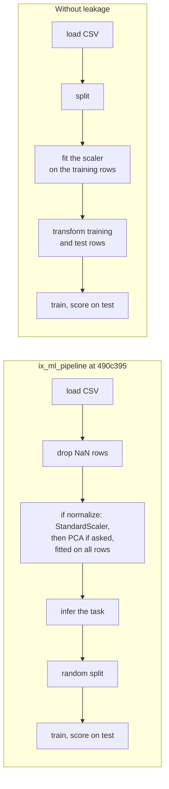

import { Tabs, TabItem } from '@astrojs/starlight/components';

A machine learning model is a function that you don't write: you give examples of inputs and the answers you expect, and an algorithm picks the function. Before any algorithm, this lesson answers two questions that decide whether the result means anything. What exactly are the inputs and the answers? And how do you measure whether the function is good, on examples it hasn't seen?

| | ML.NET | Tribuo | IX |
|---|---|---|---|
| One example | a row of an `IDataView` | an `Example<T>` | a row of an `Array2<f64>` |
| The features | a `Features` column of type vector | the features of the `Example` | the columns of the matrix |
| The label | a `Label` column | the output `T`: `Label`, `Regressor` | an `Array1<f64>` (regression) or `Array1<usize>` (classes 0, 1, 2…) |
| Split | [`TrainTestSplit`](https://learn.microsoft.com/dotnet/api/microsoft.ml.dataoperationscatalog.traintestsplit) | [`TrainTestSplitter`](https://tribuo.org/learn/4.3/javadoc/org/tribuo/evaluation/TrainTestSplitter.html) | `train_test_split` |
| Scores | [`RegressionMetrics`](https://learn.microsoft.com/dotnet/api/microsoft.ml.data.regressionmetrics), [`MulticlassClassificationMetrics`](https://learn.microsoft.com/dotnet/api/microsoft.ml.data.multiclassclassificationmetrics) | [`RegressionEvaluation`](https://tribuo.org/learn/4.3/javadoc/org/tribuo/regression/evaluation/RegressionEvaluation.html), [`LabelEvaluation`](https://tribuo.org/learn/4.3/javadoc/org/tribuo/classification/evaluation/LabelEvaluation.html) | functions in `ix_supervised::metrics` |

## Running the code

The course code is a Cargo project in `code/machine-learning-ix`, with one example per lesson and one per set of exercise solutions. You need [Rust](https://www.rust-lang.org/tools/install); the first build downloads IX from GitHub and compiles it. The cross-check needs [Python](https://www.python.org/downloads/) with numpy and scikit-learn.

<Tabs syncKey="os">
<TabItem label="Windows">

```powershell
cd code\machine-learning-ix
cargo run --release --example l01_evaluation
pip install numpy==2.4.2 scikit-learn==1.8.0
python crosscheck\crosscheck.py
```

</TabItem>
<TabItem label="Linux / WSL">

```bash
cd code/machine-learning-ix
cargo run --release --example l01_evaluation
python3 -m pip install numpy==2.4.2 scikit-learn==1.8.0
python3 crosscheck/crosscheck.py
```

</TabItem>
<TabItem label="macOS">

```bash
cd code/machine-learning-ix
cargo run --release --example l01_evaluation
python3 -m pip install numpy==2.4.2 scikit-learn==1.8.0
python3 crosscheck/crosscheck.py
```

</TabItem>
</Tabs>

`bash check.sh` runs what the CI runs: formatting, [clippy](https://doc.rust-lang.org/clippy/), the unit tests, then every example, compared with `expected/`.

## Features and labels

A data set for supervised learning is two things: a matrix **X** with one row per example and one column per **feature**, and a vector **y** with one **label** per row. In IX both are [ndarray](https://docs.rs/ndarray/0.17/ndarray/) arrays, so the course loads its CSV files with the [csv](https://docs.rs/csv/latest/csv/) crate into the same types ([`src/data.rs`, lines 35-46](https://github.com/spareilleux/learn/blob/15cde43/code/machine-learning-ix/src/data.rs#L35-L46)):

```rust
pub fn load_builds(path: impl AsRef<Path>) -> Builds {
    let (_, rows) = records(path.as_ref());
    let n = rows.len();
    let pages = Array2::from_shape_fn((n, 1), |(i, _)| rows[i][2].parse().unwrap());
    let seconds = rows.iter().map(|r| r[3].parse().unwrap()).collect();
    // …
}
```

`pages` is a matrix with one column, not a vector: every IX model takes an `Array2`, even with one feature.

The first data set asks a regression question: how many seconds does the build of this site take, given the number of pages? The first rows of `builds.csv`, and the first output of [`examples/l01_evaluation.rs`](https://github.com/spareilleux/learn/blob/15cde43/code/machine-learning-ix/examples/l01_evaluation.rs):

```text
created_at,sha,pages,build_seconds
2026-09-13T15:53:16Z,eda2608,18,10
2026-09-13T16:05:01Z,f43ba7e,110,12
```

```text
== builds.csv
x: [65, 1] [18.0, 110.0, 122.0], y: 65
y mean 18.846, std 5.424 (hand)
y mean 18.846, std 5.424 (ix_math::stats)
```

Both standard deviations divide by `n`, not `n - 1`: [`ix_math::stats::std_dev`](https://github.com/GuitarAlchemist/ix/blob/490c39533627d296bf9f8f050e6fafc14d7a20c2/crates/ix-math/src/stats.rs#L15-L40) is the population one, like numpy's default; `sample_variance`, next to it, divides by `n - 1`.

### Where IX reads its data

IX's own CSV reader, [`ix_io::csv_io::read_csv`](https://github.com/GuitarAlchemist/ix/blob/490c39533627d296bf9f8f050e6fafc14d7a20c2/crates/ix-io/src/csv_io.rs#L12-L38), parses every field as an `f64`, and a field that isn't a number becomes `NaN`, without an error. [`DataBatch::to_array2`](https://github.com/GuitarAlchemist/ix/blob/490c39533627d296bf9f8f050e6fafc14d7a20c2/crates/ix-io/src/protocol.rs#L95-L106) then stacks the rows into the matrix. Read with it, `builds.csv` would have a column of `NaN` dates and a column of `NaN` commit hashes. The ML pipeline behind the `ix_ml_pipeline` tool drops every row that contains a `NaN` by default, so on such a file it would drop every row and stop with `All rows contain NaN values` (from reading [`ml_pipeline.rs`, lines 167-188](https://github.com/GuitarAlchemist/ix/blob/490c39533627d296bf9f8f050e6fafc14d7a20c2/crates/ix-agent/src/ml_pipeline.rs#L167-L188); *to verify* by running the tool). Keep only numeric columns in a file you give to IX.

## Train and test

A model is judged on rows it didn't learn from: otherwise a model that memorizes the answers would score perfectly. So the rows are split in two: a **training set** to fit the model, a **test set** to score it, used once, at the end.

How to split depends on the question. The builds are in time order, and the question is about the next build: the honest split trains on the past and tests on the most recent 20% ([`src/evaluation.rs`, lines 5-10](https://github.com/spareilleux/learn/blob/15cde43/code/machine-learning-ix/src/evaluation.rs#L5-L10)). [`ix_math::preprocessing::train_test_split`](https://github.com/GuitarAlchemist/ix/blob/490c39533627d296bf9f8f050e6fafc14d7a20c2/crates/ix-math/src/preprocessing.rs#L157-L200) shuffles the rows first, like ML.NET's `TrainTestSplit` and scikit-learn's [`train_test_split`](https://scikit-learn.org/stable/modules/generated/sklearn.model_selection.train_test_split.html):

```text
== split
chronological: train 52, test 13, test pages 274..289
ix train_test_split: train 52, test 13, test pages [138, 253, 253, 130, 280, 241, 271, 130, 138, 138, 289, 274, 138]
```

The random test set mixes builds from the first day with builds from the last hour: the model would be asked about the past, with the future in its training set. For time series, scikit-learn has [`TimeSeriesSplit`](https://scikit-learn.org/stable/modules/generated/sklearn.model_selection.TimeSeriesSplit.html); IX's `train_test_split` always shuffles.

## A baseline and four regression metrics

Before any model, a **baseline**: the simplest prediction that uses no feature. For a number, it's the mean of the training labels, 17.385 seconds, for every test build. A model that doesn't beat it has learned nothing.

With `yᵢ` the true values, `pᵢ` the predictions and `ȳ` the mean of the true values:

| Metric | Formula | Unit | Reads as |
|---|---|---|---|
| MSE, mean squared error | `1/n Σ (yᵢ - pᵢ)²` | seconds² | punishes large errors most |
| RMSE | `√MSE` | seconds | a typical error, weighted toward large ones |
| MAE, mean absolute error | `1/n Σ abs(yᵢ - pᵢ)` | seconds | the average error |
| R², coefficient of determination | `1 - Σ (yᵢ - pᵢ)² / Σ (yᵢ - ȳ)²` | none | 1 is perfect, 0 is as good as predicting `ȳ` |

Written by hand in [`src/evaluation.rs`, lines 47-61](https://github.com/spareilleux/learn/blob/15cde43/code/machine-learning-ix/src/evaluation.rs#L47-L61), and in IX in [`metrics.rs`, lines 48-87](https://github.com/GuitarAlchemist/ix/blob/490c39533627d296bf9f8f050e6fafc14d7a20c2/crates/ix-supervised/src/metrics.rs#L48-L87):

```text
== baseline on the chronological test set: always 17.385 s
hand: mse 107.000, rmse 10.344, mae 7.308, r2 -0.996
ix:   mse 107.000, rmse 10.344, mae 7.308, r2 -0.996
```

R² is negative: the `ȳ` in its formula is the mean of the **test** labels, 24.69 seconds, and the baseline predicts the training mean. The builds got slower as the site grew, so the past mean is a worse guess than the mean of the test builds themselves, which no model can know in advance. scikit-learn's [`r2_score`](https://scikit-learn.org/stable/modules/model_evaluation.html) gives the same −0.996 in the cross-check.

## Scaling, and the test set that leaks

Many algorithms compare features with each other, or take steps of the same size in every direction: a feature measured in hundreds (pages) then weighs more than one measured in units (seconds). **Standardizing** puts every feature in standard deviations from its mean: `z = (x - μ) / σ`.

`μ` and `σ` are learned from data, like a model's parameters, so they must come from the training rows only, and then be applied unchanged to the test rows. [`StandardScaler::fit` and `transform`](https://github.com/GuitarAlchemist/ix/blob/490c39533627d296bf9f8f050e6fafc14d7a20c2/crates/ix-math/src/preprocessing.rs#L25-L54) are separate for that reason, as are ML.NET's [`NormalizeMeanVariance`](https://learn.microsoft.com/dotnet/api/microsoft.ml.normalizationcatalog.normalizemeanvariance) estimator and its transformer, and Deeplearning4j's [`NormalizerStandardize`](https://javadoc.io/doc/org.nd4j/nd4j-api/latest/org/nd4j/linalg/dataset/api/preprocessor/NormalizerStandardize.html) `fit` and `transform`:

```text
== scaling pages
hand, train rows: mean 184.038, std 62.476
ix,   train rows: mean 184.038, std 62.476
ix,   all rows:   mean 203.277, std 67.883
first test row scaled: 1.440 (train statistics), 1.042 (all rows)
```

Fitted on all rows, the scaler has seen the test set: the first test build, 274 pages, becomes 1.042 standard deviations above the mean instead of 1.440. The model would be tested on data shaped by the test set itself: that's **leakage**, and it makes scores look better than they will be on new data ([scikit-learn, common pitfalls](https://scikit-learn.org/stable/common_pitfalls.html)).

IX's ML pipeline, the code behind the `ix_ml_pipeline` MCP tool, does it in the wrong order when `normalize` is on (it's off by default). [`run_pipeline`](https://github.com/GuitarAlchemist/ix/blob/490c39533627d296bf9f8f050e6fafc14d7a20c2/crates/ix-agent/src/ml_pipeline.rs#L190-L203) fits the scaler and the PCA on the whole matrix, and only then [`run_classification`](https://github.com/GuitarAlchemist/ix/blob/490c39533627d296bf9f8f050e6fafc14d7a20c2/crates/ix-agent/src/ml_pipeline.rs#L537-L538) and `run_regression` ([lines 704-705](https://github.com/GuitarAlchemist/ix/blob/490c39533627d296bf9f8f050e6fafc14d7a20c2/crates/ix-agent/src/ml_pipeline.rs#L704-L705)) split the rows:



The effect on a score depends on the data; the mechanism is the one printed above. I read this order in the code but haven't run the tool (*to verify*).

## Is it regression or classification?

The same pipeline guesses the task when it isn't given, with [`infer_task_type`](https://github.com/GuitarAlchemist/ix/blob/490c39533627d296bf9f8f050e6fafc14d7a20c2/crates/ix-math/src/preprocessing.rs#L234-L254): if every label is a non-negative integer and there are at most 20 distinct values (the threshold [`run_pipeline` passes](https://github.com/GuitarAlchemist/ix/blob/490c39533627d296bf9f8f050e6fafc14d7a20c2/crates/ix-agent/src/ml_pipeline.rs#L208-L221)), it's classification. Build times are whole seconds:

```text
== infer_task_type: 18 distinct values -> MulticlassClassification { n_classes: 18 }
same seconds with 0.5 added to one row -> true
```

Asked to predict build seconds, the pipeline would train a classifier with 18 classes, where 23 seconds is as different from 24 as from 48. Adding half a second to one row makes it regression again. Integer labels are common in regression (counts, prices in cents, durations), so pass the task explicitly.

## Classification metrics

The second data set asks a classification question: which OS ran a CI job, from the timings of its steps? 121 of the 186 jobs ran on Ubuntu, 34 on Windows, 31 on macOS. The baseline is the most frequent class: always answer `ubuntu`.

```text
== jobs.csv: [186, 5] ["queue_s", "setup_s", "checkout_s", "post_checkout_s", "complete_s"], classes ["ubuntu", "windows", "macos"] = [121, 34, 31]
confusion matrix (rows = true class, columns = predicted):
[[121, 0, 0],
 [34, 0, 0],
 [31, 0, 0]]
accuracy 0.651 (hand), 0.651 (ix)
```

**Accuracy**, the share of correct answers, is 65% for a model that never looks at a job. With unbalanced classes, accuracy alone hides whether the rare classes are ever found. The **confusion matrix** shows it: `m[t][p]` counts the rows of true class `t` predicted as `p`. For one class `c`:

- **precision** = `m[c][c] / Σₜ m[t][c]`: of the jobs predicted `c`, the share that really are `c`;
- **recall** = `m[c][c] / Σₚ m[c][p]`: of the jobs that are `c`, the share predicted `c`;
- **F1** = `2 · precision · recall / (precision + recall)`: high only when both are.

**Macro** averaging takes the mean over classes, so each class counts the same, whatever its size ([`src/evaluation.rs`, lines 78-90](https://github.com/spareilleux/learn/blob/15cde43/code/machine-learning-ix/src/evaluation.rs#L78-L90); IX [`metrics.rs`, lines 91-148](https://github.com/GuitarAlchemist/ix/blob/490c39533627d296bf9f8f050e6fafc14d7a20c2/crates/ix-supervised/src/metrics.rs#L91-L148)):

```text
ubuntu   precision 0.651 recall 1.000 f1 0.788 | ix 0.651 1.000 0.788
windows  precision 0.000 recall 0.000 f1 0.000 | ix 0.000 0.000 0.000
macos    precision 0.000 recall 0.000 f1 0.000 | ix 0.000 0.000 0.000
macro f1 0.263 (hand), 0.263 (ix f1_avg)
Confusion Matrix:
pred →	0	1	2
true 0:	121	0	0
true 1:	34	0	0
true 2:	31	0	0
```

A macro F1 of 0.263 says what accuracy hid. A precision with nothing predicted is 0/0: IX and the hand version return 0, as scikit-learn does by default, with a warning. ML.NET's [`MacroAccuracy`](https://learn.microsoft.com/dotnet/api/microsoft.ml.data.multiclassclassificationmetrics) is the same idea: the accuracy of each class, averaged over the classes.

## Key takeaways

- Features are a matrix, labels a vector; IX models take `Array2<f64>` even for one feature, and IX's CSV reader turns text into `NaN` silently.
- Split before anything is learned from the data, including the scaler; split by time when the question is about the future.
- Compare every model with a baseline. R² on a test set can be negative.
- With unbalanced classes, read the confusion matrix and the per-class or macro scores, not accuracy alone.
- IX's ML pipeline, when asked to normalize, fits its scaler before splitting; it also calls integer targets with few values classification: pass the task, and don't trust its test scores without checking the order.

## Exercises

The solutions are in [`examples/l01_exercises.rs`](https://github.com/spareilleux/learn/blob/15cde43/code/machine-learning-ix/examples/l01_exercises.rs), and their output in `expected/l01_exercises.txt`: CI checks them with the rest.

1. A better baseline for a time series: predict each test build with the seconds of the build just before it. Score it with IX's MAE, RMSE and R², next to the training mean.

<details>
<summary>Solution</summary>

[Lines 12-27](https://github.com/spareilleux/learn/blob/15cde43/code/machine-learning-ix/examples/l01_exercises.rs#L12-L27):

```rust
let previous: Array1<f64> = test.iter().map(|&i| y[i - 1]).collect();
let mean = Array1::from_elem(test.len(), hand::mean(&pick(y, &train)));
for (name, p) in [("previous build", &previous), ("training mean", &mean)] {
    println!(
        "{name:14}: mae {:.3}, rmse {:.3}, r2 {:.3}",
        metrics::mae(&y_test, p),
        metrics::rmse(&y_test, p),
        metrics::r_squared(&y_test, p)
    );
}
```

```text
== exercise 1
previous build: mae 4.923, rmse 8.485, r2 -0.343
training mean : mae 7.308, rmse 10.344, r2 -0.996
```

The previous build is a better baseline on every metric: it follows the trend. R² is still negative, because the last build took 48 seconds, more than twice the 21 seconds of the one before.

</details>

2. How many macOS jobs land in a random test set of 20%? Count them for `train_test_split` with seeds 0 to 9, then count them in each test fold of IX's `StratifiedKFold` with 5 folds.

<details>
<summary>Solution</summary>

[Lines 29-45](https://github.com/spareilleux/learn/blob/15cde43/code/machine-learning-ix/examples/l01_exercises.rs#L29-L45):

```rust
let per_seed: Vec<usize> = (0..10)
    .map(|seed| {
        let split = train_test_split(&jobs.features, &labels, 0.2, seed).unwrap();
        split.y_test.iter().filter(|&&c| c == 2.0).count()
    })
    .collect();
let folds = StratifiedKFold::new(5).split(&jobs.os);
```

```text
== exercise 2
macos jobs in the 37 test rows of train_test_split, seeds 0 to 9: [6, 7, 6, 5, 7, 4, 7, 1, 7, 5]
StratifiedKFold(5), (test rows, macos jobs) per fold: [(39, 7), (37, 6), (37, 6), (37, 6), (36, 6)]
```

31 macOS jobs out of 186 is 17%, about 6 in 37 rows. A random split gives anywhere from 1 to 7: with seed 7, the test set has a single macOS job, and a recall for macOS would be 0 or 1. A **stratified** split keeps each class's share in every fold: [`StratifiedKFold::split`](https://github.com/GuitarAlchemist/ix/blob/490c39533627d296bf9f8f050e6fafc14d7a20c2/crates/ix-supervised/src/validation.rs#L169-L211) shuffles the rows of each class and deals them to the folds in turn. `train_test_split` takes `labels` as `f64`, the regression type, and has no stratified option.

</details>

## Sources

- [scikit-learn: model evaluation](https://scikit-learn.org/stable/modules/model_evaluation.html) and [common pitfalls](https://scikit-learn.org/stable/common_pitfalls.html)
- [ML.NET: evaluation metrics](https://learn.microsoft.com/dotnet/machine-learning/resources/metrics)
- James, Witten, Hastie, Tibshirani, Taylor, *[An Introduction to Statistical Learning](https://www.statlearning.com/)*, chapters 2 and 5
- IX at `490c395`: [`ix-math/src/preprocessing.rs`](https://github.com/GuitarAlchemist/ix/blob/490c39533627d296bf9f8f050e6fafc14d7a20c2/crates/ix-math/src/preprocessing.rs), [`ix-supervised/src/metrics.rs`](https://github.com/GuitarAlchemist/ix/blob/490c39533627d296bf9f8f050e6fafc14d7a20c2/crates/ix-supervised/src/metrics.rs), [`ix-agent/src/ml_pipeline.rs`](https://github.com/GuitarAlchemist/ix/blob/490c39533627d296bf9f8f050e6fafc14d7a20c2/crates/ix-agent/src/ml_pipeline.rs)
