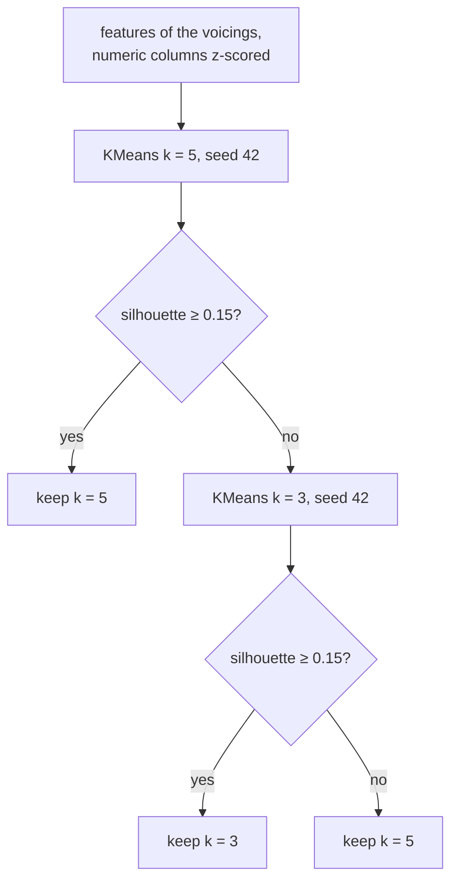

Lessons 2 and 3 learned from answers: the build seconds, the OS of each job. **Clustering** has no answers. It looks for groups of rows that are close to each other and far from the rest, and it's up to you to say whether the groups mean anything. This lesson hides the OS of the 186 jobs, clusters their five timings, and only then looks at the OS: a check you rarely get on real data.

IX uses clustering on its own data: the `ix-voicings` crate groups the guitar voicings that [GA](https://github.com/GuitarAlchemist/ga) enumerates, with k-means and a rule to choose the number of groups. This lesson applies that rule to the jobs.

| | ML.NET | Tribuo | scikit-learn | IX |
|---|---|---|---|---|
| k-means | [`KMeansTrainer`](https://learn.microsoft.com/dotnet/api/microsoft.ml.trainers.kmeanstrainer) | [`KMeansTrainer`](https://tribuo.org/learn/4.3/javadoc/org/tribuo/clustering/kmeans/KMeansTrainer.html) | [`KMeans`](https://scikit-learn.org/stable/modules/generated/sklearn.cluster.KMeans.html) | `ix_unsupervised::kmeans::KMeans` |
| Density | — | [`HdbscanTrainer`](https://tribuo.org/learn/4.3/javadoc/org/tribuo/clustering/hdbscan/HdbscanTrainer.html) | [`DBSCAN`](https://scikit-learn.org/stable/modules/generated/sklearn.cluster.DBSCAN.html) | `ix_unsupervised::dbscan::DBSCAN` |
| Gaussian mixture | — | — | [`GaussianMixture`](https://scikit-learn.org/stable/modules/generated/sklearn.mixture.GaussianMixture.html) | `ix_unsupervised::gmm::GMM` |
| Silhouette | — | — | [`silhouette_score`](https://scikit-learn.org/stable/modules/generated/sklearn.metrics.silhouette_score.html) | `ix_voicings::silhouette_score` |

In IX, the three algorithms implement [`Clusterer`](https://github.com/GuitarAlchemist/ix/blob/490c39533627d296bf9f8f050e6fafc14d7a20c2/crates/ix-unsupervised/src/traits.rs#L5-L13): `fit`, `predict`, and `fit_predict`, which returns one cluster index per row. IX's tutorial imports them with `use ix_unsupervised::{KMeans, Clusterer};` ([`docs/unsupervised-learning/kmeans.md`, line 60](https://github.com/GuitarAlchemist/ix/blob/490c39533627d296bf9f8f050e6fafc14d7a20c2/docs/unsupervised-learning/kmeans.md?plain=1#L60)), which doesn't compile: the crate exports its modules, not the types in them ([`lib.rs`](https://github.com/GuitarAlchemist/ix/blob/490c39533627d296bf9f8f050e6fafc14d7a20c2/crates/ix-unsupervised/src/lib.rs#L5-L14)). The paths that work are `ix_unsupervised::kmeans::KMeans` and `ix_unsupervised::traits::Clusterer`; the course keeps both as doctests, the failing one as `compile_fail` ([`src/lib.rs`, lines 4-20](https://github.com/spareilleux/learn/blob/15cde43/code/machine-learning-ix/src/lib.rs#L4-L20)).

The program is [`examples/l04_clustering.rs`](https://github.com/spareilleux/learn/blob/15cde43/code/machine-learning-ix/examples/l04_clustering.rs). Clusters are made of distances, so it standardizes the five timings first, with all rows: there's no test set in clustering.

## k-means

k-means looks for `k` centres, the **centroids**, and puts each row in the cluster of its nearest centroid. The best centroids are the ones that minimize the **inertia**, the sum of squared distances from each row to its centroid:

```text
inertia = Σᵢ ‖xᵢ - μ(cᵢ)‖²
```

Finding the true minimum is hard, so **Lloyd's algorithm** alternates two steps that each lower the inertia, until nothing changes:

1. assign each row to its nearest centroid;
2. move each centroid to the mean of its rows.

[`src/cluster.rs`, lines 20-56](https://github.com/spareilleux/learn/blob/15cde43/code/machine-learning-ix/src/cluster.rs#L20-L56):

```rust
pub fn lloyd_step(x: &Array2<f64>, centroids: &Array2<f64>) -> (Array1<usize>, Array2<f64>) {
    let labels: Array1<usize> = x
        .rows()
        .into_iter()
        .map(|r| nearest(r, centroids))
        .collect();
    let mut moved = centroids.clone();
    for c in 0..centroids.nrows() {
        let members: Vec<usize> = (0..x.nrows()).filter(|&i| labels[i] == c).collect();
        if !members.is_empty() {
            let sum = members
                .iter()
                .fold(Array1::<f64>::zeros(x.ncols()), |acc, &i| acc + x.row(i));
            moved.row_mut(c).assign(&(sum / members.len() as f64));
        }
    }
    (labels, moved)
}
```

Where it ends depends on where it starts. [`KMeans::fit`](https://github.com/GuitarAlchemist/ix/blob/490c39533627d296bf9f8f050e6fafc14d7a20c2/crates/ix-unsupervised/src/kmeans.rs#L126-L164) starts with **k-means++** ([lines 86-119](https://github.com/GuitarAlchemist/ix/blob/490c39533627d296bf9f8f050e6fafc14d7a20c2/crates/ix-unsupervised/src/kmeans.rs#L86-L119)): the first centroid is a random row, and each next one is a row drawn with a probability proportional to its squared distance to the nearest centroid already chosen, so the starting centroids are spread out. Then it runs Lloyd's steps until the centroids move less than `1e-10` in total squared distance. To compare, the program starts the hand version from IX's final centroids: if IX stopped at a real fixed point, one step changes nothing.

```text
== k-means, k = 3
ix centroid 0: [-0.318, 0.167, -0.503, -0.472, -0.281]
ix centroid 1: [2.302, -0.162, 0.031, -0.003, 1.668]
ix centroid 2: [-0.352, -0.526, 1.888, 1.791, -0.063]
ix inertia 411.2367, hand inertia 411.2367
hand Lloyd steps from ix centroids until nothing moves: 1, same labels: true
clusters (rows) against OS (columns ["ubuntu", "windows", "macos"]):
[[120, 0, 9],
 [1, 0, 22],
 [0, 34, 0]]
```

In standard deviations: cluster 1 waits long in the queue (+2.3) and completes slowly (+1.7); cluster 2 has long checkouts (+1.9, +1.8). Revealed, the OS lines up: cluster 2 is all 34 Windows jobs, cluster 1 is 22 of the 31 macOS jobs, cluster 0 is Ubuntu with 9 macOS jobs. The timings carry the OS even when nobody asks for it.

### Another start, another answer

```text
hand, starting from the first 3 rows: 5 steps, inertia 531.9563
ix, seeds 0 to 9: inertia [411.3595, 411.2367, 411.9568, 618.0229, 489.7771, 411.2367, 526.3602, 411.3595, 411.2367, 411.2322]
```

Lloyd's steps only go downhill, to the nearest **local** minimum. Ten seeds give seven different answers, from 411.23 to 618.02; seed 42 happens to be one of the good ones, and seed 9 is slightly better. scikit-learn's `n_init` runs several starts and keeps the lowest inertia (the cross-check uses 50). IX runs one start per `fit`, and its MCP tool `ix_kmeans` [always uses seed 42](https://github.com/GuitarAlchemist/ix/blob/490c39533627d296bf9f8f050e6fafc14d7a20c2/crates/ix-agent/src/handlers.rs#L301-L343): to get a good k-means from IX, loop over seeds yourself and keep the lowest inertia.

## Choosing k

The inertia always falls when `k` grows: with one cluster per row, it's 0. So the inertia can't choose `k`. The **silhouette** can. For each row `i`, with `a` its mean distance to the other rows of its cluster, and `b` its mean distance to the rows of the nearest other cluster:

```text
s(i) = (b - a) / max(a, b)
```

`s` is near 1 when the row is much closer to its own cluster, near 0 on a border, negative in the wrong cluster. The silhouette score is the mean of `s` over all rows. A row alone in its cluster has no `a`; [Rousseeuw's definition](https://doi.org/10.1016/0377-0427(87)90125-7) sets its `s` to 0 ([`src/cluster.rs`, lines 106-133](https://github.com/spareilleux/learn/blob/15cde43/code/machine-learning-ix/src/cluster.rs#L106-L133)).

```text
== choosing k (ix KMeans, seed 42)
k 2: inertia  713.392, silhouette hand 0.4014, ix_voicings 0.4014
k 3: inertia  411.237, silhouette hand 0.4997, ix_voicings 0.4997
k 4: inertia  301.641, silhouette hand 0.4158, ix_voicings 0.4158
k 5: inertia  240.527, silhouette hand 0.4350, ix_voicings 0.4350
k 6: inertia  223.366, silhouette hand 0.3646, ix_voicings 0.3646
ix-voicings rule: silhouette(k = 5) = 0.4350 -> keep k = 5
```

The silhouette peaks at `k = 3`, the number of OSes. scikit-learn, keeping the best of 50 starts, agrees for `k = 3` and `k = 4`, but finds better clusterings than IX's single start for the others: inertia 631.311 for `k = 2`, 240.416 for `k = 5`, and 214.040 for `k = 6`, whose silhouette rises to 0.4400. A single start doesn't only give a worse inertia: it can change which `k` looks best.

### The rule of ix-voicings

[`ix_voicings::cluster`](https://github.com/GuitarAlchemist/ix/blob/490c39533627d296bf9f8f050e6fafc14d7a20c2/crates/ix-voicings/src/lib.rs#L714-L786) reads the features of an instrument's voicings (fret span, frets used, lowest and highest note, chord quality…), z-scored by `featurize`, and clusters them:



It's a threshold, not a comparison: `k = 5` is kept as soon as its silhouette reaches 0.15 ([lines 718-719 and 770-776](https://github.com/GuitarAlchemist/ix/blob/490c39533627d296bf9f8f050e6fafc14d7a20c2/crates/ix-voicings/src/lib.rs#L770-L776)), even when `k = 3` would score higher, as it does on the jobs (0.4997 against 0.4350). Each candidate gets one start, seed 42. Above 10,000 rows, the score is computed on a sample of 5,000 ([lines 611-628](https://github.com/GuitarAlchemist/ix/blob/490c39533627d296bf9f8f050e6fafc14d7a20c2/crates/ix-voicings/src/lib.rs#L611-L628)). I ran the rule on the jobs, not on GA's voicings, whose export needs GA's command-line tool (*to verify*).

### Two edge cases

```text
== edge cases
silhouette of [0, 1 | 10]: hand 0.5963, ix_voicings 0.9296
KMeans(3) on [5, 5, 9, 9]: centroids [5.0, 9.0, 0.0]
predict [1.0] -> cluster 2
```

**A row alone in its cluster.** Rows 0 and 1 score `(10 - 1) / 10 = 0.9` and `(9 - 1) / 9 = 0.889`; row 2 is alone and scores 0: the mean is 0.5963, scikit-learn's value in the cross-check. [`silhouette_score_exact`](https://github.com/GuitarAlchemist/ix/blob/490c39533627d296bf9f8f050e6fafc14d7a20c2/crates/ix-voicings/src/lib.rs#L664-L678) sets `a = 0` for a row alone, so its `s` becomes `(b - 0) / b = 1`: the mean is 0.9296. Every singleton cluster raises IX's score, when it should count as 0; small clusters of outliers look like good clustering.

**More clusters than distinct rows.** With 3 clusters and 2 distinct values, k-means++ has no row left at a positive distance, and picks a duplicate. One centroid then gets no rows, and Lloyd's step has no mean to move it to: the hand version leaves it in place, and scikit-learn moves it to a row. [IX's update](https://github.com/GuitarAlchemist/ix/blob/490c39533627d296bf9f8f050e6fafc14d7a20c2/crates/ix-unsupervised/src/kmeans.rs#L137-L152) starts from a matrix of zeros and only divides the clusters that have rows, so an empty cluster's centroid jumps to the origin, `0.0`. `predict` then sends a new row, 1.0, to a cluster that contains no training row. scikit-learn gives `[5.0, 9.0, 9.0]` and warns that it found 2 distinct clusters. On standardized data the origin is the mean of the data, so an emptied centroid lands in the middle of the rows; I haven't seen a cluster empty in the middle of a real run (*to verify*).

## DBSCAN

k-means needs `k`, and draws round clusters around centres. **DBSCAN** needs neither: it grows clusters from dense regions. Two parameters: a radius `eps` and a count `min_points`.

- A **core point** has at least `min_points` rows within `eps`, itself included.
- A cluster is a set of core points within `eps` of each other, one after another, plus the rows within `eps` of them, the **border points**.
- Every other row is **noise**: DBSCAN is allowed to say a row belongs nowhere.

[`src/cluster.rs`, lines 67-104](https://github.com/spareilleux/learn/blob/15cde43/code/machine-learning-ix/src/cluster.rs#L67-L104) labels noise `-1` and clusters `0, 1, …`, as scikit-learn does. [IX's DBSCAN](https://github.com/GuitarAlchemist/ix/blob/490c39533627d296bf9f8f050e6fafc14d7a20c2/crates/ix-unsupervised/src/dbscan.rs#L1-L13) returns `usize` labels, which can't be negative: noise is `0`, and clusters start at `1`. Subtract 1 to compare:

```text
== DBSCAN, min_points 5
eps 0.5: cluster sizes [12, 7, 15, 25, 23, 12, 6, 5, 7, 6], noise 68, ix labels - 1 == hand labels: true
eps 1: cluster sizes [84, 40, 13, 13, 7], noise 29, ix labels - 1 == hand labels: true
clusters (rows, noise last) against OS:
[[82, 0, 2],
 [34, 0, 6],
 [0, 13, 0],
 [0, 13, 0],
 [0, 0, 7],
 [5, 8, 16]]
eps 1.5: cluster sizes [162, 11], noise 13, ix labels - 1 == hand labels: true
eps 2: cluster sizes [164, 12], noise 10, ix labels - 1 == hand labels: true
```

The same cluster sizes as scikit-learn, for every `eps`. The radius decides everything: 10 small clusters and 68 noise jobs at 0.5, two clusters at 2. With `eps = 1`, the clusters are nearly pure, two mostly Ubuntu, two all Windows, one all macOS, and the noise holds 16 of the 31 macOS jobs. Code that treats label 0 as a cluster, as it would be in scikit-learn, silently merges IX's noise into one cluster.

## Gaussian mixtures

k-means gives each row one cluster. A **Gaussian mixture** says each row was drawn from one of `k` bell curves, and gives the probability of each. Each component `k` has a weight `πₖ`, a mean `μₖ`, and here a variance per feature `σ²ₖ` (a **diagonal** covariance: the features vary independently within a component). The density of the mixture:

```text
p(x) = Σₖ πₖ · Πⱼ exp(-(xⱼ - μₖⱼ)² / 2σ²ₖⱼ) / √(2π σ²ₖⱼ)
```

The parameters maximize the **log-likelihood**, `Σᵢ ln p(xᵢ)`, found by **expectation-maximization** (EM), which alternates two steps like Lloyd's:

- E: for each row, the **responsibility** of each component, `rᵢₖ = πₖ·pₖ(xᵢ) / p(xᵢ)`, a soft assignment;
- M: re-estimate each component from the rows, weighted by their responsibilities: `πₖ = Σᵢ rᵢₖ / n`, `μₖ = Σᵢ rᵢₖ·xᵢ / Σᵢ rᵢₖ`, and the variances likewise.

[`src/cluster.rs`, lines 171-205](https://github.com/spareilleux/learn/blob/15cde43/code/machine-learning-ix/src/cluster.rs#L171-L205) writes one step; [`GMM::fit`](https://github.com/GuitarAlchemist/ix/blob/490c39533627d296bf9f8f050e6fafc14d7a20c2/crates/ix-unsupervised/src/gmm.rs#L84-L193) starts from `k` distinct random rows as means, the variance of the data as variances, equal weights, and stops when the log-likelihood changes by less than `1e-6`. As for k-means, the program takes one more step by hand from IX's parameters:

```text
== Gaussian mixture, k = 3, diagonal covariances
weights [0.682, 0.175, 0.143]
log-likelihood ix 85.623, hand 85.623, after one more hand step 85.623
largest change of a mean in that step: below 1e-3
components (rows) against OS:
[[115, 0, 11],
 [3, 30, 0],
 [3, 4, 20]]
variance of queue_s         per component [0.392263, 0.143030, 1.747301]
variance of setup_s         per component [1.031510, 0.440962, 1.182363]
variance of checkout_s      per component [0.064918, 0.575761, 0.595058]
variance of post_checkout_s per component [0.248103, 0.581853, 0.435369]
variance of complete_s      per component [0.000001, 0.000001, 2.311161]
log-likelihood, seeds 0 to 9: [116.576, 116.576, 116.576, 552.879, -102.666, -102.666, 116.576, 116.576, -102.666, -102.666]
```

IX stopped at a fixed point of EM: the hand step changes nothing. But look at `complete_s`: in components 0 and 1, its variance is `0.000001`. The timings are whole seconds, and the jobs those components hold have the same `complete_s`: its variance falls to 0 or next to it, and [IX raises it to `1e-6`](https://github.com/GuitarAlchemist/ix/blob/490c39533627d296bf9f8f050e6fafc14d7a20c2/crates/ix-unsupervised/src/gmm.rs#L170-L171) to avoid dividing by zero. A variance of `1e-6` makes the density of those rows about `1 / √(2π · 1e-6) ≈ 400` along that feature, and adds about `ln 400 ≈ 6` to the log-likelihood for each of them. The smaller the floor, the larger the likelihood: on data with repeated values, the likelihood of a Gaussian mixture has no maximum, and EM rewards a component for collapsing onto them.

Across seeds, the log-likelihood goes from −102.666 to 552.879. The higher values aren't better models of the jobs; they're more collapsed ones. scikit-learn, with 10 starts initialized by k-means and `reg_covar = 1e-6` added to every variance, keeps a solution at −102.667, within 0.001 of IX's seeds 4, 5, 8 and 9: since it keeps the best of its starts, none of them reached a collapsed one. With IX's one start and a floor, the answer depends on the seed; compare log-likelihoods only between models where no variance sits at the floor.

## Key takeaways

- k-means minimizes the inertia by Lloyd's steps from a k-means++ start, and stops at a local minimum: IX runs one start, so try several seeds.
- The inertia can't choose `k`; the silhouette can. IX's silhouette in `ix-voicings` scores a singleton 1 instead of 0, and its rule keeps `k = 5` whenever the silhouette reaches 0.15.
- An empty k-means cluster in IX moves its centroid to the origin.
- DBSCAN finds clusters of any shape and calls the rest noise; IX labels noise 0 and clusters from 1.
- A Gaussian mixture gives soft assignments by EM. On discrete features, its likelihood grows as a variance collapses: a higher likelihood can be a worse model.

## Exercises

The solutions are in [`examples/l04_exercises.rs`](https://github.com/spareilleux/learn/blob/15cde43/code/machine-learning-ix/examples/l04_exercises.rs), and their output in `expected/l04_exercises.txt`.

1. Run k-means with `k = 3` (seed 42) on the raw timings, without standardizing. Compare its silhouette and its clusters against the OS with those of the standardized timings. Which is the better clustering?

<details>
<summary>Solution</summary>

[Lines 16-28](https://github.com/spareilleux/learn/blob/15cde43/code/machine-learning-ix/examples/l04_exercises.rs#L16-L28):

```rust
for (name, x) in [("raw", &jobs.features), ("standardized", &z)] {
    let labels = KMeans::new(3).with_seed(42).fit_predict(x);
    let mut table = Array2::<usize>::zeros((3, 3));
    for (&l, &o) in labels.iter().zip(&jobs.os) {
        table[[l, o]] += 1;
    }
    // …
}
```

```text
== exercise 1
raw: silhouette 0.5814, clusters (rows) against ["ubuntu", "windows", "macos"]:
[[118, 0, 6],
 [1, 34, 0],
 [2, 0, 25]]
standardized: silhouette 0.4997, clusters (rows) against ["ubuntu", "windows", "macos"]:
[[120, 0, 9],
 [1, 0, 22],
 [0, 34, 0]]
```

The raw timings give a higher silhouette and clusters a little closer to the OS: 9 jobs outside their OS's cluster, against 10. But the two silhouettes aren't comparable: one measures distances in seconds, the other in standard deviations, and the raw distances are dominated by the timings that vary most. Whether to scale is a choice about what "close" means, made before clustering; no score computed afterwards can make it for you. Here the labels could, because we have them.

</details>

2. With DBSCAN, `eps = 1.0` and `min_points = 5` on the standardized timings, count the noise jobs by workflow and OS, and compare their mean `queue_s` with the clustered jobs'.

<details>
<summary>Solution</summary>

[Lines 30-57](https://github.com/spareilleux/learn/blob/15cde43/code/machine-learning-ix/examples/l04_exercises.rs#L30-L57):

```rust
let labels = DBSCAN::new(1.0, 5).fit_predict(&z);
let mut noise: BTreeMap<(String, &str), usize> = BTreeMap::new();
for (i, &l) in labels.iter().enumerate() {
    if l == 0 {
        *noise
            .entry((jobs.workflows[i].clone(), OS_NAMES[jobs.os[i]]))
            .or_default() += 1;
    }
}
```

```text
== exercise 2
 3 Deploy to GitHub Pages (ubuntu)
 3 GHA 02: build and test (macos)
 1 GHA 02: build and test (ubuntu)
 1 GHA 02: build and test (windows)
 1 GHA 05: caches and artifacts (ubuntu)
 2 GHA 05: caches and artifacts (windows)
 2 GHA 10: custom actions (macos)
 2 Java course examples (macos)
 3 Java course examples (windows)
 9 Rust course examples (macos)
 2 Rust course examples (windows)
mean queue_s: noise 6.97, clustered 3.69
```

`l == 0` is noise because this is IX's DBSCAN. The noise jobs waited almost twice as long for a runner, and the largest group is the macOS jobs of the Rust course: noise here is mostly "waited unusually long", the kind of row an anomaly detector built on DBSCAN flags.

</details>

## Sources

- James, Witten, Hastie, Tibshirani, Taylor, *[An Introduction to Statistical Learning](https://www.statlearning.com/)*, chapter 12 (clustering)
- Rousseeuw, P. J. (1987), [*Silhouettes: a graphical aid to the interpretation and validation of cluster analysis*](https://doi.org/10.1016/0377-0427(87)90125-7), Journal of Computational and Applied Mathematics 20
- [scikit-learn: clustering](https://scikit-learn.org/stable/modules/clustering.html) and [Gaussian mixture models](https://scikit-learn.org/stable/modules/mixture.html)
- IX at `490c395`: [`kmeans.rs`](https://github.com/GuitarAlchemist/ix/blob/490c39533627d296bf9f8f050e6fafc14d7a20c2/crates/ix-unsupervised/src/kmeans.rs), [`dbscan.rs`](https://github.com/GuitarAlchemist/ix/blob/490c39533627d296bf9f8f050e6fafc14d7a20c2/crates/ix-unsupervised/src/dbscan.rs), [`gmm.rs`](https://github.com/GuitarAlchemist/ix/blob/490c39533627d296bf9f8f050e6fafc14d7a20c2/crates/ix-unsupervised/src/gmm.rs), [`ix-voicings/src/lib.rs`](https://github.com/GuitarAlchemist/ix/blob/490c39533627d296bf9f8f050e6fafc14d7a20c2/crates/ix-voicings/src/lib.rs)
