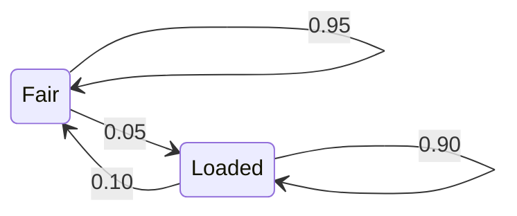

The earlier lessons treated each row as independent of the others. A sequence breaks that: what happens next depends on what happened just before. This lesson uses the two models of IX's pinned [`ix-graph`](https://github.com/GuitarAlchemist/ix/tree/490c39533627d296bf9f8f050e6fafc14d7a20c2/crates/ix-graph) crate for that, the Markov chain and the hidden Markov model. The runnable experiment is [`l10_sequences.rs`](https://github.com/spareilleux/learn/blob/main/code/machine-learning-ix/examples/l10_sequences.rs), and the hand versions are in [`sequence.rs`](https://github.com/spareilleux/learn/blob/main/code/machine-learning-ix/src/sequence.rs). [`crosscheck.py`](https://github.com/spareilleux/learn/blob/main/code/machine-learning-ix/crosscheck/crosscheck.py) recomputes everything that does not use IX's random numbers with numpy. The [journal](../journal/#2026-09-29--markov-chains-and-a-dishonest-casino) records what was measured.

| Question | Method | IX function | What the output means |
|---|---|---|---|
| Where does a chain spend its time in the long run? | Stationary distribution | `MarkovChain::stationary_distribution` | A power-iteration estimate of π with π P = π |
| How long until the chain first reaches a state? | Mean first-passage time | `MarkovChain::mean_first_passage` | A Monte Carlo average over the walks that arrived in time |
| How likely is a whole sequence of observations? | Forward algorithm | `HiddenMarkovModel::forward` | ln P(observations), summed over every hidden path |
| Which hidden path best explains them? | Viterbi | `HiddenMarkovModel::viterbi` | The single most probable path and its log-probability |
| Which hidden state is most likely at each step? | Forward–backward | `forward_backward`, `map_estimate` | Per-step posteriors; their argmax is not always a path |
| Which parameters explain the data? | Baum–Welch | `HiddenMarkovModel::baum_welch` | A local maximum of the likelihood, from one start |

The data in this lesson is made up on purpose. The course's CI tables record timings, not outcomes, so there is no real sequence of states in them. A model with a known truth is the only way to score a decoder anyway.

## 1. A Markov chain and where it settles

A [Markov chain](https://github.com/GuitarAlchemist/ix/blob/490c39533627d296bf9f8f050e6fafc14d7a20c2/crates/ix-graph/src/markov.rs) is a matrix P whose row i gives the probabilities of the next state from state i. Here are three market regimes, bull, bear and stagnant:

```text
P = [[0.90, 0.075, 0.025],
     [0.15, 0.80,  0.05 ],
     [0.25, 0.25,  0.50 ]]
```

A distribution π that the chain leaves unchanged, π P = π, is **stationary**. The hand version solves it as a linear system: (Pᵀ − I) π = 0 has one redundant equation, so the last one is replaced by π₀ + π₁ + π₂ = 1. IX's [`stationary_distribution`](https://github.com/GuitarAlchemist/ix/blob/490c39533627d296bf9f8f050e6fafc14d7a20c2/crates/ix-graph/src/markov.rs#L56) multiplies a uniform start by P until two iterates differ by less than `tol`. For this chain, both land on (5/8, 5/16, 1/16):

```text
== Markov chain: bull, bear, stagnant
  exact stationary distribution: [0.6250, 0.3125, 0.0625]
  IX power iteration:            [0.6250, 0.3125, 0.0625]
  largest gap below 1e-12: true
  is_ergodic(1): true
```

`is_ergodic(1)` is true because every entry of P is already positive. The check computes P^steps and asks whether every entry exceeds `1e-10`: with a `steps` that is too small, a chain that is ergodic reads as not ergodic.

## 2. How long until it gets there

The **mean first-passage time** mᵢ counts the steps from state i to a target state. For every i other than the target, mᵢ = 1 + Σⱼ Pᵢⱼ mⱼ, with the sum over the states j other than the target. That is one linear system, (I − Q) m = 1, where Q is P without the target's row and column. The target's own entry is its mean return time, which [Kac's lemma](https://www.ams.org/journals/bull/1947-53-10/S0002-9904-1947-08927-8/) says is 1/π. Here 1/0.0625 = 16.

IX's [`mean_first_passage`](https://github.com/GuitarAlchemist/ix/blob/490c39533627d296bf9f8f050e6fafc14d7a20c2/crates/ix-graph/src/markov.rs#L94) simulates instead. It runs `n_simulations` walks of at most `max_steps` steps and averages the arrival step over the walks that arrived. A walk that does not arrive in time is dropped without any report:

```text
== mean first passage to stagnant (state 2)
  exact, from bull, bear, stagnant: [31.4286, 28.5714, 16.0000]
  Kac: 1 / pi_2 = 16.0000
  IX, 20000 walks, at most 1000 steps: from bull 31.650, return 16.194
  IX, 20000 walks, at most   20 steps: from bull 9.836, return 3.763
  IX, 20000 walks, at most    5 steps: from bull 3.030, return 1.276
```

With 1,000 steps, almost every walk arrives and the estimate is within Monte Carlo error of 31.43. With 20 steps the function returns 9.8, and with 5 steps 3.0: it then measures the mean arrival time *given that the walk arrived within the limit*. That can never exceed the limit, whatever the true mean. For a small chain, the linear system is exact and cheaper. If you simulate, choose `max_steps` many times larger than the answer you expect.

## 3. A chain that never settles

The chain [[0, 1], [1, 0]] swaps its two states at every step. It has a stationary distribution, (½, ½), but a chain started in one state never approaches it:

```text
== a periodic chain [[0, 1], [1, 0]]
  state_distribution from [1, 0], 1 to 4 steps: [0.0, 1.0] [1.0, 0.0] [0.0, 1.0] [1.0, 0.0]
  stationary_distribution: [0.5000, 0.5000]
  is_ergodic(100): false
```

`stationary_distribution` answers (½, ½) at once, because its uniform start already is that distribution. That answer is correct, but it says nothing about convergence. `is_ergodic` is the check that catches this chain, since every power of P keeps two zeros.

## 4. Hidden states: the dishonest casino

In a hidden Markov model, the chain is not observed. Each hidden state emits a symbol with its own probabilities, and only the symbols are seen. The standard example is the occasionally dishonest casino of [Durbin, Eddy, Krogh and Mitchison](https://doi.org/10.1017/CBO9780511790492), section 3.2. A fair die shows each face with probability 1/6. A loaded die shows a six half the time and each other face with probability 1/10. The casino switches dice between rolls, and the example starts with either die with probability ½:



The example draws 1,000 rolls from this model, with the course's xorshift generator from [lesson 6](../06-ensembles/). Python replays that generator, so the cross-check sees the same rolls.

**The forward algorithm** computes P(rolls) by summing over all 2^1000 hidden paths, one step at a time: αₜ(j) = Σᵢ αₜ₋₁(i) Pᵢⱼ · bⱼ(oₜ). Written in probability space, it multiplies a thousand numbers of order 1/6 and falls below the smallest binary64 number. The hand version therefore works in log space and adds with the log-sum-exp trick. IX's [`forward`](https://github.com/GuitarAlchemist/ix/blob/490c39533627d296bf9f8f050e6fafc14d7a20c2/crates/ix-graph/src/hmm.rs#L148) rescales α at every step and sums the logarithms of the scale factors, as in [Rabiner's tutorial](https://doi.org/10.1109/5.18626):

```text
== the casino: 1000 rolls from the course's generator, seed 10
  true path: 259 loaded rolls in 23 runs; 239 sixes
  forward in probability space: T = 300 gives 8.832e-233, T = 1000 gives 0.000e0
  ln P(rolls), hand log space: -1761.7121
  ln P(rolls), IX forward:     -1761.7121
  agree within 1e-9: true
```

The plain version still has an answer at 300 rolls. At 1,000 rolls it returns 0, although the true probability is e^−1761.7.

## 5. Two ways to decode, and why they differ

[Viterbi's algorithm](https://doi.org/10.1109/TIT.1967.1054010) replaces the sum of the forward recursion by a maximum and keeps a pointer to the best predecessor. It returns the single most probable **path**. Forward–backward returns, for each roll, the **posterior** probability of each die given all the rolls. Taking the most probable die at each roll is posterior decoding, IX's [`map_estimate`](https://github.com/GuitarAlchemist/ix/blob/490c39533627d296bf9f8f050e6fafc14d7a20c2/crates/ix-graph/src/hmm.rs#L307).

```text
== decoding the 1000 rolls
  Viterbi: hand path = IX path: true; log-probabilities agree within 1e-9: true
  Viterbi: agreement with the true states 0.869; 6 loaded runs
  posteriors: hand against IX forward_backward, largest gap below 1e-9: true
  posterior decoding (map_estimate): agreement with the true states 0.876; 16 loaded runs; same as hand argmax: true
```

Posterior decoding gets slightly more rolls right, 87.6% against 86.9%, but it breaks the loaded stretches into 16 runs, while Viterbi finds 6. The truth has 23. Viterbi optimizes the whole path, so it pays for every switch. Posterior decoding optimizes each roll separately and never looks at whether its choices link up.

They may not link up at all. In the three-state model below, state 0 always moves to state 2, and states 1 and 2 always move to state 1. The model starts in 0, 1 or 2 with probability 0.4, 0.3 and 0.3, and it emits a single symbol:

```text
== when the best states are not a path
  map_estimate: [0, 1], probability of that path 0.0000
  viterbi:      [0, 2], probability 0.4000
```

At the first step, state 0 is the most probable, at 0.4. At the second, state 1 is, at 0.3 + 0.3 = 0.6. The transition 0 → 1 has probability 0, so posterior decoding returns a path the model can never produce. Use Viterbi when the answer must be a path, and the posteriors when you need a per-step confidence.

## 6. Learning the parameters: Baum–Welch

[Baum–Welch](https://doi.org/10.1214/aoms/1177697196) is expectation–maximization for an HMM. It computes the posteriors under the current parameters, re-estimates the parameters from them, and repeats. The likelihood never decreases from one iteration to the next. The example starts from a wrong guess, stay-probabilities 0.8 and a loaded die that shows a six a quarter of the time. It calls `baum_welch` with `tol = 0`, so the function runs exactly `k` iterations, for k = 1 to 10, and scores each result with `forward`:

```text
== Baum-Welch from a wrong start, on the 1000 rolls
   0 iterations: ln P = -1775.9589
   1 iterations: ln P = -1767.1374
   2 iterations: ln P = -1766.1895
   3 iterations: ln P = -1765.0041
   4 iterations: ln P = -1763.6514
   5 iterations: ln P = -1762.2635
   6 iterations: ln P = -1760.9917
   7 iterations: ln P = -1759.9472
   8 iterations: ln P = -1759.1683
   9 iterations: ln P = -1758.6270
  10 iterations: ln P = -1758.2618
  never decreases: true
  after 10: stay fair 0.8505, stay loaded 0.8271, P(six | loaded) 0.4060; truth 0.9500, 0.9000, 0.5000
```

The likelihood rises at every iteration. From the sixth iteration on, it is higher than that of the true parameters, −1761.7, yet the parameters are still far from the truth. That is not a contradiction. With one sequence of 1,000 rolls, other parameters can explain these particular rolls better than the ones that generated them. EM only promises a *local* maximum of the likelihood, from the start it was given. Nothing tells the two states apart either: a start that puts the loaded die in state 0 learns the same model with its labels swapped.

## 7. The edges of IX's API

```text
== edges
  viterbi on an impossible symbol: path [0, 0, 0], log-probability -inf
  forward on it: -inf
  backward entries all positive: true (a log-probability is never positive)
  a symbol outside the alphabet (6 on a die of 0 to 5): forward panics: true
```

- **An impossible symbol does not raise an error.** In this model, no state can emit symbol 2. Viterbi then returns a path of zeros with log-probability −∞, and `forward` returns −∞. Both values are correct, but only the −∞ reveals that the path is meaningless. Check the log-probability before using the path.
- **`backward` returns scaled probabilities, not logarithms.** Its comment calls the result a "log-probability". The table it returns holds β divided by the forward scale factors, which are positive numbers, and a log-probability is never positive.
- **A symbol outside the alphabet panics.** `new` validates the three tables but not the observations, so a 6 on a die of faces 0 to 5 indexes past the emission table.

## What to use for our repositories

- **Small chains: solve, don't simulate.** A stationary distribution or a mean first-passage time is a linear system of the size of the state space. When you simulate with `mean_first_passage`, set `max_steps` well above the answer, because walks that do not arrive are dropped without a trace.
- **Always work in log space.** IX's `forward` and `viterbi` already do. A hand-written recursion in probability space underflows after a few hundred steps.
- **Pick the decoder for the question.** Viterbi gives a consistent path, and posteriors give per-step confidence. Both can be right on the same data and still disagree.
- **Treat Baum–Welch as a search.** Run it from several starts, compare the final likelihoods, and don't read its parameters as the truth from a single sequence.

## Exercises

1. For the chain [[1 − a, a], [b, 1 − b]], show that π = (b, a)/(a + b), and give the mean return time to state 0. Check both with a = 0.3 and b = 0.2.
2. Why can the value that `mean_first_passage` returns with `max_steps = 5` never exceed 5? What would you need to report alongside it to make it honest?
3. In the three-state model of section 5, compute the posteriors of both steps by hand, and the probability of the Viterbi path.
4. Posterior decoding agreed with the true dice slightly more often than Viterbi, yet found 16 loaded runs against 23 true ones. Which decoder would you use to count how many times the casino switched dice, and why?

<details>
<summary>Solutions</summary>

1. π P = π gives π₀ a = π₁ b, and with π₀ + π₁ = 1, π = (b, a)/(a + b). By Kac's lemma, the mean return time to state 0 is 1/π₀ = (a + b)/b. With a = 0.3 and b = 0.2: π = (0.4, 0.6) and the return time is 2.5, the values the unit tests in `sequence.rs` check.
2. It averages only the walks that arrived within 5 steps, so every term of the average is at most 5. An honest estimate also reports how many walks arrived, or uses a limit so large that almost all do.
3. The observations carry no information, so the posteriors follow the chain. At step 1 they are the start, (0.4, 0.3, 0.3). At step 2: state 1 comes from state 1 or 2, 0.3 + 0.3 = 0.6; state 2 comes from state 0, 0.4; state 0 has 0. The Viterbi path is [0, 2], with probability 0.4 · 1 = 0.4. The paths [1, 1] and [2, 1] have 0.3 each.
4. Viterbi: a count of switches is a property of the whole path. Posterior decoding picks each roll separately and splits a loaded stretch whenever one roll in it looks fair. Neither is exact: Viterbi merged some true runs and found 6 against 23.

</details>

## Sources

- IX at pinned commit `490c395`: [`markov.rs`](https://github.com/GuitarAlchemist/ix/blob/490c39533627d296bf9f8f050e6fafc14d7a20c2/crates/ix-graph/src/markov.rs) and [`hmm.rs`](https://github.com/GuitarAlchemist/ix/blob/490c39533627d296bf9f8f050e6fafc14d7a20c2/crates/ix-graph/src/hmm.rs).
- R. Durbin, S. Eddy, A. Krogh and G. Mitchison, [*Biological Sequence Analysis*](https://doi.org/10.1017/CBO9780511790492), Cambridge University Press, 1998, chapter 3: the dishonest casino, Viterbi, forward–backward and Baum–Welch.
- L. R. Rabiner, ["A tutorial on hidden Markov models and selected applications in speech recognition"](https://doi.org/10.1109/5.18626), *Proceedings of the IEEE* 77, 1989: scaling of the forward and backward variables.
- A. J. Viterbi, ["Error bounds for convolutional codes and an asymptotically optimum decoding algorithm"](https://doi.org/10.1109/TIT.1967.1054010), *IEEE Transactions on Information Theory* 13, 1967.
- L. E. Baum, T. Petrie, G. Soules and N. Weiss, ["A maximization technique occurring in the statistical analysis of probabilistic functions of Markov chains"](https://doi.org/10.1214/aoms/1177697196), *Annals of Mathematical Statistics* 41, 1970.
- M. Kac, ["On the notion of recurrence in discrete stochastic processes"](https://www.ams.org/journals/bull/1947-53-10/S0002-9904-1947-08927-8/), *Bulletin of the AMS* 53, 1947.
