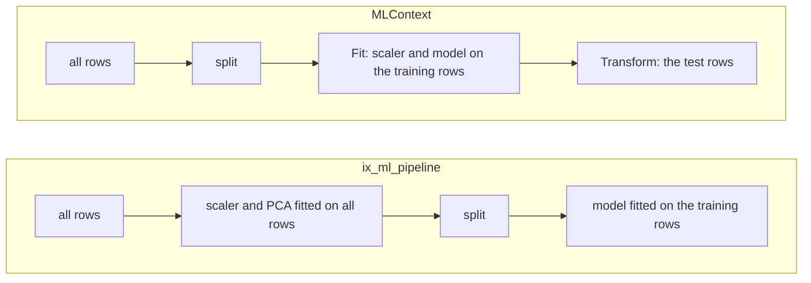

A machine learning *pipeline* chains the steps from raw data to a score, and it must learn every step from the training rows only. [ML.NET](https://learn.microsoft.com/dotnet/machine-learning/) expresses this with [`MLContext`](https://learn.microsoft.com/dotnet/api/microsoft.ml.mlcontext):
- the transforms and the trainer are *estimators*, chained with [`Append`](https://learn.microsoft.com/dotnet/api/microsoft.ml.learningpipelineextensions.append);
- a single [`Fit`](https://learn.microsoft.com/dotnet/api/microsoft.ml.iestimator-1.fit) on the training set learns all of them;
- the fitted model then [transforms](https://learn.microsoft.com/dotnet/api/microsoft.ml.itransformer.transform) the test set.

scikit-learn's [`Pipeline`](https://scikit-learn.org/stable/modules/generated/sklearn.pipeline.Pipeline.html) does the same, and its guide explains why under [data leakage](https://scikit-learn.org/stable/common_pitfalls.html#data-leakage).

IX has two things called a pipeline, both at the pinned commit:
- [`ix-pipeline`](https://github.com/GuitarAlchemist/ix/tree/490c39533627d296bf9f8f050e6fafc14d7a20c2/crates/ix-pipeline) is a general executor. It runs a directed acyclic graph (DAG) of steps that exchange JSON, built in Rust or *lowered* from an `ix.yaml` file whose stages call IX's skills.
- `ix_ml_pipeline` is a fixed chain of steps, served as a *tool* by [`ix-agent`](https://github.com/GuitarAlchemist/ix/tree/490c39533627d296bf9f8f050e6fafc14d7a20c2/crates/ix-agent)'s server. A server speaks the [Model Context Protocol](https://modelcontextprotocol.io/specification/2024-11-05/) (MCP): an assistant starts it and sends one [JSON-RPC 2.0](https://www.jsonrpc.org/specification) message per line on its standard input. It answers on its standard output, and logs on its standard error. `initialize` opens the session, [`tools/list`](https://modelcontextprotocol.io/specification/2024-11-05/server/tools) lists the tools, and `tools/call` calls one.

The [journal](../journal/#2026-09-30--lesson-21-predicted-before-measuring) holds eight predictions, P1 to P8, written from the source and committed before any code of this lesson ran. Section 13 scores them.

## 1. What runs where

`ix-pipeline` adds no package to the course's `Cargo.lock`, so P1 to P5 run on the three CI systems, in [`examples/l21_pipelines.rs`](https://github.com/spareilleux/learn/blob/main/code/machine-learning-ix/examples/l21_pipelines.rs). The same example replays the tool's steps with IX's own functions: `train_test_split`, `StandardScaler`, `KNN`, `LinearRegression` and the metrics.

The tool itself needs `ix-agent`. Depending on it would add 197 packages to the course's lock, measured by resolving a copy of the manifest: 225 packages become 422. Instead, its server binary, `ix-mcp`, is built at the pinned commit outside the repository. The build starts from the course's `Cargo.lock`, so that ndarray, rand and the other crates both share keep the course's versions. [`src/mcp.rs`](https://github.com/spareilleux/learn/blob/main/code/machine-learning-ix/src/mcp.rs) is a small client:
- it starts the server in an empty directory of its own;
- it writes one line per message and reads the answers on a thread;
- it gives each request a deadline, 30 seconds, or 10 where the prediction says no answer comes.

[`src/bin/l21_mcp.rs`](https://github.com/spareilleux/learn/blob/main/code/machine-learning-ix/src/bin/l21_mcp.rs) prints what the lesson quotes, saved in `local/l21_mcp.txt`. [`tests/l21_mcp.rs`](https://github.com/spareilleux/learn/blob/main/code/machine-learning-ix/tests/l21_mcp.rs) holds one ignored test per prediction, which CI skips.

This is P5's call, the 20 rows cut short here:

```json
{"jsonrpc":"2.0","id":2,"method":"tools/call","params":{"name":"ix_ml_pipeline","arguments":{"source":{"type":"inline","data":[[0.0,0.0,1.0],[0.1,0.0,1.0],[0.2,0.0,1.0],[0.3,0.0,1.0],[0.4,0.0,1.0],[0.0,0.1,1.0],[0.1,0.1,1.0],[0.2,0.1,1.0],[0.3,0.1,1.0],[0.4,0.1,1.0],[5.0,5.0,2.0],[5.1,5.0,2.0],[5.2,…
```

The `arguments` go on with the other rows, then `"target_column":2`, `"split":{"test_ratio":0.3,"seed":42}` and `"return_predictions":true`. The answer's `result.content[0].text` is the tool's result as indented JSON:

```json
{
  "data_shape": {
    "features": 2,
    "rows": 20
  },
  "metrics": {
    "accuracy": 1.0,
    "f1": 0.6666666666666666,
    "precision": 0.6666666666666666,
    "recall": 0.6666666666666666
  },
  "model": "knn",
  "model_params": {
    "k": 5
  },
  "persisted": false,
  "predictions": [
    1,
    2,
    2,
    2,
    1,
    1
  ],
  "preprocessing": {
    "nan_rows_dropped": 0,
    "normalized": false
  },
  "split": {
    "test": 6,
    "train": 14
  },
  "task": "classify",
  "timing_ms": 0
}
```

An accuracy of 1 and a precision of 2/3, with every prediction right: section 7 explains the gap. An error comes back as the text `Error: …` with `isError` set ([`main.rs` 281-301](https://github.com/GuitarAlchemist/ix/blob/490c39533627d296bf9f8f050e6fafc14d7a20c2/crates/ix-agent/src/main.rs#L281-L301)). The client compares numbers bit for bit: it takes each number from this text as written and parses it with the standard library, which rounds correctly.

## 2. A parallel executor that runs in turn

The crate's doc says that "Independent branches run in parallel" ([`lib.rs` 3-5](https://github.com/GuitarAlchemist/ix/blob/490c39533627d296bf9f8f050e6fafc14d7a20c2/crates/ix-pipeline/src/lib.rs#L3-L5)), and `execute`'s that nodes in a level "execute in parallel using std threads" ([`executor.rs` 115-118](https://github.com/GuitarAlchemist/ix/blob/490c39533627d296bf9f8f050e6fafc14d7a20c2/crates/ix-pipeline/src/executor.rs#L115-L118)). P1 builds a diamond with [`PipelineBuilder`](https://github.com/GuitarAlchemist/ix/blob/490c39533627d296bf9f8f050e6fafc14d7a20c2/crates/ix-pipeline/src/builder.rs): `load` feeds `a` and `b`, which both feed `report`. Each compute function records the thread it runs on, and `a` and `b` sleep 50 ms each. Shortened from [`src/pipeline.rs`](https://github.com/spareilleux/learn/blob/main/code/machine-learning-ix/src/pipeline.rs):

```rust
let dag = PipelineBuilder::new()
    .source("load", || Ok(json!(1.0)))
    .node("a", |b| b.input("x", "load").compute(|i| {
        thread::sleep(nap);
        Ok(json!(i["x"].as_f64().unwrap() + 1.0))
    }))
    .node("b", |b| b.input("x", "load").compute(/* the same, + 2.0 */))
    .node("report", |b| b.input("a", "a").input("b", "b").compute(/* a + b */))
    .build()?;
let result = execute(&dag, &HashMap::new(), &NoCache)?;
```

```
== P1, a diamond: load -> a and b -> report, a and b sleeping 50 ms each
  parallel_levels: [["load"], ["a", "b"], ["report"]]
  compute functions run: 4, all on the thread that called execute: yes
  total_duration at least 100 ms: yes; report = 5.0
```

`a` and `b` share a level, and they run one after the other. The branch for a level of several nodes maps an iterator over the nodes and calls each compute function in turn ([`executor.rs` 163-211](https://github.com/GuitarAlchemist/ix/blob/490c39533627d296bf9f8f050e6fafc14d7a20c2/crates/ix-pipeline/src/executor.rs#L163-L211)). Its comment says that `ComputeFn` "isn't Send", but the type is declared `Send + Sync` ([`executor.rs` 11-13](https://github.com/GuitarAlchemist/ix/blob/490c39533627d296bf9f8f050e6fafc14d7a20c2/crates/ix-pipeline/src/executor.rs#L11-L13)). Nothing stops a [`std::thread::scope`](https://doc.rust-lang.org/std/thread/fn.scope.html) from running the level's nodes side by side (exercise 1). The results are right; only the promised speed is missing.

## 3. A cache key without the computation

[`PipelineCache`](https://github.com/GuitarAlchemist/ix/blob/490c39533627d296bf9f8f050e6fafc14d7a20c2/crates/ix-pipeline/src/executor.rs#L94-L103) is the seam to "connect to `ix-cache` or any other cache". The key it receives is `pipeline:`, the node's id, and an FNV-1a hash of the node's inputs ([`executor.rs` 309-325](https://github.com/GuitarAlchemist/ix/blob/490c39533627d296bf9f8f050e6fafc14d7a20c2/crates/ix-pipeline/src/executor.rs#L309-L325)). What the node computes isn't in it. P2 shares one in-memory cache between two one-node pipelines, whose node `f` reads the input `value` = 10:

```
== P2, one cache shared by two pipelines: f(x) = x + 1, then f(x) = 2x, on value = 10
  x + 1: output 11, cache hits 0
  2x: output 11, cache hits 1
```

2 × 10 is 20. The second pipeline gets the first one's answer, because both keys are `pipeline:f:` and the hash of `{"x": 10}`. The same happens to an `ix.yaml` stage whose `args` change between two runs. `lower` keeps a stage's `args` inside the compute closure, and the inputs hold only the upstream outputs ([`lower.rs` 89-105](https://github.com/GuitarAlchemist/ix/blob/490c39533627d296bf9f8f050e6fafc14d7a20c2/crates/ix-pipeline/src/lower.rs#L89-L105)). Every caller at the pinned commit passes `NoCache`, so the defect waits for the first cache (exercise 2).

## 4. Final outputs, and a field that isn't there

```
== P3, final_outputs and input_field
  final_outputs on the diamond: 4 entries, for 1 leaf
  field "missing" of {"a": 1}: {"a":1}; field "a": 1
```

`final_outputs` is documented as returning the leaf nodes' outputs, and returns every node's, under a comment that reads "Can't easily determine without the DAG" ([`executor.rs` 58-71](https://github.com/GuitarAlchemist/ix/blob/490c39533627d296bf9f8f050e6fafc14d7a20c2/crates/ix-pipeline/src/executor.rs#L58-L71)); the DAG does have [`leaves()`](https://github.com/GuitarAlchemist/ix/blob/490c39533627d296bf9f8f050e6fafc14d7a20c2/crates/ix-pipeline/src/dag.rs#L160-L169). [`input_field`](https://github.com/GuitarAlchemist/ix/blob/490c39533627d296bf9f8f050e6fafc14d7a20c2/crates/ix-pipeline/src/builder.rs#L73-L78) reads one field of an upstream output. When the field is missing, the executor passes the whole output instead, without an error ([`executor.rs` 286-295](https://github.com/GuitarAlchemist/ix/blob/490c39533627d296bf9f8f050e6fafc14d7a20c2/crates/ix-pipeline/src/executor.rs#L286-L295)). A misspelt field name then fails further down, in the node that expected a number, or not at all.

## 5. A hash under another's name, and an empty registry

`ix pipeline run` writes a lock file that records each stage's `args_hash`, documented as "fnv1a64 over the canonicalized **template** args" ([`lock.rs` 50-51](https://github.com/GuitarAlchemist/ix/blob/490c39533627d296bf9f8f050e6fafc14d7a20c2/crates/ix-pipeline/src/lock.rs#L50-L51)). P4 calls [`LockFile::from_run`](https://github.com/GuitarAlchemist/ix/blob/490c39533627d296bf9f8f050e6fafc14d7a20c2/crates/ix-pipeline/src/lock.rs#L107-L111) on a stage `load` whose args are `{"data": [1.0, 2.0]}`, and recomputes the hash two ways:

```
== P4, the lock file's args_hash, and lower without a linked skill
  canonical args: {"data":[1.0,2.0]}
  args_hash:                        fnv1a64:4762d1a4ed81a34d
  DefaultHasher of that string:     fnv1a64:4762d1a4ed81a34d  same: yes
  FNV-1a 64 of the same bytes:      fnv1a64:8091c3ce6ff9b24c  same: no
  lower(PipelineSpec::scaffold("demo")): stage 'load' references unknown skill 'stats'
```

`hash_json` feeds the canonical string to the standard library's `DefaultHasher` and prints the result after `fnv1a64:` ([`lock.rs` 317-327](https://github.com/GuitarAlchemist/ix/blob/490c39533627d296bf9f8f050e6fafc14d7a20c2/crates/ix-pipeline/src/lock.rs#L317-L327)). The [`DefaultHasher`](https://doc.rust-lang.org/std/collections/hash_map/struct.DefaultHasher.html) documentation warns that its "internal algorithm is not specified, and so it and its hashes should not be relied upon over releases". The Python cross-check computes FNV-1a from its definition and finds `8091c3ce6ff9b24c`, the value the label promises; no one outside Rust's standard library can recompute the other. A lock file is meant to be compared with a later run's, possibly built with a later Rust. The fix is one call: the executor already computes FNV-1a for its cache key.

The last line comes from [`lower`](https://github.com/GuitarAlchemist/ix/blob/490c39533627d296bf9f8f050e6fafc14d7a20c2/crates/ix-pipeline/src/lower.rs#L58-L64), which looks each stage's skill up in `ix-registry`. That registry is a slice "populated at link time by every `#[ix_skill]` annotation" ([`lib.rs` 69-72](https://github.com/GuitarAlchemist/ix/blob/490c39533627d296bf9f8f050e6fafc14d7a20c2/crates/ix-registry/src/lib.rs#L69-L72)), and IX's skills live in `ix-agent`. A program that depends on `ix-pipeline` alone, like this course, links no skill, so the scaffold that `ix pipeline new` writes can't be lowered. That is a design, not a defect, but the crate's page doesn't say it: to run a spec, link `ix-agent`, or use IX's command line.

## 6. The tool, step by step

`run_pipeline` in [`ml_pipeline.rs`](https://github.com/GuitarAlchemist/ix/blob/490c39533627d296bf9f8f050e6fafc14d7a20c2/crates/ix-agent/src/ml_pipeline.rs) runs these steps, in this order:
1. **Load.** It reads a CSV file, or the inline rows. [`read_csv`](https://github.com/GuitarAlchemist/ix/blob/490c39533627d296bf9f8f050e6fafc14d7a20c2/crates/ix-io/src/csv_io.rs#L10-L38) turns every field that isn't a number into NaN.
2. **Drop NaN.** It drops every row that holds a NaN, in a feature or in the target ([167-188](https://github.com/GuitarAlchemist/ix/blob/490c39533627d296bf9f8f050e6fafc14d7a20c2/crates/ix-agent/src/ml_pipeline.rs#L167-L188)).
3. **Normalize and reduce.** With `normalize`, it fits a `StandardScaler` on all rows ([190-195](https://github.com/GuitarAlchemist/ix/blob/490c39533627d296bf9f8f050e6fafc14d7a20c2/crates/ix-agent/src/ml_pipeline.rs#L190-L195)); with `pca_components`, it fits a PCA on all rows too.
4. **Choose.** With `auto`, it infers the task and picks a model ([208-228](https://github.com/GuitarAlchemist/ix/blob/490c39533627d296bf9f8f050e6fafc14d7a20c2/crates/ix-agent/src/ml_pipeline.rs#L208-L228), [507-522](https://github.com/GuitarAlchemist/ix/blob/490c39533627d296bf9f8f050e6fafc14d7a20c2/crates/ix-agent/src/ml_pipeline.rs#L507-L522)). At most 20 distinct non-negative integers make a classification, and `knn` is picked below 100 rows.
5. **Split, fit, score.** It splits, 20% for the test with the seed 42 by default, then fits and scores ([704-705](https://github.com/GuitarAlchemist/ix/blob/490c39533627d296bf9f8f050e6fafc14d7a20c2/crates/ix-agent/src/ml_pipeline.rs#L704-L705)).
6. **Persist.** On request, it keeps the model's state and the scaler in a cache in memory, under a key ([273-304](https://github.com/GuitarAlchemist/ix/blob/490c39533627d296bf9f8f050e6fafc14d7a20c2/crates/ix-agent/src/ml_pipeline.rs#L273-L304)).

Steps 3 and 5 are where it parts from `MLContext`:



## 7. Classes that aren't there

`run_classification` turns the labels into classes with `round() as usize` and counts `max + 1` classes ([533-534](https://github.com/GuitarAlchemist/ix/blob/490c39533627d296bf9f8f050e6fafc14d7a20c2/crates/ix-agent/src/ml_pipeline.rs#L533-L534)). It then averages precision, recall and F1 over every class from 0 to the largest ([655-670](https://github.com/GuitarAlchemist/ix/blob/490c39533627d296bf9f8f050e6fafc14d7a20c2/crates/ix-agent/src/ml_pipeline.rs#L655-L670)). IX's [`precision`](https://github.com/GuitarAlchemist/ix/blob/490c39533627d296bf9f8f050e6fafc14d7a20c2/crates/ix-supervised/src/metrics.rs#L102-L118) returns 0 for a class never predicted. So labels 1 and 2 bring in a class 0 that no row holds, and its zeros pull the average down:

```
== P5, labels 1 and 2, all predicted right
  the tool's loop over classes 0 to 2: precision 0.6666666666666666, recall 0.6666666666666666, f1 0.6666666666666666
  precision_avg, recall_avg, f1_avg with Average::Macro: 0.6666666666666666, 0.6666666666666666, 0.6666666666666666
  labels 0 and 1, the tool's loop over classes 0 and 1: 1, 1, 1
```

IX's own [`precision_avg`](https://github.com/GuitarAlchemist/ix/blob/490c39533627d296bf9f8f050e6fafc14d7a20c2/crates/ix-supervised/src/metrics.rs#L194-L211) makes the same count, so the library and the tool agree with each other. scikit-learn's macro average uses the labels present, and gives 1. The cross-check prints both:

```
labels 1 and 2, all right: scikit-learn macro 1 1 1
the same with labels=[0, 1, 2], as the tool counts them: 0.6666666666666666 0.6666666666666666 0.6666666666666666
```

Through the tool, the same holds bit for bit. The P5 answer of section 1 has both classes among its test predictions, and 2/3 everywhere but in the accuracy; labelled 0 and 1, the same rows give 1.

The count gets worse with real targets. Lesson 1's `builds.csv` has 18 distinct build durations, all whole seconds and the largest 48, so the task inference calls them a classification. `run_classification` then counts 49 classes, and 13 test rows can hold at most 13 of them:

```
  build_seconds: 18 distinct values, all whole: yes; task and model on auto: classify, knn
  knn, k = 5, 52 training and 13 test rows, 49 classes counted: accuracy 0.153846, precision 0.030612, recall 0.030612, f1 0.027211
```

## 8. Lesson 1's three items, run

[Lesson 1](../01-data-and-evaluation/) read three behaviours of this tool without running them. Through the server:

```
== P6, lesson 1's three items to verify, through the tool
  (a) builds.csv as it is: error: Error: execution failed: All rows contain NaN values
  (b) pages and build_seconds, defaults: task "classify", model "knn", 52 training and 13 test rows
      tool:   accuracy, precision, recall, f1 = [0.15384615384615385, 0.030612244897959183, 0.030612244897959183, 0.027210884353741496]
      replay: accuracy, precision, recall, f1 = [0.15384615384615385, 0.030612244897959183, 0.030612244897959183, 0.027210884353741496]
      same bits: 4 of 4
  (c) task regress, normalize on: ok; model "linear_regression", 13 predictions returned
      same bits as the replay that fits the scaler on all 65 rows: 16 of 16
      same bits as the replay that splits first and fits it on the 52 training rows: 3 of 16
      largest difference from the training-rows replay: 1.4210854715202004e-14
      mse 63.847900084610906, rmse 7.990488100523704, r2 0.0427346420955248
```

- **(a)** The file's date and commit columns aren't numbers, so every row holds a NaN and every row goes. The error doesn't say which column.
- **(b)** Section 7's 49 classes, equal bit for bit to the replay with IX's functions.
- **(c)** The tool's 13 predictions and 3 metrics are those of the replay that fits the scaler before splitting, to the last bit. They differ from the leak-free order in 13 of 16 numbers, by at most 1.4·10⁻¹⁴. In exact arithmetic, a linear regression with an intercept gives the same predictions after any affine rescaling of its features: the weights absorb the scale and the intercept absorbs the shift. So this model hides the leak, and only rounding shows the order.

A distance-based model, like the `knn` the tool picks for small classifications, doesn't absorb the scaling when there are two features or more (exercise 4). The lesson didn't measure it; *to verify*.

## 9. MLContext's order, as an ix-pipeline DAG

`ix-pipeline` can express the leak-free order: each step is a node, and the scaler is fitted by a node that reads only the training rows. Shortened from `leak_free_dag` in `src/pipeline.rs`:

```rust
PipelineBuilder::new()
    .source("data", move || Ok(data.clone()))
    .node("split", |b| b.input("d", "data").compute(/* train_test_split(x, y, 0.2, 42) */))
    .node("scaler", |b| b.input_field("x", "split", "x_train").compute(/* StandardScaler::fit */))
    .node("scale", |b| b.input("s", "split").input("c", "scaler").compute(/* transform both sides */))
    .node("fit_predict", |b| b.input("x", "scale").input_field("y", "split", "y_train").compute(/* LinearRegression */))
    .node("score", |b| b.input("p", "fit_predict").input_field("y", "split", "y_test").compute(/* mse, rmse, r2 */))
    .build()?
```

```
== The order ML.NET's MLContext follows, as an ix-pipeline DAG
  levels: [["data"], ["split"], ["scaler"], ["scale"], ["fit_predict"], ["score"]]
  the same 16 numbers as the training-rows replay, bit for bit: 16 of 16
```

The data travel between nodes as JSON, and `serde_json` keeps an `f64` exactly, so the DAG reproduces the replay bit for bit. What `MLContext` adds is the fitted model as a value: here the scaler's means and deviations are a node's output, and applying them to a new row means building another DAG.

## 10. A persisted model that can't predict

`persist` stores the model's `model_state` and the scaler, not the PCA ([273-304](https://github.com/GuitarAlchemist/ix/blob/490c39533627d296bf9f8f050e6fafc14d7a20c2/crates/ix-agent/src/ml_pipeline.rs#L273-L304)). `model_state` is null for `knn`, random forests and the transformer ([555](https://github.com/GuitarAlchemist/ix/blob/490c39533627d296bf9f8f050e6fafc14d7a20c2/crates/ix-agent/src/ml_pipeline.rs#L555), [587-592](https://github.com/GuitarAlchemist/ix/blob/490c39533627d296bf9f8f050e6fafc14d7a20c2/crates/ix-agent/src/ml_pipeline.rs#L587-L592), [646-650](https://github.com/GuitarAlchemist/ix/blob/490c39533627d296bf9f8f050e6fafc14d7a20c2/crates/ix-agent/src/ml_pipeline.rs#L646-L650)). `ix_ml_predict` handles linear regression, decision trees and k-means only ([384-419](https://github.com/GuitarAlchemist/ix/blob/490c39533627d296bf9f8f050e6fafc14d7a20c2/crates/ix-agent/src/ml_pipeline.rs#L384-L419)). P7 runs on one server:

```
== P7, one server: a persisted knn, then a prediction that panics
  (a) P5's rows persisted as l21-knn: ok, persisted true
      ix_ml_predict on l21-knn: error: Error: execution failed: Prediction not supported for algorithm 'knn'
  (b) 10 rows of 3 features, normalize, pca_components 1, persisted as l21-pca: ok, data_shape {"features":1,"rows":10}
      ix_ml_predict on a row of 3 features: no response
      stderr: ndarray: inputs 1 × 3 and 1 × 1 are not compatible for matrix multiplication
```

- **(a)** The tool says `persisted: true` for a model it can't reload. The small classifications where `auto` picks `knn`, below 100 rows, can't be persisted usefully at all.
- **(b)** The PCA isn't stored, so the model expects 1 feature and receives the 3 the scaler returns. [`LinearRegression::predict`](https://github.com/GuitarAlchemist/ix/blob/490c39533627d296bf9f8f050e6fafc14d7a20c2/crates/ix-supervised/src/linear_regression.rs#L76-L79) computes `x.dot(w)`, and ndarray panics when the shapes disagree. The client never gets an answer.

## 11. One panic, every later call unanswered

The server runs each `tools/call` on a thread of its own, which writes the answer when the tool returns ([`main.rs` 175-187](https://github.com/GuitarAlchemist/ix/blob/490c39533627d296bf9f8f050e6fafc14d7a20c2/crates/ix-agent/src/main.rs#L175-L187)). A panic ends that thread before it writes anything, and nothing catches it. There is worse. Every tool registered with `#[ix_skill]`, `ix_ml_pipeline` and `ix_ml_predict` among them, goes through `dispatch_action`. That function holds the middleware chain's mutex while the skill runs ([`registry_bridge.rs` 221-250](https://github.com/GuitarAlchemist/ix/blob/490c39533627d296bf9f8f050e6fafc14d7a20c2/crates/ix-agent/src/registry_bridge.rs#L221-L250)). A thread that panics while holding a [`Mutex`](https://doc.rust-lang.org/std/sync/struct.Mutex.html#poisoning) poisons it, and every later `lock()` returns an error, which `dispatch_action` turns into a panic with `expect`:

```
  (c) tools/list afterwards: 97 tools
      P5's valid ix_ml_pipeline call afterwards: no response
      stderr: middleware chain mutex poisoned: PoisonError { .. }
      panics on stderr: 2
```

`tools/list` still answers, because the reading loop handles it without the chain. The valid call that answered in section 1 now gets no response, and neither will any other registered skill until the server restarts. An assistant that waits without a deadline hangs on the first call; one with a deadline sees every skill time out. Read in the same function, not measured: the lock also serializes the skills, so two calls never run theirs at the same time, whatever the threads. The fix is small (exercise 5): release the lock before calling the skill, or turn a panic into an error with [`catch_unwind`](https://doc.rust-lang.org/std/panic/fn.catch_unwind.html).

## 12. Two gates in front of the skill

The middleware chain runs a loop detector, then an approval policy, before the skill ([`registry_bridge.rs` 65-82](https://github.com/GuitarAlchemist/ix/blob/490c39533627d296bf9f8f050e6fafc14d7a20c2/crates/ix-agent/src/registry_bridge.rs#L65-L82)). P8 starts a fresh server:

```
== P8, a fresh server: the loop detector, then the approval policy
  ix_ml_pipeline, seed 1: ok
  …
  ix_ml_pipeline, seed 10: ok
  ix_ml_pipeline, seed 11: error: Error: ix_loop_detect: circuit breaker tripped on tool 'ix_ml_pipeline' — circuit breaker tripped: 11 calls in the last 300s exceeds threshold 10. The agent should stop calling this tool and reconsider its approach. This is a governance-instrument safety check, not a transient error.
  ix_ml_predict on an unknown key: error: Error: execution failed: No persisted model found for key 'l21-nothing-here'
  tools/list: 97 tools; of the six in neither approval list, listed: 6
  ix_petri_analyze: error: Error: ix_approval: action blocked (ApprovalRequired) — action requires explicit approval (tier: tier_three, rationale: 1 evidence item(s))
```

- **The loop detector.** It counts calls per tool name, whatever the arguments ([`action.rs` 112-124](https://github.com/GuitarAlchemist/ix/blob/490c39533627d296bf9f8f050e6fafc14d7a20c2/crates/ix-agent-core/src/action.rs#L112-L124)), and trips above 10 in 5 minutes ([`lib.rs` 105-112](https://github.com/GuitarAlchemist/ix/blob/490c39533627d296bf9f8f050e6fafc14d7a20c2/crates/ix-loop-detect/src/lib.rs#L105-L112)). Eleven calls with eleven different seeds are not a loop, but they are blocked as one: a seed sweep or a cross-validation of more than 10 folds has to wait 5 minutes. Other tools still pass, as the `ix_ml_predict` line shows.
- **The approval policy.** It sorts tools by name into two hand-written lists, those that only read and those that edit, and blocks every tool in neither as the riskiest tier ([`classify.rs` 69-157](https://github.com/GuitarAlchemist/ix/blob/490c39533627d296bf9f8f050e6fafc14d7a20c2/crates/ix-approval/src/classify.rs#L69-L157), [`middleware.rs` 206-219](https://github.com/GuitarAlchemist/ix/blob/490c39533627d296bf9f8f050e6fafc14d7a20c2/crates/ix-approval/src/middleware.rs#L206-L219)). Six of the tools `ix-agent` registers are in neither list, among them four queries of IX's assumption graph. `tools/list` still advertises all six, and every call to them is refused. Refusing by default is the safe choice; the defect is that the lists and the registrations are kept by hand, apart.

## 13. The predictions, scored

| | Prediction, written before the first run | Measured | Verdict |
|---|---|---|---|
| P1 | `a` and `b` in one level; the 4 compute functions on the calling thread; `total_duration` at least 100 ms | As predicted | Confirmed |
| P2 | One shared cache: x + 1 returns 11 with no hit; 2x returns 11 too, with one hit | As predicted | Confirmed |
| P3 | `final_outputs` has 4 entries; the field `missing` of `{"a": 1}` gives `{"a": 1}`, the field `a` gives 1 | As predicted | Confirmed |
| P4 | `args_hash` is `fnv1a64:` and `DefaultHasher`'s hash, not FNV-1a's; `lower` on the scaffold fails on the unknown skill `stats` | `4762d1a4ed81a34d` against `8091c3ce6ff9b24c`; the message as predicted | Confirmed |
| P5 | `0.6666666666666666` three times on CI, 1 for scikit-learn; through the tool, `knn`, accuracy 1, k/3, and k/2 for labels 0 and 1 | As predicted; k = 2 in both | Confirmed |
| P6 | (a) "All rows contain NaN values"; (b) `classify`, `knn`, 52 and 13 rows, the replay's four numbers bit for bit; (c) 16 of 16 bits as the all-rows replay, and at least one of 16 different from the training-rows replay | (b) 4 of 4; (c) 16 of 16, and 13 of 16 different | Confirmed |
| P7 | (a) `persisted` true, then "Prediction not supported for algorithm 'knn'"; (b) 1 feature, no response within 10 s, ndarray's message; (c) `tools/list` answers, the valid call gets no response, "middleware chain mutex poisoned" | As predicted | Confirmed |
| P8 | 10 results then the loop detector's error with "11 calls"; `ix_ml_predict` reaches its skill; the six tools listed; `ix_petri_analyze` blocked at tier three | As predicted | Confirmed |

All eight held on the first run, and no prediction was changed afterwards. The controls show that the checks can fail:
- labels 0 and 1 give 1, so P5's check isn't always 2/3;
- the training-rows replay differs from the tool, so P6's bit comparison can tell two orders apart;
- `ix_ml_predict` passes the loop detector after `ix_ml_pipeline` trips it, so the count is per tool.

The number of tools listed, 97, was printed without a prediction.

## What to use for our repositories

- **`ix-pipeline`:** a sound small DAG. Its levels, `critical_path` and the lock file's provenance fields are worth having. Don't count on its parallelism, don't plug in a cache before the key covers the computation, and read a field with `input_field` only if its absence can't go unnoticed.
- **Lock files:** compare `args_hash` only between binaries built with the same Rust release, or recompute FNV-1a yourself.
- **`ix_ml_pipeline`:** fine for a first look through an assistant. For a figure you'll quote:
  - give `task` and `model` explicitly, since the inference turns whole-second durations into 49 classes;
  - read the macro metrics only when the labels are 0 to n − 1 and all present;
  - use `normalize` only with a model that is invariant to it, or split first yourself.
- **Persisting:** only `linear_regression`, `decision_tree` and `kmeans` can predict again, and never after `pca_components`.
- **A client of `ix-mcp`:** give every call a deadline, and restart the server after one goes unanswered: after a panic, no registered skill answers again.
- **Batches:** more than 10 calls of one tool in 5 minutes trip the loop detector, so batch the work inside one call, or space the calls.

## Exercises

1. Rewrite the branch of `execute` for a level of several nodes with `std::thread::scope`, so that `a` and `b` of section 2 run at the same time. Why does it compile, and what must stay on the calling thread?
2. Propose a cache key for a node lowered from `ix.yaml` that can't return another stage's answer. What must it contain, and what must a node built with `PipelineBuilder` supply?
3. Labels 1 and 2, every prediction right, and a test set that holds only class 2. What precision, recall and F1 does the tool report, and what does scikit-learn's macro average give?
4. Why does a linear regression with an intercept give the same predictions, in exact arithmetic, whether the scaler learns from all rows or from the training rows? Why does k nearest neighbours with one feature too, and why not with two?
5. Change `dispatch_action` so that a panicking skill returns an error, and later calls work. Give two ways, and what each costs.

<details>
<summary>Solutions</summary>

1. Replace the iterator by a scope that spawns one thread per node and joins them all. A sketch, not compiled against IX's crate:

   ```rust
   let shared = &outputs;
   let results: Vec<Result<(NodeId, NodeResult), PipelineError>> = thread::scope(|s| {
       let handles: Vec<_> = level
           .iter()
           .map(|&id| s.spawn(move || {
               execute_node(id, dag.get(id).unwrap(), shared, cache).map(|r| (id.clone(), r))
           }))
           .collect();
       handles.into_iter().map(|h| h.join().unwrap()).collect()
   });
   ```

   It compiles because a scoped thread may borrow from the caller, and everything it borrows can cross threads. The node's `ComputeFn` is `Send + Sync`, `outputs` is an `Arc<Mutex<…>>`, and `cache` is a `&dyn PipelineCache`, whose trait requires `Send + Sync`. Two things stay on the calling thread. Gathering the inputs must happen after the previous level, which the level order already guarantees. Counting cache hits and filling `node_results` happen after the join. A panic in a node now surfaces at `join`, where the executor can turn it into a `PipelineError`.
2. The key must name what the node computes, not only what it reads. For a lowered stage, take the skill's name, a hash of its `args` after the `{"from"}` references are resolved, and the hash of the inputs. The resolved args matter because a reference can change what a stage does. `PipelineNode` has no such field, so add one, say `fingerprint: String`, filled by `lower`. A node built with `PipelineBuilder` wraps an arbitrary closure, which can't be hashed. Its author must give a fingerprint, a version string for instance, or the node must be `no_cache`.
3. The tool counts classes 0, 1 and 2:
   - class 0: no row, so precision 0, recall 0 and F1 0;
   - class 1: no row and no prediction, so 0, 0 and 0 again;
   - class 2: 1, 1 and 1.

   Each average is 1/3, printed `0.3333333333333333`, and the accuracy is 1. scikit-learn's macro average uses the labels present, here only 2, and gives 1.
4. A standard scaler maps each feature x to (x − m)/s with s > 0. A linear model w·x + b then equals (w·s)·x' + (b + w·m) on the scaled feature, so least squares over (w, b) finds the same function on either side, and the same predictions. Only the rounding differs, which is what section 8 measured. With one feature, the map is increasing, so the order of the distances between rows doesn't change, and neither do the nearest neighbours. With two features, each gets its own s, and the relative weight of the features in the distance depends on the ratio of the two deviations. That ratio isn't the same on all rows and on the training rows, so a neighbour can change.
5. There are two ways:
   - **Don't hold an exclusive lock across the skill.** The chain sits in a `Mutex` only so that tests can replace it, and production "should treat it as read-only" ([`registry_bridge.rs` 62-65](https://github.com/GuitarAlchemist/ix/blob/490c39533627d296bf9f8f050e6fafc14d7a20c2/crates/ix-agent/src/registry_bridge.rs#L62-L65)). Put it in an [`RwLock`](https://doc.rust-lang.org/std/sync/struct.RwLock.html#poisoning) and dispatch under a read guard: a panic in a reader doesn't poison it, and skills can run side by side. The cost: each middleware that keeps state must then synchronize it itself. That concerns the loop detector's window, and the belief middleware, which observes outcomes through a hook after the skill.
   - **Catch the panic.** Wrap the skill in `std::panic::catch_unwind(AssertUnwindSafe(|| …))` and return `Err("skill panicked: …")`, and lock with `.lock().unwrap_or_else(PoisonError::into_inner)`. The cost: `catch_unwind` doesn't catch an abort. Asserting unwind safety also claims that the chain's state is consistent after a panic in the middle of a dispatch, which someone has to check. That is what poisoning exists to flag.

   In both, the worker must write an error answer when the skill fails, so that the client never waits forever.

</details>

## Sources

- IX at pinned commit `490c395`:
  - `ix-pipeline`: [`lib.rs`](https://github.com/GuitarAlchemist/ix/blob/490c39533627d296bf9f8f050e6fafc14d7a20c2/crates/ix-pipeline/src/lib.rs), [`executor.rs`](https://github.com/GuitarAlchemist/ix/blob/490c39533627d296bf9f8f050e6fafc14d7a20c2/crates/ix-pipeline/src/executor.rs), [`builder.rs`](https://github.com/GuitarAlchemist/ix/blob/490c39533627d296bf9f8f050e6fafc14d7a20c2/crates/ix-pipeline/src/builder.rs), [`lock.rs`](https://github.com/GuitarAlchemist/ix/blob/490c39533627d296bf9f8f050e6fafc14d7a20c2/crates/ix-pipeline/src/lock.rs), [`lower.rs`](https://github.com/GuitarAlchemist/ix/blob/490c39533627d296bf9f8f050e6fafc14d7a20c2/crates/ix-pipeline/src/lower.rs);
  - `ix-agent`: [`ml_pipeline.rs`](https://github.com/GuitarAlchemist/ix/blob/490c39533627d296bf9f8f050e6fafc14d7a20c2/crates/ix-agent/src/ml_pipeline.rs), [`main.rs`](https://github.com/GuitarAlchemist/ix/blob/490c39533627d296bf9f8f050e6fafc14d7a20c2/crates/ix-agent/src/main.rs), [`registry_bridge.rs`](https://github.com/GuitarAlchemist/ix/blob/490c39533627d296bf9f8f050e6fafc14d7a20c2/crates/ix-agent/src/registry_bridge.rs);
  - [`ix-registry`](https://github.com/GuitarAlchemist/ix/blob/490c39533627d296bf9f8f050e6fafc14d7a20c2/crates/ix-registry/src/lib.rs), [`ix-loop-detect`](https://github.com/GuitarAlchemist/ix/blob/490c39533627d296bf9f8f050e6fafc14d7a20c2/crates/ix-loop-detect/src/lib.rs), [`ix-approval`](https://github.com/GuitarAlchemist/ix/blob/490c39533627d296bf9f8f050e6fafc14d7a20c2/crates/ix-approval/src/classify.rs), [`metrics.rs`](https://github.com/GuitarAlchemist/ix/blob/490c39533627d296bf9f8f050e6fafc14d7a20c2/crates/ix-supervised/src/metrics.rs).
- [Model Context Protocol, 2024-11-05](https://modelcontextprotocol.io/specification/2024-11-05/): [transports](https://modelcontextprotocol.io/specification/2024-11-05/basic/transports), [lifecycle](https://modelcontextprotocol.io/specification/2024-11-05/basic/lifecycle), [tools](https://modelcontextprotocol.io/specification/2024-11-05/server/tools). [JSON-RPC 2.0](https://www.jsonrpc.org/specification).
- ML.NET: [`MLContext`](https://learn.microsoft.com/dotnet/api/microsoft.ml.mlcontext), [`IEstimator<TTransformer>.Fit`](https://learn.microsoft.com/dotnet/api/microsoft.ml.iestimator-1.fit), [`LearningPipelineExtensions.Append`](https://learn.microsoft.com/dotnet/api/microsoft.ml.learningpipelineextensions.append).
- scikit-learn: [`Pipeline`](https://scikit-learn.org/stable/modules/generated/sklearn.pipeline.Pipeline.html), [data leakage](https://scikit-learn.org/stable/common_pitfalls.html#data-leakage), [`precision_recall_fscore_support`](https://scikit-learn.org/stable/modules/generated/sklearn.metrics.precision_recall_fscore_support.html).
- Rust: [`std::thread::scope`](https://doc.rust-lang.org/std/thread/fn.scope.html), [`Mutex` poisoning](https://doc.rust-lang.org/std/sync/struct.Mutex.html#poisoning), [`std::panic::catch_unwind`](https://doc.rust-lang.org/std/panic/fn.catch_unwind.html), [`DefaultHasher`](https://doc.rust-lang.org/std/collections/hash_map/struct.DefaultHasher.html). G. Fowler, L. C. Noll, K.-P. Vo and D. Eastlake, [*The FNV Non-Cryptographic Hash Algorithm*](https://datatracker.ietf.org/doc/html/draft-eastlake-fnv), IETF draft.
