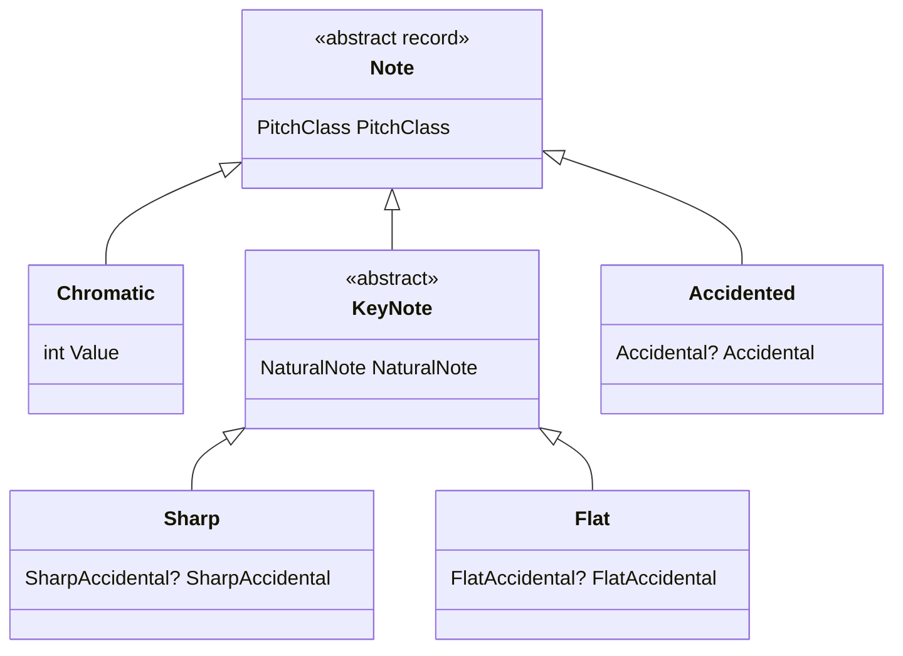

Every other lesson builds on four ideas: a **pitch** is a note at a given height, a **pitch class** is that note in any octave, an **interval** is the distance between two notes, and on a guitar each **fret** adds one of those distances, a semitone. This lesson goes through them in that order: the musical idea first, then how it is written, then the types that [Guitar Alchemist](https://github.com/GuitarAlchemist/ga) (GA) uses for it.

All GA links point to commit [`a826864`](https://github.com/GuitarAlchemist/ga/tree/a826864f3a012cad88e415954bf57eca0ce12aa6) of `GuitarAlchemist/ga`, the one the course program is built against.

## Running the lesson's program

The course program is in [`code/music-theory-ga`](https://github.com/spareilleux/learn/tree/main/code/music-theory-ga). [`fetch-ga.sh`](https://github.com/spareilleux/learn/blob/79d2198/code/music-theory-ga/fetch-ga.sh) clones GA at that commit without its file contents ([`--filter=blob:none`](https://git-scm.com/docs/git-clone#Documentation/git-clone.txt---filterfilter-spec)), then checks out only three projects with [`git sparse-checkout`](https://git-scm.com/docs/git-sparse-checkout). The C# project references one of them, `GA.Domain.Core`, like any other project of a solution ([`GaTheory.csproj`](https://github.com/spareilleux/learn/blob/79d2198/code/music-theory-ga/GaTheory/GaTheory.csproj#L9-L14)). You need the [.NET 10 SDK](https://dotnet.microsoft.com/download/dotnet/10.0) and Git; on Windows, run the commands from Git Bash.

```bash
bash code/music-theory-ga/check.sh                                   # every lesson, compared with expected/
dotnet run --project code/music-theory-ga/GaTheory -c Release -- l1  # this lesson only, after check.sh
```

Each table prints the course's own computation, written from the textbook definitions in [`Theory.cs`](https://github.com/spareilleux/learn/blob/79d2198/code/music-theory-ga/GaTheory/Theory.cs), next to GA's answer, and `ok` or `DIFF`. A `DIFF` is not a failure of the program: it is something GA does differently, and the lesson explains it. [`check.sh`](https://github.com/spareilleux/learn/blob/79d2198/code/music-theory-ga/check.sh) compares the whole output, `DIFF` lines included, with [`expected/l1.txt`](https://github.com/spareilleux/learn/blob/79d2198/code/music-theory-ga/expected/l1.txt), on Linux, Windows and macOS in CI.

## Pitch and pitch class

### The idea

Play the open low E string, then the same note twelve frets higher: the second note sounds "the same, only higher". Musicians call that **octave equivalence**. A **pitch** is one specific note, such as the E of the low string; a **pitch class** is every E in every octave ([Open Music Theory, "Pitch and Pitch Class"](https://viva.pressbooks.pub/openmusictheory/chapter/pitch-and-pitch-class/)).

Western music divides the octave into twelve equal **semitones** (half steps). If you know `TimeOnly` or `LocalTime`, a pitch class is the hour on a 12-hour clock and a pitch is a full timestamp: adding twelve semitones changes the octave, not the pitch class.

### The notation

- **Scientific (American Standard) pitch notation** writes a pitch as a note name and an octave number. Octave numbers change on C, and middle C is C4 ([Open Music Theory, "ASPN"](https://viva.pressbooks.pub/openmusictheory/chapter/aspn/)).
- **MIDI note numbers** count semitones from 0 to 127: middle C is 60 and A4 (440 Hz) is 69 ([MIDI tuning standard](https://en.wikipedia.org/wiki/MIDI_tuning_standard)). So `midi = 12 × (octave + 1) + pitch class`.
- **Integer notation** numbers the pitch classes from C = 0 to B = 11. All enharmonic spellings of a note share its number: B♯ is 0 and D♭ is 1 ([Open Music Theory, "Pitch and Pitch Class"](https://viva.pressbooks.pub/openmusictheory/chapter/pitch-and-pitch-class/)). To keep every pitch class one character long, 10 and 11 are often written T and E, as in the set class table of [Open Music Theory, "Set Class and Prime Form"](https://viva.pressbooks.pub/openmusictheory/chapter/set-class-and-prime-form/), where the major scale is `(013568T)`.

The first table of the program converts the six open strings of a guitar, middle C, A4 and C♯4:

```text
== Pitches: MIDI number and pitch class (C4 = 60)
pitch    course               GA                   check
E2       midi 40 pc 4         midi 40 pc 4         ok
A2       midi 45 pc 9         midi 45 pc 9         ok
D3       midi 50 pc 2         midi 50 pc 2         ok
G3       midi 55 pc 7         midi 55 pc 7         ok
B3       midi 59 pc 11        midi 59 pc 11        ok
E4       midi 64 pc 4         midi 64 pc 4         ok
C4       midi 60 pc 0         midi 60 pc 0         ok
A4       midi 69 pc 9         midi 69 pc 9         ok
C#4      midi 61 pc 1         midi 61 pc 1         ok
GA prints pitch classes as: 0 1 2 3 4 5 6 7 8 9 T E
```

### In GA

- [`PitchClass`](https://github.com/GuitarAlchemist/ga/blob/a826864f3a012cad88e415954bf57eca0ce12aa6/Common/GA.Domain.Core/Theory/Atonal/PitchClass.cs#L22-L28) is a [`readonly record struct`](https://learn.microsoft.com/dotnet/csharp/language-reference/builtin-types/record) holding an `int` from 0 to 11: a value object, as you would write a `Money` or an `EmailAddress`. Its setter [normalizes](https://github.com/GuitarAlchemist/ga/blob/a826864f3a012cad88e415954bf57eca0ce12aa6/Common/GA.Domain.Core/Theory/Atonal/PitchClass.cs#L197-L201) the value modulo 12 through [`EnsureValueRange(…, normalize: true)`](https://github.com/GuitarAlchemist/ga/blob/a826864f3a012cad88e415954bf57eca0ce12aa6/Common/GA.Core/ValueObjects/ValueObjectUtils.cs#L25-L47), so `PitchClass.FromValue(-1)` is 11: pitch-class arithmetic never leaves the clock face. `ToString()` [prints 10 and 11 as T and E](https://github.com/GuitarAlchemist/ga/blob/a826864f3a012cad88e415954bf57eca0ce12aa6/Common/GA.Domain.Core/Theory/Atonal/PitchClass.cs#L83-L88). Careful: pitch class `E` is B, not the note E.
- [`Pitch`](https://github.com/GuitarAlchemist/ga/blob/a826864f3a012cad88e415954bf57eca0ce12aa6/Common/GA.Domain.Core/Primitives/Notes/Pitch.cs#L15-L24) is an `abstract record` with an `Octave` and a `PitchClass`, and three subtypes depending on how the note is spelled: `Chromatic`, `Sharp` and `Flat`.
- [`MidiNote`](https://github.com/GuitarAlchemist/ga/blob/a826864f3a012cad88e415954bf57eca0ce12aa6/Common/GA.Domain.Core/Primitives/Notes/MidiNote.cs#L39-L41) derives the octave and pitch class by dividing by 12, and [`MidiNote.Create`](https://github.com/GuitarAlchemist/ga/blob/a826864f3a012cad88e415954bf57eca0ce12aa6/Common/GA.Domain.Core/Primitives/Notes/MidiNote.cs#L93-L94) is the formula above, with [`Octave.Min`](https://github.com/GuitarAlchemist/ga/blob/a826864f3a012cad88e415954bf57eca0ce12aa6/Common/GA.Domain.Core/Primitives/Notes/Octave.cs#L16-L17) = −1.

## Note names and accidentals

### The idea

The seven **natural notes** C D E F G A B are the white keys of a piano. Between most of them sits one more pitch class (a black key), except between E and F and between B and C, which are only a semitone apart. An **accidental** raises (♯, sharp) or lowers (♭, flat) a letter by a semitone; double sharps (𝄪, written `x`) and double flats (𝄫) move it by two.

So one pitch class has several names: C♯ and D♭ are the same key on the piano, and so are B♯ and C. These are **enharmonic** spellings ([Open Music Theory, "Pitch and Pitch Class"](https://viva.pressbooks.pub/openmusictheory/chapter/pitch-and-pitch-class/)). Octave numbers follow the letter, not the sound: B♯3 and C4 are the same key, in two octaves ([Open Music Theory, "ASPN"](https://viva.pressbooks.pub/openmusictheory/chapter/aspn/)). The name you choose depends on the context: lesson 3 shows why a C minor chord is spelled C E♭ G, not C D♯ G.

```text
== Spellings: many names, one pitch class
note     course GA     check
C#       1      1      ok
Db       1      1      ok
B#       0      0      ok
Cb       11     11     ok
E#       5      5      ok
Fb       4      4      ok
Bbb      9      9      ok
Fx       7      7      ok
```

### In GA

[`Note`](https://github.com/GuitarAlchemist/ga/blob/a826864f3a012cad88e415954bf57eca0ce12aa6/Common/GA.Domain.Core/Primitives/Notes/Note.cs#L10-L19) is a closed hierarchy of records, GA's discriminated union: the C# counterpart of a Java [sealed interface](https://docs.oracle.com/en/java/javase/21/language/sealed-classes-and-interfaces.html) with record implementations.



- [`Note.Chromatic`](https://github.com/GuitarAlchemist/ga/blob/a826864f3a012cad88e415954bf57eca0ce12aa6/Common/GA.Domain.Core/Primitives/Notes/Note.cs#L39-L58) is a pitch class without a spelling; it prints as `C#/Db`.
- [`Note.Sharp`](https://github.com/GuitarAlchemist/ga/blob/a826864f3a012cad88e415954bf57eca0ce12aa6/Common/GA.Domain.Core/Primitives/Notes/Note.cs#L118-L140) and [`Note.Flat`](https://github.com/GuitarAlchemist/ga/blob/a826864f3a012cad88e415954bf57eca0ce12aa6/Common/GA.Domain.Core/Primitives/Notes/Note.cs#L189-L214) are the names used in sharp and flat keys.
- [`Note.Accidented`](https://github.com/GuitarAlchemist/ga/blob/a826864f3a012cad88e415954bf57eca0ce12aa6/Common/GA.Domain.Core/Primitives/Notes/Note.cs#L262-L269) takes any [`Accidental`](https://github.com/GuitarAlchemist/ga/blob/a826864f3a012cad88e415954bf57eca0ce12aa6/Common/GA.Domain.Core/Primitives/Notes/Accidental.cs#L12-L50) from triple flat to triple sharp. Its pitch class is the letter's, from [`NaturalNote.PitchClass`](https://github.com/GuitarAlchemist/ga/blob/a826864f3a012cad88e415954bf57eca0ce12aa6/Common/GA.Domain.Core/Primitives/Notes/NaturalNote.cs#L96-L106), plus the accidental, normalized: that is how `Cb` becomes 11.

## Intervals

### The idea

An interval has two names at once ([Open Music Theory, "Intervals"](https://viva.pressbooks.pub/openmusictheory/chapter/intervals/)):

- its **number** counts letters, both ends included: C up to E is a third (C, D, E), whatever the accidentals;
- its **quality** comes from the number of semitones. Unisons, fourths, fifths and octaves are *perfect* (P) and become *augmented* (A) or *diminished* (d) when one semitone wider or narrower. Seconds, thirds, sixths and sevenths are *major* (M) or *minor* (m), a semitone apart, then augmented or diminished beyond.

That is why C–D♯ and C–E♭ are both three semitones but different intervals: an augmented second and a minor third. Turning an interval upside down (C up to E, then E up to C) is an **inversion**: the numbers add up to 9 (a third becomes a sixth), perfect stays perfect, major becomes minor and augmented becomes diminished (same chapter, "Intervallic Inversion").

When only the pitch classes matter, the distance is folded to at most 6 semitones: that is the **interval class**, and C–E (4) and E–C (8) are both interval class 4 ([Open Music Theory, "Intervals in Integer Notation"](https://viva.pressbooks.pub/openmusictheory/chapter/intervals-in-integer-notation/)). Lesson 4 counts interval classes.

```text
== Intervals: name from the letters, size in semitones, interval class
notes    course         GA             check
C-E      M3 4 ic4       M3 4 ic4       ok
C-Eb     m3 3 ic3       m3 3 ic3       ok
C-D#     A2 3 ic3       A2 3 ic3       ok
C-G      P5 7 ic5       P5 7 ic5       ok
C-F#     A4 6 ic6       A4 6 ic6       ok
C-Gb     d5 6 ic6       d5 6 ic6       ok
B-F      d5 6 ic6       d5 6 ic6       ok
E-C      m6 8 ic4       m6 8 ic4       ok
!M3      m6             m6             ok
```

### In GA

- [`Interval.Simple`](https://github.com/GuitarAlchemist/ga/blob/a826864f3a012cad88e415954bf57eca0ce12aa6/Common/GA.Domain.Core/Primitives/Intervals/Interval.Diatonic.Simple.cs#L12-L37) is a record with a `Size` (the number, [`SimpleIntervalSize`](https://github.com/GuitarAlchemist/ga/blob/a826864f3a012cad88e415954bf57eca0ce12aa6/Common/GA.Domain.Core/Primitives/Intervals/SimpleIntervalSize.cs#L70-L93), 1 to 8, which knows whether it is perfect and its major/perfect size in semitones) and a `Quality` ([`IntervalQuality`](https://github.com/GuitarAlchemist/ga/blob/a826864f3a012cad88e415954bf57eca0ce12aa6/Common/GA.Domain.Core/Primitives/Intervals/IntervalQuality.cs#L29-L35), −3 for doubly diminished to +3 for doubly augmented). Its semitones are the size's plus the quality turned into an accidental.
- The `!` operator is [`ToInverse`](https://github.com/GuitarAlchemist/ga/blob/a826864f3a012cad88e415954bf57eca0ce12aa6/Common/GA.Domain.Core/Primitives/Intervals/Interval.Diatonic.Simple.cs#L40-L43): [`9 - Value`](https://github.com/GuitarAlchemist/ga/blob/a826864f3a012cad88e415954bf57eca0ce12aa6/Common/GA.Domain.Core/Primitives/Intervals/SimpleIntervalSize.cs#L124-L125) for the size and the opposite quality.
- [`GetInterval`](https://github.com/GuitarAlchemist/ga/blob/a826864f3a012cad88e415954bf57eca0ce12aa6/Common/GA.Domain.Core/Primitives/Extensions/NoteExtensions.cs#L104-L116) takes the number from the letters and the semitones from the pitch classes, then looks the quality up in [`DetermineQuality`](https://github.com/GuitarAlchemist/ga/blob/a826864f3a012cad88e415954bf57eca0ce12aa6/Common/GA.Domain.Core/Primitives/Extensions/NoteExtensions.cs#L13-L57), the same algorithm as the course's [`Theory.Interval`](https://github.com/spareilleux/learn/blob/79d2198/code/music-theory-ga/GaTheory/Theory.cs#L43-L66). GA's methods are C# 14 [extension members](https://learn.microsoft.com/dotnet/csharp/whats-new/csharp-14#extension-members) (`extension(Note note1) { … }`).
- [`IntervalClass.FromValue`](https://github.com/GuitarAlchemist/ga/blob/a826864f3a012cad88e415954bf57eca0ce12aa6/Common/GA.Domain.Core/Theory/Atonal/IntervalClass.cs#L44-L52) folds any number of semitones into 0–6.

## The fretboard and tunings

### The idea

A guitar's strings are numbered from the highest-sounding one: string 1 is the thin high E, string 6 the low E. **Standard tuning** is E2 A2 D3 G3 B3 E4 from string 6 to string 1 ([Guitar tunings](https://en.wikipedia.org/wiki/Guitar_tunings)). Each fret raises the string by one semitone, so the note at string *s*, fret *f* is the open string's MIDI number plus *f*. The same pitch appears on several strings: C4 is string 2 fret 1, string 3 fret 5 and string 4 fret 10. The Streeling module [GTR-001 · The Fretboard Map](../../streeling/guitar-studies/gtr-001-the-fretboard-map/) walks through the natural notes on each string.

```text
== Standard tuning: string 1 is the highest
string   course     GA         check
1        E4         E4         ok
2        B3         B3         ok
3        G3         G3         ok
4        D3         D3         ok
5        A2         A2         ok
6        E2         E2         ok

== Fretboard: each fret adds one semitone
string/fret  course       GA           check
6/0          E2 40        E2 40        ok
6/3          G2 43        G2 43        ok
5/3          C3 48        C3 48        ok
2/1          C4 60        C4 60        ok
3/5          C4 60        C4 60        ok
1/8          C5 72        C5 72        ok
4/10         C4 60        C4 60        ok

== Where is pitch class C on frets 0-12? (string/fret)
course              6/8 5/3 4/10 3/5 2/1 1/8
GA, Note.Chromatic  6/8 5/3 4/10 3/5 2/1 1/8
GA, Note.Sharp      (none)
```

### In GA

- [`Tuning`](https://github.com/GuitarAlchemist/ga/blob/a826864f3a012cad88e415954bf57eca0ce12aa6/Common/GA.Domain.Core/Instruments/Tuning.cs#L18-L38) is built from a string of pitches: `Tuning.Default` parses `"E2 A2 D3 G3 B3 E4"`, low to high, and [`BuildPitchArray`](https://github.com/GuitarAlchemist/ga/blob/a826864f3a012cad88e415954bf57eca0ce12aa6/Common/GA.Domain.Core/Instruments/Tuning.cs#L86-L109) reverses it when the first pitch is the lowest, so that the [indexer](https://github.com/GuitarAlchemist/ga/blob/a826864f3a012cad88e415954bf57eca0ce12aa6/Common/GA.Domain.Core/Instruments/Tuning.cs#L66-L79) `tuning[new Str(1)]` is the highest string, as guitarists count.
- [`Str`](https://github.com/GuitarAlchemist/ga/blob/a826864f3a012cad88e415954bf57eca0ce12aa6/Common/GA.Domain.Core/Instruments/Primitives/Str.cs#L13-L17) (1 to 26) and [`Fret`](https://github.com/GuitarAlchemist/ga/blob/a826864f3a012cad88e415954bf57eca0ce12aa6/Common/GA.Domain.Core/Instruments/Primitives/Fret.cs#L15-L26) (−1 for a muted string, 0 open, up to 36) are value objects again.
- [`Fretboard.GetNote`](https://github.com/GuitarAlchemist/ga/blob/a826864f3a012cad88e415954bf57eca0ce12aa6/Common/GA.Domain.Core/Instruments/Primitives/Fretboard.cs#L48-L68) adds the fret to the open string's MIDI note, as above, but takes a 0-based string index: `GetNote(0, 0)` is string 1.
- [`GetPositionsForNote`](https://github.com/GuitarAlchemist/ga/blob/a826864f3a012cad88e415954bf57eca0ce12aa6/Common/GA.Domain.Core/Instruments/Primitives/Fretboard.cs#L73-L88) compares each position's note with `Equals`. `GetNote` returns a `Note.Chromatic`, and records of different types are never equal, so asking for `Note.Sharp.C` finds nothing: the `(none)` line above.

## Surprises found while writing this lesson

Writing the comparisons turned up a few places where GA answers something else than the theory. The course program keeps them as `DIFF` lines, so that CI notices if a later GA commit changes them; they are also in the [journal](../journal/).

```text
== Surprises found while writing this lesson
call                       course       GA           check
Pitch.Flat.DFlat(4)        Db4          D4           DIFF
Pitch.Flat.GFlat(4)        Gb4          A4           DIFF
Pitch.Flat.FFlat(4)        Fb4          G4           DIFF
Pitch.Sharp.TryParse Eb2   rejected     B2           DIFF
Note.Flat.Parse B          B            Bb           DIFF
PitchClass.Parse A         9            10           DIFF
IntervalSize.TryParse x    False        throws ArgumentException DIFF
```

- `Pitch.Flat.DFlat(octave)`, `FFlat` and `GFlat` [build D, G and A](https://github.com/GuitarAlchemist/ga/blob/a826864f3a012cad88e415954bf57eca0ce12aa6/Common/GA.Domain.Core/Primitives/Notes/Pitch.cs#L285-L295) instead of D♭, F♭ and G♭. The properties `DFlat4` and friends are right; only the methods are wrong.
- [`PitchParser`](https://github.com/GuitarAlchemist/ga/blob/a826864f3a012cad88e415954bf57eca0ce12aa6/Common/GA.Domain.Core/Primitives/Notes/PitchParser.cs#L20-L25) searches its pattern `([A-G])(#?)(10|11|[0-9])` without `^…$` anchors and ignores case: in `"Eb2"`, the sharp parser skips the E and matches `b2` as B2.
- [`Note.Flat.TryParse`](https://github.com/GuitarAlchemist/ga/blob/a826864f3a012cad88e415954bf57eca0ce12aa6/Common/GA.Domain.Core/Primitives/Notes/Note.cs#L219-L237) upper-cases its input, then treats a trailing `B` as a flat sign: `"B"` itself becomes B♭.
- [`PitchClass.TryParse`](https://github.com/GuitarAlchemist/ga/blob/a826864f3a012cad88e415954bf57eca0ce12aa6/Common/GA.Domain.Core/Theory/Atonal/PitchClass.cs#L252-L267) reads `A` and `B` as the digits 10 and 11, on purpose (the comment says so), before trying note names: `"A"` is pitch class 10, but the note A is 9.
- [`SimpleIntervalSize.TryParse`](https://github.com/GuitarAlchemist/ga/blob/a826864f3a012cad88e415954bf57eca0ce12aa6/Common/GA.Domain.Core/Primitives/Intervals/SimpleIntervalSize.cs#L155-L164) throws on bad input instead of returning `false`, unlike the [`IParsable<TSelf>.TryParse`](https://learn.microsoft.com/dotnet/api/system.iparsable-1.tryparse) contract.

## Exercises

1. Which pitch, MIDI number and pitch class is string 4, fret 7 in standard tuning?
2. Name the intervals E–B♭ and A–C♯, with their size in semitones and their interval class.
3. In **drop D** tuning, string 6 is lowered to D2 ([Guitar tunings](https://en.wikipedia.org/wiki/Guitar_tunings)). Where is pitch class D on frets 0 to 5? Build that fretboard with GA's `Tuning` and `Fretboard` types.

<details>
<summary>Solutions</summary>

1. String 4 is D3 (MIDI 50); seven frets higher is A3, MIDI 57, pitch class 9.
2. E to B♭ covers five letters (E F G A B) and 6 semitones, one less than a perfect fifth: a diminished fifth, interval class 6. A to C♯ covers three letters and 4 semitones: a major third, interval class 4.
3. Strings 6 and 4 open, string 5 fret 5 and string 2 fret 3. With GA, a tuning is a parsed pitch collection ([`Lesson1.cs`](https://github.com/spareilleux/learn/blob/79d2198/code/music-theory-ga/GaTheory/Lesson1.cs#L93-L118)):

   ```csharp
   var dropD = new Fretboard(new Tuning(PitchCollection.Parse("D2 A2 D3 G3 B3 E4")), 5);
   var positions = dropD.GetPositionsForNote(Note.Chromatic.D);
   ```

   ```text
   == Exercise solutions
   question               course               GA                   check
   1. string 4, fret 7    A3 midi 57 pc 9      A3 midi 57 pc 9      ok
   2. E-Bb                d5 6 ic6             d5 6 ic6             ok
   2. A-C#                M3 4 ic4             M3 4 ic4             ok
   3. D in drop D, 0-5    6/0 5/5 4/0 2/3      6/0 5/5 4/0 2/3      ok
   ```

</details>

## Key takeaways

- A pitch is a pitch class plus an octave; with MIDI numbers, `pitch class = midi % 12` and middle C is 60.
- A note name is a letter plus accidentals; several names share a pitch class. GA keeps both: `PitchClass` for the number, the `Note` records for the spelling.
- An interval's number comes from the letters and its quality from the semitones; the interval class forgets both the direction and the octave.
- On a guitar, a position is a string and a fret: the open string's pitch plus one semitone per fret. GA numbers strings from the highest, like guitarists.
- GA's primitives are small value objects, `readonly record struct`s that validate or normalize their range, and records for the unions: the same modelling you would use for money or identifiers.

## Sources

- Mark Gotham et al., [*Open Music Theory*](https://viva.pressbooks.pub/openmusictheory/), version 2, 2023: chapters [Pitch and Pitch Class](https://viva.pressbooks.pub/openmusictheory/chapter/pitch-and-pitch-class/), [ASPN](https://viva.pressbooks.pub/openmusictheory/chapter/aspn/), [Intervals](https://viva.pressbooks.pub/openmusictheory/chapter/intervals/), [Intervals in Integer Notation](https://viva.pressbooks.pub/openmusictheory/chapter/intervals-in-integer-notation/), [Set Class and Prime Form](https://viva.pressbooks.pub/openmusictheory/chapter/set-class-and-prime-form/). The book is published under [CC BY-SA 4.0](https://creativecommons.org/licenses/by-sa/4.0/).
- [MIDI tuning standard](https://en.wikipedia.org/wiki/MIDI_tuning_standard) (MIDI 60 = C4, 69 = A4) and [Guitar tunings](https://en.wikipedia.org/wiki/Guitar_tunings) (standard and drop D tunings, string numbering), Wikipedia.
- GuitarAlchemist/ga at [`a826864`](https://github.com/GuitarAlchemist/ga/tree/a826864f3a012cad88e415954bf57eca0ce12aa6/Common/GA.Domain.Core): `Primitives/Notes`, `Primitives/Intervals`, `Theory/Atonal/PitchClass.cs`, `Instruments`.
