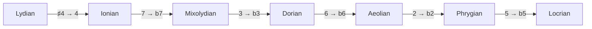

import BraceletMajor from '../../../assets/music-theory-ga/l2-bracelet-major.svg';
import BraceletTransposition from '../../../assets/music-theory-ga/l2-bracelet-transposition.svg';
import BraceletModes from '../../../assets/music-theory-ga/l2-bracelet-modes.svg';
import BraceletSymmetric from '../../../assets/music-theory-ga/l2-bracelet-symmetric.svg';

A scale is a pattern of steps; once you drop the octave, it is also a set of pitch classes, and a set of at most twelve elements fits in twelve bits. This lesson goes from the pattern to the number: how the major and minor scales are built, why transposing a scale is rotating its bits, what a mode is, and how [Guitar Alchemist](https://github.com/GuitarAlchemist/ga) (GA) builds on that single `int`.

All GA links point to commit [`a826864`](https://github.com/GuitarAlchemist/ga/tree/a826864f3a012cad88e415954bf57eca0ce12aa6). The outputs come from the course program ([lesson 1](../01-notes-and-the-fretboard/#running-the-lessons-program) shows how to run it):

```bash
dotnet run --project code/music-theory-ga/GaTheory -c Release -- l2
```

## Scales as step patterns

### The idea

Play the white keys of a piano from C to the next C, or on the guitar, string 5 from fret 3: C D E F G A B C. That is the **major scale**. What makes it major is not its notes but the distances between them: two whole steps, a half step, three whole steps, a half step. Start the same pattern on any note and you get that note's major scale ([Open Music Theory, "Major Scales, Scale Degrees, and Key Signatures"](https://viva.pressbooks.pub/openmusictheory/chapter/major-scales/)).

On a guitar a whole step is two frets and a half step one fret, so the pattern is literally a fret count: 2 2 1 2 2 2 1.

The **minor scales** start with a lower third ([Open Music Theory, "Minor Scales, Scale Degrees, and Key Signatures"](https://viva.pressbooks.pub/openmusictheory/chapter/minor-scales-scale-degrees-and-key-signatures/)):

| Scale | Steps (W = 2, H = 1) | In semitones |
|---|---|---|
| Natural minor | W H W W H W W | 2 1 2 2 1 2 2 |
| Harmonic minor | W H W W H 3H H | 2 1 2 2 1 3 1 |
| Melodic minor, ascending | W H W W W W H | 2 1 2 2 2 2 1 |

The same chapter adds that melodic minor descends like natural minor. A few non-diatonic collections complete the set used below ([Open Music Theory, "Collections"](https://viva.pressbooks.pub/openmusictheory/chapter/collections/)): the **pentatonic** (2 2 3 2 3, the black keys), the **whole-tone** scale (six whole steps) and the **octatonic** scale, which alternates whole and half steps and which jazz musicians call the **diminished** scale. The six-note **blues** scale is the minor pentatonic plus a flattened fifth ([Blues scale](https://en.wikipedia.org/wiki/Blues_scale)).

### The notation

A scale is written as its notes from the root, as its steps, or as its intervals from the root: P1 M2 M3 P4 P5 M6 M7 for major, the interval names of lesson 1. Musicians shorten the last form to **scale degrees**: `1 2 3 4 5 6 7` for major, `1 2 b3 4 5 b6 b7` for natural minor, where `b3` means "a semitone below the major scale's third".

```text
== The major scale from its steps (2 = whole step, 1 = half step)
           course                 GA                     check
steps      2 2 1 2 2 2 1          2 2 1 2 2 2 1          ok
pcs        0 2 4 5 7 9 E          0 2 4 5 7 9 E          ok
intervals  P1 M2 M3 P4 P5 M6 M7   P1 M2 M3 P4 P5 M6 M7   ok
binary     101010110101           101010110101           ok
id         2741                   2741                   ok
```

### In GA

[`Scale`](https://github.com/GuitarAlchemist/ga/blob/a826864f3a012cad88e415954bf57eca0ce12aa6/Common/GA.Domain.Core/Theory/Tonal/Scales/Scale.cs#L53-L75) is built from a string of note names: `Scale.Major` is `new("C D E F G A B")` and `Scale.Blues` is `new("C Eb F F# G Bb")`. A scale exposes its notes, its `Intervals` from the first note, and a `PitchClassSet`, the unordered set of its pitch classes. The three minor scales are [spelled from A](https://github.com/GuitarAlchemist/ga/blob/a826864f3a012cad88e415954bf57eca0ce12aa6/Common/GA.Domain.Core/Theory/Tonal/Scales/Scale.cs#L116-L121) (`"A B C D E F G#"` for harmonic minor), the others from C.

## A scale is a 12-bit number

### The idea

Forget the order and the octave, and a C major scale is the set of pitch classes `{0, 2, 4, 5, 7, 9, 11}`. A subset of twelve elements is a bit field, exactly like a `[Flags]` enum or a Java `EnumSet`: bit *n* is set when pitch class *n* is in the set. There are 2¹² = 4096 such sets, so every scale, chord or melody fragment, once reduced to its pitch classes, has an id from 0 to 4095. Ian Ring's [catalogue of scales](https://ianring.com/musictheory/scales/) numbers them this way; C major is [scale 2741](https://ianring.com/musictheory/scales/2741). The Streeling module [MUS-006 · The Scale Universe](../../streeling/music/mus-006-the-scale-universe/) starts from the same idea.

A set of pitch classes can also be drawn. Put the twelve pitch classes on a clock face, 0 at the top and the others clockwise, fill the ones in the set and join them: Ian Ring calls this picture a **bracelet diagram**, which "shows tones that are in this scale, starting from the top (12 o'clock), going clockwise in ascending semitones" ([scale 2741](https://ianring.com/musictheory/scales/2741)). The major scale fills 0, 2, 4, 5, 7, 9 and 11; the two places where filled beads are neighbours, 4 and 5, 11 and 0, are the two half steps of the pattern.

<BraceletMajor role="img" aria-label="Bracelet diagram of the major scale: pitch classes 0 2 4 5 7 9 11 filled on a clock face of 12, joined by a polygon." />

GA has a React component for the same picture, [`BraceletNotation`](https://github.com/GuitarAlchemist/ga/blob/a826864f3a012cad88e415954bf57eca0ce12aa6/ReactComponents/ga-react-components/src/components/Atonal/BraceletNotation.tsx#L17-L45), which takes the 12-bit number, reads bit *i* as pitch class *i* and draws a bead every 30 degrees. The course draws its own diagrams from [`Diagrams.cs`](https://github.com/spareilleux/learn/blob/a2439ba/code/music-theory-ga/GaTheory/Diagrams.cs), with the same numbers as the tables, and CI checks that the committed images are up to date.

### The notation

Written in binary, the lowest bit is on the right, so pitch class 0 (C) is the **last** character and B the first:

| Bit (pitch class) | 11 | 10 | 9 | 8 | 7 | 6 | 5 | 4 | 3 | 2 | 1 | 0 |
|---|---|---|---|---|---|---|---|---|---|---|---|---|
| Note | B | A♯ | A | G♯ | G | F♯ | F | E | D♯ | D | C♯ | C |
| C major | 1 | 0 | 1 | 0 | 1 | 0 | 1 | 1 | 0 | 1 | 0 | 1 |

`101010110101` is 2048 + 512 + 128 + 32 + 16 + 4 + 1 = 2741. The course computes the id from the steps alone, with [`Theory.FromSteps`](https://github.com/spareilleux/learn/blob/79d2198/code/music-theory-ga/GaTheory/Theory.cs#L114-L124), and compares it with GA's for eight scales rooted on C:

```text
== Scale ids (bit n = pitch class n, root on C)
scale            course GA     check
major            2741   2741   ok
natural minor    1453   1453   ok
harmonic minor   2477   2477   ok
melodic minor    2733   2733   ok
major pentatonic 661    661    ok
blues            1257   1257   ok
whole tone       1365   1365   ok
diminished       2925   2925   ok
Scale.NaturalMinor as GA stores it (A B C D E F G): id 2741
```

The last line is worth a second look: GA's natural minor scale, spelled from A, has **the same id as C major**. A minor and C major use the same seven notes; they are *relative* keys ([Open Music Theory, "Minor Scales"](https://viva.pressbooks.pub/openmusictheory/chapter/minor-scales-scale-degrees-and-key-signatures/)). A set of pitch classes has no first note, so the id alone cannot tell them apart. That is why the program [transposes GA's minor scales down to C](https://github.com/spareilleux/learn/blob/79d2198/code/music-theory-ga/GaTheory/Lesson2.cs#L37-L41) before comparing.

### In GA

[`PitchClassSetId`](https://github.com/GuitarAlchemist/ga/blob/a826864f3a012cad88e415954bf57eca0ce12aa6/Common/GA.Domain.Core/Theory/Atonal/PitchClassSetId.cs#L8-L28) is a `readonly record struct` around an `int` from 0 to 4095, with the set operations as bit operations:

- [`FromPitchClasses`](https://github.com/GuitarAlchemist/ga/blob/a826864f3a012cad88e415954bf57eca0ce12aa6/Common/GA.Domain.Core/Theory/Atonal/PitchClassSetId.cs#L208-L217) ORs `1 << pc.Value` for each pitch class;
- `Cardinality` is [`BitOperations.PopCount`](https://learn.microsoft.com/dotnet/api/system.numerics.bitoperations.popcount), `Complement` is `Value ^ 0xFFF`, and `IsScale` is `(Value & 1) == 1`: for GA, any set that contains C is a scale;
- [`BinaryValue`](https://github.com/GuitarAlchemist/ga/blob/a826864f3a012cad88e415954bf57eca0ce12aa6/Common/GA.Domain.Core/Theory/Atonal/PitchClassSetId.cs#L40) is `Convert.ToString(Value, 2).PadLeft(12, '0')`, the string above.

[`PitchClassSet`](https://github.com/GuitarAlchemist/ga/blob/a826864f3a012cad88e415954bf57eca0ce12aa6/Common/GA.Domain.Core/Theory/Atonal/PitchClassSet.cs#L351) wraps the id with richer properties, and even links each set to Ian Ring's page: `ScalePageUrl` is `https://ianring.com/musictheory/scales/{Id.Value}`.

## Transposing is rotating the bits

### The idea

Transposing a scale moves every note by the same number of semitones: D major is C major moved up 2. In pitch classes, `pc → (pc + n) mod 12`. On the bit field, adding *n* to every index moves every bit *n* places to the left, and the bits pushed past B come back in on the right, at C: a **circular shift** on twelve bits.

```text
== Transposing is rotating the bits
major on   course                     GA                         check
T0 C       2741 101010110101          2741 101010110101          ok
T2 D       2774 101011010110          2774 101011010110          ok
T7 G       2773 101011010101          2773 101011010101          ok
```

Compare `101010110101` (C) with `101011010110` (D): the pattern has moved two places left, and the two leading `10` have wrapped around to the end.

On the bracelet, the circular shift is a rotation: every bead moves two positions clockwise, and the polygon of D major is the polygon of C major turned by 60 degrees.

<BraceletTransposition role="img" aria-label="Two bracelets. T0, the major scale on C: 0 2 4 5 7 9 11. T2, the major scale on D: 1 2 4 6 7 9 11, the same polygon turned two positions clockwise." />

### The notation

Set theory writes transposition by *n* semitones as **T*n*** ([Open Music Theory, "Pitch-Class Sets, Normal Order, and Transformations"](https://viva.pressbooks.pub/openmusictheory/chapter/pc-sets-normal-order-and-transformations/)): D major is T2 of C major, G major T7.

### In GA

[`PitchClassSetId.Transpose`](https://github.com/GuitarAlchemist/ga/blob/a826864f3a012cad88e415954bf57eca0ce12aa6/Common/GA.Domain.Core/Theory/Atonal/PitchClassSetId.cs#L78-L84) is the rotation, written out on twelve bits because [`BitOperations.RotateLeft`](https://learn.microsoft.com/dotnet/api/system.numerics.bitoperations.rotateleft) only rotates whole 32- or 64-bit words:

```csharp
var n = (semitones % 12 + 12) % 12;
var v = (uint)Value & Mask12;
var rot = ((v << n) | (v >> (12 - n))) & Mask12;
```

The next line declares `Rotate(count) => Transpose(count)`, with the comment "Rotation of PC set is transposition". Keep that in mind for the next section: rotating the bits is *not* the same as rotating the scale to a new starting note.

## Modes

### The idea

Play the white keys again, but start and end on D: D E F G A B C D. Same notes as C major, different home note, and a different sound, darker, because the third above D is minor. That is the **Dorian mode**. The seven **diatonic modes** are the seven rotations of the major scale, each with its own tonic ([Open Music Theory, "Diatonic Modes"](https://viva.pressbooks.pub/openmusictheory/chapter/diatonic-modes/)): white notes from C (Ionian), D (Dorian), E (Phrygian), F (Lydian), G (Mixolydian), A (Aeolian, the natural minor) and B (Locrian).

To compare modes, put them on the same root. Rotating the step pattern does just that: Dorian is 2 1 2 2 2 1 2, the major pattern started on its second step. As an id, the Dorian mode is the white-key set transposed so that D lands on 0, which is `T10`, or T−2, of 2741.

```text
== Modes of the major scale: rotate, then transpose back to 0
mode         course                 GA                     check
Ionian       2741 0 2 4 5 7 9 E     2741 0 2 4 5 7 9 E     ok
Dorian       1709 0 2 3 5 7 9 T     1709 0 2 3 5 7 9 T     ok
Phrygian     1451 0 1 3 5 7 8 T     1451 0 1 3 5 7 8 T     ok
Lydian       2773 0 2 4 6 7 9 E     2773 0 2 4 6 7 9 E     ok
Mixolydian   1717 0 2 4 5 7 9 T     1717 0 2 4 5 7 9 T     ok
Aeolian      1453 0 2 3 5 7 8 T     1453 0 2 3 5 7 8 T     ok
Locrian      1387 0 1 3 5 6 8 T     1387 0 1 3 5 6 8 T     ok
```

Lydian on C (2773) has the same id as G major (T7 above): C Lydian uses the notes of G major. The Streeling module [MUS-006](../../streeling/music/mus-006-the-scale-universe/) describes a mode as a "circular left shift by the distance to the next scale tone"; with bit *n* = pitch class *n*, a left shift by 2 gives D **major** (2774), and it takes the opposite shift, T−2, to get D Dorian on C (1709).

The bracelets show the difference. Dorian on C is the polygon of the major scale turned two positions counter-clockwise, so that the bead of D lands on 0. Every mode of the major scale is this same polygon; what changes is which of its beads sits at the top, the tonic.

<BraceletModes role="img" aria-label="Two bracelets with the same polygon. 2741, Ionian: 0 2 4 5 7 9 11. 1709, Dorian on C: 0 2 3 5 7 9 10, the first polygon turned two positions counter-clockwise." />

```play
C4
D4
Eb4
F4
G4
A4
Bb4
C5
```

```play
C4
D4
E4
F4
G4
A4
B4
C5
```

### The notation

Modes are written as scale degrees compared with the major scale, or with the natural minor for the modes with a minor third. Each mode then has one or two **characteristic** degrees: Dorian is minor with a raised 6, Phrygian minor with a lowered 2, Lydian major with a raised 4, Mixolydian major with a lowered 7, and Locrian minor with lowered 2 and 5 ([Open Music Theory, "Introduction to Diatonic Modes and the Chromatic Scale"](https://viva.pressbooks.pub/openmusictheory/chapter/intro-to-diatonic-modes-and-the-chromatic-scale/)). The same chapter ranks the modes from bright to dark. The table above shows why the ranking is so regular: from Lydian to Locrian, each mode lowers exactly one note of the previous one.



GA prints those formulas, and marks the characteristic degrees with `>`:

```text
GA's formulas (intervals from the mode's root):
  Ionian       1   2   3   4   5   6   7
  Dorian       1   2  b3   4   5 >♮6  b7
  Phrygian     1 >b2  b3   4   5  b6  b7
  Lydian       1   2   3 >♯4   5   6   7
  Mixolydian   1   2   3   4   5   6 >b7
  Aeolian      1   2  b3   4   5  b6  b7
  Locrian      1 >b2  b3   4 >b5  b6  b7
```

The `>` marks match the textbook's characteristic degrees for all seven modes.

### In GA

- [`MajorScaleMode`](https://github.com/GuitarAlchemist/ga/blob/a826864f3a012cad88e415954bf57eca0ce12aa6/Common/GA.Domain.Core/Theory/Tonal/Modes/Diatonic/MajorScaleMode.cs#L16) is a mode of `Scale.Major` for a degree from 1 to 7. Its notes come from [`NotesByRotation`](https://github.com/GuitarAlchemist/ga/blob/a826864f3a012cad88e415954bf57eca0ce12aa6/Common/GA.Domain.Core/Theory/Tonal/Modes/ScaleMode.cs#L111-L124), which rotates the *list of notes*, not the bits: Dorian's notes are D E F G A B C.
- [`ScaleMode.RefMode`](https://github.com/GuitarAlchemist/ga/blob/a826864f3a012cad88e415954bf57eca0ce12aa6/Common/GA.Domain.Core/Theory/Tonal/Modes/ScaleMode.cs#L38-L44) is Aeolian when the mode contains a minor third and Ionian otherwise: the textbook's two references.
- [`ModeFormula`](https://github.com/GuitarAlchemist/ga/blob/a826864f3a012cad88e415954bf57eca0ce12aa6/Common/GA.Domain.Core/Primitives/Formulas/ModeFormula.cs#L27-L59) pairs each interval's quality with the reference mode's quality for the same number; an interval is characteristic when [the two qualities differ](https://github.com/GuitarAlchemist/ga/blob/a826864f3a012cad88e415954bf57eca0ce12aa6/Common/GA.Domain.Core/Primitives/Intervals/ScaleModeIntervalBase.cs#L27-L57), and `Print` adds the `>` and, for Dorian's major sixth against minor's `b6`, a natural sign.

## How many modes does a scale have?

### The idea

A seven-note scale has seven rotations, but not every scale has as many distinct modes as notes. The whole-tone scale is the same from every note: one mode. The octatonic scale repeats every three semitones: two modes. The pentatonic has five ([Open Music Theory, "Collections"](https://viva.pressbooks.pub/openmusictheory/chapter/collections/)). The course counts a scale's modes as its distinct rotations moved to 0 ([`Theory.Modes`](https://github.com/spareilleux/learn/blob/79d2198/code/music-theory-ga/GaTheory/Theory.cs#L196-L198)).

The bracelets of the two symmetric scales explain their counts. The whole-tone scale is a regular hexagon: turn it by two positions and it covers itself, so every rotation that puts a bead on top gives the same set, one mode. The octatonic scale covers itself after three positions, so its rotations give only two different sets.

<BraceletSymmetric role="img" aria-label="Two bracelets. 1365, the whole-tone scale: 0 2 4 6 8 10, a regular hexagon. 2925, the diminished or octatonic scale: 0 2 3 5 6 8 9 11, a shape that repeats every three semitones." />

```text
== How many modes does a scale have?
scale            course GA     check
major            7      7      ok
natural minor    7      7      ok
harmonic minor   7      14     DIFF
melodic minor    7      7      ok
major pentatonic 5      5      ok
blues            6      24     DIFF
whole tone       1      1      ok
diminished       2      2      ok
```

### In GA

`PitchClassSet.ModalFamily` answers 14 for harmonic minor and 24 for blues. A [`ModalFamily`](https://github.com/GuitarAlchemist/ga/blob/a826864f3a012cad88e415954bf57eca0ce12aa6/Common/GA.Domain.Core/Theory/Atonal/ModalFamily.cs#L108-L131) is not built from rotations: GA takes every set that contains 0, groups them by size and by **interval-class vector** (the count of each interval they contain, lesson 4), and calls each group a family. Rotations always share a vector, so a family contains the modes, but other sets can share it too:

- **harmonic minor** (7 + 7): its mirror image, 1 2 3 4 5 b6 7, the *harmonic major* scale (GA's own `Scale.HarmonicMajor`), has the same intervals in reverse order, hence the same vector and seven more rotations;
- **blues** (6 + 6 + 12): its six rotations, the six of its mirror image, and twelve sets of another set class with the same vector, a *Z-relation* (lesson 4).

The other six scales of the table are their own mirror images and have no Z-related partner, so for them the two counts agree. An interval-vector class is a real object of set theory, but it is not what *mode* means. A mode is a rotation of a scale, and a scale has as many modes as it has notes, unless a rotational symmetry makes two rotations the same set: "Modes are the rotational transformations of this scale. This number includes the scale itself, so the number is usually the same as its cardinality" ([Ian Ring, scale 2477](https://ianring.com/musictheory/scales/2477)). His pages answer 7 for [harmonic minor](https://ianring.com/musictheory/scales/2477) and 6 for [the blues scale](https://ianring.com/musictheory/scales/1257), the course's numbers. `ModalFamily`'s own class comment says what it really builds, pitch class sets "that share the same interval vector" — but it calls them `Modes`, and a reader counting the modes of harmonic minor in GA gets twice the number.

## Other operations on the bits

The **complement** of a set is every pitch class it does not contain. The complement of the white keys is the black keys, which form a pentatonic collection ([Open Music Theory, "Collections"](https://viva.pressbooks.pub/openmusictheory/chapter/collections/)). The **inversion** I0 maps each pitch class *n* to −*n* mod 12, the mirror image around C; lesson 4 uses it to group chords.

```text
== Other operations on the bits
major        course                 GA                     check
complement   1354 1 3 6 8 T         1354 1 3 6 8 T         ok
inversion I0 1451 0 1 3 5 7 8 T     1451 0 1 3 5 7 8 T     ok
contains 0   True                   True                   ok
```

The inversion of C major is 1451, which is also C Phrygian in the modes table: the major scale is its own mirror image (C major mirrored around D gives C major back), so its inversion is one of its modes. In GA, [`Complement`](https://github.com/GuitarAlchemist/ga/blob/a826864f3a012cad88e415954bf57eca0ce12aa6/Common/GA.Domain.Core/Theory/Atonal/PitchClassSetId.cs#L26-L28) is an XOR, and `Inverse` calls [`MirrorValue`](https://github.com/GuitarAlchemist/ga/blob/a826864f3a012cad88e415954bf57eca0ce12aa6/Common/GA.Domain.Core/Theory/Atonal/PitchClassSetId.cs#L178-L191), which moves bit *i* to bit (12 − *i*) mod 12.

```text
== Counting
sets                   course GA     check
all subsets of 12      4096   4096   ok
containing pc 0        2048   2048   ok
```

Half the sets contain C, so [`Scale.Items`](https://github.com/GuitarAlchemist/ga/blob/a826864f3a012cad88e415954bf57eca0ce12aa6/Common/GA.Domain.Core/Theory/Tonal/Scales/Scale.cs#L93-L97) has 2048 entries, from the single note C to the chromatic scale. GA's definition of a scale is deliberately wide; MUS-006 discusses narrower criteria.

## Exercises

1. Compute the id and the binary form of the C minor pentatonic scale, steps 3 2 2 3 2.
2. Which mode of the major scale has id 1717?
3. Take the complement of the major pentatonic scale (661). Which major scale is it?

<details>
<summary>Solutions</summary>

1. The pitch classes are 0 3 5 7 10: 1 + 8 + 32 + 128 + 1024 = **1193**, `010010101001`. MUS-006 finds the same number.
2. 1717 is 0 2 4 5 7 9 T: a major scale with a lowered 7, **Mixolydian**. From the steps, it is the rotation that starts on the fifth degree.
3. 661 is 0 2 4 7 9; its complement is 1 3 5 6 8 T E, seven notes. Moved down one semitone, that is 0 2 4 5 7 9 E, C major, so the complement is the **F♯ (G♭) major** scale, T6 of C major. The black keys and the white keys again: C major's pentatonic subset and G♭ major share no note.

```text
== Exercise solutions
question               course                 GA                     check
1. minor pentatonic    1193 010010101001      1193 010010101001      ok
2. mode 1717           Mixolydian             Mixolydian             ok
3. complement of 661   1 3 5 6 8 T E = T6     1 3 5 6 8 T E = T6     ok
```

The GA side of each answer is in [`Lesson2.cs`](https://github.com/spareilleux/learn/blob/79d2198/code/music-theory-ga/GaTheory/Lesson2.cs#L91-L106): `PitchClassSet.Parse("0357T")`, a search through `MajorScaleMode.Items`, and `Scale.MajorPentatonic.PitchClassSet.Complement`.

</details>

## Key takeaways

- A scale is a step pattern from a root; the major scale is 2 2 1 2 2 2 1, a fret count on one string.
- Without its root and octave, a scale is a set of pitch classes, and that set is a 12-bit number: C major is 2741. GA's `PitchClassSetId` is that `int`, with `PopCount`, XOR and shifts as set operations.
- Transposing is a circular shift on twelve bits. A mode is a rotation of the *notes*: to compare it with other modes, transpose it back to 0 (Dorian is T−2 of the white keys, 1709).
- From Lydian to Locrian, each mode lowers one degree of the previous one; GA's `ModeFormula` marks the characteristic degrees against Ionian or Aeolian.
- An id does not know its root: A minor and C major are both 2741. GA's `ModalFamily` groups sets by interval-class vector, which is wider than rotations: 14 "modes" for harmonic minor, 24 for blues.

## Sources

- Mark Gotham et al., [*Open Music Theory*](https://viva.pressbooks.pub/openmusictheory/), version 2, 2023, [CC BY-SA 4.0](https://creativecommons.org/licenses/by-sa/4.0/): chapters [Major Scales, Scale Degrees, and Key Signatures](https://viva.pressbooks.pub/openmusictheory/chapter/major-scales/), [Minor Scales, Scale Degrees, and Key Signatures](https://viva.pressbooks.pub/openmusictheory/chapter/minor-scales-scale-degrees-and-key-signatures/), [Introduction to Diatonic Modes and the Chromatic Scale](https://viva.pressbooks.pub/openmusictheory/chapter/intro-to-diatonic-modes-and-the-chromatic-scale/), [Diatonic Modes](https://viva.pressbooks.pub/openmusictheory/chapter/diatonic-modes/), [Collections](https://viva.pressbooks.pub/openmusictheory/chapter/collections/), [Pitch-Class Sets, Normal Order, and Transformations](https://viva.pressbooks.pub/openmusictheory/chapter/pc-sets-normal-order-and-transformations/).
- Ian Ring, [*A Study of Musical Scales*](https://ianring.com/musictheory/scales/), and [scale 2741](https://ianring.com/musictheory/scales/2741) (the numbering of this lesson).
- [Blues scale](https://en.wikipedia.org/wiki/Blues_scale), Wikipedia (hexatonic blues scale).
- GuitarAlchemist/ga at [`a826864`](https://github.com/GuitarAlchemist/ga/tree/a826864f3a012cad88e415954bf57eca0ce12aa6/Common/GA.Domain.Core): `Theory/Atonal/PitchClassSetId.cs`, `PitchClassSet.cs`, `ModalFamily.cs`, `Theory/Tonal/Scales/Scale.cs`, `Theory/Tonal/Modes`, `Primitives/Formulas/ModeFormula.cs`.
