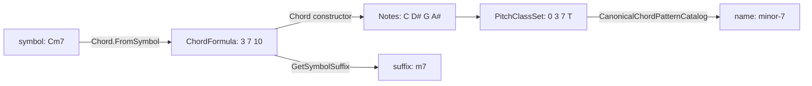

import Voicings from '../../../assets/music-theory-ga/l3-voicings.svg';

A chord symbol such as `Cm7` is a small language: a root, a quality, extensions. A guitar chord shape such as `x32010` is another one. This lesson parses both: what the symbol means, which notes it names and how to spell them, what an inversion is, and how a shape on six strings becomes a set of pitch classes and a name again. At each step it compares the textbook with [Guitar Alchemist](https://github.com/GuitarAlchemist/ga) (GA), and here the two disagree more often than in the first two lessons.

All GA links point to commit [`a826864`](https://github.com/GuitarAlchemist/ga/tree/a826864f3a012cad88e415954bf57eca0ce12aa6). The outputs come from:

```bash
dotnet run --project code/music-theory-ga/GaTheory -c Release -- l3
```

## Triads and seventh chords

### The idea

A **triad** is three notes that can be stacked in thirds: a **root**, a **third** above it and a **fifth** above the root. Its **quality** comes from those two intervals: a major third and a perfect fifth make a **major** triad, a minor third and a perfect fifth a **minor** triad; a minor third and a diminished fifth make a **diminished** triad, a major third and an augmented fifth an **augmented** one ([Open Music Theory, "Triads"](https://viva.pressbooks.pub/openmusictheory/chapter/triads/)). The Streeling module [MUS-001 · What Is a Chord?](../../streeling/music/mus-001-what-is-a-chord/) builds the major and minor triads the same way.

Stack one more third and you get a **seventh chord**. Five qualities are common: major seventh (major triad, major seventh), dominant seventh (major triad, minor seventh), minor seventh, half-diminished seventh (diminished triad, minor seventh) and fully diminished seventh ([Open Music Theory, "Seventh Chords"](https://viva.pressbooks.pub/openmusictheory/chapter/seventh-chords/)). Stacking further gives ninths, elevenths and thirteenths.

### The notation

A chord symbol is a root letter followed by suffixes ([Open Music Theory, "Chord Symbols"](https://viva.pressbooks.pub/openmusictheory/chapter/chord-symbols/)):

| Symbol | Meaning | Semitones above the root |
|---|---|---|
| `C` | major triad: nothing is added | 0 4 7 |
| `Cm`, `Cdim` or `C°`, `Caug` or `C+` | minor, diminished, augmented | 0 3 7, 0 3 6, 0 4 8 |
| `Csus4` (`Csus`), `Csus2` | the third replaced by a fourth or a second | 0 5 7, 0 2 7 |
| `C6` | major triad plus a major sixth | 0 4 7 9 |
| `C7` | dominant seventh: a bare 7 is a **minor** seventh | 0 4 7 10 |
| `Cmaj7` (`CΔ7`), `Cm7` | major seventh, minor seventh | 0 4 7 11, 0 3 7 10 |
| `Cm7♭5` (`Cø7`), `Cdim7` (`C°7`) | half-diminished, fully diminished | 0 3 6 10, 0 3 6 9 |
| `C9` | dominant seventh plus a major ninth | 0 4 7 10 14 |
| `Cadd9` | major triad plus a ninth, **no** seventh | 0 4 7 14 |

The same chapter states the two defaults that trip beginners up: a seventh added to a triad is minor unless marked `maj`, and `C9` implies that seventh while `Cadd9` does not. A ninth is an octave plus a second, so 14 semitones is pitch class 2.

```text
== Chord symbols on C: pitch classes
symbol   course         GA             check
C        0 4 7          0 4 7          ok
Cm       0 3 7          0 3 7          ok
Cdim     0 3 6          0 3 6          ok
Caug     0 4 8          0 4 8          ok
Csus2    0 2 7          0 2 7          ok
Csus4    0 5 7          0 5 7          ok
C6       0 4 7 9        0 4 7 9        ok
C7       0 4 7 T        0 4 7 T        ok
Cmaj7    0 4 7 E        0 4 7 E        ok
Cm7      0 3 7 T        0 3 7 T        ok
Cm7b5    0 3 6 T        0 3 6 T        ok
Cdim7    0 3 6 9        0 3 6 9        ok
C9       0 2 4 7 T      0 2 4 7 T      ok
Cadd9    0 2 4 7        0 2 4 7        ok
```

### In GA

Going from a symbol to notes and back crosses four GA types:



- [`Chord.FromSymbol`](https://github.com/GuitarAlchemist/ga/blob/a826864f3a012cad88e415954bf57eca0ce12aa6/Common/GA.Domain.Core/Theory/Harmony/Chord.cs#L75-L91) splits the root from the suffix with a regular expression, then [`ParseSuffix`](https://github.com/GuitarAlchemist/ga/blob/a826864f3a012cad88e415954bf57eca0ce12aa6/Common/GA.Domain.Core/Theory/Harmony/Chord.cs#L110-L141) is a `switch` expression over the lower-cased suffix: `"m7b5" or "ø7"`, `"dim7" or "°7"`, and so on, one arm per chord type. Anything else throws.
- Each arm returns a [`ChordFormula`](https://github.com/GuitarAlchemist/ga/blob/a826864f3a012cad88e415954bf57eca0ce12aa6/Common/GA.Domain.Core/Theory/Harmony/ChordFormula.cs#L121-L137), a named list of intervals in semitones above the root (the root itself is implicit): `FromSemitones("Half Diminished 7th", 3, 6, 10)`.
- The parser and the course agree on all fourteen symbols.

## From notes back to a symbol

### The idea

Naming a chord is the reverse problem: given the notes, find the root and the suffix. The intervals above the root decide it, and the difference between two chords can be a single semitone: `C7` and `Cmaj7` differ only by B♭ against B.

### In GA

GA has two ways back, and they do not agree.

**`ChordFormula.GetSymbolSuffix`** derives a quality, then an extension, from the formula's intervals:

```text
== Pitch classes back to a symbol: GA's ChordFormula.GetSymbolSuffix
symbol   course   GA       check
C        (major)  (major)  ok
Cm       m        m        ok
Cdim     dim      dim      ok
Caug     aug      aug      ok
Csus2    sus2     sus2     ok
Csus4    sus4     sus4     ok
C6       6        6        ok
C7       7        7        ok
Cmaj7    maj7     7        DIFF
Cm7      m7       m7       ok
Cm7b5    m7b5     dim7     DIFF
Cdim7    dim7     dim6     DIFF
C9       9        9        ok
Cadd9    add9     add9     ok
```

Three of the five seventh chords come back as the symbol of another chord. The [`ChordQuality`](https://github.com/GuitarAlchemist/ga/blob/a826864f3a012cad88e415954bf57eca0ce12aa6/Common/GA.Domain.Core/Theory/Harmony/ChordQuality.cs#L10-L23) enum has `Major7`, `Minor7`, `HalfDiminished` and `Diminished7` members, but [`DetermineQuality`](https://github.com/GuitarAlchemist/ga/blob/a826864f3a012cad88e415954bf57eca0ce12aa6/Common/GA.Domain.Core/Theory/Harmony/ChordFormula.cs#L172-L214) never returns them: it only knows `Suspended`, `Dominant` (major third and minor seventh), `Diminished`, `Augmented`, `Minor`, `Major` and `Other`. Then [`GetSymbolSuffix`](https://github.com/GuitarAlchemist/ga/blob/a826864f3a012cad88e415954bf57eca0ce12aa6/Common/GA.Domain.Core/Theory/Harmony/ChordFormula.cs#L299-L325) concatenates a quality suffix and an extension suffix:

- `Cmaj7` is `Major` (no minor seventh, so not dominant) plus `Seventh`: `"" + "7"`, the symbol of the dominant seventh chord;
- `Cm7b5` is `Diminished` plus `Seventh`: `"dim" + "7"`, the symbol of the *fully* diminished chord;
- `Cdim7` is `Diminished`, and its 9-semitone interval is read as a sixth by [`DetermineExtension`](https://github.com/GuitarAlchemist/ga/blob/a826864f3a012cad88e415954bf57eca0ce12aa6/Common/GA.Domain.Core/Theory/Harmony/ChordFormula.cs#L216-L294): `"dim6"`. Nine semitones are a major sixth *or* a diminished seventh; only the spelling (B𝄫 rather than A) says which, and a formula in semitones has no spelling. The next section comes back to this.

The members `DetermineQuality` never returns are not unused elsewhere in GA, and the right symbols are already written down twice: [`CadenceChordParser`](https://github.com/GuitarAlchemist/ga/blob/a826864f3a012cad88e415954bf57eca0ce12aa6/Common/GA.Domain.Services/Chords/Parsing/CadenceChordParser.cs#L11-L14) maps `"maj7"`, `"m7b5"` and `"dim7"` onto `Major7`, `HalfDiminished` and `Diminished7`, and the F# [`DslCommand`](https://github.com/GuitarAlchemist/ga/blob/a826864f3a012cad88e415954bf57eca0ce12aa6/Common/GA.Business.DSL/Types/DslCommand.fs#L227-L230) prints them back as `maj7`, `m7`, `dim7` and `ø7`, the textbook's symbols — Open Music Theory writes the half-diminished chord F∅7 and the fully diminished one Fo7 (["Seventh Chords"](https://viva.pressbooks.pub/openmusictheory/chapter/seventh-chords/)). The table exists in the same commit; `ChordFormula` just never reaches it.

**`CanonicalChordPatternCatalog`** is a hand-written list of interval patterns with names and priorities, and [`TryFindExact`](https://github.com/GuitarAlchemist/ga/blob/a826864f3a012cad88e415954bf57eca0ce12aa6/Common/GA.Domain.Core/Theory/Harmony/CanonicalChordPatternCatalog.cs#L165-L177) returns the first pattern, by priority, whose intervals match exactly. It names all fourteen chords correctly:

```text
== GA's recognition catalog (CanonicalChordPatternCatalog.TryFindExact)
  C       0,4,7        major-triad
  Cm      0,3,7        minor-triad
  Cdim    0,3,6        diminished-triad
  Caug    0,4,8        augmented-triad
  Csus2   0,2,7        sus2
  Csus4   0,5,7        sus4
  C6      0,4,7,9      major-6
  C7      0,4,7,10     dominant-7
  Cmaj7   0,4,7,11     major-7
  Cm7     0,3,7,10     minor-7
  Cm7b5   0,3,6,10     half-diminished-7
  Cdim7   0,3,6,9      diminished-7
  C9      0,2,4,7,10   dominant-9
  Cadd9   0,2,4,7      add-9
```

Reading [the catalog](https://github.com/GuitarAlchemist/ga/blob/a826864f3a012cad88e415954bf57eca0ce12aa6/Common/GA.Domain.Core/Theory/Harmony/CanonicalChordPatternCatalog.cs#L45-L112) shows four interval sets listed twice under different names: `9-sus4` and `dominant-11` (0 2 5 7 10), `major-6-add-9` and `6-9`, `minor-6-add-9` and `minor-6-9`, `augmented-7` and `dominant-7-sharp-5` (0 4 8 10). Two names for one set of pitch classes is normal in music, but with an exact match by priority, `dominant-11`, `6-9`, `minor-6-9` and `dominant-7-sharp-5` can never be returned.

## Spelling chords

### The idea

A chord in thirds uses **every other letter**: C E G, D F A, B D F. To spell a chord, write those letters from the root, then add the accidentals that give each interval its quality ([Open Music Theory, "Triads", "Spelling Triads"](https://viva.pressbooks.pub/openmusictheory/chapter/triads/)). So C minor is C E♭ G, never C D♯ G: D♯ is on the letter of a second, and C–D♯ is an augmented second, not a minor third (lesson 1). A diminished seventh on C needs a letter B for its seventh, lowered twice: C E♭ G♭ B𝄫.

The course spells with [`Theory.Spell`](https://github.com/spareilleux/learn/blob/79d2198/code/music-theory-ga/GaTheory/Theory.cs#L76-L87): the letter comes from the chord degree, the accidental from the semitones.

```text
== Spelling: one letter per chord degree
symbol   course           GA               check
Cm       C Eb G           C D# G           DIFF
Eb       Eb G Bb          Eb G A#          DIFF
Ab       Ab C Eb          Ab C D#          DIFF
F#       F# A# C#         F# A# C#         ok
Bbm7     Bb Db F Ab       Bb C# F G#       DIFF
Cdim     C Eb Gb          C D# F#          DIFF
Cdim7    C Eb Gb Bbb      C D# F# A        DIFF
Gb7      Gb Bb Db Fb      Gb A# C# E       DIFF
```

### In GA

The [`Chord` constructor](https://github.com/GuitarAlchemist/ga/blob/a826864f3a012cad88e415954bf57eca0ce12aa6/Common/GA.Domain.Core/Theory/Harmony/Chord.cs#L25-L44) keeps the root as written, then builds every other note from its pitch class alone:

```csharp
var newPitchClassValue = (root.PitchClass.Value + interval.Interval.Semitones.Value) % 12;
var newNote = new PitchClass { Value = newPitchClassValue }.ToChromaticNote().ToAccidented();
```

A pitch class has no letter, and the conversion is one line: [`Note.Chromatic.ToAccidented`](https://github.com/GuitarAlchemist/ga/blob/a826864f3a012cad88e415954bf57eca0ce12aa6/Common/GA.Domain.Core/Primitives/Notes/Note.cs#L75-L77) is `ToSharp().ToAccidented()`, so every black key gets a sharp name. The pitch classes stay right, and so do chords whose correct spelling uses sharps (F♯ major), but a flat-key chord such as E♭ gets `Eb G A#`, mixing both, and `Gb7` gets an E for its seventh. For playing, the sound is the same. For display, analysis or the interval names of lesson 1, the spelling is wrong: by its letters, E♭ to A♯ is a fourth (E F G A) seven semitones wide, not the perfect fifth of the chord.

## Inversions and slash chords

### The idea

The **bass** is the lowest note that sounds. A chord with its root in the bass is in **root position**; with its third in the bass, in **first inversion**; with its fifth, in **second inversion**; with a seventh, in **third inversion**. The root does not change: C E G, E G C and G C E are all C major ([Open Music Theory, "Inversion"](https://viva.pressbooks.pub/openmusictheory/chapter/inversion/)). This is not the intervallic inversion of lesson 1, nor the set inversion of lesson 2: the same word has three meanings.

### The notation

A **slash chord** writes the bass after a slash: `C/E` is a C major triad with E in the bass ([Open Music Theory, "Chord Symbols"](https://viva.pressbooks.pub/openmusictheory/chapter/chord-symbols/)).

```text
== Inversions of C major
inversion  course                         GA                             check
0          C bass C inversion 0 Major     C bass C inversion 0 Major     ok
1          C/E bass E inversion 1 Major   C/E bass E inversion 1 Other   DIFF
2          C/G bass G inversion 2 Major   C/G bass G inversion 2 Major   ok
```

### In GA

- [`Bass`](https://github.com/GuitarAlchemist/ga/blob/a826864f3a012cad88e415954bf57eca0ce12aa6/Common/GA.Domain.Core/Theory/Harmony/Chord.cs#L183-L188) is `Notes[0]`, and [`GetInversion`](https://github.com/GuitarAlchemist/ga/blob/a826864f3a012cad88e415954bf57eca0ce12aa6/Common/GA.Domain.Core/Theory/Harmony/Chord.cs#L209-L223) counts where the root sits in the notes: both right.
- [`ToInversion`](https://github.com/GuitarAlchemist/ga/blob/a826864f3a012cad88e415954bf57eca0ce12aa6/Common/GA.Domain.Core/Theory/Harmony/Chord.cs#L228-L244) rotates the notes (E G C) and calls the constructor from notes with the same root, which analyses the chord again. [`AnalyzeChordFormula`](https://github.com/GuitarAlchemist/ga/blob/a826864f3a012cad88e415954bf57eca0ce12aa6/Common/GA.Domain.Core/Theory/Harmony/Chord.cs#L246-L260) measures every note from the root but starts with `Notes.Skip(1) // Skip root`: after the rotation, the skipped note is the bass. In first inversion it skips E, the third, so the formula is only G and C, with no third, and the quality is `Other`. In second inversion it skips G, the fifth, which `DetermineQuality` does not look at, so the answer is right by luck.

## Voicings on the fretboard

### The idea

A chord symbol names pitch classes; a **voicing** decides which octave each one is played in, which ones are doubled and which are left out ([Open Music Theory, "Jazz Voicings"](https://viva.pressbooks.pub/openmusictheory/chapter/jazz-voicings/)). On a guitar, a voicing is a fret, or a mute, for each string. Guitar chord charts write it as six characters from string 6 (low E) to string 1: `x` for a string that is not played, `0` for an open string. Open C major is `x32010`: C on string 5, E, G, C and E above it, three pitch classes on five strings ([Guitar chord](https://en.wikipedia.org/wiki/Guitar_chord), "Triads"). The Streeling module [GAA-001 · Your First Chord](../../streeling/guitar-alchemist-academy/gaa-001-your-first-chord/) explains how to read a chord diagram, and [GTR-002 · CAGED Geometry](../../streeling/guitar-studies/gtr-002-caged-geometry/) shows the five open major shapes and the intervals on each string.

Two measurements matter to the hand: the **span**, from the lowest to the highest fretted note (open strings cost nothing), and whether one finger must press several strings on the same fret, a **barre**, as in the F major shape `133211` ([Guitar chord](https://en.wikipedia.org/wiki/Guitar_chord)).

```text
== Voicings: fret numbers from string 6 (low E) to string 1 (high E)
shape    course                           GA                               check
x32010   0-1-0-2-3-x 0 4 7 span 2         0-1-0-2-3-x 0 4 7 span 2         ok
032010   0-1-0-2-3-0 0 4 7 span 2         0-1-0-2-3-0 0 4 7 span 2 barre   DIFF
x02210   0-1-2-2-0-x 0 4 9 span 1         0-1-2-2-0-x 0 4 9 span 1         ok
022100   0-0-1-2-2-0 4 8 E span 1         0-0-1-2-2-0 4 8 E span 1 barre   DIFF
320003   3-0-0-0-2-3 2 7 E span 1         3-0-0-0-2-3 2 7 E span 1 barre   DIFF
xx0232   2-3-2-0-x-x 2 6 9 span 1         2-3-2-0-x-x 2 6 9 span 1         ok
133211   1-1-2-3-3-1 0 5 9 span 2 barre   1-1-2-3-3-1 0 5 9 span 2 barre   ok
```

Both columns print the diagram the way GA does, which is **reversed**: `0-1-0-2-3-x` is `x32010` read from string 1.

Drawn as chord charts draw them, string 6 on the left and the nut at the top, four of these shapes look like this. A cross marks a string that is not played, a circle an open string, and each string shows the pitch it sounds. The first two are the same C major chord: `x32010` has C3 in the bass, root position, and `032010` adds the open low E, E2, which puts the chord in first inversion. `320003` is G major, and `133211` is F major with one finger barring fret 1.

<Voicings role="img" aria-label="Four chord diagrams. x32010: C3 E3 G3 C4 E4. 032010: E2 C3 E3 G3 C4 E4. 320003: G2 B2 D3 G3 B3 G4. 133211: a barre on fret 1, F2 C3 F3 A3 C4 F4." />

```play
C3 E3 G3 C4 E4
E2 C3 E3 G3 C4 E4
G2 B2 D3 G3 B3 G4
F2 C3 F3 A3 C4 F4
```

The ComfyUI course draws the same voicings as images: its [lesson 11](../../comfyui/11-custom-nodes-and-security/) writes GA nodes that turn `x32010` into a chord diagram and a fretboard map for image generation, with the strings in chart order and GA's order side by side.

### In GA

- [`Voicing`](https://github.com/GuitarAlchemist/ga/blob/a826864f3a012cad88e415954bf57eca0ce12aa6/Common/GA.Domain.Core/Instruments/Fretboard/Voicings/Core/Voicing.cs#L14-L36) is a `record` of `Position`s (`Position.Muted` or `Position.Played`, another closed hierarchy) and MIDI notes. Its `Diagram` joins the positions in array order, and GA's [`VoicingGenerator`](https://github.com/GuitarAlchemist/ga/blob/a826864f3a012cad88e415954bf57eca0ce12aa6/Common/GA.Domain.Services/Fretboard/Voicings/Generation/VoicingGenerator.cs#L167) fills that array in the order of `Str.Range`, from [string 1, "the first string (highest pitch)"](https://github.com/GuitarAlchemist/ga/blob/a826864f3a012cad88e415954bf57eca0ce12aa6/Common/GA.Domain.Core/Instruments/Primitives/Str.cs#L35-L38), so GA's diagrams start with the high E, the opposite of chord charts. The program builds its voicings [the same way](https://github.com/spareilleux/learn/blob/79d2198/code/music-theory-ga/GaTheory/Lesson3.cs#L128-L137).
- [`FretSpan`](https://github.com/GuitarAlchemist/ga/blob/a826864f3a012cad88e415954bf57eca0ce12aa6/Common/GA.Domain.Core/Instruments/Fretboard/Voicings/Core/Voicing.cs#L38-L48) ignores open strings, like the course.
- [`HasBarre`](https://github.com/GuitarAlchemist/ga/blob/a826864f3a012cad88e415954bf57eca0ce12aa6/Common/GA.Domain.Core/Instruments/Fretboard/Voicings/Core/Voicing.cs#L73-L80) is true when three played strings share a fret, **fret 0 included**. Three open strings are not a barre, so `032010` (C with a low E), `022100` (E) and `320003` (G), all played without one, come out as barre chords. A barre is "one finger to press down multiple strings across a single fret" ([Barre chord](https://en.wikipedia.org/wiki/Barre_chord), Wikipedia), and no finger presses an open string, so all three rows are GA's error, not a matter of definition. The follow-up named in the comment above `HasBarre` is already written: [`DetectBarreRequirement`](https://github.com/GuitarAlchemist/ga/blob/a826864f3a012cad88e415954bf57eca0ce12aa6/Common/GA.Domain.Services/Fretboard/Voicings/Analysis/VoicingPhysicalAnalyzer.cs#L219-L233) does test `fret > 0` and does require the strings to be next to each other — and for that reason it answers *not barre* for `133211`, whose fret 1 is on strings 6, 2 and 1. The course's rule counts fretted strings without the adjacency, so it would call a shape like `x1x1x1` a barre too. All three rules are approximations; only the course's gets every row of this table right.

## Naming a voicing

A shape has a bass, so naming it means finding a root among its pitch classes, possibly different from the bass. The course's [`NameOf`](https://github.com/spareilleux/learn/blob/79d2198/code/music-theory-ga/GaTheory/Lesson3.cs#L43-L56) tries the bass first, then the other notes, and writes a slash chord when the root is not the bass. The GA column measures the intervals from the bass and asks `TryFindExact` ([`GaNameOf`](https://github.com/spareilleux/learn/blob/79d2198/code/music-theory-ga/GaTheory/Lesson3.cs#L58-L64)):

```text
== Naming a voicing: course tries the bass first, GA's catalog reads from the bass
  x32010  course C      GA major-triad
  032010  course C/E    GA (none)
  x02210  course Am     GA minor-triad
  022100  course E      GA major-triad
  320003  course G      GA major-triad
  xx0232  course D      GA major-triad
  133211  course F      GA major-triad
```

Measured from E, the notes of `032010` are 0 3 8, a pattern that matches nothing, because the catalog's patterns are measured from the root and E is not the root. Wikipedia's chord chart lists `032010` as *the* C chord, while its text mutes string 6; whether an E in the bass is acceptable is a musical choice, but it changes the name. GA does name inversions elsewhere: its MCP tool `ga_search_voicings` returned a voicing `8-8-x-x-7-x` labelled `C/E` in this session (GA MCP server, 2026-09-14, version not reported).

## Exercises

1. Spell F♯dim7, one letter per chord degree.
2. Name the shapes `x35543` and `x02010`: list their notes from low to high, then find a root and a suffix.

<details>
<summary>Solutions</summary>

1. The letters are F, A, C, E. Above F♯: A is a minor third, C a diminished fifth (6 semitones), and the diminished seventh is 9 semitones, E♭: **F♯ A C E♭**. GA writes D♯, the same key on a piano but the letter of a sixth.
2. `x35543` is C3 G3 C4 D♯4 G4. With C as the root the intervals are 0 3 7: **Cm**, a barre chord on the A-string shape (spelled C E♭ G). `x02010` is A2 E3 G3 C4 E4: from A, 0 3 7 10, **Am7**. Starting from C instead, the same notes are 0 4 7 9, C6 with A in the bass: the course tries the bass first, which is why it answers Am7.

```text
== Exercise solutions
question         course               GA                   check
1. F#dim7        F# A C Eb            F# A C D#            DIFF
2. x35543  notes C3 G3 C4 D#4 G4  course Cm  GA minor-triad
2. x02010  notes A2 E3 G3 C4 E4  course Am7  GA minor-7
```

The program prints MIDI-derived note names, hence `D#4` in the second line ([`Lesson3.cs`](https://github.com/spareilleux/learn/blob/79d2198/code/music-theory-ga/GaTheory/Lesson3.cs#L150-L158)).

</details>

## What GA's MCP server answers

GA also exposes chord tools to AI assistants through an [MCP](https://modelcontextprotocol.io/) server. Asked in this session (2026-09-14; the server does not report its version, so these answers may not match commit `a826864`), `ga_chord_intervals` returned:

| Symbol | MCP answer | Theory |
|---|---|---|
| `Cm7b5` | P1 m3 P5 m7 | P1 m3 d5 m7 |
| `G7b9` | P1 M3 P5 m7 | P1 M3 P5 m7 m9 |
| `C9` | P1 M3 P5 M9 | P1 M3 P5 m7 M9 |
| `Cmaj9` | P1 M3 P5 M9 | P1 M3 P5 M7 M9 |

`ga_parse_chord("Cm7b5")` did parse the alteration (`"components":["ext:7","alt:b5"]`). The tool goes through a different path from `Chord.FromSymbol`: the F# closure [`domain.chordIntervals`](https://github.com/GuitarAlchemist/ga/blob/a826864f3a012cad88e415954bf57eca0ce12aa6/Common/GA.Business.DSL/Closures/BuiltinClosures/DomainClosures.fs#L199-L227) keeps only the base triad plus one interval per [extension](https://github.com/GuitarAlchemist/ga/blob/a826864f3a012cad88e415954bf57eca0ce12aa6/Common/GA.Business.DSL/Closures/BuiltinClosures/DomainClosures.fs#L85-L98), ignores alterations, and maps `9` and `maj9` to 14 semitones without their seventh. The same commit's C# parser gets `C9` right (first table of this lesson), so the two layers of GA disagree with each other.

## Key takeaways

- A chord symbol is root plus quality plus extensions; a bare `7` is a minor seventh, `9` implies it, `add9` does not.
- A chord in thirds takes every other letter; the spelling, not the semitones, tells a diminished seventh from a major sixth. GA spells from pitch classes, with sharps.
- Inversion is about the bass; the root does not change. Slash chords write the bass.
- A guitar voicing is a fret or a mute per string; chord charts start from the low E, GA's diagrams from the high E.
- GA has several ways to name a chord (`GetSymbolSuffix`, the pattern catalog, the MCP tools) and they give different answers: test against the catalog, which matched the textbook for every root-position chord here.

## Sources

- Mark Gotham et al., [*Open Music Theory*](https://viva.pressbooks.pub/openmusictheory/), version 2, 2023, [CC BY-SA 4.0](https://creativecommons.org/licenses/by-sa/4.0/): chapters [Triads](https://viva.pressbooks.pub/openmusictheory/chapter/triads/), [Seventh Chords](https://viva.pressbooks.pub/openmusictheory/chapter/seventh-chords/), [Chord Symbols](https://viva.pressbooks.pub/openmusictheory/chapter/chord-symbols/), [Inversion](https://viva.pressbooks.pub/openmusictheory/chapter/inversion/), [Jazz Voicings](https://viva.pressbooks.pub/openmusictheory/chapter/jazz-voicings/).
- [Guitar chord](https://en.wikipedia.org/wiki/Guitar_chord), Wikipedia (open-position major chords, barre chords).
- GuitarAlchemist/ga at [`a826864`](https://github.com/GuitarAlchemist/ga/tree/a826864f3a012cad88e415954bf57eca0ce12aa6/Common/GA.Domain.Core): `Theory/Harmony` (`Chord.cs`, `ChordFormula.cs`, `ChordQuality.cs`, `CanonicalChordPatternCatalog.cs`), `Instruments/Fretboard/Voicings/Core/Voicing.cs`, `GA.Domain.Services/Fretboard/Voicings/Generation/VoicingGenerator.cs`, `GA.Business.DSL/Closures/BuiltinClosures/DomainClosures.fs`.
