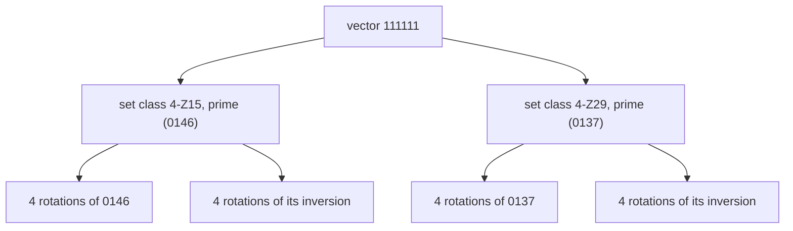

import BraceletInversion from '../../../assets/music-theory-ga/l4-bracelet-inversion.svg';
import BraceletZ from '../../../assets/music-theory-ga/l4-bracelet-z-relation.svg';

Lesson 2 turned a chord or a scale into a 12-bit number. This lesson groups those numbers. If two sets are the same shape moved or mirrored, music theory puts them in one **set class**, and 4096 sets fall into 224 classes. [Guitar Alchemist](https://github.com/GuitarAlchemist/ga) (GA) is built on that grouping: its prime forms, interval vectors and "modal families" all come from it, and its MCP tools use it to suggest substitute chords. The course program recomputes all of it from the textbook definitions, for all 4096 sets.

All GA links point to commit [`a826864`](https://github.com/GuitarAlchemist/ga/tree/a826864f3a012cad88e415954bf57eca0ce12aa6). The outputs come from:

```bash
dotnet run --project code/music-theory-ga/GaTheory -c Release -- l4
```

## Transposition and inversion

### The idea

A C major triad and a D major triad sound alike: same intervals, different height. That is **transposition** (lesson 2). A C major triad and an F minor triad also have a lot in common: the same three intervals, stacked in the opposite order. A major triad has a major third at the bottom and a minor third on top; a minor triad the reverse. Turning a set upside down on the pitch-class clock is **inversion**: every pitch class *n* becomes −*n* mod 12, then the result can be transposed. Open Music Theory gives this exact example: I0 of C major `[0, 4, 7]` is F minor `[5, 8, 0]` ([Open Music Theory, "Set Class and Prime Form"](https://viva.pressbooks.pub/openmusictheory/chapter/set-class-and-prime-form/)).

### The notation

**T*n*** transposes by *n* semitones; **I*n*** inverts, then transposes by *n*, so I*n* maps *x* to *n* − *x* ([Open Music Theory, "Pitch-Class Sets, Normal Order, and Transformations"](https://viva.pressbooks.pub/openmusictheory/chapter/pc-sets-normal-order-and-transformations/)). A set in square brackets is ordered, `[5, 8, 0]`; the course prints plain lists.

```text
== Transposition and inversion of a C major triad (0 4 7)
operation  course     GA         check
T2         2 6 9      2 6 9      ok
I0         0 5 8      0 5 8      ok
T2I        2 7 T      2 7 T      ok
```

T2 is D major (D F♯ A), I0 is F minor (F A♭ C), and T2I, inversion then T2, is G minor (G B♭ D).

On a bracelet, T*n* turns the polygon and I0 mirrors it across the line through 0 and 6: 4 goes to 8 and 7 to 5, while 0 stays in place. Ian Ring's bracelet pages mark such mirror lines with dotted "axes of reflective symmetry" ([scale 2741](https://ianring.com/musictheory/scales/2741)).

<BraceletInversion role="img" aria-label="Bracelet with two triangles mirrored across a dashed axis through 0 and 6: the C major triad 0 4 7 and its inversion I0, the F minor triad 0 5 8. Pitch class 0 belongs to both." />

### In GA

`PitchClassSetId.Transpose` is the bit rotation of lesson 2 and `Inverse` the bit mirror. [`TranspositionsAndInversions`](https://github.com/GuitarAlchemist/ga/blob/a826864f3a012cad88e415954bf57eca0ce12aa6/Common/GA.Domain.Core/Theory/Atonal/AtonalExtensions.cs#L28-L35) lists the 24 forms of a set, some of which coincide for symmetric sets.

## Interval-class vectors

### The idea

Count every pair of notes in a set and file each pair by its interval class, 1 to 6 (lesson 1). The six counts are the set's **interval-class vector** (ICV): its interval content, whatever the order, the octave or the spelling of its notes ([Open Music Theory, "Interval-Class Vectors"](https://viva.pressbooks.pub/openmusictheory/chapter/interval-class-vectors/)). A C major triad has one minor third or major sixth (ic3, E–G), one major third (ic4, C–E) and one fourth or fifth (ic5, C–G): `<001110>`. A set of *n* notes has *n*(*n* − 1)/2 pairs, so a triad's vector adds up to 3 and a tetrachord's to 6.

Transposing a set moves all its notes together, and inverting it turns each interval upside down, which keeps its interval class. So every set of a set class has the same vector. The reverse is not always true, as the Z-relation below shows.

### The notation

The vector is written in angle brackets, digit by digit when every count is below 10: `<001110>`. The course prints spaces, `<0 0 1 1 1 0>`, because a set of 11 notes has counts of 10.

```text
== Interval-class vectors
set                course               GA                   check
C major triad      <0 0 1 1 1 0>        <0 0 1 1 1 0>        ok
A minor triad      <0 0 1 1 1 0>        <0 0 1 1 1 0>        ok
C7                 <0 1 2 1 1 1>        <0 1 2 1 1 1>        ok
Cm7b5              <0 1 2 1 1 1>        <0 1 2 1 1 1>        ok
Cdim7              <0 0 4 0 0 2>        <0 0 4 0 0 2>        ok
C major scale      <2 5 4 3 6 1>        <2 5 4 3 6 1>        ok
11 pitch classes   <10 10 10 10 10 5>   <10 10 10 10 10 5>   ok
all 12             <12 12 12 12 12 6>   <1 1 1 1 0 6>        DIFF
```

A few things to read in that table:

- C major and A minor, and C7 and Cm7♭5, have the same vector: they are inversions of each other. Mirror C7 (C E G B♭, 0 4 7 10) and you get 0 2 5 8, D F A♭ C, D half-diminished.
- The diminished seventh chord is only minor thirds and tritones: four ic3 and two ic6.
- The major scale's vector `<254361>` uses six different digits: each interval class occurs a different number of times. Wikipedia calls this the **deep scale** property, which "the major scale and its modes have" ([Interval vector](https://en.wikipedia.org/wiki/Interval_vector)).

### In GA

- [`IntervalClassVector`](https://github.com/GuitarAlchemist/ga/blob/a826864f3a012cad88e415954bf57eca0ce12aa6/Common/GA.Domain.Core/Theory/Atonal/IntervalClassVector.cs#L36-L48) stores the six counts (the major scale's is a named constant), and [`IsDeepScale`](https://github.com/GuitarAlchemist/ga/blob/a826864f3a012cad88e415954bf57eca0ce12aa6/Common/GA.Domain.Core/Theory/Atonal/IntervalClassVector.cs#L99) is the definition above in one line of LINQ: `Vector.Values.Distinct().Count() == Vector.Values.Count()`.
- To use a vector as a key, [`IntervalClassVectorId`](https://github.com/GuitarAlchemist/ga/blob/a826864f3a012cad88e415954bf57eca0ce12aa6/Common/GA.Domain.Core/Theory/Atonal/IntervalClassVectorId.cs#L39-L85) packs the six counts into one `int` as base-12 digits: the major scale `<2 5 4 3 6 1>` is 608761 in base 12. A digit in base 12 goes up to 11, and the chromatic scale has counts of 12: they carry into the next digit, and decoding the id gives `<1 1 1 1 0 6>`. It is the only set affected, since an 11-note set peaks at 10. GA records this in the type's own documentation, as a "KNOWN LIMITATION", with base 13 or a six-field record noted as the fix.

## Prime forms and Forte numbers

### The idea

A set class needs a name, and the convention is one chosen member, its **prime form**. First put the set in **normal order**, its most compact rotation: the one with the smallest span from first to last note. Then do the same for its inversion, keep the more compact of the two, and transpose it to start on 0. Prime forms are written in parentheses without commas: C major and F minor are both `(037)` ([Open Music Theory, "Set Class and Prime Form"](https://viva.pressbooks.pub/openmusictheory/chapter/set-class-and-prime-form/)).

Allen Forte's 1973 catalogue also gives each class a **Forte number**, *cardinality*-*index*: `(037)` is 3-11, the major scale `(013568T)` 7-35. A `Z` marks the classes that share their vector with another class.

The course's normal order breaks ties the way Open Music Theory describes, by packing ([`Theory.NormalOrder`](https://github.com/spareilleux/learn/blob/79d2198/code/music-theory-ga/GaTheory/Theory.cs#L145-L180)), then checks its result against 14 rows copied from the book's set class table ([`Lesson4.cs`](https://github.com/spareilleux/learn/blob/79d2198/code/music-theory-ga/GaTheory/Lesson4.cs#L9-L26)). Every set is transposed by 5 first, so that neither side can simply echo its input:

```text
== Prime forms and Forte numbers (each set transposed by 5 first)
table row        course                         GA                             check
(037) 3-11       (037) 3-11 <001110>            (037) 3-11 <001110>            ok
(0158) 4-20      (0158) 4-20 <101220>           (0158) 4-20 <101220>           ok
(0358) 4-26      (0358) 4-26 <012120>           (0358) 4-26 <012120>           ok
(0258) 4-27      (0258) 4-27 <012111>           (0258) 4-27 <012111>           ok
(0369) 4-28      (0369) 4-28 <004002>           (0369) 4-28 <004002>           ok
(0146) 4-Z15     (0146) 4-Z15 <111111>          (0146) 4-Z15 <111111>          ok
(0137) 4-Z29     (0137) 4-Z29 <111111>          (0137) 4-Z29 <111111>          ok
(01568) 5-20     (01568) 5-20 <211231>          (01568) 5-20 <211231>          ok
(023679) 6-Z29   (023679) 6-Z29 <224232>        (023679) 6-Z29 <224232>        ok
(014579) 6-31    (014579) 6-31 <223431>         (014579) 6-31 <223431>         ok
(02468T) 6-35    (02468T) 6-35 <060603>         (02468T) 6-35 <060603>         ok
(013568T) 7-35   (013568T) 7-35 <254361>        (013568T) 7-35 <254361>        ok
(0145679) 7-Z18  (0145679) 7-Z18 <434442>       (0145679) 7-Z18 <434442>       ok
(0125679) 7-20   (0125679) 7-20 <433452>        (0125679) 7-20 <433452>        ok
```

In chord terms: 4-20 is the major seventh chord (C E G B from B: 0 1 5 8), 4-26 the minor seventh, 4-27 the dominant seventh and the half-diminished seventh together, 4-28 the diminished seventh, 6-35 the whole-tone scale.

### Packed to the left or from the right?

"Most compact" leaves ties, and there are two ways to break them. Forte packs the notes **to the left**, towards the start; John Rahn, whose version is "now generally more popular", picks the version "most dispersed from the right" ([List of set classes](https://en.wikipedia.org/wiki/List_of_set_classes)). The program runs both on all 4096 sets:

```text
== Packed from the right (Rahn) or to the left (Forte)?
set classes where the two packings disagree: 6
  Rahn (01568)         Forte (01378)
  Rahn (014579)        Forte (013589)
  Rahn (023679)        Forte (013689)
  Rahn (0125679)       Forte (0124789)
  Rahn (0145679)       Forte (0123589)
  Rahn (0134578T)      Forte (0124579T)
sets whose GA prime form is Rahn's: 4096 of 4096
```

Wikipedia counts 17 differences among the 352 classes under transposition alone; once inversion is folded in, the program finds 6. Open Music Theory's table uses Rahn's spelling for the five of them in the rows above (5-20, 6-Z29, 6-31, 7-Z18, 7-20), and so does GA.

### In GA

GA does not sort rotations at all. [`PitchClassSetId.PrimeForm`](https://github.com/GuitarAlchemist/ga/blob/a826864f3a012cad88e415954bf57eca0ce12aa6/Common/GA.Domain.Core/Theory/Atonal/PitchClassSetId.cs#L123-L156) takes the **smallest id** among the 24 transpositions and inversions:

```csharp
for (var i = 0; i < 12; i++)
{
    var t = Transpose(i).Value;
    if (t < min) min = t;
    var ti = inverse.Transpose(i).Value;
    if (ti < min) min = ti;
}
```

With bit *n* = pitch class *n*, a small id avoids high pitch classes, which is exactly "dispersed from the right": (01568) is 1 + 2 + 32 + 64 + 256 = 355, while Forte's (01378) is 395. The last line of the output checks that the shortcut and Rahn's algorithm agree on every set. It is a nice trade: a 24-iteration loop on integers instead of sorting rotations, and a canonical form that is also a `Dictionary` key.

- [`SetClass`](https://github.com/GuitarAlchemist/ga/blob/a826864f3a012cad88e415954bf57eca0ce12aa6/Common/GA.Domain.Core/Theory/Atonal/SetClass.cs#L136-L143) enumerates the distinct prime forms of all sets.
- [`ForteCatalog.GetForteNumber`](https://github.com/GuitarAlchemist/ga/blob/a826864f3a012cad88e415954bf57eca0ce12aa6/Common/GA.Domain.Core/Theory/Atonal/ForteCatalog.cs#L30-L31) looks the prime form up in [`CanonicalForteCatalog`](https://github.com/GuitarAlchemist/ga/blob/a826864f3a012cad88e415954bf57eca0ce12aa6/Common/GA.Domain.Core/Theory/Atonal/CanonicalForteCatalog.cs#L3-L20), a text table of Forte's labels for cardinalities 0 to 6, the others derived from their complements. Its comment warns that GA's other, "programmatic" ordinal is not Forte's numbering.

## Counting set classes

How many classes are there? A set class is a way to place beads on a 12-hour clock face, up to rotation and reflection: combinatorics calls that a **bracelet**, and without reflection a **necklace**. The OEIS gives 224 binary bracelets and 352 binary necklaces with 12 beads ([A000029](https://oeis.org/A000029), [A000031](https://oeis.org/A000031)).

```text
== Counting classes
equivalence            course GA     check
T and I (set classes)  224    224    ok
T only                 352    352    ok
```

GA's [`TranspositionClass`](https://github.com/GuitarAlchemist/ga/blob/a826864f3a012cad88e415954bf57eca0ce12aa6/Common/GA.Domain.Core/Theory/Atonal/TranspositionClass.cs#L21-L25) is the second count, built on `TranspositionPrimeForm`, the smallest id among the 12 transpositions only. The Streeling module [MUS-006](../../streeling/music/mus-006-the-scale-universe/) quotes 224 for "cardinalities 3 through 9"; that number includes all cardinalities from 0 to 12.

## The Z-relation

### The idea

Two sets can have the same interval content without being transpositions or inversions of each other. Wikipedia's example is 4-Z15 `{0,1,4,6}` and 4-Z29 `{0,1,3,7}`: both contain one interval of each class, `<111111>`, "but one can not transpose and/or invert the one set onto the other" ([Interval vector](https://en.wikipedia.org/wiki/Interval_vector)). Such pairs are **Z-related**. For six-note sets there is a neat rule: the complement of a Z-hexachord is its Z partner (same article). The Streeling module [MUS-002 · Beyond Tonality](../../streeling/music/mus-002-beyond-tonality/) introduces interval vectors and Z-relations with the same pair.

The two bracelets make the difference visible: no rotation or mirror image turns one shape into the other, yet each contains exactly one pair of notes a semitone apart, one a whole step apart, and so on up to one tritone.

<BraceletZ role="img" aria-label="Two bracelets. 4-Z15: 0 1 4 6. 4-Z29: 0 1 3 7. Different shapes with the same interval-class vector 111111." />

```text
== Z-relation: same vector, different set classes
set      course                       GA                           check
0146     <1 1 1 1 1 1> (0146) 4-Z15   <1 1 1 1 1 1> (0146) 4-Z15   ok
0137     <1 1 1 1 1 1> (0137) 4-Z29   <1 1 1 1 1 1> (0137) 4-Z29   ok
```

### In GA

The Z-relation is what makes GA's `ModalFamily` (lesson 2) wider than a set's rotations. A family is every set containing 0 with a given vector. The course counts the same thing by brute force over the 4096 sets and agrees with GA; the number of rotations is in parentheses:

```text
== Modal families: GA counts the sets containing 0 that share the vector
set (rotations)          course GA     check
major triad (3)          6      6      ok
dominant 7th (4)         8      8      ok
major scale (7)          7      7      ok
harmonic minor (7)       14     14     ok
0146 (4)                 16     16     ok
```

The major triad's family holds its 3 rotations and the 3 of the minor triad; the dominant seventh's, those of the half-diminished seventh too. The major scale is its own mirror image: 7. The all-interval tetrachord `0146` collects 4 + 4 rotations from its own class and 4 + 4 from 4-Z29. [`PitchClassSet.IsZRelated`](https://github.com/GuitarAlchemist/ga/blob/a826864f3a012cad88e415954bf57eca0ce12aa6/Common/GA.Domain.Core/Theory/Atonal/PitchClassSet.cs#L199-L211) is built on the same family: it is true when a member is not among the first member's 24 transpositions and inversions.



## What GA does with set classes

### Substitute chords

GA's MCP server has a tool, `ga_set_class_subs`, that lists the chords of a 12-root vocabulary in the same set class as a given chord ([`ChordAtonalTool.GaSetClassSubs`](https://github.com/GuitarAlchemist/ga/blob/a826864f3a012cad88e415954bf57eca0ce12aa6/GaMcpServer/Tools/ChordAtonalTool.cs#L147-L192)). The course program runs the same search with its own prime forms and with GA's `PrimeForm`, over twelve chord types:

```text
== Same set class as Am, then G7, among 12 roots x 12 chord types
Am course: C Cm C# C#m D Dm Eb Ebm E Em F Fm F# F#m G Gm Ab Abm A Bb Bbm B Bm
Am GA:     C Cm C# C#m D Dm Eb Ebm E Em F Fm F# F#m G Gm Ab Abm A Bb Bbm B Bm
G7 course: C7 Cm7b5 C#7 C#m7b5 D7 Dm7b5 Eb7 Ebm7b5 E7 Em7b5 F7 Fm7b5 F#7 F#m7b5 Gm7b5 Ab7 Abm7b5 A7 Am7b5 Bb7 Bbm7b5 B7 Bm7b5
G7 GA:     C7 Cm7b5 C#7 C#m7b5 D7 Dm7b5 Eb7 Ebm7b5 E7 Em7b5 F7 Fm7b5 F#7 F#m7b5 Gm7b5 Ab7 Abm7b5 A7 Am7b5 Bb7 Bbm7b5 B7 Bm7b5
```

Every major and minor triad is in the class of A minor, as Open Music Theory says of major and minor triads ([Set Class and Prime Form](https://viva.pressbooks.pub/openmusictheory/chapter/set-class-and-prime-form/)). In this session (2026-09-14, server version not reported), the MCP tool gave exactly these lists for Am and for G7, but:

- its description says "Am and C are NOT equivalent, but Am and Em are", which its own answer, and the theory, contradict;
- it printed every chord under a `[maj]` heading, `C7` and `Cm7b5` included: [the grouping](https://github.com/GuitarAlchemist/ga/blob/a826864f3a012cad88e415954bf57eca0ce12aa6/GaMcpServer/Tools/ChordAtonalTool.cs#L187-L190) takes the first vocabulary suffix that the chord name `EndsWith`, and the first suffix is `""`, which every string ends with.

Set-class equivalence is a strong statement about interval content, but a weak statement about harmony: G7 and Gm7♭5 share a class, not a function. Treat the tool's "deepest substitutions" as candidates to listen to.

### Interval-vector neighbours

`ga_icv_neighbors` looks for sets whose vector is close to a chord's: [`GrothendieckService.FindNearby`](https://github.com/GuitarAlchemist/ga/blob/a826864f3a012cad88e415954bf57eca0ce12aa6/Common/GA.Domain.Services/Atonal/Grothendieck/GrothendieckService.cs#L45-L90) scans all 4096 sets and keeps those within an L1 distance, the sum of the absolute differences of the six counts. Asked for the neighbours of C at distance 1, the tool returned twelve lines, all identical:

```text
ICV neighbors of C (ICV <0 0 1 1 1 0>, dist ≤ 1):
  <0 0 1 1 1 0>  Δ=1  Forte:3-11 [Major Triad]
  <0 0 1 1 1 0>  Δ=1  Forte:3-11 [Major Triad]
  ...
```

The vector of a triad always adds up to 3, so another triad differs by at least 2, never 1. The explanation is in [`GrothendieckDelta.FromIcVs`](https://github.com/GuitarAlchemist/ga/blob/a826864f3a012cad88e415954bf57eca0ce12aa6/Common/GA.Domain.Services/Atonal/Grothendieck/GrothendieckDelta.cs#L113-L134): when two different sets share a vector, the difference is set to `Ic1 = 1` on purpose, "to preserve musical differentiation expected by callers/tests". So "distance 1" means "same vector": the 24 major and minor triads (the tool keeps the first 12), and the label `Major Triad` is looked up from the vector, so it also names the minor ones.

## Exercises

1. Compute the interval-class vector and the prime form of the C minor pentatonic scale, 0 3 5 7 10.
2. Cmaj7 and Am7 share three notes. Are they in the same set class?
3. Find the Z partner of 6-Z29 `(023679)`.

<details>
<summary>Solutions</summary>

1. Ten pairs: no semitone, three whole steps (E♭–F, F–G, B♭–C), two minor thirds (C–E♭, G–B♭), one major third (E♭–G), four fourths or fifths and no tritone: `<032140>`. The prime form is `(02479)`, 5-35, the class of every pentatonic scale. The open strings of a guitar, E A D G B, are in it too: G major pentatonic. MUS-002 derives `[0,2,5,7,9]` for them, a rotation of the same set, but not its prime form: its tie-break compares the pitch classes 4 and 9 instead of the intervals.
2. No. Cmaj7 is `(0158)`, 4-20, and Am7 (A C E G) is `(0358)`, 4-26. Am7 has the same notes as C6, not Cmaj7.
3. The program searches for the other class with vector `<224232>`: `(014679)`, 6-Z50. By Wikipedia's rule, it is also the complement of 6-Z29: 1 4 5 8 10 11 has that prime form.

```text
== Exercise solutions
question             course                     GA                         check
1. minor pentatonic  <0 3 2 1 4 0> (02479)      <0 3 2 1 4 0> (02479)      ok
2. Cmaj7 vs Am7      (0158) (0358)              (0158) (0358)              ok
3. partner of 6-Z29  (014679) 6-Z50             (014679) 6-Z50             ok
```

On the GA side, the partner is the `SetClass.Items` entry with the same vector and a different prime form ([`Lesson4.cs`](https://github.com/spareilleux/learn/blob/79d2198/code/music-theory-ga/GaTheory/Lesson4.cs#L144-L161)).

</details>

## Key takeaways

- A set class is a set up to transposition and inversion; 4096 sets make 224 classes (352 without inversion), the bracelets and necklaces of 12 beads.
- The interval-class vector counts the pairs of notes by interval class. A set class has one vector; a vector can have two classes, the Z-relation.
- A prime form is a naming convention. Forte and Rahn break ties differently on 6 classes; Open Music Theory and GA use Rahn, and GA gets it as the minimal 12-bit id, a trick worth remembering.
- GA's modal families, `IsZRelated` and substitution tools all key on the vector or the prime form, so they inherit these equivalences: C and Am are "the same" to them, and an identical vector is reported at distance 1.
- The theory and GA's core agree on every count here; the disagreements are in encodings (a base-12 id), labels and tool output.

## Sources

- Mark Gotham et al., [*Open Music Theory*](https://viva.pressbooks.pub/openmusictheory/), version 2, 2023, [CC BY-SA 4.0](https://creativecommons.org/licenses/by-sa/4.0/): chapters [Pitch-Class Sets, Normal Order, and Transformations](https://viva.pressbooks.pub/openmusictheory/chapter/pc-sets-normal-order-and-transformations/), [Set Class and Prime Form](https://viva.pressbooks.pub/openmusictheory/chapter/set-class-and-prime-form/) (with its set class table), [Interval-Class Vectors](https://viva.pressbooks.pub/openmusictheory/chapter/interval-class-vectors/).
- [List of set classes](https://en.wikipedia.org/wiki/List_of_set_classes) (Forte and Rahn prime forms) and [Interval vector](https://en.wikipedia.org/wiki/Interval_vector) (Z-relation, deep scale property), Wikipedia.
- OEIS [A000029](https://oeis.org/A000029) (bracelets) and [A000031](https://oeis.org/A000031) (necklaces).
- GuitarAlchemist/ga at [`a826864`](https://github.com/GuitarAlchemist/ga/tree/a826864f3a012cad88e415954bf57eca0ce12aa6/Common/GA.Domain.Core): `Theory/Atonal` (`PitchClassSetId.cs`, `PitchClassSet.cs`, `IntervalClassVector.cs`, `IntervalClassVectorId.cs`, `SetClass.cs`, `ForteCatalog.cs`, `CanonicalForteCatalog.cs`, `TranspositionClass.cs`), `GA.Domain.Services/Atonal/Grothendieck`, `GaMcpServer/Tools/ChordAtonalTool.cs`.
